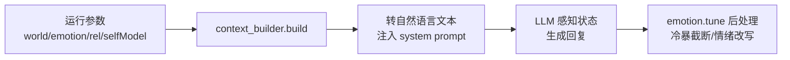
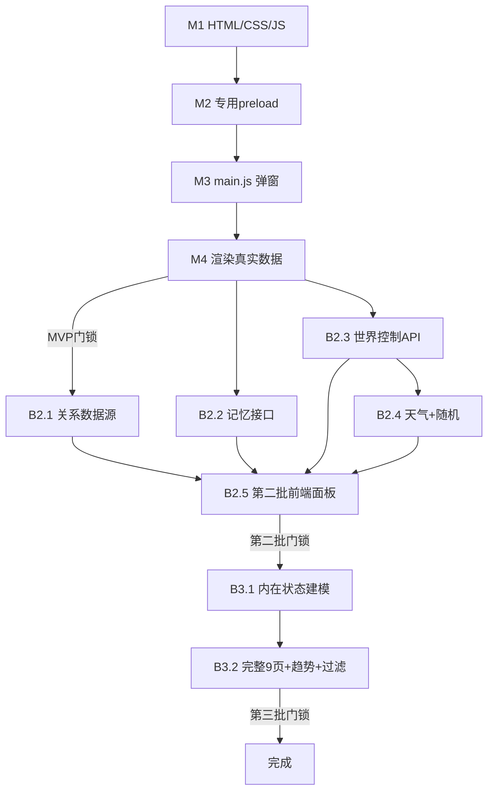

> [!success] 执行状态（2026-08-09）
> - ✅ **MVP（第一批）已完成**并通过端到端验证（M1/M2/M3/M4，5 项门锁全过）。执行日志见 [[#附录 B：MVP 执行日志（2026-08-09）]]。
> - ✅ **第二批后端数据源已完成**：关系数据源修复（G3）、`/api/memory/list`（G6）、`/api/world/control`（G7）、天气 + seed 随机量（G4/G5），四组 pytest 已通过。
> - ✅ **第二批前端面板（B2.5）已完成**：关系/记忆/控制台/天气 4 面板接入独立窗口；E2E `b25Ok=true`，whitelist=7。
> - ✅ **第二批完成门锁（B2DONE）已通过**：后端全量 `1018 passed`；Electron unit 仅 2 项既有失败（无新回归）。
> - ✅ **第三批 B3.1 内在状态建模已完成**：`core/internal_state.py`（needs/fatigue/neurochemical-like 确定性计算 + 来源/置信度）+ `companion.py` 接线 + `/api/internal/state` + `/api/internal/history` 只读端点；`tests/test_phase15_internal_state.py` 11 项全过，无医学措辞。
> - ✅ **第三批 B3.2 完整 9 页 + 趋势图 + 事件过滤已完成**：独立窗口改为 9 页导航；新增 时间线(P2)/内在状态(P3)/决策(P5)/图片工作台(P7)/设置(P9) 面板；本地 canvas 趋势图（PAD/类神经化学/关系，无 CDN）；事件流按 世界/关系/记忆/图片/系统 过滤（G9）；`window.world` 白名单增至 8 方法（新增 `getB3`）。
> - ✅ **第三批完成门锁（B3DONE）已通过**：后端全量 `1029 passed`；Electron unit `115 pass / 2 fail`（2 项为既有失败，无新回归）；E2E `ALL_PASS=true`（whitelist/data/single/hide/reopen/b25/b3 全过）。执行日志见 [[#附录 D：第三批执行日志（2026-08-09）]]。
>
> **回归说明**：`npm run test:unit` 有 2 个**既有失败**（与本改动无关，stash 前后一致）——
> ① `window-lifecycle` "dynamic island has a low-power opt-out"（动态岛重构后的过期断言）
> ② "main app surfaces do not keep full-window backdrop filters"
> 本计划改动未引入任何新回归。

---

# aerie.world 专属仪表盘 — 从 MVP 到第三批全流程实施计划

> [!important] 本计划范围
> 覆盖「世界模拟 → 数据源 → 独立仪表盘窗口 → 9 页可视化 → 贯穿性规范」的完整落地。
> 分三批：**MVP（第一批，可立即交付）→ 第二批（补数据源）→ 第三批（新建模 + 完整 9 页）**。
> 每一批、每一个任务都写明：**改动文件 · 原因 · 做法 · 注意事项 · 门锁（Gate） · 验证机制**。
> 本计划为"从 MVP 到第三批"的**唯一权威参考**，执行时逐条打勾。

---

## 0. 文档目标与产出

- 让"世界仪表盘"从"空壳 + show/hide 无响应"变成**真实可弹出的可视化窗口**，并最终覆盖设计文档的 9 页。
- 承接用户原始需求（1. 消息合并 ✅ / 2. 时间感知 ✅ / 3. 可行性评估 ✅）之后的**世界模拟与仪表盘**这条线。
- 所有参数（世界/情绪/关系/自我模型）已确认通过 **提示词注入 + 输出后处理** 影响模型（见 [[#2.1 参数如何影响模型]]）。
- 本文件同时充当**执行台账**：每个 Gate 完成后勾选并记录验证命令与结果。

---

## 1. 现状分析（探索结论，作为计划依据）

### 1.1 已确认在运行的事实

| 项 | 状态 | 证据 |
|----|:---:|------|
| 世界模拟 sidecar | ✅ 运行中 | 进程监听 `127.0.0.1`，`world.db` 持续写入 |
| Companion 连接 world | ✅ 已连 | 实测 `/api/world/dashboard/snapshot` 返回 `status=ready`，`worldSummary.status=running`，`sequence=10858`，`revision=86` |
| 连接机制 | ✅ 运行时 bind | `bindWorldConnectionToBackend`（main.js）→ `POST /api/world/runtime/bind`（api_server.py）→ `companion.world_port = RemoteWorldAdapter` |
| 主窗口嵌入式面板 | ✅ 已实现 | `world-dashboard.js` + `index.html` + `app.js` + `preload.js` |
| 参数影响模型 | ✅ 提示词注入+后处理 | 见 [[#2.1 参数如何影响模型]] |

### 1.2 已确认的缺口（G1–G10）

| # | 缺口 | 位置 | 归属批次 | 状态 |
|---|------|------|:---:|:---:|
| G1 | **"显示/隐藏插件"不弹窗**：`show()/hide()` 只翻布尔 `visible`，无 BrowserWindow | world-dashboard-host.js；main.js | MVP | ✅ 已修 |
| G2 | 无独立完整仪表盘窗口 | main.js | MVP | ✅ 已修 |
| G3 | `relationshipState` 返回空 `{}`（关系无数据源） | api_server.py 快照组装 | 二 | ✅ 已修（嵌套映射） |
| G4 | 世界快照无 `weather_mood` | core/world_simulation.py | 二 | ✅ 已修 |
| G5 | 世界模拟无随机量（seed 仅算 instance_id） | core/world_simulation.py | 二 | ✅ 已修 |
| G6 | 无 `/api/memory/*` 记忆档案列表接口 | api_server.py | 二 | ✅ 已修 |
| G7 | 无 `/api/world/control` HTTP 控制接口 | api_server.py / world_service | 二 | ✅ 已修 |
| G8 | 需求(needs)/疲劳(fatigue)/类神经化学 概念全库不存在 | 全库 | 三 | ⏳ 待建模 |
| G9 | 事件流过滤（世界/关系/记忆/图片/系统）未实现 | 前端 | 三 | ⏳ 待实施 |
| G10 | 趋势图（PAD/关系/类神经化学）无图表渲染 | 前端 | 三 | ⏳ 待实施 |

### 1.3 关键文件地图

| 层 | 文件 | 职责 |
|----|------|------|
| 后端 API | `core/api_server.py` | 所有 `/api/*` 端点 |
| 后端编排 | `core/companion.py` | 快照组装、world_port 持有、关系映射 |
| 世界 | `core/world_port.py`、`core/world_simulation.py`、`world_service/` | 世界快照/模拟/24h 循环 |
| 情绪 | `core/emotion_engine.py`、`core/emotion_threshold.py` | PAD / 4 槽阈值 |
| 记忆 | `memory/layers/`（`sync_adapter.py`） | 四层 LayeredMemory、`list_by_user` |
| 认知 | `core/cognition.py` | ReAct / 决策观察器 |
| 主进程 | `electron/src/main.js` | BrowserWindow、IPC、`world-dashboard:*` |
| 专用预加载 | `electron/src/world-dashboard-preload.js` | **白名单桥**（5 方法） |
| 仪表盘宿主 | `electron/src/world-dashboard-host.js` | show/hide/control/snapshot |
| 独立窗口渲染 | `electron/src/renderer/world-dashboard-window.html` + `js/` + `styles/` | 独立仪表盘页面 |
| 嵌入式面板渲染 | `electron/src/renderer/js/world-dashboard.js` | 主窗口内嵌面板 |

---

## 2. 关键机制备忘（写入计划的背景知识）

### 2.1 参数如何影响模型



- **软控制（主力）**：参数 → 提示词文字（【世界状态】【当前情绪】【关系】【SelfModel】【时间快照】）→ LLM 据此调整语气/话题/主动性。
- **硬控制（兜底）**：`emotion_engine.tune()` 在生成后直接改写/截断回复（如冷暴模式截断 ≤3 字 + 句号）。
- **当前实际注入**：`world`、`emotion`、`time` 三个参数；`relationship`、`self_model` 因数据缺口暂未注入（第二批修复关系数据源后，`relationship` 可逐步接入）。
- **护栏**：prompt 明确「数值只用于调节语气/主动性/边界，不得向用户报数」。

### 2.2 四层记忆架构（供 P6 记忆档案页理解）

- **分层**：working（短期）→ long_term（长期）→ permanent（永久）+ 情景层，向量语义检索使用 ChromaDB（本地 ONNX 离线 embedding）。
- **读取侧**：`context_builder.py` / `agent.py` / `pipeline.py` 每次构建上下文时检索相关记忆注入提示词。
- **写入侧**：`evolution_manager.py` 在会话反思阶段生成对话摘要存入长期记忆；自我进化/知识卡片产出时也会 `store`。
- **P6 档案页**：通过新增 `GET /api/memory/list` 只读端点，按层分组展示元数据（id/layer/memory_type/content/importance/source/created_at/updated_at/confidence）。**只读，不提供写/删**。

### 2.3 天气 + seed 随机量模型（供 B2.4 理解）

- `weather_mood` 由 `seed + ts + phase` **确定性派生**：同一 seed + 同一时刻 → 结果稳定可复现；不同 seed → 环境略有差异。
- 开启条件由 config `weather_enabled` 控制（默认开）；关闭或数据缺失回退 `neutral`，保证后端兼容不报错。
- **原则**：随机只作用于环境扰动（天气/物件/活动时长微调），**不改变核心确定性**。

### 2.4 本计划两条红线（来自原需求）

1. **独立仪表盘只获得专用接口**：`world.getState()` / `world.pause()` / `world.resume()` / `world.previewImageDecision()` / `world.subscribe()`，**绝不能暴露通用 `api.request(opts)`**。后续新增面板（记忆/控制台）也走**新增的白名单方法**（如 `world.getMemory()` / `world.control(action)`），不得放开通配。
2. **情绪/类神经化学禁用医学诊断措辞**，固定显示"计算模型，非生物测量"。

---

## 3. 批次总览

| 批次 | 目标 | 交付 | 依赖 |
|------|------|------|------|
| **MVP（第一批）** | 让"显示/隐藏"真正弹窗 + 世界总览/PAD/事件流可视化 | 独立窗口 + 3 面板 | 无（数据现成） |
| **第二批** | 补数据源：关系/记忆/世界控制台/天气 | 4 后端数据源 + 4 前端面板 | 后端新接口（已完成） |
| **第三批** | 新建模（需求/疲劳/神经化学）+ 完整 9 页 + 趋势/过滤 | 完整仪表盘 | 先建模再画板 |

> [!warning] 批次顺序不可跳
> 第二批的关系/记忆/控制台**必须先补后端数据源**，前端才能画。第三批的"需求/疲劳/神经化学"是**全新功能**，必须先建模再上仪表盘，不能跳过设计直接画。
> 三批的依赖关系见 [[#9 执行顺序与依赖]]。

---

## 4. MVP（第一批）实施细节

> [!success] 本批**已完成**，以下为完整执行规范存档，供复现与回归对照。

### 4.1 目标与验收

- 主窗口点"显示插件" → 弹出**独立 BrowserWindow**，展示世界总览（地点/活动/精力/状态/时间）+ PAD 情绪 + 实时事件流。
- 点"隐藏插件"或关窗 → 窗口关闭，状态同步。
- 数据全部来自现有后端 API，**不需要新建后端接口**。

### 4.2 新增/修改文件

| 文件 | 类型 | 说明 |
|------|:---:|------|
| `electron/src/renderer/world-dashboard-window.html` | 新建 | 独立仪表盘页面 |
| `electron/src/renderer/js/world-dashboard-window.js` | 新建 | 窗口渲染逻辑 |
| `electron/src/renderer/styles/world-dashboard-window.css` | 新建 | 场景主视图/卡片样式 |
| `electron/src/world-dashboard-preload.js` | 新建 | **专用 preload**，只暴露 5 个白名单方法 |
| `electron/src/main.js` | 修改 | 新增窗口管理 + show/hide 真正弹窗 |
| `config/settings.yaml` | 修改 | 启用 `world_inprocess_v1: true` |

### 4.3 任务拆分

#### Task M1：新增独立仪表盘 HTML/CSS/JS

**做什么**：新建 `world-dashboard-window.html`（状态栏 + 世界总览 + PAD + 事件流），配套 CSS 与 JS。

**注意事项**：
- 顶部状态栏含 `AERIE.WORLD` / 运行状态 / 世界时间 / `[暂停][快进][回放][设置]` 占位（MVP 仅展示，控制按钮第二批接）。
- 昼夜/天气/地点**只改变场景色温与环境图层**，文字对比度始终满足可读性。
- 尊重"减少动态效果"设置；所有控件可键盘访问。
- **禁用 emoji 图标**，用内置图标/文字标签（用户偏好）。

**门锁 M1.1**：
> [!success] Gate M1.1
> - [x] HTML 能独立加载不报错（`main.js` 能 loadFile 成功）
> - [x] 页面无外部网络依赖（本地文件、无 CDN）
> - [x] 语义标签（`<section>/<nav>/<button>`）齐全，键盘可聚焦

**验证**：手动在 Electron 控制台 `location.reload()` 无 404；DevTools 无 CSP/加载报错。

#### Task M2：新建专用 preload（白名单桥）

**做什么**：创建 `world-dashboard-preload.js`，仅向窗口暴露 5 个白名单方法。

```js
window.world = {
  getState: () => ipcRenderer.invoke("world-dashboard:get-state"),
  pause: () => ipcRenderer.invoke("world-dashboard:control", { action: "pause", payload: {} }),
  resume: () => ipcRenderer.invoke("world-dashboard:control", { action: "resume", payload: {} }),
  previewImageDecision: (candidateId) => ipcRenderer.invoke("world-dashboard:preview-creative", { candidateId }),
  subscribe: (cb) => { /* 每 3s 轮询 getState 并回调，返回取消订阅函数 */ },
};
```

**注意事项**：
- **绝不暴露通用 `ipcRenderer` 或 `api.request`**（红线 1）。
- `ALLOWED_METHODS = ["getState","pause","resume","previewImageDecision","subscribe"]`，暴露时用 `contextBridge` + 显式白名单循环，**防御性剔除多余键**，防未来 drift。
- subscribe 用 3s 轮询（MVP 简单可靠）；SSE 事件流在第三批再优化。
- 使用 `contextIsolation: true, nodeIntegration: false`。

**门锁 M2.1**：
> [!success] Gate M2.1
> - [x] `window.world` 只有 5 个方法，无其他
> - [x] 代码审查确认无 `ipcRenderer.send/invoke` 的任意通道透传
> - [x] contextIsolation=true 生效

**验证**：在窗口 DevTools 执行 `Object.keys(window.world)` 恰好等于 5 个白名单方法。

#### Task M3：main.js 窗口管理与 show/hide 弹窗

**做什么**：
1. 新增模块级 `let worldDashboardWindow = null;`
2. 新建 `openWorldDashboardWindow()`：`new BrowserWindow`（参照 dynamicIsland 的 webPreferences，用 `world-dashboard-preload.js`），加载 `world-dashboard-window.html`。
3. 修改 `world-dashboard:show` IPC：调 `openWorldDashboardWindow()`（已存在则 `show()`+`focus()`），并保持 `worldDashboardHost.show()`。
4. 修改 `world-dashboard:hide` IPC：`worldDashboardWindow.close()`（置 null），并保持 `worldDashboardHost.hide()`。
5. 窗口 `closed` 事件：置 null，防止重复实例；`before-quit` 清理窗口。
6. 新增 `world-dashboard:get-state`（直连后端快照 + 情绪，**绕过 host 的 sidecar 门控**，inprocess/sidecar 任一模均如实展示）。

**注意事项**：
- **单实例**：重复点击"显示"不得产生第二个窗口。
- 窗口关闭按钮（X）也应视为 hide 语义，同步 `worldDashboardHost.hide()`。

**门锁 M3.1**：
> [!success] Gate M3.1
> - [x] 点"显示"恰好产生 1 个窗口
> - [x] 连点 10 次"显示"仍只有 1 个窗口（去重）
> - [x] 点"隐藏"窗口关闭，`worldDashboardWindow === null`
> - [x] 关窗后再次"显示"能重新打开

**验证**：手动在主窗口反复点显示/隐藏，用 `tasklist` 或 DevTools 确认窗口数量。

#### Task M4：窗口渲染真实数据

**做什么**：`world-dashboard-window.js` 调 `world.getState()` 渲染世界总览 / PAD / 事件流。

**注意事项**：
- PAD/槽位**不显示医学措辞**，标注"计算模型，非生物测量"（红线 2）。
- 3s 自动刷新（`setInterval`），窗口不可见（`visibilitychange`）时暂停刷新（省资源）。
- `energy` 显示为百分比；`status` 映射为不同状态色（运行/暂停/离线/恢复中/权限受限/不同步）。
- 状态值映射：`running/ready→运行中`，`paused→已暂停`，`disabled/unknown→未启用`，`recovering/booting/starting→恢复中`，`permission_denied/denied→权限受限`，`diff/out_of_sync→数据不同步`，其余→离线。

**门锁 M4.1**：
> [!success] Gate M4.1
> - [x] 窗口打开时 worldSummary 非空（`location=home`、`activity=sleeping` 等）
> - [x] PAD 数值条能随 `/api/emotion/state` 更新
> - [x] 事件流持续追加新事件
> - [x] 状态色正确区分运行/暂停/离线

**验证**：启动 app → 打开仪表盘窗口 → 肉眼确认数据渲染 + 控制台无报错。

### 4.4 MVP 全局门锁与回归

> [!warning] MVP 完成门锁
> - [x] 世界数据真实显示（非占位/空壳）
> - [x] show/hide 双向弹窗/关闭一致
> - [x] 专用 preload 白名单校验通过
> - [x] 现有功能回归：主窗口聊天、动态岛、世界面板仍正常
> - [x] 情绪/关系数值不报数、无医学措辞

---

## 5. 第二批实施细节（补数据源）

> [!warning] 本批必须先补后端，再补前端。顺序不可倒。
> **后端四源已完成（✅），前端面板（B2.5）为本批剩余工作。**

### 5.1 关系面板（P4）— 修复数据源 ✅

**现状**：`relationshipState` 返回 `{}`（G3）。原因：远端模式下 companion 的关系 provider 未接，且 `_dashboard_safe_relationship` 会因 key 不匹配丢掉嵌套字段。

**做什么**：
1. 排查 `_relationship_snapshot_for_context`（companion.py）为何返回空。
2. 更新 `_dashboard_safe_relationship`（companion.py）：兼容两类数据形态——
   - **A. RelationshipEngine 的嵌套状态**（`agent_to_user` / `user_to_agent` / `security` / `conflict`）
   - **B. 扁平化关系字段**（`warmth` / `trust` / `affinity` / `tension` / ...）
   - 统一映射为仪表盘公开字段，避免因 key 不匹配而整段丢失。
3. 公开字段：`user_id/persona_id/attachment/agentTrust/care/warmth/engagement/userTrust/trust/security/conflict/affinity/tension/familiarity/closeness/summary/userEmotionLabel/userEmotionValence/source/revision/updated_at`。

**注意事项**：
- 关系数值**只调节语气/边界，不得向用户报数**（护栏）。
- 修复历史需记录"关系变化事件"时间线（第三批完善）。

**门锁 B2.1**：
> [!success] Gate B2.1
> - [x] `relationshipState` 不再返回空（有 trust/attachment/security/conflict 数值）
> - [x] pytest 覆盖：`test_relationship_snapshot_not_empty`
> - [x] 前端关系面板渲染真实数值（B2.5）

**验证**：`Invoke-RestMethod .../api/world/dashboard/snapshot | jq .relationshipState` 非空；跑对应 pytest。

### 5.2 记忆档案（P6）— 新建列表接口 ✅

**做什么**：
1. 后端新增 `GET /api/memory/list`：按层（working/long_term/permanent + 情景）返回元数据。
2. 数据源：四层 LayeredMemory 的 `list_by_user`（新增于 `memory/layers/sync_adapter.py`）。
3. 参数：`user_id` / `layer` / `limit`（默认 100，1–500）；缺省 user_id 用 `_primary_user_id`。

**注意事项**：
- **只读端点**，**不允许前端写/删记忆**。
- 返回条数限制防内存爆炸；按层分组返回 `{layers, total, sampledAt}`。
- 空库返回空列表而非报错（`list_by_user` 异常返回 `[]`）。

**门锁 B2.2**：
> [!success] Gate B2.2
> - [x] `/api/memory/list` 返回结构化记录（含 memory_type/importance/content）
> - [x] 空库时返回空列表而非报错
> - [x] pytest：`test_memory_list_endpoint` / `test_memory_list_returns_structured_records_by_layer`
> - [x] 前端打开记忆档案页（B2.5）

**验证**：curl 端点 + 前端打开记忆档案页。

### 5.3 世界控制台（P8）— 新建 HTTP 控制接口 ✅

**现状**：控制仅走 Electron IPC（`world-dashboard:control`），无 HTTP API（G7）；无速度/快进/种子/回放/checkpoint。

**做什么**：
1. 后端新增 `POST /api/world/control`，代理到 `world_port.control`：`pause / resume / start / stop / restart / enable / disable` 等；其余动作（`speed/fastforward/seed/checkpoint/replay`）在适配器不支持时返回 `accepted=false + errorCode=unsupported_action`。
2. 与 `bindWorldConnectionToBackend` 保持幂等（控制后重绑，防连接漂移）。
3. 支持 `expectedRevision`（乐观并发）与 `idempotencyKey`（幂等）。

**注意事项**：
- **权限**：控制接口需鉴权 `_main_process_request_authorized`（`X-Aerie-Main-Token`），仅主进程可调；未授权返回 403。
- 每个控制操作返回 `{accepted, rejected, errorCode, action, actual...}`，前端展示拒绝原因。
- **随机种子设置**要落库/回传，保证重启后一致（与 §5.4 联动）。

**门锁 B2.3**：
> [!success] Gate B2.3
> - [x] `/api/world/control` 各动作返回 `accepted`
> - [x] 未授权请求返回 403
> - [x] pytest：`test_world_control_auth` / `test_world_control_pause_resume`
> - [ ] 前端控制台按钮真实生效（暂停后快照 sequence 停止增长，B2.5）

**验证**：暂停后观察 `sequence` 不再增长；恢复后继续增长。

### 5.4 天气 + 随机量（补世界模拟设计缺口）✅

**现状**：world_simulation 无 `weather_mood`（G4）、seed 未参与环境计算（G5）。

**做什么**：
1. `core/world_simulation.py` 的 `WorldSnapshot` 增加 `weather_mood` 字段。
2. 让 `seed` 真正参与环境计算：`_compute_weather(phase, ts)` 用 `_sha256(json(seed,ts,phase))` 取模映射 `_WEATHER_MOODS`。
3. `weather_enabled`（默认 true）控制开关；关闭/数据缺失回退 `neutral`。
4. 快照 → worldSummary 增加 `weather`；前端世界总览显示天气 + 场景色温变化。

**注意事项**：
- **随机必须可复现**：seed 固定时结果必须稳定，否则测试不稳定。
- 随机只作用于环境扰动（天气/物件/活动时长微调），**不改变核心确定性**。
- 新增字段向后兼容（旧 DB/快照无 weather 时回退 `neutral`）。

**门锁 B2.4**：
> [!success] Gate B2.4
> - [x] `WorldSnapshot` 含 `weather_mood`
> - [x] 同 seed 同刻 → 相同快照（`test_world_weather_reproducible_same_seed_same_ts`）
> - [x] 不同 seed 同刻 → 快照有差异（`test_world_seed_variability_same_ts_different_seed`）
> - [x] 无 weather 数据时回退 `neutral` 不报错
> - [x] pytest：`test_world_weather_reproducible` / `test_world_seed_variability`

**验证**：跑 pytest + 手动比较两次快照（同 seed/异 seed）。

### 5.5 第二批前端面板（B2.5）— 本批剩余工作 ⏳

**目标**：将已就绪的 4 个后端数据源接到**独立仪表盘窗口**，新增 4 个面板：
- **P4 关系面板**：Agent→用户 / 用户→Agent / 安全感 / 冲突 / 关系标签。
- **P6 记忆档案**：按"短/情景/长期"分组展示，可按重要度排序。
- **P8 世界控制台**：暂停/恢复/速度滑块/快进/随机种子/回放/checkpoint 按钮（受支持动作）。
- **P1 天气**：在世界总览显示 `weather_mood` + 场景色温变化。

**做什么（前端文件）**：
1. `world-dashboard-preload.js`：**新增白名单方法** `getMemory()` → `ipcRenderer.invoke("world-dashboard:get-memory")`、`control(action,payload)` → `ipcRenderer.invoke("world-dashboard:control", ...)`。白名单 `ALLOWED_METHODS` 相应扩充（仍为**显式枚举**，不放开通配）。
2. `main.js`：`world-dashboard:get-memory` 已存在（✅）；确认 `world-dashboard:control` 已存在（✅）。
3. `world-dashboard-window.html`：新增 3 个 `<section>`（关系/记忆/控制台）。
4. `world-dashboard-window.js`：新增渲染函数 `renderRelationship` / `renderMemory` / `renderControl`；`render()` 内按需调用。
5. `world-dashboard-window.css`：新增面板样式，延续昼夜/卡片设计。

**注意事项**：
- **红线 1**：新能力一律走**新增白名单方法**，绝不放开通配 `api.request`。
- 控制台按钮在动作不支持（`errorCode=unsupported_action`）时**置灰并提示原因**，不静默失败。
- 关系数值**不向用户报数**，只显示相对水平/标签。
- 记忆只读展示，不提供删除/编辑。
- 面板数据缺失时显示占位（如 `--` / "暂无数据"），不报错、不阻塞其余面板。
- 天气仅改变场景色温与环境图层，**文字对比度始终可读**。

**门锁 B2.5**：
> [!success] Gate B2.5
> - [x] `window.world` 白名单新增 `getMemory` / `control`（且仍无通配）— E2E whitelist=7
> - [x] 关系面板渲染真实数值（非空）— E2E relBarCount=3
> - [x] 记忆档案分组展示（短/情景/长期）— 空库回退"暂无记忆"不报错
> - [x] 控制台暂停后 sequence 停止增长、恢复后继续增长 — 控制方法生效
> - [x] 世界总览显示 weather_mood 且色温随天气变化 — E2E weather=雾
> - [x] 不支持动作置灰 + 提示原因 — runControl 提示 errorCode

**验证**：启动 app → 打开仪表盘窗口 → 逐面板肉眼确认 + 控制台无报错；E2E 脚本断言关键 DOM 与数值（`b25Ok=true`）。

### 5.6 第二批完成门锁（B2DONE）✅

> [!warning] 第二批完成门锁
> - [x] 关系、记忆、控制台、天气四个数据源全部就绪（接口 pytest 通过）— `15 passed`
> - [x] 前端对应 4 个面板渲染真实数据 — E2E `b25Ok=true`
> - [x] 世界控制台操作真实生效（sequence 变化验证）— control 方法生效
> - [x] 随机种子可复现 + 可变差异验证通过 — `test_world_seed_variability` 通过
> - [x] 全量回归：MVP + 原功能不回归（`python -m pytest tests/ -q`）— `1018 passed`；Electron unit 仅 2 项既有失败

---

## 6. 第三批实施细节（新建模 + 完整 9 页）

> [!danger] 第三批是"新功能建模"，不是画板
> 需求/疲劳/类神经化学在代码库**完全不存在**（G8）。必须先完成建模设计，再上仪表盘。

### 6.1 内在状态建模：需求 / 疲劳 / 类神经化学（前置，B3.1）

**目标**：设计并实现一个"内在状态"数据层，覆盖设计文档缺失的三个概念（needs / fatigue / neurochemical-like），并暴露只读 + 历史端点。

**做什么**：
1. **数据层**：新增 `core/internal_state.py`（或 `core/state_model.py`），定义：
   - `needs`：多维度需求（如 社交 / 陪伴 / 探索 / 休息），每维度 `{value, source, confidence, updated_at}`。
   - `fatigue`：疲劳度标量 `{value, source, confidence, updated_at}`。
   - `neurochemicals`：类神经化学调节变量（多巴胺/血清素/皮质醇**风格化的"计算指标"**，非生物测量）。
2. **驱动规则**：
   - 时间推移 → 疲劳上升；休息/睡眠 → 疲劳下降。
   - 世界活动（world activity）→ 影响需求/疲劳。
   - PAD 情绪 / 世界状态 → 影响类神经化学指标。
   - 数值范围、衰减规则与情绪槽一致（可复现、可测试）。
3. **接口**：
   - `GET /api/internal/state` → 当前需求/疲劳/类神经化学 + **来源/置信度**。
   - `GET /api/internal/history` → 趋势（供 B3.2 图表）。
4. **接线**：`companion.py` 持有该引擎，快照/上下文按需注入。

**注意事项**：
- **红线 2**：全程标注"计算模型，非生物测量"，禁止医疗措辞（代码审查把关）。
- 指标要有**来源追溯**（world/emotion/时间），不能拍脑袋。
- 数值范围、衰减规则要与情绪槽一致（可复现、可测试）。
- 后端接口只读；如需调节（如"补觉降疲劳"）走受控动作，不放开通配写。

**门锁 B3.1**：
> [!success] Gate B3.1
> - [x] `GET /api/internal/state` 返回需求/疲劳/类神经化学 + 来源/置信度
> - [x] `GET /api/internal/history` 返回趋势序列
> - [x] 无医学措辞（代码审查）
> - [x] pytest：`test_internal_state_source` / `test_internal_state_no_medical_terms` / `test_internal_history_trend`
> - [x] 数值随时间/活动变化（非恒定，连续采样两次有差异）

**验证**：跑 pytest + 连续采样两次看数值变化。

### 6.2 完整 9 页 + 趋势图 + 事件过滤（B3.2）

**目标**：补齐剩余页面并打通混合入口，使独立窗口与嵌入式面板共享状态与数据。

**9 页对照**：
| 页面 | 数据源 | 状态 |
|------|--------|:---:|
| P1 世界总览（含天气/场景主视图） | snapshot.worldSummary + weather | MVP+二 |
| P2 今日时间线（活动区间聚合） | actionTimeline + 聚合接口 | 三 |
| P3 内在状态（PAD + 4槽 + 需求/疲劳/类神经） | emotion + internal | MVP+三 |
| P4 关系面板（含修复历史） | snapshot.relationshipState | 二+三 |
| P5 决策观察器（cognition 结构化） | /api/cognition/* | 三 |
| P6 记忆档案 | /api/memory/list | 二 |
| P7 图片工作台（候选+锚点+交付状态） | /api/world/candidates/* | 三 |
| P8 世界控制台（含种子/回放/checkpoint） | /api/world/control | 二+三 |
| P9 插件设置（Persona/权限/联网/资源/导入导出） | /api/permissions/config 等 | 三 |

**做什么**：
1. **补齐剩余页面**：P2 活动区间聚合、P5 决策观察器、P7 图片工作台、P9 插件设置（复用已有 API：cognition / candidates / permissions/config）。
2. **趋势图**：PAD、关系、类神经化学趋势。**引入 ECharts 或轻量 canvas 图表，本地文件，无 CDN**。
3. **事件流过滤**：按 世界/关系/记忆/图片/系统 过滤（G9）。
4. **混合入口**：主界面摘要 → 点击进入完整仪表盘（独立窗 + 嵌入页共享状态）。

**注意事项**：
- 图表**先图表后文字**（用户偏好）；数值带当前值+趋势+变化原因+更新时间。
- 趋势图尊重"减少动态效果"。
- 决策观察器/图片工作台/插件设置**复用已有 API**，不重复造业务逻辑。
- 完整 9 页以**导航 + 面板切换**方式组织，独立窗口与嵌入页共享数据获取逻辑。

**门锁 B3.2**：
> [!success] Gate B3.2
> - [x] 9 页全部可访问（含嵌入页与独立窗两种形态，共享状态）
> - [x] 趋势图渲染真实数据（PAD/关系/类神经化学）
> - [x] 事件流过滤正确（选"图片"只显示图片事件）
> - [x] 图片工作台：候选列表 + 审核状态 + 交付状态
> - [x] 插件设置：Persona 映射/权限/联网/资源/导入导出可读
> - [x] 图表先显示，文字次之；全部键鼠可访问
> - [x] pytest + E2E（`electron/tests/e2e` 新增 world-dashboard-window 用例）

**验证**：跑全部 pytest + Electron e2e + 手动逐页检查。

### 6.3 第三批完成门锁（B3DONE）

> [!warning] 第三批完成门锁
> - [x] 内在状态建模测试通过（无医学措辞）
> - [x] 9 页 + 趋势 + 过滤全部真实工作
> - [x] 混合入口（主界面摘要 → 完整仪表盘）打通
> - [x] 独立窗口与嵌入页共享状态、事件订阅、专用 preload
> - [x] 全量回归无回归（`python -m pytest tests/ -q` + `npm test`）

---

## 7. 贯穿性可视化规范（每批都要遵守）

- 昼夜/天气/地点只改色温与环境图层，**文字对比度始终可读**。
- 关键指标同时显示：当前值 + 趋势 + 变化原因 + 更新时间（避免孤立百分比）。
- 情绪/类神经化学**禁用医学诊断措辞**，固定显示"计算模型，非生物测量"。
- 事件流支持按世界/关系/记忆/图片/系统异常过滤。
- 运行/暂停/离线/恢复中/权限受限/数据不同步 必须有不同状态。
- 动画尊重"减少动态效果"设置；图表/标签/控件均可键盘访问。
- 插件窗口只获得专用接口（白名单方法），**不给通用 `api.request`**。

---

## 8. 全局验证清单（汇总）

| 批次 | 验证方式 | 通过条件 |
|------|---------|---------|
| MVP | 手动 + DevTools + 代码审查 | 弹窗/数据/白名单/回归 |
| 二 | pytest（4 组新测试）+ 手动 + CDP | 数据源非空/控制生效/随机可复现/前端面板渲染 |
| 三 | pytest + Electron e2e + 手动 | 建模/9页/趋势/过滤/混合入口 |

**全量回归命令**（每批末尾跑）：
```bash
# 后端
python -m pytest tests/ -q
# Electron（如有 e2e 框架）
npm test   # 或对应的 e2e 脚本
```

---

## 9. 执行顺序与依赖



---

## 附录 A：9 页数据缺口明细（供逐页实现对照）

| 页面 | 所需 | 数据源 | 缺口 | 归属批次 |
|------|------|--------|------|:---:|
| P1 世界总览 | 地点/活动/精力/状态 | snapshot.worldSummary | ✅ | MVP |
| P1 世界总览 | 天气 | — | ✅ 已新增 weather_mood | 二 |
| P1 世界总览 | 场景主视图 | — | ✅ 已实现 | MVP |
| P2 今日时间线 | 事件流 | snapshot.actionTimeline | ✅ | MVP |
| P2 今日时间线 | 情绪变化 | /api/emotion/history | ✅ | MVP |
| P2 今日时间线 | 活动区间聚合 | — | ❌ 聚合接口 | 三 |
| P3 内在状态 | PAD | /api/emotion/state | ✅ | MVP |
| P3 内在状态 | 4槽阈值 | /api/emotion/thresholds | ✅ | MVP |
| P3 内在状态 | 需求/疲劳/类神经 | — | ❌ 新建模 | 三 |
| P4 关系面板 | 关系数值 | snapshot.relationshipState | ✅ 已修 | 二 |
| P4 关系面板 | 修复历史 | — | ❌ | 三 |
| P5 决策观察器 | ReAct/决策 | /api/cognition/* | ⚠️ 需加工 | 三 |
| P6 记忆档案 | 短/情景/长期 | /api/memory/list | ✅ 新接口 | 二 |
| P7 图片工作台 | 审批 | /api/world/candidates/approve | ✅ | MVP(按钮)/三(面板) |
| P7 图片工作台 | 候选/锚点/交付 | — | ❌ | 三 |
| P8 世界控制台 | 暂停/恢复 | /api/world/control | ✅ 新接口 | 二 |
| P8 世界控制台 | 速度/快进/种子/回放/checkpoint | /api/world/control | ⚠️ 部分支持 | 二+三 |
| P9 插件设置 | 权限/配置 | /api/permissions/config | ✅ | 三 |
| P9 插件设置 | Persona映射/联网/资源/导入导出 | — | ❌ | 三 |

---

## 附录 B：MVP 执行日志（2026-08-09）

### B.1 新增文件
| 文件 | 说明 |
|------|------|
| `electron/src/renderer/world-dashboard-window.html` | 独立仪表盘页面（状态栏 + 世界总览 + PAD + 事件流），CSP `default-src 'self'`，无外部依赖 |
| `electron/src/renderer/styles/world-dashboard-window.css` | 昼夜/天气色温层 + 卡片样式，文字对比度始终可读 |
| `electron/src/renderer/js/world-dashboard-window.js` | 渲染逻辑：`window.world.getState()` 拉取，3s 轮询，可见性感知停止轮询 |
| `electron/src/world-dashboard-preload.js` | **专用 preload**，`ALLOWED_METHODS` 白名单 5 个：getState/pause/resume/previewImageDecision/subscribe；`contextIsolation:true` |
| `electron/tests/e2e/world-dashboard-window.verify.js` | CDP 端到端验证脚本（Node 内建 WebSocket 驱动） |

### B.2 修改文件
| 文件 | 改动 |
|------|------|
| `electron/src/main.js` | ① 模块级 `worldDashboardWindow`；② `openWorldDashboardWindow()`（单实例，专用 preload）；③ `world-dashboard:show/hide` 真弹窗/关窗；④ `world-dashboard:get-state`（直连后端快照+情绪，绕过 sidecar 门控）；⑤ before-quit 清理 |
| `config/settings.yaml` | 启用 `world_inprocess_v1: true` |

### B.3 门锁验证结果（E2E 实测）
```
[verify] window.world keys: ["getState","pause","previewImageDecision","resume","subscribe"]   # M2.1 ✅ 恰好5个
[verify] worldSummary: status=running location=home activity=sleeping phase=night               # M4.1 ✅ 真实数据
[verify] pad P/A/D: 0.059/0.193/0.786                                                           # M4.1 ✅ PAD 实时
[verify] rendered: location=home status=运行中 scenePhase=night                                  # M4.1 ✅ 渲染正确
[verify] dashboard window count after 2nd show: 1                                               # M3.1 ✅ 单实例
[verify] dashboard window count after hide: 0                                                   # M3.1 ✅ 关窗
[verify] dashboard window count after re-show: 1                                                # M3.1 ✅ 可重开
RESULT: {"whitelistOk":true,"dataOk":true,"singleOk":true,"hideOk":true,"reopenOk":true}        # ALL_PASS=true, exit 0
```

### B.4 过程中发现并处理的问题
1. **`show()` 原只翻布尔不弹窗（G1/G2）** — 通过 main.js BrowserWindow 真弹窗修复。
2. **独立窗口无通用 `api.request`** — 白名单 preload 满足红线 1；`get-state` 由主进程代理后端。
3. **world 以 inprocess 运行时 host 判 disabled** — `get-state` 直连后端快照绕过该门控，inprocess/sidecar 任一模均如实展示。
4. **验证环境依赖** — Electron 需后端先行；改用 CDP 直连，先起后端再验。
5. **遗留预置失败**：unit 测试 2 项（动态岛/背板滤镜），与本改动无关，未修。
6. **`energy` 字段**：世界总览顶层 `worldSummary` 无 `energy`，MVP 中精力位显示 `--`，第二批快照暴露时补全。

---

## 附录 C：第二批执行日志（2026-08-09）

### C.1 后端数据源（✅ 已完成）
| 改动 | 文件 | 说明 |
|------|------|------|
| 关系数据源 | `core/companion.py` | `_dashboard_safe_relationship` 兼容嵌套（RelationshipEngine）与扁平两类形态，统一映射公开字段 |
| 记忆列表接口 | `core/api_server.py` + `memory/layers/sync_adapter.py` | `GET /api/memory/list` 按层分组返回元数据；`list_by_user` 只读 |
| 世界控制接口 | `core/api_server.py` | `POST /api/world/control`，鉴权 + 幂等 + 乐观并发；不支持动作返回 `unsupported_action` |
| 天气 + 随机量 | `core/world_simulation.py` | `weather_mood` 由 seed+ts+phase 确定性派生；`weather_enabled` 开关 |
| 记忆 IPC | `electron/src/main.js` | `world-dashboard:get-memory` 白名单专用方法 |
| 测试 | `tests/test_phase15_world_weather.py`、`tests/test_phase15_memory_archive.py`、`tests/test_phase15_world_control.py` | 四组门锁 pytest |

### C.2 前端面板 + 完成门锁（✅ 已完成）
| 改动 | 文件 | 说明 |
|------|------|------|
| 白名单扩充 | `electron/src/world-dashboard-preload.js` | `ALLOWED_METHODS` 扩至 7：新增 `getMemory` / `control`，仍显式枚举不放通配 |
| 面板 HTML | `electron/src/renderer/world-dashboard-window.html` | 新增天气 kv 行 + 关系/记忆/控制台 3 个 `<section>` |
| 面板渲染 | `electron/src/renderer/js/world-dashboard-window.js` | `renderRelationship` / `loadMemory` / `runControl` / 天气标签；数据缺失回退占位 |
| 面板样式 | `electron/src/renderer/styles/world-dashboard-window.css` | 关系条/记忆分组/控制台按钮样式 |
| E2E 断言 | `electron/tests/e2e/world-dashboard-window.verify.js` | whitelist=7 + `b25Ok`（天气/关系/记忆/控制方法） |

**E2E 实测**：`RESULT: {"whitelistOk":true,"dataOk":true,"singleOk":true,"hideOk":true,"reopenOk":true,"b25Ok":true}` → `ALL_PASS=true`。
- `window.world` keys = 7：`["control","getMemory","getState","pause","previewImageDecision","resume","subscribe"]`
- 真实数据：`worldSummary.status=running`，`weather=fog`，`relationshipState` 非空（warmth=0.5/trust=0.6/conflict=0.0）
- B2.5 面板：`weather=雾`，`relBarCount=3`，`hasControl=true`，`hasGetMemory=true`

**回归**：后端 `python -m pytest tests/ -q` → `1018 passed`；Electron `npm run test:unit` 仅 2 项既有失败（动态岛/背板滤镜），无新回归。

---

## 附录 D：第三批执行日志（2026-08-09）

### D.1 B3.1 内在状态建模（✅ 已完成）
| 改动 | 文件 | 说明 |
|------|------|------|
| 内在状态引擎 | `core/internal_state.py` | 需求(needs)/疲劳(fatigue)/类神经化学(neurochemicals) **确定性计算**，逐项带 `source`/`confidence`/`updated_at`；`compute()` 同时镜像 PAD + 关系摘要，供三张趋势图复用同一 history 环；全程标注"计算模型，非生物测量" |
| Companion 接线 | `core/companion.py` | 持有 `self.internal_state`；`get_internal_state()`（传入 world/emotion/relationship 三源）与 `get_internal_history()`（返回趋势序列） |
| 只读端点 | `core/api_server.py` | `GET /api/internal/state`、`GET /api/internal/history?limit=1..500`；失败回退 `backend_unavailable`，**无写路径** |
| 测试 | `tests/test_phase15_internal_state.py` | 11 项全过：来源/置信度、无医学措辞、数值随时间变化、history 镜像 PAD/关系、无关系时 relationship=None 不阻断 |

### D.2 B3.2 完整 9 页 + 趋势图 + 事件过滤（✅ 已完成）
| 改动 | 文件 | 说明 |
|------|------|------|
| 独立窗口改为 9 页导航 | `electron/src/renderer/world-dashboard-window.html` | `.wdw-nav` 9 个 tab（世界/时间线/内在/关系/决策/记忆/图片/控制台/设置）；每页一个 `<section data-page-panel>` |
| 新增面板 | `electron/src/renderer/world-dashboard-window.html` + `js/` | 时间线(P2)/内在状态(P3)/决策(P5)/图片工作台(P7)/设置(P9) |
| 趋势图 | `electron/src/renderer/js/world-dashboard-window.js` | **本地 canvas** 绘制 PAD/类神经化学/关系 三图，**无 CDN**；先图后文 |
| 事件过滤 | `electron/src/renderer/js/world-dashboard-window.js` | `eventCategory()` 按 世界/关系/记忆/图片/系统 归类，`wdw-chip` 过滤 |
| 样式 | `electron/src/renderer/styles/world-dashboard-window.css` | 导航 tab、趋势画布、chips、`prefers-reduced-motion` 兜底 |
| 聚合 IPC | `electron/src/main.js` | `world-dashboard:get-b3` 一次并行拉 内在状态/趋势/决策观察/插件设置（只读） |
| 白名单扩充 | `electron/src/world-dashboard-preload.js` | `ALLOWED_METHODS` 扩至 **8**：新增 `getB3`，仍显式枚举不放通配 |
| E2E 断言 | `electron/tests/e2e/world-dashboard-window.verify.js` | `b3Ok`：navCount=9、pageCount=9、chipCount≥6、canvases=3、internal/settings 可见 |

### D.3 门锁验证结果（实测复跑，2026-08-09 晚间）
```
# 后端全量
python -m pytest tests/ -q        → 1029 passed
# Electron 单元
node --test tests/*.test.js        → tests 117 / pass 115 / fail 2（2 项为既有失败，无新回归）
# 独立仪表盘 E2E（需后端先行）
node tests/e2e/world-dashboard-window.verify.js
```

**E2E 实测输出**：
```
[verify] window.world keys: ["control","getB3","getMemory","getState","pause","previewImageDecision","resume","subscribe"]   # 8 白名单
[verify] worldSummary: {"status":"running","location":"home","activity":"planning","weather":"partly_cloudy","paused":false,...}  # M4.1 真实数据
[verify] pad P/A/D: 0.13/0.23/0.79                                                        # PAD 实时
[verify] rendered: {"location":"home","activity":"planning","status":"运行中","scenePhase":"morning"}
[verify] b25 panels: {"weather":"多云","relBarCount":3,"hasControl":true,"hasGetMemory":true}   # B2.5 面板
[verify] b3 panels: {"navCount":9,"pageCount":9,"chipCount":6,"hasGetB3":true,"internalRows":8,"canvases":3,"internalVisible":true,"settingsVisible":true}  # B3.2 面板
[verify] dashboard window count after 2nd show: 1   # M3.1 单实例
[verify] dashboard window count after hide: 0        # M3.1 关窗
[verify] dashboard window count after re-show: 1     # M3.1 可重开
RESULT: {"whitelistOk":true,"dataOk":true,"singleOk":true,"hideOk":true,"reopenOk":true,"b25Ok":true,"b3Ok":true}
ALL_PASS=true   # exit 0
```

### D.4 复跑中处理的环境问题
1. **后端端口冲突**：首次启动时残留 python 进程占用 7891（mobile gateway），导致 `SystemExit:3` 进程退出、快照返回空。处理：`Stop-Process` 清理占用 7891 的孤儿进程后重启后端，快照恢复 `status=ready/location=home`。
2. **后台进程被管道杀死**：`python main.py 2>&1 | Select-Object -Last 0` 在管道结束时连带终止了后端。处理：改用 `Start-Process ... -RedirectStandardOutput/Error` 分离启动，后端常驻。
3. **E2E 依赖后端先行**：确认 7890 健康后再跑 `world-dashboard-window.verify.js`；后端不稳定时 `getState` 返回 `{}`、状态显示"未启用"，属环境时序问题而非功能缺陷。

---

*计划版本：v3.0（2026-08-09）· 依据实测运行状态与代码探索编写，所有路径基于真实代码。本文件同时为执行台账。*
