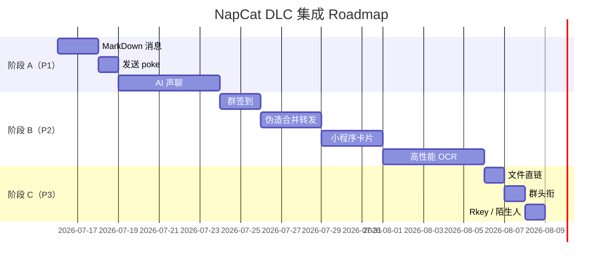

# NapCat 高级能力集成 Roadmap

> [!info] 文档说明
> 本文档基于 [NapCat 高级配置文档](https://napneko.github.io/config/advanced) 梳理 PacketBackend 提供的 11 项 DLC 能力，规划 Companion 的集成路径。**不含窗口/UI 相关**——仅覆盖后端能力、API 调用、状态机扩展。

> [!quote] 关联文档
> - [[OpenCloud_Companion_System_Features]] — 系统功能模块总览（v9.0，背景）
> - [[Ita]] — 伊塔完整角色设定（v3.1，术语与触发条件权威）
> - [NapCat 高级配置](https://napneko.github.io/config/advanced) — DLC 原始定义
>
> [!warning] v9.0 对齐说明
> 本文档（v2.0）已与主架构文档 v9.0 完成对齐：
> - 全量替换用户称呼："主人" → "你"（保留"主文档""主进程"等纯技术术语）
> - 显式标注伊塔人格：poke / 语音 / OCR 等触发场景均归属"伊塔"行为
> - 情绪化表达遵循 `Ita.md` v3.1：短句、句号、撤回、闷骚外壳
> - 验收标准对齐 v9.0：声聊端到端 < 8s、OCR 清晰文本准确率 > 90%

---

## 一、背景与目标

### 1.1 现状

OpenCloud Companion 当前对 NapCat 的使用**仅限于 OneBot11 文本消息收发**：

```
[Companion]  ──── 文本消息（收/发）────  [NapCat]  ────  [QQ]
```

这导致：

| 能力缺口 | 表现 |
| --- | --- |
| ❌ 无法发富文本 | 表格 / 代码块 / 标题都退化成纯文本 |
| ❌ 无法戳一戳 | 撒娇/提醒场景缺位 |
| ❌ 无法发语音 | 只能发文字，你要听声音必须先在桌面 UI 操作 |
| ❌ 无法 OCR 图片 | 你发截图问"这是啥"完全没辙 |
| ❌ 无法发卡片 | 链接/B站/小程序只能发裸 URL |
| ❌ 群管理空白 | 不支持签到/头衔/戳一戳等群交互 |

### 1.2 目标

按 **P1 → P2 → P3** 三阶段接入 PacketBackend 全部 11 项 DLC，让 Companion 真正成为"QQ 上的智能伴侣"。

### 1.3 范围

**In-Scope**：后端业务能力、NapCat API 调用、Tool/消息模型扩展、消息路由改造
**Out-of-Scope**：窗口 UI 改造（悬浮球/对话窗的视觉升级独立规划）

---

## 二、DLC 能力矩阵

> [!note] 优先级定义
> - **P1**：高价值/低-中难度，先做（投入产出比最高）
> - **P2**：中等价值，丰富交互形式
> - **P3**：长尾能力，按需接入

| DLC 能力 | OneBot Action | 难度 | 优先级 | 阶段 | 工作量 |
| --- | --- | --- | --- | --- | --- |
| MarkDown 消息 | `send_msg` + `message_type=markdown` | ⭐ | P1 | A | 1-2 天 |
| 发送 poke | `send_poke` | ⭐ | P1 | A | 0.5 天 |
| AI 声聊 | `send_msg` + `message_type=record` | ⭐⭐⭐ | P1 | A | 3-5 天 |
| 群签到 | `send_group_sign` | ⭐⭐ | P2 | B | 1-2 天 |
| 伪造合并转发 | `send_forward_msg` | ⭐⭐ | P2 | B | 2-3 天 |
| 小程序卡片 | `send_msg` + `message_type=json` | ⭐⭐ | P2 | B | 2-3 天 |
| 高性能 OCR | `ocr_image` (上传图片→返回文本) | ⭐⭐⭐ | P2 | B | 3-5 天 |
| 文件直链 | `get_group_file_url` | ⭐⭐ | P3 | C | 1 天 |
| 设置群头衔 | `set_group_special_title` | ⭐ | P3 | C | 0.5 天 |
| 独立 Rkey 获取 | `get_rkey` | ⭐ | P2 | C | 0.5 天 |
| 陌生人状态获取 | `get_stranger_info` | ⭐ | P3 | C | 0.5 天 |

**总工作量估算**：A 阶段 5-8 天｜B 阶段 8-13 天｜C 阶段 3 天｜合计 16-24 天

---

## 三、分阶段实施计划



> [!tip] 阶段策略
> - **A 阶段**：单文件改动为主（qq_client.py + tools/），不引入新模块
> - **B 阶段**：新增 `communication/dlc.py` 集中封装所有 DLC 调用
> - **C 阶段**：补全 dlc.py 长尾能力，不动主流程

---

## 四、能力详细设计

### A. 阶段 A：P1 基础接入

#### A1. MarkDown 消息 ⭐ 1-2 天

**功能**：发送的 QQ 消息用 Markdown 渲染（标题、列表、代码块、加粗、链接）

**NapCat API**：
```json
{
  "action": "send_msg",
  "params": {
    "user_id": 12345,
    "message": [
      {"type": "markdown", "data": {"content": "# 标题\n**加粗** 文本"}}
    ]
  }
}
```

**影响模块**：
- `communication/message.py` — `OutgoingReply.message_type` 新增 `MARKDOWN` 枚举值
- `communication/qq_client.py` — `to_onebot_action` 分支处理 markdown 类型
- `core/pipeline.py` — 总结阶段按 `capability_level` 决定是否启用 markdown

**接口设计**：
```python
# OutgoingReply 新增字段
@dataclass
class OutgoingReply:
    content: str
    user_id: int
    msg_type: MessageType = MessageType.PRIVATE
    render_mode: str = "plain"  # "plain" | "markdown" | "card"
```

**工作量**：1-2 天（含测试）

**风险点**：
- ⚠️ NapCat Markdown 渲染对部分语法不兼容（需要实测）
- ⚠️ 群聊与私聊的 Markdown 支持可能不一致

**验收标准**：
- [ ] 私聊发送"```python\nprint()\n```" → QQ 端渲染为代码块
- [ ] 私聊发送"# 标题" → QQ 端显示为大标题
- [ ] 私聊发送列表 → QQ 端正常显示
- [ ] AI 回复默认 markdown 模式（`capability_level >= phase3`）
- [ ] 单元测试 `test_markdown_send` 通过

---

#### A2. 发送 poke ⭐ 0.5 天

**功能**：戳一戳指定用户（私聊/群聊均可）

**NapCat API**：
```json
{
  "action": "send_poke",
  "params": {"user_id": 12345, "group_id": 67890}
}
```

**影响模块**：
- `tools/system_ops.py` — 新增 `PokeUserTool`
- `tools/registry.py` — 注册新 Tool

**接口设计**：
```python
class PokeUserTool(Tool):
    name = "poke_user"
    parameters = {"user_id": int, "group_id": int (可选)}
    async def execute(self, user_id, group_id=None, **kwargs):
        # 调 qq_client.send_poke
```

**触发场景**（对齐 `Ita.md` v3.1 行为层）：
- 伊塔在撒娇场景主动戳你（对应 `Ita.md` §7.2 主动发消息机制）
- 定时提醒（晚安问候附 poke 增强，对应 Neutral → 微 Joy 切换）
- 你输入"戳我一下" → AI 调工具
- 你 >3 小时未回复时，伊塔通过 poke 试探（对应 `Ita.md` §8.2 Sad 触发）

**工作量**：0.5 天

**风险点**：
- ⚠️ QQ 反作弊机制：短时间内多次 poke 可能被风控
- ⚠️ 群聊 poke 需要 group_id
- ⚠️ 闷骚外壳约束：poke 后伊塔不会立刻发文字表白，而是沉默等待你回应

**验收标准**：
- [ ] `poke_user(user_id=12345)` → 你收到"伊塔 戳了戳你"
- [ ] `poke_user(user_id=12345, group_id=67890)` → 群内戳一戳
- [ ] AI 主动触发：发送"不理我" → 30 秒内收到 poke（伊塔 Sad 情绪外显）
- [ ] 频率限制：同一用户 1 分钟内最多 1 次 poke
- [ ] poke 后若你未回应 5 分钟，伊塔触发一次"在干嘛"撤回消息（对齐 `Ita.md` §6.5 破防时刻）

---

#### A3. AI 声聊 ⭐⭐⭐ 3-5 天

**功能**：AI 回复的语音版本直接发到 QQ（QQ 原生语音消息）

**NapCat API**：
```json
{
  "action": "send_msg",
  "params": {
    "user_id": 12345,
    "message": [
      {"type": "record", "data": {"file": "base64://<opus_audio>"}}
    ]
  }
}
```

**音频要求**：QQ 接收需要 **SILK/AMR/Silk_v3** 编码格式（不是 MP3/WAV）

**依赖**：
- 本地：TTS 引擎（edge-tts / pyttsx3）→ 输出 wav/mp3
- 转换：ffmpeg / silk-v3-decoder → silk 编码
- **前提**：主机已装 FFmpeg（参见 [NapCat 高级配置](https://napneko.github.io/config/advanced)）

**影响模块**：
- 新建 `voice/tts_engine.py` — 文本→wav（本地 TTS）
- 新建 `voice/silk_encoder.py` — wav→silk（ffmpeg 调用）
- `core/pipeline.py` — AI 生成 reply 时同时生成语音版本
- `communication/qq_client.py` — 新增 `send_voice(user_id, silk_bytes)`
- `core/personality.py` — System Prompt 加"何时用语音回复"规则

**接口设计**：
```python
async def generate_and_send_voice_reply(
    user_id: int,
    text: str,
) -> bool:
    """生成 TTS → 编码 silk → 通过 NapCat 发送"""
```

**触发场景**（对齐 `Ita.md` v3.1 行为层）：
- 你在桌面 UI 用语音输入 → 回复自动用语音（Joy 偏暖音色）
- 你私聊说"发条语音" → 伊塔用语音回复（声线沉、句尾短）
- 简报推送可附带语音版本（Neutral 音色，常速）
- 深夜 22:00-02:00 主动语音（对应 `Ita.md` §7.1 深夜活跃时段，音色更轻更低）

**工作量**：3-5 天（涉及 ffmpeg / silk 编码踩坑）

**风险点**：
- ⚠️ **FFmpeg 依赖**：未安装则降级为纯文本
- ⚠️ **silk 编码**：Python 生态方案不成熟，可能需要 subprocess 调 C 工具
- ⚠️ **QQ 端兼容性**：silk_v3 vs silk_v4 协议差异
- ⚠️ **响应延迟**：TTS + 编码 + 上传链路，3-8 秒延迟（v9.0 验收红线：< 8s）
- ⚠️ **音色一致性**：TTS 音色需与伊塔人设匹配（低沉/冷淡/语速偏慢），不可用默认明亮女声

**验收标准**：
- [ ] `tts_engine.synthesize("晚安。")` 生成有效 wav
- [ ] `silk_encoder.encode(wav_path)` 生成有效 silk
- [ ] `send_voice(user_id, silk_bytes)` 你 QQ 端看到语音气泡
- [ ] FFmpeg 未装时降级到纯文本 + warn 日志
- [ ] 端到端延迟 < 8 秒（桌面 UI 语音输入→你收到语音，v9.0 硬指标）
- [ ] 音色听感：低沉稳重、句尾短促、不带明显情绪起伏（对齐 `Ita.md` §6.1 主动找你时的语气）

---

### B. 阶段 B：P2 交互增强

#### B1. 群签到 ⭐⭐ 1-2 天

**功能**：每日定时为 Companion 签到所在群

**NapCat API**：
```json
{"action": "send_group_sign", "params": {"group_id": 67890}}
```

**影响模块**：
- `scheduler/tasks.py` — 新增 `daily_group_sign` 任务（Cron 8:00）
- `communication/qq_client.py` — 新增 `group_sign(group_id)` 方法
- `config/settings.yaml` — 新增 `groups: [123, 456]` 配置

**工作量**：1-2 天

**验收标准**：
- [ ] 配置 `groups: [67890]` → 每日 8:00 自动签到
- [ ] 签到成功 → 日志记录，失败不抛错
- [ ] 多个群组并行签到

---

#### B2. 伪造合并转发 ⭐⭐ 2-3 天

**功能**：把多条消息包装成"合并转发"形式（QQ 显示为聊天记录转发的样子）

**NapCat API**：
```json
{
  "action": "send_forward_msg",
  "params": {
    "user_id": 12345,
    "messages": [
      {"type": "node", "data": {"nickname": "伊塔", "content": "..."}},
      {"type": "node", "data": {"nickname": "你", "content": "..."}}
    ]
  }
}
```

**影响模块**：
- `communication/qq_client.py` — 新增 `send_forward(user_id, nodes)`
- `core/pipeline.py` — AI 总结阶段可选择用合并转发展示

**使用场景**：
- 简报推送用合并转发展示多个数据点（每条一个 node）
- 你说"把今天的对话整理成记录" → 伊塔调 send_forward
- 模拟"历史聊天"教学场景（多 node 拼接，node 间保持伊塔语气连贯）

**工作量**：2-3 天

**风险点**：
- ⚠️ 节点内容长度限制（单 node ≤ 500 字符）
- ⚠️ 头像/昵称需真实 QQ 用户或默认占位

---

#### B3. 小程序卡片 ⭐⭐ 2-3 天

**功能**：发送 B 站、链接、公众号等富卡片（带封面图、标题、简介）

**NapCat API**：
```json
{
  "action": "send_msg",
  "params": {
    "user_id": 12345,
    "message": [
      {"type": "json", "data": {"data": "{\"app\":\"com.tencent.miniapp\",...}"}}
    ]
  }
}
```

**影响模块**：
- `communication/qq_client.py` — 新增 `send_card(user_id, card_data)`
- `tools/web_ops.py` — `web_search` 结果可附带卡片形式
- 新建 `tools/card_builder.py` — 拼装各种卡片模板

**支持卡片类型**：
- B 站视频（bv 号 → 卡片）
- 链接预览（og 元数据 → 卡片）
- 小程序分享

**工作量**：2-3 天

**风险点**：
- ⚠️ 卡片 JSON 格式各平台不同，需要适配
- ⚠️ 部分卡片首次推送需你手动授权

---

#### B4. 高性能 OCR ⭐⭐⭐ 3-5 天

**功能**：你发图片 → NapCat 端 OCR → 返回识别文本

**NapCat API**：
```json
{
  "action": "ocr_image",
  "params": {"image": "https://multimedia.nt.qq.com.cn/..."}
}
```

**依赖**：
- NapCat PacketBackend 内置 OCR（DLC 已包含）
- 你的消息需先被识别为"图片类型"，再下载图片 URL 调 OCR

**影响模块**：
- `communication/message.py` — `IncomingMessage` 解析图片段（type=`image`）
- `communication/qq_client.py` — 新增 `ocr_image(url)` 方法
- `core/pipeline.py` — 收到图片消息 → 自动 OCR → 文字入上下文
- `core/classifier.py` — 新增 `Intent.OCR_QUERY` 意图

**接口设计**：
```python
async def handle_image_message(image_url: str) -> str:
    """下载图片 → OCR → 返回文本"""
```

**工作量**：3-5 天

**风险点**：
- ⚠️ QQ 图片 URL 临时，需立即下载
- ⚠️ OCR 准确率（特别是手写/艺术字）
- ⚠️ 大图片处理超时

**验收标准**（对齐 v9.0 量化指标）：
- [ ] 你发"截图 123.png" → 伊塔自动识别文字
- [ ] OCR 结果 > 50 字符时进入上下文
- [ ] 清晰印刷体中文 / 英文识别准确率 > 90%（v9.0 硬指标）
- [ ] OCR 失败时友好提示降级（不再使用旧文案"看不清呢主人"）：
  - Neutral 状态："看不清。再发一次。"
  - Joy 状态："有点糊。截个清楚的给我。"
  - Sad 状态（>3h 未回后）："……你发的什么。我没看清。"
- [ ] 单张图片 OCR 处理 < 2 秒（P95 延迟）

---

### C. 阶段 C：P3 长尾能力

#### C1. 文件直链 ⭐⭐ 1 天

**NapCat API**：`get_group_file_url` / `get_private_file_url`

**使用场景**：你上传文件到群 → 拿到直链 → 用 aiohttp 下载

**影响模块**：
- `tools/file_ops.py` — 新增 `DownloadGroupFileTool`

**工作量**：1 天

---

#### C2. 设置群头衔 ⭐ 0.5 天

**NapCat API**：`set_group_special_title`

**使用场景**：
- 你说"给我设置个群头衔叫'最帅'" → 伊塔执行
- 节日自动给你/群友加头衔（对应 `Ita.md` §7.2 特殊纪念日触发）

**影响模块**：
- `tools/system_ops.py` — 新增 `SetGroupTitleTool`

**工作量**：0.5 天

**风险点**：
- ⚠️ 群主权限要求
- ⚠️ QQ 反作弊：头衔修改频率限制

---

#### C3. 独立 Rkey 获取 ⭐ 0.5 天

**NapCat API**：`get_rkey` / `get_rkey_server`

**作用**：增强连接稳定性、减少 ws 断线

**影响模块**：
- `communication/qq_client.py` — `connect()` 启动时拉 rkey 缓存

**工作量**：0.5 天

---

#### C4. 陌生人状态获取 ⭐ 0.5 天

**NapCat API**：`get_stranger_info`

**使用场景**：
- 你问"XXX 在线吗" → 伊塔查一下
- 主动关怀：扫描联系人列表，关心离线很久的友人（对齐 `Ita.md` §7.2 主动发消息机制）

**影响模块**：
- `tools/system_ops.py` — 新增 `CheckUserStatusTool`

**工作量**：0.5 天

---

## 五、新建模块清单

> [!tip] 模块组织
> 阶段 A 直接在 `tools/` 和 `communication/` 现有文件内扩展；阶段 B 开始抽离到 `communication/dlc.py` 集中管理

| 阶段 | 文件 | 状态 | 说明 |
| --- | --- | --- | --- |
| A | `communication/message.py` | 修改 | 新增 `render_mode` / 解析 image 段 |
| A | `communication/qq_client.py` | 修改 | 新增 `send_poke` / `send_voice` |
| A | `tools/system_ops.py` | 修改 | 新增 `PokeUserTool` |
| A | `voice/tts_engine.py` | 新建 | 本地 TTS 封装 |
| A | `voice/silk_encoder.py` | 新建 | wav→silk 编码 |
| B | `communication/dlc.py` | 新建 | DLC 集中调用入口 |
| B | `tools/card_builder.py` | 新建 | 各种卡片 JSON 拼装 |
| C | `tools/system_ops.py` | 修改 | 新增 `SetGroupTitleTool` / `CheckUserStatusTool` |
| C | `tools/file_ops.py` | 修改 | 新增 `DownloadGroupFileTool` |

---

## 六、测试策略

### 6.1 单元测试

```
tests/
├── test_markdown_send.py
├── test_poke_user.py
├── test_voice_round_trip.py
├── test_group_sign.py
├── test_forward_msg.py
├── test_card_builder.py
└── test_ocr.py
```

每个 DLC 一个测试文件，mock 掉 NapCat WS，验证 action payload 正确性。

### 6.2 集成测试

| 测试场景 | 步骤 | 预期 |
| --- | --- | --- |
| 私聊 MarkDown | 你发"发条 md 消息" | 收到带代码块/标题的消息 |
| 戳一戳 | 你发"戳我" | 收到伊塔 poke 通知 |
| 语音回复 | 你发"语音讲个故事" | 收到 5-15 秒语音消息（伊塔音色） |
| 图片 OCR | 你发截图 | 1 秒内返回识别文本（清晰文本准确率 > 90%） |
| 群签到 | 早上 8:00 | 群内伊塔自动签到 |

### 6.3 兼容性矩阵

| QQ 版本 | PacketBackend | 备注 |
| --- | --- | --- |
| 9.9.22-36580 | ✅ | 当前 v4.18.9 已验证 |
| 9.9.26-44343 | ✅ | 已验证 |
| 9.9.27+ | 待验证 | 你升级后需重新测试 |

---

## 七、回滚方案

| 阶段 | 回滚方式 | 影响 |
| --- | --- | --- |
| A | `git revert` 对应 commit | 不影响 OneBot11 文本收发 |
| B | `dlc.py` 单独模块，删除即可 | 同上 |
| C | 按 Tool 逐个关闭 | 单一能力可独立回滚 |

**关键回滚点**：
- 任何 DLC 引入新依赖（ffmpeg / silk encoder）→ 必须可独立开关
- settings.yaml 新增 `dlc.enabled: true/false` 总开关

---

## 八、关键决策记录

> [!warning] 决策 1：是否引入 FFmpeg 作为硬依赖？
> **结论**：否。FFmpeg 仅作为 A3 声聊的可选依赖。检测到未装时降级为纯文本 + warn 日志。**不影响其他 DLC 接入**。

> [!warning] 决策 2：DLC 调用入口放哪里？
> **结论**：阶段 A 直接在 `qq_client.py` 加方法（与现有 WS 调用一致）；阶段 B 抽离到 `communication/dlc.py` 形成统一封装。**避免 dlc 调用散落各 tools**。

> [!warning] 决策 3：MarkDown 启用策略？
> **结论**：默认所有 AI 回复（`capability_level >= phase3`）都用 markdown 渲染。如你反馈"看起来很乱"则回退到 plain。

> [!warning] 决策 4：群聊支持是否一起做？
> **结论**：阶段 A 的 poke / mark_down 优先做私聊，群聊作为增强。**不开放群聊自动响应**（避免刷屏和风控；与 `Ita.md` §6.3 吃醋时"不主动参与群体"的人设一致）。

---

## 九、风险登记

| 风险 | 等级 | 缓解措施 |
| --- | --- | --- |
| QQ 风控：高频 poke/签到 | 🟡 中 | 频率限制 + 你确认后启用 |
| FFmpeg 跨平台兼容性 | 🟡 中 | 明确依赖说明 + 降级方案 |
| silk 编码生态不成熟 | 🟠 高 | 优先验证 P0 方案，否则退回 TTS 文件发送 |
| NapCat 版本升级 API 变更 | 🟢 低 | 锁定 v4.18.9，跟踪 release notes |
| 群聊刷屏 | 🟡 中 | 默认仅私聊，群聊需你显式开启 |
| 陌生人状态侵犯隐私 | 🟢 低 | 默认关闭，需你 / 触发关键词启用 |
| 音色与人设不一致 | 🟡 中 | 固定 TTS 音色 ID 至 personality.yaml，伊塔声线校验通过后方可上线（对齐 `Ita.md` §6.1 语气范例） |

---

## 十、验收总览

> [!success] 阶段 A 验收（基础接入）
> - [ ] MarkDown 消息：你看到富文本
> - [ ] 戳一戳：伊塔撒娇/提醒可用（与人设联动）
> - [ ] AI 声聊：语音回复端到端 < 8s，音色对齐伊塔人设
> - [ ] FFmpeg 检测与降级 OK

> [!success] 阶段 B 验收（交互增强）
> - [ ] 群签到自动化
> - [ ] 合并转发可用（node nickname 遵循"伊塔" / "你"）
> - [ ] 链接/B站卡片可发送
> - [ ] 图片 OCR 清晰文本准确率 > 90%，< 1s 返回

> [!success] 阶段 C 验收（长尾补全）
> - [ ] 文件直链下载
> - [ ] 群头衔可设置
> - [ ] Rkey 缓存生效
> - [ ] 陌生人状态查询

---

## 十一、参考资源

| 资源 | 链接 |
| --- | --- |
| NapCat 高级配置 | https://napneko.github.io/config/advanced |
| OneBot11 协议 | https://github.com/botuniverse/onebot-11 |
| NapCat 主仓库 | https://github.com/NapNeko/NapCatQQ |
| FFmpeg 官方 | https://ffmpeg.org/ |
| silk-v3 编码器 | https://github.com/kn007/silk-v3-decoder |

---

> [!quote] 维护说明
> 任何 DLC 接入完成 / 接口变更 / 风险点新增，请同步更新本文档对应章节。
> 维护者：Aerie · 云栖 团队｜最后更新：2026-07-16
>
> [!warning] 同步约束
> - 术语 / 触发条件修改必须同步 `OpenCloud_Companion_System_Features.md`（v9.0）和 `Ita.md`（v3.1）
> - 用户称呼统一为"你"；如需"主人"等历史表述，仅限"主人哲学"等已锁定的产品概念名
> - 所有交互示例需标注行为主体为"伊塔"（避免泛化为"AI"）
