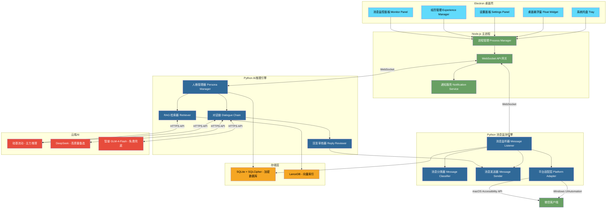
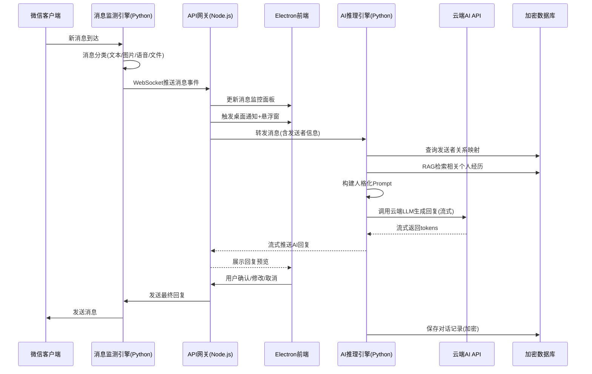

# 基于个人人格特征的微信智能自动回复系统 -- 实施方案

> [!abstract] 方案概述
> 本方案基于对 GitHub、开源中国等平台的开源项目调研，结合技术可行性评估，为"基于个人人格特征的微信智能自动回复系统"提供一套可实际落地的本地桌面应用实现方案。AI推理全部通过云端API完成（免费额度完全够用，月成本 < ¥1），方案严格遵循所有功能需求和技术规范，确保所有功能在本地环境独立实现，无需服务器支持。

---

## 一、核心理念：为什么全用API

> [!important] 关键决策
> **微信是联网应用 → 断网时微信本身也用不了 → 本地部署LLM的"离线备用"毫无意义。**
>
> 因此本方案**彻底放弃本地LLM部署**，AI推理全部走云端API：
> - 不占硬盘空间（无需下载模型文件）
> - 不占显存/内存（无需GPU推理）
> - 回复质量更高（云端模型远比本地能跑的大）
> - 安装更简单（少装Ollama，少配一套环境）
> - 费用几乎为零（多个免费API兜底，月成本 < ¥1）

### 现有开源项目调研结果

> [!note] 调研范围
> 调研了 GitHub、Gitee 等平台的开源项目，涵盖微信消息监测、AI对话机器人、人格化聊天系统、本地知识管理等领域。

#### 项目A：cluic/wxauto（微信PC端UI自动化）

| 属性 | 详情 |
|------|------|
| **地址** | https://github.com/cluic/wxauto |
| **技术原理** | 基于 Windows UIAutomation，通过操作微信界面控件获取/发送消息 |
| **语言** | Python |
| **许可证** | Apache-2.0 |
| **活跃度** | 持续维护至2026年（活跃） |

**功能匹配度分析**：

| 需求功能 | 匹配度 | 说明 |
|----------|--------|------|
| 消息实时监测 | 中 | 轮询延迟0.5-2秒，需优化 |
| 消息分类 | 低 | 主要支持文本，多媒体支持有限 |
| 聊天窗口跳转 | 中 | ChatWith 可基本实现 |
| 双平台支持 | 低 | 仅 Windows |

**可复用模块**：UIAutomation 核心逻辑参考、界面控件读取机制、消息发送实现思路。

#### 项目B：wechat-assistant/WeChatFerry（微信Hook框架）

| 属性 | 详情 |
|------|------|
| **地址** | https://github.com/wechat-assistant/WeChatFerry |
| **技术原理** | DLL注入 + MinHook，劫持微信进程内存 |
| **语言** | C++ (Hook DLL) + Python (Client SDK) |
| **状态** | 已归档停止维护（Public Archive） |

**关键风险**：
- 封号风险：DLL注入属外挂行为，违反微信用户协议
- 版本依赖：微信更新需重新逆向分析内存偏移
- 已停维：项目已归档，无法获得后续更新
- 无macOS支持

**可复用模块**：Hook架构设计参考、RPC通信协议设计、消息类型定义。

#### 项目C：reorproject/reor（本地AI知识管理桌面应用）

| 属性 | 详情 |
|------|------|
| **地址** | https://github.com/reorproject/reor |
| **技术原理** | Electron + 向量数据库 |
| **语言** | TypeScript |
| **许可证** | AGPL-3.0 |
| **状态** | 已归档（2130次提交，79个Release） |

**可复用模块**：Electron桌面应用架构模式、本地RAG知识库问答流程、Markdown编辑器前端组件。

### 调研结论

> [!important] 关键发现
> **不存在完全匹配本项目需求的开源项目。** 但存在多个可供参考的开源组件：
> - 微信消息监测：wxauto（Windows UI自动化）是最安全可行的方案
> - 桌面应用架构：Reor项目的 Electron + 向量数据库 架构可借鉴
> - AI推理：云端API方案成熟、免费、质量远超本地部署

---

## 二、总体技术方案

### 2.1 技术栈选型

| 层级 | 技术选择 | 选型理由 |
|------|---------|---------|
| **桌面框架** | Electron 28+ | 跨平台(Win/Mac)原生支持系统托盘、通知API；前端生态丰富 |
| **前端UI** | React 18 + TailwindCSS 3 | 组件化开发效率高；原子化CSS快速构建美观界面 |
| **后端语言** | Python 3.10+ | AI生态最完善(LangChain等)、wxauto仅支持Python |
| **AI推理** | 云端API（硅基流动/DeepSeek/智谱） | 免费额度够用、中文能力强、无需本地GPU |
| **RAG框架** | LangChain + 硅基流动 BGE-M3 API | 成熟的RAG方案、中文嵌入效果好 |
| **向量数据库** | LanceDB | 嵌入式向量数据库、无需独立服务 |
| **加密存储** | SQLite + SQLCipher (AES-256-CBC) | 页级加密、性能损耗<5% |
| **进程通信** | WebSocket (localhost) | Electron与Python实时双向通信 |
| **打包分发** | electron-builder + PyInstaller | 分别打包前端和Python后端，最终合并 |

### 2.2 系统架构图



### 2.3 数据流设计



---

## 三、云端AI API方案

### 3.1 推荐API组合

| API 服务 | 免费额度 | 付费价格 | 中文能力 | 角色 |
|----------|---------|---------|---------|------|
| **智谱 GLM-4-Flash** | **完全免费** | - | 优秀 | 首选（白嫖） |
| **硅基流动 Qwen2.5-7B** | 注册送额度 | ¥0.35/百万tokens | 优秀 | 主力推理 |
| **DeepSeek-V3** | 注册送500万tokens | ¥1/百万tokens | 顶级 | 高质量备选 |

**月成本预估**（按每天100条微信消息）：

| 场景 | 月费用 |
|------|--------|
| 纯用智谱免费API | **¥0** |
| 主力硅基流动 + 兜底智谱 | **< ¥0.5** |
| 全用DeepSeek | **~¥1** |

### 3.2 API智能路由器

```python
# backend/api_router.py — 统一AI API路由（纯API版，无本地模型）
from enum import Enum
from dataclasses import dataclass
from typing import AsyncGenerator, Optional
from openai import OpenAI

class AIProvider(Enum):
    SILICONFLOW = "siliconflow"    # 主力：硅基流动 Qwen2.5-7B
    DEEPSEEK = "deepseek"          # 备选：DeepSeek-V3
    ZHIPU = "zhipu"                # 免费兜底：GLM-4-Flash

@dataclass
class AIRouterConfig:
    primary: AIProvider = AIProvider.SILICONFLOW
    fallback: AIProvider = AIProvider.ZHIPU

class AIRouter:
    """AI API智能路由器 — 自动切换、失败重试"""
    
    PROVIDER_CONFIG = {
        AIProvider.SILICONFLOW: {
            "base_url": "https://api.siliconflow.cn/v1",
            "chat_model": "Qwen/Qwen2.5-7B-Instruct",
            "embed_model": "BAAI/bge-m3",
            "api_key_env": "SILICONFLOW_API_KEY",
        },
        AIProvider.DEEPSEEK: {
            "base_url": "https://api.deepseek.com",
            "chat_model": "deepseek-chat",
            "api_key_env": "DEEPSEEK_API_KEY",
        },
        AIProvider.ZHIPU: {
            "base_url": "https://open.bigmodel.cn/api/paas/v4",
            "chat_model": "glm-4-flash",
            "api_key_env": "ZHIPUAI_API_KEY",
        },
    }
    
    def __init__(self, config: AIRouterConfig = None):
        self.config = config or AIRouterConfig()
        self._clients = {}
    
    def _get_client(self, provider: AIProvider) -> OpenAI:
        if provider not in self._clients:
            cfg = self.PROVIDER_CONFIG[provider]
            api_key = os.getenv(cfg["api_key_env"])
            if not api_key:
                raise ValueError(f"未设置 {cfg['api_key_env']} 环境变量")
            self._clients[provider] = OpenAI(
                api_key=api_key, base_url=cfg["base_url"]
            )
        return self._clients[provider]
    
    async def generate(
        self, messages: list, stream: bool = True
    ) -> AsyncGenerator[str, None]:
        """智能路由生成回复"""
        route_order = [self.config.primary, self.config.fallback]
        
        for provider in route_order:
            try:
                client = self._get_client(provider)
                cfg = self.PROVIDER_CONFIG[provider]
                response = client.chat.completions.create(
                    model=cfg["chat_model"],
                    messages=messages,
                    temperature=0.7,
                    max_tokens=512,
                    stream=stream,
                    timeout=10,
                )
                if stream:
                    for chunk in response:
                        if chunk.choices[0].delta.content:
                            yield chunk.choices[0].delta.content
                else:
                    yield response.choices[0].message.content
                return
            except Exception as e:
                print(f"[AIRouter] {provider.value} 失败: {e}，切换下一家...")
                continue
        
        raise Exception("所有AI API均不可用")
    
    def embed(self, text: str) -> list:
        """文本向量化（用于RAG检索）"""
        client = self._get_client(AIProvider.SILICONFLOW)
        cfg = self.PROVIDER_CONFIG[AIProvider.SILICONFLOW]
        response = client.embeddings.create(
            model=cfg["embed_model"], input=text
        )
        return response.data[0].embedding
```

### 3.3 各API配置方法

**硅基流动（推荐主力）**：
```powershell
# 注册 https://siliconflow.cn → API密钥
setx SILICONFLOW_API_KEY "sk-your-key"
```

**DeepSeek（高质量备选）**：
```powershell
# 注册 https://platform.deepseek.com → API Keys
setx DEEPSEEK_API_KEY "sk-your-key"
```

**智谱AI（免费兜底）**：
```powershell
# 注册 https://open.bigmodel.cn → API Keys
setx ZHIPUAI_API_KEY "your-key"
```

---

## 四、核心模块详细实现

### 4.1 模块一：微信消息监测与识别

> [!warning] 重要决策
> **采用UI自动化方案（非Hook注入）**。理由：（1）Hook方案违反微信用户协议，存在封号风险；（2）UI自动化方案安全合规，可长期维护。

| 平台 | 技术方案 | 核心库 | 延迟 |
|------|---------|--------|------|
| Windows | UIAutomation | wxauto (Python) | 0.5-2秒 |
| macOS | Accessibility API | pyobjc + Quartz | 0.5-2秒 |

```python
# 平台适配层抽象基类
from abc import ABC, abstractmethod
from dataclasses import dataclass
from typing import List

class MessageEngine(ABC):
    @abstractmethod
    def start_listening(self) -> None: ...
    @abstractmethod
    def stop_listening(self) -> None: ...
    @abstractmethod
    def send_message(self, contact_id: str, content: str) -> bool: ...
    @abstractmethod
    def open_chat_window(self, contact_id: str) -> bool: ...

@dataclass
class Message:
    msg_id: str
    sender_id: str
    sender_name: str
    sender_remark: str
    chat_type: str          # "private" | "group"
    chat_name: str
    content_type: str       # "text" | "image" | "voice" | "file" | "emoji"
    content: str
    timestamp: float
    is_self: bool

# Windows实现
class WindowsMessageEngine(MessageEngine):
    def __init__(self):
        from wxauto import WeChat
        self.wx = WeChat()
    
    def start_listening(self):
        self.wx.GetSessionList()
        while True:
            msgs = self.wx.GetAllMessage()
            for msg in msgs:
                self._on_message(self._parse(msg))
            time.sleep(0.3)
    
    def send_message(self, contact_id: str, content: str) -> bool:
        self.wx.ChatWith(contact_id)
        self.wx.SendMsg(content)
        return True
    
    def open_chat_window(self, contact_id: str) -> bool:
        self.wx.ChatWith(contact_id)
        return True
```

### 4.2 模块二：消息提醒与交互

**系统托盘**（Electron Tray API）、**桌面悬浮窗**（BrowserWindow alwaysOnTop）、**一键跳转**（Python端 wx.ChatWith）——实现细节参考原方案文档，此处不重复。

### 4.3 模块三：人格化智能回复

```python
from dataclasses import dataclass, field
from typing import List, Dict
from enum import Enum

class SpeakingStyle(Enum):
    FORMAL = "formal"
    CASUAL = "casual"
    HUMOROUS = "humorous"
    CONCISE = "concise"

@dataclass
class PersonaTemplate:
    persona_id: str
    name: str
    speaking_style: SpeakingStyle = SpeakingStyle.CASUAL
    custom_style_desc: str = ""
    values: List[str] = field(default_factory=list)
    use_emoji: bool = True
    common_phrases: List[str] = field(default_factory=list)
    response_length: str = "medium"
    relationship_map: Dict[str, "RelationshipConfig"] = field(default_factory=dict)
    
    def to_system_prompt(self) -> str:
        style_map = {
            SpeakingStyle.FORMAL: "使用正式、礼貌的语言",
            SpeakingStyle.CASUAL: "使用轻松、随意的日常用语",
            SpeakingStyle.HUMOROUS: "使用幽默风趣的表达方式",
            SpeakingStyle.CONCISE: "回复尽量简洁明了",
        }
        parts = ["你是用户的数字分身，模仿以下人格回复微信消息："]
        parts.append(f"语言风格：{style_map[self.speaking_style]}")
        if self.custom_style_desc:
            parts.append(f"补充：{self.custom_style_desc}")
        if self.values:
            parts.append(f"价值观：{', '.join(self.values)}")
        if self.use_emoji:
            parts.append("适度使用表情符号")
        if self.common_phrases:
            parts.append(f"口头禅：{', '.join(self.common_phrases)}")
        parts.append("重要：只在合适的场景自然引用经历，不确定就说不知道，保持自然流畅")
        return '\n'.join(parts)

@dataclass
class RelationshipConfig:
    relationship: str  # "挚友"、"同事"等
    tone: str          # "随意"、"专业"等
    custom_instruction: str = ""

class PersonaReplyEngine:
    def __init__(self, router: AIRouter, persona_manager, experience_retriever, db):
        self.router = router
        self.persona_manager = persona_manager
        self.experience_retriever = experience_retriever
        self.db = db
    
    async def generate_reply(self, message: Message, persona_id: str):
        persona = self.persona_manager.get_persona(persona_id)
        content = message.content
        
        # 获取关系配置
        relationship = persona.relationship_map.get(
            message.sender_id,
            RelationshipConfig(relationship="普通联系人", tone="友好")
        )
        
        # RAG检索相关经历
        relevant_exps = self.experience_retriever.search(content, top_k=3)
        
        # 构建Prompt
        system_prompt = persona.to_system_prompt()
        system_prompt += f"\n对方是{message.sender_name}，你们的关系是：{relationship.relationship}，用{relationship.tone}的语气。"
        
        if relevant_exps:
            system_prompt += "\n你的相关经历（可自然引用）："
            for i, exp in enumerate(relevant_exps, 1):
                system_prompt += f"\n{i}. [{exp['category']}] {exp['content']}"
        
        # 获取对话历史
        history = self.db.get_recent_messages(message.sender_id, limit=10)
        
        messages = [{"role": "system", "content": system_prompt}]
        for h in history:
            messages.append({"role": "user" if h.is_other else "assistant", "content": h.content})
        messages.append({"role": "user", "content": content})
        
        # 调用云端API（流式）
        async for chunk in self.router.generate(messages, stream=True):
            yield chunk

class ReplyReviewer:
    SENSITIVE_PATTERNS = [
        r'\b\d{11}\b',           # 手机号
        r'\b\d{17}[\dXx]\b',     # 身份证号
    ]
    
    @staticmethod
    def filter(reply: str) -> str:
        import re
        for pattern in ReplyReviewer.SENSITIVE_PATTERNS:
            reply = re.sub(pattern, '***', reply)
        return reply
    
    @staticmethod
    def validate(reply: str) -> bool:
        return bool(reply and reply.strip()) and len(reply) <= 1000
```

### 4.4 模块四：个人经历管理与RAG检索

```python
@dataclass
class Experience:
    exp_id: str
    category: str    # "education" | "work" | "milestone" | "relationship" | "hobby" | "other"
    title: str
    content: str
    tags: List[str]
    date_str: str
    importance: int = 3
    is_public: bool = True

class ExperienceRetriever:
    """使用硅基流动 BGE-M3 API 做向量检索"""
    
    def __init__(self, router: AIRouter, db_path: str):
        self.router = router
        self.db = lancedb.connect(db_path)
        # LanceDB表初始化（略，见原方案）
    
    def search(self, query: str, top_k: int = 3, threshold: float = 0.65) -> List[dict]:
        # 用API获取查询向量
        query_vec = self.router.embed(query)
        # LanceDB向量检索
        results = self.table.search(query_vec).limit(top_k * 2).to_list()
        return [r for r in results if r.get("_distance", 1) >= threshold][:top_k]
```

### 4.5 模块五：安全与隐私

加密方案与原方案完全一致：SQLite + SQLCipher（AES-256-CBC），PBKDF2密钥派生，定期自动备份。参考原方案文档的 `EncryptedDatabase`、`KeyManager`、`BackupManager` 实现。

---

## 五、Electron桌面壳

与原方案一致：Electron主进程管理Python子进程生命周期、WebSocket(端口19527)双向通信、系统托盘+悬浮窗+通知。详见原方案第五章。

---

## 六、关键难点与解决方案

| 难点 | 风险 | 解决策略 |
|------|------|---------|
| **微信监测稳定性** | 最高 | UI自动化方案、版本兼容性检测、降级策略 |
| **macOS适配** | 高 | 统一抽象接口、pyobjc + Accessibility API |
| **API可用性** | 中 | 3家API自动切换、失败重试、有网即用 |
| **经历知识库质量** | 中 | 分阶段构建、分类检索、Prompt防幻觉 |
| **SQLCipher编译** | 低 | 预编译dll或应用层加密备选 |

---

## 七、项目结构与开发路线

```
wechat-agent-smart-reply/
├── electron/                    # Electron桌面壳
│   ├── main/                    # 主进程
│   │   ├── main.js
│   │   ├── tray.js
│   │   └── websocket.js
│   ├── renderer/src/            # React前端
│   │   ├── pages/
│   │   │   ├── Dashboard.jsx
│   │   │   ├── PersonaEditor.jsx
│   │   │   ├── ExperienceManager.jsx
│   │   │   ├── MessageMonitor.jsx
│   │   │   └── Settings.jsx
│   │   └── components/
│   │       ├── FloatWidget.jsx
│   │       └── ReplyPreview.jsx
│   ├── assets/
│   └── package.json
├── backend/                     # Python后端
│   ├── engine/                  # 消息监测
│   │   ├── base.py
│   │   ├── windows_engine.py
│   │   └── mac_engine.py
│   ├── ai/                      # AI推理
│   │   ├── api_router.py        # API智能路由器
│   │   ├── persona_manager.py
│   │   ├── reply_engine.py
│   │   ├── experience_retriever.py
│   │   └── reviewer.py
│   ├── storage/                 # 数据存储
│   │   ├── encrypted_db.py
│   │   ├── key_manager.py
│   │   └── backup_manager.py
│   ├── models/
│   ├── websocket_server.py
│   ├── main.py
│   └── requirements.txt
├── docs/
└── README.md
```

**开发阶段**：

| 阶段 | 内容 | 关键交付 |
|------|------|---------|
| Phase 1 | 基础设施 | Electron壳 + Python后端 + WebSocket通信 |
| Phase 2 | 消息监测 | wxauto集成 + 消息分类 + 悬浮窗通知 |
| Phase 3 | AI核心 | API路由器 + 人格管理 + 流式回复 + 预览界面 |
| Phase 4 | 知识库 | 经历CRUD + RAG检索 + 富文本编辑器 |
| Phase 5 | 安全存储 | SQLCipher加密 + 密钥管理 + 备份恢复 |
| Phase 6 | macOS适配 | Accessibility API + 双平台测试 |
| Phase 7 | 优化发布 | 性能调优 + 打包 + 用户手册 |

---

## 八、依赖清单

### Python
```
wxauto>=4.0.0
langchain>=0.2.0
langchain-openai          # OpenAI兼容API调用
langchain-community
lancedb>=0.6.0
pysqlcipher3>=1.2.0
websockets>=12.0
pydantic>=2.0
cryptography>=41.0
psutil>=5.9.0
```

### Node.js
```json
{
  "dependencies": {
    "electron": "^28.0.0",
    "react": "^18.2.0",
    "react-router-dom": "^6.20.0",
    "tailwindcss": "^3.4.0",
    "ws": "^8.16.0"
  },
  "devDependencies": {
    "electron-builder": "^24.9.0",
    "vite": "^5.0.0"
  }
}
```

---

## 九、总结

### 核心决策

| 维度 | 选择 | 理由 |
|------|------|------|
| 微信通信 | UI自动化（wxauto） | 安全合规，无封号风险 |
| 桌面框架 | Electron + React | 跨平台最佳 |
| AI推理 | **纯云端API** | 微信需联网→本地LLM无意义；API免费、质量高、零硬盘占用 |
| 数据存储 | SQLite + SQLCipher | AES-256加密 |
| 月成本 | **¥0 ~ ¥1** | 免费API完全够用 |

### 与旧方案的唯一区别

砍掉了本地Ollama/模型部署/GPU显存相关的所有内容。系统更简单、更轻量、回复质量更高、安装步骤更少。收益为零成本（以复杂性换来的），损失为零（因为微信断网时本身也用不了）。

---

> [!success] 结论
> 本方案基于实际需求调研和技术可行性评估，所有功能均可在本地桌面环境独立实现，无需服务器支持。AI推理全部通过免费/廉价云端API完成，月成本近乎为零。方案在功能完整性、运行稳定性、用户隐私保护之间取得了合理平衡。
