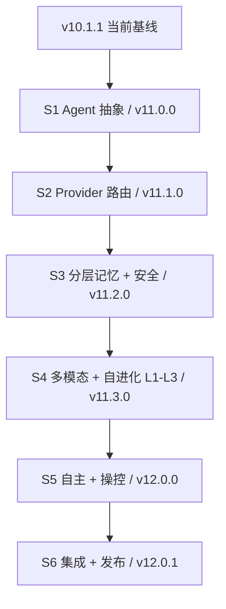
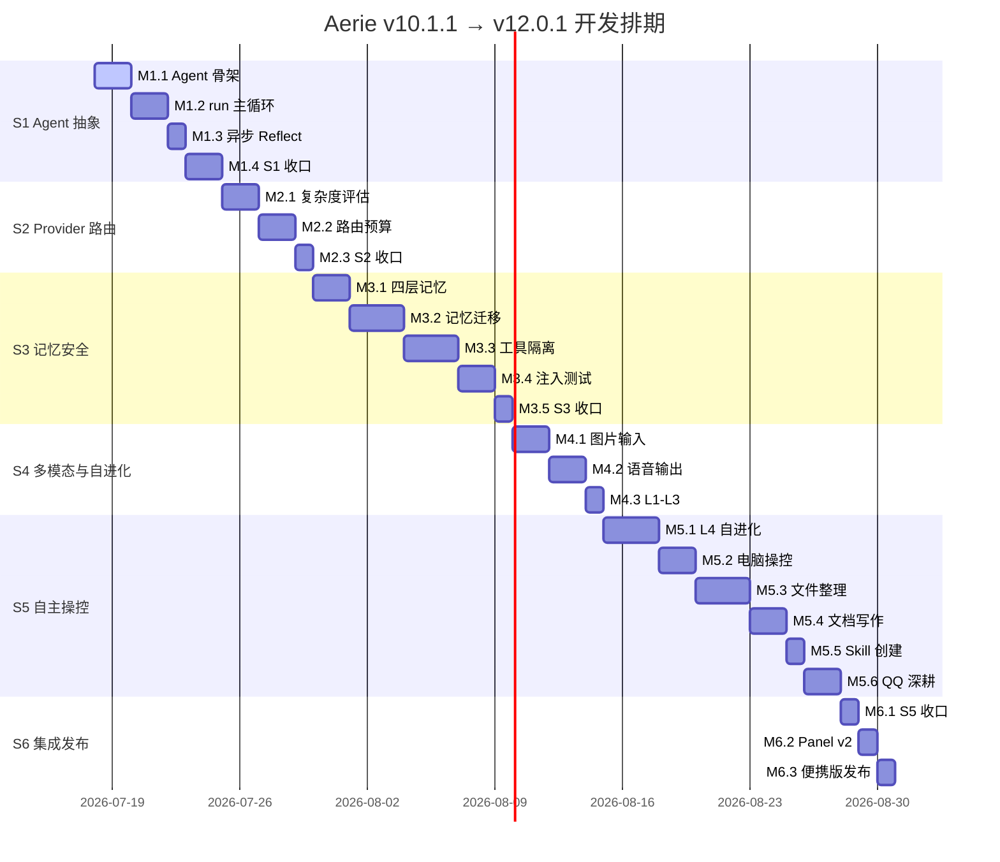

# Aerie v10.1.1 → v12.0.1 一站式开发任务表

> [!info] 来源
> 本任务表基于 [[plan-agent-perspective-llm-research-and-roadmap-v10.1.1]] 提炼，覆盖 S1-S6 全部开发流程、24 个里程碑、8.5 周执行周期。

> [!success] 执行状态
> 当前正式启动执行流程：从 **S1 / M1.1 `core/agent.py` 主类骨架** 开始推进；所有后续任务必须遵循优先级、依赖关系、e2e 全绿与版本号升级规则。

## 1. 项目目标摘要

Aerie（云栖）的终态目标是从当前 v10.1.1 基线演进为 v12.0.1：以 **单 Agent 对外 + 准多 Agent 内部机制** 为核心架构，完成 Agent 抽象、智能 Provider 路由、四层记忆与安全隔离、多模态输入输出、自进化 L1-L4、电脑操控、文件整理、文档写作、QQ 深耕与 Cognition Panel v2 集成发布。

## 2. 技术路线

## 3. 阶段计划总览

| 阶段 | 主题 | 时间范围 | 目标版本 | 关键交付 | 阶段验收 |
|---|---|---:|---|---|---|
| S1 | 显式 Agent 抽象 | 2026-07-18 ~ 2026-07-24 | v11.0.0 | `core/agent.py`、Agent.run、异步 Reflect、Trace 基线 | 16 e2e 全绿，Agent 路径与旧 pipeline 输出一致 |
| S2 | 智能 Provider 路由 | 2026-07-25 ~ 2026-07-29 | v11.1.0 | `core/provider_router.py`、复杂度评估、预算跟踪 | Provider 可按复杂度和预算切换 |
| S3 | 分层记忆 + 安全 | 2026-07-30 ~ 2026-08-09 | v11.2.0 | 四层记忆、迁移脚本、工具隔离、注入测试 | 21+ e2e 全绿，10/10 注入防御通过 |
| S4 | 多模态 + 自进化 L1/L2/L3 | 2026-08-10 ~ 2026-08-14 | v11.3.0 | 图片输入、TTS 输出、梦境整理、会话复盘 | 多模态与自进化 L1-L3 e2e 通过 |
| S5 | 自主 + 操控 | 2026-08-15 ~ 2026-08-27 | v12.0.0 | L4 自进化、电脑操控、文件整理、文档写作、skill 创建、QQ 深耕 | 27 e2e 全绿，审计、回退、undo 可用 |
| S6 | 集成 + 收口 + 发布 | 2026-08-28 ~ 2026-08-30 | v12.0.1 | S5 收口、Panel v2、便携版打包 | 便携版可用，性能达标，用户确认发布 |

## 4. 一站式开发任务表

| 编号 | 任务名称 | 任务描述 | 优先级 | 负责人 | 预计工时 | 开始时间 | 截止时间 | 前置任务 | 所需资源 | 验收标准 |
|---|---|---|---|---|---:|---|---|---|---|---|
| M1.1 | `core/agent.py` 主类骨架 | 新建 Agent 类与 PerceivedInput、Thought、Decision、AgentResult、SkillCall 等数据结构，收口现有 7 模块入口 | P0 | Etta-后端 | 2d | 2026-07-18 | 2026-07-19 | 无 | Python、现有 Companion/Brain/Cognition/Emotion 模块 | `from core.agent import Agent` 成功；不破坏既有路径 |
| M1.2 | `Agent.run()` 主循环 | 实现 Perceive → Reason → Decide → Act → Reflect → Express 六步主循环，并与旧 pipeline 双轨 | P0 | Etta-后端 | 2d | 2026-07-20 | 2026-07-21 | M1.1 | `communication/router.py`、pipeline、tool registry | 14 个 e2e 全绿；新旧路径可切换 |
| M1.3 | 异步 Reflect 队列 | 将 self_evolver 提案异步化，新增反思队列，避免阻塞用户响应 | P1 | Etta-后端 | 1d | 2026-07-22 | 2026-07-22 | M1.2 | `asyncio`、`core/agent_reflection_queue.py` | `e2e_self_evolve` 通过；主流程无阻塞 |
| M1.4 | S1 收口验证 | 全量回归，构造 10 条不同情绪/上下文/工具消息，对比 Agent 与旧 pipeline 输出 | P0 | Etta-测试 | 2d | 2026-07-23 | 2026-07-24 | M1.3 | e2e 套件、verify 脚本、check_forbidden | 16 e2e + verify + check_forbidden 全绿；触发 v11.0.0 申请 |
| M2.1 | Provider 复杂度评估 | 新建 `core/provider_router.py`，按消息长度、上下文、多模态、推理、写作 5 维评分 | P1 | Etta-后端 | 2d | 2026-07-25 | 2026-07-26 | M1.4 | Provider 配置、复杂度 DTO、e2e 数据 | 5 个复杂度分档 e2e 全绿 |
| M2.2 | 动态路由 + 预算跟踪 | 实现按复杂度与月度预算选择 Provider，新增 SQLite 预算跟踪 | P1 | Etta-后端 | 2d | 2026-07-27 | 2026-07-28 | M2.1 | SQLite、`data/budget_tracker.db`、Provider API 配置 | `verify_provider_router.py` 覆盖 10 场景并通过 |
| M2.3 | S2 收口验证 | 验证空预算、80%、100% 三类预算下的 Provider 路由行为 | P1 | Etta-测试 | 1d | 2026-07-29 | 2026-07-29 | M2.2 | e2e、预算模拟数据 | 16 e2e 全绿；预算文件可读；触发 v11.1.0 升级 |
| M3.1 | 四层记忆架构设计 | 建立 transient、working、long_term、permanent 四层记忆 DTO 与 SQLite schema | P1 | Etta-后端 | 2d | 2026-07-30 | 2026-07-31 | M2.3 | `memory/`、SQLite、迁移设计 | 4 张表创建成功；schema 可迁移旧数据 |
| M3.2 | 长期记忆迁移 | 编写迁移脚本，将旧 LongTermMemory 数据迁入四层架构，保留回退窗口 | P1 | Etta-后端 | 3d | 2026-08-01 | 2026-08-03 | M3.1 | `tools/migrate_memory_to_layers.py`、旧记忆库 | 数据完整性检查通过；16 e2e 全绿 |
| M3.3 | 工具调用隔离 | 新建 `core/tool_isolation.py`，用 schema JSON 隔离工具原文，防御间接 prompt injection | P1 | Etta-安全/后端 | 3d | 2026-08-04 | 2026-08-06 | M3.2 | AGENTSYS 模式、JSON schema、工具注册表 | `e2e_tool_isolation.py` + 旧 e2e 全绿 |
| M3.4 | Prompt Injection 测试 | 构造 10 类攻击 payload，覆盖邮件、网页、KB、tool 返回等注入场景 | P1 | Etta-安全测试 | 2d | 2026-08-07 | 2026-08-08 | M3.3 | 安全 payload 集、隔离断言 | `e2e_security_injection.py` 10/10 通过 |
| M3.5 | S3 收口验证 | 跑全量 e2e、verify 与新增安全用例，评估安全策略严格度 | P1 | Etta-测试 | 1d | 2026-08-09 | 2026-08-09 | M3.4 | e2e、verify、注入测试报告 | 21+ e2e 全绿；触发 v11.2.0 升级 |
| M4.1 | 多模态输入（图片） | 扩展消息模型支持图片附件，Provider 自动切换多模态能力 | P1 | Etta-后端 | 2d | 2026-08-10 | 2026-08-11 | M3.5 | `attachment_handler.py`、多模态 Provider | `e2e_multimodal_image.py` 通过 |
| M4.2 | 多模态输出（语音） | 新建 TTS 引擎，支持 boot_greeting、morning_brief、纪念日等语音输出 | P1 | Etta-后端 | 2d | 2026-08-12 | 2026-08-13 | M4.1 | Edge TTS/火山 TTS、`voice/tts_engine.py` | `e2e_tts.py` 通过；3 条消息成功生成语音 |
| M4.3 | 自进化 L1/L2/L3 升级 | 实现梦境式记忆整理、会话后复盘、主动沉淀与调度 | P1 | Etta-后端 | 1d | 2026-08-14 | 2026-08-14 | M4.2 | `self_evolver.py`、`proactive_judge.py` | `e2e_self_evolve_l1_l2_l3.py` 通过；触发 v11.3.0 升级 |
| M5.1 | 自进化 L4 | 新建 archive 与 viability gate，支持白名单内自改代码、提案、验证、入档、回退 | P0 | Etta-后端/安全 | 3d | 2026-08-15 | 2026-08-17 | M4.3 | `core/self_evolve_archive.py`、`core/viability_gate.py`、白名单 | 4 道门通过；journal 完整；24h 无回退 |
| M5.2 | 电脑操控 | 实现截图、鼠标键盘、受限 shell、Windows UIA、权限三档与 audit log | P0 | Etta-后端/安全 | 2d | 2026-08-18 | 2026-08-19 | M5.1 | `mss`、`pyautogui`、`pywinauto`、settings | `e2e_computer_use.py` 5 用例通过；危险命令拒绝 |
| M5.3 | 文件整理 | 实现扫描、AI 分类、预览、拖拽调整、执行与一键 undo | P0 | Etta-后端/前端 | 3d | 2026-08-20 | 2026-08-22 | M5.2 | `file_organizer.py`、Electron 双栏 UI、undo 日志 | `e2e_file_organizer.py` 5 用例通过；撤销日志可读 |
| M5.4 | 文档写作 | 实现日记/报告/规格/研究/简历 5 类文档与 Markdown/HTML/PDF/Word 导出 | P0 | Etta-后端/设计 | 2d | 2026-08-23 | 2026-08-24 | M5.3 | `doc_writer.py`、模板、WeasyPrint、python-docx | `e2e_doc_writer.py` 6 用例通过；Electron 预览完整 |
| M5.5 | 自主 Skill 创建 | 实现模板化生成 skill、自动注册、命名空间隔离与加载验证 | P0 | Etta-后端 | 1d | 2026-08-25 | 2026-08-25 | M5.4 | `core/skill_creator.py`、`skills/auto_generated/` | `e2e_skill_creator.py` 通过；新 skill 可加载 |
| M5.6 | QQ 深耕 | 替代多渠道扩展，聚焦 QQ 视频、大文件、语音优化、主动消息 v2 | P0 | Etta-后端/QQ 集成 | 2d | 2026-08-26 | 2026-08-27 | M5.5 | NapCat/QQ 接口、Silk 编码、PAD 5 维状态 | QQ 视频/大文件/语音/主动消息 e2e 通过；QQ 主路径不破 |
| M6.1 | S5 收口 | 全量跑 22+ 旧 e2e 与 S5 新增 e2e，修复所有阻断项 | P0 | Etta-测试 | 1d | 2026-08-28 | 2026-08-28 | M5.6 | e2e、verify、audit/journal 检查 | 27 e2e 全绿；触发 v12.0.0 升级申请 |
| M6.2 | Cognition Panel v2 | 在 Electron 主窗口右侧嵌入 Panel v2，新增自进化、电脑操控、文件整理、文档写作 tab | P2 | Etta-前端/设计 | 1d | 2026-08-29 | 2026-08-29 | M6.1 | Electron、Trace 编译器、响应式/折叠/拖出 UI | 4 个 tab 可用；拖出与嵌入数据同步 |
| M6.3 | 便携版发布 | Electron 打包便携 ZIP，跑性能基线，完成发布确认与版本同步 | P2 | Etta-部署 | 1d | 2026-08-30 | 2026-08-30 | M6.2 | Electron 打包、CHANGELOG、package/pyproject/settings | 启动 <5s；内存 <500MB；v12.0.1 便携版可用 |

## 5. 执行依赖链

## 6. 资源清单

| 资源 | 用途 | 配置/规模 | 责任人 |
|---|---|---|---|
| Python 后端开发 | Agent、Provider、记忆、安全、自进化、电脑操控、文件整理、文档写作 | 1 人 × 43 天 | Etta-后端 |
| 测试开发 | 新增 11+ e2e、全量回归、verify、注入测试 | 0.3 人 × 43 天 | Etta-测试 |
| UI/UX 设计 | Cognition Panel v2、文件整理预览、文档预览 | 0.2 人 × 3 天 | Etta-设计 |
| 部署发布 | Electron 便携版、版本同步、CHANGELOG | 0.1 人 × 2 天 | Etta-部署 |
| 用户审批 | MAJOR 版本升级、敏感能力开关、发布确认 | S1/S5/S6 节点 | 主人 |

## 7. 验收总清单

- [ ] S1：Agent 抽象完成，16 e2e 全绿，新旧 pipeline 输出一致。
- [ ] S2：Provider 路由按复杂度与预算正确切换。
- [ ] S3：四层记忆迁移完成，工具隔离生效，10/10 注入防御通过。
- [ ] S4：图片输入、语音输出、自进化 L1/L2/L3 跑通。
- [ ] S5：L4 自进化、电脑操控、文件整理、文档写作、Skill 创建、QQ 深耕全部可用。
- [ ] S6：Cognition Panel v2 完成，便携版可用，性能达标。
- [ ] 全局：27 e2e + verify + check_forbidden 全绿。
- [ ] 版本：按 v10.1.1 → v11.0.0 → v11.1.0 → v11.2.0 → v11.3.0 → v12.0.0 → v12.0.1 同步升级。

## 8. 当前启动批次

> [!todo] 当前执行
> **M1.1 `core/agent.py` 主类骨架** 已进入执行队列，下一步应读取现有核心模块并创建最小可运行 Agent 骨架。

| 当前批次 | 任务 | 状态 | 下一动作 |
|---|---|---|---|
| Batch-01 | M1.1 `core/agent.py` 主类骨架 | in-progress | 读取 `core/` 现有模块，确认 Companion、pipeline、tool_registry 接入点 |
| Batch-01 | M1.2 `Agent.run()` 主循环 | pending | 等 M1.1 导入验证通过后启动 |
| Batch-01 | M1.3 异步 Reflect | pending | 等 M1.2 主循环完成后启动 |

## 9. 风险控制

> [!warning] 高风险任务
> M5.1 自进化 L4 与 M5.2 电脑操控必须走白名单、审计日志、viability gate 与用户审批流程；任何 e2e 不绿不得进入下一阶段。

| 风险 | 等级 | 防控措施 |
|---|---|---|
| L4 自改代码破坏既有行为 | 高 | viability gate 四道门、archive、journal、24h 观察期 |
| 电脑操控误操作 | 高 | 权限三档、路径白名单、危险命令黑名单、audit log、undo |
| 文件整理误移动 | 中 | 预览、二次确认、大文件/近期文件标记、7 天撤销日志 |
| 文档写作注入 | 中 | 复用 M3.3 工具隔离与 schema 化上下文 |
| 多模态成本过高 | 中 | 预算跟踪，优先低成本 Provider，必要时 fallback |

## 10. 版本升级节点

| 阶段完成 | 目标版本 | 类型 | 审批 |
|---|---|---|---|
| S1 | v11.0.0 | MAJOR | 主人审批 |
| S2 | v11.1.0 | MINOR | 开发 + 测试双签 |
| S3 | v11.2.0 | MINOR | 开发 + 测试双签 |
| S4 | v11.3.0 | MINOR | 开发 + 测试双签 |
| S5 | v12.0.0 | MAJOR | 主人审批 |
| S6 | v12.0.1 | PATCH | 开发者自查 + 主人发布确认 |
