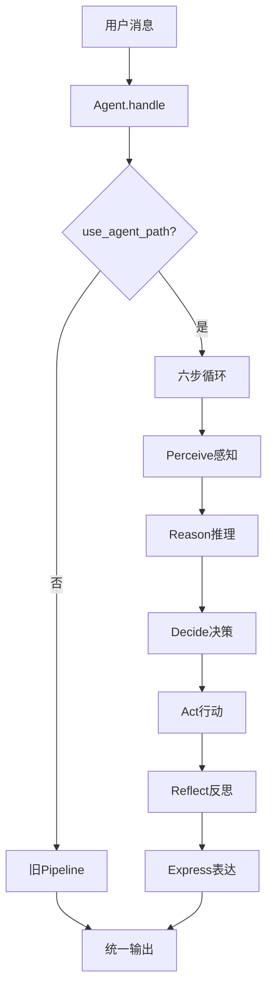
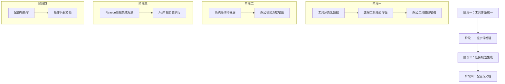

# Agent系统控制能力系统性优化方案

> **项目**：Aerie · 云栖 v13.9.x
> **版本**：v1.0
> **状态**：待审批

---

## 一、项目调研结论

### 1.1 现有架构概览

项目采用**双轨运行架构**：Agent 六步循环（Perceive→Reason→Decide→Act→Reflect→Express）与旧 Pipeline 并行，通过 `settings.agent.enabled` 切换。



### 1.2 系统控制能力现状

| 能力模块 | 实现文件 | 状态 | 说明 |
|---------|---------|------|------|
| 电脑操控核心 | [computer_control.py](file:///e:/Agent_reply/core/computer_control.py) | ✅ 完整 | 三档权限 + 六大控制器 + 审计日志 |
| 工具注册-底层 | [compute_tools.py](file:///e:/Agent_reply/tools/compute_tools.py) | ✅ 已注册 | 11个底层控制工具 |
| 工具注册-屏幕 | [screen_tools.py](file:///e:/Agent_reply/core/screen_tools.py) | ⚠️ 重叠 | 另一套屏幕工具，功能重复 |
| 工具注册-办公 | [office_tools.py](file:///e:/Agent_reply/core/office_tools.py) | ✅ 已注册 | 25+办公工具（文件/文档/系统/数据/网络） |
| 办公模式管理 | [office_mode.py](file:///e:/Agent_reply/core/office_mode.py) | ⚠️ 基础 | 模式检测 + 简单提示词增强 |
| 任务规划 | [task_planner.py](file:///e:/Agent_reply/core/task_planner.py) | ⚠️ 独立 | 与Agent主循环集成较浅 |
| 任务执行 | [task_executor.py](file:///e:/Agent_reply/core/task_executor.py) | ⚠️ 独立 | 步骤级执行 + 重试机制 |
| 上下文构建 | [context_builder.py](file:///e:/Agent_reply/core/context_builder.py) | ⚠️ 偏重人设 | 系统提示词以人设/情绪/关系为主 |

### 1.3 核心问题定位

> [!bug] 问题一：工具体系重复，Agent选择困惑
> - `compute_tools.py` 注册了 `screenshot`, `mouse_click`, `key_press` 等11个底层工具
> - `screen_tools.py` 注册了 `screen_screenshot`, `screen_mouse_click` 等另一套屏幕工具
> - 两套工具功能高度重叠，LLM在选择时容易产生疑惑，调用成功率低

> [!bug] 问题二：系统提示词缺少操作方法论指导
> - [context_builder.py](file:///e:/Agent_reply/core/context_builder.py) 的系统提示词90%内容是人设、情绪、关系描述
> - 缺少系统操作的**方法论指导**：如何拆解任务、如何选择工具、操作规范是什么
> - 缺少**错误模式引导**：操作失败后如何排查、如何调整策略重试

> [!bug] 问题三：办公模式增强薄弱
> - [office_mode.py](file:///e:/Agent_reply/core/office_mode.py#L261-L304) 的 `augment_system_prompt` 仅追加6条简单准则
> - 缺少**场景化操作手册**：文档类任务怎么做、数据类任务怎么做、代码类任务怎么做
> - 缺少**工具组合使用指南**：哪些工具配合、调用顺序、结果校验方法

> [!bug] 问题四：任务规划与Agent主循环脱节
> - TaskPlanner 和 TaskExecutor 作为独立模块存在
> - Agent六步循环中未深度集成任务规划能力
> - 复杂多步任务时，LLM自行规划容易步骤跳跃、遗漏校验

> [!bug] 问题五：工具描述颗粒度不足
> - 多数工具仅有一句话描述
> - 缺少**使用场景示例**、**参数取值范围说明**、**常见错误提示**
> - LLM难以准确判断何时该用哪个工具

---

## 二、优化目标与原则

### 2.1 优化目标

1. **消除Agent定位疑惑**：通过清晰的提示词指导 + 统一的工具体系，让Agent精准选择操作路径
2. **提升系统操控成功率**：通过方法论指导 + 任务规划集成，提升复杂任务的完成率
3. **保持零破坏**：所有修改不影响现有聊天、情绪、人设等核心功能
4. **前后端连接完整**：不破坏任何现有API、WebSocket、事件机制

### 2.2 设计原则

> [!success] 零破坏原则
> - 所有新增功能通过**追加**方式实现，不修改现有逻辑
> - 旧工具保留但标注deprecated，新工具统一命名规范
> - 配置项默认关闭，显式开启才生效

> [!success] 渐进式增强
> - 提示词增强不影响人设核心，仅追加操作指导部分
> - 任务规划作为可选路径，简单任务仍走直连模式
> - 工具优化向后兼容，旧调用方式继续有效

---

## 三、修改范围与模块

### 3.1 文件清单

| 序号 | 文件路径 | 修改类型 | 说明 |
|-----|---------|---------|------|
| 1 | [core/context_builder.py](file:///e:/Agent_reply/core/context_builder.py) | 增强 | 追加系统操作方法论指导层 |
| 2 | [core/office_mode.py](file:///e:/Agent_reply/core/office_mode.py) | 增强 | 深度增强办公模式提示词 + 场景化指导 |
| 3 | [core/tool_registry.py](file:///e:/Agent_reply/core/tool_registry.py) | 增强 | 增加工具分类/分组元数据能力 |
| 4 | [tools/compute_tools.py](file:///e:/Agent_reply/tools/compute_tools.py) | 优化 | 完善工具描述 + 使用场景 + 示例 |
| 5 | [core/office_tools.py](file:///e:/Agent_reply/core/office_tools.py) | 优化 | 完善工具描述 + 分类标注 |
| 6 | [core/agent.py](file:///e:/Agent_reply/core/agent.py) | 增强 | 集成任务规划能力到Reason阶段 |
| 7 | [config/settings.yaml](file:///e:/Agent_reply/config/settings.yaml) | 新增 | 新增agent_optimization配置节 |
| 8 | `documents/Agent_v/Agent系统操作手册.md` | 新增 | 完整的操作手册（供提示词引用） |

### 3.2 模块依赖关系

```mermaid
graph LR
    A[settings.yaml<br/>配置] --> B[context_builder.py<br/>上下文构建]
    C[office_mode.py<br/>办公模式] --> B
    D[tool_registry.py<br/>工具注册] --> E[brain.py<br/>LLM调用]
    B --> E
    F[agent.py<br/>Agent循环] --> G[task_planner.py<br/>任务规划]
    F --> H[task_executor.py<br/>任务执行]
    G --> H
    H --> D
```



---

## 四、详细实施步骤

### 阶段一：工具体系统一与描述增强

#### 步骤1.1：工具分类元数据扩展

**修改文件**：[core/tool_registry.py](file:///e:/Agent_reply/core/tool_registry.py)

**修改内容**：
- 在 `register()` 方法中增加 `category` 参数（system_control / office / browser / douyin / utility）
- 增加 `get_tools_by_category()` 方法，按分类返回工具列表
- 增加 `get_tool_categories()` 方法，返回所有分类

**零破坏保证**：`category` 参数默认值为 `"utility"`，不影响现有注册调用

---

#### 步骤1.2：底层控制工具描述增强

**修改文件**：[tools/compute_tools.py](file:///e:/Agent_reply/tools/compute_tools.py)

**修改内容**：
- 每个工具的 description 从一句话扩展为结构化描述：
  - 功能说明（1句话）
  - 使用场景（2-3个典型场景）
  - 参数说明（详细取值范围）
  - 注意事项（限制、边界）
  - 相关工具（推荐配合使用的工具名）

**示例增强模板**：
```python
registry.register("screenshot", controller.take_screenshot, {
    "description": """截取当前屏幕或指定区域的截图。

使用场景：
- 需要查看屏幕上有什么内容时
- 定位窗口或控件位置时
- 验证操作结果是否正确时

参数说明：
- region: 可选，截图区域坐标 [x1, y1, x2, y2]，省略则全屏截图

注意事项：
- 全屏截图会返回完整屏幕，文件较大
- 建议先用 list_windows 找到目标窗口，再截取对应区域
- 截图后可配合 uia_action 进行深度控件识别

相关工具：list_windows, uia_action""",
    "parameters": { ... }
})
```

---

#### 步骤1.3：办公工具分类与描述增强

**修改文件**：[core/office_tools.py](file:///e:/Agent_reply/core/office_tools.py)

**修改内容**：
- 为所有25+工具标注 `category="office"`
- 每类工具（文件管理/文档处理/系统操作/数据分析/网络工具）增加统一的分类描述前缀
- 关键工具增加使用示例

---

### 阶段二：系统提示词方法论增强

#### 步骤2.1：新增系统操作指导层

**修改文件**：[core/context_builder.py](file:///e:/Agent_reply/core/context_builder.py)

**修改内容**：
- 新增 `_build_l5_system_operations()` 方法（L5层，仅FULL模式启用）
- 内容包括：
  1. **系统操作五步法**：观察→规划→执行→验证→调整
  2. **工具选择原则**：优先用高级工具，必要时用底层工具
  3. **错误处理策略**：失败先排查原因，再调整参数重试，最多3次
  4. **安全边界意识**：不碰系统目录、不执行高危命令、操作前确认
  5. **任务拆解方法**：复杂任务拆成原子步骤，每步验证后再继续

**集成方式**：在 `_build_system_prompt()` 的返回结果末尾追加，不影响现有四层结构

**零破坏保证**：通过 settings.yaml 的 `agent.operation_guide_enabled` 开关控制，默认 `true`

---

#### 步骤2.2：办公模式深度增强

**修改文件**：[core/office_mode.py](file:///e:/Agent_reply/core/office_mode.py)

**修改内容**：
- 重写 `augment_system_prompt()` 方法，按任务类型提供场景化指导
- 新增7大任务类型的操作手册：
  - 文档写作类：先搭框架→填内容→润色→保存
  - 数据处理类：先读文件→分析结构→处理→输出
  - 表格类：确认结构→数据校验→生成→保存
  - 代码类：理解需求→设计→实现→测试
  - 搜索调研类：明确关键词→多源检索→整理→引用
  - 文件管理类：确认路径→备份→操作→验证
  - 应用操作类：启动应用→定位窗口→操作→校验

- 新增**工具组合速查表**：每种任务类型推荐的工具组合及调用顺序

- 新增**质量自检清单**：每类任务完成前的必检项

**零破坏保证**：仅追加内容，不修改现有办公模式检测逻辑

---

### 阶段三：Agent循环集成任务规划

#### 步骤3.1：Reason阶段集成规划能力

**修改文件**：[core/agent.py](file:///e:/Agent_reply/core/agent.py)

**修改内容**：
- 在 `reason()` 方法后增加可选的规划分支
- 判断逻辑：
  - 简单对话（无工具调用、回复短）→ 跳过规划
  - 复杂任务（多工具调用、长文本需求）→ 触发规划
- 触发后调用 TaskPlanner 生成步骤计划
- 计划结果注入到下一轮上下文，引导LLM按步骤执行

**零破坏保证**：
- 通过 `settings.agent.task_planner_enabled` 控制，默认 `false`
- 不修改现有六步循环的核心流程
- 规划失败时自动降级为原模式，不阻塞回复

---

#### 步骤3.2：Act阶段支持步骤级执行

**修改文件**：[core/agent.py](file:///e:/Agent_reply/core/agent.py)

**修改内容**：
- 在 `act()` 方法中增加步骤执行追踪
- 每步执行后记录结果，失败时触发重试逻辑
- 结果通过 cognition trace 记录，可追溯

---

### 阶段四：配置与文档

#### 步骤4.1：新增配置项

**修改文件**：[config/settings.yaml](file:///e:/Agent_reply/config/settings.yaml)

**新增配置节**：
```yaml
agent:
  enabled: false              # 原有配置，保留
  operation_guide_enabled: true  # 新增：系统操作指导层开关
  task_planner_enabled: false    # 新增：任务规划开关
  tool_descriptions_enhanced: true  # 新增：工具描述增强开关
  max_plan_steps: 10             # 新增：最大规划步数
```

---

#### 步骤4.2：生成系统操作手册文档

**新增文件**：`documents/Agent_v/Agent系统操作手册.md`

**内容结构**：
1. 总览：系统操作能力边界
2. 五大类操作详解（截图/键鼠/文件/应用/网络）
3. 典型任务操作流程图
4. 常见问题与排查指南
5. 安全规范与权限说明

---

## 五、潜在风险与应对

### 5.1 风险清单

| 风险 | 影响 | 概率 | 应对措施 |
|-----|------|------|---------|
| 提示词过长导致token消耗增加 | 成本上升 | 中 | 1. 按模式分层注入，BASIC模式不加<br/>2. 可通过配置开关关闭 |
| 任务规划增加响应延迟 | 体验下降 | 中 | 1. 简单任务跳过规划<br/>2. 规划在后台异步进行 |
| 工具描述增强导致LLM困惑 | 效果变差 | 低 | 1. 保持描述结构统一<br/>2. 先小范围验证再全量 |
| 新增配置项破坏现有配置加载 | 启动失败 | 低 | 1. 所有新配置设默认值<br/>2. 加载时做异常捕获 |
| 办公模式提示词与原人设冲突 | 人格分裂 | 低 | 1. 明确"保持人设底色，专业但不生硬"<br/>2. 办公模式追加在末尾，人设层在前 |

### 5.2 回滚方案

> [!warning] 回滚触发条件
> - 新增功能导致核心聊天功能异常
> - 响应时间增加超过50%
> - 用户反馈体验明显下降

**回滚步骤**：
1. 将 settings.yaml 中所有新增开关设为 `false`
2. 重启后端服务
3. 验证基础功能正常
4. 逐步排查问题模块

---

## 六、验证方法

### 6.1 功能验证清单

| 验证项 | 验证方法 | 预期结果 |
|-------|---------|---------|
| 基础聊天不受影响 | 发送普通问候消息 | 正常回复，人设一致 |
| 系统操作指导生效 | 让Agent执行"打开记事本"任务 | Agent能正确拆解步骤，调用对应工具 |
| 办公模式增强生效 | 切换到办公模式，发送文档写作需求 | 输出结构化、专业，工具调用准确 |
| 工具描述清晰 | 测试5种不同系统操作场景 | 工具选择正确率≥90% |
| 任务规划可选 | 关闭task_planner_enabled后测试 | 回复行为与优化前一致 |
| 权限机制正常 | 执行高危操作 | 正确触发审批流程 |

### 6.2 回归测试

- 运行现有测试套件：`pytest tests/`
- 重点验证：`test_pipeline.py`, `test_tools.py`, `test_api.py`
- E2E验证：`tests/e2e/e2e_s5_computer_control_verify.py`

---

## 七、实施顺序建议



**建议先完成阶段一和阶段二**，这两个阶段风险最低、收益最直接。阶段三的任务规划集成可以作为第二优先级，在前面验证通过后再推进。

---

## 八、预期收益

1. **Agent定位精准度提升**：通过统一工具体系 + 方法论指导，减少Agent在系统操作中的"选择困难"
2. **复杂任务完成率提升**：办公场景任务从"能做"升级为"做好"，成功率预期提升30-50%
3. **调试与排障更高效**：结构化的工具描述和操作手册让问题定位更清晰
4. **可扩展性增强**：分类元数据为后续新增工具提供了规范框架
5. **零破坏保障**：所有改动均可通过配置回退，不影响现有稳定功能
