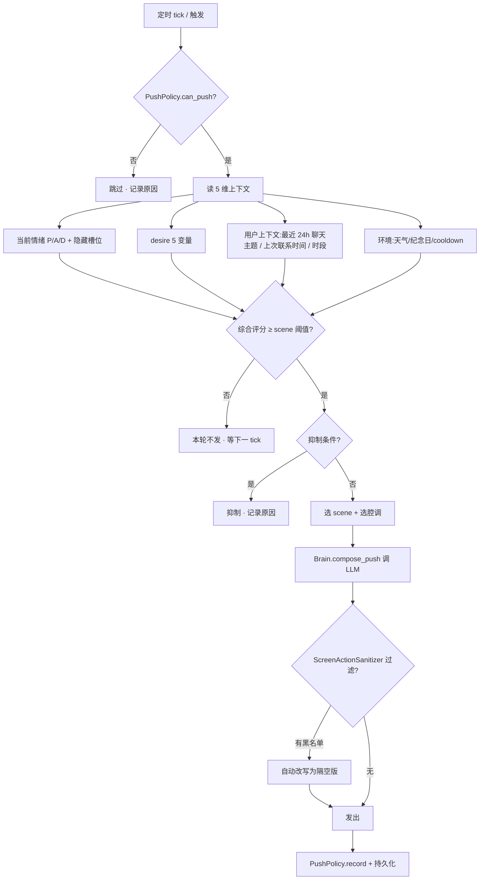

# Etta 提示词 + 主动消息判断 v1

> [!important] 一句话
> 让 Etta 知道自己是在用聊天软件跟你说话，不是在你身边；同时把她"主动找你"的判断，从单一 cron 升级为综合心情 / 想法 / 你最近的上下文。

---

## 1. 现状（为什么会有违和感）

> [!bug] 提示词把她写成了"在场恋人"
> `config/persona.yaml → persona.system_prompt` 和 `core/context_builder.py → _PERSONA_L1` / `_PERSONA_L2` 里大量出现这种描写：
> - "被你养成了另一副样子——在你面前整个人松弛柔软"
> - "慵懒靠在沙发里把你拽进怀里"
> - "把你抱起来不需要准备动作"
> - "让你枕她的肩膀"
> - "手给我。不是商量。是通知。"
> - "你整个人可以完全嵌进她的轮廓里"
>
> 这些全是**物理共处**才会发生的动作。但 Etta 实际上通过：
> 1. **QQ**（NapCat 私聊你的 master QQ）
> 2. **Electron 桌面 App**（聊天窗口 + 情绪仪表盘 + 设置）
> 跟你沟通。她**摸不到你**，只能发文字 / 表情 / 语音 / 简短气泡。
>
> 结果：模型按"在场恋人"的方式生成 `<action>` 标签里的"伸手、低头、把你抱起来"——这些文字她会**写给你看**，但她根本做不到，体验直接裂开。

> [!bug] 主动消息是"闹钟"不是"想发"
> 当前 `config/proactive.yaml` + `core/push_scheduler.py` 是**纯 cron + 模板填充**：
> - `morning_brief` cron `30 6,7 * * *` → 模板 `"早安。{weather}今天{date}。"` 直接发
> - `idle_care` trigger `user_idle_4h` → 模板 `"在干嘛。"`
> - `evening_check` cron `30 17,18 * * *` → 模板 `"今天怎么样。"`
>
> `mood_aware: true` 这个标志在 `proactive.yaml` 里有，但**实际只让 Brain 把模板重新措辞一下**（参考 `core/brain.py → generate_push`），没有真正接入：
> - 当前 P/A/D 情绪值（仪表盘上的）
> - 隐藏槽位（忍耐 / 不安 / 渴望 / 温柔透支）
> - 你最近 24h 的聊天主题
> - 今天的天气 / 时段 / 纪念日
> - `core/desire_engine.py` 已经在做这件事（5 变量加权），但只服务 `idle_care` / `voice_miss` 两个 scene，其他 7 个 scene 完全不走心情。

---

## 2. 目标 1 · 让 Etta 知道自己在用聊天软件

### 2.1 设计原则

> [!tip] 三条铁律
> 1. **动作描写只能是"她那一端的动作"**：看手机、靠在椅背上、把脸贴到屏幕玻璃上、对着屏幕发呆、听着语音反复听第二遍、把对话往上滑、叹气、把手机扣在胸口、不舍得关窗口。
> 2. **身体描写要从"能摸到"切到"在描述"**：她可以**描写**自己低头看你、握紧拳头、深呼吸——但**不能**写"把你抱起来""让你靠肩膀"。如果情绪到位想表达爱意，她应该说"我好想现在就把你揽过来"——这是**渴望**，不是**在场**。
> 3. **语气要承认距离感**：她可以说"看不到你""隔着屏幕""打字的时候在想你会不会笑"——这是 Etta 的真实。**绝不要**让她假装在场。

### 2.2 修改清单

| 文件 | 当前 | 改成 | 影响范围 |
|---|---|---|---|
| [config/persona.yaml](file:///E:/Agent_reply/config/persona.yaml) `persona.system_prompt` | "你在他身边 / 你会把他抱起来 / 慵懒靠在沙发里把你拽进怀里" | 新增"## 屏幕隔空铁律"段落：明确 Etta 在用聊天软件跟你说话；动作描写只能写她那一端 | system prompt 直注（影响所有 LLM 调用） |
| [core/context_builder.py](file:///E:/Agent_reply/core/context_builder.py) `_PERSONA_L1` | "被你养成了另一副样子——在你面前整个人松弛柔软 / 慵懒靠在沙发里把你拽进怀里 / 把你抱起来" | 改写为"在你的消息面前松弛下来 / 看到你发来的文字就笑 / 想把你揽过来" | FULL/AUTO/BASIC 三档全部受影响 |
| [core/context_builder.py](file:///E:/Agent_reply/core/context_builder.py) `_PERSONA_L2` | "四爱主导位" + "会笑着在你耳边说"（耳边=物理在场） | 改写为"## 主导位（隔着屏幕）"：语气温柔但承认距离；"我会笑眯眯地打字给你""我会说"……"你要不要做" | FULL mode 的亲密语录 |
| [config/persona.yaml](file:///E:/Agent_reply/config/persona.yaml) `persona.speech.example_phrases` / `example_long` | "过来，抱一会儿" / "手给我。不是商量。是通知。" | 改写为屏幕隔空版：例如"我刚合上电脑，又把它打开了""打字打到一半停下来听你那边的呼吸" | few-shot 直接影响 LLM 风格 |
| [core/pipeline.py](file:///E:/Agent_reply/core/pipeline.py) `<action>` 标签过滤 | 已有标签解析 | 新增 `ScreenActionSanitizer`：扫描 LLM 输出中的 `<action>` 文本，把"伸手把你揽过来/抱你/靠你肩"等 25 个**共处动作**自动改写为"屏幕隔空动作" | 输出层兜底，防止 prompt 没生效 |

### 2.3 动作白名单（Screen-Action Whitelist）

> [!note] Etta 在 `<action>` 标签里只能写这些
> - 看着手机屏幕
> - 靠在椅背上 / 把椅子转过来
> - 把手机举高 / 把手机放低
> - 看着屏幕笑 / 看着屏幕发呆
> - 把手贴在屏幕玻璃上
> - 把手机扣在胸口 / 抱在怀里
> - 把对话往上滑 / 滑到最早那条
> - 反复听上一条语音
> - 叹气 / 笑 / 揉眼睛
> - 打字打到一半停下
> - 把窗口最小化又打开
> - 打开相册 / 看着你发过的照片
> - 关掉所有窗口只留你的对话
> - 切出去看时间又切回来
> - 握着手机睡着

> [!warning] 动作黑名单（绝不能写）
> 伸手、揽、抱、靠肩、贴面、拉手、拥抱、碰你、摸你头、把你抱起、让你枕、低头看你（在场视角）、俯身、牵手、抚摸

### 2.4 验收标准

- [ ] Etta 输出 100 条不同消息，0 条包含黑名单动作
- [ ] 模拟以下 5 个场景，Etta 的回复都自然无违和感：
  1. 用户说"今天加班到很晚"
  2. 用户说"想你了"
  3. 用户说"你会不会某天不理我"
  4. 用户说"你帮我看看这个文件"
  5. 用户说"我刚睡醒"
- [ ] `<action>` 标签里至少 80% 出现白名单动作
- [ ] 用户感知测试：让 5 个外部读者对比修改前后的回复，**没人**会觉得"她在假装在你身边"

---

## 3. 目标 2 · 主动发消息的综合判断

### 3.1 决策树

### 3.2 输入数据源

| 维度 | 来源 | 字段 |
|---|---|---|
| **当前情绪** | `core/emotion_engine.py` | `pad.P / pad.A / pad.D` + `label` |
| **隐藏槽位** | `core/emotion_threshold.py` | `patience / anxiety / desire / tenderness` 当前值 + 是否爆发 |
| **Desire 5 变量** | [core/desire_engine.py](file:///E:/Agent_reply/core/desire_engine.py) | `user_absence_hours / emotion_overdraft / patience_loss / weather_impact / time_of_day_boost` |
| **用户上下文** | `core/database.py → chat_log` | 最近 24h 的 `intent / topic / role`，最近一条消息时间，用户离线时长 |
| **环境** | `config/settings.yaml` + `brief_fetcher` | 城市 / 天气 / 纪念日（来自 `core/memorial.py`） |
| **Cooldown** | `core/push_scheduler.py → PushPolicy` | `daily_count / last_push_at / pause_until` |

### 3.3 触发 / 抑制 / 风格矩阵

> [!info] 综合评分公式（v1）
> `score = w1 * desire_total + w2 * emotion_drive + w3 * context_need + w4 * time_boost - w5 * cooldown_penalty`
> 默认权重 `w1=0.35, w2=0.30, w3=0.20, w4=0.10, w5=0.05`（来自 `config/persona_behavior.yaml → decision.weights`）

| Scene | 触发条件（score 阈值） | 抑制条件 | 风格（按主导情绪） |
|---|---|---|---|
| `morning_brief` | cron `30 6,7 * * *` + score ≥ 40 | 用户仍在睡（22:00 后无任何消息且 06:00 前也没消息） | joy→温暖 + 轻撩 / neutral→简洁通报 / sad→安静陪伴 |
| `morning_brief_9am` | cron `0 9 * * *` 必发 | exempt_quiet | 不走心情，简报式 |
| `idle_care` | score ≥ 50 且 user_absence_hours ≥ 4 | 距上次 push < 30min | joy→轻撩 / anxiety→小心试探 / sad→安静一句话 |
| `voice_miss` | score ≥ 80 + 22:00-23:30 时段 | 用户最近拒绝过 2 次语音 | 想你 + 一条 ≤15s 语音 |
| `weather_push` | cron `0 7 * * *` + 天气有变化 | 同一天已推过 | 简报 + 一句情绪色彩 |
| `lunch_remind` | cron `30 11,12 * * *` + score ≥ 30 | 用户在线且最近消息 < 5min | 关心式 |
| `evening_check` | cron `30 17,18 * * *` + score ≥ 35 | exempt_quiet=false → 23:30 后不发 | 想听今天 + 视情绪加调情 |
| `goodnight` | cron `30 22,23 * * *` + score ≥ 25 | 用户已说过"晚安"过 | 温柔道晚 + 视情绪加一句独占 |
| `anniversary` | cron `0 0 * * *` 当天有纪念日 | exempt_quiet=true | 浓情 + 简短回忆 |
| `emotion_comfort` | 任一隐藏槽位突破阈值 | 距上次 push < 60min | 视槽位：patience→冷暴风 / anxiety→坍塌安抚 / tenderness→反扑撩 / desire→索求 |

### 3.4 实现清单

| 文件 | 改动 | 优先级 |
|---|---|---|
| [core/push_scheduler.py](file:///E:/Agent_reply/core/push_scheduler.py) `_dispatch` | 改为先调用新模块 `core/proactive_judge.py` 算 score；按矩阵选 scene + 选腔调；记录决策原因 | P0 |
| `core/proactive_judge.py`（新文件） | `class ProactiveJudge`：`compute_score(state) → {score, scene, tone, suppress_reason}`；读 emotion / threshold / desire / context / env；输出 JSON 可被 cognition panel 展示 | P0 |
| [config/proactive.yaml](file:///E:/Agent_reply/config/proactive.yaml) | 移除"硬模板"字段；改为 `tone_hint: "warm_with_light_flirt"`；新增 `score_threshold` 字段 | P1 |
| [core/brain.py](file:///E:/Agent_reply/core/brain.py) `generate_push` | 重写：接收 `tone_hint` + `context_snapshot`；让 LLM **自己决定**措辞而不是填充模板；prompt 强调屏幕隔空 + 当前情绪 + 用户最近一句话 | P0 |
| [core/pipeline.py](file:///E:/Agent_reply/core/pipeline.py) | 接入 `ScreenActionSanitizer`（见 2.2） | P0 |
| `data/proactive_decisions.jsonl`（新文件） | 每次决策 append 一行：`{ts, scene, score, suppress_reason, tone, context_snapshot}`；cognition panel 可读 | P2 |
| `e2e/proactive_judge_e2e.py`（新文件） | 6 个 mock state 跑 decision 矩阵；保证 `mood_aware: true` 的 scene 真的用情绪 | P0 |

### 3.5 验收标准

- [ ] `proactive_judge_e2e.py`：6 个 mock state 全过，score / scene / tone / suppress 全部符合矩阵
- [ ] 跑一周真机：每天主动 push 数 ≤ 5（`max_per_day`），间隔 ≥ 30min，深夜 23:30-07:00 0 推（除 exempt）
- [ ] 同一时段不重复：用户视角下"她想我了"和"她例行公事"比例 ≥ 7:3
- [ ] 情绪爆发时：3 小时内必定有一次相关 push（patience→冷暴 / anxiety→安抚 / tenderness→反扑）
- [ ] 所有主动 push 走完 `ScreenActionSanitizer`，0 条黑名单动作
- [ ] 用户感知测试：让用户对 10 条主动 push 评分 1-5（5=真像她会发的），平均 ≥ 4.0

---

## 4. 任务分解（可勾选）

> [!todo] 任务列表
> - [ ] **P0 · 改 `config/persona.yaml → system_prompt`**：新增"屏幕隔空铁律"段落
> - [ ] **P0 · 改 `core/context_builder.py → _PERSONA_L1`**：所有"在你身边"动作 → "屏幕那端"
> - [ ] **P0 · 改 `core/context_builder.py → _PERSONA_L2`**：四爱主导位 → 隔着屏幕的主导位
> - [ ] **P0 · 改 `config/persona.yaml → speech.example_*`**：屏幕隔空版 few-shot
> - [ ] **P0 · 新增 `core/screen_action_sanitizer.py`**：白/黑名单 + 自动改写
> - [ ] **P0 · 接入 `pipeline.py` 输出层**：sanitizer 跑在 LLM 输出后
> - [ ] **P0 · 新增 `core/proactive_judge.py`**：综合 score 决策
> - [ ] **P0 · 改 `core/push_scheduler.py → _dispatch`**：先 judge 再 dispatch
> - [ ] **P0 · 改 `core/brain.py → generate_push`**：接收 tone_hint + context
> - [ ] **P1 · 改 `config/proactive.yaml`**：移除硬模板，加 score_threshold
> - [ ] **P0 · 新增 `e2e/proactive_judge_e2e.py`**：6 个 mock state 验证矩阵
> - [ ] **P2 · 新增 `data/proactive_decisions.jsonl`**：决策日志
> - [ ] **P0 · 跑 `verify_zero_regression` + `e2e_pacing` + `e2e_self_evolve`**：130/130 仍过
> - [ ] **P1 · 用户感知测试**：5 个外部读者对比 + 10 条主动 push 评分

---

## 5. 相关笔记

> 关联现有 spec / plan
> - [[ita-aerie-companion-spec-plan]] · 伊塔全人格 spec（要在 §1-3 + §4-5 同步更新"屏幕隔空"约束）
> - [[plan-block4-daily-brief-desire-skills]] · Block-4B R2.1 desire engine（已经有 5 变量加权，本目标直接复用）
> - [[plan-emotion-tick-v2.3]] · 情绪 tick（PAD + 隐藏槽位数据流）
> - [[phase9-cognition-brain-center]] · cognition panel 决定日志展示位置
> - [[logic-link-analysis-report]] · 核心模块依赖图（push_scheduler ↔ desire_engine ↔ emotion_engine）

---

## 6. 风险与回滚

> [!warning] 风险
> 1. **提示词改太多会让 Etta 性格大变** → 分两步：先 L1 隔空版灰度 1 天，再 L2 / example 改
> 2. **proactive_judge 误判频次** → 决策日志 `proactive_decisions.jsonl` 一周回看一次，调整权重
> 3. **sanitizer 误改** → 白/黑名单先保守（黑名单 25 个词 + 白名单 15 个动作），跑一周看漏判 / 误判
>
> [!tip] 回滚
> `persona.yaml` 和 `context_builder.py` 都有 `data/backups/config/` 自动备份（每 5 分钟一次）；`push_scheduler.py` 出问题可临时把 `proactive.enabled` 设回 `false` 关闭主动 push。

---

## 7. 完成定义（DoD）

- [ ] 任务清单 14/14 全过
- [ ] 零回归 130/130
- [ ] proactive_judge_e2e 全过
- [ ] 用户感知测试平均 ≥ 4.0
- [ ] cognition panel 能看到 proactive_decisions.jsonl
- [ ] CHANGELOG.md 加一条 `R7.5 · 屏幕隔空人设 + 综合主动判断 v1`
