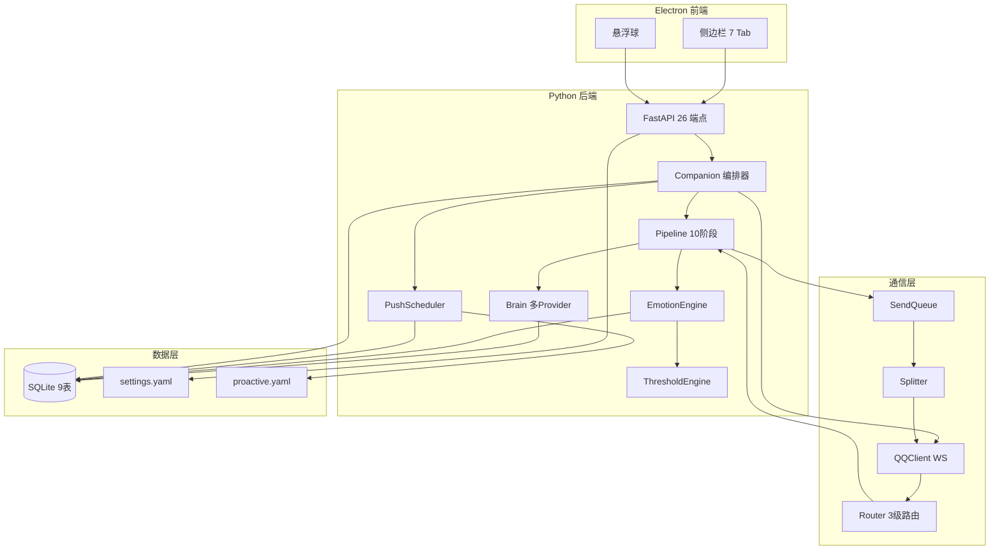
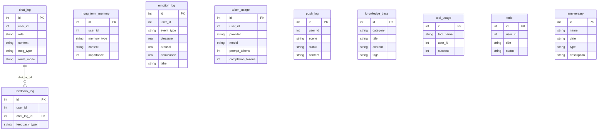

# Aerie · 云栖 — 逻辑链路分析报告

> 本文档分析系统各模块间的功能定位、交互关系、数据流转路径，为开发和维护提供全局视角。

---

## 一、系统全貌概览

> [!quote] 架构速览
> Electron（主进程 + 渲染进程）← IPC → Python 后端（FastAPI + Companion）← WS → NapCat（QQ 协议）



---

## 二、数据流链路分析

### 2.1 主消息链路（用户发 QQ → 伊塔回复）

```
[你发QQ消息]
  ↓
[NapCat WS 端口3001]
  ↓
[QQClient.receive] → IncomingMessage.from_onebot_event()
  ↓
[Router.route] 判定 MASTER / FRIEND / STRANGER
  ↓
[Pipeline.handle] 10阶段管线:
  ① route     → 路由模式分配
  ② emotion   → EmotionEngine.analyze(text) → PAD三维 + 标签
  ③ threshold → emotion.update_trajectory() → 累积阈值检查
  ④ history   → DB.chat_log 查询最近 N 条
  ⑤ context   → ContextBuilder.build(emotion_info, eruption_info)
  ⑥ LLM       → Brain.chat(messages, tools)
  ⑦ emotion   → EmotionEngine.tune(text) → 文本调色
  ⑧ persist   → DB 写入 chat_log + token_usage + emotion_log
  ⑨ emit      → stderr [CHAT_EVENT] → Electron IPC → DOM 渲染
  ⑩ reply     → SendQueue.enqueue → Splitter.split → QQClient.send
  ↓
[NapCat 发送] → [你收到回复]
```

### 2.2 主动推送链路

```
[CronScheduler] 解析 proactive.yaml 9场景
  ↓ 每个场景独立 asyncio.Task
  ↓ 计算下次触发时间 → await sleep
[触发]
  ↓
[PushPolicy.can_push] 检查:
  - 全局开关 / 日上限 / 静默时段 / 最小间隔
  ↓ allowed
[Companion._dispatch_push]
  ↓
① EmotionEngine.get_state → 当前情绪标签
② Brain.generate_push(template, mood, **kwargs) → 内容生成
③ QQClient.send_message → 发送至主人 QQ
④ PushPolicy.record → 更新日计数器
```

### 2.3 情绪链路

```
[用户消息到达]
  ↓
[EmotionEngine.analyze(text)]
  → 关键词扫描 (30+组)
  → PAD三维计算 (Pleasure, Arousal, Dominance)
  → 五类情绪分类 (Joy/Anger/Sad/Fear/Neutral)
  ↓
[EmotionEngine.update_trajectory]
  → EMA平滑 (alpha=0.3)
  → CumulativeEmotionEngine.scan_text(text)
    → 4槽位累积触发（忍耐/不安/渴望/温柔透支）
    → 阈值检查 → 爆发模式检测
  ↓
[API 产出]
  → GET /api/emotion/state → 完整状态
  → GET /api/emotion/thresholds → 槽位面板
  ↓
[前端渲染]
  → emotion-dashboard.js 3s轮询
  → PAD环形图 + 进度条 + 爆发横幅
```

### 2.4 UI 展示链路

```
[后端状态变化]
  ↓
[FastAPI 端点] 返回 JSON
  ↓
[Electron Main Process] IPC api:request → HTTP proxy
  ↓
[Electron Preload] contextBridge → window.aerie.api.request
  ↓
[Render JS] 各面板 JS 类调用
  ↓
[DOM 更新] innerHTML / textContent
```

---

## 三、各页面/组件分析

### 3.1 聊天 Tab (`panel-chat`)

| 维度 | 说明 |
|------|------|
| **功能定位** | 主对话入口，与伊塔实时聊天 |
| **数据来源** | POST `/api/chat/send` 发送；`[CHAT_EVENT]` IPC 推送接收 |
| **交互模块** | `chat.js` → `ChatManager` 类 |
| **关键交互** | 输入框 → Enter/点击发送 → API 调用 → 气泡渲染 |
| **状态依赖** | 后端就绪（health check）+ QQ 连接状态 |

### 3.2 QQ 面板 Tab (`panel-qq`)

| 维度 | 说明 |
|------|------|
| **功能定位** | NapCat QQ 协议客户端控制面板 |
| **数据来源** | GET `/api/napcat/status` 轮询 + `/api/napcat/logs` 日志 |
| **交互模块** | `napcat-panel.js` → NapCatPanel 类 |
| **关键交互** | 启动/停止 NapCat、扫码登录、日志查看 |
| **状态依赖** | NapCat 进程存活 + WS 端口 3001 可达 |

### 3.3 情绪 Tab (`panel-emotion`)

| 维度 | 说明 |
|------|------|
| **功能定位** | 实时展示伊塔情绪状态 |
| **数据来源** | GET `/api/emotion/state` + `/api/emotion/thresholds` 3s轮询 |
| **交互模块** | `emotion-dashboard.js` → EmotionDashboard 类 |
| **关键交互** | 可见性管理（切换 Tab 时暂停/恢复轮询） |
| **视觉效果** | PAD 环形图（conic-gradient）、进度条、爆发横幅动画 |

### 3.4 纪念 Tab (`panel-memorial`)

| 维度 | 说明 |
|------|------|
| **功能定位** | 管理纪念日列表，展示在一起天数 |
| **数据来源** | GET `/api/anniversary/list` 含 days_since 实时计算 |
| **交互模块** | `memorial.js` → MemorialPanel 类 |
| **关键交互** | 添加/编辑/删除纪念日（CRUD） |
| **数据流** | 表单 → POST/PUT/DELETE API → SQLite anniversary 表 |

### 3.5 设置 Tab (`panel-settings`)

| 维度 | 说明 |
|------|------|
| **功能定位** | 系统参数配置中心 |
| **数据来源** | GET `/api/settings`；PUT `/api/settings` 写入 |
| **交互模块** | `settings.js` → SettingsPanel 类 + `theme-switcher.js` |
| **关键交互** | 主题切换（即时生效+持久化）、开关配置、保存/重置 |
| **配置链路** | 表单 → IPC `settings:set` → HTTP PUT → save_settings → settings.yaml |

### 3.6 数据 Tab (`panel-data`)

| 维度 | 说明 |
|------|------|
| **功能定位** | 后台数据查看与统计 |
| **数据来源** | GET `/api/chat/history?page=&limit=` + `/api/knowledge/list` + `/api/stats/system` |
| **交互模块** | `data-viewer.js` → DataViewer 类 |
| **关键交互** | 3个子面板切换（聊天记录/知识库/系统状态）+ 分页 |
| **视觉效果** | 聊天记录列表 + 知识库卡片 + 状态卡片 |

### 3.7 悬球 (`floating-ball`)

| 维度 | 说明 |
|------|------|
| **功能定位** | 常驻桌面入口，消息通知徽标 |
| **数据来源** | `aerie.api.onMessage()` 监听助手回复 |
| **关键交互** | 拖拽移动、点击呼出主窗口 |
| **状态依赖** | 主窗口可见性 |

---

## 四、前后端接口映射表

> 当前共 **26 个 API 端点**，全部通过 `127.0.0.1:7890` 暴露。

### 4.1 已有端点（14 个）

| # | 端点 | 方法 | 调用方 | 用途 |
|---|------|------|--------|------|
| 1 | `/api/health` | GET | status-check (app.js) | 健康检查 + QQ 连接状态 |
| 2 | `/api/chat/send` | POST | chat.js (发送) | 发送消息 |
| 3 | `/api/chat/history` | GET | data-viewer.js | 聊天记录分页 |
| 4 | `/api/chat/poll` | GET | (轮询备选) | 增量轮询新消息 |
| 5 | `/api/napcat/status` | GET | napcat-panel.js | NapCat 状态查询 |
| 6 | `/api/napcat/start` | POST | napcat-panel.js | 启动 NapCat |
| 7 | `/api/napcat/stop` | POST | napcat-panel.js | 停止 NapCat |
| 8 | `/api/napcat/logs` | GET | napcat-panel.js | NapCat 日志 |
| 9 | `/api/napcat/qrcode` | GET | napcat-panel.js | QR 码图片 |
| 10 | `/api/emotion/state` | GET | emotion-dashboard.js | 情绪完整状态 |
| 11 | `/api/emotion/thresholds` | GET | emotion-dashboard.js | 累积阈值槽位 |
| 12 | `/api/tools/list` | GET | 调试 | 工具列表 |
| 13 | `/api/stats/tokens` | GET | status-check (app.js) | Token 消耗统计 |
| 14 | `/api/stats/system` | GET | data-viewer.js | 系统状态（CPU/内存/消息数） |

### 4.2 Phase 3 新增端点（12 个）

| # | 端点 | 方法 | 调用方 | 用途 |
|---|------|------|--------|------|
| 15 | `/api/settings` | GET | settings.js | 获取全量设置 |
| 16 | `/api/settings` | PUT | settings.js | 部分更新设置 |
| 17 | `/api/settings/reset` | POST | settings.js | 恢复默认设置 |
| 18 | `/api/anniversary/list` | GET | memorial.js | 纪念日列表 + days_since |
| 19 | `/api/anniversary/add` | POST | memorial.js | 添加纪念日 |
| 20 | `/api/anniversary/update/{id}` | PUT | memorial.js | 编辑纪念日 |
| 21 | `/api/anniversary/delete/{id}` | DELETE | memorial.js | 删除纪念日 |
| 22 | `/api/anniversary/upcoming` | GET | 推送调度 | 未来N天纪念日 |
| 23 | `/api/knowledge/list` | GET | data-viewer.js | 知识库列表 |
| 24 | `/api/anniversary/upcoming` | GET | 预留 | 即将到来的纪念日 |

### 4.3 IPC 通道（9 个）

| 通道 | 方向 | 用途 |
|------|------|------|
| `api:request` | renderer→main→Python | 通用 HTTP 代理 |
| `get-health` | renderer→main | 后端就绪状态 |
| `napcat:getStatus` | renderer→main | NapCat 状态 |
| `napcat:start` | renderer→main | 启动 NapCat |
| `napcat:stop` | renderer→main | 停止 NapCat |
| `settings:get` | renderer→main | 获取设置 |
| `settings:set` | renderer→main | 更新设置 |
| `settings:reset` | renderer→main | 恢复默认 |
| `chat:message` | main→renderer(推送) | 新消息通知 |
| `backend:health` | main→renderer(推送) | 后端健康广播 |

---

## 五、数据库 ER 图

> 共 **9 张表**：chat_log, long_term_memory, knowledge_base, todo, emotion_log, push_log, feedback_log, token_usage, tool_usage, **anniversary**



---

## 六、项目文件清单

### Python 后端（`core/` + `config/` + `communication/` + `knowledge/` + `memory/` + `tools/`）

| 文件 | 行数 | 关键职责 |
|------|------|----------|
| `core/companion.py` | ~180 | 编排器：初始化所有模块、生命周期管理 |
| `core/pipeline.py` | ~200 | 10阶段消息处理管线 |
| `core/brain.py` | ~240 | 多Provider LLM调用层 |
| `core/context_builder.py` | ~180 | 四层分层system prompt构建 |
| `core/emotion_engine.py` | ~200 | PAD情绪分析 + EMA平滑 |
| `core/emotion_threshold.py` | ~300 | 累积阈值引擎 + 爆发模式 |
| `core/push_scheduler.py` | ~240 | Cron调度器 + PushPolicy |
| `core/api_server.py` | ~400 | FastAPI 26端点 |
| `core/database.py` | ~260 | SQLite 9表单例 |
| `core/token_tracker.py` | ~120 | Token 消耗聚合 |
| `core/chat_events.py` | ~40 | stderr事件桥接 |
| `core/tool_registry.py` | ~100 | 工具注册与执行 |
| `core/napcat_launcher.py` | ~150 | NapCat进程管理 |
| `config/persona_loader.py` | ~100 | YAML配置加载/保存 |
| `communication/qq_client.py` | ~200 | OneBot11 WS客户端 |
| `communication/router.py` | ~80 | 3级路由策略 |
| `communication/send_queue.py` | ~120 | 发送队列+频率控制 |
| `communication/splitter.py` | ~60 | 语义分段 |
| `communication/message.py` | ~80 | DTO数据类 |
| `communication/recall_manager.py` | ~100 | 撤回管理 |
| `knowledge/kb.py` | ~80 | 知识库查询 |
| `memory/memory_store.py` | ~100 | 长期记忆管理 |
| `tools/__init__.py` | ~40 | 内置工具注册 |

### Electron 前端（`electron/src/`）

| 文件 | 关键职责 |
|------|----------|
| `main.js` | Electron主进程：窗口/托盘/IPC/spawn Python |
| `preload.js` | contextBridge：暴露 aerie API |
| `renderer/index.html` | 主窗口：7 Tab + 全部面板 |
| `renderer/styles/main.css` | Design tokens + 全部CSS |
| `renderer/styles/themes/*.css` (5) | 5色系主题变量 |
| `renderer/js/app.js` | 应用初始化 + Tab切换 + 健康监控 |
| `renderer/js/chat.js` | 聊天面板 |
| `renderer/js/napcat-panel.js` | QQ控制面板 |
| `renderer/js/emotion-dashboard.js` | 情绪仪表盘 |
| `renderer/js/theme-switcher.js` | 主题切换器 |
| `renderer/js/memorial.js` | 纪念日管理 |
| `renderer/js/settings.js` | 系统设置 |
| `renderer/js/data-viewer.js` | 后台数据查看 |

### 配置文件

| 文件 | 用途 |
|------|------|
| `config/settings.yaml` | 主配置（QQ/NapCat/API/主题/窗口/启动） |
| `config/persona.yaml` | 人设配置 |
| `config/proactive.yaml` | 主动推送9场景+Cron表达式 |
| `.env` | API Keys（不提交） |

### 测试（`tests/`）

| 文件 | 测试数 | 覆盖模块 |
|------|--------|----------|
| `test_api.py` | 18 | API端点 |
| `test_communication.py` | 12 | Router + Splitter + RecallManager |
| `test_context_builder.py` | 16 | 四层prompt + 情绪注入 |
| `test_emotion_engine.py` | 24 | PAD + 五类情绪 |
| `test_emotion_threshold.py` | 38 | 4槽位 + 爆发 + 衰减 |
| `test_pipeline.py` | 12 | 10阶段管线 |
| `test_tools.py` | 6 | 工具注册/执行 |

---
