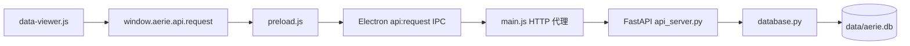

# 后台数据同步与知识库 CRUD 完整修复计划

> [!abstract] 目标
> 修复“后台数据”页面的数据读取、同步、保存和分页问题；补齐知识库的可见新增、查看、编辑、删除能力；保留现有“聊天记录 / 知识库 / 系统状态”三页签结构，并让所有新增界面自动跟随设置页的五套主题。

## 一、现状分析

### 1. 页面与调用链

当前页面入口位于 [[electron/src/renderer/index.html]]，由 [[electron/src/renderer/js/data-viewer.js]] 管理三个子页签，通过以下链路访问 Python 后端：



关键事实：

- 页面没有独立路由，使用 `#panel-data` 和 `.data-subtab` 切换视图。
- 聊天记录请求 `/api/chat/history?page=...&limit=...`。
- 知识库请求 `/api/knowledge/list`。
- 系统状态请求 `/api/stats/system`。
- 开发版数据库为项目 `data/aerie.db`；打包版数据库为 Electron `userData/data/aerie.db`。
- Electron 启动后端时会传递 `AERIE_DB_PATH`，但如果 7890 端口已有健康后端，会直接连接该进程，存在连接到旧代码或另一数据库的风险。

### 2. 已确认故障

> [!bug] 聊天分页协议断裂
> 前端发送 `page`，后端 `/api/chat/history` 只接收 `user_id` 和 `limit`，没有使用页码或偏移量，因此翻页会重复返回同一批最新记录。

> [!bug] 用户范围可能不一致
> 后台页面未显式传递 `user_id`，后端默认查询 `get_master_qq()`；消息写入使用 `msg.user_id`。两者不一致时，数据实际已写入，但页面会显示“暂无聊天记录”。

> [!bug] 错误被伪装为空数据
> 多个 API 捕获异常后仍返回普通 JSON，例如 `{"history": [], "error": ...}`；前端又使用 `r.data?.history || []`，因此数据库或接口失败会被误显示为“暂无数据”。

> [!bug] 持久化失败不会反馈
> [[core/pipeline.py]] 中聊天消息写入失败只记录日志，回复流程继续执行。用户可能收到正常回复，但聊天历史没有保存，页面也无法说明保存失败。

> [!warning] 知识库仅有残缺链路
> 数据库有 `knowledge_base` 表，[[knowledge/kb.py]] 只有 `search()` 和 `add()`；HTTP 层只有列表接口，页面也只能查看标题，没有详情、新增、编辑或删除。

> [!warning] 页面不会主动同步
> 后台数据仅在初始化、切换子页签或手动翻页时加载。聊天或知识库发生变化后，当前页面不会自动更新。

### 3. 主题机制

主题由 [[electron/src/renderer/js/theme-switcher.js]] 从 `localStorage.aerie-theme` 读取，并动态加载 `styles/themes/{theme}.css`。设置页提供：

- 伊塔粉 `yita-pink`
- 深夜紫 `midnight-purple`
- 樱白 `sakura-white`
- 海蓝 `ocean-blue`
- 森绿 `forest-green`

新增界面不写死粉色，统一复用以下语义变量及已有按钮、表单规范：

- `--color-bg`
- `--color-surface`
- `--color-border`
- `--color-text`
- `--color-text-muted`
- `--color-primary`
- `--color-primary-hover`
- `--color-primary-fg`
- `--success`
- `--error`
- `.btn`、`.btn-primary`、`.btn-secondary`、`.btn-sm`

## 二、实施方案

### 1. 修复聊天历史查询、分页与数据范围

**修改文件：** [[core/api_server.py]]、[[electron/src/renderer/js/data-viewer.js]]

#### 后端

- 为 `GET /api/chat/history` 增加经过边界限制的 `page`、`limit` 参数。
- 使用 `LIMIT ? OFFSET ?` 实现真正分页，其中 `offset = (page - 1) * limit`。
- 同条件执行 `COUNT(*)`，返回稳定协议：
  - `history`
  - `total`
  - `page`
  - `limit`
  - `user_id` 或查询范围标识
- 后台数据页默认展示全部本地聊天记录，不再隐式限定 `get_master_qq()`；如果传入 `user_id`，则按指定用户过滤。
- 数据仍按 `id DESC` 分页获取，返回前按当前页面需要保持既有显示顺序，避免视觉行为突变。
- 查询异常改为明确的非 2xx 响应，不再返回“空数组 + error”伪装成功。

#### 前端

- 删除未使用的本地 `offset`。
- 依据后端 `total/page/limit` 计算总页数和按钮状态。
- 页码显示调整为“第 X / Y 页 · 共 N 条”，无数据时保持现有简洁空状态。
- 上一页不允许减到 0；删除后或总数变化导致当前页越界时，自动回退到最后有效页。
- 统一检查 IPC 返回的 HTTP 状态和 `data.error`，将“暂无数据”与“加载失败”分开呈现。
- 对请求增加进行中锁，避免自动刷新与翻页并发覆盖。

### 2. 让聊天保存失败可观测

**修改文件：** [[core/pipeline.py]]、[[core/api_server.py]]

- 保留现有消息处理顺序，不重构无关聊天逻辑。
- 汇总用户消息和 AI 消息的写入结果，明确返回：
  - `persisted`
  - `persist_error`（仅失败时）
  - 现有 `user_msg_id`、`ai_msg_id`
- 任一必要写入失败时，API 响应中必须可识别，而不是只留在日志中。
- 不因历史保存失败丢弃已经生成的回复；保持当前聊天可用性，但让前端和日志能准确识别“回复成功、保存失败”。
- 不在本次计划中重写整条消息管线，也不引入新的数据库或同步服务。

### 3. 补齐知识库 HTTP CRUD

**修改文件：** [[core/api_server.py]]、[[knowledge/kb.py]]

新增并统一以下接口：

- `GET /api/knowledge/list`
  - 支持 `page`、`limit`、`category`、`search`
  - 返回 `items/total/page/limit`
  - 列表返回详情展示所需字段，包括 `content`、`tags`、`created_at`、`updated_at`
- `GET /api/knowledge/{id}`
  - 返回单条完整内容
  - 不存在时返回 404
- `POST /api/knowledge`
  - 校验 `category/title/content`
  - 新增后返回完整记录和 201
- `PUT /api/knowledge/{id}`
  - 更新 `category/title/content/tags`
  - 同步写入本地时间 `updated_at`
  - 不存在时返回 404
- `DELETE /api/knowledge/{id}`
  - 删除指定记录
  - 不存在时返回 404

`KnowledgeBase` 补齐 `get/list/update/delete`，HTTP 层通过该类操作数据，避免列表接口直接 SQL、写入接口又走另一套实现。所有异常转为一致的 HTTP 错误响应。

### 4. 补齐知识库页面可见操作

**修改文件：** [[electron/src/renderer/index.html]]、[[electron/src/renderer/js/data-viewer.js]]、[[electron/src/renderer/styles/main.css]]

#### 页面结构

保留现有三页签及整体密度，在“知识库”页签内增加：

- 顶部工具栏：搜索、分类筛选、“新增知识”按钮。
- 条目列表：分类、标题、正文摘要、标签、更新时间。
- 行级操作：查看/编辑、删除。
- 新增/编辑弹窗：分类、标题、正文、标签、保存、取消。
- 删除确认：复用轻量确认弹层，避免误删。
- 分页区：沿用聊天记录分页的按钮风格。
- 状态区：加载中、空数据、请求失败、保存成功/失败。

#### 交互规则

- 新增成功：关闭弹窗，回到第一页并刷新列表。
- 编辑成功：关闭弹窗并保留当前筛选和页码。
- 删除成功：刷新当前页；若本页已空则回退一页。
- 搜索输入采用短延迟防抖，分类变化立即刷新并回到第一页。
- 保存过程中禁用提交按钮，防止重复写入。
- 所有用户输入在列表渲染时继续经过 `esc()`，正文详情使用纯文本呈现，避免 HTML 注入。

#### 样式规则

- 新增 CSS 只使用主题语义变量，不写死某一主题色。
- 复用现有 `.btn`、`.settings-group`、状态卡片和模态框视觉语言。
- 保持当前页面的圆角、间距、字体、边框和轻量列表风格。
- 不修改五个主题文件，保证现有主题定义继续作为唯一颜色来源。

### 5. 增加页面可见时自动刷新

**修改文件：** [[electron/src/renderer/js/app.js]]、[[electron/src/renderer/js/data-viewer.js]]

- 为 `DataViewer` 增加 `setVisible(visible)`，由主侧边栏切换逻辑通知。
- 仅在“后台数据”面板可见时启动刷新，离开页面立即停止。
- 刷新当前激活的子页签，不重置筛选和页码。
- 建议频率：
  - 聊天记录：3 秒
  - 系统状态：3 秒
  - 知识库：5 秒
- 弹窗编辑中暂停知识库自动刷新，避免用户输入被覆盖。
- 使用请求锁保证同一资源只有一个进行中请求。

### 6. 增强实际数据库与后端来源诊断

**修改文件：** [[core/api_server.py]]、[[electron/src/main.js]]

- 在健康检查或系统状态响应中增加开发诊断字段：
  - 后端进程启动时间
  - 实际数据库绝对路径
  - 后端项目根目录/打包资源来源
- Electron 连接到 7890 端口已有后端时，校验其数据库路径是否等于当前期望的 `BACKEND_DB_PATH`。
- 路径不一致时不静默复用该后端，输出明确错误并启动/提示正确后端，避免“页面连接正常但读写另一份数据库”。
- 诊断信息只用于本地桌面应用，不改变现有主题或页面主功能。

## 三、测试与验证

### 1. API 自动化测试

**修改文件：** [[tests/test_api.py]]

补充以下回归测试：

- 插入 45 条聊天记录后，三页 ID 不重复，`total=45`，页码正确。
- 默认聊天历史返回全部本地记录；指定 `user_id` 时只返回该用户记录。
- 非法 `page/limit` 被边界约束或返回明确 4xx。
- 查询异常返回非 2xx，不再伪装为空数据。
- 知识库新增后可列表、可读取详情、可更新、可删除。
- 新增和更新后的 `updated_at` 有值且顺序正确。
- 缺少必填字段返回 400，不存在的知识条目返回 404。
- `/api/stats/system` 保持原字段，并返回数据库诊断信息。

### 2. 持久化路径测试

**修改文件：** [[tests/test_persistent_data_path.py]]

- 保留现有 `AERIE_DB_PATH` 测试。
- 增加后端实际数据库路径与环境变量一致的验证。
- 增加 Electron 期望数据库路径校验逻辑的静态或单元测试。
- 验证重建 `Database` 实例后，已写入聊天和知识库数据仍存在。

### 3. 前端验证

执行阶段完成后验证：

1. 打开“后台数据”，三个页签均能加载。
2. 连续发送消息后，聊天记录在不切页的情况下自动出现。
3. 翻到第 2 页后内容与第 1 页不同，返回上一页正常。
4. 新增知识条目后立即出现；重启应用后仍存在。
5. 编辑标题、正文、分类、标签后正确保存。
6. 删除条目后列表与总数同步更新。
7. 后端关闭、数据库查询失败时显示“加载失败”，不显示“暂无数据”。
8. 依次切换五套主题，工具栏、列表、弹窗、按钮、焦点和错误状态均跟随主题。
9. 系统状态的运行时间、CPU、内存、消息总数持续更新。
10. 开发模式与重新打包版本分别确认使用正确数据库路径。

### 4. 建议验证命令

```powershell
.\.venv\Scripts\python.exe -m pytest tests\test_api.py tests\test_persistent_data_path.py -q
```

```powershell
npm run check:all
```

最终再通过项目启动入口执行 Electron 手工验收；若依赖缺失，启动脚本可能安装依赖，执行前按当前环境确认。

## 四、实施顺序

1. 先补测试基线，固定聊天分页、错误协议和知识库 CRUD 行为。
2. 修复 FastAPI 查询、持久化反馈与知识库服务方法。
3. 改造后台数据页面结构和 `DataViewer` 交互。
4. 增加主题化样式，保持五套主题统一生效。
5. 接入页面可见性与自动刷新。
6. 增加数据库路径诊断和已有后端校验。
7. 运行测试、静态检查和 Electron 手工验收。

## 五、范围与决策

- 已选择“完整修复”：保留原三页签，同时提供知识库可见 CRUD。
- 保持现有页面风格，不将后台数据页改造成与项目不一致的新设计系统。
- 颜色由主题系统统一决定，不锁定截图中的粉色。
- 聊天记录本次以可靠查询、分页、自动同步和保存可观测为主，不增加聊天记录的手工编辑/删除管理。
- 系统状态保持只读实时数据，不设计无意义的 CRUD。
- 不修改旧的 `dist-*` 或 `_tmp_asar_*` 构建副本；只修改源码并通过重新构建生成产物。
- 不引入新数据库、ORM、状态管理框架或前端依赖。

> [!success] 预期结果
> 修复后，“后台数据”页面能准确读取同一份持久化数据库；聊天记录可真实分页并自动同步；知识库可完整新增、查看、编辑、删除且重启不丢失；接口故障不再伪装为空数据；所有新增界面自动适配设置页的五套主题。
