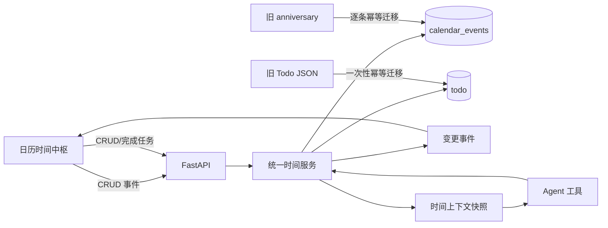

# 日历与时间中枢修复计划

> \[!abstract] 目标
> 把“日历 · 我们的时光”从一个仅能手工展示 `calendar_events` 的孤立页面，修复为 **关系纪念 + 个人安排 + 每日任务的统一时间中枢**：数据可靠持久化，页面与 Agent 使用同一事实源，外部变更能实时同步，并以更清晰、有情感温度但不过度粉饰的月历界面呈现。

## 一、页面定位

该页面不是普通办公日历，也不是单纯纪念日墙，而是 Aerie 一级功能中的“共同时间空间”：

1. **共同记忆**：用户自行设立纪念日、倒计时、重要日期；长期保存在 SQLite 中，并作为结构化事实提供给 Agent。
2. **未来安排**：用户或 Agent 创建日程、提醒，双方从同一数据源读取和修改。
3. **每日行动**：每日任务保留完成状态、优先级、预计耗时等任务语义，同时按日期聚合到月历与当日议程中。
4. **时间感知**：Agent 每轮对话可获得“今日事件、今日未完成任务、未来 7 天纪念日”的精简快照，从而真正知道用户近期安排，而不是把所有记录复制成长文本记忆。

> \[!important] 核心边界
> `calendar_events` 是“事件”的唯一事实源；SQLite `todo` 是“任务”的唯一事实源。页面通过聚合接口统一展示，但不把任务伪装成事件，也不做标题/日期猜测式双写。

## 二、当前状态与三个问题的根因

### 2.1 数据没有同步

* 新页面读取 `calendar_events`，旧纪念日接口仍写 `anniversary`，两者只有启动时的一次性粗粒度迁移。

* 每日任务存于 `data/todos/YYYY-MM-DD.json`，日历页面从未请求 `/api/todos`，打包态也没有遵循 `AERIE_DATA_DIR`。

* 后端已发送 `calendar_event_created/updated/deleted`，但日历页面没有订阅，因此 Agent 或其他入口创建后不会实时刷新。

* Agent 日历工具引用不存在的 `core.calendar_db`，实际上无法与页面共享数据。

* Agent 上下文没有注入日历和任务信息；“存到数据库”不等于 Agent 会知道。

### 2.2 日历视觉差

* 42 个等比例方格占据大面积空白，只用最多 3 个圆点表达安排，信息密度低且难扫描。

* 顶部 4 张统计卡抢占主视觉，但只有“相识天数”与页面核心关系直接相关；消息总量不帮助安排时间。

* 右侧固定 320px、筛选器拥挤、空状态占据整栏，无法快速看出一天的任务与日程。

* 多处硬编码粉色、阴影和类型色，没有完全服从主题变量，导致不同主题下观感不一致。

* “相识天数”错误使用后端本次启动时间，情感指标本身不可信。

### 2.3 日程无法成功保存和读取

* 页面保存后不检查 HTTP 状态和 `data.error`，即使后端失败也会关闭弹窗，制造“保存成功但消失”的假象。

* FastAPI 多个异常分支以 HTTP 200 返回 `{error: ...}`；Electron IPC 又无条件 resolve。

* Agent 的 `calendar_create/calendar_list` 使用不存在的模块和旧字段格式，是确定性失败。

* Electron 可能附着到一个使用其他数据库路径的既有 7890 后端，造成写入与读取不在同一数据库。

## 三、方案选择

### 方案 A：继续维护多数据源并双向同步

保留 `anniversary`、`calendar_events`、JSON Todo，再增加同步器。

* 优点：初始改动看似较少。

* 缺点：需要处理双写、冲突、删除传播和关联 ID；长期仍会失真。

* 结论：不采用。

### 方案 B：所有内容都塞进 `calendar_events`

纪念日、日程、提醒和 Todo 全部变成事件。

* 优点：查询接口最简单。

* 缺点：Todo 的完成状态、优先级、预计耗时与事件模型不同，会污染事件表并削弱任务能力。

* 结论：不采用。

### 方案 C：事件与任务各自单一事实源，读取时统一聚合（采用）

* `calendar_events`：纪念日、日程、倒计时、日志、提醒。

* SQLite `todo`：每日任务。

* `/api/calendar/timeline`：按时间范围聚合两类数据，返回统一展示 DTO 和分类统计。

* Agent 工具与上下文服务直接复用同一管理层。

> \[!success] 为什么这是正确答案
> 它既消除重复事实源，又保留事件和任务各自真实的领域语义；同步发生在统一写入、统一读取与变更通知层，不依赖脆弱的双写。

## 四、目标架构与数据流



### 统一展示 DTO

聚合接口返回 `items`，每项至少包含：

```json
{
  "id": "event:12",
  "kind": "event",
  "type": "anniversary",
  "title": "第一次见面",
  "description": "",
  "start_time": "2026-07-19T00:00:00",
  "end_time": null,
  "all_day": true,
  "color": "#a18cd1",
  "completed": null,
  "priority": null,
  "editable": true,
  "source": "manual"
}
```

Todo 使用 `id: "todo:<id>"`、`kind: "todo"`，并返回 `completed`、`priority`；前端据 `kind` 走对应编辑/完成接口。

## 五、拟修改文件与职责

### 后端领域与持久化

* `core/database.py`

  * 补齐 SQLite `todo` 表的 `notes`、`estimated_minutes`、`updated_at` 等现有 JSON 字段；沿用现有启动建表/增量列迁移模式，不创建第二张任务表。

  * 为 `calendar_events(start_time, event_type)` 与 `todo(due_at, status)` 保持或补充范围查询索引。

* `core/todo_manager.py`

  * 从 JSON 文件实现改为基于 `Database` 的任务仓储；保留现有公开函数签名，避免每日简报与 Todo API 大面积改写。

  * 增加一次性幂等 JSON 导入：以原 UUID 或迁移标记去重，成功导入后不删除旧文件，避免不可逆丢失。

  * 写入失败必须抛出异常，不能只记录日志后返回“成功对象”。

* `core/calendar_manager.py`

  * `calendar_events` 保持事件唯一事实源。

  * 旧 `anniversary` 迁移改为逐条幂等映射，而不是“存在任意迁移记录就全部跳过”。

  * 增加月范围聚合方法，组合事件与 Todo 为统一 DTO。

  * 增加 `get_agent_snapshot(user_id, now)`，仅返回今天事件、未完成任务、未来 7 天纪念日。

* `core/office_tools.py`

  * 删除不存在的 `core.calendar_db` 依赖。

  * `calendar_list/calendar_create` 改用 `Database + CalendarManager`；把 `date/time/category` 明确映射为 `start_time/event_type/source="agent"`。

### API、错误传播与进程一致性

* `core/api_server.py`

  * 所有日历异常使用正确的 4xx/5xx `JSONResponse`。

  * 增加 `GET /api/calendar/timeline?start=&end=` 聚合接口。

  * 旧 `/api/anniversary/*` 改为兼容适配层，直接操作 `calendar_events(event_type='anniversary')`，不再写旧表。

  * 事件/任务创建、更新、删除、完成后发送统一 `timeline_changed` 事件。

  * `/api/calendar/companion` 不再传 `_START_TIME`，从最早聊天记录计算相识天数。

* `electron/src/main.js`

  * `apiRequest()` 对非 2xx 构造带 `status/data` 的 Error 并 reject。

  * 后端健康检查返回并校验当前 `AERIE_DB_PATH` 的非敏感标识；若既有 7890 后端不匹配当前数据目录，则明确报错而不是静默附着，防止读写不同库。

### Agent 时间感知

* `core/context_builder.py`

  * 新增可选 `time_context` 参数，并在 FULL/AUTO 模式系统上下文中注入短小的结构化时间摘要；BASIC 不注入以控制上下文体积。

* `core/pipeline.py`

  * 在构建上下文前调用 `CalendarManager.get_agent_snapshot()`，失败时记录日志但不阻断聊天。

* `core/agent.py`

  * 与主 Pipeline 采用同一时间快照入口，避免两条 Agent 路径认知不一致；同时不把纪念日重复写入 `long_term_memory`。

### 前端功能与视觉

* `electron/src/renderer/index.html`

  * 标题保留“我们的时光”，副标题明确“纪念、安排与每日任务”。

  * 顶部由 4 张同权统计卡改为 1 个关系摘要 + 3 个紧凑指标：相识天数、今日安排、待完成任务、未来纪念日。

  * 右侧从“事件列表”改为“当日议程”，增加“全部 / 纪念 / 日程 / 任务”筛选和任务完成入口。

  * 弹窗保留事件编辑；Todo 点击进入现有 Todo 编辑能力，不混用事件表单。

* `electron/src/renderer/js/calendar-panel.js`

  * 改用 `/api/calendar/timeline`，并按 `kind` 渲染事件与任务。

  * 保存、删除必须检查结果；保存中禁用按钮，成功后才关闭，失败则保留用户输入并展示内联错误。

  * 订阅 `timeline_changed`，仅在日历 Tab 激活或当前月受影响时刷新，避免无意义重复请求。

  * 处理请求竞态：月份快速切换时只接纳最后一次请求结果。

  * 日期格显示最多两条短标题与 `+N`，而不是只有无语义圆点；当天议程按“全天 → 时间 → 优先级”排序。

* `electron/src/renderer/styles/calendar-panel.css`

  * 采用“温柔编辑感”的克制设计：大面积中性表面、主题主色只用于今天/选中态/关键动作，关系感通过细线、日期标记与留白表达。

  * 月历从正方形格改为固定最小高度的 6 行网格，日期数字左上对齐；周末弱化，今天用描边环，选中态不用整格高饱和填充。

  * 议程采用时间轴而非普通卡片堆叠，任务显示勾选状态与优先级，不同主题均使用语义变量。

  * 复用 `main.css` 的按钮、阴影、圆角、overlay，不在日历文件重复定义 `.btn-danger`。

  * 在 900px 以下切换为“月历 + 下方议程”，保持键盘焦点、hover 和 reduced-motion 可用。

## 六、实施任务

### 任务 1：先锁定数据与失败行为

* [ ] 新建 `tests/test_calendar_manager.py`：覆盖事件 CRUD、时间范围、逐条纪念日迁移、聚合 DTO。

* [ ] 新建 `tests/test_todo_manager.py`：覆盖 SQLite CRUD、完成状态、按日期查询、JSON 幂等迁移、写入异常传播。

* [ ] 扩展 `tests/test_tools.py`：证明 Agent 创建后可由 `CalendarManager.list_events()` 读回。

* [ ] 扩展 `tests/test_api.py`：覆盖日历 400/404/500、timeline 聚合与相识天数来源。

* [ ] 先运行上述定向测试并确认新增用例因现有实现失败，再进入实现。

### 任务 2：统一持久化事实源

* [ ] 为 SQLite Todo 补齐兼容字段和索引。

* [ ] 将 `todo_manager.py` 切换到 SQLite，保持调用签名兼容每日简报。

* [ ] 实现 JSON Todo 的幂等导入和迁移日志，不删除原文件。

* [ ] 将旧纪念日迁移改成逐记录幂等，并让旧 API 只写 `calendar_events`。

* [ ] 运行 Todo、Calendar 与每日简报相关测试，确认现有功能不回退。

### 任务 3：修通保存、读取与错误传播

* [ ] FastAPI 日历端点统一正确状态码与错误结构 `{error, code}`。

* [ ] Electron `apiRequest()` 对非 2xx reject，并保留后端错误文本。

* [ ] 前端保存流程加入 loading、成功确认、失败保留弹窗与内联错误。

* [ ] 增加数据库路径身份校验，阻止 Electron 静默连接错误后端。

* [ ] 验证“页面创建 → SQLite 可查 → 页面刷新可见 → 编辑/删除可见”的闭环。

### 任务 4：聚合每日任务并实现实时同步

* [ ] 实现 timeline 聚合查询与统一 DTO。

* [ ] 事件和任务变更统一发出 `timeline_changed`，载荷包含日期、kind、action、id。

* [ ] 日历订阅变更事件，并只刷新受影响月份及统计。

* [ ] 日历日期格与当日议程显示任务，支持直接勾选完成；任务编辑仍走 Todo API。

* [ ] 验证每日简报创建/完成任务后日历自动更新，日历完成任务后每日简报读取一致。

### 任务 5：让 Agent 真正知道时间安排

* [ ] 修复 `calendar_list/calendar_create` 并增加工具级测试。

* [ ] 实现时间快照，严格限制数量与字符长度，避免上下文膨胀。

* [ ] 在 Pipeline 与 Agent 两条路径注入相同快照。

* [ ] 验证“让 Agent 创建明天日程 → 页面实时出现 → 新对话能回答明天安排”。

### 任务 6：重构日历视觉层级

* [ ] 调整页面信息架构：关系摘要、紧凑指标、月历、当日议程。

* [ ] 日期格展示可读短标题与溢出数量，任务与事件拥有可区分但克制的标记。

* [ ] 将右栏改为时间轴，完成态任务降低对比度但保留可读性。

* [ ] 使用主题语义变量清理硬编码主色、阴影和危险按钮。

* [ ] 检查 1280×800、900×600 与窄屏单栏布局，并验证所有内置主题。

### 任务 7：端到端回归

* [ ] 新建 `tests/e2e/e2e_calendar_time_hub_verify.py`，覆盖迁移、事件、任务、Agent 工具和聚合读取。

* [ ] 运行定向后端测试：`python -m pytest tests/test_calendar_manager.py tests/test_todo_manager.py tests/test_tools.py tests/test_api.py -v`。

* [ ] 运行现有持久化回归：`python -m pytest tests/test_persistent_data_path.py -v`。

* [ ] 启动开发环境进行 Electron 手工验收，记录浏览器控制台与后端日志均无日历错误。

* [ ] 使用 VS Code diagnostics 检查改动文件无新增语法或静态诊断。

## 七、验收标准

> \[!check] 数据一致性
>
> * 页面、Agent 工具和兼容纪念日 API 创建的事件都能在同一 `calendar_events` 中读取。
>
> * 每日简报与日历看到同一份 SQLite Todo；重启与打包升级后仍存在。
>
> * 旧 JSON Todo 和旧纪念日仅迁移一次，重复启动不产生重复记录。

> \[!check] 保存与读取
>
> * 后端失败时弹窗不关闭，用户输入不丢失，并显示真实错误。
>
> * 成功保存后当前月与当日议程立即更新；重启后仍可读取。
>
> * 连接到错误数据库路径的后端时给出明确错误，不允许静默运行。

> \[!check] Agent 认知
>
> * Agent 能创建并查询页面同源事件。
>
> * Agent 能回答今日任务、明日日程、未来纪念日；上下文仅包含必要时间窗口。
>
> * 页面外发生的事件/任务变更无需手工刷新即可呈现。

> \[!check] 视觉体验
>
> * 用户一眼能区分纪念日、日程与任务，并直接看到日期格内的关键标题。
>
> * 顶部不再由无关消息统计主导，月历与当日议程成为视觉主体。
>
> * 1280×800 下无需页面级滚动即可使用核心月历；900×600 下布局不溢出。
>
> * 所有主题具有足够对比度，选中态、今天、完成态不依赖单一颜色表达。

## 八、假设与明确决策

* 保留原生 HTML/CSS/JS 与 Electron 架构，不引入 React/Vue 或第三方日历库。

* 不实现外部系统日历（Google/Outlook/ICS）同步；本次“同步”指项目内部各入口同源与实时更新。

* 不把结构化日期重复复制进 `long_term_memory`；Agent 通过实时查询快照获知，避免过期记忆。

* 不在本次实现复杂重复规则和通知调度；保留现有字段，待基础数据闭环稳定后单独规划。

* 不删除旧 JSON 文件和 `anniversary` 表，只停止其继续成为写入事实源，确保迁移可审计、可回退。

* 不创建泛化同步框架；只实现当前事件、Todo、Agent、页面所需的最小稳定边界。

## 九、关联模块

* \[\[每日简报]]：继续消费统一后的 Todo 数据。

* \[\[Agent 上下文]]：消费有限时间快照，不持有第二份时间事实。

* \[\[Persona Hub]]：仅提供表达风格，不负责时间数据。

