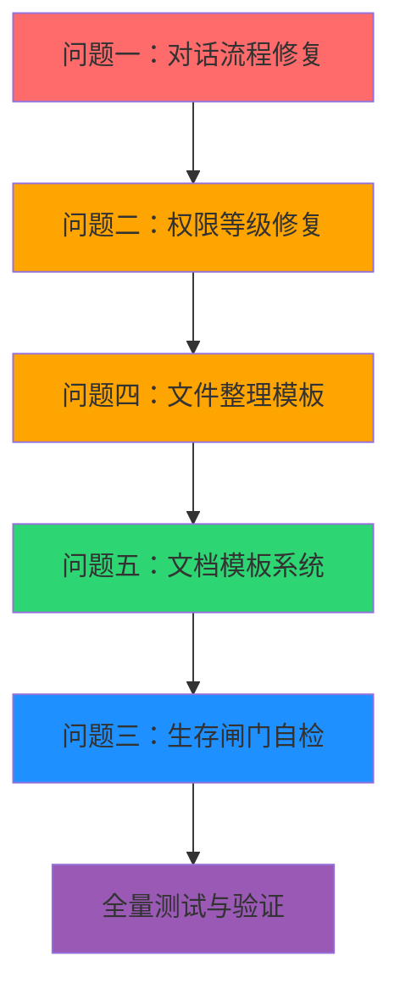

# v13.1 五大问题修复与功能升级实施计划

> [!abstract] 计划概览
> 本计划针对系统当前五大核心问题进行全面整改，涵盖对话流程闭环、权限等级生效、生存闸门自检、文件整理快速启动、文档模板系统五大模块。遵循「科学调试 + 证据驱动 + 最小修复」原则，确保每个问题定位准确、修复彻底、验证充分。

---

## 一、问题总览与诊断结论

### 1.1 问题清单

| # | 问题类型 | 严重程度 | 优先级 | 状态 |
|---|---------|---------|--------|------|
| 1 | 对话流程断层 | 🔴 高 | P0 | 待诊断 |
| 2 | 权限等级不生效 | 🟠 中高 | P1 | 待诊断 |
| 3 | 生存闸门待机 | 🟡 中 | P2 | 待诊断 |
| 4 | 文件整理缺快速启动 | 🟡 中 | P1 | 待开发 |
| 5 | 文档模板系统 | 🟢 中低 | P2 | 待开发 |

### 1.2 架构现状分析

> [!info] 双轨对话架构
> 系统采用 **双轨并行 + 核心组件共享** 架构：
> - **旧 Pipeline**：[[pipeline.py]] — 9 阶段线性流程（route → emotion → history → context → brain → tools → split → postprocess → output），QQ 消息走此链路
> - **新 Agent**：[[agent.py]] — 6 步主循环（Perceive → Reason → Decide → Act → Reflect → Express），更先进但尚未完全接入
> - **共享组件**：emotion_engine / context_builder / brain / tool_registry / cognition 为同一实例，两条链路共享实例

---

## 二、问题一：对话流程断层修复

### 2.1 现象描述

从系统截图观察到：`route_mode = BASIC` 且 `skipped = true`，后续 8 个认知阶段全部为 `null`，对话链路仅完成第一层路由判断即终止。

### 2.2 根因假设（科学调试法）

> [!bug] 假设清单（待运行时验证）
>
> **H1：BASIC 模式设计性跳过** — [pipeline.py#L65-L70](file:///e:/Agent_reply/core/pipeline.py#L65-L70) 中 `route_mode == "BASIC"` 时直接 `return None`，这是故意设计（陌生人仅简单回复），但缺少轻量版处理逻辑
>
> **H2：用户关系等级判定过低** — 用户关系值低于 BASIC 阈值，被路由判定为陌生人，触发跳过逻辑
>
> **H3：前端 Web 端走不同链路** — 截图可能来自前端页面，走的是 Agent 新链路而非 Pipeline 旧链路，阶段数据未对齐
>
> **H4：认知记录写入失败** — 实际执行了但写入 cognition_log 时失败，导致前端显示 null

### 2.3 调试方案

| 步骤 | 动作 | 验证点 |
|------|------|--------|
| 1 | 启动 Debug Server，初始化 session: `conversation-flow-gap` | 调试服务正常运行 |
| 2 | 在 pipeline.py BASIC 分支插入桩日志 | 确认是否进入 BASIC 跳过 |
| 3 | 在路由层插桩，记录 route_mode 判定依据 | 确认为什么是 BASIC |
| 4 | 用测试用户发消息复现 | 收集运行时证据 |
| 5 | 对比前端展示与后端日志 | 定位断层位置 |

### 2.4 修复方案

> [!success] 整改目标
> BASIC 模式不再完全跳过，改为 **轻量版对话链路**：保留情绪识别 + LLM 回复 + 输出后处理，跳过工具调用 + 自进化 + 完整认知追踪，确保端到端对话闭环。

**改动模块：**
- [[pipeline.py]] — 新增 `_handle_basic_mode()` 轻量处理方法
- [[context_builder.py]] — BASIC 模式精简系统提示词
- [[cognition.py]] — BASIC 模式记录关键阶段（route + brain + output）

**具体步骤：**
1. 提取 Pipeline 中 BASIC 也需要执行的核心步骤（情绪/历史/上下文/LLM/后处理/持久化）
2. 封装为 `_handle_basic_mode()` 方法，替换当前直接 `return None`
3. BASIC 模式下工具列表设为空，禁止工具调用
4. 自进化检查跳过，但基础认知追踪保留（至少 route + brain + output 三个阶段）
5. 确保 emit 事件正常发出，前端能收到回复

---

## 三、问题二：权限等级功能修复

### 3.1 现象描述

前端选择权限等级（VIEW_ONLY / STANDARD / FULL）后，配置未正常生效到前置智能代理组件，Agent 行为不受权限约束。

### 3.2 根因假设

> [!bug] 假设清单
>
> **H1：前后端权限状态不同步** — 前端通过 API 设置了 `_computer_controller` 的权限，但 Agent 决策时读的是另一个实例或默认值
>
> **H2：Agent 决策层未接入权限检查** — [[decision.py]] 决策引擎在判断是否允许工具调用时，未检查当前权限等级
>
> **H3：工具调用层绕过权限校验** — tool_registry 执行工具时，未经过 PermissionManager 校验
>
> **H4：权限变更未通知 Agent 层** — 权限设置后只改了 ComputerController，未同步到 Agent/Brain 的上下文

### 3.3 调试方案

| 步骤 | 动作 | 验证点 |
|------|------|--------|
| 1 | 启动 Debug Server，session: `permission-level-not-effective` | 调试服务正常 |
| 2 | 在 `computer_control_set_level` API 插桩 | 确认 API 调用成功 |
| 3 | 在 tool 执行前插桩，记录当前权限等级 | 确认执行时的权限值 |
| 4 | 在 decision_engine 决策点插桩 | 确认决策时是否考虑权限 |
| 5 | 切换权限等级后调用屏幕工具 | 验证权限是否生效 |

### 3.4 修复方案

> [!success] 整改目标
> 权限等级修改后，全链路实时生效：API → ComputerController → ToolRegistry → Agent Decision → LLM 上下文，每一层都能感知当前权限状态。

**改动模块：**
- [[computer_control.py]] — 权限变更事件通知
- [[screen_tools.py]] — 工具执行前权限校验加固
- [[decision.py]] — 决策引擎接入权限检查
- [[context_builder.py]] — 系统提示词中注入当前权限等级
- [[api_server.py]] — 权限变更后同步到全局状态

**具体步骤：**
1. 确认 ComputerController 是单例，API 设置后的值能被 tool 执行层读到
2. 在每个屏幕操控工具执行入口增加权限校验，不通过直接返回权限不足
3. Decision Engine 中，tool_call 意图需检查权限等级是否允许
4. Context Builder 系统提示词中增加「当前权限等级」信息，让 LLM 知晓能力边界
5. 权限变更后通过 EventBus/emit 通知相关组件刷新状态

---

## 四、问题三：生存闸门自检状态

### 4.1 现象描述

系统四大组件（安全审查 / 语法检查 / 测试验证 / 回滚准备）均持续处于「待机」状态，用户无法判断其是否正常工作。

### 4.2 现状分析

> [!info] 生存闸门机制说明
> 四道闸门属于 [[self_evolve_l4.py]] 自进化 L4 层级，仅在触发代码自修改提案时才会运行。常态下确实处于待命状态，这是设计行为，非故障。
>
> 但用户期望看到「健康状态」而非永远「待机」，需要增加自检能力。

### 4.3 修复方案

> [!success] 整改目标
> 四道闸门增加 **健康自检** 能力，前端展示从「待机/激活」二元状态升级为「未自检 / 自检中 / 健康 / 异常 / 运行中」五态系统。

**改动模块：**
- [[self_evolve_l4.py]] — ViabilityGate 新增 `self_check()` 方法
- [[api_server.py]] — 新增自检触发 API 和状态查询 API
- 前端生存闸门组件 — 新增状态展示和手动自检按钮

**自检内容设计：**

| 闸门 | 自检项 | 预期结果 |
|------|--------|---------|
| Gate1 安全审查 | 扫描项目目录，检查是否有硬编码密钥 | 无高危敏感信息 |
| Gate2 语法检查 | 对核心模块做 AST 语法解析 | 所有文件语法正确 |
| Gate3 测试验证 | 运行核心单元测试（若有） | 测试通过或跳过 |
| Gate4 回滚准备 | 检查 git 仓库状态、备份目录权限 | 可正常创建回滚点 |

**具体步骤：**
1. ViabilityGate 类新增 `self_check()` 方法，返回每道闸门的健康状态
2. 新增 `/api/self_evolve/gates/health` API，触发并返回自检结果
3. 新增 `/api/self_evolve/gates/self-check` API，手动触发自检
4. 前端闸门卡片增加「自检」按钮，状态展示支持 5 种状态
5. 系统启动时自动执行一次快速自检（<3s），给出初始健康状态

---

## 五、问题四：文件整理快速启动模板

### 5.1 现状分析

后端 [[file_organizer.py]] 已有 `FileOrganizer` 类和 `quick_organize()` 方法，支持按文件类型整理。前端文件整理页面有 4 个快速卡片（图片 / 文档 / 视频 / 下载清理），但缺少模板化填充能力。

### 5.2 修复方案

> [!success] 整改目标
> 用户点击快速整理卡片后，弹出预设模板弹窗，模板已预填常用参数，用户可微调后一键执行。整个流程无需手动输入复杂指令。

**改动模块：**
- [[file_organizer.py]] — 新增模板定义 + 模板应用接口
- [[api_server.py]] — 新增模板查询和执行 API
- 前端文件整理页面 — 模板弹窗 + 执行进度展示

**预设模板设计：**

| 模板名称 | 目标目录 | 整理规则 | 适用场景 |
|---------|---------|---------|---------|
| 🖼️ 图片一键整理 | `~/Pictures` | 按日期（YYYY-MM）分文件夹，支持 jpg/png/gif/heic | 手机照片导入后整理 |
| 📄 文档智能分类 | `~/Documents` | 按类型（Word/Excel/PPT/PDF/TXT）分文件夹 | 办公文档归类 |
| 🎬 视频归档整理 | `~/Videos` | 按大小+年份分文件夹，自动识别长短视频 | 视频素材整理 |
| 📥 下载目录清理 | `~/Downloads` | 7 天前的文件按类型归档，重复文件提示删除 | 定期清理下载 |
| 🧹 桌面大扫除 | `~/Desktop` | 按文件类型归档到对应目录，快捷方式保留 | 桌面文件太多时 |
| 📊 项目文件整理 | 自定义 | 按代码/文档/素材/输出分文件夹 | 项目收尾归档 |

**具体步骤：**
1. 后端定义 6 套预设模板数据结构（名称、描述、目标目录、规则、可配置参数）
2. 新增 `FileOrganizer.get_templates()` 方法返回所有模板
3. 新增 `FileOrganizer.run_from_template(template_id, overrides)` 方法，基于模板执行
4. API 层增加 `GET /api/file-organizer/templates` 和 `POST /api/file-organizer/run-template`
5. 前端 4 个快速卡片点击后弹出模板详情弹窗，展示可配置参数
6. 用户调整参数后点击「开始整理」，实时展示进度和结果

---

## 六、问题五：文档模板系统搭建

### 6.1 现状分析

后端 [[doc_writer.py]] 已有 `DocTemplate` 类和 5 种文档类型（日记 / 报告 / 技术规格 / 研究报告 / 简历），以及对应的模板字段定义。前端缺少完整的模板选择和创建流程。

### 6.2 修复方案

> [!success] 整改目标
> 前端文档创建页面增加模板选择器，用户选择模板后填写字段表单，AI 根据模板生成标准化文档。格式统一、结构规范、无需用户从零构思。

**改动模块：**
- [[doc_writer.py]] — 补充模板元数据 + 字段描述 + 示例值
- [[office_tools.py]] — 文档创建工具接入模板系统
- [[api_server.py]] — 模板列表/详情/创建 API
- 前端文档页面 — 模板选择器 + 字段表单 + 预览

**模板清单（扩充至 12 种）：**

| 类别 | 模板名称 | 核心字段 |
|------|---------|---------|
| 📝 日常 | 日记 | 日期、天气、心情、今日事件、感悟、明日计划 |
| 📝 日常 | 周报 | 周期、本周完成、下周计划、问题与风险、心得 |
| 📊 办公 | 工作报告 | 标题、报告类型、周期、核心成果、详细内容、总结 |
| 📊 办公 | 会议纪要 | 会议主题、时间、参会人、议题、决议、行动项 |
| 📊 办公 | 项目进度 | 项目名、阶段、完成度、里程碑、风险点、下一步 |
| 🔧 技术 | 技术规格 | 标题、版本、作者、背景、功能规格、技术方案、接口定义 |
| 🔧 技术 | 研究报告 | 主题、研究员、周期、摘要、背景、方法、内容、结论 |
| 🔧 技术 | Bug 分析报告 | 问题描述、复现步骤、根因分析、修复方案、验证结果 |
| 📋 人事 | 个人简历 | 姓名、联系方式、教育背景、工作经历、技能、项目经验 |
| 📋 人事 | 述职报告 | 周期、岗位职责、核心业绩、能力成长、不足、规划 |
| 🎓 学习 | 学习笔记 | 主题、来源、核心知识点、个人理解、实践计划、疑问 |
| 🎓 学习 | 读书笔记 | 书名、作者、阅读日期、核心观点、摘抄、感悟 |

**具体步骤：**
1. 后端扩充模板库，从 5 种增加到 12 种，补充完整字段定义和示例值
2. 新增 `DocTemplateManager` 统一管理模板列表、查询、渲染
3. Office 工具 `tool_document_create` 支持按模板 ID 创建文档
4. API 层增加模板列表、模板详情、按模板创建文档接口
5. 前端文档页面重构：左侧模板分类 + 中间模板卡片 + 右侧表单预览
6. 用户选模板 → 填表 → 预览 → 生成 → 下载/保存，完整闭环

---

## 七、整体实施顺序与依赖关系

> [!important] 实施原则
> 1. **优先级**：P0 → P1 → P2，先修影响核心功能的问题
> 2. **每个问题独立验证**：改完一个测一个，不堆到最后一起测
> 3. **证据驱动**：调试阶段先插桩收集证据，确认根因后再动手修复
> 4. **最小改动**：修复范围控制在最小必要，不做无关重构
> 5. **向后兼容**：所有修改不破坏现有功能和 API

---

## 八、测试验收标准

### 8.1 核心指标核验

| 指标 | 验收标准 | 验证方法 |
|------|---------|---------|
| 前后端数据一致性 | 前端展示的数据与后端 API 返回完全一致 | 对比 API Response 与 UI 渲染 |
| 后端功能完整性 | 后端能支撑前端所有业务需求，无缺失接口 | 逐项核对前端功能点与后端接口 |
| 数据传输准确性 | 请求参数正确、响应格式统一、无字段丢失 | 抓包分析请求响应 |
| 交互过程稳定性 | 连续操作 30 分钟无崩溃、无断开、无 500 | 压力测试 + 长时间运行 |

### 8.2 各问题专项验收

**问题一验收项：**
- [ ] BASIC 用户发消息能收到回复（不再无响应）
- [ ] BASIC 模式下工具调用被正确禁止
- [ ] 认知追踪至少包含 route / brain / output 三个阶段
- [ ] 前端对话链路图不再大面积 null

**问题二验收项：**
- [ ] 切换权限等级后，对应工具调用行为变化正确
- [ ] VIEW_ONLY 模式下无法执行键鼠操作
- [ ] FULL 模式下所有工具正常可用
- [ ] 权限变更即时生效，无需重启

**问题三验收项：**
- [ ] 点击「自检」按钮后，四道闸门显示健康状态
- [ ] 系统启动后自动执行快速自检
- [ ] 异常状态有明确错误提示
- [ ] 运行中状态有进度指示

**问题四验收项：**
- [ ] 6 套预设模板可正常查询
- [ ] 点击快速卡片弹出模板详情和参数配置
- [ ] 基于模板执行文件整理，结果正确
- [ ] 执行过程有进度反馈

**问题五验收项：**
- [ ] 12 种文档模板可浏览和选择
- [ ] 选模板后显示对应字段表单
- [ ] 填写后可生成符合模板格式的文档
- [ ] 生成的文档可预览和下载

---

## 九、风险与应对

> [!warning] 风险清单
>
> | 风险 | 概率 | 影响 | 应对策略 |
> |------|------|------|---------|
> | BASIC 模式改轻量后，陌生人消息量上升导致 Token 消耗增加 | 中 | 成本 | 增加 BASIC 模式每日消息上限，超量后降级为纯关键词回复 |
> | 权限校验加在工具层可能遗漏某些边缘工具 | 中 | 安全 | 全面梳理所有 screen 相关工具，统一入口校验 |
> | 文件整理模板执行可能误删用户文件 | 低 | 高 | 默认「仅移动到归档文件夹」而非删除，增加操作确认和撤销机制 |
> | 文档模板生成质量不稳定 | 中 | 体验 | 每种模板准备优质示例，few-shot 提升生成质量 |
> | 自进化闸门自检可能误报异常 | 低 | 体验 | 自检结果标注「参考性质」，异常情况提供人工复核入口 |

---

## 十、版本与文档更新

本批次完成后版本号升级为 **v13.1.0**，需同步更新：
- [[../CHANGELOG.md]] — v13.1.0 更新日志
- [[../README.md]] — 功能列表同步
- [[plan-agent-perspective-llm-research-and-roadmap-v10.1.1.md]] — 路线图更新
- 各模块内版本号常量同步

---

> [!todo] 下一步
> 审阅本计划 → 确认无误后开始执行 → 按问题顺序逐个攻破 → 每个问题完成后独立验证 → 全部完成后全量回归测试
