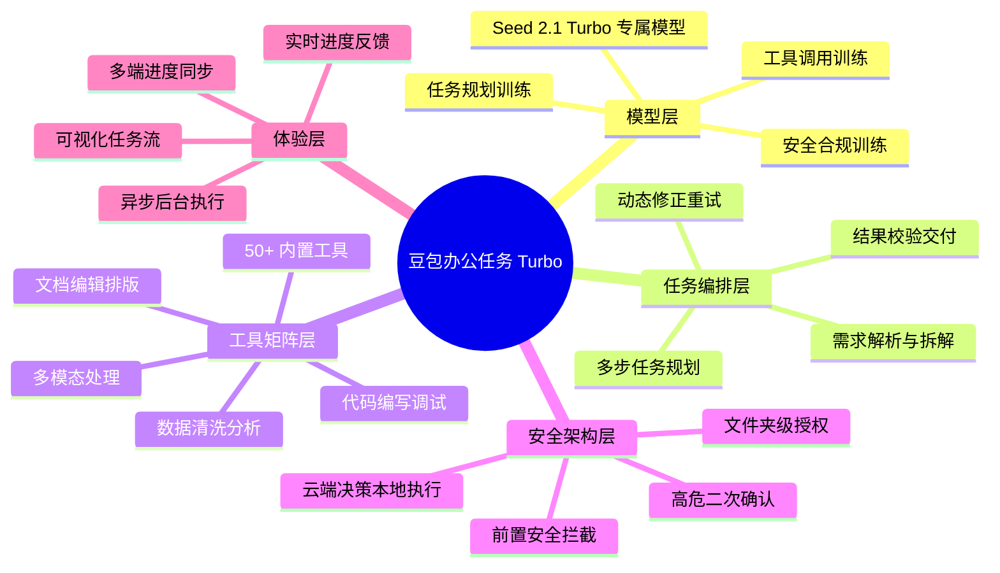
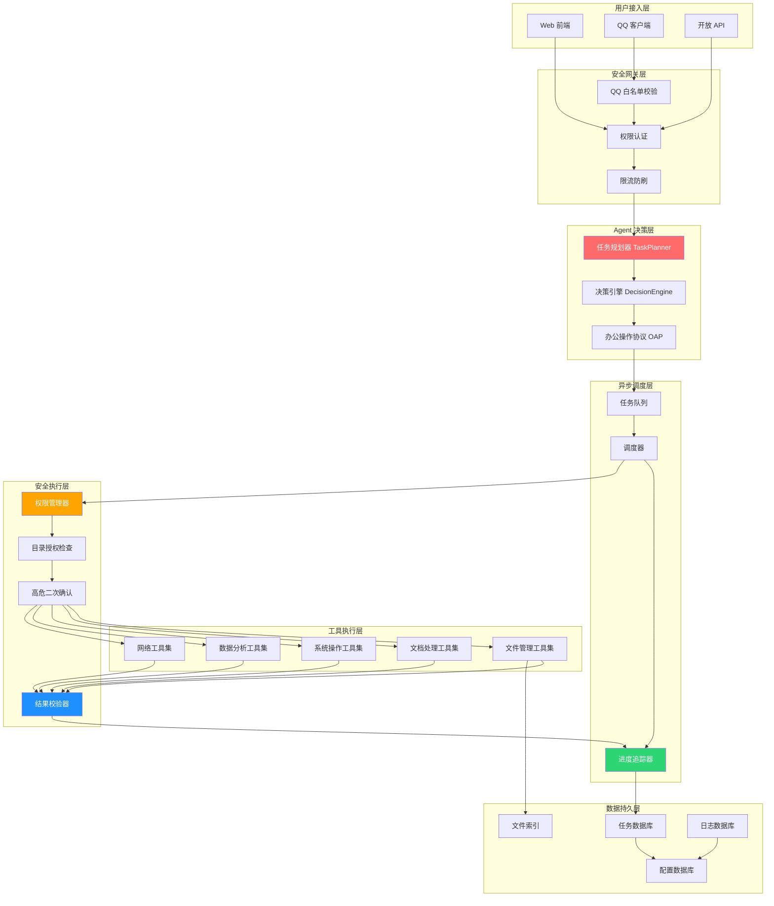

# v13.9 办公任务 Agent 全面升级计划

> [!abstract] 计划总览
> 本计划将系统从 v13.0「办公增强对话」全面升级为 v13.9「办公任务自主 Agent」，深度对标字节跳动豆包办公任务 Turbo 模式。核心目标：让 AI 从「回答问题的助手」进化为「能自主办事的 Agent」。
>
> 采用 **8 批次渐进式交付**，每批次独立可验证、可回滚，确保系统稳定性与功能落地并重。

---

## 一、对标分析：豆包 Turbo vs 当前系统

### 1.1 核心理念差距

| 维度                 | 豆包办公任务 Turbo                    | 我们 v13.0                        | v13.9 目标              |
| -------------------- | ------------------------------------- | --------------------------------- | ----------------------- |
| **定位**       | 自主办事 Agent                        | 增强对话助手                      | 自主办事 Agent          |
| **交互范式**   | 用户提需求 → AI 规划执行 → 交付结果 | 用户提问 → AI 回答 → 用户继续问 | 需求驱动的任务执行      |
| **模型**       | Seed 2.1 Turbo Agent 专属模型         | 通用模型 + 提示词增强             | 择优模型 + Agent 思维链 |
| **任务复杂度** | 多步骤、长链路、跨工具                | 单步、单工具                      | 多步骤、可编排          |

### 1.2 豆包五大核心能力拆解



---

## 二、八批次交付路线图

> [!info] 批次设计原则
> - 每批次 1-2 个核心主题，聚焦交付
> - 每批次完成后独立测试验证
> - 前序批次是后序批次的基础
> - 可随时暂停在任意批次，不影响现有功能

### 📦 Batch 1：基础保障 — QQ 白名单 + 对话流程修复

**主题**：先把基础打牢，确保系统能稳定对话

**交付内容：**

1. **QQ 白名单系统**

   - 新增 QQ 用户白名单管理
   - 仅白名单内的 QQ 号能触发 Agent 回复
   - 前端设置页面可增删白名单 QQ 号
   - 支持批量导入/导出
   - 非白名单消息静默忽略，不消耗 Token
2. **对话流程闭环修复**

   - BASIC 模式从「直接跳过」改为「轻量对话链路」
   - 保留情绪识别 + LLM 回复 + 输出后处理
   - 认知追踪至少包含 route / brain / output 三阶段
   - 前端对话链路图不再大面积 null
3. **权限生效修复**

   - 排查并修复权限等级设置不生效问题
   - 权限变更全链路同步（API → Controller → Tool → Agent → Context）
   - 每个工具执行前强制权限校验

**涉及文件：**

- [[qq_client.py]] — 白名单校验入口
- [[../core/api_server.py]] — 白名单管理 API
- [[pipeline.py]] — BASIC 轻量链路
- [[computer_control.py]] — 权限校验加固

---

### 📦 Batch 2：权限体系重做 — 对标豆包双层授权

**主题**：从「三档粗粒度」升级为「目录级细粒度 + 二次确认」

**交付内容：**

1. **文件夹访问授权**

   - 用户可指定允许 AI 操作的目录白名单
   - 默认仅授权「文档/下载/桌面」三个用户目录
   - 未授权目录禁止读写
   - 支持添加/移除授权目录
2. **界面控制授权**

   - 独立的键鼠/界面操作权限开关
   - 关闭时仅可读取（截图/查询），不可操作
   - 开启需用户显式确认
3. **高危操作二次确认**

   - 删除文件 / 覆盖文件 / 批量操作 → 弹窗确认
   - 注册表 / 系统目录 / 管理员权限 → 直接拦截
   - 可配置「信任模式」跳过二次确认（有风险提示）
4. **权限管理面板**

   - 前端设置页重构权限管理区域
   - 可视化展示当前授权范围
   - 一键撤销所有权限

**涉及文件：**

- [[computer_control.py]] — 权限管理器重构
- [[../core/api_server.py]] — 权限管理 API
- 前端设置页 — 权限面板 UI

---

### 📦 Batch 3：任务规划引擎 — AI 自主拆解执行

**主题**：从「单步工具调用」升级为「多步任务自主规划」

**交付内容：**

1. **TaskPlanner 任务规划器**

   - 用户自然语言需求 → 拆解为有序子任务列表
   - 每个子任务包含：动作类型 + 目标 + 预期结果 + 依赖关系
   - 支持 ReAct 思维链推理（思考 → 行动 → 观察 → 再思考）
2. **任务执行引擎**

   - 按顺序/并行执行子任务
   - 失败自动重试（最多 3 次，每次调整策略）
   - 动态插入新步骤（执行中发现遗漏可补充）
3. **办公操作协议标准化**

   - 定义标准化 Office Action Protocol（OAP）
   - 决策层输出标准协议，执行层只认协议
   - 为未来「云端决策 + 本地执行」双层架构打基础
4. **任务状态管理**

   - pending / running / completed / failed / cancelled
   - 任务上下文持久化，支持中断恢复

**涉及文件：**

- `core/task_planner.py` — 新建：任务规划器
- `core/task_executor.py` — 新建：任务执行引擎
- `core/office_action_protocol.py` — 新建：办公操作协议
- `core/task_models.py` — 新建：任务数据模型

---

### 📦 Batch 4：办公工具矩阵扩充 — 从 7 个到 30+

**主题**：补齐工具能力，覆盖办公全场景

**交付内容：**

1. **文件管理类（8 个）**

   - 文件搜索 / 目录遍历 / 文件读取 / 文件写入
   - 文件移动 / 文件复制 / 文件重命名 / 文件批量整理
2. **文档处理类（6 个）**

   - Word 生成 / Excel 生成 / PPT 生成 / PDF 转换
   - 文档摘要 / 文档格式转换
3. **系统操作类（6 个）**

   - 窗口列表 / 窗口切换 / 打开应用 / 关闭应用
   - 截图 / OCR 文字识别
4. **数据分析类（5 个）**

   - CSV 读取 / 数据统计 / 图表生成 / 数据透视 / 报表导出
5. **网络工具类（5 个）**

   - 网页抓取 / 搜索引擎 / 天气查询 / 翻译 / 代码搜索
6. **工具注册中心升级**

   - 工具分类管理
   - 工具能力描述标准化
   - 任务规划器可自动发现并选择合适工具

**涉及文件：**

- [[office_tools.py]] — 扩充工具集
- `tools/file_tools.py` — 新建：文件管理工具
- `tools/document_tools.py` — 新建：文档处理工具
- `tools/system_tools.py` — 新建：系统操作工具
- `core/tool_registry.py` — 工具注册中心升级

---

### 📦 Batch 5：异步任务系统 — 后台执行 + 实时进度

**主题**：长任务不再傻等，后台跑 + 实时看进度

**交付内容：**

1. **异步任务调度器**

   - 基于 asyncio 的任务调度
   - 任务队列 + 并发控制
   - 任务优先级（高/中/低）
2. **实时进度反馈**

   - WebSocket 推送进度事件
   - 进度条 + 当前步骤 + 已用时间 + 预计剩余
   - 任务日志实时输出
3. **任务管理面板**

   - 运行中任务列表
   - 历史任务记录
   - 任务详情（步骤、耗时、结果）
   - 取消 / 重试 / 查看结果操作
4. **多端进度同步**

   - QQ 端任务状态可查询
   - 前端 Web 端实时同步
   - 任务完成主动通知

**涉及文件：**

- `core/async_task_manager.py` — 新建：异步任务管理器
- `core/progress_tracker.py` — 新建：进度追踪器
- [[../core/api_server.py]] — 任务管理 API + WebSocket 事件
- 前端任务中心页面

---

### 📦 Batch 6：文件整理 + 文档模板落地

**主题**：两个高频场景做深做透，模板化 + 智能化

**交付内容：**

1. **文件整理模板系统**

   - 6 套预设模板：图片整理 / 文档分类 / 视频归档 / 下载清理 / 桌面大扫除 / 项目整理
   - 模板可编辑、可保存、可分享
   - 智能推荐：扫描目录后推荐合适的整理方案
2. **文件整理智能执行**

   - 对接任务规划引擎，多步骤执行
   - 实时进度：扫描 → 分类 → 创建目录 → 移动 → 校验
   - 操作预览：执行前展示将要做的改动，用户确认后执行
   - 撤销支持：整理后 24 小时内可一键撤销
3. **文档模板系统（12 种）**

   - 日常类：日记 / 周报
   - 办公类：工作报告 / 会议纪要 / 项目进度
   - 技术类：技术规格 / 研究报告 / Bug 分析
   - 人事类：个人简历 / 述职报告
   - 学习类：学习笔记 / 读书笔记
4. **文档生成流水线**

   - 选模板 → 填字段 → AI 生成 → 预览 → 导出
   - 支持 Word / Markdown / PDF 三种格式导出
   - 模板可自定义（高级功能）

**涉及文件：**

- [[file_organizer.py]] — 模板系统 + 智能整理
- [[doc_writer.py]] — 模板扩充 + 生成流水线
- `core/document_templates.py` — 新建：文档模板库
- 前端文件整理页面 + 文档生成页面

---

### 📦 Batch 7：结果校验与重试 — 执行闭环

**主题**：执行完不算完，做对了才算完

**交付内容：**

1. **结果校验引擎**

   - 每个任务执行后自动校验结果是否符合预期
   - 校验方式：存在性检查 / 内容检查 / 格式检查 / 数量检查
   - 校验失败 → 自动分析原因 → 调整方案重试
2. **动态修正机制**

   - 失败时回溯任务链，定位失败点
   - 最多重试 3 次，每次策略不同
   - 重试次数耗尽 → 向用户汇报失败原因 + 建议方案
3. **质量评估体系**

   - 任务完成度评分（0-100）
   - 用户可对结果打分，反馈用于优化
   - 成功率统计与展示
4. **执行报告生成**

   - 每次任务执行完生成执行报告
   - 包含：任务目标 / 执行步骤 / 耗时 / 结果 / 问题与改进
   - 可导出为 Markdown 报告

**涉及文件：**

- `core/result_verifier.py` — 新建：结果校验器
- `core/execution_reporter.py` — 新建：执行报告生成器
- `core/task_executor.py` — 增加重试与修正逻辑

---

### 📦 Batch 8：总体验收 — 闸门自检 + 全量测试 + 文档

**主题**：收尾打磨，确保质量

**交付内容：**

1. **生存闸门自检系统**

   - 四道闸门增加健康自检能力
   - 5 态展示：未自检 / 自检中 / 健康 / 异常 / 运行中
   - 系统启动自动快速自检
   - 手动触发深度自检
2. **全量集成测试**

   - 端到端测试覆盖全部 8 批次功能
   - 性能测试（并发任务、长时运行）
   - 安全测试（权限绕过、高危操作拦截）
   - 兼容性测试（不同 Windows 版本）
3. **文档与版本**

   - README 全面更新
   - CHANGELOG 完整记录
   - 用户使用手册
   - 开发对接文档
   - 版本号统一为 v13.9.0
4. **UI/UX 统一打磨**

   - 所有新功能页面风格统一
   - 交互体验优化
   - 空状态 / 错误状态 / 加载状态完善
   - 动画与过渡效果

**涉及文件：**

- [[self_evolve_l4.py]] — 闸门自检
- 各类测试文件
- 文档文件
- 前端各页面

---

## 三、总体架构图（v13.9 目标态）



---

## 四、安全体系对标

> [!important] ❗ 豆包安全架构核心
> **云端决策 + 本地执行**双层分离：
>
> - 云端：只思考、只出指令、不碰系统
> - 本地：只执行、只认标准协议、有安全把关
>
> 我们 v13.9 先在单机内实现逻辑分离（决策层/协议层/执行层），为未来真正的云端+本地双层架构打基础。

### 4.1 权限分级对照

| 权限维度 | 豆包 Turbo       | 我们 v13.0 | 我们 v13.9 目标           |
| -------- | ---------------- | ---------- | ------------------------- |
| 目录控制 | 文件夹级白名单   | 全有或全无 | 文件夹级白名单            |
| 操作控制 | 读取 / 操作 分离 | 三档粗粒度 | 读取 / 写入 / 操作 三分离 |
| 高危操作 | 二次确认 + 拦截  | 部分拦截   | 完整二次确认 + 分级拦截   |
| 权限撤销 | 一键撤销         | 切换等级   | 一键全撤销 + 细粒度调整   |
| 操作审计 | 完整操作日志     | 有日志     | 可视化审计面板            |

---

## 五、版本迭代路径

```
v13.0 ──► v13.1 ──► v13.2 ──► v13.3 ──► v13.4 ──► v13.5 ──► v13.6 ──► v13.7 ──► v13.8 ──► v13.9
 │        │        │        │        │        │        │        │        │
 │        ▼        ▼        ▼        ▼        ▼        ▼        ▼        ▼
 │      Batch1   Batch2   Batch3   Batch4   Batch5   Batch6   Batch7   Batch8
 │      基础保障  权限体系  任务规划  工具矩阵  异步系统  模板落地  结果校验  总体验收
 │
 └─ 起点：办公模式 + 回复校验 + 主动推送
```

---

## 六、风险与应对

> [!warning] ⚠️ 风险清单
> | 风险                           | 影响批次 | 概率 | 影响       | 应对策略                                                      |
> | ------------------------------ | -------- | ---- | ---------- | ------------------------------------------------------------- |
> | 任务规划准确率低，经常拆错任务 | Batch3   | 高   | 用户体验差 | 初期用模板兜底，AI 规划作为可选项；逐步优化 prompt            |
> | 工具数量多，测试覆盖不全       | Batch4   | 中高 | Bug 多     | 每个工具配套单元测试；核心工具加集成测试                      |
> | 异步任务状态不同步             | Batch5   | 中   | 体验差     | 用 WebSocket 实时推送 + 轮询兜底；状态机严格管理              |
> | 文件整理误删重要文件           | Batch6   | 低   | 严重       | 默认「移动到回收站/归档目录」而非真删；24h 可撤销；执行前预览 |
> | 权限体系改造引入安全漏洞       | Batch2   | 中   | 严重       | 安全测试前置；每个权限点单独测试；代码安全审查                |
> | 8 批次跨度大，中途需求变化     | 全部     | 高   | 延期       | 每批次独立可交付；定期同步确认；保持灵活调整空间              |
> | QQ 白名单误拦截正常用户        | Batch1   | 中   | 用户投诉   | 白名单有默认值；提供临时放行机制；日志完整可追溯              |

---

## 七、测试验收总纲

### 7.1 每批次必过关卡

| 关卡     | 说明                        |
| -------- | --------------------------- |
| 单元测试 | 新增代码覆盖率 ≥ 80%       |
| 集成测试 | 与现有模块无冲突            |
| 安全测试 | 无权限绕过、无高危漏洞      |
| 性能测试 | 不降低现有响应速度 10% 以上 |
| 兼容性   | Win10 / Win11 正常运行      |
| 回归测试 | 原有功能全部正常            |

### 7.2 最终验收（Batch 8）

- [ ] 端到端演示：从用户提需求 → AI 规划 → 执行 → 校验 → 交付，全流程无人工干预
- [ ] 30 个办公工具全部可用
- [ ] 12 种文档模板全部正常生成
- [ ] 文件整理 6 套模板全部正常执行
- [ ] QQ 白名单精准拦截 / 放行
- [ ] 权限体系：目录级授权 + 操作级控制 + 高危确认
- [ ] 异步任务：后台执行 + 进度反馈 + 可取消
- [ ] 生存闸门自检正常
- [ ] 连续 72 小时运行无崩溃
- [ ] 文档齐全，用户可自助上手

---

## 八、下一步

> [!todo] 行动计划
> 1. **你确认本计划** — 8 批次划分、每批次内容、整体节奏
> 2. **启动 Batch 1** — 先做基础保障（QQ 白名单 + 对话流程修复 + 权限生效）
> 3. **逐批次推进** — 每批完成后验证、确认、再进入下一批
> 4. **全程可调** — 中途任何批次都可以暂停、调整、增加需求
>
>
> /goal/plan/TRAE-debugger大到每个组件都需要做相应的美观性适配。
> /frontend-design
> /frontend-skill
> /obsidian-markdown 在实现的过程中一定不要忘了前端的美观性，小到单选框、复选框，
