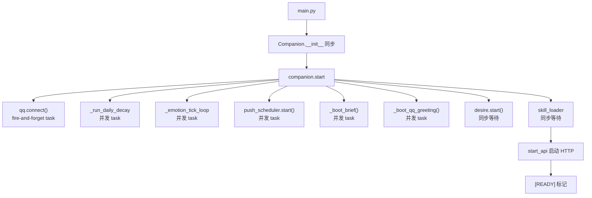
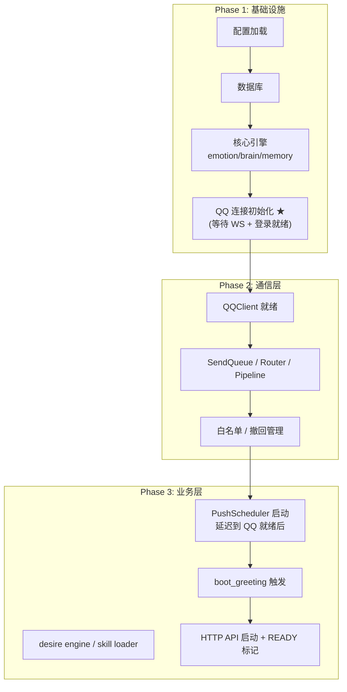
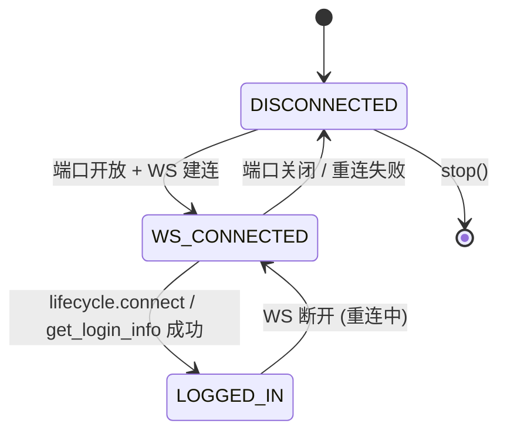
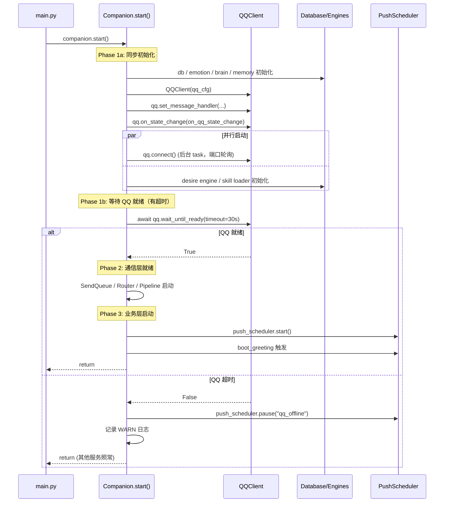

# QQ 优先级初始化改造方案

> \[!abstract] 方案总览
> 本文档提出对 Aerie · 云栖 后端启动流程的结构化改造：将 QQ 通信链路（NapCat WS 连接 + QQ 账号登录验证）从当前的「后台并发任务」升级为「第一优先级初始化步骤」，确保在 PushScheduler、boot\_greeting 等所有依赖 QQ 的功能启动前，QQ 通信链路已稳定建立。配套完善的异常处理、重试机制和状态机，兼顾可靠性与用户体验。

## 1. 需求分析

### 1.1 核心诉求

| 诉求          | 说明                                                  |
| ----------- | --------------------------------------------------- |
| **QQ 最先就绪** | 系统启动时，QQ 连接应当是第一个完成初始化的核心服务                         |
| **稳定可靠**    | 配套完善的异常处理与重试机制，不因单次失败而放弃                            |
| **依赖保障**    | 自动消息发送（PushScheduler / boot\_greeting）必须在 QQ 就绪后再启用 |
| **用户可控**    | 保留用户手动启动 NapCat 的交互方式，不强加自动化                        |

### 1.2 当前启动流程的问题



> \[!bug] 核心问题
>
> 1. **`qq.connect()`** **是 fire-and-forget**：companion.start 不等待它，直接继续启动其他服务
> 2. **push\_scheduler 与 qq.connect 并发启动**：cron 任务可能在 QQ 未就绪时触发
> 3. **boot\_greeting 靠 sleep(8) + wait\_for\_login(15s) 硬等**：是补丁式的，不是架构级的保障
> 4. **\[READY] 标记在 QQ 可能未就绪时就出现**：UI 显示"运行中"但实际不能发消息
> 5. **NapCat 启动完全独立**：后端不负责，靠用户手动点 UI 按钮

### 1.3 影响范围

* **boot\_greeting**：当前靠 `wait_for_login(15s)` 兜底，超时就跳过

* **cron 推送**：8 个定时场景（morning\_brief / lunch\_remind / goodnight 等）—— 如果启动时正好到了 cron 时间点，消息可能发送失败

* **trigger 推送**：idle\_care / emotion\_comfort / voice\_miss —— 同理

* **UI 状态显示**：「运行中」但 QQ 未连接，状态不一致

## 2. 主流类似做法调研

### 2.1 健康检查模式（Health Check Pattern）

**代表**：Kubernetes health probe、Spring Boot Actuator、Docker HEALTHCHECK

```
启动 → 初始化依赖 → 就绪探针(Ready) → 接收流量
         ↓ 失败
      重试 / 退避
         ↓ 仍失败
      标记未就绪，不接收流量
```

**特点**：

* 分 `liveness`（活着）和 `readiness`（就绪）两级

* 未就绪时不对外提供服务，但进程本身活着

* 就绪后自动加入服务发现 / 流量池

### 2.2 分阶段初始化模式（Phased Initialization）

**代表**：NestJS lifecycle hooks（onModuleInit → onApplicationBootstrap）、Angular 生命周期、iOS AppDelegate

```
Phase 0: 配置加载 + 日志
Phase 1: 基础设施（数据库 / 缓存 / 消息队列）
Phase 2: 核心业务服务
Phase 3: 对外接口（HTTP / WS）
Phase 4: 后台任务（定时任务 / 消费者）
```

**特点**：

* 每个阶段必须全部成功才进入下一阶段

* 关键基础设施失败则整个启动失败（快速失败）

* 后台任务放在最后，确保依赖全部就绪

### 2.3 断路器模式（Circuit Breaker）

**代表**：Resilience4j、Hystrix、Polly

```
关闭 → 失败率超阈值 → 打开 → 冷却期后 → 半开 → 成功 → 关闭
                                          ↓ 失败 → 打开
```

**特点**：

* 用于运行时故障隔离，不是启动时

* 但思路可借鉴：QQ 断开时，Push 自动"熔断"暂停，恢复后自动"合闸"

### 2.4 三种模式对比

| 维度       | 健康检查      | 分阶段初始化  | 断路器  |
| -------- | --------- | ------- | ---- |
| 适用阶段     | 启动 + 运行   | 启动      | 运行时  |
| 核心思想     | 探针 + 流量控制 | 顺序 + 依赖 | 故障隔离 |
| 实现复杂度    | 中         | 低       | 高    |
| 对当前项目适配度 | ⭐⭐⭐       | ⭐⭐⭐⭐⭐   | ⭐⭐   |

## 3. 混合方案设计

### 3.1 设计原则

> \[!tip] 四条原则
>
> 1. **QQ 优先**：QQ 通信链路是第一优先级，在所有依赖它的服务之前完成
> 2. **用户可控**：不自动启动 NapCat，保留手动启动的交互方式
> 3. **优雅降级**：QQ 未就绪时，相关功能优雅暂停而非报错崩溃
> 4. **渐进增强**：改动最小化，不重构整个启动框架

### 3.2 方案选型：分阶段初始化 + 状态机 + 软门控

**核心思路**：

采用 **分阶段初始化** 的思路改造启动顺序，把 QQ 连接从「并发后台任务」提到「第一阶段等待项」。同时给 PushScheduler 加一层 **QQ 就绪软门控**（运行时也生效，不只是启动时），吸收断路器模式的故障隔离思想。

**三个阶段**：



### 3.3 关键设计决策

#### 决策 1：QQ 初始化是「等待」还是「前置启动 NapCat」

| 选项                     | 描述                                                 | 优点                | 缺点                           |
| ---------------------- | -------------------------------------------------- | ----------------- | ---------------------------- |
| A. 等待端口 + 等待登录         | 后端启动时等 NapCat 端口开放 + QQ 登录，超时就标记未就绪                | 不改变用户操作习惯，安全      | 启动时如果 NapCat 没开，后端会卡在"等待 QQ" |
| B. 自动启动 NapCat         | 后端启动时自动启动 NapCat 进程                                | 一条龙，用户体验好         | 违背项目设计原则（NapCat 手动控制），可能有副作用 |
| C. **并行等待 + 超时降级**（推荐） | 后端启动时并发等 QQ，有超时上限；超时后标记"QQ 未就绪"，其他服务照常启动，但 Push 暂停 | 兼顾可靠性和可用性，不阻塞整个启动 | 需要实现 Push 的暂停/恢复机制           |

> \[!success] 选择 C：并行等待 + 超时降级
>
> * Phase 1 中 QQ 初始化和核心引擎**并行启动**，不阻塞数据库/emotion/brain 等不依赖 QQ 的模块
>
> * 有超时上限（默认 30s），超时后标记 `qq_ready = false`
>
> * PushScheduler 在 `qq_ready = false` 时暂停所有 cron/trigger 任务
>
> * QQ 后续恢复时（用户手动启动 NapCat），自动触发 PushScheduler 恢复

#### 决策 2：PushScheduler 如何感知 QQ 状态

| 选项                      | 描述                               |
| ----------------------- | -------------------------------- |
| A. 轮询 `qq.is_logged_in` | cron 循环里每次都检查                    |
| B. **事件驱动 + 状态缓存**（推荐）  | QQ 状态变化时触发事件，PushScheduler 订阅并响应 |
| C. 中间件/拦截器              | dispatch 前检查                     |

**选择 B**：事件驱动更高效，也更清晰。QQClient 提供 `on_login_state_change(callback)` 注册机制，PushScheduler 订阅后自行决定暂停/恢复。

#### 决策 3：boot\_greeting 怎么处理

boot\_greeting 比较特殊——它是"启动时触发一次"的场景，不是持续运行的 cron。

**方案**：boot\_greeting 从 companion.start 的并发 task 中移除，改由 PushScheduler 在「QQ 首次就绪」事件中触发。这样保证：

1. QQ 没就绪时绝不会触发
2. 就绪时自动触发，不需要等 sleep
3. 幂等性（60s window flag）仍然保留

## 4. 方案明细

### 4.1 模块改造清单

| 模块                                                                               | 改动类型 | 改动说明                                                                   |
| -------------------------------------------------------------------------------- | ---- | ---------------------------------------------------------------------- |
| [communication/qq\_client.py](file:///e:/Agent_reply/communication/qq_client.py) | 增强   | 新增状态变更回调机制（`on_state_change`）；新增 `wait_until_ready(timeout)` 阻塞等待      |
| [core/companion.py](file:///e:/Agent_reply/core/companion.py)                    | 重构   | `start()` 分三阶段；PushScheduler 延迟到 QQ 就绪后启动；boot\_greeting 改由事件触发        |
| [core/push\_scheduler.py](file:///e:/Agent_reply/core/push_scheduler.py)         | 增强   | 新增 `pause()` / `resume()` 方法；订阅 QQ 状态变更自动暂停/恢复；cron 循环中增加 `_paused` 检查 |
| [core/api\_server.py](file:///e:/Agent_reply/core/api_server.py)                 | 增强   | `/api/health` 返回 qq\_connected / qq\_logged\_in 子状态；READY 标记考虑 QQ 状态   |
| [config/settings.yaml](file:///e:/Agent_reply/config/settings.yaml)              | 新增   | 新增 `qq` 配置段：`startup_wait_timeout`、`push_pause_when_offline` 等         |

### 4.2 QQClient 状态机



新增回调机制：

```python
# qq_client.py
class QQClient:
    def __init__(self, config):
        ...
        self._state_handlers: list[Callable[[str], None]] = []

    def on_state_change(self, handler: Callable[[str], None]) -> None:
        """Register a callback invoked on every state transition.
        State values: "disconnected" | "ws_connected" | "logged_in"
        """
        self._state_handlers.append(handler)

    def _emit_state(self, state: str) -> None:
        for h in self._state_handlers:
            try:
                h(state)
            except Exception:
                logger.exception("state handler error")

    async def wait_until_ready(self, timeout: float = 30.0) -> bool:
        """Block until QQ is fully logged in, or timeout.
        Returns True if ready within deadline.
        """
        ...
```

状态转换时调用 `_emit_state()`：

* `connect()` 建连成功 → `ws_connected`

* `_dispatch` 收到 lifecycle.connect → `logged_in`

* `_listen` 连接断开 → `disconnected`

### 4.3 PushScheduler 暂停/恢复机制

```python
# push_scheduler.py
class CronScheduler:
    def __init__(self, config):
        ...
        self._paused = False
        self._paused_reason = ""
        self._resume_event = asyncio.Event()

    def pause(self, reason: str = "manual") -> None:
        """Pause all cron and trigger scenes.
        Running sleeps will wake up and re-check on the next iteration.
        """
        self._paused = True
        self._paused_reason = reason
        logger.info("[PushScheduler] Paused: %s", reason)

    def resume(self) -> None:
        """Resume all scenes."""
        if self._paused:
            self._paused = False
            self._paused_reason = ""
            self._resume_event.set()
            self._resume_event.clear()
            logger.info("[PushScheduler] Resumed")

    async def _run_cron_scene(self, scene_name, scene_cfg, cron_expr):
        while self._running:
            # If paused, wait for resume event
            if self._paused:
                await self._resume_event.wait()
                continue
            ...
```

### 4.4 Companion.start 分阶段改造



### 4.5 QQ 状态恢复时的自动恢复

用户手动启动 NapCat → 端口开放 → QQClient 建连 → 登录 → 状态变更事件 → PushScheduler 自动恢复：


### 4.6 API 健康检查增强

`/api/health` 当前只返回进程信息，增强为：

```json
{
  "status": "degraded",
  "uptime_seconds": 123.4,
  "components": {
    "backend": "healthy",
    "qq": {
      "ws_connected": false,
      "logged_in": false,
      "self_id": 0
    },
    "push_scheduler": {
      "running": true,
      "paused": true,
      "paused_reason": "qq_offline"
    }
  }
}
```

`status` 取值：

* `healthy`：所有组件正常

* `degraded`：核心功能可用，但有组件异常（如 QQ 断开）

* `unhealthy`：核心功能不可用

### 4.7 配置项

```yaml
# settings.yaml 新增
qq:
  # 启动时等待 QQ 就绪的超时时间（秒）
  startup_wait_timeout: 30
  # QQ 离线时是否自动暂停 PushScheduler
  push_pause_when_offline: true
  # QQ 恢复后是否自动恢复 PushScheduler
  push_resume_when_online: true
  # NapCat WS 地址
  napcat_ws_url: "ws://127.0.0.1:3001"
```

## 5. 实施步骤

### Phase 1：QQClient 增强（基础）

1. 新增 `_state` 属性和状态枚举（`disconnected` / `ws_connected` / `logged_in`）
2. 新增 `on_state_change(handler)` 注册机制
3. 新增 `wait_until_ready(timeout)` 方法
4. 在连接/登录/断开的关键节点调用 `_emit_state()`
5. 单元测试验证状态转换

### Phase 2：PushScheduler 增强（并行）

1. 新增 `_paused` / `_paused_reason` / `_resume_event`
2. 新增 `pause(reason)` / `resume()` 方法
3. `_run_cron_scene` 循环中增加暂停检查
4. `_dispatch` 增加暂停门控（paused 时返回 False）
5. 单元测试验证暂停/恢复

### Phase 3：Companion 启动重构（核心）

1. 重构 `companion.start()` 为分阶段初始化
2. PushScheduler 延迟到 QQ 就绪后启动
3. boot\_greeting 改由 QQ 首次就绪事件触发
4. QQ 超时降级逻辑（PushScheduler 暂停 + WARN 日志）
5. 订阅 QQ 状态变更，运行时自动暂停/恢复 Push

### Phase 4：API 与 UI 联动

1. 增强 `/api/health` 返回组件级状态
2. UI 状态面板显示 QQ 连接子状态
3. `/api/events/stream` 推送 QQ 状态变更事件

### Phase 5：配置与文档

1. settings.yaml 新增 `qq` 配置段
2. 更新调研文档 [qq-login-timing-investigation.md](file:///e:/Agent_reply/docs/qq-login-timing-investigation.md)
3. 代码注释完善

## 6. 风险与缓解

| 风险                                         | 概率 | 影响 | 缓解措施                                   |
| ------------------------------------------ | -- | -- | -------------------------------------- |
| 启动重构引入回归 bug                               | 中  | 高  | 分阶段实施，每阶段独立验证；保留旧代码路径做 fallback        |
| QQ 状态回调死循环                                 | 低  | 中  | 状态变更前先对比当前状态，相同则不触发；回调异常 try/except 兜底 |
| PushScheduler resume 时 boot\_greeting 重复触发 | 中  | 低  | 60s window flag 幂等机制已存在；新增"已触发"标记双重保护  |
| 启动等待时间过长影响体验                               | 中  | 中  | 超时上限 30s；超时后降级而非阻塞；UI 显示"QQ 连接中..."    |
| settings.yaml 缺 qq 段导致默认值异常                | 低  | 低  | 所有新增配置项都有合理默认值；缺省配置不报错                 |

## 7. 安全影响分析（TRAE-security-review 预评估）

> \[!note] 预评估结论：无新增安全风险
>
> 1. **攻击面无新增**：QQ 仍然只连本地 `127.0.0.1:3001`，不暴露新端口
> 2. **输入可信度不变**：NapCat WebSocket 响应数据来源与改造前一致（本地进程）
> 3. **无鉴权逻辑变更**：不涉及用户认证、权限控制
> 4. **日志无敏感信息**：新增的状态日志只有状态名（`disconnected` / `logged_in`），不泄露凭证
> 5. **拒绝服务面无扩大**：暂停/恢复机制是内部状态机，不接受外部输入
>
> 详细审查将在代码实现阶段进行。

## 8. 验证方法

### 8.1 启动时序验证

| 场景                  | 预期结果                                                                                 |
| ------------------- | ------------------------------------------------------------------------------------ |
| NapCat 已启动，重启后端     | Phase 1 快速通过（<1s）；Push 立即启动；boot\_greeting 立即触发                                      |
| NapCat 未启动，重启后端     | Phase 1 等待 30s 后超时；PushScheduler 标记 paused；UI 显示"QQ 未连接"；\[READY] 标记仍出现（degraded 模式） |
| 后端启动后，用户手动启动 NapCat | QQ 连接成功 → 状态事件 → PushScheduler 自动 resume → boot\_greeting 自动触发                       |

### 8.2 运行时可靠性验证

| 场景                | 预期结果                                                         |
| ----------------- | ------------------------------------------------------------ |
| NapCat 运行中断开（杀进程） | QQClient 进入重连循环；状态变更事件 → PushScheduler 自动 pause；cron 任务到点不执行 |
| NapCat 重新启动       | QQClient 重连成功 → 状态事件 → PushScheduler 自动 resume               |
| 快速重启后端（60s 内）     | boot\_greeting 幂等生效，不重复发送                                    |

### 8.3 回归验证

* [ ] 所有现有 Push 场景（8 cron + 3 trigger）功能正常

* [ ] boot\_greeting 60s 幂等性正常

* [ ] 白名单/撤回/分段发送等通信功能正常

* [ ] 手动发送消息（用户发 QQ → 回复）不受影响

***

> \[!quote] 方案总结
> **核心思路**：分阶段初始化 + QQ 状态机 + PushScheduler 软门控
>
> **关键收益**：
>
> 1. QQ 从「后台并发任务」升级为「第一优先级基础设施」
> 2. 启动时 + 运行时双重保障：QQ 断了 Push 自动停，恢复了自动启
> 3. NapCat 需要系统开启的时候自动启动！
> 4. 渐进式改造，风险可控
>
> **改动范围**：4 个核心文件（qq\_client / companion / push\_scheduler / api\_server）+ 1 个配置文件，预计代码量 \~200 行新增 + \~50 行重构

