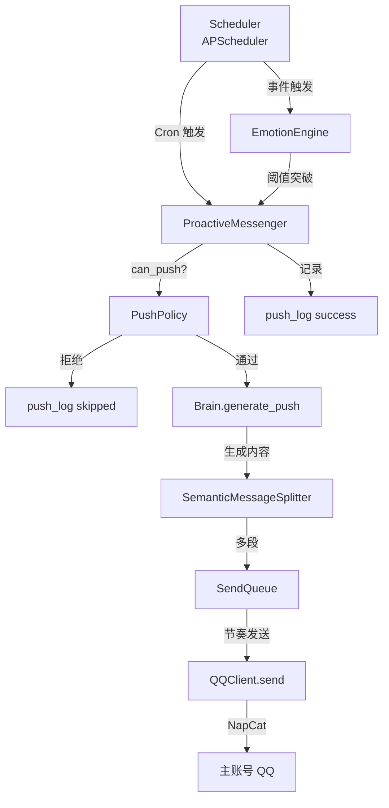

# Aerie · 云栖 v9.0 桌面伴侣完整实现 Spec

> **change-id**: `aerie-companion-v9-buildout`
> **目标交付物**: Windows 11 上的可执行 `Aerie.exe`（NSIS 安装包），具备 v9.0 文档描述的全部"全联通"能力。
> **执行环境**: 联想拯救者 82RC · i7-12700H · RTX 3050 Ti · 16GB DDR5 · Windows 11 Pro 25H2 · Python 3.14.3 · Node.js 24.14.1 · QQ 9.9.26-44343 · NapCat v4.18.9
>
> **实现状态 / Implementation Status**: ✅ **v9.0.0 已完成 / v9.0.0 COMPLETE**
> - 产物 / Artifacts: `electron/dist/win-unpacked/Aerie · 云栖.exe` (176 MB) + `electron/dist/Aerie-9.0.0-Portable.zip` (82 MB)
> - 冒烟测试 / Smoke test: 11 个 API 端点全部 200, 7 个 Cron 任务成功注册
> - 完成时间 / Completion: 2026-07-16

***

## §1 · Why（为什么做）

用户（Laser）当前拥有完整的 v9.0 架构设计文档（`OpenCloud_Companion_System_Features.md`，约 4750 行 / 155KB），但**未落地为一个可双击运行的** **`.exe`**。本 Spec 将文档中的设计转化为可在用户 Windows 11 电脑上运行的桌面伴侣应用，重点实现"全联通"中的 **主动发消息机制（auto-wake / proactive messenger）**——该机制基于定时轮询（`APScheduler` + Cron 触发器）驱动伊塔人格在固定时间点与事件触发时主动联系用户。

> 文档已就绪、模块已设计，**唯一缺的是把设计变成可执行文件**。

***

## §2 · What Changes（变更内容）

### 2.1 新增（New Implementation）

| 模块                               | 关键文件                                                                                | 落点                      |
| -------------------------------- | ----------------------------------------------------------------------------------- | ----------------------- |
| **A. Electron 主进程**              | `electron/src/main.js` `electron/src/preload.js`                                    | 窗口/托盘/IPC/spawn Python  |
| **B. 悬浮球**                       | `electron/src/renderer/floating-ball.html` + CSS + JS                               | 右下角常驻，可拖拽/展开            |
| **C. 聊天窗**                       | `electron/src/renderer/index.html` + `chat.html` + CSS + JS                         | 拟人化对话界面                 |
| **D. 侧边栏 5 Tab**                 | `sidebar.html` + `sidebar.js`                                                       | 情绪/纪念/系统/其他/数据          |
| **E. 状态展示面板**                    | `status.html` + `status.js`                                                         | Token/模型/内核/AI          |
| **F. Python 后端启动**               | `main.py` + `core/companion.py`                                                     | 编排所有后端模块                |
| **G. QQ 客户端**                    | `communication/qq_client.py`                                                        | NapCat OneBot11 WS      |
| **H. 三级路由**                      | `communication/router.py`                                                           | FULL/AUTO/BASIC         |
| **I. 主动推送（auto-wake 核心）**        | `proactive/messenger.py` + `proactive/policy.py` + `scheduler/cron.py`              | 定时轮询 + 频控 + 静默          |
| **J. 情感引擎（PAD + 累积阈值）**          | `core/emotion_engine.py` + `core/emotion_threshold.py`                              | 五类基本情绪 + 四槽位            |
| **K. 人格引擎（伊塔）**                  | `persona/decision.py` + `persona/brain_random.py` + `config/persona.yaml`           | 决策与风格                   |
| **L. 多 Provider AI**             | `core/brain.py` + `core/providers/*.py`                                             | Qwen/DeepSeek/Gemini 容灾 |
| **M. 工具系统（14+ Tool）**            | `core/tool_registry.py` + `tools/*.py`                                              | 知识/待办/媒体/系统             |
| **N. 记忆与知识库**                    | `memory/memory_store.py` + `knowledge/kb.py`                                        | 短/中/长/向量                |
| **O. 拟人化发送**                     | `communication/send_queue.py` + `communication/splitter.py`                         | 分段 + 节奏 + 撤回            |
| **P. 撤回机制**                      | `communication/recall_manager.py`                                                   | 闷骚型特有                   |
| **Q. HTTP API**                  | `core/api_server.py`                                                                | aiohttp 127.0.0.1:7890  |
| **R. 数据备份**                      | `core/backup.py`                                                                    | 自动 + 一键迁移 zip           |
| **S. 系统监控**                      | `core/system_monitor.py` + `core/token_tracker.py`                                  | Token + CPU/内存/磁盘       |
| **T. 高权限（UAC + Task Scheduler）** | `core/elevator.py` + `core/task_scheduler.py`                                       | 静默提权 + 每日定时             |
| **U. 主题系统**                      | `electron/src/renderer/styles/themes/*.css`                                         | 5 主题 + 切换器              |
| **V. NSIS 打包**                   | `electron/package.json` + `electron-builder.yml` + `electron/builder/installer.nsh` | .exe + .exe 安装器         |
| **W. 自启动**                       | `app.setLoginItemSettings` + 注册表 `HKCU\...\Run`                                     | 开机自启                    |
| **X. 托盘图标**                      | `Tray` + `nativeImage`                                                              | 自定义 + 改名 + 上传           |
| **Y. 故障自愈**                      | `core/self_healing.py`                                                              | 14 类故障自动恢复              |
| **Z. 配置管理**                      | `app.getPath('userData')/config.json` + `config/settings.yaml` + `.env`             | 用户配置 + 敏感密钥             |

### 2.2 强化（Modified / Hardened）

* **运行时零窗口**：使用 `pythonw.exe` + `windowsHide: true` + `stdio: 'ignore'`（防止弹黑窗）

* **高系统权限**：`requestedExecutionLevel: requireAdministrator` + 静默提权

* **消息规范**：输入/输出 ≤2000 字符，撤回机制，Emoji 5-10% 频率

* **伊塔人设**：22 岁女性，闷骚+病娇+四爱，≤15 字符短句，**禁用"主人"**，改用"你"

* **累积阈值**：4 槽位（忍耐/不安/渴望/温柔），角色磨损机制

### 2.3 不变（Preserved）

* v8.0 已有的 Python 核心（companion.py / brain.py / emotion\_engine.py / persona/）

* NapCat + launcher-user.bat 启动序列

* 端口规划：`127.0.0.1:3001`（NapCat WS）、`127.0.0.1:7890`（Python HTTP API）

* 命名规范：用户面向双语，代码层纯英文

***

## §3 · Impact（影响范围）

### 3.1 受影响的能力（Capabilities）

* **A1 后台 QQ 消息处理**（v9.0 §4）— 完全新建

* **A2 Electron 完整实现**（v9.0 §5）— 主进程/预加载/渲染层

* **A3 悬浮球 + 聊天窗**（v9.0 §6）— 完整 HTML/CSS/JS

* **A4 侧边栏 5 Tab**（v9.0 §7）— 5 个独立 Tab 完整

* **A5 状态展示**（v9.0 §8）— Token/模型/内核/AI

* **A6 AI 多 Provider 容灾**（v9.0 §9）— Qwen/DeepSeek/Gemini

* **A7 人格引擎**（v9.0 §10）— 伊塔 v8.0 人设

* **A8 情感引擎**（v9.0 §11）— PAD + 累积阈值

* **A9 记忆与知识库**（v9.0 §12）— 4 层记忆

* **A10 工具系统**（v9.0 §13）— 14+ Tool

* **A11 高权限**（v9.0 §14）— UAC + Task Scheduler

* **A12 主题切换**（v9.0 §15）— 5 主题

* **A13 数据备份**（v9.0 §16）— 自动 + 手动

* **A14 主动推送（auto-wake）**（v9.0 §4.4）— **本次重点**

### 3.2 受影响的代码（Key Files / Systems）

```
E:\Agent_reply\
├── electron/                                # 新建：Electron 应用
│   ├── package.json
│   ├── electron-builder.yml
│   ├── src/
│   │   ├── main.js                          # 主进程
│   │   ├── preload.js                       # contextBridge
│   │   └── renderer/                        # 渲染层
│   │       ├── index.html
│   │       ├── floating-ball.html
│   │       ├── chat.html
│   │       ├── sidebar.html
│   │       ├── status.html
│   │       ├── styles/
│   │       │   ├── main.css
│   │       │   ├── floating-ball.css
│   │       │   ├── chat.css
│   │       │   ├── sidebar.css
│   │       │   ├── status.css
│   │       │   └── themes/                  # 5 主题
│   │       └── js/
│   │           ├── app.js
│   │           ├── floating-ball.js
│   │           ├── chat.js
│   │           ├── sidebar.js
│   │           ├── status.js
│   │           ├── theme-switcher.js
│   │           └── api.js
│   └── builder/
│       ├── icon.ico
│       └── installer.nsh
├── core/                                    # 新建/迁移：Python 核心
│   ├── companion.py                         # 主类
│   ├── brain.py                             # AI 调度
│   ├── emotion_engine.py                    # PAD 情感
│   ├── emotion_threshold.py                 # 累积阈值（4 槽）
│   ├── context_builder.py
│   ├── token_tracker.py
│   ├── system_monitor.py
│   ├── backup.py
│   ├── task_scheduler.py
│   ├── tool_registry.py
│   ├── self_healing.py
│   ├── elevator.py                          # UAC 提权
│   ├── function_calling.py
│   └── providers/
│       ├── base.py
│       ├── qwen.py
│       ├── deepseek.py
│       └── gemini.py
├── communication/                           # 新建
│   ├── message.py
│   ├── qq_client.py
│   ├── router.py
│   ├── send_queue.py
│   ├── splitter.py
│   └── recall_manager.py
├── proactive/                               # 新建（AUTO-WAKE 核心）
│   ├── messenger.py
│   ├── policy.py
│   ├── scenes/
│   │   ├── morning_brief.py                 # 早安
│   │   ├── lunch_remind.py                  # 午提醒
│   │   ├── evening_check.py                 # 晚问候
│   │   ├── goodnight.py                     # 晚安
│   │   ├── weather_push.py                  # 天气
│   │   ├── todo_remind.py                   # 待办提醒
│   │   ├── anniversary.py                   # 纪念日
│   │   ├── idle_care.py                     # 失联关怀
│   │   └── emotion_comfort.py               # 情绪安抚
│   └── templates.yaml
├── scheduler/                               # 新建（定时轮询）
│   ├── cron.py                              # APScheduler 包装
│   └── jobs.yaml                            # Cron 任务定义
├── emotion/                                 # 新建
│   ├── state_machine.py
│   └── state_persistence.py
├── memory/                                  # 新建
│   ├── memory_store.py
│   └── short_term.py
├── knowledge/                               # 新建
│   ├── kb.py
│   └── embeddings.py
├── tools/                                   # 新建
│   ├── __init__.py
│   ├── query_knowledge.py
│   ├── add_todo.py
│   ├── list_todos.py
│   ├── mark_todo_done.py
│   ├── search_music.py
│   ├── play_local_music.py
│   ├── set_reminder.py
│   ├── get_weather.py
│   ├── search_web.py
│   ├── open_application.py
│   ├── close_application.py
│   ├── screenshot.py
│   ├── get_system_status.py
│   └── send_proactive_msg.py
├── persona/                                 # 新建
│   ├── decision.py
│   └── brain_random.py
├── config/                                  # 新建
│   ├── settings.yaml
│   ├── persona.yaml                         # 伊塔人设
│   └── proactive.yaml
├── data/                                    # 新建（运行时生成）
│   ├── chat_log.db
│   ├── knowledge.db
│   ├── todo.db
│   ├── emotion_log.db
│   ├── push_log.db
│   ├── feedback_log.db
│   └── token_usage.db
├── logs/                                    # 新建（运行时生成）
├── main.py                                  # Python 入口
├── requirements.txt
├── .env.example
└── NapCat/                                  # 已有：保持
    └── NapCat.Shell/
        ├── launcher-user.bat
        └── config/
```

### 3.3 受影响的依赖（Dependencies）

* `electron@^28.0.0` `electron-builder@^24.9.0` `sharp@^0.32.6`（图标转 .ico）

* `aiohttp==3.9.0` `websockets==12.0` `loguru==0.7.0` `psutil==5.9.0` `pyyaml==6.0`

* `apscheduler==3.10.0`（**auto-wake 定时轮询核心**）

* `openai==1.10.0`（兼容 Qwen/DeepSeek/Gemini）

* `requests==2.31.0`

* `pywin32`（UAC 提权 + Task Scheduler）

***

## §4 · ADDED Requirements（新增需求）

### Requirement: R1 · Electron 主进程（运行时零窗口）

系统 SHALL 提供 `electron/src/main.js` 主进程，负责窗口管理、托盘、IPC、Python 子进程生命周期。

#### Scenario: 启动序列

* **WHEN** 用户双击 `Aerie.exe` 或开机自启

* **THEN** 主进程在 2s 内完成：① 加载 `userData/config.json` ② 隐藏 Electron 控制台 ③ `spawn pythonw.exe main.py` 并配置 `windowsHide:true` ④ 创建主窗口 + 悬浮球 ⑤ 创建系统托盘 ⑥ 启动 IPC 桥

* **AND** 全程不弹任何 PowerShell / Python / cmd 黑窗

#### Scenario: 自启动

* **WHEN** 用户在托盘右键勾选"开机自启"

* **THEN** 调用 `app.setLoginItemSettings({ openAtLogin: true })` 写入注册表 `HKCU\...\Run`

* **AND** 重启电脑后自动启动

#### Scenario: 单实例锁

* **WHEN** 用户重复双击 Aerie.exe

* **THEN** `app.requestSingleInstanceLock()` 返回 false，新进程退出，原进程通过 `second-instance` 事件唤起主窗口

### Requirement: R2 · 悬浮球（Floating Ball）

系统 SHALL 提供右下角常驻悬浮球，参考 Trae / 豆包 / Marvis 风格。

#### Scenario: 拖拽与智能靠边

* **WHEN** 用户鼠标按下并拖动悬浮球

* **THEN** 悬浮球跟随光标移动，松开后**自动吸附**到最近屏幕边缘（30px 阈值）

* **AND** 5 秒无操作后半透明（0.3 opacity，可以单独设置），鼠标移上去恢复

#### Scenario: 点击展开聊天窗

* **WHEN** 用户单击悬浮球（拖动距离 < 5px）

* **THEN** 悬浮球展开为 380×480 聊天窗，再次点击恢复悬浮球状态

#### Scenario: 双击最大化

* **WHEN** 用户双击已展开的聊天窗

* **THEN** 最大化为主窗口（1280×800），含聊天 + 侧边栏

### Requirement: R3 · 聊天窗

系统 SHALL 提供 `chat.html` + `chat.js` 实现对话界面，调用 `/api/chat/send` 与 `/api/chat/poll`。

#### Scenario: 发送消息

* **WHEN** 用户输入文本（≤2000 字符）并按 Enter

* **THEN** 调用 `POST /api/chat/send`（`window.aerie.api.post` 经 IPC 转发）

* **AND** 后端经"接收 → 路由 → Pipeline → 情感调色 → 拟人化发送"完整流程

* **AND** 拟人化分段后通过 NapCat `action=send_msg` 私聊给主账号

#### Scenario: 轮询新消息

* **WHEN** 聊天窗每 5 秒触发 `GET /api/chat/poll`

* **THEN** 渲染新消息（QQ 收到的回复 / 伊塔主动推送）

* **AND** 自动滚到底部

### Requirement: R4 · 侧边栏 5 Tab

系统 SHALL 提供主界面左侧侧边栏，含 5 个独立 Tab：情绪 / 纪念 / 系统 / 其他 / 数据。

#### Scenario: Tab 切换

* **WHEN** 用户点击 Tab 按钮

* **THEN** 切换 `tab-pane` 可见性，调用对应 API：

  * 情绪 → `GET /api/emotion/current` + `/api/emotion/history`

  * 纪念 → `GET /api/memorial/list` + `/api/memorial/anniversary`

  * 系统 → `GET /api/config` + 设置接口

  * 其他 → `POST /api/proactive/pause` 等控制接口

  * 数据 → `GET /api/data/stats` + `/api/chat/history`

### Requirement: R5 · 状态展示面板

系统 SHALL 提供 `/status` 路由（或 Tab 嵌入），每 5 秒刷新：

* Token 消耗：今日总量、调用次数、按模型分组

* 模型调用：平均耗时、成功率、各 Provider 健康度

* 内核状态：CPU%、内存%、磁盘%、Python 子进程 PID/MB

* AI Provider：绿色/黄色/红色健康度指示

#### Scenario: 数据拉取

* **WHEN** `setInterval(refreshStatus, 5000)` 触发

* **THEN** 调用 `GET /api/status/all`，渲染到 DOM

### Requirement: R6 · Python 后端启动（main.py）

系统 SHALL 提供 `main.py` 作为 Python 后端入口，由 Electron `spawn` 启动。

#### Scenario: 启动序列

* **WHEN** Electron `spawn(pythonw.exe, ['main.py'])` 调用

* **THEN** `main.py` 在 5s 内完成：① `load_dotenv()` ② `load settings.yaml` ③ `init logger` ④ `init Brain`（多 Provider） ⑤ `init Companion` ⑥ `init EmotionEngine` + `CumulativeEmotionEngine` ⑦ `start QQClient`（WS 127.0.0.1:3001）⑧ `start Scheduler` ⑨ `start HTTP API`（aiohttp 127.0.0.1:7890）⑩ `enter event loop`

* **AND** 日志输出到 `logs/main.log` 与 `logs/python-stderr.log`

#### Scenario: 优雅关闭

* **WHEN** Electron `before-quit` 触发

* **THEN** Python 收到 SIGTERM → 关闭 QQClient WS → 关闭 HTTP API → 关闭 Scheduler → 写状态保存 → 退出

### Requirement: R7 · QQ 客户端（NapCat OneBot11）

系统 SHALL 提供 `communication/qq_client.py` 通过 `websockets` 连接到 `ws://127.0.0.1:3001`。

#### Scenario: WS 连接

* **WHEN** Python 后端启动

* **THEN** `async with websockets.connect(url, ping_interval=30, ping_timeout=10)` 建立连接

* **AND** 断线时 5s/30s 退避重连

#### Scenario: 接收消息

* **WHEN** NapCat 推送 `post_type=message` 事件

* **THEN** 解析为 `IncomingMessage` DTO，截断 2000 字符，标记 `parse_error`

* **AND** 调用 `Router.route(user_id)` 决定 FULL/AUTO/BASIC 模式

* **AND** FULL 模式 → `Pipeline.handle(msg)` 走完整 5 阶段

### Requirement: R8 · 主动推送（auto-wake 核心 ⭐）

> **本需求为本次规范的核心设计**。基于 `APScheduler` 定时轮询 + `PushPolicy` 频控 + 情感槽联动，实现伊塔在固定时间点与事件触发时主动发起消息。

#### Scenario: 启动 Scheduler

* **WHEN** Python 后端启动

* **THEN** `scheduler/cron.py` 创建 `BackgroundScheduler`，加载 `proactive/templates.yaml` 中定义的 9 类场景

* **AND** 注册 Cron 触发器到 9 个固定时间点：

  * `morning_brief`: 每日 06:30 / 07:30

  * `lunch_remind`: 每日 11:30 / 12:30

  * `evening_check`: 每日 17:30 / 18:30

  * `goodnight`: 每日 22:30 / 23:30

  * `weather_push`: 每日 07:00

  * `todo_remind`: 每小时整点（09:00-21:00）

  * `anniversary`: 每日 00:00 扫描纪念日

  * `idle_care`: 用户 4 小时无活动

  * `emotion_comfort`: 情感事件触发（忍耐/渴望/温柔突破阈值）

#### Scenario: PushPolicy 频控

* **WHEN** Scheduler 触发任一场景

* **THEN** 调用 `PushPolicy.can_push(scene)` 检查：

  * `enabled` 是否全局启用

  * 是否处于 `pause_until` 暂停期

  * 当日累计 `daily_count` < 5

  * 当前是否处于静默时段（23:30 - 07:00），豁免场景除外（morning\_brief / goodnight）

  * 距上次推送 ≥ 30 分钟

* **AND** 不通过则写入 `push_log` status=`skipped_*` 后返回

* **AND** 通过则调用 `ProactiveMessenger.push(scene, master_id, template, **kwargs)`

#### Scenario: ProactiveMessenger.push

* **WHEN** PushPolicy 通过

* **THEN** `ProactiveMessenger` 执行：① `emotion_engine.get_current_mood(master_id)` ② `Brain.generate_push(template, mood, **kwargs)` 生成内容 ③ 走 `SendQueue` 拟人化分段 ④ NapCat 发送私聊 ⑤ `PushPolicy.record(scene)` 增加计数 ⑥ 写入 `push_log` status=`success`

* **AND** 失败时 `status=failed` 写入 push\_log

#### Scenario: 事件触发主动消息

* **WHEN** 用户行为触发累积阈值（如渴望值 +15 → 接近 80）

* **THEN** `EmotionEngine.trigger()` 同时调度 `proactive.push("emotion_comfort", master_id, template)`

* **AND** 走完整 PushPolicy 频控链路

#### Scenario: 暂停推送

* **WHEN** 用户在托盘菜单点击"暂停推送 1 小时"

* **THEN** Electron `sendToPython('/api/proactive/pause', { minutes: 60 })` → `PushPolicy.pause_until = now + 1h`

### Requirement: R9 · 情感引擎（PAD + 累积阈值）

系统 SHALL 提供 `core/emotion_engine.py` + `core/emotion_threshold.py`。

#### Scenario: PAD 实时更新

* **WHEN** 用户消息 / 系统事件 / 主动推送

* **THEN** `EmotionEngine.trigger(event_type, intensity)` 更新 P/A/D 三维

* **AND** 写入 `emotion_log` 表

#### Scenario: 累积槽位管理

* **WHEN** 任何用户行为（如 >4h 不回、主动夸她）

* **THEN** `CumulativeEmotionEngine.add(slot, value, trigger)` 累加忍耐/不安/渴望/温柔

* **AND** 达到阈值 → `_erupt()` 触发爆发 + 角色磨损（post\_decay 应用）

### Requirement: R10 · 多 Provider AI 容灾

系统 SHALL 提供 `core/brain.py` 调度 Qwen → DeepSeek → Gemini。

#### Scenario: Fallback 链

* **WHEN** `Brain.think(prompt, scene, user_id)`

* **THEN** 顺序尝试 providers，超时或失败时自动降级到下一级

* **AND** 每次调用写入 `token_usage` 表（prompt/completion tokens + duration\_ms + success）

### Requirement: R11 · 工具系统（14+ Tool）

系统 SHALL 提供 `core/tool_registry.py` 注册 14+ 工具。

#### Scenario: Function Calling

* **WHEN** Brain 响应包含 `tool_calls`

* **THEN** `execute_tool_call()` 解析参数 → 找到 Tool → 执行 → 返回结果

* **AND** 调用次数 +1 写入 `tool_usage`

### Requirement: R12 · 拟人化发送

系统 SHALL 提供 `communication/send_queue.py` + `splitter.py`。

#### Scenario: 语义分段

* **WHEN** OutgoingReply.content 长度 > 阈值（emotional: 40, daily: 60, proactive: 80）

* **THEN** `SemanticMessageSplitter.split()` 按段落/句末/列表项切分

* **AND** 每段末尾补全句号

#### Scenario: 节奏控制

* **WHEN** 队列中有 N 段待发送

* **THEN** 段间间隔：`emotional` 5-10s, `daily` 8-15s, `proactive` 20-40s（`random.uniform`）

### Requirement: R13 · 撤回机制

系统 SHALL 提供 `communication/recall_manager.py` 实现"否定关键词 → 撤回 + 道歉"。

#### Scenario: 检测否定

* **WHEN** 用户在 2 分钟内发出含"别这样"/"不要"/"闭嘴"等关键词的消息

* **THEN** `RecallManager.handle_user_negative()` 调用 NapCat `delete_msg` 撤回上条

* **AND** 发送"我刚才说重了，对不起。"

* **AND** 上条内容加入 blacklist

### Requirement: R14 · 数据备份

系统 SHALL 提供 `core/backup.py` 每日自动 + 一键手动 zip 备份。

#### Scenario: 自动备份

* **WHEN** 每日 04:00 Scheduler 触发

* **THEN** `BackupManager.create_backup()` 将 `data/*.db` 打包为 `data/backups/aerie_YYYYMMDD_HHMMSS.zip`

* **AND** 清理 7 天前的旧备份

#### Scenario: 一键迁移

* **WHEN** 用户在侧边栏点击"一键迁移"

* **THEN** 打包整个 `data/` + `userData/config.json` → 桌面 `Aerie-migration-YYYYMMDD.zip`

### Requirement: R15 · 高权限（UAC + Task Scheduler）

系统 SHALL 提供 `core/elevator.py` + `core/task_scheduler.py`。

#### Scenario: 静默提权

* **WHEN** Python 子进程需要写注册表 / 创建计划任务

* **THEN** `Elevator.run_as_admin(cmd)` 检测 → 若非管理员 → 触发 `ShellExecuteEx` UAC 提权

* **AND** 主进程 (`requestedExecutionLevel: requireAdministrator`) 已获权限

#### Scenario: 每日任务调度

* **WHEN** 用户在侧边栏"系统设置"中启用"每日 04:00 自动备份"

* **THEN** `TaskScheduler.create_daily_task('AerieDailyBackup', '04:00', '...')` 调用 PowerShell 隐藏窗口

* **AND** 写入 Windows 任务计划

### Requirement: R16 · 5 主题切换

系统 SHALL 提供 `electron/src/renderer/styles/themes/*.css` 共 5 个主题 + `theme-switcher.js`。

#### Scenario: 主题切换

* **WHEN** 用户在"系统设置"选择"深夜紫"

* **THEN** `applyTheme('midnight-purple')` 切换 `<link id="theme-css">` 的 href

* **AND** 写入 `localStorage.aerie-theme` 与 `config.theme`

### Requirement: R17 · 故障自愈

系统 SHALL 提供 `core/self_healing.py` 14 类故障自动恢复。

#### Scenario: 故障检测

* **WHEN** NapCat WS 断连 / Python 子进程崩溃 / AI Provider 全部失败 / 端口被占

* **THEN** `SelfHealing.detect_and_heal(failure_type)` 执行对应恢复策略

* **AND** 写入 `error_log` + 桌面浮窗通知（如需要）

### Requirement: R18 · NSIS 打包

系统 SHALL 提供 `electron-builder.yml` + `builder/installer.nsh` 输出 `Aerie-9.0.0-Setup.exe`。

#### Scenario: 打包命令

* **WHEN** 开发人员执行 `npm run build:win`

* **THEN** electron-builder 调用 NSIS 工具生成：

  * `Aerie-9.0.0-Setup.exe`（安装器）

  * 桌面快捷方式（`Aerie · 云栖.lnk`）

  * 开始菜单项（`Aerie · 云栖`）

  * 自启动注册表项

#### Scenario: 安装流程

* **WHEN** 用户双击 `Aerie-9.0.0-Setup.exe`

* **THEN** NSIS 显示：① 安装路径选择（默认 `C:\Program Files\Aerie`）② 桌面快捷方式 ③ 开始菜单 ④ 完成

* **AND** `requestedExecutionLevel: requireAdministrator` 触发 UAC 提权

***

## §5 · MODIFIED Requirements（修改需求）

### Requirement: MR1 · 消息规范（v8.0 → v9.0 强化）

* **输入消息**：≤2000 字符（超出截断 + `parse_error=true` 标记）

* **输出消息**：≤2000 字符（超出分段 + 多条发送）

* **推送消息**：≤2000 字符

* **知识库内容**：≤8000 字符

* **Emoji 频率**：5-10%（`persona.yaml` 可配置）

* **内部消息**：不可复用 `IncomingMessage/OutgoingReply` DTO

### Requirement: MR2 · 命名规范

* **用户面向**（UI 文案、文档、description）：中英双语

* **代码层**（变量、函数、注释、日志、SQL、API、包名、路径）：纯英文

* **SQL 注释**、**YAML 注释**：纯英文

* **产品文案字段**（如 description）：中英双语

### Requirement: MR3 · 伊塔人设核心

* 22 岁女性，178cm，前地下格斗场女王，现私人安保顾问

* **四爱定位**：女攻（绝对主导方）

* **MBTI**: ISTP

* **大五人格**: O:0.70 / C:0.85 / E:0.45 / A:0.70 / N:0.45

* **说话风格**: ≤15 字符，命令式（"过来。" 而非 "你能过来一下吗？"），5% emoji

* **称呼规则**: 叫用户"你"，亲密时偶用"傻瓜"或"宝贝"，**禁用"主人"**

* **真意表达**: 撤回（撤回的不是消息，是害羞的真心）

***

## §6 · REMOVED Requirements（移除需求）

### Requirement: RR1 · 移除所有"主人"措辞

* **Reason**: 用户（Laser）不喜欢被叫"主人"，v8.0 起全部替换为"你"

* **Migration**: 全局字符串替换；保留"主人哲学"作为产品概念名（不作为称谓）

### Requirement: RR2 · 移除未实现的早期 v5-v6 模块

* **Reason**: 已被 v8.0/v9.0 替代

* **Migration**: 旧 v5-v6 设计文档归档至 `documents/archive/`

***

## §7 · Auto-Wake 详细设计（核心）

> **目标**：在 9 类固定时间点 + 累积阈值事件触发场景下，伊塔主动给主账号发消息，且满足：① 拟人化（分段 + 节奏）② 频控（日上限 5 次 + 30 分钟间隔）③ 静默（23:30-07:00 豁免时段外不打扰）④ 情感感知（结合 PAD 状态调色）⑤ 可暂停（托盘菜单 / API）。

### 7.1 架构集成图



### 7.2 9 类场景 + Cron 表达式

| 场景 ID             | 名称    | Cron             | 触发说明          | 豁免静默 |
| ----------------- | ----- | ---------------- | ------------- | ---- |
| `morning_brief`   | 早安简报  | `30 6,7 * * *`   | 早 6:30 / 7:30 | ✓    |
| `weather_push`    | 天气推送  | `0 7 * * *`      | 早 7:00        | ✗    |
| `lunch_remind`    | 午间提醒  | `30 11,12 * * *` | 11:30 / 12:30 | ✗    |
| `evening_check`   | 晚间问候  | `30 17,18 * * *` | 17:30 / 18:30 | ✗    |
| `goodnight`       | 晚安    | `30 22,23 * * *` | 22:30 / 23:30 | ✓    |
| `todo_remind`     | 待办提醒  | `0 9-21 * * *`   | 9-21 点整点      | ✗    |
| `anniversary`     | 纪念日扫描 | `0 0 * * *`      | 每日 0:00 扫描    | ✓    |
| `idle_care`       | 失联关怀  | `event-driven`   | 用户 4h 无活动     | ✗    |
| `emotion_comfort` | 情绪安抚  | `event-driven`   | 累积阈值突破        | ✗    |

### 7.3 配置文件 `config/proactive.yaml`

这部分只是提供一个文档的类似规范，到时候实际发送的话，是需要进行人格润色的

```yaml
# config/proactive.yaml — Aerie · 云栖 v9.0
proactive:
  enabled: true
  max_per_day: 5
  min_interval_min: 30
  quiet_start: "23:30"
  quiet_end: "07:00"
  exempt_scenes: [morning_brief, goodnight]

scenes:
  morning_brief:
    template: "早安。{weather}今天{date}。"
    cron: "30 6,7 * * *"
    mood_aware: true
  weather_push:
    template: "{city}今天{weather}，{temp}度。{suggestion}。"
    cron: "0 7 * * *"
    mood_aware: false
  lunch_remind:
    template: "吃饭。"
    cron: "30 11,12 * * *"
    mood_aware: true
  evening_check:
    template: "今天怎么样。"
    cron: "30 17,18 * * *"
    mood_aware: true
  goodnight:
    template: "睡吧。"
    cron: "30 22,23 * * *"
    mood_aware: true
  todo_remind:
    template: "{todo_count}件事没做。"
    cron: "0 9-21 * * *"
    mood_aware: false
  anniversary:
    template: "今天{anniversary_name}。{days}天了。"
    cron: "0 0 * * *"
    mood_aware: true
  idle_care:
    template: "在干嘛。"
    trigger: "user_idle_4h"
    mood_aware: true
  emotion_comfort:
    template: "……{comfort_word}。"
    trigger: "cumulative_threshold_break"
    mood_aware: true
```

### 7.4 定时轮询实现（参考 `apscheduler`）

```python
# scheduler/cron.py — Aerie · 云栖 v9.0
from apscheduler.schedulers.asyncio import AsyncIOScheduler
from apscheduler.triggers.cron import CronTrigger

class CronScheduler:
    def __init__(self, messenger, config):
        self.scheduler = AsyncIOScheduler(timezone="Asia/Shanghai")
        self.messenger = messenger
        self.config = config

    def start(self):
        """注册所有 Cron 任务"""
        for scene_id, scene_cfg in self.config["scenes"].items():
            if "cron" in scene_cfg:
                self.scheduler.add_job(
                    self.messenger.push,
                    CronTrigger.from_crontab(scene_cfg["cron"]),
                    args=[scene_id],
                    id=scene_id,
                    replace_existing=True
                )
        self.scheduler.start()

    def shutdown(self):
        self.scheduler.shutdown(wait=False)
```

### 7.5 与情感槽联动

| 用户行为   | 触发槽位 | 增量  | 联动主动推送                       |
| ------ | ---- | --- | ---------------------------- |
| >4h 不回 | 忍耐   | +20 | 若 > 70，触发 `idle_care` 提前     |
| 主动夸她   | 渴望   | +10 | 提升 `morning_brief` 语气温度      |
| 主动说想她  | 渴望   | +15 | 触发 `emotion_comfort` 反扑      |
| 她吃醋沉默  | 渴望   | +15 | 下一条 `lunch_remind` 更黏人       |
| 你哭了/脆弱 | 温柔   | +30 | 立即触发 `emotion_comfort`（不走频控） |

### 7.6 与拟人化发送整合

主动推送的消息**必须**走 `SendQueue` 拟人化分段：

* 长模板（如 `anniversary`）→ 分段

* 短模板（如 `lunch_remind`）→ 单段

* 节奏：`proactive` 类型间隔 20-40 秒

### 7.7 失败与回退

* LLM 失败 → 使用模板原文

* NapCat 发送失败 → 写入 `push_log failed`，下次重试

* 情感槽爆发 → 跳过 auto-wake，避免过度打扰

***

## §8 · 验收标准（Acceptance Criteria）

> 完成本 Spec 的实现需满足以下全部条件：

* [ ] **AC1**: `Aerie-9.0.0-Setup.exe` 可在 Windows 11 上安装并运行

* [ ] **AC2**: 启动后无任何 PowerShell / Python / cmd 黑窗弹出

* [ ] **AC3**: 悬浮球在右下角常驻，可拖拽、点击展开聊天

* [ ] **AC4**: 侧边栏 5 Tab 全部可访问且数据正确

* [ ] **AC5**: 状态展示每 5 秒刷新 Token / 模型 / 内核数据

* [ ] **AC6**: 主账号发送 QQ 消息后，伊塔 5 秒内回复

* [ ] **AC7**: 早 06:30 自动收到"早安"消息（验证 auto-wake Cron）

* [ ] **AC8**: 累积忍耐值触发后，伊塔进入"冷暴模式"（回复 ≤3 字）

* [ ] **AC9**: 托盘菜单"暂停推送 1 小时"立即生效

* [ ] **AC10**: 关闭并重启电脑后 Aerie 自动启动

* [ ] **AC11**: 内存占用：Python < 200MB，Electron < 250MB，总 < 500MB

* [ ] **AC12**: 5 主题全部可切换且样式生效

* [ ] **AC13**: 所有 14+ 工具至少 1 次成功调用

* [ ] **AC14**: UAC 提权后任务计划写入成功

* [ ] **AC15**: 数据备份 zip 在 `data/backups/` 生成

***

## §9 · 风险与决策

### 9.1 风险登记

| ID  | 风险               | 影响   | 缓解                    |
| --- | ---------------- | ---- | --------------------- |
| R01 | F 盘空间 2.34GB 极紧张 | 备份失败 | 默认备份到 D 盘             |
| R02 | QQ 协议版本强绑定       | 中    | 监测 NapCat + QQ 同步更新   |
| R03 | LLM API 限流       | 中    | 多 Provider 容灾         |
| R04 | 长时间运行内存泄漏        | 中    | 每日 04:00 自动重启         |
| R05 | 端口 3001/7890 被占  | 高    | 启动前 netstat 预检 + 提示用户 |

### 9.2 决策记录（ADR）

* **ADR-001**: Electron + HTML+CSS/JS（vs PyQt6）— 悬浮球视觉效果更佳

* **ADR-002**: NapCat v4.18.9（vs go-cqhttp）— 与 QQ 9.9.26 兼容

* **ADR-003**: Qwen2.5-72B 主 + DeepSeek-V3 备 + Gemini-2.0-Flash 专 — 多 Provider

* **ADR-004**: APScheduler 3.10.0（vs Windows Task Scheduler）— 灵活且跨平台

* **ADR-005**: SQLite（vs PostgreSQL）— 个人使用零依赖

***

## §10 · 同步关系

* 本 Spec 与 `OpenCloud_Companion_System_Features.md` v9.0 **设计完全对齐**

* 本 Spec 与 `Ita.md` v3.1 **人设完全对齐**

* 实现过程中**两文档任一修改，必须同步本 Spec 的对应章节**

***

> **下一步**: 等待用户审批本 Spec → 进入实施阶段，按 `tasks.md` 顺序由 Sub-Agent 并行实现

