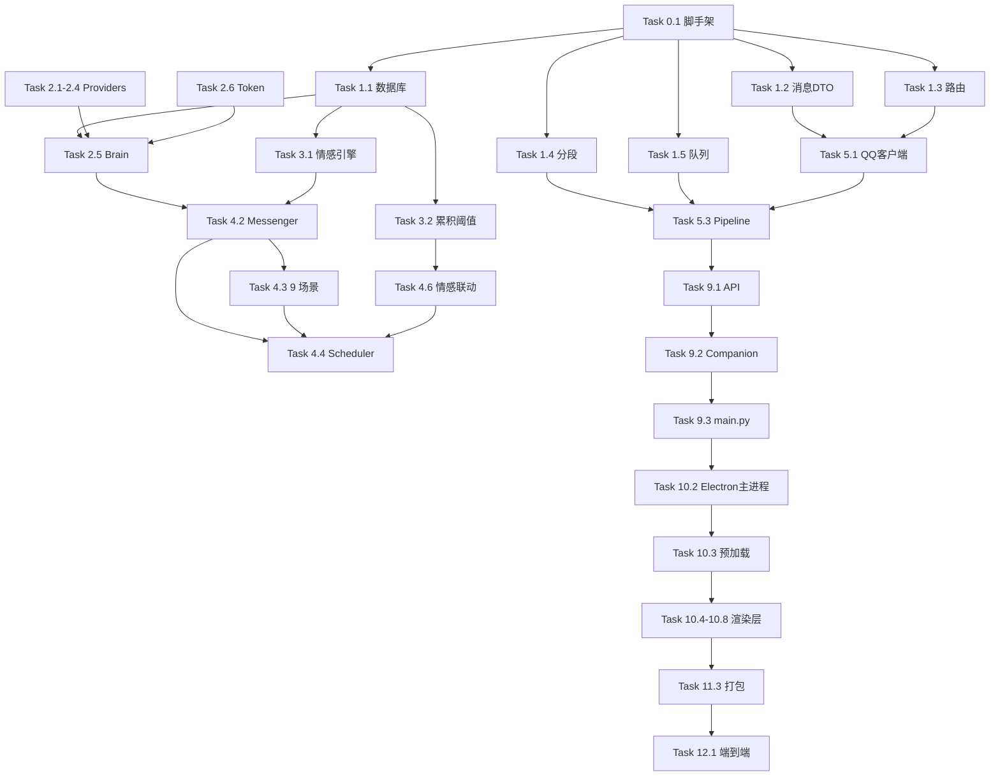

# Tasks · Aerie · 云栖 v9.0 实施任务分解

> 本文件是 spec.md 的可执行任务列表。任务按依赖关系排序，**无依赖任务可并行执行**。
> 标注 ✅ 的子任务为本任务包含的关键里程碑；未标注的为常规步骤。
> 建议使用 4-6 个 Sub-Agent 并行执行。

---

## 阶段 0 · 项目脚手架（基础）

### Task 0.1: 创建项目目录结构与初始化文件
- [ ] SubTask 0.1.1: 创建 `electron/` `core/` `communication/` `proactive/` `scheduler/` `persona/` `config/` `data/` `logs/` `tools/` `memory/` `knowledge/` `emotion/` 目录
- [ ] SubTask 0.1.2: 创建 `requirements.txt`（aiohttp / websockets / loguru / psutil / pyyaml / apscheduler / openai / requests / pywin32）
- [ ] SubTask 0.1.3: 创建 `.env.example`（OPENAI_API_KEY / DEEPSEEK_API_KEY / GEMINI_API_KEY / SELF_QQ / HTTP_API_PORT / NAPCAT_WS_URL / LOG_LEVEL）
- [ ] SubTask 0.1.4: 创建 `config/settings.yaml`（self_qq / friends / proactive / theme / paths）
- [ ] SubTask 0.1.5: 创建 `config/persona.yaml`（伊塔 v8.0 完整人设）
- [ ] SubTask 0.1.6: 创建 `config/proactive.yaml`（9 类主动推送场景定义）

### Task 0.2: 初始化 Git 与 .gitignore
- [ ] SubTask 0.2.1: `git init` （如未初始化）
- [ ] SubTask 0.2.2: 创建 `.gitignore`（`__pycache__/` `*.pyc` `data/*.db` `logs/*.log` `userData/` `dist/` `node_modules/` `.env` `*.egg-info/`）

---

## 阶段 1 · Python 后端基础（无依赖，可并行 1-5）

### Task 1.1: 数据库层 `core/database.py`
- [ ] SubTask 1.1.1: 实现 `Database` 单例类（sqlite3 + 上下文管理）
- [ ] SubTask 1.1.2: 实现 7 张表的建表语句（chat_log / long_term_memory / knowledge_base / todo / emotion_log / push_log / feedback_log / token_usage）
- [ ] SubTask 1.1.3: 实现通用 `insert/update/query/execute` 方法
- [ ] SubTask 1.1.4: ✅ 单元测试：建表 + 增删改查

### Task 1.2: 消息 DTO `communication/message.py`
- [ ] SubTask 1.2.1: 定义 `MessageType` / `Intent` 枚举
- [ ] SubTask 1.2.2: 定义 `IncomingMessage` / `OutgoingReply` dataclass
- [ ] SubTask 1.2.3: 实现 `from_onebot_event(event)` 工厂方法
- [ ] SubTask 1.2.4: 实现 `is_private` / `is_empty` 属性
- [ ] SubTask 1.2.5: ✅ 单元测试：解析 + 字段验证

### Task 1.3: 路由层 `communication/router.py`
- [ ] SubTask 1.3.1: 实现 `RouteMode` 枚举（FULL/AUTO/BASIC）
- [ ] SubTask 1.3.2: 实现 `Router.is_master/is_friend/is_stranger`
- [ ] SubTask 1.3.3: 实现 `Router.route(user_id) -> RouteMode`
- [ ] SubTask 1.3.4: ✅ 单元测试：三种账号类型路由

### Task 1.4: 拟人化分段 `communication/splitter.py`
- [ ] SubTask 1.4.1: 实现 `SemanticMessageSplitter` 类
- [ ] SubTask 1.4.2: 实现 8 种分割模式（段落/句末/列表项/项目符号/过渡/引号/分号/逗号）
- [ ] SubTask 1.4.3: 实现 `split(text, msg_type)` 主方法
- [ ] SubTask 1.4.4: ✅ 单元测试：长文本分多段 + 句末补全

### Task 1.5: 拟人化发送队列 `communication/send_queue.py`
- [ ] SubTask 1.5.1: 实现 `QueuedMessage` dataclass
- [ ] SubTask 1.5.2: 实现 `SendQueue` 基于 `asyncio.PriorityQueue`
- [ ] SubTask 1.5.3: 实现 5 类消息的间隔范围（daily/emotional/report/urgent/proactive）
- [ ] SubTask 1.5.4: 实现 `enqueue/process/start/stop` 方法
- [ ] SubTask 1.5.5: ✅ 单元测试：入队 → 处理 → 节奏

---

## 阶段 2 · AI 核心与人格（依赖 1.1-1.5）

### Task 2.1: 多 Provider 抽象 `core/providers/base.py`
- [ ] SubTask 2.1.1: 定义 `Provider` 抽象基类
- [ ] SubTask 2.1.2: 定义 `LLMResponse` dataclass
- [ ] SubTask 2.1.3: 实现 `complete(prompt, **kwargs)` 抽象方法

### Task 2.2: Qwen Provider `core/providers/qwen.py`
- [ ] SubTask 2.2.1: 实现 `QwenProvider`，基于 `openai` 兼容 SDK
- [ ] SubTask 2.2.2: 配置 `base_url=https://dashscope.aliyuncs.com/compatible-mode/v1`
- [ ] SubTask 2.2.3: 解析响应中的 `usage` 字段

### Task 2.3: DeepSeek Provider `core/providers/deepseek.py`
- [ ] SubTask 2.3.1: 实现 `DeepSeekProvider`
- [ ] SubTask 2.3.2: 配置 `base_url=https://api.deepseek.com/v1`

### Task 2.4: Gemini Provider `core/providers/gemini.py`
- [ ] SubTask 2.4.1: 实现 `GeminiProvider`，基于 `openai` 兼容 SDK
- [ ] SubTask 2.4.2: 配置 `base_url=https://generativelanguage.googleapis.com/v1beta/openai/`

### Task 2.5: Brain 调度 `core/brain.py`
- [ ] SubTask 2.5.1: 实现 `Brain` 类，注入 providers 列表
- [ ] SubTask 2.5.2: 实现 `think(prompt, scene, user_id)` 主方法（Fallback 链）
- [ ] SubTask 2.5.3: 实现 `generate_push(template, mood, **kwargs)`
- [ ] SubTask 2.5.4: 集成 `TokenTracker` 记录每次调用
- [ ] SubTask 2.5.5: ✅ 单元测试：Provider 失败时降级到下一级

### Task 2.6: Token 统计 `core/token_tracker.py`
- [ ] SubTask 2.6.1: 实现 `TokenTracker` 类
- [ ] SubTask 2.6.2: 实现 `record(user_id, provider, model, scene, prompt_tokens, completion_tokens, duration_ms, success)`
- [ ] SubTask 2.6.3: 实现 `get_today_stats(user_id)` / `get_by_model(user_id, days)`

### Task 2.7: 人格决策 `persona/decision.py`
- [ ] SubTask 2.7.1: 实现 `DecisionLayer` 枚举（L1/L2/L3/L4）
- [ ] SubTask 2.7.2: 实现 `PersonaDecision.decide(candidates, context)`
- [ ] SubTask 2.7.3: ✅ 单元测试：四级权重（0.5/0.3/0.15/0.05）

### Task 2.8: 人格随机 `persona/brain_random.py`
- [ ] SubTask 2.8.1: 实现 `BrainRandom` 类
- [ ] SubTask 2.8.2: 实现 Markov 转移矩阵构建
- [ ] SubTask 2.8.3: 实现 `think(current_state, history)` softmax 采样

### Task 2.9: 上下文构建 `core/context_builder.py`
- [ ] SubTask 2.9.1: 实现 `ContextBuilder` 类
- [ ] SubTask 2.9.2: 实现 `build(user_id, user_msg, route_mode)`
- [ ] SubTask 2.9.3: 集成 System Prompt（含情绪状态 / 称呼规则）
- [ ] SubTask 2.9.4: 注入长期记忆 Top 5 + 知识库 Top 3 + 最近 8 条历史

---

## 阶段 3 · 情感引擎（依赖 1.1）

### Task 3.1: PAD 情感引擎 `core/emotion_engine.py`
- [ ] SubTask 3.1.1: 实现 `PADState` dataclass
- [ ] SubTask 3.1.2: 实现 `EmotionEngine.trigger(event_type, intensity)`
- [ ] SubTask 3.1.3: 实现 6 种事件 → PAD 增量映射（user_praise/user_cold/user_attack/user_gift/system_error/system_recover）
- [ ] SubTask 3.1.4: 实现 `get_label()` 五类情绪判定
- [ ] SubTask 3.1.5: ✅ 单元测试：触发事件后 PAD 更新正确

### Task 3.2: 累积阈值系统 `core/emotion_threshold.py`
- [ ] SubTask 3.2.1: 实现 `EmotionSlot` dataclass（name/value/threshold/decay_per_day/threshold_history）
- [ ] SubTask 3.2.2: 实现 `CumulativeEmotionEngine` 类
- [ ] SubTask 3.2.3: 实现 4 槽位（patience/anxiety/desire/tenderness）配置
- [ ] SubTask 3.2.4: 实现 `add(slot_name, value, trigger)` 主方法
- [ ] SubTask 3.2.5: 实现 `daily_decay()` 每日衰减
- [ ] SubTask 3.2.6: 实现 `_erupt()` 爆发 + 角色磨损（post_decay 应用）
- [ ] SubTask 3.2.7: 实现 `get_panel()` 后台数值面板字符串
- [ ] SubTask 3.2.8: ✅ 单元测试：阈值突破触发爆发 + 阈值永久变化

### Task 3.3: 情感状态机 `emotion/state_machine.py`
- [ ] SubTask 3.3.1: 实现状态转换规则（Neutral ↔ Joy/Sad/Anger/Fear）
- [ ] SubTask 3.3.2: 实现转换速度表（秒级/分钟级/小时级）
- [ ] SubTask 3.3.3: ✅ 单元测试：转换路径正确

---

## 阶段 4 · 主动推送与定时轮询 ⭐（核心）

### Task 4.1: 推送策略 `proactive/policy.py`
- [ ] SubTask 4.1.1: 实现 `PushPolicy` 类
- [ ] SubTask 4.1.2: 实现 `can_push(scene)` 五重检查（enabled / pause_until / daily_count < 5 / 静默时段豁免 / 30 分钟间隔）
- [ ] SubTask 4.1.3: 实现 `record(scene)` / `pause(minutes)` / `pause_until(when)`
- [ ] SubTask 4.1.4: ✅ 单元测试：边界条件（达到上限 / 静默时段 / 暂停中）

### Task 4.2: 主动消息器 `proactive/messenger.py`
- [ ] SubTask 4.2.1: 实现 `ProactiveMessenger.push(scene, master_id, template, **kwargs)`
- [ ] SubTask 4.2.2: 集成 `PushPolicy` / `Brain` / `EmotionEngine` / `QQClient` / `push_log`
- [ ] SubTask 4.2.3: 实现 `emotion_engine.get_current_mood(master_id)` 调色
- [ ] SubTask 4.2.4: ✅ 单元测试：成功/失败/skipped 三种结果

### Task 4.3: 9 类主动场景（并行）
- [ ] SubTask 4.3.1: `proactive/scenes/morning_brief.py` — 早安简报
- [ ] SubTask 4.3.2: `proactive/scenes/lunch_remind.py` — 午提醒
- [ ] SubTask 4.3.3: `proactive/scenes/evening_check.py` — 晚问候
- [ ] SubTask 4.3.4: `proactive/scenes/goodnight.py` — 晚安
- [ ] SubTask 4.3.5: `proactive/scenes/weather_push.py` — 天气
- [ ] SubTask 4.3.6: `proactive/scenes/todo_remind.py` — 待办
- [ ] SubTask 4.3.7: `proactive/scenes/anniversary.py` — 纪念日
- [ ] SubTask 4.3.8: `proactive/scenes/idle_care.py` — 失联关怀
- [ ] SubTask 4.3.9: `proactive/scenes/emotion_comfort.py` — 情绪安抚

### Task 4.4: APScheduler 定时轮询 `scheduler/cron.py`
- [ ] SubTask 4.4.1: 实现 `CronScheduler` 类（基于 `apscheduler.schedulers.asyncio.AsyncIOScheduler`）
- [ ] SubTask 4.4.2: 实现 `start()` 注册所有 Cron 任务（读取 `config/proactive.yaml`）
- [ ] SubTask 4.4.3: 实现 9 个固定时间点的 Cron 表达式
- [ ] SubTask 4.4.4: 实现 `shutdown()` 优雅关闭
- [ ] SubTask 4.4.5: ✅ 集成测试：启动 → 等待早 06:30 → 验证收到早安消息

### Task 4.5: 主动推送日志表 `core/push_log.py`
- [ ] SubTask 4.5.1: 实现 `PushLog` 类
- [ ] SubTask 4.5.2: 实现 `write(scene, user_id, content, status)` / `get_recent(limit)`

### Task 4.6: 情感槽联动主动推送
- [ ] SubTask 4.6.1: 在 `CumulativeEmotionEngine._erupt()` 中调度 `proactive.push`
- [ ] SubTask 4.6.2: 在 `EmotionEngine.trigger()` 中检测阈值预警
- [ ] SubTask 4.6.3: ✅ 集成测试：渴望值 +15 → 触发 `emotion_comfort`

---

## 阶段 5 · QQ 客户端与撤回（依赖 1.2 / 1.3）

### Task 5.1: QQ 客户端 `communication/qq_client.py`
- [ ] SubTask 5.1.1: 实现 `QQClient.__init__(config)` 加载 self_qq / friends / napcat_ws_url
- [ ] SubTask 5.1.2: 实现 `connect()` WS 连接 + 5s/30s 退避重连
- [ ] SubTask 5.1.3: 实现 `_message_loop()` 接收 + meta_event 过滤
- [ ] SubTask 5.1.4: 实现 `_handle_message_event(event)` 解析为 `IncomingMessage`
- [ ] SubTask 5.1.5: 实现 `send_message(user_id, content)` 调 NapCat `action=send_msg`
- [ ] SubTask 5.1.6: 实现 `send_group_message` / `recall_message` / `send_image` 基础 API
- [ ] SubTask 5.1.7: ✅ 集成测试：接收 + 路由 + 发送完整链路

### Task 5.2: 撤回机制 `communication/recall_manager.py`
- [ ] SubTask 5.2.1: 实现 `RecallManager` 类
- [ ] SubTask 5.2.2: 实现 6 个否定关键词检测
- [ ] SubTask 5.2.3: 实现 `on_message_sent` / `handle_user_negative`
- [ ] SubTask 5.2.4: ✅ 单元测试：2 分钟内 → 触发撤回 + 道歉

### Task 5.3: Pipeline 5 阶段 `core/pipeline.py`
- [ ] SubTask 5.3.1: 实现 `Pipeline.handle(msg)` 入口
- [ ] SubTask 5.3.2: 阶段 1: 路由（FULL/AUTO/BASIC）
- [ ] SubTask 5.3.3: 阶段 2: 情感感知 `EmotionEngine.perceive(msg)`
- [ ] SubTask 5.3.4: 阶段 3: 上下文构建 `ContextBuilder.build()`
- [ ] SubTask 5.3.5: 阶段 4: Brain + Tools 推理
- [ ] SubTask 5.3.6: 阶段 5: 情感调色 + 拟人化分段 + SendQueue
- [ ] SubTask 5.3.7: 写入 chat_log + emotion_log + token_usage
- [ ] SubTask 5.3.8: ✅ 集成测试：端到端消息流

---

## 阶段 6 · 记忆与知识库（依赖 1.1）

### Task 6.1: 短期记忆 `memory/short_term.py`
- [ ] SubTask 6.1.1: 实现 `ShortTermMemory`（最近 8 条）
- [ ] SubTask 6.1.2: 实现 `add(msg)` / `get_recent(limit)` / `clear()`

### Task 6.2: 长期记忆 `memory/memory_store.py`
- [ ] SubTask 6.2.1: 实现 `LongTermMemory` 基于 SQLite
- [ ] SubTask 6.2.2: 实现 `add(user_id, memory_type, content, importance)`
- [ ] SubTask 6.2.3: 实现 `search(user_id, query, top_k)` 关键词 + BM25 简单检索
- [ ] SubTask 6.2.4: 实现 `get_recent(user_id, limit)`

### Task 6.3: 知识库 `knowledge/kb.py`
- [ ] SubTask 6.3.1: 实现 `KnowledgeBase` 类
- [ ] SubTask 6.3.2: 实现 `add(category, title, content)`
- [ ] SubTask 6.3.3: 实现 `search(query, top_k)` 关键词检索
- [ ] SubTask 6.3.4: 实现 `stats()` 条目数 / 分类数

---

## 阶段 7 · 工具系统（依赖 1.1）

### Task 7.1: 工具注册表 `core/tool_registry.py`
- [ ] SubTask 7.1.1: 实现 `ToolRegistry` 类
- [ ] SubTask 7.1.2: 实现 `register(name, func, schema, category)` / `get(name)` / `increment_usage`
- [ ] SubTask 7.1.3: 实现 `list_tools()` / `usage_stats()`

### Task 7.2: 14+ 工具实现（并行 7.2.1 - 7.2.14）
- [ ] SubTask 7.2.1: `tools/query_knowledge.py` — 查询知识库
- [ ] SubTask 7.2.2: `tools/add_todo.py` — 添加待办
- [ ] SubTask 7.2.3: `tools/list_todos.py` — 列出待办
- [ ] SubTask 7.2.4: `tools/mark_todo_done.py` — 标记完成
- [ ] SubTask 7.2.5: `tools/search_music.py` — 搜索音乐（占位，提示用户）
- [ ] SubTask 7.2.6: `tools/play_local_music.py` — 播放本地音乐（占位）
- [ ] SubTask 7.2.7: `tools/set_reminder.py` — 设置提醒（写入 `todo.db`）
- [ ] SubTask 7.2.8: `tools/get_weather.py` — 查询天气（外部 API 占位）
- [ ] SubTask 7.2.9: `tools/search_web.py` — 网页搜索（占位）
- [ ] SubTask 7.2.10: `tools/open_application.py` — 打开应用（subprocess.Popen）
- [ ] SubTask 7.2.11: `tools/close_application.py` — 关闭应用
- [ ] SubTask 7.2.12: `tools/screenshot.py` — 截屏（pyautogui）
- [ ] SubTask 7.2.13: `tools/get_system_status.py` — 内核状态
- [ ] SubTask 7.2.14: `tools/send_proactive_msg.py` — 主动推送（调用 ProactiveMessenger）

### Task 7.3: Function Calling 核心 `core/function_calling.py`
- [ ] SubTask 7.3.1: 实现 `TOOLS_SCHEMA`（OpenAI 兼容格式，14+ 工具）
- [ ] SubTask 7.3.2: 实现 `execute_tool_call(brain, tool_name, arguments)`

---

## 阶段 8 · 高权限与备份

### Task 8.1: UAC 提权 `core/elevator.py`
- [ ] SubTask 8.1.1: 实现 `Elevator.is_admin()` 检查
- [ ] SubTask 8.1.2: 实现 `Elevator.run_as_admin(cmd)` 触发 ShellExecuteEx

### Task 8.2: 任务计划 `core/task_scheduler.py`
- [ ] SubTask 8.2.1: 实现 `TaskScheduler.create_daily_task(name, time_str, command)` 通过 PowerShell
- [ ] SubTask 8.2.2: 实现 `remove_task(name)` / `list_tasks()`

### Task 8.3: 数据备份 `core/backup.py`
- [ ] SubTask 8.3.1: 实现 `BackupManager.create_backup()` → zip
- [ ] SubTask 8.3.2: 实现 `restore_backup(zip_path)`
- [ ] SubTask 8.3.3: 实现 `auto_backup_daily()` 清理 7 天前
- [ ] SubTask 8.3.4: 实现 `migrate_to(target_path)` 一键迁移

### Task 8.4: 系统监控 `core/system_monitor.py`
- [ ] SubTask 8.4.1: 实现 `SystemMonitor.get_stats()` → CPU/内存/磁盘/网络
- [ ] SubTask 8.4.2: 实现 `_get_python_proc_info()` Python 子进程信息

### Task 8.5: 故障自愈 `core/self_healing.py`
- [ ] SubTask 8.5.1: 实现 14 类故障的检测 + 恢复策略
- [ ] SubTask 8.5.2: 故障类型: napcat_disconnected / python_crashed / all_providers_failed / port_conflict / db_locked / ...

---

## 阶段 9 · HTTP API 服务

### Task 9.1: API 路由 `core/api_server.py`
- [ ] SubTask 9.1.1: 实现 aiohttp 路由表
- [ ] SubTask 9.1.2: 22 个 API 端点（见 spec.md §3.2 引用 §8.5）
- [ ] SubTask 9.1.3: 鉴权（仅本机，绑定 127.0.0.1）
- [ ] SubTask 9.1.4: 错误处理（500 + JSON 错误体）
- [ ] SubTask 9.1.5: ✅ 集成测试：每个端点 + curl 验证

### Task 9.2: Companion 主类 `core/companion.py`
- [ ] SubTask 9.2.1: 实现 `Companion` 编排所有后端模块
- [ ] SubTask 9.2.2: 实现 `start()` / `stop()` / `push_proactive()`

### Task 9.3: Python 入口 `main.py`
- [ ] SubTask 9.3.1: 实现 `main()` 启动序列（见 spec.md R6）
- [ ] SubTask 9.3.2: 实现 SIGTERM 优雅关闭
- [ ] SubTask 9.3.3: ✅ 端到端测试：`python main.py` 启动 → API 200 → QQ 收发

---

## 阶段 10 · Electron 主进程与渲染层

### Task 10.1: Electron 项目脚手架
- [ ] SubTask 10.1.1: 创建 `electron/package.json`（见 spec.md §3.2）
- [ ] SubTask 10.1.2: 创建 `electron/electron-builder.yml`
- [ ] SubTask 10.1.3: `npm install` 安装 electron / electron-builder / sharp
- [ ] SubTask 10.1.4: 创建 `electron/builder/icon.ico` 占位图标
- [ ] SubTask 10.1.5: 创建 `electron/builder/installer.nsh` NSIS 脚本

### Task 10.2: Electron 主进程 `electron/src/main.js`
- [ ] SubTask 10.2.1: 单实例锁 `app.requestSingleInstanceLock()`
- [ ] SubTask 10.2.2: 禁用硬件加速 `app.disableHardwareAcceleration()`
- [ ] SubTask 10.2.3: `loadConfig()` / `saveConfig()` 读写 `userData/config.json`
- [ ] SubTask 10.2.4: `getPythonPath()` 多路径探测 `pythonw.exe`
- [ ] SubTask 10.2.5: `startPythonBackend()` spawn 子进程（windowsHide / stdio: ignore）
- [ ] SubTask 10.2.6: `createMainWindow()` 主窗口（聊天 + 侧边栏）
- [ ] SubTask 10.2.7: `createFloatingBall()` 悬浮球（frameless + transparent + alwaysOnTop）
- [ ] SubTask 10.2.8: `createTray()` 托盘图标 + 右键菜单
- [ ] SubTask 10.2.9: `setupIPC()` IPC 桥
- [ ] SubTask 10.2.10: `app.whenReady()` 启动序列
- [ ] SubTask 10.2.11: ✅ 单元测试：单实例锁 + 配置读写

### Task 10.3: 预加载脚本 `electron/src/preload.js`
- [ ] SubTask 10.3.1: 实现 `contextBridge.exposeInMainWorld('aerie', {...})`
- [ ] SubTask 10.3.2: 暴露 `api.get/post` / `window.minimize/close` / `system.openExternal/selectFile`
- [ ] SubTask 10.3.3: 暴露 `on('python-message' / 'qq-message' / 'push-message', callback)`

### Task 10.4: 渲染层基础 `electron/src/renderer/index.html`
- [ ] SubTask 10.4.1: HTML5 骨架 + CSP 严格头
- [ ] SubTask 10.4.2: 引入主 CSS + 主题 CSS + 所有 JS
- [ ] SubTask 10.4.3: 布局：侧边栏 + 聊天窗 + 状态栏

### Task 10.5: 悬浮球 `floating-ball.html` + `floating-ball.css` + `floating-ball.js`
- [ ] SubTask 10.5.1: HTML 球体 + tooltip
- [ ] SubTask 10.5.2: CSS 渐变 + 阴影 + 悬停动画
- [ ] SubTask 10.5.3: ✅ JS `FloatingBall` 类：拖拽 / 智能靠边 / 展开聊天 / 双击最大化 / 智能半透明

### Task 10.6: 聊天窗 `chat.html` + `chat.css` + `chat.js`
- [ ] SubTask 10.6.1: HTML 消息列表 + 输入框 + 状态栏
- [ ] SubTask 10.6.2: CSS 头像 + 气泡 + 渐变色
- [ ] SubTask 10.6.3: ✅ JS `ChatPanel` 类：发送 / 加载历史 / 轮询新消息 / 自动滚动

### Task 10.7: 侧边栏 `sidebar.html` + `sidebar.css` + `sidebar.js`
- [ ] SubTask 10.7.1: HTML 5 Tab 按钮 + 5 个 tab-pane
- [ ] SubTask 10.7.2: CSS Tab 切换 + 选中态
- [ ] SubTask 10.7.3: ✅ JS `Sidebar` 类：Tab 切换 / 数据加载（5 个 API）
- [ ] SubTask 10.7.4: 情绪 Tab：情感仪表盘 + 历史
- [ ] SubTask 10.7.5: 纪念 Tab：纪念日列表 + 在一起天数
- [ ] SubTask 10.7.6: 系统 Tab：自启 / 主题 / 窗口设置
- [ ] SubTask 10.7.7: 其他 Tab：推送暂停 / 反馈 / 隐私
- [ ] SubTask 10.7.8: 数据 Tab：聊天记录 / 知识库 / 工具调用

### Task 10.8: 状态展示 `status.html` + `status.js`
- [ ] SubTask 10.8.1: HTML 4 个区域（Token / 模型 / 内核 / Provider）
- [ ] SubTask 10.8.2: ✅ JS `refreshStatus()` 每 5 秒 `GET /api/status/all`

### Task 10.9: 5 主题 CSS（并行 10.9.1 - 10.9.5）
- [ ] SubTask 10.9.1: `themes/yita-pink.css` — 伊塔粉（默认）
- [ ] SubTask 10.9.2: `themes/midnight-purple.css` — 深夜紫
- [ ] SubTask 10.9.3: `themes/sakura-white.css` — 樱白
- [ ] SubTask 10.9.4: `themes/ocean-blue.css` — 海蓝
- [ ] SubTask 10.9.5: `themes/forest-green.css` — 森绿

### Task 10.10: 主题切换器 `theme-switcher.js`
- [ ] SubTask 10.10.1: 实现 `applyTheme(themeName)` 切换 `<link id="theme-css">`
- [ ] SubTask 10.10.2: 持久化到 `localStorage.aerie-theme` + `config.theme`

---

## 阶段 11 · 打包与发布

### Task 11.1: 图标资源
- [ ] SubTask 11.1.1: 使用 `sharp` 将 PNG → ICO
- [ ] SubTask 11.1.2: 准备 256×256 / 128×128 / 64×64 / 32×32 / 16×16 多尺寸

### Task 11.2: NSIS 脚本 `electron/builder/installer.nsh`
- [ ] SubTask 11.2.1: 自定义安装流程
- [ ] SubTask 11.2.2: 桌面快捷方式 + 开始菜单 + 卸载脚本

### Task 11.3: 打包命令验证
- [ ] SubTask 11.3.1: `npm run build:win` 输出 `Aerie-9.0.0-Setup.exe`
- [ ] SubTask 11.3.2: ✅ 在 Windows 11 真实环境安装测试

---

## 阶段 12 · 集成测试与发布

### Task 12.1: 端到端测试
- [ ] SubTask 12.1.1: 双击 `Aerie-9.0.0-Setup.exe` → 安装 → 启动
- [ ] SubTask 12.1.2: 验证 0 个黑窗弹出
- [ ] SubTask 12.1.3: 验证悬浮球出现 + 拖拽 + 展开
- [ ] SubTask 12.1.4: 主账号发 QQ 消息 → 伊塔回复（< 5s）
- [ ] SubTask 12.1.5: 等待早 06:30 → 验证早安消息
- [ ] SubTask 12.1.6: 托盘"暂停推送" → 验证不触发
- [ ] SubTask 12.1.7: 重启电脑 → 验证自启

### Task 12.2: 性能基线
- [ ] SubTask 12.2.1: 测量启动时间（< 10s）
- [ ] SubTask 12.2.2: 测量空闲内存（< 500MB）
- [ ] SubTask 12.2.3: 测量 API P95（< 500ms）
- [ ] SubTask 12.2.4: 测量 AI P95（< 3s）

### Task 12.3: 文档与发布
- [ ] SubTask 12.3.1: 编写 `README.md`（中英双语）
- [ ] SubTask 12.3.2: 编写 `CHANGELOG.md`
- [ ] SubTask 12.3.3: 备份一次完整配置 + 数据库

---

## 任务依赖图

---

## 并行建议（最大化 Sub-Agent 利用）

| 时段 | 可并行的 Sub-Agent 任务 |
| --- | --- |
| **时段 1** | T1.1 / T1.2 / T1.3 / T1.4 / T1.5（5 个数据/通信基础） |
| **时段 2** | T2.1 / T2.2 / T2.3 / T2.4 / T2.7 / T2.8（6 个 AI/人格） |
| **时段 3** | T3.1 / T3.2 / T3.3（3 个情感）+ T6.1 / T6.2 / T6.3（3 个记忆/知识）= 6 个 |
| **时段 4** | T4.1 / T4.3.1-9（10 个主动场景）+ T7.2.1-14（14 个工具）= 24 个 |
| **时段 5** | T5.1 / T5.2 / T5.3 + T8.1 / T8.2 / T8.3 / T8.4 / T8.5 + T9.1 = 11 个 |
| **时段 6** | T10.5 / T10.6 / T10.7 / T10.8 / T10.9.1-5（10 个渲染层） |
| **时段 7** | T11.1 / T11.2 / T11.3（3 个打包） |
| **时段 8** | T12.1 / T12.2 / T12.3（3 个测试/发布） |

---

> **下一步**: 等待用户审批本 tasks.md → 进入实施阶段，按依赖顺序调度 Sub-Agent
