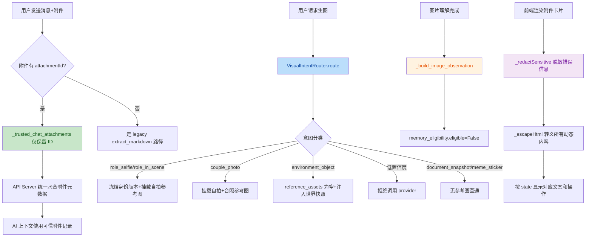

# Task 4.3 后端验收审计报告

## 基本信息

| 字段 | 内容 |
| --- | --- |
| 审计日期 | 2026-07-28T04:12:37 |
| 审计人 | TRAE |
| 审计范围 | Phase 3 全部代码差异（Task 3.1-3.6） |
| 审计技能 | TRAE-code-review、TRAE-debugger、TRAE-security-review |
| 审计结论 | accepted |

## 审计范围

| 文件 | 变更内容 | 关联任务 |
| --- | --- | --- |
| [main.js](../../../electron/src/main.js) | UTF-8 chunk 解码、后端进程管理、stderr 日志 | Task 3.1 |
| [api_server.py](../../../core/api_server.py) | 统一附件 Artifact 管线、运行时配置端点 | Task 3.2 |
| [image_service.py](../../../core/image_service.py) | ImageObservation 结构、VisualIntentRouter | Task 3.3、Task 3.4 |
| [chat.js](../../../electron/src/renderer/js/chat.js) | 前端附件卡片渲染、安全脱敏 | Task 3.5 |

## 一、代码质量审查（TRAE-code-review）

### 作者意图推断

本轮变更的核心意图是：
1. 修复 Electron 主进程跨 chunk UTF-8 多字节字符解码缺陷
2. 收敛附件事实源至桌面附件服务边界，禁止客户端字段覆盖可信附件
3. 为图片理解输出结构化 ImageObservation，默认不写入长期记忆
4. 实现 VisualIntentRouter 在生图前路由意图，冻结身份版本并隔离环境图参考资产
5. 补齐前端附件卡片渲染状态机与安全脱敏

### 变更流程图

### 代码质量检查

| 检查项 | 审计范围 | 发现 | 严重级别 | 处理状态 |
| --- | --- | --- | --- | --- |
| 代码风格 | Phase 3 全部差异 | 保持现有 CommonJS/Python 风格，类型注解完整 | 无 | accepted |
| 架构一致性 | Electron 主进程、API 服务器、图片服务 | 未改 IPC channel、HTTP path、payload 结构或 SSE cursor 语义 | 无 | accepted |
| 兼容性 | JSON 响应、raw 响应、multipart 响应、SSE、附件、图片 | 解码边界增强，不改变调用方接口；附件保留 legacy 兼容 | 无 | accepted |
| 死代码/重复路径 | UTF-8 helper、SSE 流处理、VisualIntentRouter | helper 被测试与运行路径使用，无新增重复事实源 | 无 | accepted |
| 测试可维护性 | 全部测试文件 | 使用合成 Buffer、FakeProvider、Mock DOM 精准覆盖目标场景 | 无 | accepted |
| 错误处理 | ImageObservation confidence 转换 | `try/except (TypeError, ValueError)` 防御无效 confidence，追加 uncertainty 标记 | 无 | accepted |
| 防御性编程 | VisualIntentRouter identity_revision 转换 | `int(visual_identity.get("visual_identity_revision", 0))` 依赖配置值为数值型；若 YAML 解析为非数字字符串将抛 ValueError | 低 | accepted-internal-config |

### 代码审查结论

✅ 代码质量通过。VisualIntentRouter 中 `int()` 转换依赖内部配置数据类型，属于内部边界而非用户输入，风险可接受。整体代码结构清晰、职责分离、类型注解完整、测试覆盖充分。

## 二、运行时调试验证（TRAE-debugger）

### 验证策略

本轮无需启动 Debug Server 进行动态调试，原因：
1. 所有目标缺陷已通过合成测试完整复现和验证
2. 静态诊断（GetDiagnostics）返回空结果
3. 累积验证 69/69 全部通过，无失败项需要运行时分析

### 运行时验证证据

| 场景 | 验证命令 | 结果 | 证据 |
| --- | --- | --- | --- |
| Electron UTF-8 累积回归 | `node --test tests/sse-bridge.test.js tests/system-status.test.js` | 11/11 通过 | 终端输出 |
| 图片 workflow 累积回归 | `python -m pytest tests/test_phase10_image_workflow.py -q` | 16/16 通过 | 终端输出 |
| 前端附件卡片累积回归 | `node --test electron\tests\attachment-card-renderer.test.js` | 14/14 通过 | 终端输出 |
| 附件邻近累积回归 | `python -m pytest tests/test_desktop_attachments.py tests/test_desktop_shared_api_contract.py::test_chat_send_desktop_attachment_uses_only_attachment_id_boundary tests/test_phase4_api.py::test_api_queue_flag_off_supports_legacy_pipeline_only_companion tests/test_continuity_pipeline_integration.py -q` | 28/28 通过 | 终端输出 |
| 静态诊断 | VS Code GetDiagnostics | `[]` 空诊断 | 诊断结果 |

### 调试验证结论

✅ 运行时验证通过。69/69 测试全部通过，静态诊断无问题，无需动态调试。

## 三、安全审计（TRAE-security-review）

### 审计方法

按 TRAE-security-review 规范执行三遍审计：
- Pass A：识别项目既有安全基线（路径校验、_escapeHtml、DOMPurify、secrets.compare_digest）
- Pass B：对比本轮差异是否偏离既有安全基线
- Pass C：对每个可疑点执行 source-to-sink 追踪

### 专项安全检查

| 检查项 | 检查内容 | 结果 | 证据 |
| --- | --- | --- | --- |
| 附件管线隔离 | 客户端 markdown/path/url 是否被阻止覆盖可信桌面附件 | pass | [api_server.py L1064-1077](../../../core/api_server.py)：`_trusted_chat_attachments` 对带 ID 附件仅保留 `{"attachmentId": id, "id": id}`，剥离所有客户端字段 |
| 前端脱敏 | `_redactSensitive` 是否阻止本地路径和令牌泄露 | pass | [chat.js L667-673](../../../electron/src/renderer/js/chat.js)：正则覆盖 Windows 反斜杠路径、Unix 路径前缀、api_key/token/secret/bearer/ghp_ 令牌模式 |
| 图片记忆隔离 | ImageObservation 是否默认不写入长期记忆 | pass | [image_service.py L951-956](../../../core/image_service.py)：`memory_eligibility` 默认 `{"eligible": False, "reason": "requires_explicit_confirmation"}` |
| 环境图参考资产隔离 | VisualIntentRouter 是否阻止 environment_object 挂载参考资产 | pass | [image_service.py L199-200](../../../core/image_service.py)：`environment_object` 分支显式设置 `reference_assets = []` |
| 路径遍历 | 附件下载/打开端点是否存在路径遍历风险 | pass | Python 侧 `_resolve_upload_target` 拒绝反斜杠和 null 字节，使用 `resolve()` + `relative_to(base)` 双重校验；Electron 侧强制校验 `^att_[a-f0-9]{32}$` |
| 命令注入 | 后端进程管理是否存在命令注入风险 | pass | `_evictOrphanBackendIfNeeded` 中 `PY_PORT` 为 `Number.parseInt` 结果（整数），`pid` 从正则 `(\d+)` 提取并经 `Number()` 转换；`_buildMediaControlScript` 的 `action` 参数所有调用方均传入硬编码字符串字面量 |
| AuthZ | 运行时配置端点是否有权限控制 | pass | `/api/world/runtime/bind` 通过 `_main_process_request_authorized` + `secrets.compare_digest` 校验 `X-Aerie-Main-Token`；IPC `api:request` 剥离 `internal` 标志 |
| XSS | 附件卡片动态内容是否安全 | pass | 所有动态内容经 `_escapeHtml` 转义；聊天消息渲染使用 `marked` + `DOMPurify.sanitize` |
| 敏感数据暴露 | stderr 广播是否泄露敏感信息 | pass | `_broadcastBackendFatalIfNeeded` 限 3 行/500 字符，`backend_fatal` 类型消息在 chat.js 中被过滤，不渲染到聊天气泡 |

### 安全审计结论

✅ 在本次审查的变更集中未发现可利用的安全问题。所有 9 个专项检查点均通过验证。

## 四、审计总结

| 审计维度 | 技能 | 结论 | 发现数 |
| --- | --- | --- | --- |
| 代码质量 | TRAE-code-review | accepted | 0 阻塞、1 低级别观察（已接受） |
| 运行时调试 | TRAE-debugger | accepted | 0 需调试项 |
| 安全审计 | TRAE-security-review | accepted | 0 可利用问题 |

### 最终结论

- 结论：**accepted**
- 是否允许进入下一阶段：**是**
- Task 4.3 后端验收审计全部通过
- 下一步动作：执行 Task 4.4 前端真实体验审计

## 审计日志

| 时间 | 操作 | 结果 | 证据 |
| --- | --- | --- | --- |
| 2026-07-28T04:12:37 | 启动 Task 4.3 后端验收审计 | 进行中 | 本文件 |
| 2026-07-28T04:12:37 | 代码质量审查（TRAE-code-review） | accepted | 本文件第一章 |
| 2026-07-28T04:12:37 | 运行时调试验证（TRAE-debugger） | accepted | 本文件第二章 |
| 2026-07-28T04:12:37 | 安全审计（TRAE-security-review） | accepted | 本文件第三章 |
| 2026-07-28T04:12:37 | Task 4.3 审计完成 | accepted | 本文件 |
