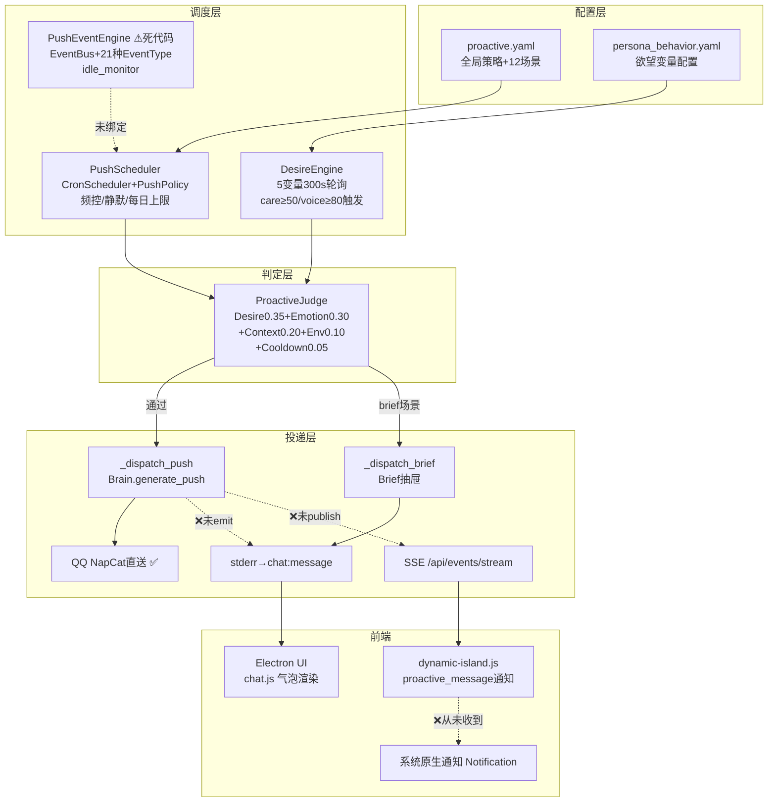
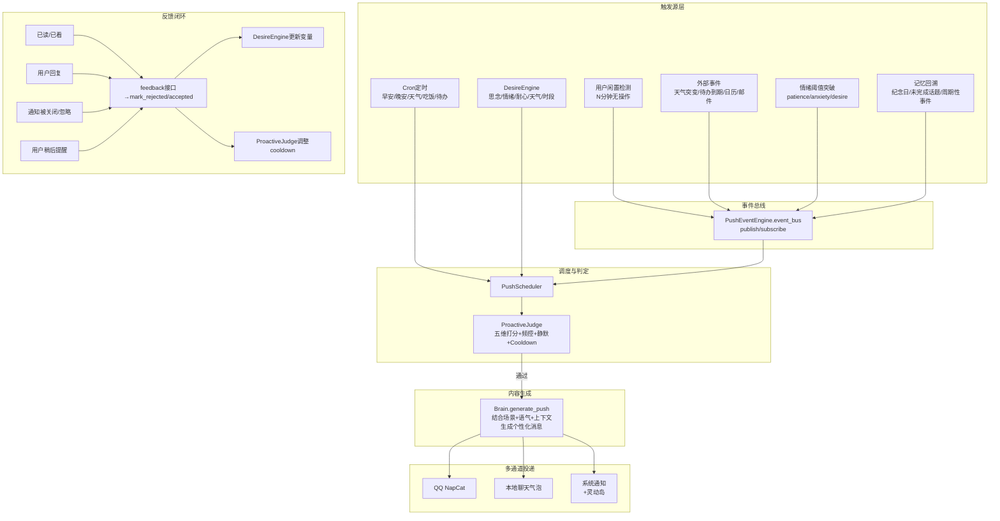
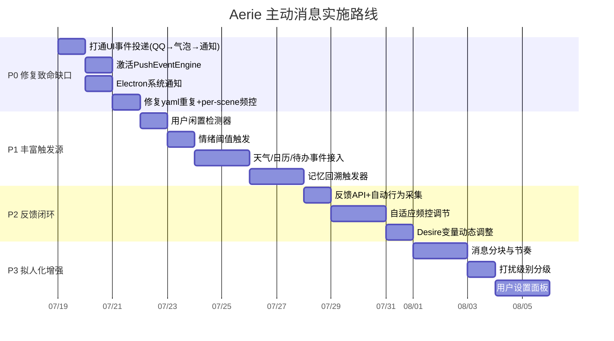

# Aerie Agent 主动发消息方案

> [!abstract] 一句话结论
> Aerie 项目**已经具备了一套相当完整的主动消息基础设施**（PushScheduler、ProactiveJudge、DesireEngine、双通道事件推送、Electron 灵动岛通知 UI），但存在三个致命问题：PushEventEngine 是死代码未启动、QQ 推送后不通知本地 UI、触发源单一（只有 cron 没有事件驱动）。最优方案不是引入外部框架重写，而是**激活现有引擎 + 补全事件源 + 打通多通道投递 + 增加用户反馈闭环**，投入最小、见效最快。

---

## 一、先回答"Agent 怎样才会主动找你"

人与人之间主动发消息的动机，可归纳为五类。Agent 的主动消息必须模拟这五类动机，否则就像定时闹钟一样机械。

| 主动动机 | 人类场景 | Agent 对应触发 |
|---|---|---|
| **时间驱动** | "早安""晚安""吃饭了吗""周末快乐" | Cron 定时场景（已有基础） |
| **关心/思念** | "好久没聊了，在干嘛？" | 用户长时间未活跃时的 idle_care（DesireEngine 已有，需激活） |
| **事件触发** | "下雨了记得带伞""你关注的球赛赢了""明天有会" | 外部事件：天气变化、日历提醒、待办到期、邮件到达（PushEventEngine 定义了但未接线） |
| **情感驱动** | 感觉你情绪不对想安慰、想分享开心事 | 情绪引擎阈值突破（emotion_engine 有阈值但未连触发） |
| **记忆回溯** | "上次你说的那个项目后来怎样了？""生日快乐！" | 长期记忆检索到纪念日、未完成话题、周期性事件（需新增记忆触发器） |

> [!tip] 核心原则
> 主动消息的最高境界是：**用户觉得"她刚好想到我"，而不是"系统设定了一个定时任务"**。这要求触发器必须多元、频控必须智能、内容必须个性化。

---

## 二、Aerie 现有主动消息架构盘点

### 2.1 已有模块（大部分可用）



### 2.2 关键文件

| 文件 | 职责 | 状态 |
|---|---|---|
| `config/proactive.yaml` | 全局频控策略 + 12个场景定义 | ✅ 配置完整 |
| `core/push_scheduler.py` | Cron 解析、频控、静默时段、热重载 | ✅ 核心可用 |
| `core/proactive_judge.py` | 五维权重打分门控 + 12种语气选择 | ✅ 逻辑完整 |
| `core/desire_engine.py` | 5变量轮询：思念/情绪/耐心/天气/时段+纪念日 | ✅ 引擎可工作 |
| `core/push_event_engine.py` | EventBus + 21种事件类型 + idle_monitor | ❌ **未启动，死代码** |
| `core/chat_events.py` | stderr [CHAT_EVENT] + SSE 双通道桥接 | ✅ 基础设施完整 |
| `core/event_stream.py` | SSE 订阅者队列 | ✅ 可用 |
| `core/companion.py` | 集成中枢：创建调度器/判定器/欲望引擎 | ⚠️ `_dispatch_push` 只发 QQ 不 emit UI |
| `electron/src/main.js` | stderr 解析 + SSE 代理 | ✅ 通道已建 |
| `electron/src/preload.js` | 暴露 onMessage/sse.subscribe API | ✅ 已暴露 |
| `electron/src/renderer/js/dynamic-island.js` | 已处理 `proactive_message` 事件 | ⚠️ 后端从未发出此事件 |

### 2.3 必须修复的三个致命缺口

> [!danger] 缺口 1：PushEventEngine 从未启动
> `companion.start()` 中没有调用 `engine.start()` 或 `bind_scheduler()`。虽然定义了 21 种事件类型（USER_ONLINE/IDLE_LONG/RAIN_ALERT/TODO_DUE/ANNIVERSARY 等），但没有任何地方 publish 事件，idle_monitor_loop 也从未运行。这意味着所有事件驱动型主动消息（除 cron 外）全部失效。

> [!danger] 缺口 2：QQ 推送后不通知本地 UI
> `companion._dispatch_push()` 调用 `qq.send_message()` 成功后，没有调用 `chat_events.emit()` 发送任何事件到前端。结果是：QQ 好友能收到主动消息，但本地聊天窗口看不到气泡，灵动岛不会弹通知，SSE 面板无记录。这是**最影响体验的 bug**。

> [!danger] 缺口 3：触发源单一，缺少事件驱动
> 目前真正工作的触发源只有 cron 定时和 DesireEngine 轮询。以下触发源均未接入：
> - 用户长时间未操作（idle monitor）
> - 天气变化（下雨/降温/极端天气）
> - 待办到期/日历事件
> - 情绪阈值突破
> - 纪念日/生日（从长期记忆或数据库读取）
> - 外部系统事件（邮件、新闻关注、系统状态）

### 2.4 次要问题

- `proactive.yaml` 中 `idle_care` 场景重复定义了两次，后者覆盖前者且丢失了 `custom_dispatcher="desire_care"` 配置。
- `emotion_comfort` 场景有 API 入口但内部事件链未闭合，情绪引擎阈值突破时不会自动触发。
- PushPolicy 只记录全局 `last_push_at` 和 `daily_count`，不记录 per-scene 最后发送时间，可能导致同一早安发两次。
- DesireEngine 变量配置依赖 `persona_behavior.yaml`，需确认变量是否配齐，否则 desire score 恒为 0。
- 用户反馈闭环缺失：用户点掉通知、已读不回、负面回复时，没有 API 回传 mark_rejected。

---

## 三、业界开源方案对比

### 3.1 调度层方案选择

| 方案 | 特点 | 是否适合 Aerie |
|---|---|---|
| **APScheduler（AsyncIOScheduler）** | Python 生态最成熟的定时任务框架，支持 cron/interval/date 三种触发器，支持 misfire grace、job store、持久化 | 功能强大但引入新依赖；Aerie 已有自实现 CronScheduler，功能覆盖够用 |
| **Celery Beat** | 分布式任务队列的定时组件，适合多进程/多机部署 | 过重，Aerie 是单进程桌面应用 |
| **asyncio.create_task + sleep loop（当前方案）** | 零依赖，每个 cron 场景独立协程，5s 分片支持 pause/resume | ✅ **已实现且工作正常**，与 asyncio 生态无缝集成 |
| **Rocketry** | 新兴声明式调度库，支持 asyncio | 社区小，不如 APScheduler 成熟 |
| **Timeloop** | 简单 interval 轮询 | 功能太弱，不支持 cron |

> [!success] 推荐
> **保留现有自实现 CronScheduler**，不引入 APScheduler。理由：
> 1. 当前实现已支持 cron 解析（分/时/日/月/周）、5s 分片 pause/resume（QQ 离线立即暂停）、热重载，覆盖核心需求。
> 2. 桌面单进程场景不需要 APScheduler 的 job store 持久化和分布式能力。
> 3. 引入新框架需重写调度层，投入产出比低。
> 4. 如果未来 cron 表达式复杂度增加（如 L/W/# 特殊字符），可再平滑迁移到 APScheduler。

### 3.2 事件总线方案

| 方案 | 特点 | Aerie 适配 |
|---|---|---|
| **当前 PushEventEngine（自研 EventBus）** | 单进程发布订阅，21 种 EventType 预定义，同步 dispatch | ✅ **已写好，直接启动即可** |
| **asyncio.Event** | Python 内置，仅支持布尔信号不能传数据 | 太简单 |
| **pyee（asyncio 版 EventEmitter）** | Node.js 风格的 EventEmitter，支持 async listener | 轻量但需新依赖，当前 EventBus 够用 |
| **Redis Pub/Sub 或 RabbitMQ** | 跨进程/跨机器消息 | 过重，桌面应用不需要 |
| **Blinker** | Flask 生态常用的信号库 | 同步为主，asyncio 支持弱 |

> [!success] 推荐
> **直接激活 PushEventEngine**，它已经定义了 EventBus 和 21 种事件类型，只需在 companion.start() 中启动并绑定事件源即可。

### 3.3 推送通道方案

| 通道 | 实现方式 | 适用场景 |
|---|---|---|
| **QQ NapCat WebSocket**（已有） | `qq.send_message()` | 用户在 QQ 端时的主投递通道 |
| **本地聊天窗口气泡**（需修复） | `chat_events.emit("assistant", ...)` → stderr → main.js → chat.js 渲染 | 用户在桌面端时必须同步显示 |
| **Electron 系统通知**（需接通） | `new Notification()` 在 main.js 或 renderer 触发 | 窗口最小化/后台运行时弹系统通知 |
| **灵动岛/动态弹窗**（已有UI） | `chat_events.emit("proactive_message", ...)` → SSE → dynamic-island.js | 不打扰主聊天流的轻提示 |
| **Windows 原生 Toast**（可选增强） | electron-windows-notifications 或 electron-notification | Windows 深度集成，支持按钮交互 |
| **声音/震动**（可选） | HTML5 Audio 或 Electron shell.beep | 强提醒场景 |

> [!success] 推荐
> **三条主通道必须全通**：QQ 直送 + 本地气泡 + 系统通知。灵动岛作为辅助层。

---

## 四、最优方案：激活 + 补全 + 闭环

### 4.1 方案总览



### 4.2 P0：修复致命缺口（预计 1-2 天）

这是让"Agent 能主动给你发消息"立刻可用的最小改动集。

#### 4.2.1 打通 UI 事件投递

修改 `core/companion.py` 的 `_dispatch_push()` 方法，在 QQ 发送成功后 emit 事件到前端：

```python
async def _dispatch_push(self, scene_name: str, tone_hint: str = None, force: bool = False):
    # ... 现有 Brain.generate_push() 逻辑 ...
    content = await self.brain.generate_push(
        scene=scene_name,
        tone=tone_hint or "warm",
        recent_context=self._get_recent_context(),
        user_state=self.desire_engine.get_state() if self.desire_engine else None,
    )
    if not content or not content.strip():
        return False

    sent = False
    # 1. QQ 投递（已有）
    if self.qq and self.qq.is_connected:
        try:
            await self.qq.send_message(content)
            sent = True
        except Exception:
            log.warning(f"QQ push failed for scene {scene_name}")

    # 2. ★ 新增：本地 UI 投递（气泡）
    from core.chat_events import emit
    emit("assistant", {
        "content": content,
        "source": "proactive",
        "scene": scene_name,
        "tone": tone_hint,
        "timestamp": time.time(),
    })

    # 3. ★ 新增：主动消息通知事件（灵动岛+系统通知）
    emit("proactive_message", {
        "content": content[:80] + ("..." if len(content) > 80 else ""),
        "scene": scene_name,
        "full_content": content,
        "timestamp": time.time(),
    })

    # 4. 更新频控记录
    self.push_scheduler.policy.record_push(scene_name)
    return True
```

#### 4.2.2 激活 PushEventEngine

在 `companion.start()` 中启动事件引擎并绑定调度器：

```python
async def start(self):
    # ... 现有启动逻辑 ...

    # ★ 新增：启动 PushEventEngine
    from core.push_event_engine import get_event_engine
    self.event_engine = get_event_engine()
    self.event_engine.bind_scheduler(self.push_scheduler)
    await self.event_engine.start()

    # 绑定事件源
    self._bind_event_sources()
```

新增 `_bind_event_sources()` 方法，在关键系统节点发布事件：

```python
def _bind_event_sources(self):
    # 用户发消息 → 记录活跃，publish USER_ACTIVE
    self.pipeline.on_user_message = lambda msg: (
        self.event_engine.publish("USER_ACTIVE", {"user_id": msg.user_id}),
        self.desire_engine.record_user_activity() if self.desire_engine else None,
    )
    # QQ 上线 → USER_ONLINE
    self.qq.on_logged_in = lambda: self.event_engine.publish("USER_ONLINE", {})
    # 天气变化 → WEATHER_CHANGE（由 brief_fetcher 或天气模块触发）
    # 待办到期 → TODO_DUE（由 todo_manager 触发）
    # 情绪阈值突破 → EMOTION_THRESHOLD（由 emotion_engine 触发）
```

#### 4.2.3 Electron 端弹系统通知

修改 `electron/src/main.js` 或 `dynamic-island.js`，收到 `proactive_message` 时弹系统通知：

```javascript
// main.js 中新增
ipcMain.on('proactive_notify', (event, { title, body, scene }) => {
  if (Notification.isSupported()) {
    const notif = new Notification({
      title: title || 'Aerie',
      body: body,
      icon: path.join(__dirname, '../builder/icon-white.png'),
      silent: false,
    });
    notif.on('click', () => {
      // 点击通知 → 打开/聚焦窗口 + 定位到消息
      const win = BrowserWindow.getAllWindows()[0];
      if (win) {
        win.show();
        win.focus();
        win.webContents.send('proactive_clicked', { scene });
      }
      notif.close();
    });
    notif.show();
  }
});
```

#### 4.2.4 修复 proactive.yaml 重复定义

删除 `proactive.yaml` 中第二处 `idle_care` 定义（约第99-103行），保留第一处（约第37-42行）带 `custom_dispatcher: "desire_care"` 的版本。

#### 4.2.5 新增 per-scene 频控记录

在 `PushPolicy` 中增加 `scene_last_sent: dict[str, float]`，在 `record_push(scene_name)` 中记录每个场景的最后发送时间，`can_send()` 中检查同一场景同一天不重复发送（cron 有多个触发时刻如6:30和7:30，6:30发了7:30就跳过）。

> [!check] P0 完成后效果
> - Cron 定时（早安/晚安/天气提醒/吃饭/待办）会同时发到 QQ 和本地聊天窗口。
> - 窗口在后台时系统会弹通知，点击可打开窗口。
> - DesireEngine 的"好久没聊"主动关心也会触发。
> - 不再出现 QQ 收到了但本地看不到的情况。

### 4.3 P1：丰富触发源（预计 3-5 天）

P0 解决"能不能发"，P1 解决"发得像不像真人"。

#### 4.3.1 用户闲置检测器

让 PushEventEngine 的 `idle_monitor_loop` 真正工作：

```python
async def idle_monitor_loop(self):
    """每60秒检查用户最后活跃时间"""
    while self._running:
        idle_minutes = (time.time() - self._last_user_active) / 60
        if idle_minutes >= self._idle_thresholds["care"]:  # 默认2-4小时
            self.publish("IDLE_LONG", {"idle_minutes": idle_minutes})
        elif idle_minutes >= self._idle_thresholds["check"]:  # 默认30分钟
            self.publish("IDLE_SHORT", {"idle_minutes": idle_minutes})
        await asyncio.sleep(60)
```

- IDLE_SHORT（30分钟-2小时）：不主动发消息，但 DesireEngine 的 patience_loss 变量开始累积。
- IDLE_LONG（2-4小时以上）：触发 idle_care 场景，发一条轻松关心（"在忙吗？别忘了休息~"）。
- IDLE_VERY_LONG（8小时以上且在白天）：发一条更自然的（"今天忙啥呢，都没见你说话"）。
- 深夜（23:30-07:00）不触发任何闲置消息（已有静默时段）。

#### 4.3.2 情绪阈值触发

在 `emotion_engine` 的阈值突破点（patience/anxiety/desire/tenderness 达到 HIGH 级别）publish 事件：

```python
# emotion_engine.py 中阈值突破时
if any(v >= THRESHOLD_HIGH for v in self.scores.values()):
    from core.push_event_engine import get_event_engine
    get_event_engine().publish("EMOTION_SPIKE", {
        "scores": self.scores.copy(),
        "trigger": max(self.scores, key=self.scores.get),
    })
```

场景映射：
- anxiety HIGH → 主动安慰（"感觉你有点焦虑，要不要聊聊？"）
- tenderness HIGH → 主动表达关心（"突然有点想你了"）
- patience 低（用户反复问同一问题） → 主动换角度解释

#### 4.3.3 天气/日历/待办事件接入

| 事件源 | 接入方式 | 触发场景 |
|---|---|---|
| 天气变化 | `brief_fetcher` 每次获取天气后对比上次，若有显著变化（降雨/降温≥5℃/极端天气）publish `WEATHER_ALERT` | rain_alert/weather_push |
| 待办到期 | `todo_manager` 在每分钟检查中发现 30 分钟内到期的待办 publish `TODO_DUE` | todo_remind |
| 日历事件 | `calendar_manager` 查询当天日程，早间 briefing 时提醒 | morning_brief |
| 纪念日 | 启动时和每天 0:00 扫描 memory/database 中记录的纪念日/生日，publish `ANNIVERSARY` | anniversary_greeting |

#### 4.3.4 记忆回溯触发器

新增 `MemoryTrigger` 模块，每天在合适时段（如晚间 20-22 点）随机从长期记忆中检索：

- 未完成的话题（用户上次提到但没聊完的事）
- 周期性事件（"上次你说每周三有例会"）
- 用户之前表达过关心的人/事（"你妈妈最近身体好些了吗"）

通过 LLM 判断"这个记忆现在提起是否自然"，打分通过则 publish `MEMORY_RECALL` 事件触发主动消息。

> [!warning] 记忆触发必须极度克制
> 记忆回溯型主动消息最容易让用户觉得"被监控"。建议：
> - 每天最多 1 次记忆触发消息。
> - 必须经过 LLM 自然度判定（不是每个记忆都适合主动提起）。
> - 用轻松随意的语气引入，不要像做访谈（"上次你说..." → "对了，你之前提到的那个..."）。

### 4.4 P2：反馈闭环与智能学习（持续迭代）

#### 4.4.1 用户反馈 API

新增 HTTP 接口：

```
POST /api/proactive/feedback
{
  "scene": "idle_care",
  "message_id": "...",
  "action": "read" | "replied" | "dismissed" | "liked" | "snoozed" | "muted_scene",
  "response_time_ms": 45000  // 用户多久后回复/关闭
}
```

前端行为自动采集：
- **read**：通知展示后 3 秒内未关闭（视为已读）
- **replied**：收到主动消息后用户发送了回复（最高正面信号）
- **dismissed**：用户点击关闭通知或划掉灵动岛提示
- **snoozed**：用户点击"稍后提醒"（需在通知上加按钮）
- **muted_scene**：用户在设置中关闭某类主动消息

#### 4.4.2 反馈驱动频控调节

```python
class AdaptivePolicy(PushPolicy):
    def __init__(self):
        super().__init__()
        self.scene_response_rates = {}  # scene → 回复率

    def can_send(self, scene):
        base_ok = super().can_send(scene)
        if not base_ok:
            return False

        rate = self.scene_response_rates.get(scene, 0.5)
        # 回复率低的场景自动降频
        if rate < 0.2:
            self.cooldowns[scene] = max(self.cooldowns.get(scene, 0), 3600 * 24)  # 冷却24h
        elif rate < 0.4:
            self.cooldowns[scene] = max(self.cooldowns.get(scene, 0), 3600 * 6)  # 冷却6h

        return True

    def record_feedback(self, scene, action):
        # 更新回复率统计（滑动窗口）
        ...
```

#### 4.4.3 DesireEngine 变量动态调整

- 用户 dismissed 连续 2 次 idle_care → care 变量累积速率减半。
- 用户对 voice_miss（晚间想聊天）回复率高 → 提高 voice 触发频率。
- 用户在某个时段（如下午3点）经常回复 → 增加该时段触发权重。

### 4.5 P3：高级拟人化（可选增强）

#### 4.5.1 消息分块与节奏

主动消息也应遵循拟人化节奏（参考[[Aerie 拟人化对话模式研究与优化方案]]）：

- 主动消息通常较短（1-3句），不像回答问题那样长篇大论。
- 重要提醒可先发一条短消息（"外面下雨了！"），隔 2-3 秒再补一条（"出门记得带伞哦~"）。
- 情感类消息可模拟"犹豫"（打字指示器出现→消失→再出现→发送），增加真实感。

#### 4.5.2 主动消息不应该总是"打扰"

设计三种主动消息打扰级别：

| 级别 | 投递方式 | 场景举例 |
|---|---|---|
| **静默** | 只在聊天窗口插入气泡，不弹通知、不发声 | 日常关心、分享类 |
| **通知** | 弹系统通知+灵动岛，有声音 | 天气预警、待办提醒、纪念日 |
| **紧急** | 通知+声音+可能置顶 | 极端天气、重要日程（需用户配置） |

默认所有主动消息为"静默"或"通知"级别，"紧急"需用户手动开启。

#### 4.5.3 用户可控的主动消息设置面板

在认知面板或设置中增加：

- 主动消息总开关
- 各场景独立开关（早安/晚安/天气/关心/待办/纪念日/记忆回溯）
- 每日上限调整（1-10条，默认3-5条）
- 静默时段自定义（默认23:30-07:00）
- "勿扰模式"一键关闭所有主动消息1小时/3小时/直到明天
- "想她了"按钮：主动让 Agent 发一条消息过来（测试/互动）

---

## 五、实施路线图



---

## 六、关键参数配置建议

建议在 `config/proactive.yaml` 中调整以下参数：

| 参数 | 当前值 | 建议值 | 说明 |
|---|---|---|---|
| `max_per_day` | 5 | **3-5**（用户可调节） | 每天主动消息上限，过多即骚扰 |
| `min_interval` | 30min | **60min**（同一场景），**30min**（不同场景） | 同一场景至少间隔1小时 |
| `quiet_hours` | 23:30-07:00 | **23:00-08:00**（可配置） | 静默时段延长，避免深夜打扰 |
| `idle_care_threshold` | 未配置 | **3小时**（默认） | 多久不聊天触发关心 |
| `idle_care_max_per_day` | 未配置 | **1次** | 每天最多1次"好久没聊" |
| `desire.tick_seconds` | 300s | **120s** | 欲望引擎检测频率提高到2分钟 |
| `emotion_comfort_cooldown` | 未配置 | **4小时** | 情绪安慰不超过每4小时1次 |
| `memory_recall_max_per_day` | 未配置 | **1次** | 记忆回溯极度克制 |
| `weather_alert_cooldown` | 未配置 | **6小时** | 同类天气提醒不重复发 |

---

## 七、测试验收标准

### P0 验收用例

- [ ] 早上 7:30 cron 触发 morning_brief，QQ 收到消息的同时，本地聊天窗口出现气泡，灵动岛有提示。
- [ ] 窗口最小化时收到主动消息，Windows 弹出系统通知，点击通知打开窗口并定位到消息。
- [ ] DesireEngine 累积 care≥50 时触发 idle_care，消息自然不死板。
- [ ] 同一天早安不会发两次（6:30 发了 7:30 自动跳过）。
- [ ] QQ 离线时主动消息暂停推送，QQ 上线后恢复（不补推过期内容）。
- [ ] 23:30-07:00 静默时段不触发任何主动消息（boot_greeting 除外）。

### P1 验收用例

- [ ] 用户连续 3 小时不发消息，Agent 发一条轻松关心消息。
- [ ] 检测到降雨/降温时，出门前发天气提醒。
- [ ] 待办事项到期前 30 分钟提醒。
- [ ] 用户情绪焦虑时（连续负面消息），Agent 主动询问是否需要聊聊。
- [ ] 纪念日/生日当天 0 点或早晨发祝福消息。

### P2 验收用例

- [ ] 用户连续 2 次关闭通知，同类消息自动降频。
- [ ] 用户积极回复某类主动消息（如晚间聊天），该类消息频率适当提升。
- [ ] "勿扰模式"开启期间所有主动消息静默。
- [ ] 用户在设置中关闭某场景后，该场景不再触发。

### 拟人化验收

> [!success] 核心指标
> 用户在使用一周后，被问到"这些主动消息中，哪些你觉得是定时任务发的？"时，无法准确分辨超过 50%。

---

## 八、风险与避坑

> [!danger] 最大风险：骚扰感
> 主动消息是把双刃剑。恰到好处是"她在乎我"，多一条就是"烦"。宁可少发不可多发。宁可用户觉得"她怎么不找我"也不要让用户觉得"她怎么老烦我"。

**避坑清单**：

1. **不要每轮对话后都加主动追问**——任务完成就收尾，自然淡出。
2. **不要在用户忙的时候发**——检测到用户正在打字/刚发完消息的 10 分钟内不触发主动消息。
3. **不要连续发两条主动消息不等回复**——发了一条后必须等用户回复或至少间隔 2 小时才能发下一条非紧急消息。
4. **不要发无内容的"在吗""嗨"**——主动消息必须有具体内容或理由。
5. **不要假装秒回**——主动消息也应该有思考延迟（0.5-2秒），不要瞬间弹出。
6. **不要在错误的情绪下发错内容**——用户刚表达完悲伤，Agent 不应发"今天天气真好~"。情绪状态必须参与判定。
7. **不要所有场景都开**——默认只开早安/晚安/天气/待办/闲置关心，记忆回溯和情感触发默认关闭或极低频率，让用户逐步开启。
8. **不要忘了给用户"关掉"的权利**——每个场景都能单独关闭，设置面板入口明显。

---

## 九、关联资料

- [[Aerie 拟人化对话模式研究与优化方案]]
- [[Aerie 不受限制对话模式二次开发方案]]
- [[聊天系统升级]]
- [[长期记忆架构]]
- [[欲望引擎设计]]
- [[情绪引擎设计]]

%%
本方案的核心思路是"不重写、只激活"：Aerie 已有的 PushScheduler + ProactiveJudge + DesireEngine + PushEventEngine + chat_events 双通道 + Electron 灵动岛构成了一套几乎完整的主动消息系统，主要问题是模块之间的接线没接好。修复接线、补全触发源、加反馈闭环，即可在最小改动下获得"Agent 主动找你聊天"的能力。
%%
