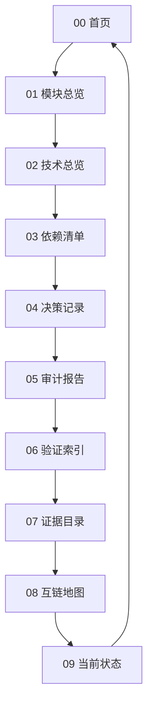

# 00-首页

这里是 Aerie 第三次修正计划的独立 Obsidian Vault 总入口，用于沉淀模块、技术、依赖、决策、审计、验证、证据与当前状态摘要。

> [!info] 使用方式
> 从本页进入各类总览；每个页面都保留返回首页与下一跳链接，形成可巡航、可审计、可回溯的知识闭环。

> [!note] 当前对齐
> 本 Vault 对齐 [[04_决策记录#决策索引]] 中的知识库落地决策，并与 [03_第三次修正计划知识库更新机制.md](../documents/第三次修正计划/03_第三次修正计划知识库更新机制.md) 保持同步。
> 当前阶段执行真源为 [01_第三次修正计划.md](../documents/第三次修正计划/01_第三次修正计划.md)。

## 核心入口

- [[01_模块总览|模块总览]]：记录知识库模块、边界、职责与当前空位。
- [[02_技术总览|技术总览]]：记录第三次修正计划的技术事实、约束与待核验项。
- [[03_依赖清单|依赖清单]]：记录计划、代码、工具与外部服务依赖。
- [[04_决策记录|决策记录]]：记录已采纳的知识库与架构决策。
- [[05_审计报告|审计报告]]：记录审计范围、发现、等级与修复建议。
- [[06_验证索引|验证索引]]：记录验证命令、结果、覆盖缺口与证据关联。
- [[07_证据目录|证据目录]]：记录原始证据、路径、摘要与校验信息。
- [[08_互链地图|互链地图]]：查看本 Vault 的知识回路与导航路径。
- [[10_模块依赖关系图|模块依赖关系图]]：core 模块真实 import 依赖图谱（命名/收敛改造的事实基线）。
- [[11_统一命名与模块收敛改造计划|统一命名与模块收敛改造计划]]：命名规范、模块收敛、现状达标评估与推进顺序。

## 核心概念入口

| 概念 | 类型 | 实现链接 | 依赖链接 | 风险/决策链接 | 验证链接 |
| --- | --- | --- | --- | --- | --- |
| [[dependencies/Echo-Emotional-Value|Echo情绪价值]] | 依赖/产品输入 | [[matrices/Function-To-Implementation#Echo-情绪价值映射]] | [[dependencies/Echo-Emotional-Value#依赖关系]] | [[risks/Unresolved-Risks#R-TC-001：范围膨胀破坏-P0-闭环]] | [[06_验证索引#核心概念链接验证]] |
| [[modules/AttachmentEnvelope]] | 模块 | [[modules/AttachmentEnvelope#实现入口]] | [[dependencies/Internal-Attachment-Pipeline]] | [[risks/Unresolved-Risks#R-TC-007：附件旧新路径继续分裂]] | [[06_验证索引#P0-功能验证]] |
| [[modules/ImageObservation]] | 模块 | [[modules/ImageObservation#实现入口]] | [[technology/VLM-OCR-Provider]] | [[risks/Unresolved-Risks#R-TC-008：图片观察污染长期记忆]] | [[06_验证索引#P0-功能验证]] |
| [[modules/VisualIntentRouter]] | 模块 | [[modules/VisualIntentRouter#实现入口]] | [[modules/ImageObservation]] | [[risks/Unresolved-Risks#R-TC-003：真实模型调用泄露隐私或产生成本]] | [[06_验证索引#P0-功能验证]] |
| [[modules/DesktopSurfaceAdapter]] | 模块 | [[modules/DesktopSurfaceAdapter#实现入口]] | [[dependencies/Pyisland-eIsland-Desktop-Touch]] | [[risks/Unresolved-Risks#R-TC-006：Pyisland-helper-直接移植带来许可和安全问题]] | [[06_验证索引#功能点与技术方案矩阵验证]] |
| [[modules/KnowledgeBase|专用向量知识库]] | 模块/技术 | [[modules/KnowledgeBase#实现入口]] | [[technology/Dedicated-Vector-Knowledge]] | [[risks/Unresolved-Risks#R-TC-005：外部向量库引入不可控依赖]] | [[06_验证索引#P0-功能验证]] |
- [[09_当前状态|当前状态]]：汇总四份参考文档、已修复、遗留、技术债、测试副作用与禁止触碰边界。

## 四份参考摘要

| 参考文档 | 核心摘要 | 详情 |
| --- | --- | --- |
| [Aerie 桌面端完整能力修复与全量审计计划.md](../documents/Aerie%20桌面端完整能力修复与全量审计计划.md) | 桌面端仍不能按“全部正常”验收，P0 聚焦启动健康、统一身份、PAD、长历史、附件、World、Electron 审计与 QQ 连接边界 | [[09_当前状态#四份参考文档]] |
| [修复_History.md](../documents/修复_History.md) | 已记录隔离工作树、统一接线、PAD/附件/World/QQ/数据隔离等修复推进与测试副作用 | [[09_当前状态#已修复]] |
| [Echo情绪价值调研与Aerie结合方案.md](../documents/Echo情绪价值调研与Aerie结合方案.md) | Echo 的可借鉴价值是角色主体、关系记忆、主动触达、图片生活流和低压力陪伴表达，Aerie 应接入现有 Agent 底座 | [[09_当前状态#遗留问题]] |
| [Echo-Pyisland-Aerie统一融合实施方案.md](../documents/Echo-Pyisland-Aerie统一融合实施方案.md) | 统一架构应共享事件、状态、附件和工具底座，先修 UTF-8、Artifact、ImageObservation 与 VisualIntentRouter | [[09_当前状态#技术债]] |

## 快速巡航

## 当前状态

| 项目 | 状态 | 维护入口 |
| --- | --- | --- |
| 模块盘点 | 初始骨架 | [[01_模块总览#模块清单]] |
| 技术栈梳理 | 初始骨架 | [[02_技术总览#技术栈清单]] |
| 依赖核验 | 初始骨架 | [[03_依赖清单#依赖总表]] |
| 架构决策 | 已建立索引 | [[04_决策记录#决策索引]] |
| 核心概念互链 | 已补齐六个核心概念 | [[08_互链地图#核心概念回路]] |
| 功能技术矩阵 | 已建立 | [[matrices/Function-To-Implementation]] |
| 审计发现 | 已补充核心概念风险发现 | [[05_审计报告#核心概念风险发现]] |
| 验证证据 | 已建立文档验证入口 | [[06_验证索引#核心概念链接验证]] |
| 当前状态摘要 | 已补齐四份参考文档与边界 | [[09_当前状态]] |
| 第三次修正计划 | 已创建 | [01_第三次修正计划.md](../documents/第三次修正计划/01_第三次修正计划.md) |

## 待办

- [ ] 补齐模块边界与负责人。
- [ ] 补齐技术栈版本、启动方式与部署路径。
- [ ] 对依赖进行许可、版本、安全与维护状态核验。
- [ ] 将关键技术取舍沉淀为 ADR。
- [ ] 建立每项审计发现到验证证据的双向链接。
- [x] 同步四份参考文档摘要、当前状态、已修复、遗留、技术债和禁止触碰边界。

## 互链

- 下一页：[[01_模块总览]]
- 闭环页：[[08_互链地图]]
- 当前状态：[[09_当前状态]]
- 计划机制：[[04_决策记录]]
- 阶段计划：[01_第三次修正计划.md](../documents/第三次修正计划/01_第三次修正计划.md)
- 改造路线：[[11_统一命名与模块收敛改造计划]]
