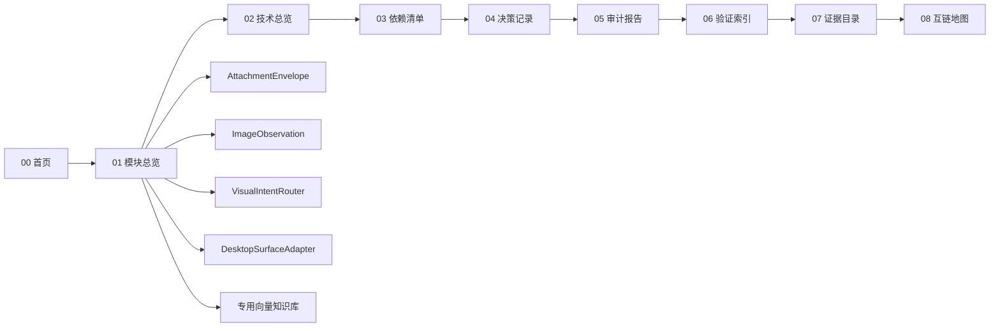

# 01-模块总览

本页用于记录 Aerie 第三次修正计划知识库中的模块、职责边界、交互关系与风险区域，作为 [[05_审计报告]] 与 [[06_验证索引]] 的结构化入口。

## 模块清单

| 模块 | 职责 | 输入 | 输出 | 关键文件/入口 | 状态 | 关联验证 |
| --- | --- | --- | --- | --- | --- | --- |
| [[00_首页|首页入口]] | 总览与导航中枢 | 用户入口 | 下游索引 | [[00_首页]] | 已建立 | [[06_验证索引#验证矩阵]] |
| [[04_决策记录|决策记录]] | 维护 ADR 与取舍依据 | 审计发现、计划变更 | 决策索引 | [[04_决策记录]] | 已建立 | [[06_验证索引#验证矩阵]] |
| [[05_审计报告|审计报告]] | 汇总发现与风险 | 模块、技术、依赖、验证 | 审计结论 | [[05_审计报告]] | 已建立 | [[06_验证索引#验证矩阵]] |
| [[06_验证索引|验证索引]] | 汇总验证命令与结果 | 测试、检查、人工验证 | 证据索引 | [[06_验证索引]] | 已建立 | [[07_证据目录]] |
| [[07_证据目录|证据目录]] | 管理原始证据材料 | 日志、截图、输出、报告 | 证据索引 | [[07_证据目录]] | 已建立 | [[06_验证索引]] |

## 核心概念模块

| 模块 | 职责 | 实现入口 | 依赖 | 风险/决策 | 验证 |
| --- | --- | --- | --- | --- | --- |
| [[modules/AttachmentEnvelope]] | 统一附件事实源与 Artifact 边界 | [[modules/AttachmentEnvelope#实现入口]] | [[dependencies/Internal-Attachment-Pipeline]] | [[risks/Unresolved-Risks#R-TC-007：附件旧新路径继续分裂]] | [[06_验证索引#P0-功能验证]] |
| [[modules/ImageObservation]] | 结构化图片理解与记忆准入边界 | [[modules/ImageObservation#实现入口]] | [[technology/VLM-OCR-Provider]] | [[risks/Unresolved-Risks#R-TC-008：图片观察污染长期记忆]] | [[06_验证索引#P0-功能验证]] |
| [[modules/VisualIntentRouter]] | 主动图片意图分类与参考资产控制 | [[modules/VisualIntentRouter#实现入口]] | [[modules/ImageObservation]] | [[risks/Unresolved-Risks#R-TC-003：真实模型调用泄露隐私或产生成本]] | [[06_验证索引#P0-功能验证]] |
| [[modules/DesktopSurfaceAdapter]] | 桌面状态、动态岛与安全动作适配 | [[modules/DesktopSurfaceAdapter#实现入口]] | [[dependencies/Pyisland-eIsland-Desktop-Touch]] | [[risks/Unresolved-Risks#R-TC-006：Pyisland-helper-直接移植带来许可和安全问题]] | [[06_验证索引#功能点与技术方案矩阵验证]] |
| [[modules/KnowledgeBase|专用向量知识库]] | 语义检索知识底座与连接尝试 | [[modules/KnowledgeBase#实现入口]] | [[technology/Dedicated-Vector-Knowledge]] | [[risks/Unresolved-Risks#R-TC-005：外部向量库引入不可控依赖]] | [[06_验证索引#P0-功能验证]] |
| [[modules/QQMediaPipeline|QQ 多媒体管道]] | QQ 语音转写 + 表情包理解 + 出站收藏表情 | [[modules/QQMediaPipeline#4. 关键文件 / 实现入口]] | [[dependencies/Internal-Attachment-Pipeline]] | 入站/出站每层独立降级，不阻塞主回复 | [[06_验证索引#P0-功能验证]] |
| [[modules/ChatPhotoTriggerChain|Chat 出图触发链]] | 用户主动要图时聊天触发真实生图并落地聊天页 | [[modules/ChatPhotoTriggerChain#链路总览]] | [[modules/VisualIntentRouter]]、[[modules/ImageObservation]] | R-TC-003、R-TC-008 | [[06_验证索引#P0-功能验证]] |

## 模块关系

## 边界原则

- 单一职责：每个模块只承担一种主要知识角色。
- 单向依赖：导航、决策、审计、验证、证据按顺序递进。
- 可验证性：每个模块至少对应一个验证项与一个证据入口。
- 可替换性：外部资料与计划文档保留链接层，避免知识碎片失联。

## 风险关注

| 风险 | 表现 | 影响 | 关联页面 |
| --- | --- | --- | --- |
| 模块耦合 | 概念页互相直接堆叠内容 | 修改成本上升 | [[05_审计报告#发现列表]] |
| 隐式依赖 | 计划、决策、证据未做反链 | 复现困难 | [[03_依赖清单#外部服务]] |
| 验证缺口 | 模块无测试或无证据 | 回归风险 | [[06_验证索引#覆盖缺口]] |

## 补充模板

> [!note] 使用说明
> 新增模块时复制此模板并填写，落定后无需保留模板占位。当前 7 个核心概念模块（含 [[modules/ChatPhotoTriggerChain|ChatPhotoTriggerChain]]）均已用本模板建页。

### 模块：待命名

- 职责：
- 非职责：
- 上游：
- 下游：
- 数据：
- 风险：
- 验证：[[06_验证索引]]
- 证据：[[07_证据目录]]

## 互链

- 上一页：[[00_首页]]
- 下一页：[[02_技术总览]]
- 支撑页：[[03_依赖清单]]、[[05_审计报告]]、[[06_验证索引]]
- 经验复用：[[故障经验库-Troubleshooting-Playbook]]
