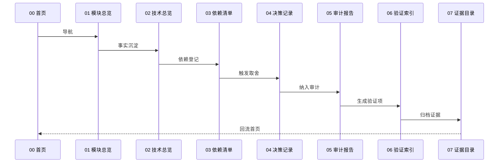

# 02-技术总览

本页用于沉淀 Aerie 第三次修正计划相关的技术事实、运行环境、架构机制、数据流与工程约束，并为 [[03_依赖清单]] 和 [[04_决策记录]] 提供事实基础。

## 技术栈清单

| 层级 | 技术/框架 | 版本 | 用途 | 约束 | 关联依赖 |
| --- | --- | --- | --- | --- | --- |
| 运行时 | Electron / Python | 待核验 | 桌面端与脚本执行 | 需要保持启动链路可复现 | [[03_依赖清单#依赖总表]] |
| 前端 | Obsidian Markdown / Vite 页面 | 待核验 | 知识入口与展示 | 双向链接必须稳定 | [[03_依赖清单#前端依赖]] |
| 后端 | Python 服务层 | 待核验 | 计划、验证与证据处理 | 不记录明文密钥 | [[03_依赖清单#后端依赖]] |
| 数据 | 本地文件与工作目录 | 待核验 | 文档、日志、验证产物 | 路径必须可追溯 | [[03_依赖清单#数据依赖]] |
| 工具链 | Git / 测试脚本 / 审计文档 | 待核验 | 生成、验证、追踪 | 命令输出必须可复查 | [[03_依赖清单#工具链依赖]] |

## 核心技术笔记

| 技术 | 支撑概念 | 实现入口 | 依赖 | 风险/决策 | 验证 |
| --- | --- | --- | --- | --- | --- |
| [[technology/VLM-OCR-Provider]] | [[modules/ImageObservation]] | [image_service.py](file:///e:/Agent_reply/core/image_service.py) | VLM/OCR provider | [[risks/Unresolved-Risks#R-TC-003：真实模型调用泄露隐私或产生成本]] | [[06_验证索引#P0-功能验证]] |
| [[technology/Dedicated-Vector-Knowledge]] | [[modules/KnowledgeBase|专用向量知识库]] | [long_permanent.py](file:///e:/Agent_reply/memory/layers/long_permanent.py)、[brain.py](file:///e:/Agent_reply/core/brain.py) | embedding provider、ChromaDB 候选 | [[risks/Unresolved-Risks#R-TC-005：外部向量库引入不可控依赖]] | [[06_验证索引#P0-功能验证]] |
| Electron 动态岛与桌面 IPC | [[modules/DesktopSurfaceAdapter]] | [main.js](file:///e:/Agent_reply/electron/src/main.js)、[dynamic-island.js](file:///e:/Agent_reply/electron/src/renderer/js/dynamic-island.js) | [[dependencies/Pyisland-eIsland-Desktop-Touch]] | [[risks/Unresolved-Risks#R-TC-006：Pyisland-helper-直接移植带来许可和安全问题]] | [[06_验证索引#功能点与技术方案矩阵验证]] |
| 附件 worker 与 Artifact 边界 | [[modules/AttachmentEnvelope]] | [attachment_worker_runtime.py](file:///e:/Agent_reply/core/attachment_worker_runtime.py) | [[dependencies/Internal-Attachment-Pipeline]] | [[risks/Unresolved-Risks#R-TC-007：附件旧新路径继续分裂]] | [[06_验证索引#P0-功能验证]] |

## 架构机制

- 启动链路：先进入首页，再串联模块、技术、依赖、决策、审计、验证与证据。
- 配置加载：以 Vault frontmatter、计划文档和计划任务为主要配置源。
- 事件流/消息流：以审计发现、验证结果和证据登记为主线。
- 持久化策略：知识以 Markdown 页面保存，证据以路径与摘要保存。
- 错误处理：缺项标记为待核验，不以猜测替代事实。
- 权限与安全边界：不写入密钥、不伪造证据、不隐藏失败记录。

## 数据流

## 工程约束

| 约束 | 原因 | 影响 | 决策记录 |
| --- | --- | --- | --- |
| 双向链接优先 | 知识要可回溯 | 降低断链风险 | [[04_决策记录#决策索引]] |
| 证据优先 | 结论必须可复核 | 不能只留摘要 | [[04_决策记录#决策索引]] |
| 不写密钥 | 安全边界要求 | 防止泄漏 | [[04_决策记录#决策索引]] |

## 技术债观察

- 待观察：概念页若出现单向引用，需要补齐反向链接。
- 待观察：计划、决策、验证三类文档若分散，需要合并索引。
- 待观察：证据若只存在于聊天记录，必须迁移到目录页。

## 互链

- 上一页：[[01_模块总览]]
- 下一页：[[03_依赖清单]]
- 决策来源：[[04_决策记录]]
- 审计入口：[[05_审计报告]]
