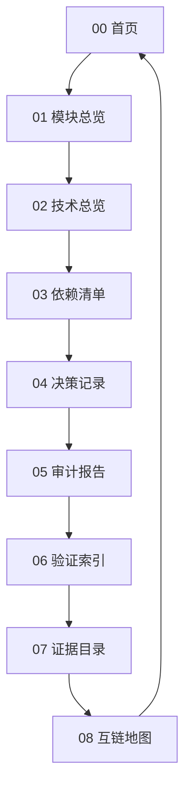

# 08-互链地图

本页用于确认 Aerie 第三次修正计划 Vault 的内部导航闭环，确保首页、模块、技术、依赖、决策、审计、验证与证据之间形成稳定回路。

## 主回路

## 计划锚点

- [01_第三次修正计划.md](../documents/第三次修正计划/01_第三次修正计划.md)：定义四阶段目标、任务、资源、交付物和量化验证标准。
- [03_第三次修正计划知识库更新机制.md](../documents/第三次修正计划/03_第三次修正计划知识库更新机制.md)：定义更新规则与同步边界。
- [02_第三次修正计划决策记录.md](../documents/第三次修正计划/02_第三次修正计划决策记录.md)：承接关键决策与回写要求。
- [[04_决策记录]]：记录当前 Vault 的可执行 ADR 索引。

## 横向索引

| 起点 | 关键关联 | 目标 |
| --- | --- | --- |
| [[01_模块总览]] | 模块边界支撑技术选型 | [[02_技术总览]] |
| [[02_技术总览]] | 技术栈落入依赖台账 | [[03_依赖清单]] |
| [[03_依赖清单]] | 依赖风险触发决策 | [[04_决策记录]] |
| [[04_决策记录]] | 决策约束进入审计 | [[05_审计报告]] |
| [[05_审计报告]] | 发现需要验证闭环 | [[06_验证索引]] |
| [[06_验证索引]] | 验证结果沉淀证据 | [[07_证据目录]] |
| [[07_证据目录]] | 证据反哺首页总览 | [[00_首页]] |

## 核心概念回路

| 概念 | 实现 | 依赖 | 风险/决策 | 验证 |
| --- | --- | --- | --- | --- |
| [[dependencies/Echo-Emotional-Value|Echo情绪价值]] | [[matrices/Function-To-Implementation#Echo-情绪价值映射]] | [[dependencies/Echo-Emotional-Value#依赖关系]] | [[risks/Unresolved-Risks#R-TC-001：范围膨胀破坏-P0-闭环]] | [[06_验证索引#功能点与技术方案矩阵验证]] |
| [[modules/AttachmentEnvelope]] | [[modules/AttachmentEnvelope#实现入口]] | [[dependencies/Internal-Attachment-Pipeline]] | [[risks/Unresolved-Risks#R-TC-007：附件旧新路径继续分裂]] | [[06_验证索引#P0-功能验证]] |
| [[modules/ImageObservation]] | [[modules/ImageObservation#实现入口]] | [[technology/VLM-OCR-Provider]] | [[risks/Unresolved-Risks#R-TC-008：图片观察污染长期记忆]] | [[06_验证索引#P0-功能验证]] |
| [[modules/VisualIntentRouter]] | [[modules/VisualIntentRouter#实现入口]] | [[modules/ImageObservation]] | [[risks/Unresolved-Risks#R-TC-003：真实模型调用泄露隐私或产生成本]] | [[06_验证索引#P0-功能验证]] |
| [[modules/DesktopSurfaceAdapter]] | [[modules/DesktopSurfaceAdapter#实现入口]] | [[dependencies/Pyisland-eIsland-Desktop-Touch]] | [[risks/Unresolved-Risks#R-TC-006：Pyisland-helper-直接移植带来许可和安全问题]] | [[06_验证索引#功能点与技术方案矩阵验证]] |
| [[modules/KnowledgeBase|专用向量知识库]] | [[modules/KnowledgeBase#实现入口]] | [[technology/Dedicated-Vector-Knowledge]] | [[risks/Unresolved-Risks#R-TC-005：外部向量库引入不可控依赖]] | [[06_验证索引#P0-功能验证]] |

## 反向追踪

- 从证据追踪验证：[[07_证据目录]] → [[06_验证索引]]
- 从验证追踪审计：[[06_验证索引]] → [[05_审计报告]]
- 从审计追踪决策：[[05_审计报告]] → [[04_决策记录]]
- 从决策追踪依赖：[[04_决策记录]] → [[03_依赖清单]]
- 从依赖追踪技术：[[03_依赖清单]] → [[02_技术总览]]
- 从技术追踪模块：[[02_技术总览]] → [[01_模块总览]]
- 从模块返回首页：[[01_模块总览]] → [[00_首页]]

## 完整性检查

- [ ] 每个页面都有返回首页路径。
- [ ] 每个审计发现都有验证项。
- [ ] 每个验证项都有证据入口。
- [ ] 每个关键技术取舍都有 ADR。
- [ ] 每个依赖风险都有维护策略。
- [x] 六个核心概念均已建立实现、依赖、风险/决策、验证四类链接。
- [x] 功能点与技术方案矩阵已建立并回链模块、技术、依赖、风险和验证。

## 初始结论

- 00-08 页面已形成最小闭环，适合作为第三次修正计划的知识入口。
- 后续新增内容应优先回填到对应页，而不是堆积在首页。
- 若新增页面，先补横向索引，再补内容。

## 互链

- 上一页：[[07_证据目录]]
- 回到首页：[[00_首页]]
- 起点：[[01_模块总览]]
- 阶段计划：[01_第三次修正计划.md](../documents/第三次修正计划/01_第三次修正计划.md)
