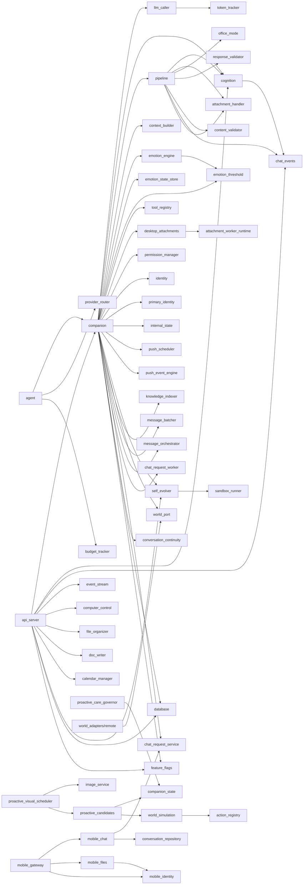

# 10-模块依赖关系图

本页基于 `core/*.py` 中真实的 `from core.X import ...` / `import core.X` 语句测绘（证据：扫描 `e:\Agent_reply\core` 目录），**不是**靠读代码意图猜的。目标是把 [[01_模块总览]] 里的概念落到真实 import 边，作为 [[11_统一命名与模块收敛改造计划]] 的事实基线。

> [!info] 统计口径
> 只统计 **core 内部** 的 import 边（即 `from core.*`）。对外部库、`main.py`、`api_server.py` 的路由注册不算在内。证据来源：`core/` 全目录 `from core` 扫描。

---

## 依赖中枢（被广泛引用的核心）

以下是 **被其他模块 import 次数** 最多的"依赖中枢"模块，改动它们影响面最大：

| 模块 | 被谁引用 | 角色 |
| --- | --- | --- |
| `core.companion` | `agent.py`、`api_server.py` | 全局门面（引用了约 30 个模块） |
| `core.chat_events` / `event_contracts` | `api_server`、`cognition`、`pipeline`、`companion`、`self_evolver` | SSE 事件总线 |
| `core.ids` | `chat_request_service`、`companion`、`desktop_attachments`、`event_contracts`、`identity/repository`、`conversation_repository`、`mobile_chat`、`pipeline` | ID 生成 |
| `core.paths` | `brief_fetcher`、`companion_state`、`desire_engine`、`location_resolver`、`primary_identity`、`push_scheduler`、`world_image_candidates` | 数据目录/路径 |
| `core.feature_flags` | `api_server`、`companion`、`database`、`mobile_gateway`、`pipeline` | 功能开关 |
| `core.chat_request_repository` | `chat_request_service`、`chat_request_worker`、`companion`、`mobile_chat`、`pipeline` | 聊天请求队列 |
| `core.cognition` | `api_server`、`companion`、`pipeline` | 认知引擎（9 阶段决策） |
| `core.database` | `api_server`、`companion` | SQLite 持久化 |
| `core.conversation_repository` | `chat_request_service`、`companion`、`conversation_continuity`、`mobile_chat` | 对话仓库 |

## 叶子模块（几乎不被他人依赖）

以下模块在 `core` 内部 **没有** 被其他模块 import，多为独立能力或仅被外部入口/定时任务/测试调用：

- `core.llm_caller`（原 `core.brain`，仅被 `companion` 引用）——LLM 多 Provider 调用层，P1 已改名
- `core.clone_voice_service`、`core.voice_service`、`core.sticker_gate`
- `core.doc_writer`、`core.file_organizer`（仅被 `api_server` 注册路由）
- `core.calendar_manager`、`core.weather_service`、`core.location_resolver`
- `core.sandbox_runner`、`core.tool_isolation`、`core.self_evolve_l4`
- `core.screen_tools`、`core.screen_action_sanitizer`、`core.computer_control`（仅被 `api_server`/`companion` 引用）
- `core.napcat_launcher`（仅被 `api_server` 引用）
- `core.prompt_injection`（被 `self_evolve_l4` 及 `tests/e2e/` 引用，有完整测试，非死代码）

> [!warning] 勘误
> 早期扫描曾把 `reasoning_engine`、`nlp_analyzer`、`semantic_cortex`、`llm_router` 等列为"疑似未接线叶子模块"。**这些文件在本仓库 core/ 中并不存在**，属于自动扫描工具产生的幻觉。`prompt_injection` 则真实存在且有测试覆盖。

## 真实 Import 依赖图（Mermaid）

## 依赖关系小结

1. **`companion` 是超级门面（God Module）**：一个文件 import 了约 30 个模块，几乎所有能力都在它这里装配。它是最大的耦合点，也是理解系统的唯一入口。
2. **事件总线穿透全链**：`chat_events` / `event_contracts` 被 api_server、cognition、pipeline、companion、self_evolver 共同引用，属于横向基础设施。
3. **`ids`、`paths`、`feature_flags` 是纯工具层**：被广泛复用，职责清晰，是健康模块的样板。
4. **附件链路新旧并存（服务于不同模式）**：`desktop_attachments`（新服务，被 companion 用）+ `attachment_worker_runtime`（其 worker）+ `attachment_handler`（旧 `extract_markdown`）。**pipeline 已接入新服务**，遗留 `extract_markdown` 兜底（pipeline L26/L1116、api_server L1301）服务于**非队列回滚路径**（`chat_request_queue_v1=false` 时恢复旧同步路径），**非死代码、暂不删除**。详见 [[11_统一命名与模块收敛改造计划#2.1-附件链路（P0-—-复核后结论：暂不删除，仅记录）|改造计划 2.1]]。

## 互链

- 上游：[[01_模块总览]]、[[02_技术总览]]
- 下游：[[11_统一命名与模块收敛改造计划]]
- 审计：[[05_审计报告]]
