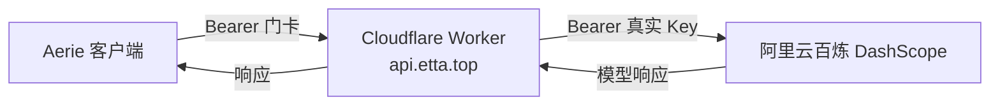

# AI API 中转网关（Cloudflare Worker + etta.top）

本文档描述 Aerie 如何通过 Cloudflare Worker 中转，把阿里云百炼（DashScope）等真实 API Key 藏在云端，打包时只下发「中转门卡」，避免真实 Key 泄露。

> 核心目标：真实 Key 永不落地到用户机器；门卡泄露可随时吊销更换，不影响真实 Key。

---

## 1. 背景与目标

- **问题**：语音识别（ASR）与子 Agent 需要阿里云百炼的 Key；若直接打包进安装包，任何人反编译即可拿到，存在被盗刷风险。
- **方案**：用 Cloudflare Worker 做一层中转，真实 Key 存在 Worker 的环境变量（secret）里，客户端只拿到 `etta.top` 地址 + 一个「门卡」（中转 key）。

## 2. 架构



- **门卡（RELAY_TOKEN）**：客户端持有的中转凭证，泄露了随时在 Cloudflare 换掉，不影响真实 Key。
- **真实 Key（DASHSCOPE_KEY）**：只存在 Worker 环境变量（secret），永不落地。

## 3. Worker 代码（最终干净版，不含调试端点）

```javascript
// Cloudflare Worker — AI 中转网关（最终版）
export default {
  async fetch(request, env) {
    const url = new URL(request.url);

    if (url.pathname === "/health") return new Response("ok");

    // 门卡校验
    const auth = request.headers.get("Authorization") || "";
    if (auth !== `Bearer ${env.RELAY_TOKEN}`) {
      return new Response(JSON.stringify({ error: "unauthorized" }), { status: 401 });
    }

    // 路由：/deepseek 走 DeepSeek，其余走阿里云百炼
    const isDeepseek = url.pathname === "/deepseek" || url.pathname.startsWith("/deepseek/");
    let base, key;
    if (isDeepseek) {
      base = env.DEEPSEEK_BASE || "https://api.deepseek.com/v1";
      key = env.DEEPSEEK_KEY;
      url.pathname = url.pathname.replace(/^\/deepseek/, "") || "/";
    } else {
      base = env.DASHSCOPE_BASE || "https://dashscope.aliyuncs.com/compatible-mode/v1";
      key = env.DASHSCOPE_KEY;
    }
    if (!key) {
      return new Response(JSON.stringify({ error: "no upstream key" }), { status: 500 });
    }

    // 去掉客户端可能带的 /v1 前缀（上游 base 里已含 /v1）
    let upstreamPath = url.pathname;
    if (upstreamPath.startsWith("/v1/")) {
      upstreamPath = upstreamPath.replace(/^\/v1/, "");
    }

    try {
      // 先把请求体完整读出来，再转发（避免流式转发丢 body）
      const body = await request.arrayBuffer();

      const headers = new Headers(request.headers);
      headers.set("Authorization", `Bearer ${key}`);
      headers.delete("Host");
      headers.delete("Content-Length");

      const upstream = base.replace(/\/$/, "") + upstreamPath + url.search;
      const res = await fetch(upstream, {
        method: request.method,
        headers,
        body: body.byteLength > 0 ? body : undefined,
        redirect: "follow",
      });

      const resHeaders = new Headers(res.headers);
      resHeaders.delete("content-length");
      return new Response(res.body, { status: res.status, headers: resHeaders });
    } catch (e) {
      return new Response(
        JSON.stringify({ error: "upstream error", detail: String((e && e.message) || e) }),
        { status: 502 }
      );
    }
  },
};
```

## 4. 环境变量配置（Cloudflare Worker Variables & Secrets）

| 变量 / Variable      | 类型 / Type | 值 / Value                                              | 说明 / Notes                        |
| -------------------- | ----------- | -------------------------------------------------------- | ----------------------------------- |
| `RELAY_TOKEN`      | secret      | `aerie-kFcCr0zyxq4vo50`                                 | 中转门卡（泄露了随时换）            |
| `DASHSCOPE_KEY`    | secret      | （阿里云百炼真实 Key，仅存 Cloudflare）                  | 真 Key，永不落地                    |
| `DASHSCOPE_BASE`   | plain       | `https://dashscope.aliyuncs.com/compatible-mode/v1`     | 阿里云百炼 OpenAI 兼容地址          |
| `DEEPSEEK_KEY`     | secret      | （可选，DeepSeek 真实 Key）                              | 仅 `/deepseek` 路由使用             |
| `DEEPSEEK_BASE`    | plain       | `https://api.deepseek.com/v1`（可选）                   | DeepSeek 地址                       |

> 域名绑定：`api.etta.top`（子域名，根域名 `etta.top` 已被官网占用）。

## 5. 打包配置（真 Key 不落地，只下发门卡）

- **`config/relay_preset.env`**：预置中转地址 + 门卡

```env
DASHSCOPE_BASE_URL=https://api.etta.top
DASHSCOPE_API_KEY=aerie-kFcCr0zyxq4vo50
AERIE_WS_BASE_URL=https://api.etta.top
AERIE_WS_KEYS=aerie-kFcCr0zyxq4vo50
```

- **`main.py`**（L101-L111）：启动时先加载用户 `.env`，再兜底加载预设（`override=False`，不覆盖用户自己的配置）。
- **`electron/electron-builder.yml`** / **`electron/package.json`**：`extraResources` 显式打包 `config/relay_preset.env`。

## 6. 验证结果

| 检查项 / Check           | 结果 / Result                     |
| ------------------------ | --------------------------------- |
| `GET /health`           | 200 `ok`                          |
| 无门卡请求               | 401 `unauthorized`（门卡校验生效） |
| 带门卡转发到阿里云百炼    | 200，`qwen-plus` 正常回复          |
| 路径 `/v1` 前缀处理      | 正确（去重，避免 `/v1/v1`）        |
| body 完整转发            | 正确（`arrayBuffer` 读取后转发）   |

## 7. 注意事项 / Lessons Learned

- **门卡泄露**：随时在 Cloudflare Worker 里改 `RELAY_TOKEN` 即可，不影响真实 Key。
- **Worker 代码不要留 `/echo` / `/debug` 调试端点**：会暴露门卡与配置信息。
- **PowerShell 5 测试坑**：`curl.exe -d '{"json":"..."}'` 会把带引号的 body 截断（81 字节变 65 字节），导致阿里云百炼报 `Required body invalid`；改用 `--data-binary @file` 从文件读 body 即可。
- **路径去重**：阿里云百炼 `compatible-mode/v1` 已含 `/v1`，Worker 需去掉客户端带的 `/v1` 前缀，否则 404。
- **body 转发**：用 `request.arrayBuffer()` 先读完整 body 再转发，避免流式转发丢 body。
