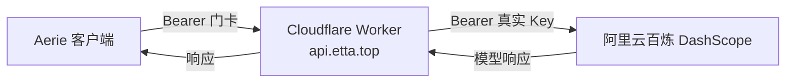

# AI API 中转网关（Cloudflare Worker + etta.top）

本文档描述 Aerie 如何通过 Cloudflare Worker 中转，把阿里云百炼（DashScope）等真实 API Key 藏在云端，打包时只下发「中转门卡」，避免真实 Key 泄露。

> 核心目标：真实 Key 永不落地到用户机器。

> ⚠️ **重要修正（2026-09-22）**：早期结论「门卡泄露了随时换掉即可」**低估了实际约束**。
> 门卡随安装包分发给所有用户，一旦轮换，**已分发出去的客户端会立刻全部失效**，直到用户升级。
> 所以轮换有真实代价，不是「随时」。防滥用必须落在服务端（见下）。

---

## 1. 背景与目标

- **问题**：语音识别（ASR）与子 Agent 需要阿里云百炼的 Key；若直接打包进安装包，任何人反编译即可拿到，存在被盗刷风险。
- **方案**：用 Cloudflare Worker 做一层中转，真实 Key 存在 Worker 的环境变量（secret）里，客户端只拿到 `etta.top` 地址 + 一个「门卡」（中转 key）。

## 2. 架构


```mermaid
graph LR
    A[Aerie 客户端] -->|Bearer 门卡| B[Cloudflare Worker<br/>api.etta.top]
    B -->|Bearer 真实 Key| C[阿里云百炼 DashScope]
    C -->|模型响应| B
    B -->|响应| A
```

- **门卡（RELAY_TOKEN）**：客户端持有的中转凭证，**按设计是公开的**——它必须随安装包分发，反编译即可取得。因此它不承担「保密」职责，只承担「标识」职责。
- **真实 Key（DASHSCOPE_KEY）**：只存在 Worker 环境变量（secret），永不落地。

## 3. 威胁模型与防护设计

既然门卡藏不住，防滥用只能在服务端做。`tools/relay-gateway/worker.js` 实现四道闸门：

| 闸门 / Gate      | 作用                                                         | 配置项              |
| ---------------- | ------------------------------------------------------------ | ------------------- |
| 门卡校验         | 拒绝未持卡请求（挡扫描器，不挡有心人）                        | `RELAY_TOKEN`       |
| 单 IP 分钟限流   | 挡住单个滥用者刷额度，避免把并发吃满                          | `RATE_PER_MINUTE`   |
| 单 IP 日配额     | 单个来源的日上限                                              | `DAILY_PER_IP`      |
| 全局日配额       | **总花费的兜底闸门**——即使门卡被大规模盗用，日消耗仍有上限   | `DAILY_GLOBAL`      |
| 客户端版本绑定   | 可淘汰旧版本、识别非官方客户端                                | `ALLOWED_VERSIONS`  |

**为什么计数用 Durable Object 而不是 KV**：KV 是最终一致的，多边缘节点并发累加会漏计。对一个「花真金白银」的额度闸门来说不够准确；Durable Object 单实例串行（配合 input gate 语义），「读-改-写」天然安全。

**为什么被拒绝的请求不计数**：否则一旦上限被误配得过低，计数器会越滚越大，即使随后调高上限也仍持续拒绝，无法自愈。

**为什么 `ALLOWED_VERSIONS` 默认留空（放行）**：已下发的安装包不会自己升级。默认拦截且列表配错 = 所有老用户立刻不可用。正确顺序是「先观察客户端实际上报的版本，再收紧」。

**版本头由谁发**：客户端在 `core/relay_headers.py` 统一注入 `X-Aerie-Version`（取自 `core/version.py` 的 `APP_VERSION`），只在目标 base_url 确实指向中转时注入。

## 4. 环境变量配置（Cloudflare Worker Variables & Secrets）

| 变量 / Variable      | 类型 / Type | 值 / Value                                              | 说明 / Notes                        |
| -------------------- | ----------- | -------------------------------------------------------- | ----------------------------------- |
| `RELAY_TOKEN`      | secret      | `aerie-kFcCr0zyxq4vo50`                                 | 门卡（按设计公开，防滥用靠下面的闸门） |
| `DASHSCOPE_KEY`    | secret      | （阿里云百炼真实 Key，仅存 Cloudflare）                  | 真 Key，永不落地                    |
| `DASHSCOPE_BASE`   | plain       | `https://dashscope.aliyuncs.com/compatible-mode/v1`     | 阿里云百炼 OpenAI 兼容地址          |
| `DEEPSEEK_KEY`     | secret      | （可选，DeepSeek 真实 Key）                              | 仅 `/deepseek` 路由使用             |
| `DEEPSEEK_BASE`    | plain       | `https://api.deepseek.com/v1`（可选）                   | DeepSeek 地址                       |
| `ALLOWED_VERSIONS` | plain       | 留空 = 不校验                                            | 逗号分隔的客户端版本前缀            |
| `RATE_PER_MINUTE`  | plain       | `30`                                                    | 单 IP 每分钟请求上限（0 = 不限）    |
| `DAILY_PER_IP`     | plain       | `300`                                                   | 单 IP 每日请求上限（0 = 不限）      |
| `DAILY_GLOBAL`     | plain       | `5000`                                                  | 全局每日请求上限（0 = 不限）        |

> 域名绑定：`api.etta.top`（子域名，根域名 `etta.top` 已被官网占用）。

## 5. 打包配置（真 Key 不落地，只下发门卡）

- **`config/relay_preset.env`**：预置中转地址 + 门卡

```env
DASHSCOPE_BASE_URL=https://api.etta.top
DASHSCOPE_API_KEY=aerie-kFcCr0zyxq4vo50
AERIE_WS_BASE_URL=https://api.etta.top
AERIE_WS_KEYS=aerie-kFcCr0zyxq4vo50
```

- **`main.py`**（L101-L111）：启动时先加载用户 `.env`，再兜底加载预设（`override=False`，不覆盖用户自己的配置）。
- **`electron/electron-builder.yml`** / **`electron/package.json`**：`extraResources` 显式打包 `config/relay_preset.env`。

## 6. 部署

```bash
cd tools/relay-gateway
npx wrangler secret put RELAY_TOKEN
npx wrangler secret put DASHSCOPE_KEY
npx wrangler deploy
```

## 7. 验证结果

Worker 逻辑由 `tools/relay-gateway/worker.test.mjs` 覆盖（用真实 `worker.js` 代码跑，仅桩掉 Durable Object storage 与上游 `fetch`，`node --test` 运行）：

| 检查项 / Check                    | 结果 / Result                     |
| --------------------------------- | --------------------------------- |
| `/health` 存活探测                | 200 `ok`，不计数                  |
| 无门卡 / 错门卡                   | 401 `unauthorized`                |
| `RELAY_TOKEN` 未配置              | 一律 401（不给空 Bearer 开门）    |
| 版本不在白名单 / 缺版本头         | 426，并回显上报值                 |
| 单 IP 分钟限流                    | 超限 429 `ip_rate_limit` + `retry-after` |
| 单 IP 日配额                      | 超限 429 `ip_daily_quota`         |
| 全局日配额（跨 IP 累加）          | 触顶 429 `global_daily_quota`     |
| 被拒请求不占配额                  | 只计入放行次数                    |
| 转发到阿里云百炼 / `/deepseek`    | 上游 URL 与 Authorization 正确    |
| `/v1` 前缀去重                    | 不会出现 `/v1/v1`                 |
| 上游未配 Key / 上游抛错           | 500 / 502，均带原因               |
| 查询串透传                        | 原样转发                          |

## 8. 注意事项 / Lessons Learned

- **门卡轮换有代价**：会同时打断所有已分发客户端，需配合强制升级。不要把它当作「随手就能做」的操作。
- **GitGuardian 告警**：仓库根 `.gitguardian.yaml` 已声明门卡为设计内公开凭据。该文件对 `ggshield` 生效；平台侧告警需在 GitGuardian 控制台标记。
- **Worker 代码不要留 `/echo` / `/debug` 调试端点**：会暴露门卡与配置信息。
- **PowerShell 5 测试坑**：`curl.exe -d '{"json":"..."}'` 会把带引号的 body 截断（81 字节变 65 字节），导致阿里云百炼报 `Required body invalid`；改用 `--data-binary @file` 从文件读 body 即可。
- **路径去重**：阿里云百炼 `compatible-mode/v1` 已含 `/v1`，Worker 需去掉客户端带的 `/v1` 前缀，否则 404。
- **body 转发**：用 `request.arrayBuffer()` 先读完整 body 再转发，避免流式转发丢 body。
