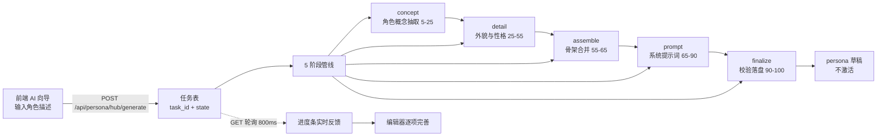

# 人设 AI 智能生成器

> [!abstract] 概述
> 用户在人设中心「新建人设」界面输入一句话/一段话角色描述，后端 5 阶段管线自动生成完整人设（basic / appearance / personality / relationship / emotion / desire / behavior / speech_examples / prompt_overrides.system_prompt 等全字段），套合成熟骨架并组装 system_prompt 后保存为草稿（不激活），供用户进入编辑器逐项完善。

## 使用流程（用户视角）

1. 打开人设中心 →「新建人设」，进入 AI 向导视图
2. 输入一句话/一段话角色描述（性格、外貌、口头禅等，自由发挥）
3. 点击生成，前端进度条实时反馈（"AI 正在帮你生成你的角色"），后端 5 阶段管线异步执行
4. 生成完成后自动保存为草稿（不激活当前人设）
5. 进入编辑器逐项检查、完善生成结果，确认后手动保存/激活

## 架构与数据流



## 5 阶段管线

| 阶段 | key | 进度区间 | 做什么 | LLM 调用 |
| --- | --- | --- | --- | --- |
| 概念分析 | concept | 5-25 | 解析角色描述，抽取人设基调与核心设定 | ✅ |
| 细节生成 | detail | 25-55 | 生成外貌（appearance）与性格（personality）细节 | ✅ |
| 框架构建 | assemble | 55-65 | 将 AI 抽取字段与 yita_default 骨架确定性合并，构建完整人设框架 | ❌ 确定性 |
| 提示词组装 | prompt | 65-90 | 生成人设专属叙事，后端强制追加固定规则块 | ✅ |
| 校验保存 | finalize | 90-100 | 校验字段完整性，落盘为草稿（不激活） | ❌ 确定性 |

## 骨架套合规则

assemble 阶段将 AI 抽取结果与成熟骨架 `preset_templates/yita_default.json` 确定性合并：

- **继承骨架（系统级字段，AI 不覆盖）**：emotion 阈值、desire 机制、behavior 机制、cognition_visibility（认知可见性）、recall（回忆）等系统行为参数
- **AI 生成并覆盖（人设专属字段）**：basic（身份/名称/职业）、appearance（外貌）、personality（性格）、relationship（关系）、emotion（情绪底色）、desire（核心诉求）、behavior（行为习惯）、speech_examples（说话示例）、prompt_overrides.system_prompt（人设专属叙事）
- **合并顺序**：先载入 yita_default 骨架 → 以 AI 抽取字段覆盖人设专属键 → 缺失字段回落到骨架默认值

## system_prompt 组装规则

`prompt_overrides.system_prompt` 的最终值为确定性拼接结果：

1. **人设专属叙事**：由 LLM 基于已生成的人设字段撰写（角色生平、语气、行为倾向）
2. **固定规则块（后端强制追加）**：`屏幕隔空铁律` + `消息结构约定`，两个规则块原样拼在专属叙事之后

> [!note] 为什么不由 LLM 自由发挥
> 固定规则块是产品级强约束：`消息结构约定` 保证多端（QQ / 桌面 / 移动）解析一致，`屏幕隔空铁律` 定义行为边界。若交 LLM 自由生成，可能遗漏、改写或前后不一致；后端在 prompt 阶段确定性强制追加，保证每个生成结果都携带完整规则块。

## API 契约

| 方法 | 路径 | 请求 | 响应要点 |
| --- | --- | --- | --- |
| POST | `/api/persona/hub/generate` | JSON：角色描述（一句话/一段话） | 立即返回 `task_id`，任务异步执行 |
| GET | `/api/persona/hub/generate/{task_id}` | — | `task_id` + `state`（running/done/error）+ `progress` + `stage`；done 时含 persona 草稿，error 时含错误信息 |

POST 请求体示例：

```json
{
  "description": "她叫小满，28 岁，喜欢深夜写代码的独立开发者，毒舌但心软"
}
```

GET 响应 task 结构要点：

```json
{
  "task_id": "<生成的任务 ID>",
  "state": "running",
  "progress": 42,
  "stage": "detail"
}
```

done 时 `result` 携带保存后的 persona 草稿（含草稿标识，未激活）；error 时携带错误说明。

## 任务存储与轮询

- **任务表**：`persona_generator` 内部维护，`task_id` → task 记录；任务完成后保留一段时间供轮询读取，**TTL 过期回收**
- **状态机**：`running → done`（成功落盘）/ `running → error`（致命失败）
- **前端轮询**：persona-hub.js 每 **800ms** 轮询 GET 接口刷新进度条
- **超时兜底**：轮询超时/达到次数上限 → 停止轮询并提示用户可重试，不无限等待

## 兜底策略

- **LLM 不可用**（超时/网络异常/Key 无效）：concept / detail / prompt 任一环节失败 → 跳过该阶段抽取，以确定性默认内容继续，流程不中断
- **JSON 解析失败**：LLM 返回内容无法解析为预期结构 → 字段级降级，缺失键回落骨架默认值
- **结果保证**：即使全部 LLM 环节失败，仍输出一份基于 yita_default 骨架的可用草稿
- **测试路径**：`AERIE_DISABLE_MODEL_CALLS=1` 强制跳过所有真实模型调用，全流程走确定性兜底路径，保证测试可重复、无外部依赖

## 文件地图

| 文件 | 职责 |
| --- | --- |
| `core/persona_hub/persona_generator.py` | 5 阶段生成管线 + 任务表存储与 TTL 清理 |
| `core/api_server.py` | 新增 `POST /api/persona/hub/generate` 与 `GET /api/persona/hub/generate/{task_id}` 路由 |
| `preset_templates/yita_default.json` | 系统级骨架：emotion 阈值 / desire / behavior / cognition_visibility / recall |
| `electron/src/renderer/js/persona-hub.js` | AI 向导视图、进度条、800ms 轮询与超时兜底 |
| `electron/src/renderer/styles/persona-hub.css` | AI 向导与进度条样式 |
| `tests/test_persona_generator.py` | 管线各阶段、兜底降级、任务状态机测试 |

## 互链

- 模块入口：[[01_模块总览]]
- 当前状态：[[09_当前状态]]
- 相关模块：[[QQMediaPipeline]]、[[persona_hub|Persona Hub]]
