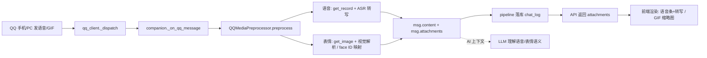
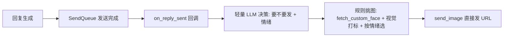

# QQ 多媒体管道（语音 / 表情包）端到端流程

本文档描述 Aerie 与 QQ（NapCat / OneBot11）之间**语音消息**与**表情包**（含收藏 GIF）的完整端到端数据流，覆盖入站解析、出站发送、各端口衔接与一致性保障。

> 核心目标：QQ 发来的语音/表情包在本地端与 AI 端都能被正确解析与理解；伊塔也能从账号收藏夹挑一张 GIF 表情主动发给用户。所有环节均带降级，绝不阻塞主回复链路。

---

## 1. 模块职责

- **职责**
  - 解析 QQ 消息的 CQ 码（语音 `record` / 图片 `image` / 表情 `face` / 动图 `mface` / 文本 `text`）
  - 语音：NapCat `get_record` 下载 → ASR 转写（SiliconFlow SenseVoice 云端优先，本地 whisper 回退）→ 生成「语音条(时长) + 转写文字」
  - 表情：图片表情下载后视觉解析（Qwen3-VL 风格）生成可读描述；QQ 自带 `face` 用 ID→文字映射
  - 出站：NapCat `fetch_custom_face` 拉取伊塔收藏表情 → 轻量 LLM 决策 → 规则按情绪挑图 → `send_image` 直接发 URL
- **非职责**
  - 不解析/不修改主模型上下文之外的策略；不负责表情包「存在性」的长期记忆准入
  - 出站表情发送失败时静默降级，不重试、不影响文字回复

## 2. 端到端数据流

### 2.1 入站：语音 / GIF 表情（用户 → 伊塔）



### 2.2 出站：伊塔发收藏表情（伊塔 → 用户）



## 3. 各端口衔接与一致性

| 端口 | 数据载体 | 同步方式 | 一致性保障 |
| --- | --- | --- | --- |
| QQ ↔ 后端（入站） | OneBot11 WS 事件 `raw_event.message` 结构化段 | 实时事件驱动 | `QQMediaPreprocessor` 统一解析段类型 |
| 后端预处理 → 落库 | `IncomingMessage.content` + `attachments` | 提交前同步写入 | 统一通道 `msg.attachments`，DB/API/前端字段一致 |
| DB → API → 前端 | `attachments` JSON | 按需查询 | `chat_log.attachments` 落库 + API 原样返回 |
| 后端 → QQ（出站） | OneBot11 `send_image(file=URL)` | 回复发送完成后触发 | `on_reply_sent` 回调统一入口，节流防刷屏 |
| 收藏表情库 | `fetch_custom_face` URL 列表 + 视觉标签缓存 | 实时拉取 + JSON 缓存 | `data/qq_sticker_cache.json` 跨重启复用 |

## 4. 关键文件 / 实现入口

| 文件 | 职责 |
| --- | --- |
| `communication/qq_client.py` | `fetch_custom_face` / `get_record` / `get_image` / `send_image` RPC 封装，`_dispatch` 事件分发 |
| `core/qq_media.py` | `QQMediaPreprocessor`：CQ 段解析、ASR 转写、视觉解析、`face` ID 映射，产出 `content+attachments`；`_SFClient`（SenseVoice 转写 / Qwen3-VL 视觉） |
| `core/multimodal_input.py` | `AudioTranscriber`：本地 whisper + 云端回退的 ASR 引擎 |
| `core/qq_sticker.py` | `QQStickerLibrary`（拉取+打标+按情绪挑图）、`QQStickerSender`（决策+节流+发送） |
| `core/companion.py` | `_on_qq_message` 接入入站预处理；`_on_qq_reply_sent` / `_sticker_decide`（轻量 LLM）接入出站发表情 |
| `communication/send_queue.py` | `on_reply_sent` 回调（回复发送完成后触发） |
| `core/attachment_handler.py` | `process_image_upload`：图片缩略图落库（`url` / `thumbnail_url` / `size`） |
| `core/pipeline.py` | `attachments` 落库与上下文透传 |
| `electron/src/renderer/js/chat.js` | `_buildAttachmentCard` 语音条(时长)+转写、GIF 缩略图渲染 |
| `electron/src/renderer/styles/main.css` | 语音条 / 转写文字样式 |

## 5. 降级策略（每层独立回退）

| 环节 | 失败表现 | 降级行为 |
| --- | --- | --- |
| 语音拉取/转写失败 | `get_record` 返回空 / ASR 超时 | 内容记为 `[语音]`，附件无转写文字 |
| 表情视觉解析失败 | `get_image` 失败 / 视觉不可用 | 仅用 `face` ID 映射或 `[图片]` 占位 |
| 出站拉收藏失败 | `fetch_custom_face` 失败/无收藏 | 直接不发表情 |
| 视觉打标不可用 | 打标为 0 | 规则退化为随机挑一张 |
| 轻量 LLM 决策失败 | 超时/异常 | 确定性规则兜底（情绪值得发才发） |
| 发送异常 | `send_image` 报错 | 静默跳过，不影响文字回复 |

## 6. 配置

`settings.yaml`（`sticker` 段，默认开启）：

```yaml
sticker:
  enabled: true        # 是否允许伊塔发表情
  min_interval: 90     # 每用户最小间隔（秒）
```

ASR / 视觉依赖环境变量（复用现有）：`SILICONFLOW_API_KEY`、`SILICONFLOW_BASE_URL`；语音本地回退可选 `whisper`。

## 7. 验证

- 入站：`tests/test_qq_media.py`（CQ 解析、face 映射、语音转写、表情视觉、降级占位）
- 出站：`tests/test_qq_sticker.py`（拉取、打标、按情绪挑图、决策、发送、兜底）
- 运行时：`python -c` 独立脚本验证「拉取→打标→挑图→决策→发送」全链路（含降级）

## 8. 互链

- 模块入口：[[01_模块总览]]
- 当前状态：[[09_当前状态]]
- 依赖：[[dependencies/Internal-Attachment-Pipeline]]
- 相关模块：[[modules/AttachmentEnvelope]]、[[modules/ImageObservation]]、[[modules/VisualIntentRouter]]
