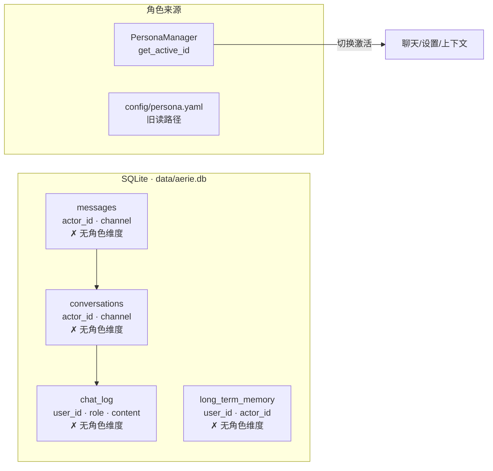

# 角色级对话与记忆隔离技术方案

> [!abstract] 一句话
> 为 Aerie 增加 **persona（角色）维度** 的数据隔离：每个 AI 角色拥有独立的对话历史与长期记忆；切换人设时，历史、记忆、检索、上下文注入全部跟随激活角色，互不串扰。

> [!warning] 前提与边界
> 本文只覆盖"角色维度"的对话与记忆隔离。**多端账户维度（actor_id，QQ/桌面/移动，`multi_channel_identity_v1`）已存在且与本文正交**，本文不改动它。人设设定（system prompt / 外观 / 称呼）已随 [[modules/PersonaGenerator|PersonaGenerator]] 的 `persona_hub_source_v1` 开启而跟随切换，不在本文范围。

---

## 1 背景与目标 / Background & Goals

### 1.1 现状问题

当前系统允许在 [[modules/PersonaGenerator|人设中心]] 创建并切换多个角色（伊塔 / 塞纳 / …），切换后**人设设定**已能正确跟随。但对话与记忆是**全局共享**的：

- 数据库 `chat_log` 只有 `user_id`（用户维度），没有角色维度 → 所有角色的聊天记录混在同一份历史里
- 规范对话模型 `conversations / turns / messages` 只有 `actor_id`（多端账户维度），没有角色维度
- `long_term_memory` 只有 `actor_id`，没有角色维度 → 记忆跨角色共享
- 上下文构建、记忆检索、历史查询均未按角色过滤

### 1.2 目标

| 编号 | 目标 |
| --- | --- |
| G1 | 新增 `persona_id` 维度：对话、记忆、检索均按激活角色隔离 |
| G2 | 切换人设后，前端历史列表、上下文注入、记忆召回全部跟随新角色 |
| G3 | 存量数据平滑兼容：旧数据（无角色归属）默认可见，不破坏既有会话 |
| G4 | 与现有 `actor_id`（多端）维度正交，不互相影响 |

---

## 2 现状分析 / Current State

### 2.1 表结构证据



关键代码位置（已核实）：

- `chat_log` 建表：[core/database.py](file:///e:/Agent_reply/core/database.py#L36-L46) —— 仅 `user_id` 维度
- `conversations / turns / messages` 建表：[core/migrations/__init__.py](file:///e:/Agent_reply/core/migrations/__init__.py#L118-L151) —— 仅有 `actor_id`（多端账户）
- `long_term_memory` 建表：[core/database.py](file:///e:/Agent_reply/core/database.py#L65-L84) —— `actor_id` 为多端维度
- 会话 ID 生成：[core/conversation_repository.py](file:///e:/Agent_reply/core/conversation_repository.py#L48-L64) —— `resolve_conversation_id(actor_id, channel, channel_account_id, user_id)` 哈希
- 记忆查询：[memory/memory_store.py](file:///e:/Agent_reply/memory/memory_store.py#L28-L51) —— 按 `actor_id` 或 `user_id`
- 上下文检索注入：[core/context_builder.py](file:///e:/Agent_reply/core/context_builder.py#L352-L418) —— `_build_retrieval_section` 按 `actor_id`

> [!note] 关键区分
> `actor_id` = **同一用户在不同端**（QQ / 桌面 / 移动）的账户身份（`multi_channel_identity_v1`）。
> `persona_id` = **不同 AI 角色**（伊塔 / 塞纳 / …）。
> 两者正交，方案只新增后者。

### 2.2 链路缺口

- **写入链**：消息落库（`chat_request_worker` / `pipeline` / `conversation_repository.persist_turn`）未携带角色 → 无归属
- **读取链**：历史查询（`chat_poll` / 前端拉取）、上下文历史注入未按角色过滤
- **记忆链**：`memory_store` 写入与检索、温层摘要分桶、ChromaDB 检索均未按角色过滤
- **切换链**：`persona:changed` 事件已存在，但前端未据此重载历史

---

## 3 设计决策 / Design Decisions

| 决策 | 结论 | 理由 |
| --- | --- | --- |
| D1 维度 | 新增 `persona_id TEXT` 列，取 `PersonaManager.get_active_id()` | 与 actor_id 正交；语义清晰 |
| D2 隔离默认 | **共享兼容模式**：查询 `persona_id = :active OR persona_id IS NULL` | 存量数据（NULL）平滑可见；新数据按角色隔离；未来可切严格模式 |
| D3 conversation 归属 | `resolve_conversation_id` 将 `persona_id` 纳入哈希 | 不同角色天然不同会话，避免串扰 |
| D4 冗余 vs 关联 | `messages` 冗余 `persona_id` + 复合索引 | 高频历史查询免 join，索引开销可接受 |
| D5 记忆归属 | `long_term_memory` / 摘要 buckets / ChromaDB metadata 均带 `persona_id` | 记忆召回必须按角色隔离 |
| D6 严格模式 | 预留 `persona_isolation_mode: shared|strict` 开关（后续） | 满足"完全隔离"诉求，默认不破坏现状 |

---

## 4 数据库表结构变更 / Schema Changes

### 4.1 新增迁移 `011_persona_scoped_dialogue_memory`

在 [core/migrations/__init__.py](file:///e:/Agent_reply/core/migrations/__init__.py) 新增迁移，并在 [core/database.py](file:///e:/Agent_reply/core/database.py#L380) `_init_schema` 的 runner 链注册：

```sql
-- 1) 对话与消息：冗余列 + 复合索引
ALTER TABLE chat_log ADD COLUMN persona_id TEXT DEFAULT NULL;
ALTER TABLE conversations ADD COLUMN persona_id TEXT DEFAULT NULL;
ALTER TABLE turns ADD COLUMN persona_id TEXT DEFAULT NULL;
ALTER TABLE messages ADD COLUMN persona_id TEXT DEFAULT NULL;
ALTER TABLE requests ADD COLUMN persona_id TEXT DEFAULT NULL;

CREATE INDEX IF NOT EXISTS idx_chat_log_persona
    ON chat_log(persona_id, user_id, created_at);
CREATE INDEX IF NOT EXISTS idx_conversations_persona
    ON conversations(persona_id, actor_id, updated_at);
CREATE INDEX IF NOT EXISTS idx_messages_persona
    ON messages(persona_id, conversation_id, sequence);
CREATE INDEX IF NOT EXISTS idx_requests_persona
    ON requests(persona_id, actor_id, created_at);

-- 2) 记忆：角色维度
ALTER TABLE long_term_memory ADD COLUMN persona_id TEXT DEFAULT NULL;
CREATE INDEX IF NOT EXISTS idx_ltm_persona
    ON long_term_memory(persona_id, user_id, importance);

-- 3) 温层摘要分桶：桶键纳入角色
ALTER TABLE conversation_summary_buckets ADD COLUMN persona_id TEXT DEFAULT NULL;
CREATE INDEX IF NOT EXISTS idx_summary_buckets_persona
    ON conversation_summary_buckets(persona_id, bucket_key);
```

> [!tip] 幂等与回填
> - 全部 `ADD COLUMN ... DEFAULT NULL` 幂等（PRAGMA 检测列存在）
> - 存量行 `persona_id = NULL`，即共享兼容态（D2）
> - 回滚：删除列即可恢复；NULL 行即旧共享数据，无损失

### 4.2 存量数据语义

| 数据 | 归属 | 可见范围 |
| --- | --- | --- |
| 存量历史 / 存量记忆（迁移后） | `persona_id = NULL` | 所有角色（共享兼容） |
| 切换角色后新写入 | 当前激活 `persona_id` | 仅该角色 + 共享 NULL 数据 |

---

## 5 核心逻辑修改点 / Core Changes

### 5.1 写入链（新数据带角色）

| 文件 | 位置 | 修改 |
| --- | --- | --- |
| [core/conversation_repository.py](file:///e:/Agent_reply/core/conversation_repository.py#L48-L64) | `resolve_conversation_id` / `ensure_conversation` / `persist_turn` | 签名增加 `persona_id`；会话 ID 哈希纳入 `persona_id`；INSERT 写入 `persona_id` |
| [core/conversation_repository.py](file:///e:/Agent_reply/core/conversation_repository.py#L86-L112) | `_resolve_related_conversation_ids` | 增加按 `persona_id` 的候选会话 ID（含 NULL 兼容变体） |
| 消息落库调用方 | `chat_request_worker.py` / `pipeline.py` / `chat_request_service.py` | 组装请求/消息时注入 `PersonaManager.get_active_id()` |
| [memory/memory_store.py](file:///e:/Agent_reply/memory/memory_store.py#L13-L24) | `add` / 写入方法 | 写入时带 `persona_id` |
| 温层摘要 | `summary_buckets` 的 planner/assembler | 桶键拼接 `persona_id` |

### 5.2 读取链（按角色过滤）

| 文件 | 位置 | 修改 |
| --- | --- | --- |
| 历史查询 | `conversation_repository` / `/api/chat/*` 历史端点 | WHERE 增加 `persona_id = :active OR persona_id IS NULL`（D2） |
| [core/context_builder.py](file:///e:/Agent_reply/core/context_builder.py#L352-L418) | `_build_retrieval_section` 与历史注入 | 记忆/历史检索按 `persona_id` 过滤；L1 身份段已随 `load_persona()` 跟随（既有） |
| [memory/memory_store.py](file:///e:/Agent_reply/memory/memory_store.py#L28-L51) | `search` / 最近记忆 | 查询条件增加 `persona_id = :active OR persona_id IS NULL` |
| 跨端回忆 | `communication/recall_manager.py` / `mobile_chat.py` | 回忆检索按 `persona_id` 过滤 |

### 5.3 ChromaDB 检索隔离

- 向量写入：`metadata` 增加 `persona_id`
- 检索：`where={"$or": [{"persona_id": active}, {"persona_id": None}]}`（ChromaDB 空值过滤需约定：NULL 以空串占位）
- 涉及：`memory/layers/*`、`knowledge/kb.py` 的角色相关检索

### 5.4 切换联动（前端）

| 文件 | 修改 |
| --- | --- |
| [electron/src/renderer/js/persona-hub.js](file:///e:/Agent_reply/electron/src/renderer/js/persona-hub.js#L583) | `_activatePersona` 已 dispatch `aerie:persona-updated`（既有） |
| [electron/src/renderer/js/chat.js](file:///e:/Agent_reply/electron/src/renderer/js/chat.js#L102-L113) | 事件监听中除刷新头像外，**重载当前会话历史**（按新 persona） |
| 聊天历史拉取 | 请求带 `persona_id`（或由后端按激活角色注入） |

> [!note] 简单优先
> 历史拉取由**后端按当前激活角色自动过滤**，前端只负责在 `persona:changed` 时重新拉取，不改请求参数——避免前端透传角色 ID 的复杂度。

---

## 6 分阶段实施 / Implementation Phases

| 阶段 | 范围 | 产出 |
| --- | --- | --- |
| **P0** 迁移 + 写链 | migration 011；`conversation_repository` / 落库调用方带 `persona_id` | 新数据按角色归属 |
| **P1** 读链 + 切换 | 历史/记忆查询按 `persona_id` 过滤；`chat.js` 切换重载历史 | 隔离生效 + 前端跟随 |
| **P2** 检索与分桶 | ChromaDB metadata 过滤；摘要 buckets 按角色分桶；跨端回忆过滤 | 记忆召回不串扰 |
| **P3** 严格模式 | `persona_isolation_mode` 开关；设置页展示 | 完全隔离可选 |

---

## 7 风险与回滚 / Risks & Rollback

| 风险 | 缓解 |
| --- | --- |
| `resolve_conversation_id` 纳入 persona 后，存量会话定位变化 | `_resolve_related_conversation_ids` 保留 NULL 兼容候选；存量 conversation 不动 |
| 记忆检索双源（NULL 共享 + 新 persona）可能重复 | 合并时按 `(content, persona_id)` 去重；温层桶键含 persona 天然分离 |
| ChromaDB 空值过滤（`None`）语义 | 约定 NULL 用空串占位，检索 `$or` 显式匹配 |
| 迁移在旧安装（`migration_framework_v1=false`）上不执行 | 兼容路径沿用 `_migrate_chat_log` 式 PRAGMA 增量加列（幂等） |
| **回滚** | 删列即恢复；NULL 行即旧共享态；无数据迁移损坏 |

---

## 8 测试方案 / Testing

- 迁移幂等：`011` 重复执行不报错；存量回填为 NULL
- 写链隔离：角色 A 的消息落库 `persona_id = A`
- 读链隔离：切换角色后历史/记忆仅含本角色 + NULL 共享数据
- 会话归属：同一用户不同角色 `conversation_id` 不同（哈希含 persona）
- 记忆召回：角色 A 的偏好不出现在角色 B 的上下文中
- 切换联动：`persona:changed` 触发历史重载（前端）
- 回归：既有 009/010 迁移、persona hub、context builder 测试全量

---

## 9 相关链接 / Related

- [[modules/PersonaGenerator|人设 AI 智能生成器]]
- [[modules/TopicTracking|话题追踪]]
- [[modules/QQMediaPipeline|QQ 媒体链路]]
- [[09_当前状态|当前状态]]
- 决策记录：[[04_决策记录|04 决策记录]]
