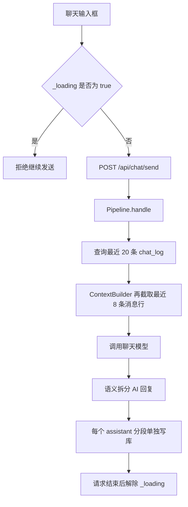
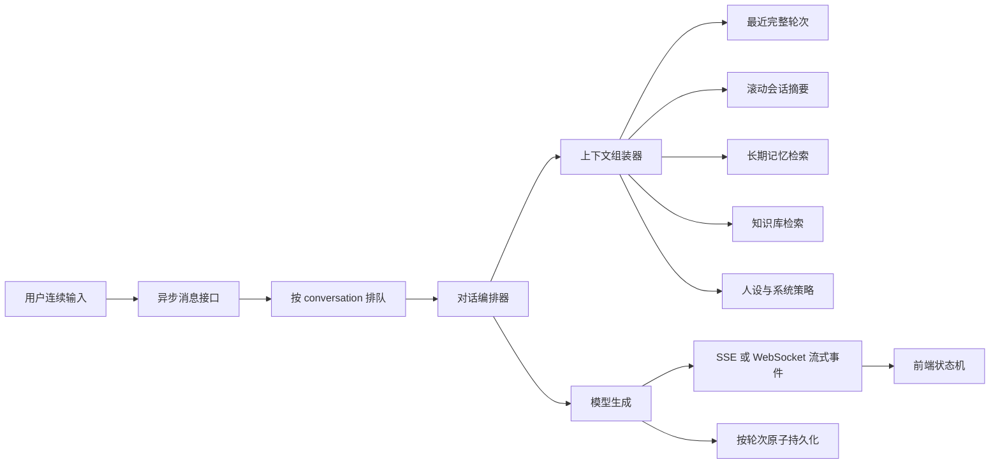
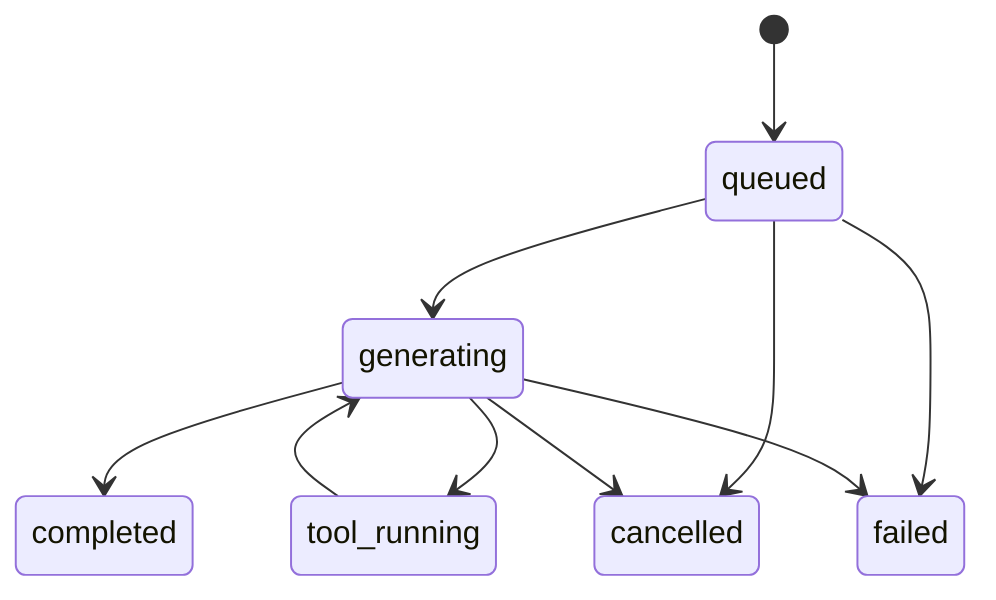

# Aerie 不受限制对话模式二次开发方案

> [!abstract] 核心结论
> 当前系统并非完全没有历史记录，而是采用“同步单请求 + 按消息行截断”的短上下文方案。AI 回复被拆成多条记录后，会快速挤掉上一轮用户消息，最终使模型经常只能获得系统提示、少量残缺 assistant 消息和当前一句话。

## 目标

将现有严格的一问一答模式升级为可持续的多轮对话系统：

- AI 能理解前文、指代、上下文任务和用户补充。
- 用户可在 AI 生成期间继续输入、排队、取消或追加信息。
- 不同窗口、渠道和主题拥有独立会话，不发生串话。
- 短期上下文、会话摘要、长期记忆和知识检索分层工作。
- 上下文由 token 预算控制，而非固定截取若干数据库行。

> [!warning] “不受限制”的工程含义
> 不应理解为无限 token 或绕过安全规则，而应定义为：不限制为单轮问答、不因回复分段丢失上下文、不阻止连续输入，并在模型窗口有限时通过摘要和检索保持长期连贯。

## 当前链路



关键实现位于：

- 前端发送与状态：`electron/src/renderer/js/chat.js`
- HTTP 接口：`core/api_server.py`
- 对话处理管线：`core/pipeline.py`
- 上下文构造：`core/context_builder.py`
- 模型请求：`core/brain.py`
- 数据库存储：`core/database.py`
- 运行装配：`core/companion.py`
- 用户路由：`communication/router.py`
- 人设配置：`data/personas/yita_default.json`

## 根因

### 全局发送锁

前端以 `_loading` 布尔值锁住整个发送流程。后端 `/api/chat/send` 又同步等待推理、工具执行、回复拆分和持久化全部结束，因此生成期间无法继续发送。

### 按消息行截断

FULL 模式最终只保留最近 8 条数据库消息，而不是最近 8 个完整问答轮次。窗口可能从 assistant 消息开始，缺少其对应的 user 问题。

### 回复分段挤压历史

一次 AI 回答可能拆成多条 assistant 记录。若一轮回复拆成 6 至 10 段，这些分段会迅速占满上下文窗口，把上一轮用户输入挤出去。

> [!bug] 典型退化
> 数据库里“看起来有聊天记录”，聊天界面也能显示几十条消息，但真正发送给模型的上下文可能只剩多个 assistant 分段和当前 user 消息。

### 缺少会话实体

当前记录主要依赖 `user_id`，缺少：

- `conversation_id`
- `turn_id`
- `response_group_id`
- `parent_message_id`
- 明确的消息状态字段

这使系统无法稳定表达“哪个消息属于哪个会话、轮次和回答”。

### 记忆未注入主链路

`ContextBuilder` 虽然接收 memory 和 knowledge 组件，但当前 `build()` 没有真正将检索结果加入模型消息。Web UI 直接走 `Pipeline`，也没有完成长期记忆或知识库注入。

### 身份可能漂移

前端存在固定用户 ID，而配置缺失时后端可能返回另一默认值。不同入口、主动消息和历史查询可能落入不同身份或数据集合，造成历史看似消失。

### 系统提示契约不统一

人设界面提供 `system_prompt` 编辑能力，但实际构造器主要按结构化字段生成提示，未形成明确的覆盖或追加规则。

## 目标架构



## 数据模型

建议保留 `chat_log` 作为兼容层，新增或扩展为以下结构：

| 字段 | 用途 |
|---|---|
| `conversation_id` | 隔离不同会话、渠道和主题 |
| `turn_id` | 绑定一次用户输入及其完整回答 |
| `response_group_id` | 将多个 UI 气泡归并为一条模型 assistant 消息 |
| `parent_message_id` | 支持引用、分支和重新生成 |
| `role` | `user`、`assistant`、`system`、`tool` |
| `status` | `queued`、`generating`、`completed`、`cancelled`、`failed` |
| `sequence` | 保证同一轮内分段顺序 |
| `token_count` | 支持上下文预算和诊断 |
| `metadata` | 保存渠道、附件、工具调用和模型信息 |

> [!tip] 展示与模型上下文分离
> UI 可以继续把回答拆成多个气泡，但送入模型前，应按 `response_group_id` 合并为一条 assistant 消息。

## 上下文策略

上下文应按以下优先级组装：

1. 基础系统策略和安全边界。
2. 当前人设、关系、语言风格和行为配置。
3. 当前会话的滚动摘要。
4. 与当前问题相关的长期记忆。
5. 与当前问题相关的知识库内容。
6. 最近若干个完整 turn。
7. 当前用户消息与附件说明。

采用 token budget：

```text
可用上下文 = 模型窗口 - 预留输出 - 工具预留 - 安全余量
```

从最新完整 turn 向前装填，禁止从 assistant 分段中间截断。若预算不足，先压缩旧轮次为摘要，再减少检索结果。

## 连续输入模式

将 `_loading: boolean` 替换为按请求管理的状态机：



用户在生成期间发送新消息时，提供三种策略：

| 策略 | 行为 | 默认建议 |
|---|---|---|
| 排队 | 当前回答完成后作为下一轮处理 | 默认 |
| 合并 | 若当前轮尚未开始推理，合并补充文本 | 可选 |
| 打断重算 | 取消当前生成，将补充内容一起重新构造 | 显式操作 |

接口建议：

- `POST /api/conversations`
- `GET /api/conversations/{id}/messages`
- `POST /api/conversations/{id}/messages`
- `POST /api/requests/{request_id}/cancel`
- `POST /api/requests/{request_id}/retry`
- `GET /api/conversations/{id}/events`

`POST messages` 应立即返回 `request_id`，模型输出通过 SSE 或 WebSocket 推送，不再让 HTTP 请求同步等待完整回答。

## 改造阶段

### P0 多轮上下文

- [ ] 增加 `conversation_id`、`turn_id`、`response_group_id`。
- [ ] 改为查询最近 N 个完整 turn。
- [ ] 模型调用前合并同组 assistant 分段。
- [ ] 修复窗口开头的孤立 assistant/tool 消息。
- [ ] 使用 token budget 替代 FULL=8 等硬编码。
- [ ] 统一前后端用户身份和本地会话身份。

### P1 异步连续对话

- [ ] `/send` 改为立即返回 `request_id`。
- [ ] 建立 conversation 级异步队列。
- [ ] 使用 SSE 或 WebSocket 返回生成事件。
- [ ] 前端允许排队、取消、重试和连续输入。
- [ ] 把全局 `_loading` 改为消息级状态。

### P1 记忆与摘要

- [ ] 在 `ContextBuilder.build()` 中显式接收摘要和检索结果。
- [ ] 建立滚动会话摘要及版本号。
- [ ] 将长期记忆和知识库命中注入模型上下文。
- [ ] 记录每个上下文区块的 token 数及来源。

### P1 人设提示统一

- [ ] 定义 `persona.system_prompt` 是覆盖还是追加。
- [ ] 把最终提示拆分为可审计区块。
- [ ] 在认知面板显示最终 prompt hash、字符数和启用模块。

### P2 会话体验

- [ ] 新建、重命名、归档和删除会话。
- [ ] 支持消息引用、编辑后重发、重新生成和对话分支。
- [ ] 支持按会话搜索历史。
- [ ] 支持本地 UI、QQ 等渠道之间可配置的记忆隔离。

## 测试标准

> [!success] 最小验收条件
> 第二轮问题必须能够引用第一轮用户信息，即使第一轮 AI 回复被拆成 10 个 UI 分段。

- [ ] 连续两轮时，第二轮模型请求包含第一轮完整 user/assistant 对。
- [ ] assistant 拆成 10 段后，不会挤掉对应 user 消息。
- [ ] 两个 `conversation_id` 之间不串话。
- [ ] 本地 UI 与 QQ 默认不共享短期会话。
- [ ] 生成期间可继续输入，新消息进入队列。
- [ ] 取消后不产生伪 completed 消息。
- [ ] 超过 token budget 时只按完整 turn 截断。
- [ ] 旧对话被摘要后，关键事实仍可被后续问题引用。
- [ ] memory 和 knowledge 命中确实出现在模型 payload 中。
- [ ] 自定义 `system_prompt` 确实进入最终系统消息。
- [ ] 数据库写入失败时，整轮状态可恢复且不会留下孤立回答。

## 风险控制

- 数据库迁移需兼容旧 `chat_log`，建议先双写再切换读取。
- 流式输出与语义分段应解耦，避免重复气泡或顺序错乱。
- 同一 conversation 必须串行提交状态，但不同 conversation 可并发执行。
- 摘要不能覆盖最近原始轮次，且需保留摘要来源范围。
- 长期记忆应区分事实、偏好、临时任务和敏感信息，并支持删除。
- “连续对话”不能绕过权限、工具确认和系统安全策略。

## 建议实施顺序


> [!important] 最小可行版本
> 不要只把历史上限从 8 调大。首个版本至少完成：会话 ID、轮次 ID、回答分组、完整轮次读取、assistant 分段合并、统一身份和真实两轮集成测试。

## 关联笔记

- [[统一消息层方案]]
- [[聊天系统升级]]
- [[上下文工程]]
- [[长期记忆架构]]
- [[Aerie 系统架构]]

%%
后续实施时，可将本笔记拆分为 spec、tasks 和 migration checklist，并为每个阶段建立独立提交。
%%
