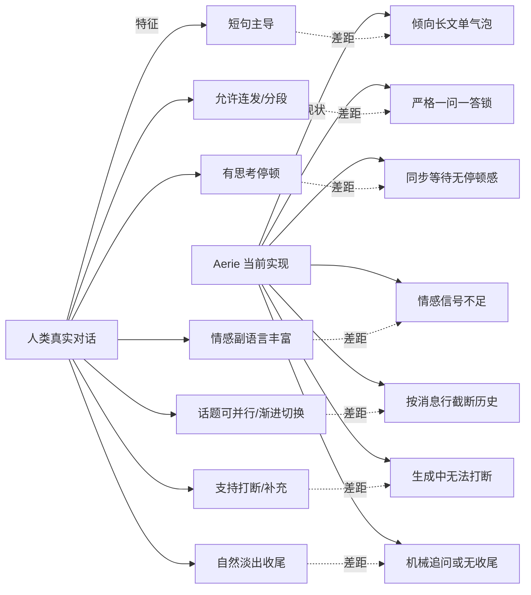
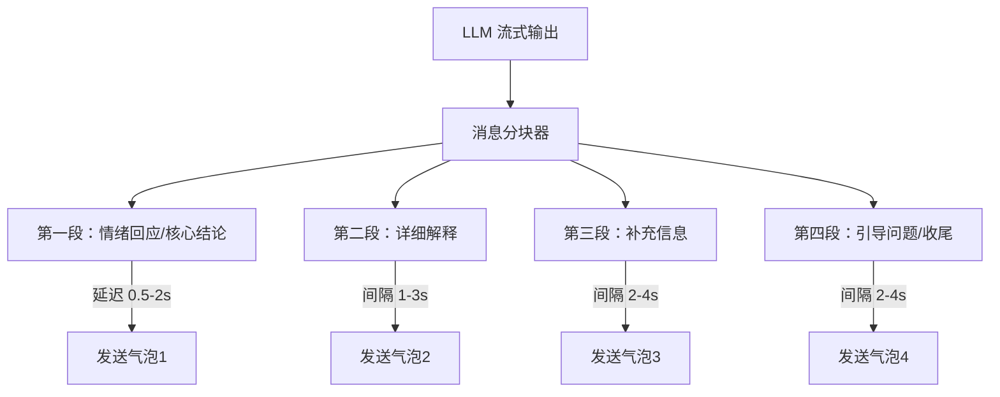
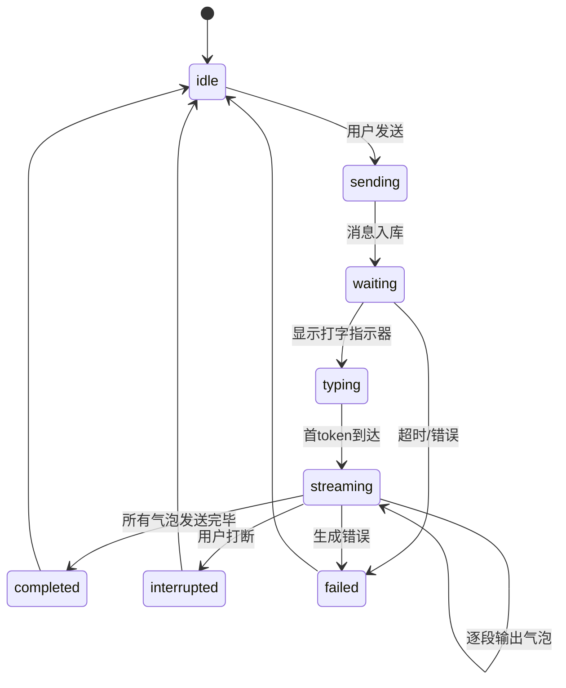
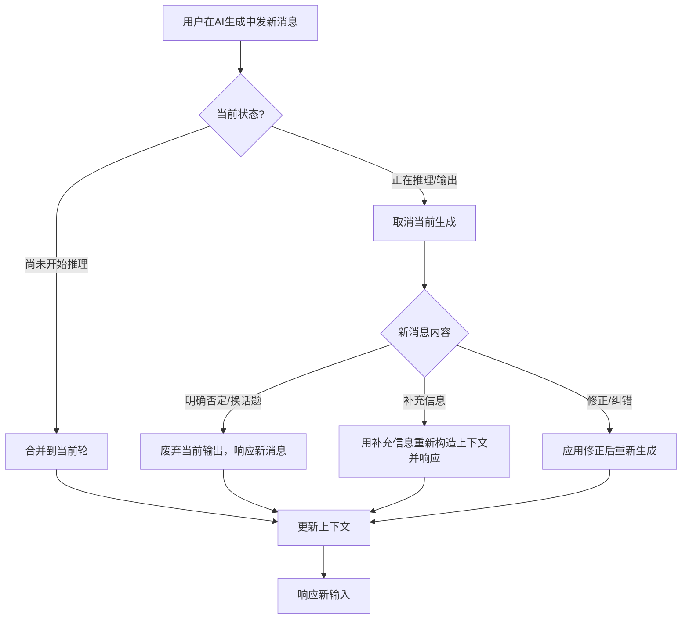
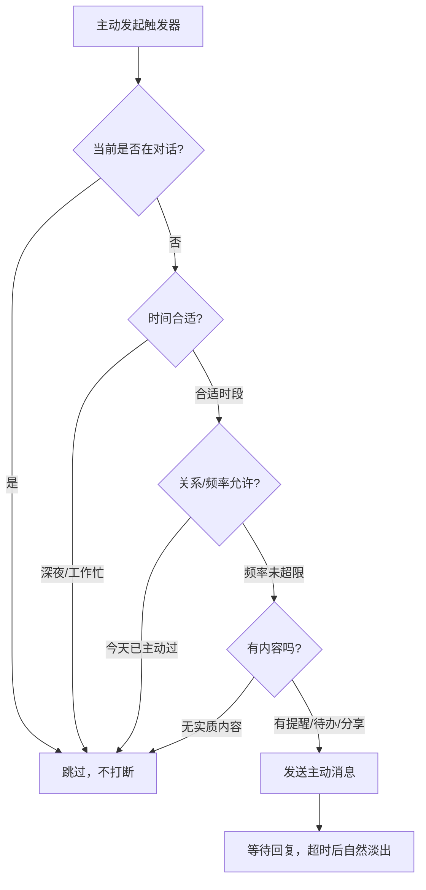

# Aerie 拟人化对话模式研究与优化方案

> [!abstract] 核心命题
> 人与人之间的即时通讯并非"你说一句我完整回一段"，而是一种**准同步（quasi-synchronous）**的弹性对话：短句主导、允许连发、分段表达、有思考停顿、情感依赖副语言、话题可并行、对话常以"淡出"而非告别结束。当前 Aerie 采用同步单请求+长文单气泡模式，与人类真实对话习惯存在结构性错位。本方案将 CMC（计算机媒介沟通）研究发现转化为可工程落地的 Agent 对话模式改造。

## 一、人类即时通讯核心习性

### 1.1 消息长度：短句主导，右偏分布

> [!info] 关键数据
> IM 消息中位数显著低于均值——约 30-40% 的消息仅 1-5 个字/词，单字回复（"哦""嗯""好""ok"）占比约 10-15%。约 70% 的消息不超过 20 个英文字/25 个中文字符。消息长度近似对数正态或幂律分布：大多数消息很短，少数长消息拉高均值。

**对 Aerie 的启示**：
- AI 不应每轮都输出完整长段落。
- 简单确认、情绪回应、过渡性话语应使用极短气泡（1-2句）。
- 长回复必须有结构化分段或拆成多条消息。
- 用户发短消息时，AI 不应回复长文；用户发长文时，AI 也不应只用短句敷衍——保持**对话能量对等**。

### 1.2 回复延迟：重尾分布，弹性同步

> [!info] 关键数据
> 面对面轮次转换间隔约 200ms（生理基准）。IM 中约 30% 回复在 1 分钟内（中位数 1-3 分钟活跃会话），50% 在 5 分钟内，但尾部延伸至数小时甚至数天。10-30 秒内的回复被感知为"即时"；超过 1 分钟开始被注意到延迟；超过 10 分钟可能需要解释。

**对 Aerie 的启示**：
- 秒回所有消息反而不自然——简单问题可快答，复杂/情感问题需要"思考停顿"。
- 打字指示器（typing indicator）必须存在，且超时要有保护（建议 10 秒）。
- 陪伴场景可根据回复长度和情感强度动态加入 0.5-8 秒思考延迟。
- 看到"正在输入"超过 10-15 秒无消息会引发焦虑——需要分段先出部分内容或显示阶段状态。

### 1.3 连发习惯：30-50% 消息以多条连发形式出现

> [!info] 关键数据
> 约 30-50% 的用户消息以连续多条（burst）形式发送，而非合并为一条长消息。2 条连发最常见（占连发的 50-60%），3 条约 25-30%，同一连发序列内消息间隔通常在 3-15 秒之间。连发功能包括：分段表达、补充修正、强调紧迫性、模拟连续发言。

**对 Aerie 的启示**：
- AI 回复不应该总是塞在一个大气泡里。
- 情感回应、补充说明、追问引导可拆成连续多条短消息，间隔 1-4 秒逐段发送。
- 第一段应在较短延迟后出现（情绪回应/核心结论），后续段落可逐段追加。
- 这不是"啰嗦"，而是模拟真人"想到一段发一段"的自然节奏。

### 1.4 分段表达：按想法单元而非段落发送

> [!info] 关键数据
> 用户倾向于将完整想法拆分为多条消息，每条表达一个命题或语用单元。每条消息平均 1-2 个句子，超过 3 个句子的消息比例低于 20%。分段允许接收者在任意节点"接话"，恢复面对面交流中"边想边说"的时序特性。

**对 Aerie 的启示**：
- 模型输出后需经过"消息分块器"（Message Chunker），按语义单元切分为多个气泡。
- 分块逻辑：核心结论/情绪回应 → 详细解释 → 补充信息 → 引导问题。
- 每段不超过 3 行（约 80-100 字，微信场景建议）；通用聊天单条建议不超过 200-300 字。
- 代码/技术内容保留完整块，不拆分。

### 1.5 话题管理：渐进切换，多线程并行

> [!info] 关键数据
> 约 70-80% 的话题转换是渐进式的（通过"对了""话说""哦对"等过渡标记），突兀切换约 20-30%。单个话题平均持续 10-30 条消息。IM 中可同时维持 2-3 个活跃话题，形成"话题栈"——旧话题被暂时覆盖后可被捡回。

**对 Aerie 的启示**：
- 需要显式话题跟踪器，而非简单截断历史。
- 当用户切换话题时 AI 应顺畅跟随，不强行延续旧话题。
- 适当时机可自然提及之前话题（"你之前提到的那个项目，后来怎么样了？"）。
- 长对话需要话题摘要和栈式管理，而非简单滑动窗口。

### 1.6 情感信号：副语言高度依赖

> [!info] 关键数据
> 约 30-40% 的消息包含至少一个 emoji/表情。Emoji 约 60% 用于表达情感，25% 用于调节语气（缓解生硬），15% 用于替代文字回复（👍、👌）。约 10-15% 的消息使用非标准标点（"!!!""...""～"）或重复字词（"哈哈哈""嗯嗯""好的好的"）增强情感。纯文字无情感标记的短消息（如"好"）常被感知为冷淡——负面偏差效应。

**对 Aerie 的启示**：
- AI 需要具备"语气调节层"：在适当场景使用 emoji、语气词、标点变化。
- 不能过度使用 emoji（生产力场景少用，陪伴场景适当多用）。
- 短回复必须有语气修饰，避免"好""知道了"这类易被误解为冷淡的回复。
- 情感类输入第一反应应是情绪回应，而非立刻给解决方案。

### 1.7 打断与补充：自然的并行现象

> [!info] 关键数据
> 用户发送消息后 1-2 分钟内发送修正/补充的比例约 10-15%。双方同时发送消息（"撞车"）频率约 5-10%，处理方式是各自回应对方最后一条，形成"交叉回复"。撤回功能使用率约 2-5%。

**对 Aerie 的启示**：
- 必须支持流式生成中的打断/停止/取消。
- 用户在 AI 生成中发送新消息时，应立即取消当前生成，优先响应新输入。
- 需要"合并补充"机制：若用户在 AI 尚未开始生成时追加消息，合并为同一轮处理。
- 不应在用户已表达"不用了""换个话题"后继续输出已废弃内容。

### 1.8 对话终止：以淡出为主流

> [!info] 关键数据
> 约 60-70% 的对话通过"逐渐停止回复"而非正式告别终止；最后一条消息后无回复超过 1-2 小时即视为对话结束。仅 20-30% 的对话包含明确结束语（"拜拜""晚安"）。单字/极短回复（无后续）是最常见的隐性终止信号。约 30-40% 的对话是"未完成"的，可能在数小时或数天后重启。

**对 Aerie 的启示**：
- AI 不应在每个回答后都机械追问"还有什么可以帮您的吗？"。
- 应识别对话自然结束点，主动"留白"而非强行延续。
- 任务完成后可给出明确收尾，但闲聊场景允许自然淡出。
- 跨天重启对话时需识别上下文衰减（超过 24 小时约 60% 需要重新说明背景）。

### 1.9 主动发起：有时间规律和关系节奏

> [!info] 关键数据
> 主动消息高峰时段：工作日 8-9 点、12-13 点、20-22 点；周末高峰后移至 10-11 点。开场白约 40-50% 直入主题，20-30% 问候类，20-30% 分享类。约 20-30% 的对话由一方发起超过 60% 的次数，完全对称关系较少。

**对 Aerie 的启示**：
- 主动消息应符合时间节律，避免在不合适时段打扰。
- 主动发起应有内容（分享/提醒/跟进），而非无意义的"在吗"。
- 主动频率需要控制，避免骚扰感。
- 可基于用户习惯建立个性化活跃时段模型。

---

## 二、业界 AI 对话设计最佳实践

### 2.1 流式输出已成标准

- ChatGPT、Claude、Gemini、豆包等均采用流式输出（SSE/WebSocket），首 token 延迟（TTFT）控制在 300-800ms。
- 不按 token 生硬切割，按完整句子/意群发送，Markdown 需等待结构完整后渲染。
- 推测解码可提速 2-10 倍，但陪伴类产品（Replika、Character.AI）刻意限速模拟真人打字节奏。

### 2.2 打字指示器与暂态反馈

- 用户发送后立即显示"正在输入"动画，首 token 到达后消失。
- 10 秒超时保护，超时显示明确错误和重试入口。
- 进阶模式：渐进式状态（"正在检索…"→"正在分析…"→"正在生成…"），利用心理学"即时反馈+进度感知"延长等待容忍度。

### 2.3 拟人化思考延迟

| 回复类型 | 建议延迟 | 说明 |
|---|---|---|
| 简单确认（"好的""嗯"） | 200-500ms | 模拟快速反应 |
| 普通回复 | 1-3 秒 | 正常思考节奏 |
| 复杂/推理回复 | 2-5 秒 | 模拟深度思考 |
| 情感性回复 | 3-8 秒 | 模拟共情/斟酌，可模拟"输入中"消失后再出现 |

### 2.4 消息气泡粒度控制

- 同一角色 2 分钟内连续发消息隐藏头像和时间戳，只显示气泡堆叠。
- 最大宽度为屏幕 70%。
- 短回复（1-2句）紧凑气泡，中回复（3-5句）正常气泡，长回复（>5句）需结构化。
- 连续消息合并阈值：2 分钟。

### 2.5 多段消息节奏

- 情感陪伴/角色扮演场景（Character.AI、Replika）常用多段短消息：先回应情绪→补充细节→提问引导。
- 生产力工具（ChatGPT、Claude）倾向单气泡完整回答。
- Aerie 作为陪伴型 Agent，应偏向多段式，但需根据场景动态切换。
- 多段之间间隔 1-4 秒，模拟逐条输入发送。

### 2.6 核心设计原则

> [!success] 业界共识七原则
> 1. **即时反馈**：用户操作后 100ms 内必须有视觉响应。
> 2. **节奏匹配**：AI 回复速度、长度、风格与用户输入保持能量对等。
> 3. **轮流发言**：严格遵守 turn-taking，不抢话、不在提问后继续喋喋不休。
> 4. **自然不确定性**：适当加入思考停顿、非完美即时反应，比秒回更显真实。
> 5. **结构清晰**：重点前置、分段合理、适当使用格式。
> 6. **场景适配**：生产力场景追求效率，陪伴场景追求拟真和情感连接。
> 7. **用户控制权**：始终允许打断、停止、修改方向。

---

## 三、Aerie 当前问题对照



| 人类习性 | Aerie 当前状态 | 差距等级 |
|---|---|---|
| 短句主导，长度右偏分布 | AI 倾向输出较长完整段落，缺少极短确认气泡 | 高 |
| 连发多条消息（burst） | 全局 `_loading` 锁强制串行，无法连发或多段回复 | 极高 |
| 思考延迟（0.5-8秒动态） | 同步等待，要么秒出要么长时间无反馈 | 高 |
| 打字指示器 | 无打字动画，请求发出后无中间状态 | 高 |
| 按想法单元分段 | 回复被语义拆分器拆分是为了 UI 展示，不是为了模拟对话节奏 | 中 |
| 情感副语言（emoji/语气词） | 有一定能力但缺乏系统的语气调节层 | 中 |
| 话题渐进切换与并行 | 按最近 N 行截断，无话题跟踪 | 高 |
| 打断与补充 | 生成中无法取消，无法追加消息 | 极高 |
| 自然淡出收尾 | 无对话结束识别，可能机械追问 | 中 |
| 主动发起有节律 | 有主动能力但未结合时间规律和对话节奏 | 中 |

---

## 四、Aerie 拟人化对话模式改造方案

### 4.1 消息分块器（Message Chunker）

在 LLM 输出与前端展示之间新增消息分块层，将模型原始输出按语义单元拆分为多个气泡。



**分块规则**：
- 优先按段落、列表项、逻辑连接词（"另外""对了""还有"）切分。
- 每段控制在 1-3 句、80-150 字以内。
- 代码块、引用块、表格保持完整不拆分。
- 若原始回复本身很短（<50字），不强行拆分。
- 情感类回复优先将情绪回应作为独立首段（"我理解你的感受"单独成泡）。

### 4.2 拟人化节奏引擎（Pacing Engine）

新增节奏控制模块，根据消息类型、情感强度、用户状态动态调节发送节奏。

```python
class PacingEngine:
    def get_typing_delay(self, msg_type: str, sentiment: float, length: int) -> float:
        """返回首段前的打字延迟（秒）"""
        base = {
            "ack": 0.3,        # 简单确认
            "normal": 1.2,     # 普通回复
            "complex": 2.5,    # 复杂推理
            "emotional": 4.0,  # 情感回应
            "task": 1.8,       # 任务执行
        }[msg_type]
        # 情感强度越高，延迟越长（模拟斟酌）
        sentiment_factor = 1.0 + abs(sentiment) * 1.5
        # 长度修正
        length_factor = min(length / 100, 2.0)
        return min(base * sentiment_factor * 0.8 + length_factor * 0.3, 8.0)

    def get_bubble_interval(self, bubble_index: int, content: str) -> float:
        """返回两段气泡之间的间隔（秒）"""
        # 第一段后间隔较短，后续段间隔模拟打字速度
        base = 1.0 if bubble_index == 1 else 2.0
        char_time = len(content) * 0.05  # 每字约50ms打字时间
        return min(base + char_time, 5.0)
```

### 4.3 流式状态机与打字指示器

前端状态从单一 `_loading: boolean` 升级为按请求/轮次管理的状态机：



**打字指示器规则**：
- 用户点击发送后，消息立即出现在聊天区（乐观渲染）。
- AI 侧立即显示"正在输入"三点动画。
- 若配置了思考延迟，先显示"思考中…"状态，延迟结束后切换为"正在输入…"。
- 首段气泡到达时，打字指示器消失，改为气泡逐段出现。
- 多段消息时，每段之间可短暂显示"正在输入…"（模拟对方继续打字）。
- 超时保护：15 秒无任何输出则显示"网络好像有点慢，再等等…"；30 秒超时显示错误和重试按钮。

### 4.4 对话能量匹配（Conversational Energy Matching）

新增"对话能量"评估层，让 AI 的回复风格与用户输入保持对等：

| 用户输入特征 | AI 应对策略 |
|---|---|
| 极短消息（1-3字，如"嗯""哦""好"） | 简短确认或自然收尾，不展开长文 |
| 短消息（4-15字，简单问题/分享） | 1-2段短回复，可带适度 emoji |
| 中等消息（15-50字，有明确话题） | 2-3段回复，有问有答有引导 |
| 长消息（>50字，详细倾诉/复杂问题） | 先情绪/理解回应，再详细展开，可3-4段 |
| 高情感唤醒（感叹号多、情绪词多） | 首段必须情绪共情，延迟更长，语气温和 |
| 正式/工作场景 | 减少 emoji，结构清晰，偏单气泡完整回答 |
| 连发多条消息 | 识别为"补充/强调/情绪激动"，回复需覆盖所有点 |
| 长时间沉默后重启 | 识别为新对话或上下文衰减，主动确认或重新锚定话题 |

### 4.5 打断与并行处理

改造请求模型，支持用户在 AI 生成过程中进行三种操作：



**实现要点**：
- 后端使用异步任务队列，每个 `conversation_id` 有独立的 asyncio Task。
- 新消息到达时通过 `asyncio.CancelledError` 取消当前生成任务。
- 已发送到前端的气泡不撤回（模拟真人"说了就说了"），但新回复从打断点开始。
- 前端"停止生成"按钮随时可用，点击后发送 cancel 请求。

### 4.6 话题跟踪与上下文管理

替代简单的"最近 N 行"截断，引入话题感知的上下文管理：

```python
class TopicTracker:
    def __init__(self):
        self.active_topics = []    # 话题栈，最多3个活跃话题
        self.topic_summaries = {} # 话题→摘要
        self.current_topic = None

    def on_message(self, message) -> TopicAction:
        # 检测是否新话题
        if self._is_topic_switch(message):
            # 将旧话题压栈并摘要
            if self.current_topic:
                self.active_topics.append(self.current_topic)
                if len(self.active_topics) > 3:
                    self._archive_topic(self.active_topics.pop(0))
            self.current_topic = self._create_new_topic(message)
            return TopicAction.SWITCH
        # 检测是否回指旧话题
        if referenced := self._is_topic_callback(message):
            self._promote_topic(referenced)
            return TopicAction.CALLBACK
        return TopicAction.CONTINUE
```

**上下文组装优先级**：
1. 系统提示 + 人设 + 当前状态
2. 最近 2-3 个完整 turn（原始消息，不截断）
3. 当前活跃话题摘要
4. 栈中其他话题的一句话摘要（"之前还聊过：X、Y"）
5. 长期记忆/知识库检索结果
6. 当前用户消息

### 4.7 对话收尾识别

新增对话结束检测器，避免机械追问和无意义纠缠：

**识别信号**：
- 用户发送结束语（"拜拜""晚安""谢谢""先这样"）。
- 用户连续发送极短确认（"嗯""好""哦"）且无新话题。
- 用户超过 N 分钟未回复（根据关系亲密度动态调整阈值）。
- 任务已完成且用户无后续问题。

**应对策略**：
- 明确告别场景：回应告别（"晚安~""有事随时找我"），不追问。
- 自然淡出场景：用轻松收尾（"😊"或短回应），结束当前轮次，不主动追问。
- 任务完成场景：确认完成+开放邀请（"搞定了，有需要随时说"），不机械追问"还有什么可以帮您的吗"。
- 避免在每次回复后都加追问——连续追问会造成压迫感。

### 4.8 情感与副语言层

在模型输出后增加语气调节后处理（不改变语义，只调节表达方式）：

| 场景 | 调节策略 |
|---|---|
| 纯文字短回复"好""知道了"易显冷淡 | 添加语气词（"好的~""好哒""知道啦"）或 emoji（👍、👌） |
| 拒绝/负面消息 | 先共情/解释，再给结论，语气柔和 |
| 情感支持 | 首段独立共情句，适当使用重复字词（"嗯嗯我懂""确实确实"） |
| 好消息/赞同 | 积极回应，可用感叹号和表情 |
| 工作/生产力模式 | 减少语气修饰，保持简洁专业 |
| 用户连续感叹号/情绪激动 | 匹配情感强度，不要过于冷静 |

> [!warning] 注意
> 语气调节应作为可选层，可通过人设配置开关。过度使用语气词和 emoji 会显得油腻。生产力模式和严肃场景应自动降低副语言使用。

### 4.9 主动发起节律



**主动消息原则**：
- 时间窗口：工作日 8-9 点、12-13 点、20-22 点；周末 10-11 点、14-16 点、20-23 点。
- 频率控制：每天主动发起不超过 2-3 次，同一话题不连续追问超过 2 次。
- 内容优先：不发无意义的"在吗""嗨"，必须有具体内容（天气提醒、待办跟进、有趣分享、关心问候）。
- 可被打断：用户回复任何内容都视为对主动消息的回应，若用户转移话题则跟随。

---

## 五、工程实施路径

### P0：基础拟人化（1-2周）

- [ ] 实现 SSE/WebSocket 流式输出，替代同步请求。
- [ ] 添加打字指示器和思考延迟（固定值起步）。
- [ ] 实现消息分块器，支持多气泡分段回复。
- [ ] 多段消息之间加入自然间隔。
- [ ] 前端支持"停止生成"按钮。
- [ ] 添加对话能量匹配规则（短对短、长对长）。

### P1：节奏与情感（2-3周）

- [ ] 实现动态 PacingEngine（按消息类型/情感/长度调节延迟）。
- [ ] 添加语气调节层（副语言后处理）。
- [ ] 实现打断/取消/合并补充逻辑。
- [ ] 添加对话收尾检测器。
- [ ] 优化气泡样式（连续消息合并、头像/时间戳策略）。
- [ ] 不同人设可配置节奏参数（活泼型快节奏、沉稳型慢节奏）。

### P2：话题与记忆（3-4周）

- [ ] 实现 TopicTracker 话题跟踪与栈式管理。
- [ ] 基于话题的上下文组装（替代简单行数截断）。
- [ ] 滚动会话摘要与旧话题归档。
- [ ] 长期记忆与对话上下文的融合注入。
- [ ] 跨天对话的上下文衰减与重新锚定。

### P3：高级拟真（持续迭代）

- [ ] 主动发起节律引擎（时间+频率+内容三维控制）。
- [ ] 基于用户反馈的节奏学习（用户对哪些延迟/长度/风格更满意）。
- [ ] 语音消息支持（副语言信息更丰富）。
- [ ] 表情包/sticker 智能发送能力。
- [ ] 多模态消息（图片/链接/卡片）的对话节奏整合。

---

## 六、关键参数建议表

| 参数 | 建议值 | 说明 |
|---|---|---|
| 首token目标延迟 | <1秒 | 超过2秒用户明显感知等待 |
| 打字指示器超时 | 15秒 | 超时显示等待提示 |
| 简单确认延迟 | 0.3-0.8秒 | 模拟快速反应 |
| 普通回复延迟 | 1-2秒 | 正常思考 |
| 复杂/情感回复延迟 | 2-6秒 | 深度思考/共情斟酌 |
| 多段气泡间隔 | 1-4秒 | 根据内容长度动态调整 |
| 单气泡最大长度 | 150字/3行 | 超过则分块 |
| 单轮最大气泡数 | 4-5个 | 过多则合并或折叠 |
| 连续消息合并阈值 | 2分钟 | 同角色2分钟内连发合并头像 |
| 气泡最大宽度 | 屏幕70% | 避免过宽 |
| 主动消息日上限 | 2-3次 | 避免骚扰 |
| 对话淡出超时 | 30-60分钟无回复 | 视为自然结束 |
| 跨天上下文重锚定 | >24小时 | 主动确认或重新引入话题 |

---

## 七、测试与验证标准

> [!success] 拟人化核心验收
> 用户在盲测中无法稳定区分"这是 AI 还是真人在聊天"的消息节奏（不考核内容正确性，只考核节奏自然度）。

### A/B 测试指标

- **对话轮次深度**：优化后平均对话轮次应提升（用户更愿意聊下去）。
- **用户消息长度**：用户发送消息长度的分布应更接近真实 IM 分布（更多短句、连发）。
- **打断率**：用户使用"停止生成"的频率可作为"AI是否说太多/太慢"的指标。
- **24小时回访率**：用户次日主动发起对话的比例。
- **单字回复后终止率**：若用户发"嗯""哦"后对话大量终止，说明 AI 之前的回复让人不想接话。
- **主观自然度评分**：1-5分，目标 ≥4.0。

### 必过测试用例

- [ ] 用户发"好的"，AI 不回复一大段说明，只短确认+收尾。
- [ ] 用户在 AI 输出三段后发"等等，换个话题"，AI 立即停止并响应新话题。
- [ ] 用户连发三条补充信息，AI 能整合后统一回复，不遗漏。
- [ ] 情感倾诉场景，AI 首段是共情而非解决方案。
- [ ] 任务完成后 AI 自然收尾，不机械追问"还有什么可以帮您"。
- [ ] 简单问题秒回感（<1秒首字），复杂问题有明显思考停顿（>2秒）。
- [ ] 多段回复逐段出现，间隔自然，不是一次性全部出现。
- [ ] 打字指示器在等待期间持续显示，不卡死不闪烁。

---

## 八、风险与注意事项

> [!danger] 避免"恐怖谷"
> 过度拟人化（如刻意加入大量"嗯…""这个嘛…"、模拟打错字、假装输入很久）会进入恐怖谷，让用户觉得被欺骗或诡异。拟真的目标是"自然舒适"，不是"伪装成人类"。

**风险清单**：

- **节奏过慢**：为了拟人而过度延迟，会让急性子用户烦躁。应允许用户在设置中调节"AI 回复速度"。
- **消息碎片化**：过度拆分导致大量短气泡刷屏，应控制单轮最大气泡数。
- **Emoji 滥用**：过多表情会显得不专业或油腻，需按场景和人设配置。
- **过度追问**：每段话后都带问题会让用户有压力，有些段落应是"陈述句收尾"。
- **主动消息骚扰**：主动发起必须极度克制，宁可少发不可多发。
- **打断后的不连贯**：取消当前生成后，需要优雅过渡，不能让对话断裂。
- **生产力 vs 陪伴的混淆**：同一套节奏不适合所有场景，必须有模式切换。

---

## 九、关联资料

- [[Aerie 不受限制对话模式二次开发方案]]
- [[统一消息层方案]]
- [[聊天系统升级]]
- [[长期记忆架构]]
- [[上下文工程]]

%%
本研究综合了计算机媒介沟通（CMC）、对话分析（CA）、人机交互（CHI/CSCW）领域的经典研究，以及 ChatGPT、Claude、Character.AI、Replika 等主流产品的交互设计实践。后续可结合实际用户测试数据持续调优参数。
%%
