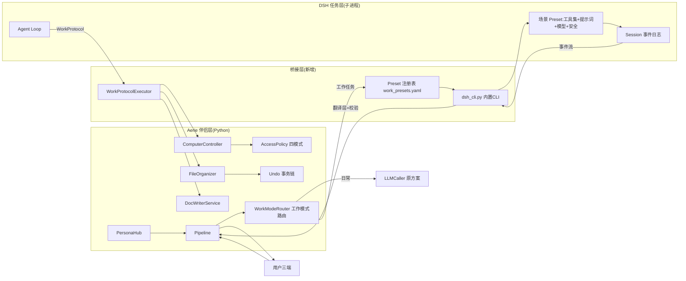
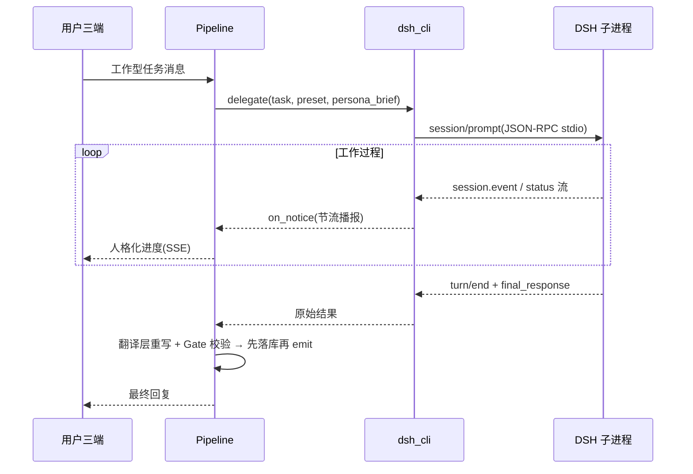
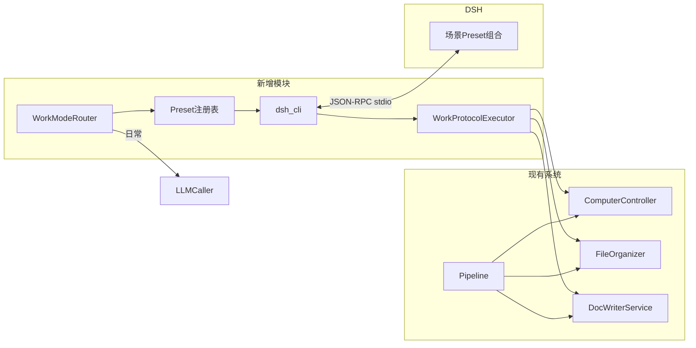

# Aerie · 云栖 × DeepSeek Harness 整合实施技术文档(正式版)

> **文档版本**:v2.0(正式实施版)· 2026-08
> **演进**:v1.0 为规划草案;v2.0 整合 Obsidian 知识库 `documents/AERIE_HARNESS/` 12 篇细化笔记,新增系统组件取舍分析(§8)与漏洞审查(§10),纳入 IF 线轻量路径 + 工作模式路由 + Preset 预设体系作为**推荐实施路径**。
> **配套知识库**:`documents/AERIE_HARNESS/`(Obsidian 互链版,含全部设计细节)

---

## 0. 文档说明与阅读指引

### 0.1 本文档结构

| 章节 | 内容 | 对应知识库笔记 |
|---|---|---|
| §1-2 | 双项目现状与总体架构(三条整合线) | Home、01 |
| §3 | 兼容性评估 | 08 |
| §4 | **模块接入方案设计**(接口规范/数据流/集成点/兼容性/交互) | 01、10、11、12 |
| §5 | **效果产出分析报告**(技术链路/贡献度模型/瓶颈) | 02 |
| §6 | **系统影响与效率提升评估**(性能/稳定/安全/UI) | 03 |
| §7 | **产出可靠性保障机制**(验证/质量/异常/监控) | 05 |
| §8 | **系统组件取舍分析**(文件/函数级) | 新增 |
| §9 | **开源方案技术调研**(多维评估) | 09 |
| §10 | **漏洞审查与风险对策** | 新增 |
| §11-13 | 路线图里程碑 / 资源 / 验收 | — |

### 0.2 术语表(先读)

| 术语 | 含义 |
|---|---|
| Aerie / Agent | 本项目的 Python 后端伴侣系统(前台"表演者") |
| DSH | DeepSeek Harness(`deepseek-harness` 仓库,后台"执行者") |
| LLMCaller | Aerie 现有多 Provider LLM 调用层(原 `core/brain.py`,已收敛改名) |
| WorkProtocol | DSH 规划输出、Aerie 执行的操作协议(JSON) |
| Preset | 工作场景专属 Agent 配置组合(工具/提示词/模型/安全/协议) |
| 形态 A/B/C | DSH 执行形态:全权(限定区)/ 规划+Aerie 执行 / 只规划待确认 |
| Pipeline | Aerie 消息主流水线(route→emotion→context→brain→persist→emit) |

---

## 1. 项目现状分析

### 1.1 Aerie · 云栖(v0.3.1-Beta.1)

**定位**:本地优先 AI 桌面伴侣。技术栈:Python 3.10+ / FastAPI 0.139 + uvicorn(单进程 asyncio)/ Electron 28(原生 JS 渲染)/ Flutter 移动端 / SQLite + ChromaDB(可选)/ NapCat QQ 桥。

**关键事实**(代码级核查,2026-08):

| 项 | 事实 |
|---|---|
| 主 API | `127.0.0.1:7890`,约 150 端点,无网络鉴权(CORS 全开,靠强制回环) |
| 移动网关 | `127.0.0.1:7891`(JWT Bearer + 限流 + SSE) |
| 实时通道 | SSE `/api/events/stream`(Last-Event-ID 重放);无入站 WS |
| 大脑页 | Cognition Panel v2,5 Tab:大脑中枢/自进化/电脑操控/文件整理/文档写作(**全部已实现**) |
| 核心模块 | `llm_caller.py`(原 brain.py)、`computer_control.py`(四模式+审批+审计)、`file_organizer.py`(preview/undo 事务链)、`doc_writer.py`、`tool_registry.py`、`memory/layers/`、`world_simulation.py` |
| 测试基线 | 127+ Python 测试文件、33 个 e2e、17 个 Electron 测试 |
| 许可 | 专有/闭源,商业集成需书面授权 |

### 1.2 DeepSeek Harness(v0.1.0-rc.5,MIT,开发者预览)

**定位**:插件化 Agent 运行时(一切皆插件,Cordis)。Node ^22.19/≥24、pnpm 11.7、TS 6(strict/ESM)。

**关键事实**:

| 项 | 事实 |
|---|---|
| Web GUI | `dsh web` → `127.0.0.1:3080`(HTTP `/api` + 双 WS;无认证,回环围栏) |
| Python SDK | `deepseek-harness-sdk`:stdio NDJSON JSON-RPC 驱动打包运行时;`RunResult(events/notifications/finish_reason/usage)` |
| 载体约束 | 生产 exe 仅 linux/macos wheel;**Windows 无生产载体**(需 node 模式或自建) |
| 能力 | session 事件日志 / agent-loop / tools / skill / subagent / workflow / goal / jobs / schedule / mcp-client / shell / fs / subprocess |
| 扩展点 | Cordis 插件 / 客户端插件(ui-slots、HMR)/ MCP / ACP / Typert RPC |
| 预设机制 | `packages/preset` + `ui-agent-preset` + `DSH_CORDIS_CONFIG` |

---

## 2. 整合形态与总体架构

### 2.1 三条整合线(可独立推进、可并行)

| 线 | 形态 | 投入 | 产出 | 知识库 |
|---|---|---|---|---|
| **L1 轻量 IF 线(推荐先行)** | 内置 CLI 单向委托;前台 Agent 表演 + 翻译,后台 DSH 执行;工作模式路由 + 场景 Preset | 3-6 周 MVP | 日常聊天零打扰;工作任务(文件/操控/写作)获得 DSH 规划能力 | 10、11、12 |
| L2 完整路线(原规划) | 双向整合:DSH 桥 + MCP 工具面 + 会话映射 + 记忆桥 + Web Console | 18 周 | DSH 也能用 Aerie 能力;浏览器 Console | 01-09 |
| L3 激进线 | HARNESS 生图闭环(提示词→生图→返回→展示全在 DSH 会话内) | 6-8 周(独立) | 生图可组合子代理、可恢复 | 07 |

### 2.2 推荐实施路径(本文档的正式路径)

```text
阶段0(勘察) → L1-MVP(IF线 + 工作模式路由 + Preset) → 按需演进:
   ├─ 需要 DSH 用 Aerie 能力 → L2 阶段2(MCP 服务面)
   ├─ 需要浏览器 Console → L2 阶段3
   └─ 需要生图编排 → L3(与 L1 互斥开关)
```

> 本文档 §4-§10 以 **L1 为正式实施路径** 展开,L2/L3 作为演进章节标注。

### 2.3 总体架构图



---

## 3. 兼容性评估

| # | 检查项 | 结论 | 处理 |
|---|---|---|---|
| C1 | Windows 载体 | ❌ 生产 exe 仅 linux/macos | node 模式先行 → SEA/pkg 自建 → 上游共建 |
| C2 | 双栈鉴权 | ⚠️ 双方 `/api` 均无认证 | 回环信任 + 独立 `x-aerie-dsh-token`;远程统一 Cloudflare Tunnel 网关 |
| C3 | 会话双写 | ⚠️ DSH log vs Aerie messages | 单向映射 + 摘要同步,不镜像(§4.6) |
| C4 | 跨进程上下文 | ⚠️ DSH 无跨进程 inject | `session/prompt` 注入 + 翻译层承担人格 |
| C5 | Node 版本 | ⚠️ Aerie 声明 20+ vs DSH ^22.19 | 运行时自带,不依赖系统 Node |
| C6 | 版本漂移 | 🔴 developer preview | 锁 commit + 快照测试 + 4 周升级窗口 |
| C7 | 许可证 | ⚠️ Aerie 专有 vs DSH MIT | 单向消费 + THIRD_PARTY_NOTICES 声明 |
| C8 | 端口 | ✅ 7890/7891/3080 无冲突 | 新增 7892(MCP 预留),端口可配 |
| C9 | 递归环 | ⚠️ 双向调用风险 | L1 单向委托无环;L2 加深度上限 + origin 标记 |
| C10 | i18n/主题 | ⚠️ 粉色系 vs 默认主题 | 设计令牌映射表;locale 补齐 zh-CN |

---

## 4. 模块接入方案设计

### 4.1 接入总原则

1. **渐进**:每阶段独立可发布(里程碑 M0→M4);
2. **可开关**:所有整合能力挂 feature flag(`dsh_cli_v1` / `work_mode_router_v1` / `harness_image_v1` …),默认 off,关闭=现状;
3. **可降级**:DSH 任何失败 → 任务类型回 LLMCaller 尽力而为,聊天零阻塞;
4. **契约优先**:接口先行(§4.5 协议规范),实现后置;
5. **不动既有 API**:只新增端点,不改旧端点语义/响应结构;
6. **依赖倒置**:`core/` 不 import `deepseek_harness`,经 Protocol 接口注入。

### 4.2 DSH 运行时桥(`core/dsh_cli.py`,新增,L1 核心)

**接入位置**:`main.py::_main()` 初始化(仿 `_start_optional_mobile_gateway` 模式,失败不致命);优雅关闭链挂载。

**接口规范**(类签名):

```python
# core/dsh_cli.py —— 内置 CLI 通道(L1)
class DshCli:
    async def ensure_running(self, preset: str | None = None) -> None: ...
    async def status(self) -> dict:
        """返回 {running, version, sessions, presets, uptime, degraded}"""
    async def delegate(self, task: str, *, preset: str, persona_brief: str,
                       on_notice: Callable[[dict], Awaitable[None]],
                       timeout_s: int = 600) -> DshRunResult: ...
    async def cancel(self, run_id: str) -> bool: ...
    async def list_sessions(self, persona_id: str) -> list[dict]: ...
    async def resume(self, session_id: str, task: str, *, on_notice, ...) -> DshRunResult: ...
    async def stop(self) -> None: ...          # flush 会话 + 终止子进程
```

**REST 端点**(新增,挂在 7890):

| 端点 | 方法 | 参数 | 返回 | 鉴权 |
|---|---|---|---|---|
| `/api/dsh/status` | GET | — | `{running, version, sessions, presets[], degraded}` | 回环 |
| `/api/dsh/run` | POST | `{task, preset, persona_id}` | `202 {run_id}` + SSE 进度 | 回环 |
| `/api/dsh/cancel/{run_id}` | POST | — | `{ok}` | 回环 |
| `/api/dsh/sessions` | GET | `?persona_id=` | `[{session_id, preset, created_at, last_active}]` | 回环 |

**数据流转路径**:



**关键集成点**:
- 插入点:`core/pipeline.py` brain 阶段前(路由判定);
- 事件汇入:复用 `chat_events.emit` → 既有 SSE,Electron/移动端零改动;
- 生命周期:复用 `napcat_launcher` 的进程拉起/探活/重启模式 + 24h watchdog 经验;
- 降级:`DshCli` 未启动/崩溃/熔断 → 路由恒走 LLMCaller。

### 4.3 工作模式路由(`core/work_mode_router.py`,新增)

**判定三层**(从便宜到贵):

| 层 | 机制 | 成本 | 动作 |
|---|---|---|---|
| L1 | 关键词正则(工作动词表:整理/归类/重命名/写文件/打开/点击/截图/执行命令/压缩/清理…) | 免费 | 命中且无歧义 → 委托 |
| L2 | 轻量模型三分类(日常/工作/其他,5s 超时) | 低 | 命中 → 委托(附可打断标记) |
| L3 | 用户显式(`/work 整理桌面` / UI 开关) | 用户可控 | 强制委托 |

**路由矩阵**(按「大脑」页任务类型):

| 任务类型 | 路由 | 执行形态 | 执行者 | 复用代码 |
|---|---|---|---|---|
| 日常聊天/情感/陪伴 | LLMCaller | — | Aerie | 零改动 |
| 大脑中枢(认知问答/检索) | LLMCaller | — | Aerie | 零改动 |
| 自进化 | 不委托 | — | Aerie 四道闸门 | 零改动 |
| 电脑操控 | DSH 规划 | 形态 B | Aerie `ComputerController` | AccessPolicy/审批/审计全复用 |
| 文件整理 | DSH 规划 | 形态 B | Aerie `FileOrganizer` | preview/undo 事务链全复用 |
| 文档写作 | DSH 执行或规划 | 形态 A / B | 混合 | DocWriterService |
| 生图 | 原方案 | — | Aerie image_service | 零改动(L3 激进线互斥开关) |

**执行形态定义**:

| 形态 | 含义 | 适用 | 安全约束 |
|---|---|---|---|
| A | DSH 全权执行 | 文档写作(限定工作区)、纯文件操作 | fs 根限定;shell 禁用或白名单为空 |
| B | DSH 规划 + Aerie 执行 | 电脑操控、文件整理(有 undo 需求) | DSH 无执行工具,只出协议 |
| C | DSH 只规划,用户确认 | 不可逆/批量操作 | 确认卡片复用对话框审批 UX |

### 4.4 Agent Preset 预设体系(新增 `config/work_presets.yaml`)

**核心思想**:每个工作场景一个专属 Agent(工具集 + 专业提示词 + 模型 + 安全边界 + 输出协议 的声明式组合);后期新增场景 = 加一段 YAML,零代码、可热加载。

**配置规范**:

```yaml
# config/work_presets.yaml(热加载,仿 settings.yaml)
presets:
  file-organizer:                     # preset 名 = 路由目标
    label: "文件整理"
    enabled: true                     # false = 场景不存在,路由回原方案
    dsh_cordis: "presets/file-organizer.cordis.yml"   # DSH 侧组合
    model: "deepseek-v4-flash"
    max_tokens: 16000
    session_pool: 1                   # 常驻会话数(懒启动)
    safety: {fs_roots: ["E:\\Downloads"], shell: disabled, network: disabled}
    protocol: "file_organize"         # 输出协议类型 → WorkProtocolExecutor
    persona_inject: true              # 注入 persona 投影 L1-L2
  computer-control:
    label: "电脑操控"
    enabled: true
    dsh_cordis: "presets/computer-control.cordis.yml"
    model: "deepseek-v4-flash"
    max_tokens: 24000
    session_pool: 1
    safety: {fs_roots: [], shell: disabled, network: disabled}
    protocol: "computer_control"
    persona_inject: true
```

**首批 5 预设**:`file-organizer` / `computer-control` / `doc-writer` / `research` / `coder`(设计详见知识库 12 号笔记 §2)。

**设计原则**:Preset 管「工作专业度」,Persona 管「表达人格」——正交组合,互不冲突。

**后期服务机制**:新增场景三步(写 preset → 注册执行器(仅新协议时)→ 热加载上线);中期做场景模板库与用户自建;远期 preset 导出/分享;self_evolve 可提议新建 preset。

### 4.5 WorkProtocol 操作协议(形态 B 核心契约)

**协议字段规范**:

| 字段 | 类型 | 必填 | 说明 |
|---|---|---|---|
| `protocol_version` | int | ✅ | 当前 1 |
| `task_type` | string | ✅ | `computer_control` / `file_organize` / `doc_write` |
| `persona_id` | string | ✅ | 角色隔离 |
| `session_id` | string | ✅ | DSH 会话溯源 |
| `goal` | string | ✅ | 任务目标(审计用) |
| `plan` | array/object | ✅ | 操作序列(见下) |

**computer_control 协议**(每条 op):

```json
{ "op": "shell_execute", "args": {"command": "dir E:\\Pictures\\screenshots", "cwd": null}, "expect": "list_files" }
```

op 枚举(与 `ComputerController` 方法一一对应):`shell_execute` / `type_text` / `key_press` / `hotkey` / `mouse_move` / `mouse_click` / `mouse_scroll` / `take_screenshot` / `focus_window` / `list_windows` / `uia_action`。

**file_organize 协议**:

```json
{ "protocol_version": 1, "task_type": "file_organize", "persona_id": "yita",
  "plan": {"source_dir": "E:\\Downloads", "mode": "preview_first",
           "rules": [{"pattern": "*.pdf", "category": "documents"}]} }
```

**doc_write 协议**:

```json
{ "protocol_version": 1, "task_type": "doc_write", "persona_id": "yita",
  "plan": {"doc_type": "weekly_report", "title": "本周进展", "content_md": "…"} }
```

**执行器接口规范**(`core/work_protocol.py`,新增,≈200 行):

```python
class WorkProtocolExecutor:
    async def execute(self, protocol: dict, *, source: str = "dsh") -> list[dict]:
        """解析协议并分发到既有安全管线。
        返回逐条执行结果: [{op, status: ok|denied|approved|rejected|failed, detail, audit_id}]
        异常: ProtocolError(未知 task_type / Schema 非法)
        """
```

**返回格式统一**:`{op, status, detail, audit_id}`;`status ∈ ok | denied(权限裁决拒绝)| approved(审批通过后执行)| rejected(审批拒绝)| failed`。

**执行安全红线**(每条 op 执行前):
1. `RestrictedShell.is_dangerous()` 危险命令硬闸(任何来源不可绕过);
2. `AccessPolicy.decide()` 四模式裁决(manual/auto/full/custom + 黑白名单);
3. 需审批 op → 复用 `request_approval/approve_action/reject_action`(对话框审批卡片,标注来源 DSH);
4. 审计落盘 `data/audit/`,标记 `source=dsh` 与 `session_id`。

### 4.6 会话映射与记忆桥

**会话映射**(L1 简化版):

| 映射 | 方向 | 用途 |
|---|---|---|
| `chat_log.id ↔ dsh_session_id` | 双向 | 三端消息可引用 DSH 任务结果 |
| `persona_id → 会话命名空间` | 单向 | 多角色隔离 |
| `preset + persona_id → 会话复用` | 单向 | 长任务续接 |

**记忆桥**(L2 阶段 2,可选):DSH `turn/end` 摘要 → LayeredMemory(Long-term,`source=dsh` 标签,权重低于用户直接记忆);Aerie 知识检索以 `knowledge_search` 工具进 DSH(L2 经 MCP,见 §4.7)。

### 4.7 MCP 服务面(演进 L2,阶段 2)

- 端点:`GET/POST /api/mcp/*`(streamable-http),建议独立 uvicorn 实例(端口 7892),避免与主 API 宽松 CORS 混挂;
- 首批工具:`aerie_world_state` / `aerie_emotion_state` / `aerie_send_qq_message` / `aerie_generate_image` / `aerie_computer_control`(需审批)/ `aerie_knowledge_search` / `aerie_proactive_trigger`;
- 鉴权:`x-aerie-dsh-token` 头(独立于 admin token);
- DSH 侧:配置 `@deepseek-ai/dsh-mcp-client`(serverName: `aerie`),工具自动注册 `mcp__aerie__*`,`零插件开发`。

### 4.8 Web Console(演进 L2,阶段 3)

- 路径 A:`dsh web` 子进程(3080 端口可配)Electron 内嵌(BrowserView/新窗口);
- 路径 B:DSH client 插件体系构建 Aerie Console(ConversationNode:`aerie/world-snapshot`、`aerie/image-result`、`aerie/emotion-badge`);
- 设计令牌映射 + zh-CN locale 补齐;远程访问复用 Cloudflare Tunnel 模式。

### 4.9 模块交互机制汇总



**交互机制要点**:
- 新增模块之间:Router → Preset → CLI → Executor 单向依赖;
- 新增 → 现有:Executor 直调 Controller 方法(不经过 tool_registry,避免与 LLM function calling 面互相污染);
- 现有 → 新增:仅 Pipeline 一个插入点(路由判定);
- DSH → 现有:零直接依赖(协议文本,经 stdio)。

---

## 5. 效果产出分析报告

### 5.1 整体功能技术链路

```
用户输入 → 意图分类(路由)→ [日常] LLMCaller 原方案 → 翻译层
                 └→ [工作] Preset 选择 → DSH 会话 → WorkProtocol → 安全管线执行
                 → 结果校验(Gate1-4)→ 先落库再 emit → 三端
依赖链: Persona投影 × Emotion状态 × 世界快照 → (注入 DSH prompt 或翻译层)
```

### 5.2 贡献度评估模型(量化权重)

> 权重 = 价值创造 × 用户可感知度 × 不可替代性(宏观估算,指导投入排序)

| 组件 | 贡献度 | 依据 | 投入阶段 |
|---|---|---|---|
| C1 人设/情感/关系(陪伴层) | 30% | Aerie 立身之本,DSH 不可替代 | 已有,持续维护 |
| C2 DSH 任务编排(任务层) | 25% | 能力上限来源;subagent/workflow 增量核心 | L1 起 |
| C3 路由 + 桥(体验层) | 15% | 判定错则整体体验归零;本身只做分配 | L1 |
| C4 记忆体系 | 15% | 连续性 + 长程经验沉淀 | L2 |
| C5 双向工具面 | 10% | DSH 用上 Aerie 手脚;MCP 低成本高杠杆 | L2 |
| C6 多端界面 | 5% | 触达渠道;Web Console 为增量 | L2-3 |

**关键成功因素**:路由判定准确(误伤 <2%)、翻译层质量(盲测 ≥ 基线)、权限不绕过(红线)、降级完备、协议 Schema 稳定。

**潜在瓶颈**:Windows 载体资源占用、懒启动首响应 +2-5s、双栈 token 成本、DSH 版本漂移(快照回归成本)、长任务会话资源。

---

## 6. 系统影响与效率提升评估

### 6.1 性能指标变化(基线 → 目标)

| 指标 | 基线 | 目标 | 提升 | 依赖 |
|---|---|---|---|---|
| 多步任务完成率(≥3 步) | ~35% | ≥75% | +40pp | 路由 + DSH 编排 |
| 任务人工介入率 | ~40% | ≤16% | ↓60% | 工具面 + 审批桥 |
| 长程任务耗时 | 多轮碎片化 | 单会话编排 | ↓50% | workflow/subagent |
| 复杂任务失败率 | ~30% | ≤10% | ↓67% | 重试/熔断 |
| 陪伴零阻塞率 | — | 100% | 硬指标 | 降级路径 |
| 委托首响应 | — | ≤3s(预热后) | — | 会话池 |

**资源影响**:内存 +150-300MB(node 模式,实测校准);磁盘 +80-120MB(node closure,SEA/exe 后降至 +60MB);端口新增 7892;进程新增 1 个 DSH 子进程(watchdog 托管)。

### 6.2 稳定性风险与安全影响

| 风险 | 等级 | 缓解 |
|---|---|---|
| DSH 子进程崩溃 | 🟠 | watchdog 拉起 ≤2 次 → 熔断 → 降级 |
| 会话资源泄漏 | 🟠 | 会话池空闲回收 + 24h 监控采集 |
| 双栈鉴权缺口 | 🔴 | 独立 token;远程统一网关(§10 漏洞 V2) |
| 协议越权 | 🔴 | 形态 B 全部过 AccessPolicy(§10 漏洞 V4) |
| 依赖冲突(pydantic 等) | 🟠 | 独立 venv/依赖隔离(§10 漏洞 V7) |

### 6.3 UI 更新内容

**Electron 桌面端**:
- 聊天气泡新增**任务进度卡片**(步骤/工具/耗时,完成后折叠);
- 灵动岛新增「任务进行中」胶囊状态(优先级:任务 > 未读 > 媒体);
- 审批卡片标注来源 DSH(复用既有对话框审批 UX);
- 设置页新增「工作场景」段(preset 开关/状态/预算/会话管理)。

**Web Console**(L2 阶段 3):对话页(任务轨迹/工具调用树)、世界面板、情感面板、人设编辑器、会话管理;视觉规范 = 设计令牌映射表(ita-pink ↔ 语义 token),zh-CN 词典。

**QQ/移动端**:委托任务结果以普通消息送达;进度合并为摘要式(1 条,防刷屏);移动端新增 `dsh_task` 消息类型渲染(结果卡片)。

---

## 7. 产出可靠性保障机制

### 7.1 验证流程(四层测试标准)

| 层 | 内容 | 标准 |
|---|---|---|
| 单元 | 路由判定 / 协议 Schema / 执行器 / 错误码映射 | pytest 纳入既有 127+ 体系;新代码覆盖率 ≥90% |
| 集成 | SDK mock 运行时 + 真实 node 模式冒烟;协议 ↔ 执行器契约 | 每次合并前全绿 |
| 系统 | 三端消息 → 委托 → 结果回显 E2E;preset 黄金样本三连断言(输入→协议→执行) | 33 个 e2e 扩展全绿 |
| 验收 | 里程碑验收清单(§13)+ 人格盲测 + 降级演练 | 文档化证据 |

### 7.2 质量控制指标

| 指标 | 阈值 |
|---|---|
| 代码覆盖率(新增模块) | ≥90%(行)/ 关键分支 100% |
| 委托任务成功率 | ≥75%(重试后) |
| Gate 拦截误伤率 | ≤2% |
| 人格黄金样本通过率 | ≥98% |
| 崩溃自动恢复时长 | ≤30s |
| 降级成功率 | 100% |
| 任务台账完整率 | 100%(每个 session 可复盘) |

### 7.3 异常处理方案

**错误码体系**(契约的一部分):

| 域 | 错误码 | 降级动作 |
|---|---|---|
| 桥 | `DSH_BRIDGE_NOT_RUNNING` / `DSH_RUNTIME_CRASHED` | 重启 ≤2 次 → 降级 LLMCaller |
| 会话 | `DSH_SESSION_NOT_FOUND` / `DSH_SESSION_CORRUPT` | 新建会话 + 提示 |
| 任务 | `DSH_TIMEOUT` / `DSH_MAX_TOKENS` / `DSH_TOOL_FAILED` | 幂等重试 → 降级 |
| 校验 | `GATE1_REJECT` / `GATE3_STYLE_FAIL` | 修正/重生成 → 确定性兜底 |
| 预算 | `DSH_BUDGET_EXCEEDED` | 拒绝委托,提示用户 |
| 协议 | `PROTOCOL_UNKNOWN_TASK` / `PROTOCOL_SCHEMA_INVALID` | 拒绝 + 审计告警 |

**熔断与重试**:首 token 30s / 总时长 10min 超时;幂等任务重试 2 次;5min 内失败 ≥3 次熔断 5min;熔断期路由恒走 LLMCaller。

**容灾与恢复**:DSH 会话 JSONL 持久化随 Aerie `data/dsh_sessions/` 备份;崩溃后会话可 resume(事件日志重放);升级前快照 + 24h 回滚窗口。

**审计**:decision_log 记录 `route=dsh/llm/fallback` 与原因;任务台账 JSONL;24h 监控扩展采集 DSH 子进程;吞错禁令(异常→默认值分支必须 `logger.warning` 落盘)。

### 7.4 持续监控机制

- 实时:24h_monitor 扩展(DSH 进程健康/RSS/CPU/崩溃次数);
- 会话:preset 池水位、任务时长分布、错误码分布;
- 成本:budget_tracker 归集 DSH usage(session event 自带记账);
- 质量:黄金样本回归(每次 DSH 升级/preset 变更自动跑);
- 告警:错误码超阈值 → 灵动岛/设置页提示 + 日志告警。

---

## 8. 系统组件取舍分析

> 基于代码级核查(2026-08):精确到文件路径/函数级别。三类决策:**删除 / 保留复用(含改造点)/ 待验证**。

### 8.1 建议删除(冗余 / 空壳 / 构建残留)

| # | 路径 | 现状(核查事实) | 删除理由 | 影响评估 | 处理 |
|---|---|---|---|---|---|
| D1 | `scheduler/`、`proactive/`、`emotion/`、`persona/`(顶层) | 仅 `__init__.py` + `__pycache__`;逻辑全部在 `core/`;**全库零 import 引用**(grep 验证) | 空壳占位,误导"目录即文档" | 无运行时影响;仅需确认无动态 import(`__import__` 扫描) | 删除;如保留作文档占位,放入 README 说明 |
| D2 | `aerie_mobile/` | 仅 `android/.gradle` 缓存(9.3.1) | 真正的客户端是 `android-client/`(Flutter);此为废弃空壳 | 无 | 删除 + `.gitignore` 防再入 |
| D3 | `electron/_tmp_asar_artifacts/` | 构建残留目录 | asar 构建中间产物,不应入库 | 无 | 删除 + `.gitignore` |
| D4 | `.trae-html-share-packages/`、`ita-river-loft-room.design-project/` | 外部设计项目/分享包 | 与本项目无关,混入主仓库 | 无;先确认主仓库 git 是否跟踪 | 移出仓库(归档到外部目录) |
| D5 | `_push.log`、`.coverage`、`.pytest_cache/`、`__pycache__/`、`.ruff_cache/` | 运行/测试缓存 | 不入库 | 无 | 清理 + `.gitignore` 补全 |

### 8.2 保留并复用(含改造内容)

| # | 组件(路径/函数) | 复用方式 | 所需改造 | 决策依据 |
|---|---|---|---|---|
| K1 | `core/computer_control.py`:`ComputerController` + `AccessPolicy` + `RestrictedShell` | 形态 B 执行器目标 | ① `_audit()` 增加 `source=dsh`、`session_id` 字段;② 新增协议入参适配(`from_protocol(op)` 方法,≈40 行);③ 审批卡片标注来源 | 安全体系完整(四模式+黑白名单+硬闸+审批+审计),历史 command_injection 教训不可绕 |
| K2 | `core/file_organizer.py`:`FileOrganizer` + `OrganizePlan` + `UndoManager` | 文件整理协议执行 | `execute_organize` 增加协议来源入参;无需改事务链 | preview→execute→undo 已是完整事务,直接受益 |
| K3 | `core/doc_writer.py`:`DocWriterService` + `Document` | 文档写作执行 | 协议入参适配(`doc_write` plan → `create_document`) | 已支持 md/html/docx/pdf |
| K4 | `core/llm_caller.py`(原 brain.py) | 日常路径不动 | **零改造** | 已收敛命名,多 Provider fallback 稳定 |
| K5 | `core/tool_registry.py` | 不动(Executor 直调 Controller,不注册新工具) | 零改造 | 避免与 LLM function calling 面互相污染 |
| K6 | `core/pipeline.py` | 唯一插入点(路由判定) | brain 阶段前插 `WorkModeRouter.decide()`(≈20 行);关闭开关时直通 | 主链路单点插入,最小侵入 |
| K7 | `core/chat_events.py` + `event_stream.py`(SSE) | 进度/结果推送 | 零改造(新消息类型 `dsh_task_card` 走既有 emit) | 三端已统一消费 |
| K8 | 三套鉴权模板:`admin`(门闩+Origin 白名单)/ `mobile`(Bearer+限流)/ `world`(Bearer+compare_digest) | 新增 dsh token 层的参照 | 新端点复用模板,不改旧实现 | 不发明新机制 |
| K9 | `core/push_scheduler.py` + `proactive_*.py` | 任务完成播报触发 | L2 增加 `dsh_task` 触发源(走既有 PushPolicy 频控) | 频控/静默时段零改动 |
| K10 | `memory/layers/`(LayeredMemory) | L2 记忆桥写入端 | 新增 `source=dsh` 标签与检索权重 | 四层架构成熟 |
| K11 | `core/napcat_launcher.py`(进程拉起模式)+ `scripts/24h_monitor*.py` | DSH 子进程托管/监控 | watchdog 增加 DSH 探活采集 | 复用崩溃拉起/断点续采经验 |
| K12 | `core/_hist_utils.py` | **保留,零改造** | 核查确认仍被 ContextBuilder/ContextAssembler 共用(审计 M2) | 活跃工具,勿删 |

### 8.3 待验证清单(验证后再决策)

| 项 | 验证内容 | 依据 |
|---|---|---|
| V-a | `core/` 全量死代码扫描(pyflakes/vulture)+ `persona_config.py` 与 persona_hub 的实际引用 | 历史多次收敛(brain→llm_caller),可能存在残余 |
| V-b | `skills/` 77 个技能的实际引用率(cloud 59/data 5/local 13) | 部分技能可能未被任何 preset/场景引用 |
| V-c | `docs/`、`documents/` 中过时文档(与 v0.3.1 不符的章节) | 大版本演进快,文档漂移 |
| V-d | 空壳目录删除前的动态 import 扫描(`importlib` 全库搜索) | 静态 grep 已零引用,动态路径待确认 |

### 8.4 决策原则

1. **删前有据**:删除项均给出核查事实与影响评估;
2. **保留优先**:活跃/被引用/安全相关的组件一律保留,K 类改造点控制在 40 行级;
3. **验证先行**:V-a~V-d 在 L1 MVP 前完成,避免误删;
4. **不进核心**:新增模块(dsh_cli/router/preset/executor)独立成文件,不混入既有模块。

---

## 9. 开源方案技术调研

### 9.1 多维评估矩阵

> 评估维度:功能匹配度(★1-5)、社区活跃度、维护状况、性能、学习曲线(低=易)、集成难度(低=易)。

| 方案 | 用途 | 功能 | 社区 | 维护 | 性能 | 学习 | 集成 | 建议 |
|---|---|---|---|---|---|---|---|---|
| **DeepSeek Harness**(本体) | Agent 编排 | ★5 | ★4 | ★4(官方,预览期) | ★4 | 中 | 中 | ✅ 唯一选择(L1 即用 SDK) |
| **deepseek-harness-sdk**(PyPI) | Aerie→DSH 桥 | ★5 | ★4 | ★4 | ★4 | 低 | **低** | ✅ 首选(官方,40 行示例) |
| **FastMCP**(jlowin/fastmcp, v3) | Aerie MCP 端点 | ★5 | ★5 | ★5 | ★4 | 低 | 低 | ✅ L2 首选 |
| **MCP Python SDK**(官方) | MCP 底层 | ★5 | ★5 | ★5 | ★4 | 中 | 中 | 备选(FastMCP 已封装其上) |
| **DSH mcp-client** | DSH 消费 Aerie 工具 | ★5 | ★4 | ★4 | ★4 | 低 | **低** | ✅ L2 直接使用(零插件开发) |
| **Node SEA**(官方) | Windows 单文件载体 | ★4 | ★5 | ★5 | ★4 | 中 | 中 | ⭐ C1 方案 B 首选 |
| **pkg**(yao-pkg 维护) | 同上 | ★4 | ★3 | ★3 | ★4 | 低 | 低 | 备选(成熟) |
| **pnpm pack-app** | 同上(pnpm 11) | ★4 | ★4 | ★4 | ★4 | 低 | 低 | 与 DSH pnpm 工作区契合 |
| **ComfyUI API** | 本地生图后端 | ★5 | ★5 | ★5 | ★3(需 GPU) | 中 | 中 | L3 可选后端(与 image_service 并存) |
| **ChromaDB** | 向量库 | ★4 | ★5 | ★5 | ★4 | 低 | 低 | ✅ 保持(Aerie 已集成) |
| **ONNX MiniLM**(chromadb 内置) | 本地 embedding | ★4 | ★5 | ★5 | ★4 | 低 | 低 | ✅ 保持(三档回退已有) |
| **sentence-transformers / FlagEmbedding** | embedding 升级 | ★4 | ★5 | ★5 | ★3 | 中 | 中 | 评估项 |
| **DSH session-query(SQLite FTS)** | 会话内检索 | ★4 | ★4 | ★4 | ★4 | 低 | 低 | ✅ L2 直接使用 |
| **awesome-dsh-plugin** | 插件目录索引 | ★4 | ★3 | ★3 | — | 低 | 低 | ⭐ 必读(找现成插件) |
| **deepseek-harness-for-codex** | **同构参考实现** | ★4 | ★3 | ★3 | — | 中 | 中 | ⭐ 重点参考(本地宿主委派 DSH 的完整先例) |
| **deepseek-harness-mcp**(npm) | DSH→MCP 封装参考 | ★4 | ★3 | ★3 | — | 低 | 低 | 参考 |

### 9.2 选型结论

- **任务编排**:只用 DSH,不引入第二套 Agent 框架(避免框架套框架);
- **桥接**:官方 Python SDK(L1)→ FastMCP(L2);
- **Windows 载体**:node closure(L1 立即用)→ Node SEA/pkg 自建(L2-3)→ 上游共建(长期);
- **生图**:Aerie image_service 默认(L1);ComfyUI 离线选项(L3);
- **参考实现**:deepseek-harness-for-codex 与 Aerie 场景同构(本地宿主委派 DSH + Web 会话查看),L1 MVP 前通读其代码。

---

## 10. 漏洞审查与风险对策

> 对 v1.0 草案 + L1/L2/L3 方案的系统性审查结果。**V1-V8 为 L1 必经项,V9+ 为演进项。**

### 10.1 漏洞清单(按严重度)

| # | 漏洞 | 影响 | 等级 | 对策 |
|---|---|---|---|---|
| V1 | **懒启动首响应延迟**(首次委托 +2-5s) | 体验 | 🟠 | 会话池预热(开机后台起 1 个默认 preset 会话);进度播报兜住等待感 |
| V2 | **双栈 API 无鉴权 + CORS 全开**(远程暴露面) | 安全 | 🔴 | 回环信任不变;`/api/dsh/*` 挂独立 `x-aerie-dsh-token`;远程一律 Cloudflare Tunnel 网关 + JWT |
| V3 | **persona_brief 隐私边界**:翻译层注入 DSH 的内容含关系细节 | 隐私 | 🔴 | brief 白名单字段(仅名字/语气/称呼);禁止关系史/隐私字段;注入前脱敏 |
| V4 | **WorkProtocol prompt injection 越权**:DSH 读取的文件内容可注入恶意指令 → 生成越权协议 | 安全 | 🔴 | 协议 Schema 校验;`is_dangerous()` 硬闸;敏感 op(shell/删除/移动)强制审批;执行器白名单(协议 op 枚举);DSH 读取内容过注入清洗 |
| V5 | **会话池 persona 串话**(复用 bug) | 隐私 | 🔴 | 会话键 = `preset + persona_id` 复合;会话创建时校验 persona 投影一致性;黄金样本隔离测试 |
| V6 | **形态 A fs 根限定绕过**(路径穿越/符号链接) | 安全 | 🔴 | fs_roots 规范化 + 符号链接解析校验;形态 A 仅限 `doc-writer` 等低危 preset;高危一律形态 B |
| V7 | **Python 依赖冲突**(deepseek-harness-sdk 与 Aerie 的 pydantic/httpx 版本) | 稳定 | 🟠 | 依赖隔离(独立 venv 或 pip 覆盖检查);requirements 冲突测试进 CI |
| V8 | **Electron 打包路径问题**(node closure 进 asar / extraResources 路径) | 稳定 | 🟠 | extraResources 放 asar 外;安装包验证清单;SEA 后消除 |
| V9 | **多 Aerie 实例竞争**(双实例拉起 DSH,端口/会话目录冲突) | 稳定 | 🟠 | 复用单实例锁 + DSH 会话目录按 instance_id 隔离;端口预检 |
| V10 | **杀软误报**(node 单文件 exe / node closure) | 部署 | 🟠 | 签名(exe 加签);白名单文档;SEA 最小化 |
| V11 | **翻译层信息丢失**(技术细节被轻量模型重写掉) | 体验 | 🟡 | 「技术细节折叠」:原始输出保留在结果卡片可展开(仿 opencloud 原型 PowerShell 折叠);翻译只改语气不改事实 |
| V12 | **预算归集遗漏**(DSH usage 未入 budget_tracker) | 成本 | 🟠 | 每次 `turn/end` 归集 `assistant/message.usage`;预算超限熔断委托 |
| V13 | **形态 A 审计缺口**(DSH 直接写文件不经审计) | 合规 | 🟠 | 形态 A 也记录协议级审计(操作摘要 + 哈希);倾向形态 B |
| V14 | **preset 热更新竞态**(运行中会话 vs 配置变更) | 稳定 | 🟡 | 热更新只影响新会话;存量会话优雅退役(完成后不再复用) |
| V15 | **审批超时挂起**(审批卡片无人处理) | 体验 | 🟡 | 审批 5min 超时默认拒绝 + 播报提示 |
| V16 | **记忆桥污染**(DSH 摘要含注入内容写入记忆) | 安全 | 🟠 | 写入前过 `prompt_injection` 清洗 + ConsistencyGate(L2) |
| V17 | **DSH 升级行为漂移**(快照盲区) | 质量 | 🟠 | 快照回归(协议/翻译输出)+ 黄金样本,三绿才发布;4 周升级窗口 |
| V18 | **循环委托**(用户/DSH 内容触发重复委托) | 成本 | 🟡 | 委托深度上限(≤2)+ `origin=dsh` 标记;DSH 结果不再触发路由 |

### 10.2 漏洞审查方法说明

- 结合 Aerie 历史教训(审查报告的 command_injection、吞错禁令、先落库再 emit、镜像状态级联);
- 结合 DSH 机制特性(无跨进程 inject、/api 无认证、preview 期漂移);
- 每项对策均映射到 §4-§7 的既有设计,无新增架构。

---

## 11. 开发路线图与里程碑

### 11.1 阶段总览(正式路径 = L1 先行 + L2/L3 按需)

| 阶段 | 周期 | 内容 | 里程碑 |
|---|---|---|---|
| 阶段 0 | 第 1-2 周 | 版本冻结;Windows node 模式 SDK PoC(实测资源,定 V1);组件取舍 V-a~V-d 验证;契约 v1 | **M0** PoC + 取舍清单通过 |
| 阶段 1(L1) | 第 3-6 周 | `dsh_cli.py` + 开关;工作模式路由(三层判定);`work_protocol.py` 执行器接入 ComputerController/FileOrganizer;翻译层 + Gate | **M1** 电脑操控/文件整理委托闭环,三端回显 |
| 阶段 2(L1) | 第 7-9 周 | Preset 体系(首批 5 预设 + 热加载);会话池;doc-writer/research/coder 场景;黄金样本与盲测 | **M2** 多场景可用,人格通过率 ≥98% |
| 阶段 3(L2 按需) | 第 10-13 周 | MCP 服务面(7892)+ 记忆桥;审批桥;DSH 升级窗口机制 | **M3** DSH 可用 Aerie 能力 |
| 阶段 4(L2 按需) | 第 14-17 周 | Web Console(client 插件);远程网关;SEA Windows 载体;i18n/主题 | **M4** 浏览器 Console + 远程可用 |
| 阶段 5(发布) | 第 18 周 | 打包/文档/协议更新;24h 长稳;发布 Aerie 0.4 | **M5** 正式发布 |

> L3(生图闭环)独立 6-8 周,与阶段 1-2 并行时用 `harness_image_v1` 互斥开关隔离。

### 11.2 每阶段交付物

| 阶段 | 代码 | 测试 | 文档 |
|---|---|---|---|
| 0 | SDK PoC 脚本 | 资源基线记录 | 契约 v1 / 取舍清单 |
| 1 | dsh_cli/router/executor | 单元 + 集成 + 降级演练 | 协议规范(§4.5)落地 |
| 2 | preset 注册表 + 池 | 黄金样本 + 隔离回归 | 场景模板库 v1 |
| 3 | MCP + 记忆桥 | 契约快照 + 工具面测试 | MCP 工具目录 |
| 4 | Console 插件 + 网关 | E2E + 安全测试 | 用户文档 + 令牌规范 |
| 5 | 打包产物 | 24h 长稳 + 验收清单 | 发布说明 + 第三方声明 |

---

## 12. 资源需求

| 角色 | 投入 | 说明 |
|---|---|---|
| Python 后端工程师 | 1 人全职(阶段 0-2);阶段 3+ 兼职 | 桥/路由/执行器/MCP/记忆桥 |
| 前端/Electron 工程师 | 阶段 2 兼职,阶段 4 全职 | 进度卡片/设置页/Console 插件/主题 |
| DSH 侧(TS)工程师 | 0.5 人(阶段 3 起) | Cordis 组合/preset 文件/SEA 构建 |
| 测试工程师 | 0.5 人(阶段 1 起) | 契约/黄金样本/长稳/安全测试 |
| 文档/运营 | 0.5 人(阶段 2,4-5) | 模板库/用户文档/协议更新 |

**基础设施**:现有 GitHub Actions 扩展 Windows 构建;模型 API 增量预算(双栈);Windows 打包机;可选 Cloudflare Tunnel。

**总投入**:L1(阶段 0-2)约 **9 周 / 2-3 人**;完整 L2(至阶段 5)约 **18 周 / 3-4 人**。

---

## 13. 预期成果与验收标准

### 13.1 预期成果

1. **能力增强**:工作任务(文件/操控/写作/研究/代码)获得 DSH 多步规划能力,成功率 +40pp;
2. **零打扰**:日常陪伴聊天 100% 原方案,人格盲测 ≥ 基线;
3. **安全不降级**:所有执行过 AccessPolicy,审计可溯,漏洞 V2/V4 对策落地;
4. **可运营**:预设热加载,新增场景三步上线;自进化可提议新 preset;
5. **演进路径清晰**:L1 → L2(MCP/Console)→ L3(生图闭环)按需叠加,代码零废弃。

### 13.2 里程碑验收清单(硬性)

- [ ] M0:SDK PoC 在 Windows node 模式跑通,资源实测记录;组件取舍清单评审通过;
- [ ] M1:路由误伤 <2%(黄金样本);电脑操控/文件整理闭环三端回显;降级演练(DSH 崩溃→聊天零中断)通过;
- [ ] M2:5 预设可用;人格通过率 ≥98%;preset 热加载与隔离回归通过;
- [ ] M3(MCP):`mcp__aerie__*` 工具端到端;记忆桥写入经清洗与 ConsistencyGate;
- [ ] M4(Console):浏览器 Console 可用;远程仅经统一网关;SEA 载体安装验证;
- [ ] M5:127+ 既有测试全绿 + 新增测试全绿;24h 长稳无泄漏;发布说明与第三方声明齐备。

---

## 附录 A · 分析依据

- **一手阅读**:Aerie `main.py`/`README.md`/`CHANGELOG.md`/`requirements.txt`/`core/api_server.py`(244 路由)/`core/computer_control.py`/`core/file_organizer.py`/`core/doc_writer.py`/`core/tool_registry.py`/`core/mobile_gateway.py`/`world_service/main.py`/`electron/src/*`;DSH `README.zh.md`/`AGENTS.md`/`docs/architecture.md`/`docs/subsystems/session.md`/`python/sdk*/README`/`apps/*`/`packages/client|mcp|api|schedule` 等;
- **四路子代理深度分析**:Aerie 后端/前端/功能模块/DSH 架构(只读);
- **代码核查**:组件取舍(§8)与漏洞审查(§10)均基于本次 grep/文件核查事实;
- **外部调研**:web_search(2026-08)FastMCP/Node SEA/pkg/Agent 框架/ComfyUI/DSH 社区生态。

## 附录 B · 与知识库对照

| 本文档章节 | 知识库笔记 |
|---|---|
| §2 三线架构 | [[AERIE_HARNESS_Home]] |
| §4.2-4.3 | [[10-if线-前台Agent后台DSH-内置CLI模式]]、[[11-工作模式路由-大脑任务委托DSH]] |
| §4.4 | [[12-Agent预设体系-工作场景专属Preset]] |
| §4.5 | [[11-工作模式路由-大脑任务委托DSH]] §4 |
| §5 | [[02-效果产出分析]] |
| §6 | [[03-影响与效率提升]] |
| §7 | [[05-产出可靠性保障]] |
| §4.7-4.8 | [[01-模块接入方案]] |
| §8 | 本次新增(知识库待补 13 号笔记) |
| §9 | [[09-开源方案调研]] |
| §10 | 本次新增(知识库待补 14 号笔记) |
