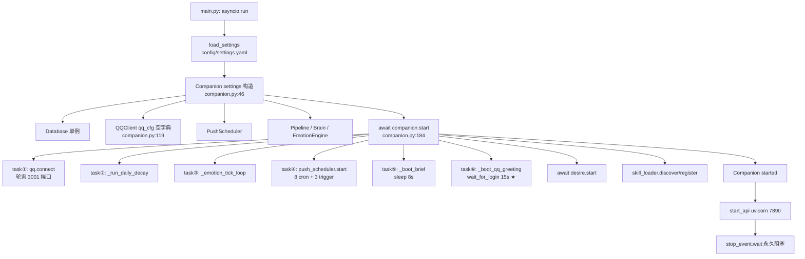
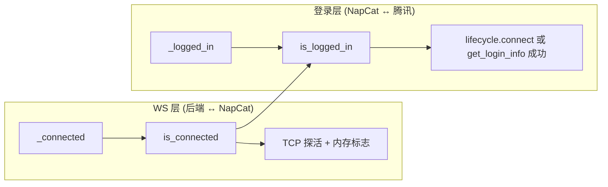
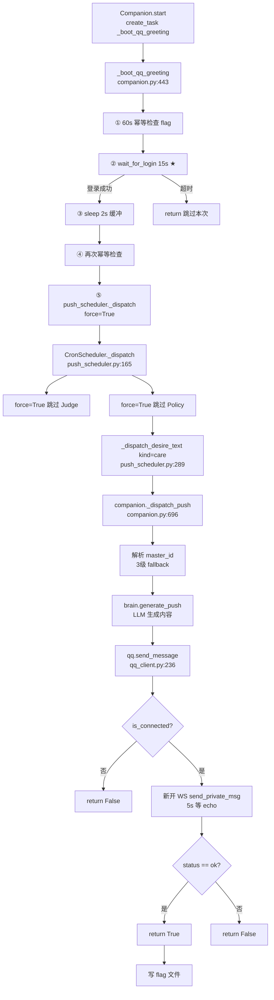

# QQ Login Timing Investigation

> [!abstract] 概述
> 本文记录了对 Aerie · 云栖 项目 **QQ 登录时序问题** 的完整调研过程。用户反馈重启后端后 `get_login_info` 警告持续出现，且怀疑 boot_greeting 在 QQ 未就绪时就被发送。经三路深度调研（启动时序 / QQ 客户端 / Push 调度器），定位到真正的根因是 `_learn_self_id` 方法的 **echo 匹配逻辑缺失**，而非登录时序问题。

## 1. 调研背景

### 1.1 现象

重启后端后日志出现：

```
21:16:37,769 QQ WS connected to ws://127.0.0.1:3001
21:16:37,770 QQ client learned self_id=3998874040
21:16:37,771 QQ lifecycle connect: account online (self_id=3998874040)
21:16:44,152 QQ -> 3998874040: 刚醒，盯着屏幕看你头像发呆。快回我。
21:16:53,076 QQ client could not learn self_id via get_login_info  ← 警告
```

- boot_greeting **发送成功**（消息已投递）
- 但 `get_login_info` 在 15 秒后仍然失败 → 打印误导性警告

### 1.2 之前的错误修复

> [!warning] 第一次修复（R8.1+）的偏差
> - 新增 `is_logged_in` / `wait_for_login` / `lifecycle.connect` 信号
> - **效果**：boot_greeting 能正常发送了（lifecycle.connect 让 wait_for_login 秒返回）
> - **问题**：`get_login_info` 仍然失败，警告照旧 → 用户感觉"越改越乱"
> - **根因**：没有修复 `_learn_self_id` 的 echo 匹配 bug，只是用 lifecycle.connect 绕过了它

## 2. 项目启动时序

### 2.1 完整启动链路



### 2.2 关键时序点

| 时间点 | 事件 | 位置 |
|--------|------|------|
| T=0 | `asyncio.run(_main())` | [main.py:177](file:///e:/Agent_reply/main.py#L177) |
| T=0 | `Companion(settings)` 构造 | [main.py:91](file:///e:/Agent_reply/main.py#L91) |
| T=ε | 6 个 create_task 几乎同时 schedule | [companion.py:190-204](file:///e:/Agent_reply/core/companion.py#L190-L204) |
| T=ε+0.5s | `[READY] Aerie ready` | [main.py:145](file:///e:/Agent_reply/main.py#L145) |
| T=NapCat-port-open | `qq.connect()` 检测到端口 → 建 WS | [qq_client.py:142](file:///e:/Agent_reply/communication/qq_client.py#L142) |
| T=login | `_login_event.set()` → `wait_for_login` 返回 | [qq_client.py:224](file:///e:/Agent_reply/communication/qq_client.py#L224) |

### 2.3 NapCat 启动方式

> [!info] NapCat 不会被后端自动启动
> - 后端 `qq.connect()` 只**等待**端口开放，不启动 NapCat
> - 用户需在 Electron UI 手动点击"启动 NapCat"
> - 启动链路：UI click → IPC → `/api/napcat/start` → `NapcatLauncher.start()` → `Popen(launcher-user.bat)`

## 3. QQ 客户端交互逻辑

### 3.1 连接状态分层



> [!important] 两层状态的区分
> - `is_connected` = WS 层连通（后端能连到 NapCat）
> - `is_logged_in` = QQ 账号在线（NapCat 能连到腾讯服务器）
> - **关键**：WS 连上 ≠ QQ 登录。`send_message` 只检查 `is_connected`，不检查 `is_logged_in`

### 3.2 self_id 学习机制（被动 + 主动）

| 方式 | 触发点 | 可靠性 |
|------|--------|--------|
| **被动学习** | 任何 OneBot11 事件携带 `self_id` 字段 | ✅ 可靠（lifecycle/message/notice 都带） |
| **主动学习** | `_learn_self_id` 调用 `get_login_info` RPC | ❌ **有 bug**（见下文） |

### 3.3 _learn_self_id 的 echo 匹配 bug

> [!bug] 根因：只 recv 一次，没有循环匹配 echo
> `_learn_self_id` 每次重试都新开 WS 连接，但 NapCat 在新连接建立后会**先推送 `lifecycle.connect` 事件**，然后才处理 API 请求。
>
> `_learn_self_id` 只 `recv()` 一次，收到的第一个帧是 lifecycle 事件（没有 `data.user_id`），判断失败。5 次重试每次都这样。

**对比 `send_message`（正确实现）vs `_learn_self_id`（bug）**：

| 对比项 | `send_message` ✅ | `_learn_self_id` ❌ |
|--------|-------------------|---------------------|
| recv 模式 | `while` 循环 recv | 只 recv **一次** |
| echo 匹配 | 按 `echo` 字段精确匹配 | 按 `data.user_id` 结构匹配 |
| 遇到 lifecycle 帧 | 跳过继续 recv | **放弃本次重试** |
| 代码位置 | [qq_client.py:270-290](file:///e:/Agent_reply/communication/qq_client.py#L270-L290) | [qq_client.py:318](file:///e:/Agent_reply/communication/qq_client.py#L318) |

**NapCat lifecycle 事件结构**（没有 `data` 字段）：

```json
{
  "time": 123456,
  "self_id": 3998874040,
  "post_type": "meta_event",
  "meta_event_type": "lifecycle",
  "sub_type": "connect"
}
```

`_learn_self_id` 的匹配条件 `data.get("data").get("user_id")` 返回 `None` → 跳过 → 退出 `async with` → 进入下一次重试 → 又收到 lifecycle → 又失败...

## 4. Push 调度器与 boot_greeting 链路

### 4.1 boot_greeting 完整调用链



### 4.2 master_id 三级 fallback

> [!warning] settings.yaml 缺失 qq 段
> 当前 `config/settings.yaml` 没有 `qq` 段，导致 `master_id = settings.qq.self_qq` 永远是 0。

```
master_id 解析顺序（companion.py:711-723）:
  1. settings.qq.self_qq  → 0（配置缺失）
  2. SELF_QQ env          → 3998874040（环境变量设置）
  3. self.qq.self_id      → 3998874040（被动学习到）
```

### 4.3 幂等性机制

- **flag 文件**：`data/boot_greeting_last_sent.flag`
- **窗口**：60 秒（快速重启防刷屏）
- **写入时机**：仅当 `send_message` 返回 True 才写
- **失败不写**：下次启动可重试

## 5. 同类 bug 扩散

> [!danger] 4 个方法都有"只 recv 一次"的 bug

| 方法 | 位置 | 单次 recv 行 | 影响 |
|------|------|-------------|------|
| `_learn_self_id` | [qq_client.py:318](file:///e:/Agent_reply/communication/qq_client.py#L318) | `resp = await asyncio.wait_for(ws.recv(), timeout=3)` | 启动时误导性警告 |
| `recall_message` | [qq_client.py:361](file:///e:/Agent_reply/communication/qq_client.py#L361) | `resp = await asyncio.wait_for(ws.recv(), timeout=5)` | 撤回消息可能失败 |
| `send_poke` | [qq_client.py:388](file:///e:/Agent_reply/communication/qq_client.py#L388) | `resp = await asyncio.wait_for(ws.recv(), timeout=3)` | 戳一戳可能失败 |
| `send_message_with_segments` | [qq_client.py:437](file:///e:/Agent_reply/communication/qq_client.py#L437) | `resp = await asyncio.wait_for(ws.recv(), timeout=5)` | 分段消息可能失败 |

只有 `send_message`（[qq_client.py:270-290](file:///e:/Agent_reply/communication/qq_client.py#L270-L290)）实现了正确的「循环 recv + echo 匹配 + 跳过无关帧」模式。

## 6. 修复方案

### 6.1 核心修复：提取公共 `_rpc_call` 方法

在 [qq_client.py](file:///e:/Agent_reply/communication/qq_client.py) 中新增公共 RPC 方法，实现循环 recv + echo 匹配：

```python
async def _rpc_call(
    self, action: str, params: dict, timeout: float = 5.0
) -> dict | None:
    """Send a OneBot11 RPC on a fresh WS, loop recv until echo match.

    NapCat pushes lifecycle/heartbeat events on every new WS connection.
    We must loop recv() and skip non-matching frames (like send_message does),
    otherwise the first frame received is a lifecycle event, not our RPC reply.

    Returns the full response dict (with echo/status/data fields), or None
    on timeout/failure. Caller is responsible for checking status/data.
    """
    if not self.is_connected:
        return None
    echo_tag = f"rpc_{uuid.uuid4().hex[:12]}"
    payload = {"action": action, "params": params, "echo": echo_tag}
    url = f"ws://{self.host}:{self.port}"
    try:
        async with websockets.connect(
            url, ping_interval=None, close_timeout=2,
        ) as ws:
            await ws.send(json.dumps(payload))
            deadline = asyncio.get_event_loop().time() + timeout
            while asyncio.get_event_loop().time() < deadline:
                try:
                    resp = await asyncio.wait_for(
                        ws.recv(),
                        timeout=max(0.5, deadline - asyncio.get_event_loop().time()),
                    )
                except asyncio.TimeoutError:
                    return None
                data = json.loads(resp)
                if data.get("echo") == echo_tag:
                    return data  # caller checks status/data
                # skip non-echo frames (lifecycle/heartbeat/unrelated)
                logger.debug("RPC %s: skip non-echo frame: %.80s", action, resp)
    except Exception as e:
        logger.debug("RPC %s failed: %s", action, e)
        return None
```

### 6.2 改造 4 个方法

| 方法 | 改造方式 |
|------|---------|
| `_learn_self_id` | `rpc_call("get_login_info", {}, 3)` → 从 `data.data.user_id` 取 self_id |
| `recall_message` | `rpc_call("delete_msg", {"message_id": id}, 5)` → 检查 `status == "ok"` |
| `send_poke` | `rpc_call("send_poke", {"user_id": id}, 3)` → 检查 `status == "ok"` |
| `send_message_with_segments` | `rpc_call("send_private_msg", {...}, 5)` → 检查 `status == "ok"` |

### 6.3 保留的改动

- ✅ `is_logged_in` / `wait_for_login`（boot_greeting 前置检查）
- ✅ `lifecycle.connect` 信号（快速解除阻塞，实际可用）
- ✅ `_learn_self_id` 成功时 set `_login_event`（修复 echo 后会真正生效）
- ✅ `calendar_manager` query_all→query

### 6.4 不做的改动（避免过度设计）

> [!tip] 范围控制
> - ❌ 不改 `send_message` 加 `is_logged_in` 检查（影响范围大，boot_greeting 已有前置）
> - ❌ 不改 settings.yaml 加 qq 段（master_id 三级 fallback 能工作）
> - ❌ 不改 15s 超时（当前场景够用）

## 7. 验证方法

### 7.1 修复前日志特征

```
QQ lifecycle connect: account online (self_id=3998874040)
QQ -> 3998874040: 刚醒...（发送成功）
QQ client could not learn self_id via get_login_info  ← 警告
```

### 7.2 修复后预期日志

```
QQ lifecycle connect: account online (self_id=3998874040)
QQ client learned self_id=3998874040 via get_login_info  ← 成功
QQ -> 3998874040: 刚醒...（发送成功）
（无警告）
```

### 7.3 验证步骤

1. 重启后端（`tools/restart.bat`）
2. 观察日志：`get_login_info` 警告应消失
3. 确认 `learned self_id via get_login_info` INFO 出现
4. 确认 boot_greeting 正常发送

## 8. 关键文件索引

| 文件 | 关键位置 | 说明 |
|------|---------|------|
| [main.py](file:///e:/Agent_reply/main.py) | L58 `_main`, L91 `Companion()`, L144 `start_api` | 启动入口 |
| [core/companion.py](file:///e:/Agent_reply/core/companion.py) | L184 `start`, L204 `_boot_qq_greeting` task, L443 `_boot_qq_greeting`, L481 `wait_for_login`, L696 `_dispatch_push` | Companion 核心 |
| [communication/qq_client.py](file:///e:/Agent_reply/communication/qq_client.py) | L55 `__init__`, L112 `wait_for_login`, L131 `connect`, L224 lifecycle 信号, L236 `send_message`, L295 `_learn_self_id` | QQ 客户端 ★ |
| [core/push_scheduler.py](file:///e:/Agent_reply/core/push_scheduler.py) | L165 `_dispatch`, L227 boot_greeting 分支, L289 `_dispatch_desire_text` | Push 调度 |
| [core/brain.py](file:///e:/Agent_reply/core/brain.py) | L422 `generate_push`, L486 `self.chat` | LLM 调用 |
| [config/settings.yaml](file:///e:/Agent_reply/config/settings.yaml) | 完整文件 | 缺 qq/napcat 段 |
| [config/proactive.yaml](file:///e:/Agent_reply/config/proactive.yaml) | L56-61 boot_greeting scene | scene 定义 |

---

> [!quote] 调研结论
> 真正的根因不是"启动时序倒置"，而是 `_learn_self_id` 的 **echo 匹配逻辑缺失**。之前的 R8.1+ 改动用 `lifecycle.connect` 信号绕过了这个问题（让 boot_greeting 能发送），但 `get_login_info` 本身的 bug 没修，导致警告照旧。正确修复方式是提取公共 `_rpc_call`