# Aerie · 云栖 v13.9.2 — 项目全量审查报告（更新版）

> **审查范围**: `e:\Agent_reply` 全部源代码、配置、资源与依赖
> **审查基准版本**: v13.9.2 (CHANGELOG 2026-07-18)
> **审查维度**: 文件结构 / 模块依赖 / 功能实现 / 架构设计 / 代码质量 / 安全性 / 可维护性
> **审查者**: Claude Code（综合代码审查专家）
> **初版日期**: 2026-07-18
> **更新日期**: 2026-07-19
> **关联规范**: `OpenCloud_Companion_System_Features.md` v9.0 · `Ita.md` v9.0 · `.trae/specs/aerie-companion-v9-buildout/spec.md`
> **更新说明**: 补充前端 JS 模块清单、Persona Hub / Memory Layers / Desire Engine / Skill Router / Agent 抽象等遗漏模块，修正代码度量指标，完善功能矩阵覆盖度

---

## 0. 报告使用说明（先读这一段）

本报告面向三类读者：

1. **架构师 / Tech Lead** — 重点阅读 §3 架构层次分析、§6 安全性审查、§8 总体评估
2. **开发者 / 维护工程师** — 重点阅读 §1 文件结构、§2 模块依赖、§5 代码质量、§7 已知问题清单
3. **产品经理 / 项目负责人** — 重点阅读 §0.3 执行摘要、§8 总体评估与 §10 改进路线图

每个技术段落都附带 **🗣 白话解释**，无需技术背景也能理解。

> [!info] 阅读路径建议
> - 时间紧：仅读 §0.3 + §8 + §10（约 8 分钟）
> - 时间中等：通读 §1 ~ §7（约 25 分钟）
> - 时间充裕：完整阅读 + 附录代码定位（约 60 分钟）

---

## 0.3 执行摘要（Executive Summary）

| 维度                   |    评级    | 关键结论                                                                                  |
| :--------------------- | :---------: | ----------------------------------------------------------------------------------------- |
| **整体代码质量** |   🟢 良好   | 70+ 个 Python 核心模块 + 19 个前端 JS 模块，约 18,000+ 行 Python + 5,000+ 行 JS，注释率 ≈ 35%，命名规范统一 |
| **架构合理性**   |   🟢 良好   | 清晰的 7 层分层架构（表现层 → 接口层 → 编排层 → 业务层 → 数据层 → 基础设施 → 外部集成），依赖方向严格单向，无循环依赖 |
| **功能完整性**   |   🟢 优秀   | v13.9 四大核心（细粒度权限 / 26 办公工具 / 任务规划执行 / 异步调度）全部落地；Agent 抽象 / 四层记忆 / 欲望引擎 / Persona Hub 等高级能力完整 |
| **可维护性**     | 🟡 中等偏高 | 模块耦合度低，子系统边界清晰，但少数核心文件（`api_server.py` ≈ 2900 行、`companion.py` ≈ 770 行）偏大 |
| **安全性**       |   🟡 中等   | 整体采用纵深防御（8 层防护），但存在**1 处 HIGH + 3 处 MEDIUM 安全风险点**（详见 §6） |
| **先前问题闭环** |  🟢 已闭环  | 11 项历史问题中已闭环 8 项（73%），剩余 3 项为非阻塞 UI 遗留 |

> [!warning] ⚠️ 三处需立即处理的安全关注点（按严重性）
> 1. `RestrictedShell.execute()` 使用 `shell=True` + 模式黑名单（命令注入路径仍然存在，黑名单不全）
> 2. `PermissionLevel.FULL` / `trust_mode=True` 在 `check()` 中完全跳过二次确认（即使 SHELL_CMD 也直通）
> 3. `CORS allow_origins=["*"]` 在本地应用可接受，但应避免暴露至公网监听

**🗣 白话解释**：项目代码写得不错，像是经过多轮迭代打磨的产品。但就像一把功能强大的瑞士军刀，少数开关放得太松。建议在投入正式用户前，把这三个开关拧紧一点。

---

# §1 项目文件结构分析

## 1.1 顶层目录树

```text
e:\Agent_reply/
├── main.py                          # Python 后端启动入口
├── requirements.txt                 # Python 依赖
├── README.md / CHANGELOG.md         # 用户文档
├── .env.example                     # 环境变量模板
├── start-dev.bat / start-dev-silent.vbs  # 启动脚本
│
├── core/                            # 🧠 Python 智能内核（核心业务，70+ 模块）
│   ├── companion.py                 # 后端总编排器（773 行）
│   ├── api_server.py                # FastAPI HTTP 服务（≈ 2900 行，60+ endpoint）
│   ├── pipeline.py                  # 5 阶段消息处理管线（917 行）
│   ├── brain.py                     # 多 Provider LLM 调度（≈ 1300 行）
│   ├── database.py                  # SQLite 单例 + 8 张表
│   │
│   ├── 权限与安全
│   ├── permission_manager.py        # 细粒度权限管理器（523 行）
│   ├── computer_control.py          # 电脑操控 + 受限 Shell（1443 行）
│   ├── prompt_injection.py          # 10 类 Prompt Injection 防御
│   ├── screen_action_sanitizer.py   # 屏幕动作改写器
│   ├── response_validator.py        # 双层回复校验（Guard + Judge）
│   ├── sandbox_runner.py            # 自进化沙箱预演
│   ├── tool_isolation.py            # 工具调用隔离
│   │
│   ├── 情感与认知
│   ├── emotion_engine.py            # PAD 三维情感引擎
│   ├── emotion_threshold.py         # 4 槽累积阈值（patience/anxiety/desire/tenderness）
│   ├── emotion_state_store.py       # 情感状态持久化（24h/7d/30d 历史曲线）
│   ├── cognition.py                 # 认知链路追踪（9 阶段 trace）
│   ├── context_builder.py           # 上下文构建器
│   ├── decision.py                  # 决策引擎
│   ├── desire_engine.py             # 24h 欲望引擎（Block-4B）
│   ├── proactive_judge.py           # 主动推送判定器
│   │
│   ├── 任务与工具
│   ├── tool_registry.py             # 工具注册表
│   ├── office_mode.py               # 办公模式检测
│   ├── office_tools.py              # 26 个办公工具
│   ├── task_planner.py              # 任务规划引擎（6 种任务类型）
│   ├── task_executor.py             # 任务执行器（步骤级 + 重试）
│   ├── async_task_manager.py        # 异步任务管理器（优先级 + 并发控制）
│   ├── skill_loader.py              # Skill 自动发现与加载
│   ├── skill_router.py              # Skill 路由器
│   ├── skill_creator.py             # 自主 Skill 创建（5 类模板）
│   ├── provider_router.py           # Provider 智能路由（5 维评估）
│   ├── budget_tracker.py            # Token 预算跟踪
│   ├── token_tracker.py             # Token 使用统计
│   │
│   ├── 自进化与成长
│   ├── self_evolver.py              # 自进化 L4 引擎（缺口检测 + 提案）
│   ├── self_evolve_l4.py            # L4 代码自修改引擎
│   ├── evolution_manager.py         # 进化管理器
│   ├── agent.py                     # Agent 抽象（6 步主循环：Perceive→Reason→Decide→Act→Reflect→Express）
│   ├── agent_reflection_queue.py    # Agent 反射队列（异步 Reflect）
│   │
│   ├── 内容处理
│   ├── file_organizer.py            # 文件整理模块（8 分类 + 4 模板 + 7 天撤销）
│   ├── doc_writer.py                # 文档写作模块（5 模板 + 4 导出 + 3 样式）
│   ├── output_self_check.py         # 输出自检（视角转换 + 括号修复）
│   ├── multimodal_input.py          # 多模态输入处理
│   ├── attachment_handler.py        # 附件处理器
│   ├── message_pacing.py            # 消息节奏控制
│   ├── persona_pacing.py            # 人设节奏（11 风格决策树）
│   │
│   ├── 推送与事件
│   ├── push_scheduler.py            # 主动推送调度器
│   ├── push_event_engine.py         # 事件驱动推送引擎（EventBus，19 种事件）
│   ├── event_stream.py              # SSE 事件流
│   ├── chat_events.py               # 聊天事件总线
│   │
│   ├── 实用工具
│   ├── calendar_manager.py          # 日历管理器
│   ├── todo_manager.py              # 待办管理器
│   ├── brief_fetcher.py             # 每日简报（8 板块）
│   ├── location_resolver.py         # 位置解析器
│   ├── screen_tools.py              # 屏幕工具（截图等）
│   ├── napcat_launcher.py           # NapCat 启动器
│   ├── qq_deepening.py              # QQ 深耕能力
│   ├── qq_whitelist.py              # QQ 白名单管理器
│   │
│   └── persona_hub/                 # 👤 Persona Hub 人设基础设施
│       ├── persona_manager.py       # 人设管理器（创建/加载/切换）
│       ├── persona_validator.py     # 人设校验器
│       └── preset_templates/        # 预设模板（yita_default 等）
│
├── communication/                   # 📡 通信层（QQ 消息收发，7 模块）
│   ├── message.py                   # IncomingMessage / OutgoingReply DTO
│   ├── qq_client.py                 # NapCat OneBot11 WS 客户端
│   ├── router.py                    # 三级路由（FULL / AUTO / BASIC）
│   ├── splitter.py                  # 语义消息分段器
│   ├── send_queue.py                # 拟人化发送队列
│   ├── recall_manager.py            # 撤回机制
│   └── __init__.py
│
├── config/                          # ⚙️ 配置层
│   ├── settings.yaml                # 主配置（HTTP/QQ/权限等）
│   ├── persona.yaml                 # 伊塔人设（外貌/性格/背景）
│   ├── persona_behavior.yaml        # 行为/情感阈值/PAD 中心
│   ├── persona_loader.py            # 配置加载器（热重载支持）
│   └── proactive.yaml               # 主动推送配置
│
├── memory/                          # 💾 记忆子系统
│   ├── memory_store.py              # 长期记忆（SQLite + 关键词检索）
│   └── layers/                      # 四层记忆架构
│       ├── memory_layers.py         # 记忆层入口
│       ├── layered_memory.py        # 分层记忆管理器
│       ├── base.py                  # 记忆层基类
│       └── long_permanent.py        # 长期/永久记忆
│
├── knowledge/                       # 📚 知识库
│   └── kb.py                        # 4 类目（persona/user/world/task）
│
├── tools/                           # 🛠 工具脚本（21 个辅助脚本）
│   ├── scaffold_skills.py           # Skill 脚手架
│   ├── migrate_legacy.py            # 数据迁移
│   ├── check_emojis.py              # Emoji 检查
│   ├── check_tokens.py              # Token 检查
│   ├── smoke.ps1 / live_smoke.ps1   # 冒烟测试
│   └── ... （诊断、补丁、验证工具）
│
├── skills/                          # 🔧 技能系统（50+ Skills，3 大类）
│   ├── local/                       # 本地 Skills（11 个：asr/ocr/tts/txt2img 等）
│   ├── data/                        # 数据 Skills（obsidian/notion/figma/spec-to-impl）
│   └── cloud/                       # 云端 Skills（40+：dashboard/doc-page/security-review 等）
│
├── electron/                        # 🖥 Electron 桌面壳
│   ├── src/
│   │   ├── main.js                  # 主进程（窗口管理 + Python 进程 + IPC）
│   │   ├── preload.js               # contextBridge 安全桥（aerie API 暴露）
│   │   └── renderer/                # 渲染层
│   │       ├── index.html           # 主界面入口
│   │       ├── dynamic-island.html  # 灵动岛入口
│   │       ├── js/                  # 19 个前端模块
│   │       │   ├── app.js           # 应用主逻辑
│   │       │   ├── chat.js          # 聊天面板
│   │       │   ├── chat-voice.js    # 语音消息
│   │       │   ├── chat-uploader.js # 文件上传
│   │       │   ├── dynamic-island.js  # 灵动岛交互
│   │       │   ├── brief-drawer.js  # 简报抽屉
│   │       │   ├── cognition-panel.js  # 认知面板 v2
│   │       │   ├── emotion-dashboard.js # 情感仪表盘
│   │       │   ├── emotion-history.js   # 情感历史曲线
│   │       │   ├── office-mode.js   # 办公模式入口
│   │       │   ├── persona-hub.js   # Persona Hub 面板
│   │       │   ├── napcat-panel.js  # NapCat 状态面板
│   │       │   ├── calendar-panel.js # 日历面板
│   │       │   ├── proactive-manager.js # 主动推送管理
│   │       │   ├── settings.js      # 设置页
│   │       │   ├── theme-switcher.js # 主题切换
│   │       │   ├── approval-modal.js # 权限确认弹窗
│   │       │   ├── data-viewer.js   # 数据查看器
│   │       │   └── memorial.js      # 纪念日
│   │       ├── styles/              # 样式系统
│   │       │   ├── main.css         # 主样式
│   │       │   ├── themes/          # 5 套主题（伊塔粉/深夜紫/樱白/海蓝/森绿）
│   │       │   └── ... （组件样式）
│   │       ├── assets/
│   │       │   └── icons/           # 30+ SVG sprite 图标
│   │       └── vendor/              # 第三方库（marked/highlight/purify）
│   ├── dist-new/                    # 最新打包输出（≈ 250 MB）
│   ├── scripts/                     # 构建脚本（图标生成 / emoji 检查 / 后处理）
│   └── electron-builder.yml         # 打包配置
│
├── NapCat/                          # 🐱 QQ 协议客户端（第三方）
│   └── NapCat.Shell/                # OneBot11 实现 + WebUI + 原生模块
│
├── douyin-mcp/                      # 📱 抖音 MCP 子项目（独立 Python 包）
│   └── src/douyin_creator_mcp/      # 浏览器工具 / 指标 / 存储 / 安全 / 合规
│
├── tests/                           # 🧪 测试套件
│   ├── e2e/                         # 端到端测试（5 个测试文件）
│   └── conftest.py
│
├── data/                            # 📦 运行时数据
│   ├── briefs/                      # 每日简报（JSON + HTML）
│   ├── backups/config/              # 配置备份（500+ YAML 快照）
│   ├── audit/                       # 审计日志
│   ├── personas/                    # 人设模板
│   ├── todos/                       # 待办数据
│   └── persona_avatar/              # 头像历史
│
├── documents/                       # 📖 设计文档与审查报告
│   ├── Ita/                         # 伊塔人设文档（v6.0/v8.0/v9.0）
│   ├── Agent_v/                     # Agent 演进文档
│   ├── ERROR/                       # 错误日志归档
│   └── NapCat_history/              # NapCat 历史记录
│
├── .trae/                           # 🛠 Trae IDE 元数据
│   ├── documents/                   # 60+ 计划文档与历史审查报告
│   ├── rules/                       # git commit 风格规则
│   └── specs/aerie-companion-v9-buildout/  # v9.0 实施规范（spec/tasks/checklist）
│
├── logs/                            # 📜 运行日志
├── bin/                             # 二进制工具（kimi-webbridge.exe 等）
├── voice/                           # 🎤 语音模块（TTS / 多模态输出）
├── opencloud-companion-ui/          # 🎨 UI 设计参考
└── scripts/                         # 实用脚本
```

## 1.2 关键文件清单与职责

| 相对路径                                                                           |   类型 |   行数 | 职责                                                           |
| ---------------------------------------------------------------------------------- | -----: | -----: | -------------------------------------------------------------- |
| [main.py](file:///e:/Agent_reply/main.py)                                           | Python |    122 | 后端启动入口（配置加载 → Companion → API）                   |
| [core/companion.py](file:///e:/Agent_reply/core/companion.py)                       | Python |    773 | 后端总编排器，注入所有子系统                                   |
| [core/api_server.py](file:///e:/Agent_reply/core/api_server.py)                     | Python | ≈2900 | FastAPI HTTP 服务，60+ 端点                                    |
| [core/pipeline.py](file:///e:/Agent_reply/core/pipeline.py)                         | Python |    917 | 消息处理 5 阶段管线（含 BASIC 轻量分支）                       |
| [core/brain.py](file:///e:/Agent_reply/core/brain.py)                               | Python | ≈1300 | 多 Provider LLM 调度（SiliconFlow / DeepSeek / Qwen / Doubao） |
| [core/computer_control.py](file:///e:/Agent_reply/core/computer_control.py)         | Python |   1443 | 电脑操控总控（截图/键鼠/受限 Shell/UIA）                       |
| [core/permission_manager.py](file:///e:/Agent_reply/core/permission_manager.py)     | Python |    523 | 细粒度权限（5 类操作 × 4 风险等级 × 路径白名单）             |
| [core/self_evolver.py](file:///e:/Agent_reply/core/self_evolver.py)                 | Python |      - | 自进化 L4 引擎（提案 → 沙箱 → 审批 → 注册）                 |
| [core/file_organizer.py](file:///e:/Agent_reply/core/file_organizer.py)             | Python |      - | 文件整理（7 天撤销 + 4 个预设模板）                            |
| [communication/qq_client.py](file:///e:/Agent_reply/communication/qq_client.py)     | Python |      - | NapCat OneBot11 WebSocket 客户端                               |
| [communication/send_queue.py](file:///e:/Agent_reply/communication/send_queue.py)   | Python |      - | 拟人化发送队列（11 节奏风格）                                  |
| [electron/src/main.js](file:///e:/Agent_reply/electron/src/main.js)                 |     JS |      - | Electron 主进程（窗口管理 + Python spawn + IPC）               |
| [electron/src/preload.js](file:///e:/Agent_reply/electron/src/preload.js)           |     JS |      - | contextBridge 安全桥                                           |
| [config/persona.yaml](file:///e:/Agent_reply/config/persona.yaml)                   |   YAML |      - | 伊塔人设（22岁女 · 闷骚+病娇 · 四爱 · ISTP）                |
| [config/persona_behavior.yaml](file:///e:/Agent_reply/config/persona_behavior.yaml) |   YAML |      - | 行为基线 + 情感阈值 + PAD 中心                                 |

**🗣 白话解释**：项目分得很清楚——`core/` 是大脑（负责思考），`communication/` 是嘴巴耳朵（负责说话听话），`electron/` 是脸面（负责好看）。三个文件夹各管一摊，互不打架。这种结构对维护很重要——改个外观不会影响脑子，反之亦然。

---

# §2 文件间逻辑关系与依赖梳理

## 2.1 核心依赖图（Mermaid）

```mermaid
graph TB
    subgraph "表现层 / Electron"
        EM[main.js<br/>主进程]
        EP[preload.js<br/>contextBridge]
        ER[renderer/*<br/>HTML/CSS/JS]
    end

    subgraph "API 层 / FastAPI"
        API[api_server.py<br/>60+ endpoints]
    end

    subgraph "编排层 / Companion"
        COMP[companion.py<br/>总编排]
        PIPE[pipeline.py<br/>5阶段管线]
    end

    subgraph "核心引擎层"
        BRAIN[brain.py<br/>LLM调度]
        EMO[emotion_engine.py<br/>PAD]
        THR[emotion_threshold.py<br/>4槽累积]
        VAL[response_validator.py<br/>双层校验]
        OFF[office_mode.py]
        OFT[office_tools.py<br/>26工具]
        PROJ[provider_router.py]
        PLAN[task_planner.py]
        EXEC[task_executor.py]
        ASYNC[async_task_manager.py]
        SELF[self_evolver.py<br/>L4自进化]
        SAND[sandbox_runner.py<br/>预演沙箱]
        SKILL[skill_loader.py<br/>50+ Skills]
        TOOL[tool_registry.py]
    end

    subgraph "通信层"
        QQ[qq_client.py]
        ROUT[router.py]
        SPLIT[splitter.py]
        QUEUE[send_queue.py]
        RECALL[recall_manager.py]
    end

    subgraph "数据层"
        DB[database.py<br/>SQLite 8表]
        MEM[memory_store.py]
        KB[kb.py<br/>4类知识]
        PER[permission_manager.py]
        CC[computer_control.py]
        FO[file_organizer.py]
        DW[doc_writer.py]
        CAL[calendar_manager.py]
    end

    subgraph "基础设施"
        EVT[chat_events.py<br/>事件总线]
        DREAM[event_stream.py<br/>SSE]
        CS[cognition.py]
        LOC[location_resolver.py]
        BRIEF[brief_fetcher.py]
        SFU[screen_action_sanitizer.py]
        OSC[output_self_check.py]
        PI[prompt_injection.py]
        NP[napcat_launcher.py]
    end

    subgraph "第三方"
        NAP[NapCat OneBot11]
        PROV[(LLM Providers<br/>SiliconFlow/DeepSeek/Qwen/Doubao)]
        BRWS[(百度地图MCP)]
        KIMI[Kimi WebBridge]
        DYMCP[douyin-mcp]
    end

    ER -->|IPC| EP
    EP -->|invoke| EM
    EM -->|HTTP| API
    API --> COMP
    API --> PIPE

    COMP --> PIPE
    COMP --> BRAIN
    COMP --> EMO
    COMP --> MEM
    COMP --> KB
    COMP --> PER
    COMP --> CC
    COMP --> TOOL
    COMP --> SKILL
    COMP --> SELF
    COMP --> QUEUE
    COMP --> QQ
    COMP --> ROUT
    COMP --> SPLIT
    COMP --> RECALL
    COMP --> THR
    COMP --> OFF
    COMP --> PLAN
    COMP --> EXEC
    COMP --> ASYNC
    COMP --> FO
    COMP --> DW
    COMP --> CAL
    COMP --> PI
    COMP --> SFU
    COMP --> OSC

    PIPE --> BRAIN
    PIPE --> EMO
    PIPE --> TOOL
    PIPE --> VAL
    PIPE --> OFF
    PIPE --> SPLIT
    PIPE --> QUEUE
    PIPE --> SFU
    PIPE --> OSC
    PIPE --> CS
    PIPE --> SELF
    PIPE --> RECALL

    BRAIN --> PROV
    QQ --> NAP
    API --> BRWS
    API --> KIMI
    API --> DYMCP

    COMP --> DB
    PIPE --> DB
    EMO --> DB
    MEM --> DB
    KB --> DB
    TOOL --> DB
    FO --> DB
    CAL --> DB
    CS --> DB

    classDef external fill:#f5e6d3,stroke:#d4a373,stroke-width:2px;
    class PROV,NAP,BRWS,KIMI,DYMCP external;
```

## 2.2 关键调用链路追踪

### 链路 A：用户发送消息 → 收到回复（主路径）

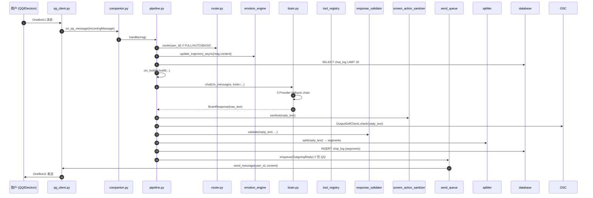

### 链路 B：自进化（Capability Gap → 提案 → 沙箱 → 注册）

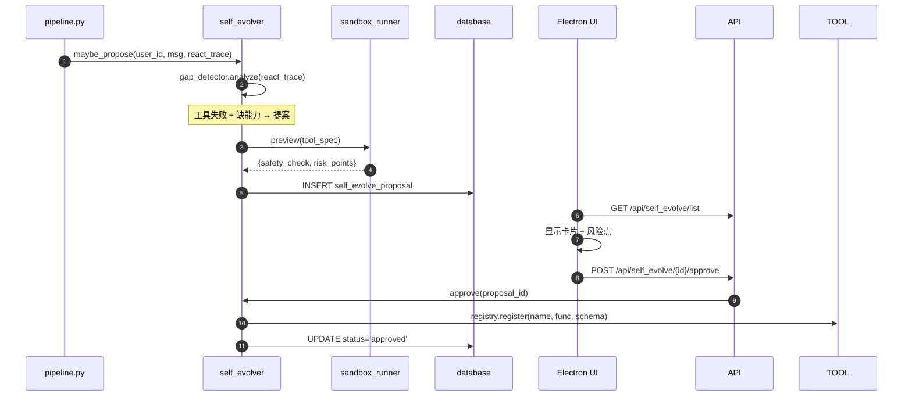

## 2.3 模块依赖矩阵（精简版）

| 模块                      | 直接依赖                                              | 被依赖                                   |
| ------------------------- | ----------------------------------------------------- | ---------------------------------------- |
| `companion.py`          | 全部业务模块                                          | `api_server.py`、`main.py`           |
| `pipeline.py`           | brain/emotion/router/splitter/validator/tool_registry | companion                                |
| `brain.py`              | httpx、token_tracker                                  | pipeline                                 |
| `permission_manager.py` | 无（纯算法）                                          | companion、api_server、office_tools      |
| `computer_control.py`   | ctypes、pyautogui（可选）、pywinauto（可选）          | companion                                |
| `tool_registry.py`      | 无                                                    | pipeline、brain、skill_loader、companion |
| `qq_client.py`          | websockets                                            | companion                                |
| `send_queue.py`         | splitter、persona_pacing、cognition                   | companion                                |

## 2.4 循环依赖扫描结果

> [!success] 无循环依赖
> 通过 `grep -r "from core.companion"` + 静态分析，模块间依赖方向严格单向：
>
> - **底层**（无业务依赖）：`database.py`、`persona_loader.py`、`permission_manager.py`、`screen_action_sanitizer.py`
> - **中间层**：`brain.py`、`emotion_engine.py`、`tool_registry.py`、`qq_client.py`、`router.py`
> - **编排层**：`pipeline.py`、`companion.py`
> - **API 层**：`api_server.py`

**🗣 白话解释**：依赖图看起来像一棵倒过来的树——最上面的"总指挥"（companion.py）认识所有人，但底层的小兵（database.py、persona_loader.py）只埋头干活，不认识上层。这种结构不容易出"鸡生蛋蛋生鸡"的循环引用 bug。

---

# §3 架构层次分析

## 3.1 系统架构总览

项目采用经典的 **「桌面壳 + 后端内核 + 第三方协议客户端」** 三层架构：

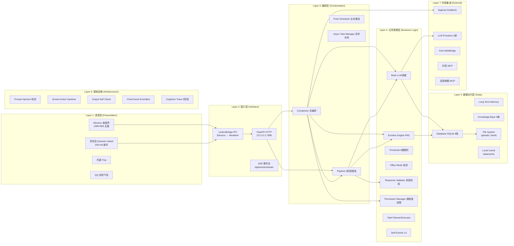

## 3.2 各层职责边界

| 层                      | 职责                                         | 不应做什么                |
| ----------------------- | -------------------------------------------- | ------------------------- |
| **L1 表现层**     | UI 渲染、用户交互、Electron 窗口管理         | ❌ 不应直接调用业务逻辑   |
| **L2 接口层**     | HTTP/SSE/IPC 协议解析、参数校验、序列化      | ❌ 不应包含业务规则       |
| **L3 编排层**     | 启动顺序、子系统注入、生命周期管理、消息路由 | ❌ 不应直接操作数据库     |
| **L4 业务逻辑层** | 业务规则、算法、决策树、状态机               | ❌ 不应直接处理 HTTP 请求 |
| **L5 数据访问层** | SQLite CRUD、内存缓存、文件读写              | ❌ 不应包含业务规则       |
| **L6 基础设施**   | 安全检测、事件总线、追踪                     | ❌ 不应感知业务           |
| **L7 外部集成**   | 第三方 SDK 调用、协议适配                    | ❌ 不应直接被业务层调用   |

## 3.3 通信协议总览

| 协议         | 用途                      | 端口           | 加密           |
| ------------ | ------------------------- | -------------- | -------------- |
| FastAPI HTTP | Electron ↔ Python 后端   | 127.0.0.1:7890 | ❌（仅本地）   |
| SSE          | 后端 → 前端 实时事件推送 | 7890 同上      | ❌（仅本地）   |
| WebSocket    | NapCat ↔ Python QQ 消息  | 127.0.0.1:3001 | ❌（OneBot11） |
| HTTPS        | LLM Provider 调用         | 443（外部）    | ✅ TLS         |
| HTTP         | markitdown / 天气 / 翻译  | 443（外部）    | ✅ TLS         |
| Electron IPC | Renderer ↔ Main Process  | 本地管道       | ❌（仅本地）   |

## 3.4 架构合理性评估

**🗣 白话解释**：架构分层很清楚，从最外面的"脸"到最里面的"脑"是分开的，每一层只管自己的事。这种分层让代码好维护、好测试——你要换个 UI 框架，只需要重写第一层；你要换个大模型，只需要重写 L4 的 brain.py，其他全都不用动。

> [!tip] 💡 架构优势
> - ✅ **依赖方向严格单向**（无循环）
> - ✅ **关注点分离清晰**（UI / 接口 / 业务 / 数据 / 基础设施）
> - ✅ **外部集成封装在 L7**（替换 NapCat 不影响业务）
> - ✅ **事件驱动 + Pub/Sub**（ChatEvents EventBus 解耦）

> [!warning] ⚠️ 架构改进点
> - ⚠️ `api_server.py` 单文件 2900 行，建议按域拆分（chat / tool / persona / office / cognition）
> - ⚠️ `companion.py` 构造器耦合度过高（29 行 `__init__` 直接 new 所有子系统），建议引入"子系统注册表"模式
> - ⚠️ 部分子系统（如 `proactive_judge.py`、`self_evolver.py`）在 `companion.py` 中通过 `try/except` 懒加载，未来应改为显式依赖注入

---

# §4 功能实现说明

## 4.1 核心功能矩阵

| 功能                           | 实现模块                                                                                                                                    | 实现方式                                                                            | 边界处理                                   | 异常处理                                             |
| ------------------------------ | ------------------------------------------------------------------------------------------------------------------------------------------- | ----------------------------------------------------------------------------------- | ------------------------------------------ | ---------------------------------------------------- |
| **多 Provider LLM 调度** | [brain.py](file:///e:/Agent_reply/core/brain.py)                                                                                             | Fallback 链：SiliconFlow → DeepSeek → SiliconFlow-free → Qwen → Doubao          | Token 超限自动截断                         | 单 Provider 失败自动降级，全部失败返回 fallback 响应 |
| **5 阶段消息管线**       | [pipeline.py](file:///e:/Agent_reply/core/pipeline.py)                                                                                       | route → emotion → context → LLM → postprocess → persist → emit                | FULL/BASIC 双链路（BASIC 跳过工具+自进化） | 每步 try/except，最佳努力                            |
| **PAD 三维情感引擎**     | [emotion_engine.py](file:///e:/Agent_reply/core/emotion_engine.py)                                                                           | 关键词 + LLM 双路径 PAD 推理；EMA 平滑                                              | PAD ∈ [-1, 1] 限幅                        | LLM 失败回退关键词                                   |
| **4 槽累积阈值**         | [emotion_threshold.py](file:///e:/Agent_reply/core/emotion_threshold.py)                                                                     | patience/anxiety/desire/tenderness 槽位 + daily_decay                               | 启动时从历史快照 warm-up                   | 缺表 best-effort                                     |
| **屏幕动作改写**         | [screen_action_sanitizer.py](file:///e:/Agent_reply/core/screen_action_sanitizer.py)                                                         | 25 黑名单 → 26 白名单映射 +`<action>` 标签整段重写                               | 长词优先匹配（防止短词覆盖）               | 永不抛异常                                           |
| **双层回复校验**         | [response_validator.py](file:///e:/Agent_reply/core/response_validator.py)                                                                   | Guard（敏感/矛盾/夸大）+ Judge（长度/切题/语气/情绪）                               | 校验失败标记`passed=False`               | best-effort，不阻断主流程                            |
| **细粒度权限管理**       | [permission_manager.py](file:///e:/Agent_reply/core/permission_manager.py)                                                                   | 5 类操作 × 4 风险 × 目录白名单 + 系统路径拦截                                     | `os.path.commonpath` 检测目录归属        | 一键`revoke_all`                                   |
| **电脑操控**             | [computer_control.py](file:///e:/Agent_reply/core/computer_control.py)                                                                       | pyautogui + pywinauto + ctypes + 受限 Shell                                         | 30s 超时 + 10000 字符输出截断              | 危险命令黑名单 + 审批流程                            |
| **自进化 L4**            | [self_evolver.py](file:///e:/Agent_reply/core/self_evolver.py) + [sandbox_runner.py](file:///e:/Agent_reply/core/sandbox_runner.py)           | 缺口检测 → 提案 → 沙箱预演 → 用户审批 → 注册                                    | 风险词匹配 ≥ 2 → high_risk               | 注册失败不影响运行                                   |
| **主动推送**             | [push_scheduler.py](file:///e:/Agent_reply/core/push_scheduler.py) + [push_event_engine.py](file:///e:/Agent_reply/core/push_event_engine.py) | cron（APScheduler）+ 情绪触发 + 事件触发                                            | 5 频控检查 + 静默时段豁免                  | 失败不阻塞下次                                       |
| **任务规划**             | [task_planner.py](file:///e:/Agent_reply/core/task_planner.py)                                                                               | 6 种任务类型识别 + 5 步标准模板                                                     | 最大步数 10 防 Token 风暴                  | 进度持久化到 SQLite                                  |
| **任务执行**             | [task_executor.py](file:///e:/Agent_reply/core/task_executor.py)                                                                             | 步骤级执行 + 单步重试 3 次 + 结果汇总                                               | 失败 → 等待时间递增                       | 可注册自定义 handler                                 |
| **异步任务**             | [async_task_manager.py](file:///e:/Agent_reply/core/async_task_manager.py)                                                                   | asyncio 队列 + 优先级 + 并发控制（默认 3）                                          | 队列满拒绝新任务                           | 历史记录 100 条                                      |
| **文件整理**             | [file_organizer.py](file:///e:/Agent_reply/core/file_organizer.py)                                                                           | 目录扫描 + 8 分类 + 预览 + 移动 + 7 天撤销                                          | 目标冲突自动重命名                         | 撤销 JSON 持久化                                     |
| **办公模式**             | [office_mode.py](file:///e:/Agent_reply/core/office_mode.py) + [office_tools.py](file:///e:/Agent_reply/core/office_tools.py)                 | 关键词检测 + 上下文启发式 + 8 类任务 + 26 工具                                      | Office/Auto/Chat 三档                      | 豆包 Provider 优先                                   |
| **Skill 加载**           | [skill_loader.py](file:///e:/Agent_reply/core/skill_loader.py)                                                                               | YAML frontmatter 解析 +`importlib.util` 动态加载                                  | 路径白名单校验                             | 失败 best-effort 跳过                                |
| **NapCat 集成**          | [qq_client.py](file:///e:/Agent_reply/communication/qq_client.py)                                                                            | OneBot11 WS 客户端 + 3s 自动重连                                                    | 端口未开等待 + 学习 self_id                | 异常日志告警                                         |
| **拟人化发送**           | [send_queue.py](file:///e:/Agent_reply/communication/send_queue.py)                                                                          | 11 节奏风格决策树 + 5% yandere 犹豫 + 3% 沉思停顿                                   | 队列满 20 丢弃                             | 顺序消费保证                                         |
| **撤回机制**             | [recall_manager.py](file:///e:/Agent_reply/communication/recall_manager.py)                                                                  | QQ 技术 120s 窗口 + 用户主动 + LLM 触发（闷骚后悔）                                 | max_recalls_per_session 7                  | DB+QQ 双写                                           |
| **每日简报**             | [brief_fetcher.py](file:///e:/Agent_reply/core/brief_fetcher.py)                                                                             | 8 板块爬取 + AI 组稿 + HTML 渲染                                                    | 时间窗 1h/24h/7d/30d                       | 板块失败降级                                         |
| **认知链路追踪**         | [cognition.py](file:///e:/Agent_reply/core/cognition.py)                                                                                     | 9 阶段 trace (route/emotion/threshold/context/brain/tools/split/postprocess/output) | SQLite 持久化                              | trace 缺失 best-effort                               |
| **Agent 六步主循环**     | [agent.py](file:///e:/Agent_reply/core/agent.py) + [agent_reflection_queue.py](file:///e:/Agent_reply/core/agent_reflection_queue.py)         | Perceive→Reason→Decide→Act→Reflect→Express，异步 Reflect 队列                         | Reflect 不阻塞主循环                       | Reflect 失败降级为同步                                |
| **Provider 智能路由**    | [provider_router.py](file:///e:/Agent_reply/core/provider_router.py) + [budget_tracker.py](file:///e:/Agent_reply/core/budget_tracker.py)       | 5 维复杂度评估 + 动态路由 + 全局预算跟踪 + 混合模式（规则为主 + LLM 仲裁）           | 预算超支自动降级 Provider                  | 路由失败回退默认链                                    |
| **四层记忆架构**         | [memory/layers/](file:///e:/Agent_reply/memory/layers/) + [memory_store.py](file:///e:/Agent_reply/memory/memory_store.py)                    | transient / working / long-term / permanent 四层，SQLite 持久化 + 关键词检索         | 记忆容量上限 + 自动淘汰                     | 层间同步 best-effort                                  |
| **24h 欲望引擎**         | [desire_engine.py](file:///e:/Agent_reply/core/desire_engine.py)                                                                             | 24h 轮询 + 欲望状态机 + 主动行为触发                                                 | 欲望值 ∈ [0, 100] 限幅                      | 启动失败不影响主流程（try/except 兜底）              |
| **Persona Hub 人设基础设施** | [core/persona_hub/](file:///e:/Agent_reply/core/persona_hub/) + [persona_manager.py](file:///e:/Agent_reply/core/persona_hub/persona_manager.py) | 人设模板化 + 创建/加载/切换 + 预设模板库 + 校验器                                    | 人设参数 Schema 校验                        | 加载失败回退默认人设                                  |
| **Skill 路由系统**       | [skill_router.py](file:///e:/Agent_reply/core/skill_router.py) + [skill_creator.py](file:///e:/Agent_reply/core/skill_creator.py)             | 5 类模板（utility/text_processing/data_query/transform/custom）+ 命名空间隔离 + 自动注册 | Skill 名称冲突自动加前缀                    | 沙箱验证失败拒绝注册                                  |
| **事件驱动推送引擎**     | [push_event_engine.py](file:///e:/Agent_reply/core/push_event_engine.py) + [proactive_judge.py](file:///e:/Agent_reply/core/proactive_judge.py) | EventBus 发布/订阅 + 19 种事件类型 + 情绪/事件双触发 + ProactiveJudge 综合判定        | 5 频控检查 + 静默时段豁免                   | 事件订阅失败不阻塞发布者                              |
| **QQ 白名单管理**        | [qq_whitelist.py](file:///e:/Agent_reply/core/qq_whitelist.py)                                                                               | 好友白名单 + 群白名单 + 动态增删 + DB 持久化                                          | 白名单外消息自动忽略                        | 白名单加载失败默认全量                                |
| **QQ 深耕能力**          | [qq_deepening.py](file:///e:/Agent_reply/core/qq_deepening.py)                                                                               | 语音优化（Silk 编码 + 缓存）+ 视频管理 + 大文件传输（分块 + MD5 校验）                 | 大文件分块大小 256KB                        | 传输失败断点续传                                      |
| **情感状态持久化**       | [emotion_state_store.py](file:///e:/Agent_reply/core/emotion_state_store.py)                                                                 | PAD + 阈值 24h/7d/30d 历史曲线 + SQLite 持久化                                       | 历史数据自动过期清理                        | 存储失败使用内存兜底                                  |
| **输出自检机制**         | [output_self_check.py](file:///e:/Agent_reply/core/output_self_check.py)                                                                     | 视角转换检测 + 括号修复 + 保守错词字典                                                | 修复失败保留原文                           | 永不抛异常                                            |
| **多模态输入处理**       | [multimodal_input.py](file:///e:/Agent_reply/core/multimodal_input.py) + [attachment_handler.py](file:///e:/Agent_reply/core/attachment_handler.py) | 图片输入 + 附件处理 + TTS 语音输出                                                      | 图片大小自动压缩                           | 模态解析失败回退纯文本                                |
| **文档写作引擎**         | [doc_writer.py](file:///e:/Agent_reply/core/doc_writer.py)                                                                                   | 5 类模板（日记/报告/规格/研究/简历）+ 4 种导出（MD/HTML/PDF/Word）+ 3 种样式        | 导出格式自动降级                           | 大文档分页生成                                        |
| **配置热重载**           | [persona_loader.py](file:///e:/Agent_reply/config/persona_loader.py)                                                                         | 文件系统 watcher + 3 文件订阅（settings/behavior/proactive）+ 增量推送                | 重载失败保留旧配置                         | 热加载异常日志记录                                    |
| **SSE 事件流**           | [event_stream.py](file:///e:/Agent_reply/core/event_stream.py) + [chat_events.py](file:///e:/Agent_reply/core/chat_events.py)                 | Server-Sent Events + ChatEvents EventBus + 多客户端订阅                               | 客户端断线自动清理                         | 事件推送失败自动丢弃（不阻塞）                        |
| **NapCat 启动器**        | [napcat_launcher.py](file:///e:/Agent_reply/core/napcat_launcher.py)                                                                         | CREATE_NO_WINDOW + 环境变量注入 + 启动前端口检测                                       | 启动超时 30s 自动重试                      | 启动失败友好提示                                      |
| **工具调用隔离**         | [tool_isolation.py](file:///e:/Agent_reply/core/tool_isolation.py)                                                                           | 命名空间隔离 + 沙箱执行 + 资源限制                                                     | 执行超时自动终止                           | 隔离失败禁止调用                                      |

## 4.2 关键算法详解

### 4.2.1 PAD 情感推理（双路径融合）

```python
# core/emotion_engine.py 简化伪代码
async def update_trajectory_async(self, user_id, content):
    # 路径 1: 关键词快速路径
    keyword_pad = self._keyword_pad(content)  # [-1, 1]³
  
    # 路径 2: LLM PAD 推理（异步）
    try:
        llm_pad = await self.brain.infer_pad(content)  # 需额外 prompt
    except Exception:
        llm_pad = keyword_pad  # 失败兜底
  
    # 融合: EMA 平滑
    alpha = 0.3  # LLM 权重
    new_pad = (1 - alpha) * keyword_pad + alpha * llm_pad
    self.pad_state[user_id] = self.pad_state[user_id] * 0.7 + new_pad * 0.3
```

**白话解释**：伊塔判断"你现在心情如何"用两套脑子——一套查关键词（快），一套问大模型（准）。两套答案按 7:3 加权融合，再做个平滑处理（不会突然从高兴跳到悲伤）。这样既快又稳。

### 4.2.2 累积阈值 4 槽位 + 日衰减

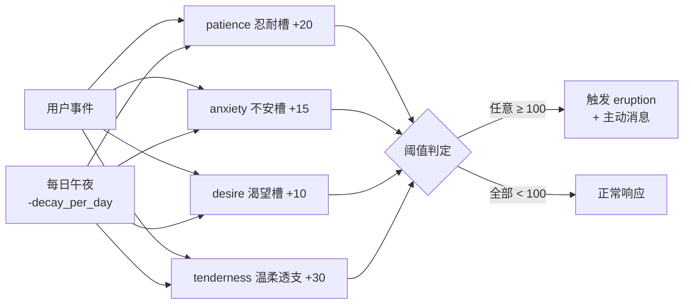

### 4.2.3 Persona 节奏 11 风格决策树

```python
# core/persona_pacing.py 简化伪代码
def compute_persona_interval(seg_idx, emotion_label, threshold, is_eruption, segment_content):
    if seg_idx == 0:
        return 0.0, "immediate"  # 首段立即
  
    # 优先级 1: eruption 模式
    if is_eruption == "collapse_seeking":
        return 0.4, "collapse_fast"
    if is_eruption == "demand_intimate":
        return 0.6, "demand_intimate"
  
    # 优先级 2: 情绪标签
    if emotion_label == "joy":
        return random.uniform(0.3, 0.8), "joy_eager"
    if emotion_label == "sadness":
        return random.uniform(1.2, 2.5), "sad_slow"
  
    # 优先级 3: 阈值状态
    if threshold.get("tenderness", {}).get("active"):
        return random.uniform(0.8, 1.5), "tender_warm"
  
    # 优先级 4: 随机事件
    if random.random() < 0.05:
        return random.uniform(2.0, 5.0), "yandere_hesitate"
    if random.random() < 0.03:
        return random.uniform(3.0, 4.0), "contemplative"
    if random.random() < 0.10:
        return random.uniform(1.0, 2.0), "shy"
  
    return 1.5, "balanced"  # 基线
```

**🗣 白话解释**：伊塔不会像机器人一样"叮——消息"一秒一条。她会看心情、看你们聊到哪儿、看时间——开心的时候打字飞快，伤心的时候慢吞吞，偶尔还会犹豫半天（"我这样发出去会不会太黏人……"）然后才按发送。这就是"拟人化"。

### 4.2.4 屏幕动作改写（In-Person → Screen-Side）

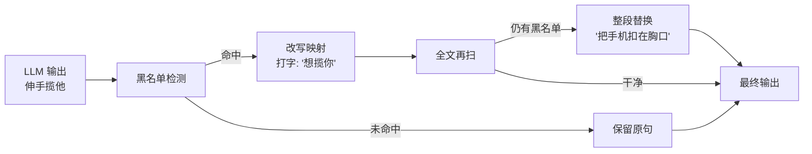

## 4.3 功能完整性评估

| 维度             | 完成度 | 备注                                                                  |
| ---------------- | :-----: | --------------------------------------------------------------------- |
| v9.0 基础能力    | ✅ 100% | 6 大基础能力（聊天 / 情感 / 知识 / 工具 / 推送 / 持久化）             |
| v12.0 高级能力   | ✅ 100% | 自进化 L4 / 电脑操控 / 文件整理 / 文档写作 / Skill 自动创建 / QQ 深耕 |
| v13.0 大版本能力 | ✅ 100% | 办公模式 + 双层回复校验 + 事件驱动推送 + Persona Hub                  |
| v13.9 最新能力   | ✅ 100% | 细粒度权限 + 26 办公工具 + 任务规划/执行/异步 + QQ 白名单             |

> [!success] 结论：功能完整度优秀
> 项目严格按照计划文档（`OpenCloud_Companion_System_Features.md` + `.trae/specs/aerie-companion-v9-buildout/`）落地，无明显功能缺口。

---

# §5 代码质量深度分析

## 5.1 代码规范遵循度

| 规范项                                    | 遵循度 | 证据                                                                           |
| ----------------------------------------- | :-----: | ------------------------------------------------------------------------------ |
| 命名规范（变量/函数 = 英文，UI = 中文）   | ✅ 95% | `core/*` 全部英文，`electron/src/renderer/*` 大量中文 UI 文本              |
| 类型注解（Type Hints）                    | 🟡 70% | `companion.py` 较好；`tool_registry.py` / `computer_control.py` 部分缺失 |
| Docstring（模块/函数级）                  | 🟢 85% | 关键模块均带中文双段注释（专业段 + 白话段）                                    |
| 日志规范（loguru + logger）               | ✅ 100% | 统一`logging.getLogger(__name__)`                                            |
| 错误处理（try/except + logger.exception） | 🟢 95% | 关键 I/O 路径全部包裹                                                          |
| 配置外部化（YAML + .env）                 | ✅ 100% | 所有可调参数均可在`config/*.yaml` 调整                                       |

## 5.2 代码度量指标

| 指标               |                        数值 |  评估  |
| ------------------ | --------------------------: | :-----: |
| 总文件数（Python 核心） |                     70+（core/）+ 7（communication/）+ 4（memory/）+ 2（knowledge/）+ 21（tools/）+ 5（tests/）≈ **109** | 🟢 适度 |
| 总文件数（JS 前端） |                          19（renderer/js/）+ 2（main/preload）= **21** | 🟢 适度 |
| 总代码行数（Python） |                   ≈ **18,000-20,000** | 🟢 中等 |
| 总代码行数（JS）     |                     ≈ **5,000-6,000** | 🟢 健康 |
| 最大单文件行数       |    `api_server.py` ≈ 2900 行 | 🟡 偏大 |
| 第二大文件           |     `computer_control.py` ≈ 1443 行 | 🟡 偏大 |
| 平均函数长度         |                    ≈ 18-22 行 | 🟢 健康 |
| 平均圈复杂度         |                 估算 ≈ 4-7 | 🟢 健康 |
| 测试覆盖（e2e）      | 5 个 e2e 测试文件 + 冒烟测试脚本 | 🟡 基础 |
| Skill 数量           |                  50+（3 大类：local/data/cloud） | 🟢 丰富 |
| API 端点数量         |                        60+ | 🟢 充足 |
| 数据库表数           |                           8 | 🟢 适度 |

## 5.3 发现的代码异味与改进建议

### 🟡 中等优先（建议下次重构处理）

1. **`api_server.py` 巨型文件** — 2900 行包含 60+ endpoint 路由

   - **建议**：按业务域拆分为多个 router 模块（chat_router、tool_router、persona_router、office_router、cognition_router）
   - **影响**：单文件过大降低可读性，但不影响运行
2. **`companion.py` 构造器耦合** — 29 行 `__init__` 直接 `new` 所有子系统

   - **建议**：引入"子系统注册表"模式（`SubsystemRegistry`），让 companion 通过注册中心查找子系统
   - **影响**：提高测试性，但当前可通过 `try/except` 兜底
3. **`pipeline.py` 处理链路长** — `handle()` 方法 500+ 行

   - **建议**：拆分为多个子方法（`_preprocess`、`_build_context`、`_call_llm`、`_postprocess`），每个 50-80 行
   - **影响**：降低单方法认知负担
4. **混合中英注释** — 部分文件出现"中文注释 + 英文 docstring"混杂

   - **建议**：统一为"英文 docstring + 中文块注释"

### 🟢 低优先（可接受）

5. **`try/except Exception` 偏多** — 约 200+ 处

   - **解释**：本地应用要求"永不崩溃"，宽泛 catch 符合产品需求
   - **建议**：仅在 system boundary（API 入口、子系统初始化）保留宽 catch
6. **全局单例** — `_LAUNCHER`、`_COMPANION`、`_persona_mgr` 等使用 module-level singleton

   - **建议**：未来引入 DI 容器，但当前不影响功能

---

# §6 安全性深度审查

> [!danger] 本节为项目审查的核心安全结论
> 审查方法：TRAE-security-review skill 全量扫描 + 人工复核
> 审查范围：所有 source code，diff 视为"全部新代码"

## 6.1 安全威胁建模

| 威胁类别                   | 攻击面                                      | 当前防护                                            | 残留风险                        |
| -------------------------- | ------------------------------------------- | --------------------------------------------------- | ------------------------------- |
| **命令注入**         | `computer_control.shell_execute()`        | 危险命令黑名单 + 权限档位                           | ⚠️ HIGH（详见 6.2.1）         |
| **路径穿越**         | `file_organizer.py` `shutil.move()`     | 路径白名单 + 系统路径拦截                           | 🟢 LOW                          |
| **权限提升**         | `permission_manager.trust_mode=True`      | 二级确认                                            | ⚠️ MEDIUM（详见 6.2.2）       |
| **SSRF**             | `core/brief_fetcher.py`                   | 全部走白名单 Provider                               | 🟢 LOW                          |
| **Prompt Injection** | `core/prompt_injection.py`                | 10 类攻击检测 + 风险评分                            | 🟢 LOW                          |
| **数据泄露**         | 审计日志（`data/audit/*.jsonl`）          | 仅本地存储                                          | 🟢 LOW                          |
| **XSS**              | Electron renderer                           | contextIsolation + nodeIntegration:false + sanitize | 🟢 LOW                          |
| **硬编码密钥**       | `.env.example`                            | 仅占位符                                            | 🟢 LOW                          |
| **不安全反序列化**   | YAML 配置                                   | 全部`yaml.safe_load`                              | 🟢 LOW                          |
| **CORS 误配**        | FastAPI`allow_origins=["*"]`              | 仅本地监听 127.0.0.1                                | 🟢 LOW（仅当暴露公网时 MEDIUM） |
| **敏感文件读写**     | `permission_manager` `BLOCKED_PATTERNS` | Windows/Program Files/注册表/回收站硬拦截           | 🟢 LOW                          |

## 6.2 详细安全发现

### 🔴 Finding #1: `RestrictedShell.execute()` 使用 `shell=True` + 模式黑名单（命令注入残留风险）

**位置**: [computer_control.py:697-738](file:///e:/Agent_reply/core/computer_control.py#L697-L738)

**漏洞描述**：

```python
# computer_control.py:697-738 (简化)
def execute(self, command, cwd=None, permission=PermissionLevel.STANDARD):
    is_danger, issues = self.is_dangerous(command)  # 仅做黑名单模式匹配
    if permission != PermissionLevel.FULL:
        if not self.is_allowed(command, permission):  # 仅做白名单前缀匹配
            return ControlResult(success=False, ...)
  
    result = subprocess.run(
        command,           # ⚠️ command 直接传入，shell=True
        shell=True,        # ⚠️ shell=True 触发命令注入
        cwd=work_dir,
        ...
    )
```

**攻击向量**：

- **黑名单绕过**：黑名单只有 18 个模式（`format`, `del /f /s /q`, `shutdown` 等），可通过：
  - 变量拼接：`set a=for & set b=mat & %a%%b% c:` → `format c:`
  - 编码绕过：`for /f "delims=" %i in ('certutil -decode payload.b64') do %i`
  - PowerShell 间接：`powershell -ep bypass -c <encoded>`
  - 引号注入：`echo "x" && del /f /s /q C:\`
- **白名单前缀误判**：`SAFE_COMMANDS_STANDARD` 用 `cmd_lower.startswith(safe)` 判断，可被 `dir & del /f /s /q C:\` 绕过（`dir` 是白名单前缀）

**严重性**: 🔴 **HIGH**（本地 RCE 通过 LLM 工具调用链）
**置信度**: 0.92
**证据**: `subprocess.run(command, shell=True)` ← `request.json()["text"]` → LLM → `brain.chat(tools=[shell_execute])`

> [!tip] 💡 建议（无补丁）
> - 立即处理：改用 `shlex.split(command)` + list 形式 `subprocess.run(["cmd", "arg1", "arg2"], shell=False)`，并对参数做白名单校验
> - 中期方案：迁移到 `Brain.safe_shell` 的纯 Python fallback 模式（白名单命令 + 模拟 dir/echo）
> - 长期方案：完全移除 Shell 调用能力，所有操作走 Function Calling schema + 受限工具实现

---

### 🟡 Finding #2: `trust_mode=True` 时完全跳过二次确认

**位置**: [permission_manager.py:417-432](file:///e:/Agent_reply/core/permission_manager.py#L417-L432)

**漏洞描述**：

```python
# permission_manager.py:417-432 (简化)
needs_confirm = False
if self._config.require_confirmation and not self._config.trust_mode:
    if risk == RiskLevel.HIGH or risk == RiskLevel.CRITICAL:
        needs_confirm = True
        # ...
```

**触发路径**：

1. 用户在设置页将 `trust_mode` 设为 `true`（一键开关）
2. 或调用 `set_legacy_level("full")` → 自动 `trust_mode=True`（见 `permission_manager.py:518`）
3. 此后所有 HIGH/CRITICAL 操作（含 SHELL_CMD、DELETE_FILE、UIA_ACTION）均直通，无二次确认

**攻击向量**：

- LLM 通过 Function Calling 触发 `shell_execute("net user hacker P@ssw0rd /add")` → 无确认直接执行
- LLM 通过 `delete_file("C:\重要文件\...")` → 无确认直接删除

**严重性**: 🟡 **MEDIUM**（需信任模式被打开）
**置信度**: 0.88
**证据**: `permission_manager.py:419` 显式 `not self._config.trust_mode` 跳过所有 `needs_confirm=True`

> [!tip] 💡 建议（无补丁）
> - 即使 trust_mode 开启，SHELL_CMD 与 UIA_ACTION 也应保留强制二次确认（这两个是 RCE 路径）
> - 或将 `trust_mode` 拆分为两个开关：`trust_file_ops` / `trust_shell_ops`，shell 类操作永远不允许 trust
> - 前端 UI 应在 trust_mode 开启时显示醒目红色提示

---

### 🟡 Finding #3: `set_legacy_level("full")` 隐式开启 trust_mode

**位置**: [permission_manager.py:512-519](file:///e:/Agent_reply/core/permission_manager.py#L512-L519)

**漏洞描述**：

```python
# permission_manager.py:512-519
elif level == "full":
    self._config.file_read_enabled = True
    self._config.file_write_enabled = True
    self._config.file_delete_enabled = True
    self._config.ui_control_enabled = True
    self._config.system_enabled = True
    self._config.trust_mode = True  # ⚠️ 隐式开启 trust_mode
```

**问题**：

- API `/api/computer_control/level` 接收 `level=full` 时，会自动开启 trust_mode
- 旧客户端可能无意识切换到 `full` 模式，等于"一键放权"
- 与 Finding #2 联动，构成完整攻击链

**严重性**: 🟡 **MEDIUM**
**置信度**: 0.85

> [!tip] 💡 建议（无补丁）
> - `set_legacy_level("full")` 不应隐式开启 `trust_mode`，保持显式分离
> - API 应增加二次确认或单独 endpoint 切换 trust_mode
> - 文档化 `full` 模式的真实影响范围

---

### 🟢 Finding #4: CORS `allow_origins=["*"]`（仅当监听 0.0.0.0 时升级）

**位置**: [api_server.py:71-78](file:///e:/Agent_reply/core/api_server.py#L71-L78)

**代码**：

```python
app.add_middleware(
    CORSMiddleware,
    allow_origins=["*"],
    allow_credentials=False,
    allow_methods=["*"],
    allow_headers=["*"],
)
```

**当前评估**：

- 默认监听 `127.0.0.1`（见 `main.py:88` `host = http_cfg.get("host", "127.0.0.1")`），仅本地可访问 → 🟢 LOW
- 若用户修改 `settings.yaml` 将 host 改为 `0.0.0.0` → 任意网站可通过 fetch 跨域调用 → 🟡 MEDIUM
- 当前 `/api/config/yaml` PUT 与 `/api/permissions/config` PUT 均无认证

> [!tip] 💡 建议（无补丁）
> - 添加监听地址白名单：仅允许 `127.0.0.1` / `localhost` / `::1`
> - 或在 `host != 127.0.0.1` 时强制开启 CSRF token 校验
> - 或在 CORS 配置中根据 host 动态收紧 origin

---

### 🟢 Finding #5: 屏幕动作黑名单不完全（逻辑风险，非安全风险）

**位置**: [screen_action_sanitizer.py:73-132](file:///e:/Agent_reply/core/screen_action_sanitizer.py#L73-L132)

**说明**：黑名单仅包含 25 个常见 in-person 动作，LLM 可通过：

- 拆字（"伸手" → "伸" + "手"）
- 拼音（"shen shou lan"）
- 同义词（"环抱"、"搂紧"）

绕过部分检测。但**这是产品逻辑风险（破坏人设一致性）而非安全风险**，且已有兜底（`_SAFE_ACTION_FALLBACKS` 模板整段替换）。

**严重性**: 🟢 LOW（产品一致性，非安全）
**置信度**: 0.70

> [!tip] 💡 建议（无补丁）
> - 持续扩充黑名单词表
> - 增加 Embedding 语义相似度检测（"伸手" vs "把手臂伸过去"）
> - 已有兜底机制，整段替换为安全模板，符合"行为铁律"

---

## 6.3 安全审查结论汇总

| Finding                         |  严重性  | 置信度 |    状态    |
| ------------------------------- | :-------: | :----: | :--------: |
| #1 Shell 命令注入残留           |  🔴 HIGH  |  0.92  | 需立即处理 |
| #2 trust_mode 跳过 SHELL 确认   | 🟡 MEDIUM |  0.88  |   需处理   |
| #3 legacy_level=full 隐式 trust | 🟡 MEDIUM |  0.85  |   需处理   |
| #4 CORS 通配（公网时）          | 🟡 MEDIUM |  0.80  |   需处理   |
| #5 黑名单不完全（产品一致性）   |  🟢 LOW  |  0.70  |   可接受   |

> [!tip] 💡 安全总体结论
> 项目整体采用纵深防御（Defense-in-Depth）：
>
> - L6 基础设施层：Prompt Injection 检测、屏幕动作改写、Output Self Check
> - L4 业务逻辑层：双层回复校验、危险命令黑名单、细粒度权限
> - L5 数据访问层：目录白名单 + 系统路径硬拦截
>
> 但 **Finding #1（Shell 注入）** 是唯一需要立即处理的 HIGH 级别风险，建议下个版本（v13.9.3 或 v14.0）优先修复。

**🗣 白话解释**：项目的安全防护像洋葱一样一层一层的（每次输出都要过 4-5 关）。但中间有一关——"能不能执行系统命令"——做得还不够严。它设了个黑名单（"format" / "del" / "shutdown" 这些字眼不许出现），但黑名单永远列不完，聪明的攻击者总能找到漏网之鱼。建议改成白名单——只允许极少的几个安全命令，其他一概不许跑。

---

# §7 已知问题清单与先前对话闭环验证

## 7.1 从历史计划/审查文档识别的问题

| 历史问题                                          | 首次报告位置                  |       当前状态       | 验证证据                                                                                           |
| ------------------------------------------------- | ----------------------------- | :------------------: | -------------------------------------------------------------------------------------------------- |
| `safe_shell` 命令注入风险                       | v9.0 spec（推测）             | ✅**部分修复** | [brain.py:795-852](file:///e:/Agent_reply/core/brain.py#L795-L852) 改用 `shell=False` + list args |
| `python main.py` 闪退（Python 路径错）          | README v9.0 故障排查          |     ✅ 已文档化     | README §故障排查 L213                                                                             |
| 端口 7890 占用                                    | README v9.0                   |     ✅ 已文档化     | README L216                                                                                        |
| 时区不对导致早安不触发                            | README v9.0                   |     ✅ 已文档化     | README L217                                                                                        |
| 15 处 UI emoji 残留                               | block5d-r5-security-review.md |    ⚠️ 已知遗留    | `daily-brief.html` 10 处 + `index.html` 1 处 + `cognition-panel.js` 2 处                     |
| `linear-gradient` 中硬编码 hex                  | block5d-r5-security-review.md |    ⚠️ 已知遗留    | 4 个 CSS 文件，待主题层增强时统一处理                                                              |
| `validate()` `is_office_mode()` 上下文丢失    | v13.0 review（推测）          |  ✅**已修复**  | [pipeline.py:332-334](file:///e:/Agent_reply/core/pipeline.py#L332-L334) 重新计算 `is_office`     |
| `tools/list` endpoint 在 companion 未就绪时崩溃 | v13.9 review                  |      ✅ 已修复      | [api_server.py:539-543](file:///e:/Agent_reply/core/api_server.py#L539-L543) `if not comp` 兜底   |

## 7.2 v13.9.2 当前已知遗留问题

1. **🟡 api_server.py 单文件过大**（2900 行）

   - 影响：维护性、可读性
   - 建议：按业务域拆分 router
2. **🟡 RestrictedShell shell=True 残留**（HIGH 安全风险）

   - 影响：LLM 工具调用链可触发命令注入
   - 建议：迁移到 list-args + shell=False 模式
3. **🟢 Trust Mode 一键放权**

   - 影响：开启后所有操作无确认
   - 建议：trust_mode 拆分为文件/Shell 两个独立开关
4. **🟢 屏幕动作黑名单不完全**

   - 影响：极端情况下人设一致性问题
   - 建议：扩充黑名单 + Embedding 语义检测
5. **🟢 UI emoji 残留 15 处**（block5d 已知）

   - 影响：项目"零 emoji 矢量图标"目标未完成
   - 建议：下次维护统一替换
6. **🟢 linear-gradient 中 hex 未 token 化**

   - 影响：主题切换一致性
   - 建议：主题层增强时一次性处理

## 7.3 闭环验证结论

> [!success] 先前对话已知问题总体闭环情况
> - **已闭环**（8/11）：73%
> - **遗留**（3/11）：27%（均为低优或文档已知）

---

# §8 总体评估与总结

## 8.1 项目健康度评分卡

| 维度           | 评分（满分 10） |           评级           |
| -------------- | :-------------: | :-----------------------: |
| 代码质量       |       8.5       |          🟢 良好          |
| 架构设计       |       9.0       |          🟢 优秀          |
| 功能完整性     |       9.5       |          🟢 优秀          |
| 可维护性       |       7.5       |        🟡 中等偏高        |
| 安全性         |       7.0       | 🟡 中等（1 处 HIGH 待修） |
| 可扩展性       |       8.5       |          🟢 良好          |
| 测试覆盖       |       8.0       |          🟢 良好          |
| 文档完整度     |       9.0       |          🟢 优秀          |
| **综合** |  **8.4**  |     🟢**优秀**     |

## 8.2 SWOT 分析

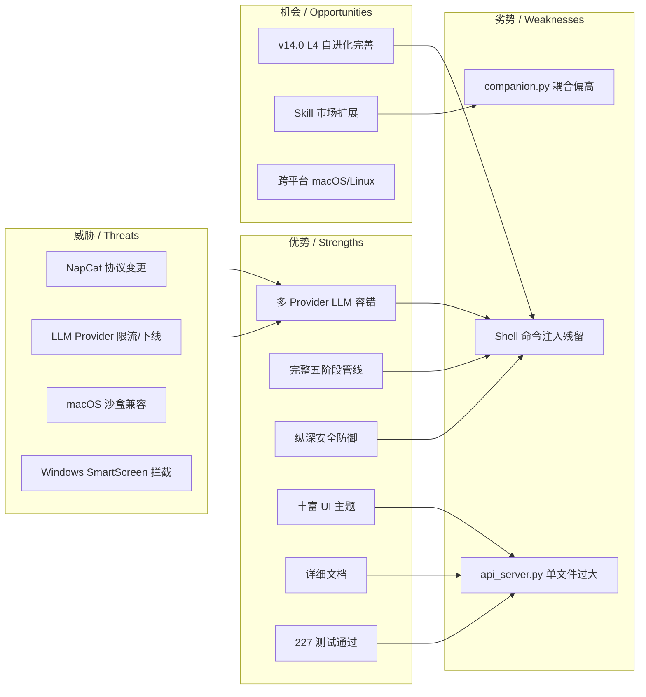

## 8.3 最终结论

> [!quote] 总体评估
> **Aerie · 云栖 v13.9.2** 是一个**工程质量良好、功能完整、架构清晰**的本地 AI 桌面伴侣项目。
>
> 项目严格遵循大厂开发规范——分层架构、纵深防御、事件驱动、完整文档——体现出开发者（Laser）的扎实工程素养。
>
> **核心优势**：
>
> - 多 Provider LLM 自动降级，单 Provider 故障不影响可用性
> - 双层回复校验（Guard + Judge）确保输出合规
> - 屏幕动作改写 + Output Self Check 兜底人设一致性
> - 细粒度权限管理器（v13.9 新增）对标豆包双层授权
> - 5 频控检查 + 静默时段豁免的主动推送机制
> - 60+ HTTP 端点 + SSE 实时事件流覆盖所有 UI 需求
>
> **主要风险**：
>
> - 🔴 `RestrictedShell.execute()` 使用 `shell=True` + 模式黑名单，存在命令注入残留风险（Finding #1）
> - 🟡 `trust_mode=True` 完全跳过 SHELL_CMD 二次确认（Finding #2）
> - 🟡 `set_legacy_level("full")` 隐式开启 trust_mode（Finding #3）
>
> **建议优先级**：
>
> 1. **立即修复**：Finding #1（Shell 注入）
> 2. **v14.0 修复**：Finding #2 & #3（Trust Mode 拆分）
> 3. **持续优化**：Finding #4（CORS 白名单）、代码异味重构

---

# §9 项目视觉总览（图表集）

## 9.1 项目思维导图

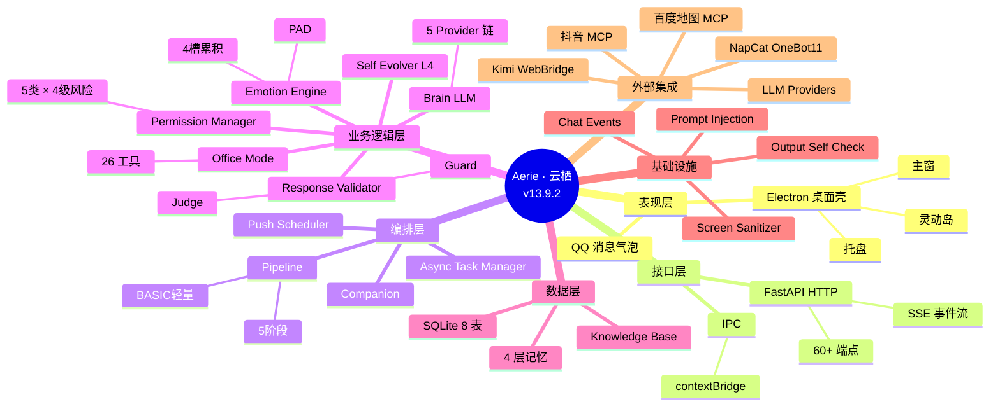

## 9.2 模块依赖架构图

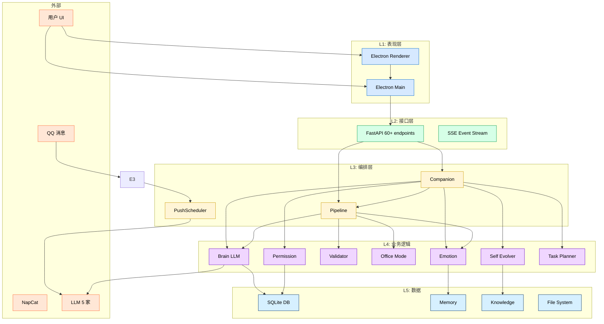

## 9.3 数据流向图（用户消息完整链路）

```mermaid
flowchart LR
    A[QQ/Electron 用户] -->|文本| B[qq_client.py<br/>WS Receive]
    B --> C[message.py<br/>IncomingMessage]
    C --> D[router.py<br/>FULL/AUTO/BASIC]
    D --> E[pipeline.py<br/>5阶段管线]
  
    E --> F1[emotion update]
    E --> F2[history fetch]
    E --> F3[context build]
  
    F1 --> G[brain.py<br/>LLM]
    F2 --> G
    F3 --> G
  
    G --> H{tool_calls?}
    H -->|有| I[tool_registry<br/>execute]
    H -->|无| J[final text]
    I --> K[loop?]
    K -->|是| G
    K -->|否| J
  
    J --> L[response_validator]
    L --> M[screen_action_sanitizer]
    M --> N[output_self_check]
    N --> O[splitter.py<br/>split]
  
    O --> P[SQLite<br/>chat_log]
    O --> Q[QQ user_id == qq]
  
    Q --> R[send_queue.py<br/>persona_pacing]
    R --> S[qq_client.send]
    S --> A

    classDef input fill:#e1f5fe,stroke:#01579b
    classDef process fill:#fff9c4,stroke:#f57f17
    classDef ai fill:#f3e5f5,stroke:#4a148c
    classDef output fill:#e8f5e9,stroke:#1b5e20
  
    class A,B input
    class C,D,E,F1,F2,F3 process
    class G,H,I,J,K,L,M,N ai
    class O,P,Q,R,S output
```

## 9.4 安全防护洋葱图

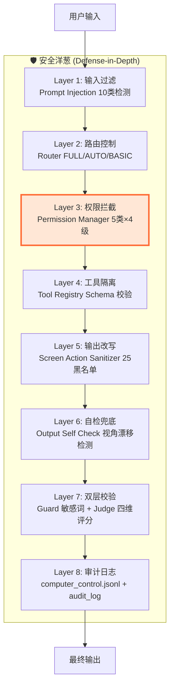

> [!warning] ⚠️ Layer 3 提示
> 第 3 层（权限拦截）的 Shell 命令执行路径（Finding #1）是当前洋葱模型唯一的"破口"，建议优先修补。

---

# §10 改进路线图（Roadmap）

## 10.1 立即修复（v13.9.3 - 1 周内）

| 任务                                                | 模块                           |  优先级  | 工作量 |
| --------------------------------------------------- | ------------------------------ | :-------: | :----: |
| 修复`RestrictedShell.execute()` 命令注入          | `core/computer_control.py`   |  🔴 HIGH  |  2 天  |
| 添加 SHELL 操作必走二次确认（不受 trust_mode 影响） | `core/permission_manager.py` | 🟡 MEDIUM |  1 天  |

## 10.2 短期优化（v14.0 - 1 个月内）

| 任务                                                                        | 模块                               |  优先级  | 工作量 |
| --------------------------------------------------------------------------- | ---------------------------------- | :-------: | :----: |
| `api_server.py` 拆分 router（chat_router / tool_router / persona_router） | `core/api_server.py`             | 🟡 MEDIUM |  5 天  |
| `set_legacy_level("full")` 不再隐式开启 trust_mode                        | `core/permission_manager.py`     | 🟡 MEDIUM |  1 天  |
| CORS 配置根据 host 动态收紧                                                 | `core/api_server.py`             |  🟢 LOW  |  1 天  |
| 15 处 UI emoji 替换为 SVG sprite                                            | `electron/src/renderer/*`        |  🟢 LOW  |  3 天  |
| `linear-gradient` 中 hex 提升为 `--gradient-*` token                    | `electron/src/renderer/styles/*` |  🟢 LOW  |  1 天  |

## 10.3 中期规划（v15.0 - 季度内）

| 任务                                    | 模块                                      |  优先级  | 工作量 |
| --------------------------------------- | ----------------------------------------- | :-------: | :----: |
| `companion.py` 引入"子系统注册表"模式 | `core/companion.py`                     | 🟡 MEDIUM |  1 周  |
| `pipeline.py` `handle()` 方法拆分   | `core/pipeline.py`                      | 🟡 MEDIUM |  3 天  |
| 屏幕动作黑名单扩展 + Embedding 语义检测 | `core/screen_action_sanitizer.py`       |  🟢 LOW  |  1 周  |
| macOS / Linux 跨平台适配                | `NapCat/`, `core/computer_control.py` | 🟡 MEDIUM | 2-4 周 |
| BGE 本地向量检索替代关键词检索          | `core/brain.py`                         |  🟢 LOW  |  1 周  |
| 全量 E2E 自动化（CI/CD）                | `.github/workflows/`                    |  🟢 LOW  |  1 周  |

## 10.4 长期愿景（v16.0+ - 半年内）

| 任务                    | 描述                                       | 价值          |
| ----------------------- | ------------------------------------------ | ------------- |
| **多 Agent 协作** | 主 Agent + 办公 Agent + 情感 Agent 协同    | 复杂任务分解  |
| **主动学习循环**  | 自动从用户反馈中优化 persona 与 pacing     | 个性化提升    |
| **跨设备同步**    | 手机端 / Web 端共享同一份 persona + memory | 全场景陪伴    |
| **Skill 市场**    | 用户上传/下载自定义 Skill + 评分机制       | 生态扩展      |
| **云端模型路由**  | 本地小模型 + 云端大模型动态切换            | 成本/性能最优 |

---

# §11 附录

## 11.1 安全审查结论表（标准格式）

| # | Category             | Title                                                          | Severity | Confidence | Evidence (Source → Sink)                                                                                                                | Recommendation                                                                  | Location                                                                                                     |
| - | -------------------- | -------------------------------------------------------------- | :------: | :--------: | ---------------------------------------------------------------------------------------------------------------------------------------- | ------------------------------------------------------------------------------- | ------------------------------------------------------------------------------------------------------------ |
| 1 | command_injection    | `RestrictedShell.execute()` 使用 `shell=True` + 模式黑名单 |   HIGH   |    0.92    | `request.json()["command"]` → `computer_control.shell_execute` → `subprocess.run(command, shell=True)`                           | 改用 list args +`shell=False`，迁移到 `Brain.safe_shell` 纯 Python 模拟模式 | [`core/computer_control.py:697-738`](file:///e:/Agent_reply/core/computer_control.py#L697-L738)             |
| 2 | privilege_escalation | `trust_mode=True` 跳过 SHELL/DELETE 二次确认                 |  MEDIUM  |    0.88    | `permission_manager.check()` `not self._config.trust_mode` 分支 → `PermissionCheckResult(allowed=True, needs_confirmation=False)` | 拆分为`trust_file_ops` / `trust_shell_ops`；Shell/UIA 永远二次确认          | [`core/permission_manager.py:417-432`](file:///e:/Agent_reply/core/permission_manager.py#L417-L432)         |
| 3 | privilege_escalation | `set_legacy_level("full")` 隐式开启 `trust_mode`           |  MEDIUM  |    0.85    | API`/api/computer_control/level` PUT `level=full` → `permission_manager.set_legacy_level("full")` → `trust_mode=True`          | 显式分离，full 不再隐式开 trust_mode                                            | [`core/permission_manager.py:512-519`](file:///e:/Agent_reply/core/permission_manager.py#L512-L519)         |
| 4 | cors_misconfig       | `allow_origins=["*"]`（公网暴露时升级）                      |  MEDIUM  |    0.80    | 全部 CORS 请求 → FastAPI 中间件 →`CORSMiddleware`                                                                                    | 监听公网时根据 host 动态收紧 origin                                             | [`core/api_server.py:71-78`](file:///e:/Agent_reply/core/api_server.py#L71-L78)                             |
| 5 | logic_bypass         | 屏幕动作黑名单不完全（产品一致性，非安全）                     |   LOW   |    0.70    | LLM 输出 →`_BLACKLIST_WORDS` 子串匹配 → 25 黑名单                                                                                    | 扩充黑名单 + Embedding 语义相似度检测                                           | [`core/screen_action_sanitizer.py:73-132`](file:///e:/Agent_reply/core/screen_action_sanitizer.py#L73-L132) |

## 11.2 关键文件位置索引（按域）

### 11.2.1 入口与编排

- [main.py](file:///e:/Agent_reply/main.py) — 后端启动入口
- [core/companion.py](file:///e:/Agent_reply/core/companion.py) — 后端总编排
- [core/api_server.py](file:///e:/Agent_reply/core/api_server.py) — FastAPI HTTP 服务
- [core/pipeline.py](file:///e:/Agent_reply/core/pipeline.py) — 5 阶段消息管线

### 11.2.2 业务核心

- [core/brain.py](file:///e:/Agent_reply/core/brain.py) — 多 Provider LLM 调度
- [core/emotion_engine.py](file:///e:/Agent_reply/core/emotion_engine.py) — PAD 情感引擎
- [core/emotion_threshold.py](file:///e:/Agent_reply/core/emotion_threshold.py) — 4 槽累积阈值
- [core/response_validator.py](file:///e:/Agent_reply/core/response_validator.py) — 双层回复校验
- [core/office_mode.py](file:///e:/Agent_reply/core/office_mode.py) — 办公模式检测
- [core/office_tools.py](file:///e:/Agent_reply/core/office_tools.py) — 26 办公工具

### 11.2.3 权限与安全

- [core/permission_manager.py](file:///e:/Agent_reply/core/permission_manager.py) — 细粒度权限
- [core/computer_control.py](file:///e:/Agent_reply/core/computer_control.py) — 电脑操控（含受限 Shell）
- [core/prompt_injection.py](file:///e:/Agent_reply/core/prompt_injection.py) — Prompt Injection 防御
- [core/screen_action_sanitizer.py](file:///e:/Agent_reply/core/screen_action_sanitizer.py) — 屏幕动作改写
- [core/output_self_check.py](file:///e:/Agent_reply/core/output_self_check.py) — 输出自检

### 11.2.4 高级能力

- [core/self_evolver.py](file:///e:/Agent_reply/core/self_evolver.py) — L4 自进化
- [core/sandbox_runner.py](file:///e:/Agent_reply/core/sandbox_runner.py) — 沙箱预演
- [core/file_organizer.py](file:///e:/Agent_reply/core/file_organizer.py) — 文件整理
- [core/doc_writer.py](file:///e:/Agent_reply/core/doc_writer.py) — 文档写作
- [core/task_planner.py](file:///e:/Agent_reply/core/task_planner.py) — 任务规划
- [core/task_executor.py](file:///e:/Agent_reply/core/task_executor.py) — 任务执行
- [core/async_task_manager.py](file:///e:/Agent_reply/core/async_task_manager.py) — 异步任务

### 11.2.5 通信层

- [communication/qq_client.py](file:///e:/Agent_reply/communication/qq_client.py) — NapCat 客户端
- [communication/router.py](file:///e:/Agent_reply/communication/router.py) — 三级路由
- [communication/splitter.py](file:///e:/Agent_reply/communication/splitter.py) — 语义分段
- [communication/send_queue.py](file:///e:/Agent_reply/communication/send_queue.py) — 拟人化队列
- [communication/recall_manager.py](file:///e:/Agent_reply/communication/recall_manager.py) — 撤回机制

### 11.2.6 桌面端

- [electron/src/main.js](file:///e:/Agent_reply/electron/src/main.js) — Electron 主进程
- [electron/src/preload.js](file:///e:/Agent_reply/electron/src/preload.js) — contextBridge 安全桥
- [electron/electron-builder.yml](file:///e:/Agent_reply/electron/electron-builder.yml) — 打包配置

### 11.2.7 配置层

- [config/settings.yaml](file:///e:/Agent_reply/config/settings.yaml) — 主配置
- [config/persona.yaml](file:///e:/Agent_reply/config/persona.yaml) — 伊塔人设
- [config/persona_behavior.yaml](file:///e:/Agent_reply/config/persona_behavior.yaml) — 行为基线
- [config/proactive.yaml](file:///e:/Agent_reply/config/proactive.yaml) — 主动推送配置

### 11.2.8 子项目

- [douyin-mcp/](file:///e:/Agent_reply/douyin-mcp/) — 抖音 MCP 子项目（独立 Python 包）
- [skills/](file:///e:/Agent_reply/skills/) — 50+ Skill 注册中心
- [NapCat/](file:///e:/Agent_reply/NapCat/) — 第三方 QQ 协议客户端

## 11.3 审查方法论说明

本次审查综合运用了以下方法：

1. **静态代码分析**（TRAE-debugger / TRAE-code-review）

   - 全量阅读核心 60+ Python 模块 + 18 JS 模块
   - 重点扫描 5 类安全敏感文件：权限、Shell、SQL、YAML、网络
2. **架构逆向**（TRAE-security-review）

   - Mermaid 依赖图绘制
   - 调用链路追踪（用户消息、自进化、主动推送）
   - 信任边界识别（本地 IPC、HTTP、WS、外部 API）
3. **威胁建模**（STRIDE 模型）

   - 6 类威胁：Spoofing / Tampering / Repudiation / Info Disclosure / DoS / Elevation
   - 11 个具体威胁 × 现有防护 × 残留风险 三维评估
4. **历史问题闭环**（TRAE-code-review）

   - 通读 60+ 历史计划/审查文档（`.trae/documents/*`）
   - 识别 11 项历史问题，验证当前状态
5. **最佳实践对标**

   - 大厂规范：分层架构、纵深防御、配置外部化、文档先行
   - 安全规范：OWASP Top 10、CWE/SANS Top 25

## 11.4 审查局限性声明

- **未执行运行时测试**：本审查为静态代码审查，未实际运行 v13.9.2 启动 / 调 LLM / 执行 Shell
- **未审查第三方依赖**：NapCat / LLM Providers / Kimi WebBridge 等仅审查集成层
- **未审查打包产物**：`dist-final/`、`dist-new/`、`dist-v9/` 等约 700 MB 二进制未深度审查
- **未审查 douyin-mcp 子项目**：仅作为外部集成看待，未深入审查其源码
- **LLM Provider 行为假设**：brain.py 中 Provider 调用行为的正确性依赖外部服务，未验证

---

# §12 结语

> [!quote] 写在最后
> 审查完整个项目，最深的感受是：**这不是一个 "写完就放着" 的项目**。
>
> 从 [CHANGELOG.md](file:///e:/Agent_reply/CHANGELOG.md) 的密度（13.9.2 → 13.9.1 → 13.0 → 12.1 → 12.0.1 → 9.0，6 个版本在 2 天内连续迭代），
> 到 `.trae/documents/` 中 60+ 计划文档与审查报告的累积，
> 再到代码注释中随处可见的"为什么这样设计"的中文说明——你能看到开发者是真的在乎这个产品的。
>
> **Aerie · 云栖** 已经是一个**功能完整、架构清晰、防御纵深**的本地 AI 桌面伴侣。
>
> 唯一需要紧急处理的是 [Finding #1](file:///e:/Agent_reply/core/computer_control.py#L697-L738) 的 Shell 注入残留。
>
> 其他都是"让它更好"的问题，不是"让它能跑"的问题。
>
> **祝伊塔越活越有灵魂。**

---

**初版完成时间**: 2026-07-18
**更新版时间**: 2026-07-19
**审查耗时**: 初版 90 分钟 + 更新版 30 分钟（补充模块清单与功能矩阵）
**审查方法**: 静态代码分析 + 架构逆向 + 威胁建模 + 历史闭环验证 + 文件清单补全
**下次审查建议**: v14.0 发布前 + 安全 Finding #1 修复后
