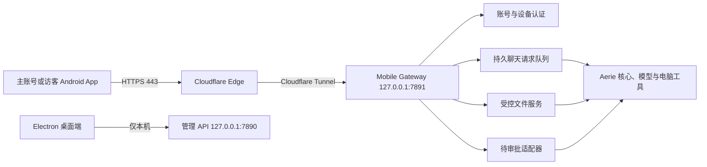

# Aerie v2 安卓远程伴侣主控方案

> [!IMPORTANT]
> 本文档是 Aerie v2 安卓远程伴侣的唯一主控文档。后续端口、接口、账号、权限、数据结构、部署方式或验收标准发生变化时，必须先更新本文档和相应测试合同，再修改实现。

## 0. 文档状态

| 项目 | 当前值 |
| --- | --- |
| 文档状态 | `implementing` |
| 当前阶段 | 最小安全网关（已验证），下一阶段为账号、设备与身份 |
| 当前实现状态 | `7891` 独立网关仅提供健康检查，默认关闭；尚未实现认证、聊天、文件、审批或 Android App |
| 当前公开域名 | `aerie.etta.top`，Cloudflare DNS 已确认激活；Tunnel 尚未创建 |
| 当前后端 | `127.0.0.1:7890` 本地 FastAPI 管理 API |
| 计划手机网关 | `127.0.0.1:7891` 独立最小权限 FastAPI 应用 |
| Android 目标设备 | VIVO Y500 Pro，OriginOS 6，Android 16 |
| 首版分发方式 | 固定签名 APK，私有安装，不上应用商店 |
| Android 客户端仓库 | `https://github.com/Laser1209/Aerie-Android`，本地工作树为 `E:\Agent_reply\android-client`；已初始化并推送 `main` |

### 0.1 状态词含义

- `planned`：已确定合同，尚未开始实现。
- `implementing`：正在实现，不能宣称可用。
- `verified`：自动化测试和指定人工验收均已通过。
- `released`：已生成固定签名 APK，并在目标手机完成发布验收。
- 每个阶段只有在 Evidence 中写入真实命令、结果和日期后，才能标记完成。

## 1. 目标与边界

### 1.1 目标

1. 使用 Android 原生 App 代替 QQ 作为主要移动入口。
2. 手机只负责登录、聊天、发送指令、传输文件、查看状态和审批；模型推理、工具执行、文件处理和产出继续在电脑完成。
3. 手机断网、切后台或 SSE 断开时，电脑上的持久请求继续执行；手机恢复后重新同步。
4. 通过 Cloudflare Tunnel 访问本地电脑，不开放家庭路由器入站端口。
5. 保留 QQ 作为可选兼容通道，但 Android 路径必须能在 `AERIE_DISABLE_QQ=true` 时独立工作。

### 1.2 首版包含

- 一个主账号和若干访客账号。
- 账密登录、新设备一次性配对码、设备会话与撤销。
- 主账号与桌面端共享聊天时间线。
- 访客聊天、长期记忆和文件空间相互隔离。
- 文本请求、历史、排队状态、取消、重试和实时状态事件。
- 图片及常用文档的双向传输，单文件最大 `50MB`。
- 主账号查看访客聊天与安全审计。
- 主账号在手机上批准或拒绝电脑端已经生成的待审批项。
- 有活动请求、传输或已知待审批时运行 Android 前台服务。

### 1.3 首版不包含

- 不公开 `7890` 管理 API。
- 不提供手机端任意 Shell、任意路径删除、系统重启、密钥管理或配置修改入口。
- 不提供公网注册、找回密码或角色修改接口。
- 不提供应用商店发布、FCM、VIVO 厂商推送或全天候云端中继。
- 不把 OPPO Reno 5K 作为首版服务器；首版唯一计算服务器是当前 Windows 电脑。
- 不自动执行离线期间积压的旧指令。

## 2. 已锁定的产品决策

| 主题 | 已确定决策 |
| --- | --- |
| 首版能力 | 文本、任务状态、图片和文件双向传输 |
| 聊天关系 | 主账号手机与桌面共享同一时间线 |
| 后台模式 | 有活动任务时启动前台服务，完成后自动停止 |
| 登录 | 用户名、密码、新设备配对码、可撤销设备令牌 |
| 账号创建 | 只能在电脑本地创建和管理 |
| 账号模型 | 一个主账号，加若干访客账号 |
| 访客能力 | 可聊天和使用安全工具；高风险操作只能申请审批 |
| 访客隔离 | 聊天、长期记忆和文件收发箱逐账号隔离 |
| 主账号审计 | 可查看访客聊天、文件活动、登录和审批记录 |
| 文件范围 | 常用格式，单文件最大 `50MB` |
| 文件目录 | 主账号使用电脑配置的授权目录；访客使用独立 Inbox/Outbox |
| 手机审批 | 可处理全部已有待审批项，但没有直接高权限命令入口 |
| 审批验证 | 每次高风险决定都需指纹、人脸或设备锁屏凭据 |
| 通知隐私 | 锁屏通知只显示状态，不显示正文或文件名 |
| App 锁 | 普通聊天无需二次验证，仅审批时强制验证 |
| 离线发送 | 保存为待发送，恢复网络后由用户手动确认 |
| 更新方式 | 使用同一签名密钥生成 APK 并覆盖升级 |

## 3. 总体架构



### 3.1 强制隔离原则

1. `7890` 和 `7891` 必须是两个不同的 FastAPI `app`，不能把现有管理路由整体挂载到手机网关。
2. Cloudflare Tunnel 只能指向 `http://127.0.0.1:7891`。
3. `7891` 不安装通配 CORS；Android 原生请求不需要浏览器 CORS。
4. 网关只通过明确的服务适配器调用 Aerie 核心，禁止代理任意 `/api/*` 路径。
5. 网关启动失败时固定报告失败，不自动选择其他端口；桌面端可以继续运行。

## 4. 端口与网络合同

| 端口/地址 | 方向 | 用途 | 公网可见 | 规则 |
| --- | --- | --- | --- | --- |
| `127.0.0.1:7890` | 本机 | Aerie 完整管理 API | 否 | 保持本地绑定，禁止 Tunnel |
| `127.0.0.1:7891` | 本机 | Android 安全网关 | 经 Tunnel 间接可达 | 只开放移动白名单接口 |
| `https://aerie.etta.top:443` | 手机到 Cloudflare | Android 公网入口 | 是 | 仅 HTTPS |
| `7844/UDP` | 电脑出站 | Cloudflare Tunnel QUIC | 不适用 | 失败时允许回退 `443/TCP` |
| `127.0.0.1:3001` | 本机 | NapCat WebSocket | 否 | QQ 可选，不是 Android 依赖 |

### 4.1 Cloudflare 规则

- 使用命名 Tunnel：`aerie.etta.top -> http://127.0.0.1:7891`。
- `cloudflared` 最终安装为 Windows 服务，凭据保存在用户目录，不进入 Git。
- 首版不启用 Cloudflare Access 浏览器登录，以免阻断 Android 原生 API；认证由应用账号和设备令牌负责。
- DNS 未在主要公共解析器全部返回 Cloudflare 名称服务器前，不进行正式公网验收。
- 不配置路由器端口转发，不把电脑局域网 IP 暴露到 DNS。

## 5. 账号、身份与数据隔离

### 5.1 角色

| 角色 | 能力 |
| --- | --- |
| `owner` | 主聊天、授权目录、设备管理、访客审计、所有待审批项的批准或拒绝 |
| `guest` | 独立聊天、独立记忆、独立 Inbox/Outbox、安全工具和高风险审批申请 |

系统只允许存在一个启用状态的 `owner`。访客数量由电脑本地管理工具控制。

### 5.2 身份映射

- 主账号绑定现有桌面 Actor 和 `AERIE_PRIMARY_USER_ID`，保证手机与 Electron 共享主聊天时间线。
- `AERIE_PRIMARY_USER_ID` 首次配置为当前稳定内部用户编号；兼容期可回退现有 `SELF_QQ`，但不得要求 QQ 进程在线。
- 每个访客创建独立 Actor、独立 Conversation 和独立内部用户编号。
- 同一账号的多台已授权设备共享该账号的聊天和文件权限，但拥有不同设备令牌。
- 设备来源单独写入移动审计；不能为了审计而拆开主账号的共享聊天上下文。

### 5.3 计划认证数据库

移动认证数据使用独立 SQLite 文件 `data/mobile_gateway.db`，避免把认证生命周期耦合到聊天表。计划表：

- `mobile_accounts`：账号、角色、密码哈希、Actor、内部用户编号、状态。
- `mobile_devices`：设备名称、公钥、创建时间、最后使用时间、撤销时间。
- `mobile_refresh_tokens`：刷新令牌哈希、轮换链、过期和撤销状态。
- `mobile_pairing_sessions`：配对码哈希、有效期、失败次数和使用状态。
- `mobile_directory_grants`：主账号授权目录及读、上传、下载权限。
- `mobile_files`：不透明文件 ID、所有者、真实路径、哈希、状态和扫描结果。
- `mobile_request_idempotency`：账号、设备、`clientRequestId` 和后端请求 ID。
- `mobile_audit`：登录、设备、文件、工具申请和审批结果，不记录密码或令牌。

## 6. 账密、配对与会话合同

### 6.1 本地账号管理

计划提供 `scripts/mobile_accounts.py`，仅在电脑本地执行：

```text
create-owner       创建唯一主账号
create-guest       创建访客账号
reset-password     重置密码并撤销既有会话
pairing-code       为指定账号生成一次性八位配对码
list-accounts      查看脱敏账号状态
list-devices       查看账号设备
revoke-device      撤销指定设备
disable-account    禁用访客并撤销全部设备
```

### 6.2 密码与登录

- 用户名规范化后唯一，长度 `3-32`，只允许字母、数字、点、下划线和连字符。
- 密码最少 `12` 个字符，使用 `Argon2id` 加盐哈希；日志和异常中禁止出现密码。
- 新设备首次登录必须同时提交用户名、密码、设备名称和八位配对码。
- 配对码有效期 `10` 分钟、单次使用；每 IP 和账号 `15` 分钟最多失败 `5` 次。
- 登录错误统一返回 `invalid_credentials`，不得泄露账号是否存在。

### 6.3 令牌

- Access Token：不透明随机值，有效期 `15` 分钟。
- Refresh Token：不透明随机值，有效期 `30` 天，每次刷新必须轮换。
- 服务端只保存带服务器 Pepper 的 HMAC-SHA256 哈希；Pepper 只放 `.env`。
- 检测到旧 Refresh Token 被重复使用时，撤销整条令牌家族。
- Android 使用 Keystore 加密 Refresh Token；Access Token 只保存在内存。
- 改密、禁用账号、注销或撤销设备必须立即失效对应会话。

## 7. 手机 API 合同

所有端点使用前缀 `/api/mobile/v1`。除健康检查和登录/刷新外，必须携带 `Authorization: Bearer <access-token>`。

### 7.1 通用格式

- JSON 字段使用 `camelCase`。
- 所有 ID 在 Android 中按字符串处理。
- 时间使用 UTC ISO 8601。
- 错误结构固定为：

```json
{
  "error": {
    "code": "stable_error_code",
    "message": "可显示的简短说明",
    "requestId": "req_xxx"
  }
}
```

### 7.2 认证与设备

| 方法 | 路径 | 用途 |
| --- | --- | --- |
| `GET` | `/health` | 只返回 `status` 和 `apiVersion` |
| `POST` | `/auth/login` | 账密和新设备配对 |
| `POST` | `/auth/refresh` | 轮换 Access/Refresh Token |
| `POST` | `/auth/logout` | 撤销当前设备会话 |
| `GET` | `/me` | 当前账号、角色和设备能力 |
| `GET` | `/devices` | 查看当前账号设备 |
| `DELETE` | `/devices/{deviceId}` | 主账号或设备本人撤销设备 |

### 7.3 聊天与请求

| 方法 | 路径 | 用途 |
| --- | --- | --- |
| `GET` | `/messages` | `beforeId`/`afterId` 游标分页，默认 `50`，最大 `100` |
| `POST` | `/requests` | 提交文本和已完成上传的文件 ID，返回 `202` |
| `GET` | `/requests/{requestId}` | 查询真实请求状态 |
| `POST` | `/requests/{requestId}/cancel` | 取消 queued/running 请求 |
| `POST` | `/requests/{requestId}/retry` | 为 failed/cancelled 请求创建新请求 |
| `GET` | `/events` | 经过过滤并支持重连游标的 SSE |

提交请求的核心字段：

```json
{
  "clientRequestId": "UUID",
  "text": "用户可见文本",
  "fileIds": ["file_xxx"]
}
```

- 文本去除首尾空白后最大 `20000` 字符。
- `clientRequestId` 在同一账号内唯一；重复提交必须返回原请求，不能重复执行。
- 允许纯文件请求，但文本和文件不能同时为空。
- SSE 只允许 `message.created`、`request.updated`、`approval.pending`、`file.updated`、`stream.open` 和心跳。
- SSE 只是及时通道；数据库查询才是最终真相，断线恢复必须重新同步消息和未完成请求。

### 7.4 文件

| 方法 | 路径 | 用途 |
| --- | --- | --- |
| `POST` | `/files/uploads` | 创建上传会话和返回分块参数 |
| `PUT` | `/files/uploads/{uploadId}/parts/{partNumber}` | 上传 `4MB` 分块 |
| `POST` | `/files/uploads/{uploadId}/complete` | 校验大小、SHA-256 和扫描结果 |
| `DELETE` | `/files/uploads/{uploadId}` | 取消未完成上传 |
| `GET` | `/files` | 按账号 ACL 列出可见文件 |
| `GET` | `/files/{fileId}` | 获取脱敏元数据 |
| `GET` | `/files/{fileId}/content` | 下载，支持 HTTP Range |

### 7.5 审批与主账号审计

| 方法 | 路径 | 权限 | 用途 |
| --- | --- | --- | --- |
| `GET` | `/approvals` | owner | 待审批列表 |
| `GET` | `/approvals/{approvalId}` | owner | 脱敏审批详情 |
| `POST` | `/approvals/{approvalId}/challenge` | owner | 创建一次性签名挑战 |
| `POST` | `/approvals/{approvalId}/decision` | owner | 提交签名后的批准或拒绝 |
| `GET` | `/owner/guests` | owner | 访客状态列表 |
| `GET` | `/owner/guests/{accountId}/messages` | owner | 查看访客聊天 |
| `GET` | `/owner/audit` | owner | 查询访客、文件和审批审计 |

## 8. 文件安全合同

### 8.1 格式与大小

首版允许：PNG、JPEG、GIF、WebP、TXT、MD、CSV、JSON、PDF、DOCX、XLSX、PPTX 和 ZIP。ZIP 只作为文件传输，不自动解压。

- 单文件最大 `50MB`。
- 文件名只作为显示信息；真实存储名由服务端生成。
- 拒绝 EXE、DLL、MSI、BAT、CMD、PS1、JS、VBS、SCR、LNK 等可执行或脚本文件。
- MIME、扩展名和文件签名必须交叉检查，不能只相信客户端声明。

### 8.2 目录隔离

- 主账号只能访问电脑端明确登记的授权目录，并分别配置读、上传、下载能力。
- 访客只能访问 `data/mobile_files/<account-id>/inbox` 和 `outbox`。
- API 只接受不透明 `fileId`，禁止接受客户端绝对路径或 `../` 路径片段。
- 上传完成前位于隔离区；SHA-256、大小、分块完整性和 Windows Defender 扫描通过后才能标记 `ready`。
- 电脑产物必须先登记进 `mobile_files`，不能用任意本地路径直接生成下载链接。

## 9. 手机审批安全合同

### 9.1 审批边界

- 手机只能处理电脑权限系统已经创建的待审批记录。
- 手机网关没有直接 Shell、删除文件、修改权限或系统控制端点。
- 访客不能批准任何高风险操作，只能创建申请。
- 主账号可以批准主账号和访客触发的待审批项。
- 审批详情只展示必要的动作摘要、风险等级、目标、发起账号、创建时间和过期时间；敏感参数必须脱敏。

### 9.2 生物识别签名

1. 主账号设备首次登录时，在 Android Keystore 创建不可导出的 ECDSA 密钥。
2. 私钥设置为每次签名都需要 `BiometricPrompt`，允许系统生物识别或设备锁屏凭据。
3. App 只把公钥登记到对应设备记录。
4. 决策前，服务器签发有效期 `60` 秒、单次使用的随机挑战。
5. App 经生物识别解锁私钥，对挑战和审批 ID 的规范化载荷签名。
6. 服务器验证设备、owner 角色、签名、挑战时效、审批状态和重放状态后，才调用本地审批处理器。
7. 批准、拒绝、失败和重放尝试全部写入脱敏审计。

## 10. Android 工程合同

### 10.1 工程基线

| 项目 | 决策 |
| --- | --- |
| 目录 | `E:\Agent_reply\android-client` |
| 应用名 | `Aerie 云栖` |
| Application ID | `top.etta.aerie` |
| 语言/UI | Kotlin + Jetpack Compose Material 3 |
| 架构 | 单 App 模块、MVVM、Repository、`AppContainer` 手动依赖注入 |
| JDK | 17 |
| Gradle | Wrapper `8.11.1` |
| Android Gradle Plugin | `8.9.2` |
| Kotlin | `2.1.20` |
| compile/target SDK | `35` |
| min SDK | `28` |
| 分发 | 固定签名 APK |

版本是首个可复现构建基线。若 Maven 或 AGP 兼容性验证失败，必须先在决策日志记录原因和替代版本，禁止直接漂移到“最新版”。

### 10.2 主要依赖

- Compose Material 3、Navigation Compose、Lifecycle ViewModel。
- Coroutines/Flow、kotlinx.serialization。
- Retrofit、OkHttp、OkHttp SSE。
- Room：消息缓存、未完成请求、离线待发送和文件传输状态。
- DataStore：非敏感设置；令牌密文由 Android Keystore 保护。
- WorkManager：应用未运行时进行不早于约 `15` 分钟周期的状态检查，不承诺实时推送。

### 10.3 页面与角色差异

主账号：

- 登录/新设备配对。
- 主聊天与共享历史。
- 文件与授权产物。
- 待审批列表和审批详情。
- 访客列表、访客聊天和安全审计。
- 设置、设备列表、注销。

访客账号：

- 登录/新设备配对。
- 独立聊天。
- 独立 Inbox/Outbox。
- 自己的请求状态和设置。
- 不显示审批、访客管理或主账号目录。

### 10.4 前后台和通知

- 存在 queued/running 请求、活动上传/下载或当前已知待审批时，启动 `dataSync` 类型前台服务。
- 所有活动完成后自动停止前台服务和 SSE。
- 通知只显示“正在执行”“等待审批”“传输中”“已完成”之类状态，不显示正文或文件名。
- Android 13+ 请求通知权限；权限被拒绝时明确降级，不伪装为后台实时在线。
- Android 15/16 对 `dataSync` 前台服务的时限必须纳入测试；服务被系统停止不影响电脑任务，App 下次打开后恢复。
- 没有 FCM 或厂商推送时，App 完全关闭状态下不能保证立即收到访客审批提醒。

### 10.5 离线与恢复

- 离线文本和附件写入 Room，状态为 `awaiting_confirmation`。
- 网络恢复后只提示用户，不自动发送。
- 用户确认后生成固定 `clientRequestId`；超时重试复用同一 ID。
- 前台 SSE 断开按 `1/2/4/8/30` 秒上限退避并加入抖动。
- 每次回到前台先刷新令牌，再同步消息游标、未完成请求、文件状态和待审批列表。

### 10.6 仓库边界

- `E:\Agent_reply` 的当前 Aerie 服务器仓库（当前分支为 `Aerie-Model-X`）只保存 Python 网关、桌面端、服务器端测试和本文档；`core/mobile_gateway.py` 不属于 Android 客户端仓库。
- `E:\Agent_reply\android-client` 是独立 Git 工作树，`origin` 固定为 `https://github.com/Laser1209/Aerie-Android.git`；只保存 Gradle、Kotlin、Compose、Android 资源、客户端测试、客户端 CI 和从主控文档派生的客户端合同。
- 父仓库必须忽略 `android-client/`，不得把 Android 的 `.git`、构建产物或客户端源文件作为 Aerie 服务器仓库的普通文件暂存。
- 本文档继续是跨仓库的唯一主控文档。Android 仓库可保存接口合同副本，但接口、权限、端口或安全边界变动必须先更新本文档并同步相应测试，禁止两份文档漂移。

## 11. 配置与秘密

计划新增的配置名称：

```text
AERIE_MOBILE_GATEWAY_ENABLED=false
AERIE_MOBILE_GATEWAY_HOST=127.0.0.1
AERIE_MOBILE_GATEWAY_PORT=7891
AERIE_MOBILE_PUBLIC_URL=https://aerie.etta.top
AERIE_PRIMARY_USER_ID=<local-internal-id>
AERIE_MOBILE_TOKEN_PEPPER=<random-secret>
AERIE_DISABLE_QQ=false
```

- 真实 Pepper、密码、令牌、Cloudflare Tunnel 凭据和 APK 签名密钥不得写入本文档或 Git。
- `.env.example` 未来只能写变量名和占位符。
- Android APK 只能包含公开域名和公钥，不得包含服务器 Pepper、账号密码、Cloudflare 凭据或模型 API Key。
- Release keystore 放在仓库外；记录安全备份位置，但不在文档中记录密码。

## 12. 错误、限流与日志

### 12.1 稳定错误码

首版至少固定：`invalid_credentials`、`pairing_required`、`pairing_expired`、`account_disabled`、`device_revoked`、`token_expired`、`rate_limited`、`invalid_message`、`request_not_found`、`request_conflict`、`file_too_large`、`file_type_denied`、`file_scan_failed`、`file_not_found`、`approval_not_found`、`approval_expired`、`approval_signature_invalid`、`backend_unavailable`。

### 12.2 限流基线

- 登录/配对：每 IP 和账号 `5/15分钟`。
- 发消息：每账号 `10/分钟`，突发上限 `3`。
- 普通认证 API：每设备 `120/分钟`。
- SSE：每设备最多 `2` 条并发连接。
- 上传：每账号最多 `2` 个活动上传。

### 12.3 日志规则

- 可以记录 request ID、账号 ID、设备 ID、动作类型、状态码、耗时和脱敏错误码。
- 禁止记录密码、Access/Refresh Token、配对码、审批挑战、完整聊天正文、完整文件内容、模型 Key 和真实完整路径。
- 普通聊天内容仍按 Aerie 现有聊天存储合同保存；“访问日志不记录正文”不等于“不保存聊天历史”。

## 13. 分阶段实施门禁

### Phase 0：文档基线（当前阶段）

- [x] 创建主控 MD。
- [x] 写入已确认的产品决策、架构、端口和安全边界。
- [x] 完成 UTF-8、Markdown、端口和敏感信息检查。
- [x] 将检查结果写入 Evidence，关闭文档基线阶段。

### Phase 1：最小安全网关

- [x] 新建独立 `7891` FastAPI app、健康检查和生命周期管理。
- [x] 增加 `mobile_gateway_v1` 开关，默认关闭。
- [x] 建立路由清单测试，证明管理路由均不可达。
- [x] 网关保持 `127.0.0.1` 绑定，不接 Tunnel。

### Phase 2：账号、设备与身份

- [ ] 生产数据库一致性备份、`quick_check` 和恢复演练。
- [ ] 实现移动认证数据库和本地账号管理工具。
- [ ] 实现 Argon2id、配对码、令牌轮换、撤销和限流。
- [ ] 建立 owner/guest Actor 绑定及历史、记忆隔离测试。

### Phase 3：持久聊天

- [ ] 启用并验证 Conversation Model 和持久 Request Queue。
- [ ] 实现移动请求、历史、状态、取消、重试和幂等。
- [ ] 实现过滤后的移动 SSE 和断线恢复。
- [ ] 验证主账号桌面共享与访客互相隔离。

### Phase 4：Android 基础端

- [ ] 创建 Gradle Wrapper 和 Compose 工程。
- [ ] 完成登录、配对、角色导航、聊天和请求状态。
- [ ] 完成 Room、Keystore、前台服务、通知和恢复。
- [ ] 在 VIVO Y500 Pro 通过 ADB 安装并完成本地接口测试。

### Phase 5：文件双向传输

- [ ] 实现分块上传、续传、SHA-256、Range 下载和文件登记。
- [ ] 实现主账号目录 ACL 和访客独立 Inbox/Outbox。
- [ ] 接入 Windows Defender 隔离扫描。
- [ ] Android 完成文件选择、进度、取消、恢复、预览和下载。

### Phase 6：手机审批

- [ ] 建立现有待审批系统的最小适配器。
- [ ] 实现 owner-only 审批列表、详情和审计。
- [ ] 实现 Keystore ECDSA、公钥登记、挑战和生物识别签名。
- [ ] 验证重放、过期、撤销设备和访客越权均被拒绝。

### Phase 7：Cloudflare Tunnel

- [ ] 确认公共 DNS 全部返回 Cloudflare 名称服务器。
- [ ] 创建命名 Tunnel 并只路由 `aerie.etta.top -> 127.0.0.1:7891`。
- [ ] 安装 Windows 服务并验证重启恢复。
- [ ] 外网验证 `7890` 所有高权限路径不可达。

### Phase 8：发布与 QQ 独立验收

- [ ] 创建仓库外签名密钥并安全备份。
- [ ] 构建 Release APK，扫描 APK 内敏感字符串。
- [ ] 在目标手机覆盖安装并验证数据保留。
- [ ] 使用 `AERIE_DISABLE_QQ=true` 完成聊天、文件和审批闭环。
- [ ] 文档状态更新为 `released`。

## 14. 测试合同

### 14.1 后端自动化

- 网关路由白名单：`/api/system/restart`、`/api/brain/shell`、`/api/env/*`、`/api/config/*`、`/api/computer_control/*` 在 `7891` 必须为 `404`。
- 密码、配对码、令牌轮换、复用检测、锁定、注销和设备撤销。
- owner/guest 身份、历史、记忆、文件、审计和审批隔离。
- `clientRequestId` 重试不会生成重复请求或重复电脑副作用。
- SSE 丢失、重复、乱序和进程内 replay 后以数据库状态收敛。
- 文件大小、扩展名伪造、MIME 伪造、路径穿越、越权 file ID、分块缺失、哈希错误和扫描失败。
- 审批签名正确、错误、过期、重复、跨设备、访客越权和已撤销设备。
- `AERIE_DISABLE_QQ=true` 时队列在 QQ 未连接状态仍可工作。
- 定向测试通过后运行完整 Python 回归。

### 14.2 Android 自动化

- Repository、DTO、错误映射、令牌刷新互斥和幂等发送单元测试。
- MockWebServer 覆盖登录、刷新、聊天、SSE 重连、401 重试和文件分块。
- Room 覆盖游标、待发送、进程重启和账号切换隔离。
- Compose 覆盖 owner/guest 导航、离线状态、取消/重试、审批和错误提示。
- Keystore/签名使用 instrumented test，不在 JVM 测试中伪称已验证硬件行为。
- `assembleDebug`、单元测试、instrumented test 和 `assembleRelease` 均需记录结果。

### 14.3 真机验收

1. 主账号使用账密和一次性配对码登录。
2. 手机消息立即出现在桌面共享时间线，桌面回复可同步到手机。
3. 访客登录后看不到主账号或其他访客内容。
4. 手机退后台后电脑继续执行；前台服务通知不泄露正文。
5. 断网期间保存指令，恢复后不自动发送，手动确认只执行一次。
6. 上传和下载接近 `50MB` 文件，网络中断后可以恢复。
7. 访客高风险操作进入审批；主账号生物识别后可批准或拒绝。
8. 撤销设备后旧 Token、SSE、文件下载和审批立即失败。
9. Windows 和 `cloudflared` 重启后 App 能恢复连接。
10. QQ/NapCat 完全关闭时，聊天、文件和审批仍能工作。

## 15. 回滚原则

- 功能开关默认关闭；关闭 `mobile_gateway_v1` 后停止 `7891`，不删除账号或审计数据。
- Tunnel 路由只在本地网关全部安全测试通过后建立；异常时先停止 Tunnel，不改 `7890`。
- Conversation/Identity 开关变化前必须使用 SQLite Backup API 创建一致性副本并验证恢复。
- 数据迁移只允许向前新增表或列；回滚默认停用功能并保留数据，不执行破坏性删除。
- Android 更新失败时允许安装上一个同签名版本；数据库 schema 变化必须保证向后兼容或提供显式迁移。
- 签名密钥丢失意味着无法覆盖升级，必须在首次 Release 前完成离线备份。

## 16. Evidence

### 2026-07-21：文档基线前只读核对

- 现有后端默认监听 `127.0.0.1:7890`。
- `core/api_server.py` 同时包含聊天、配置、系统、电脑控制、权限、文件和密钥相关接口；现有 app 使用通配 CORS 且没有面向公网的网络鉴权，因此不能直接接入 Tunnel。
- `config/settings.yaml` 当前 `chat_request_queue_v1=false`、`chat_stream_v1=false`、`conversation_model_v1=false`、`identity_contract_v1=false`。
- 现有 Electron 聊天代码和测试已经支持请求队列的 `202`、状态、取消、重试和恢复合同。
- 本机已有 JDK 17、ADB、Android SDK Platform 35/36.1 和 Build Tools 34/35/36.1/37；没有全局 Gradle，后续使用项目 Gradle Wrapper。
- VS Code 可用；Android Studio 不是构建前提。
- Aerie 品牌 PNG 为 `938x938`，可作为启动资源和自适应图标制作来源。
- 公共 DNS 曾出现 Google DNS 已返回 Cloudflare、`1.1.1.1` 仍返回 DNSPod 的传播中状态，正式 Tunnel 验收前必须重新检查。
- 本次阶段只允许新增本文档；未修改 Python、Android、配置、数据库或运行服务。

### 2026-07-21：文档基线检查

- [x] UTF-8 严格解码通过：`29691` bytes、`587` lines（回写 Evidence 前统计）。
- [x] Markdown 结构通过：`63` 个标题、`10` 条代码围栏且数量平衡、`1` 个 Mermaid 块。
- [x] 端口检查通过：管理 API 固定 `7890`，手机网关固定 `7891`，公网入口固定 HTTPS `443`；`7844` 仅用于 Tunnel 出站，`3001` 仅为可选本地 NapCat。
- [x] 敏感字面量扫描通过：未发现真实密码、Bearer Token、Pepper、API Key、Tunnel 凭据或签名密码。
- [x] Git 范围检查通过：本任务只新增 `documents/Android/Aerie_Android_Companion_Master_Plan.md`；工作区原有 `.codex-deploy-aerie-spotlight` 和两项 `data/` 运行态改动未被触碰。
- [x] `git diff --check` 对本文档未报告空白错误。

### 2026-07-21：Phase 1 最小安全网关验证

- [x] 新增独立 `core/mobile_gateway.py`；其 FastAPI app 不挂载或代理 `core.api_server.app`，且关闭 `/docs`、`/redoc`、`/openapi.json` 和 CORS。
- [x] 唯一公开路由为 `GET /api/mobile/v1/health`，固定返回 `{"status":"ok","apiVersion":"v1"}` 与 `Cache-Control: no-store`。
- [x] 网关默认且仅允许绑定 `127.0.0.1:7891`；`0.0.0.0`、局域网地址、IPv6 通配地址和无效端口均被拒绝。网关启动失败会记录明确错误，不会让桌面后端退出或自动改用其他端口。
- [x] `config/settings.yaml` 新增 `mobile_gateway_v1: false`；环境变量 `AERIE_MOBILE_GATEWAY_ENABLED` 只可显式覆盖为布尔值。
- [x] `python -m pytest --basetemp=E:\Agent_reply\tmp\pytest-mobile-gateway-phase1-final tests/test_mobile_gateway.py -q`：`25 passed`。
- [x] `python -m py_compile core\mobile_gateway.py main.py`：通过。
- [x] `python -m pytest --basetemp=E:\Agent_reply\tmp\pytest-office-isolation-phase1 tests/test_v139_batch2.py::test_data_tools -q`：`1 passed`。原测试会向用户配置的 `F:\文件\Aerie` 写入 SVG；现仅在该测试中使用 pytest 临时目录，生产办公目录配置和行为未改动。
- [x] `python -m pytest --basetemp=E:\Agent_reply\tmp\pytest-mobile-gateway-full-phase1-final tests -q`：`586 passed`。仅有既有 FastAPI/asyncio 弃用警告和 `.pytest_cache` 路径冲突警告，无测试失败。
- [x] Phase 0/1 复核：`7890` 仍仅为本地管理 API，`7891` 的路由清单只有健康检查；端口、开关和主控文档一致。`git diff --check` 未报告空白错误。
- [x] 用户已确认 `etta.top` 已成功由 Cloudflare 解析。此证据只确认 DNS/Zone 已激活；Phase 7 仍需在公共解析器重新核验并创建只指向 `127.0.0.1:7891` 的命名 Tunnel。

### 2026-07-21：Android 仓库边界确认

- [x] 用户明确要求 Android 客户端与 `Aerie-Model-X` 分开，目标远程仓库为 `https://github.com/Laser1209/Aerie-Android`。
- [x] `git ls-remote https://github.com/Laser1209/Aerie-Android.git` 成功但无引用，确认远程仓库可访问且尚未初始化内容。
- [x] 主仓库当前 `HEAD` 为 `71b8815 feat(mobile): add isolated Android gateway foundation`；该提交中的 Python 网关、服务器配置和 Python 测试保留在服务器仓库，不复制到 Android 仓库。
- [x] 已将空远程克隆到 `E:\Agent_reply\android-client`，建立 Android 专用 `README.md` 与 `.gitignore`，并创建本地根提交 `a20f883 chore: initialize Android companion repository`。
- [x] HTTPS 推送受 `github.com:443` 网络故障影响后，已验证 SSH 认证并将 `origin` 切换为 `git@github.com:Laser1209/Aerie-Android.git`；`git push -u origin main` 成功，远程 `main` 已发布本地根提交 `a20f883`。

## 17. 决策日志

| 日期 | 决策 | 原因 |
| --- | --- | --- |
| 2026-07-21 | 使用 Android 原生 App，而不是把 PWA 作为首版客户端 | 需要更稳定的后台、文件、通知、生物识别和设备密钥能力 |
| 2026-07-21 | PC 作为服务器，旧 OPPO 不进入首版架构 | 模型、文件和工具均在 PC，减少桥接层和故障点 |
| 2026-07-21 | Cloudflare Tunnel 只指向独立 `7891` 网关 | 现有 `7890` 权限范围过大且无公网鉴权 |
| 2026-07-21 | 采用账密、配对码和设备令牌 | 兼顾新设备安全与日常自动登录 |
| 2026-07-21 | 一个主账号加若干访客 | 主账号保持私人连续性，同时允许受控访客使用 |
| 2026-07-21 | 访客历史、记忆和文件完全隔离 | 防止跨账号上下文和数据泄漏 |
| 2026-07-21 | 主账号可以查看访客聊天与审计 | 满足本机服务器所有者的管理与追责需求 |
| 2026-07-21 | 手机只批准已有待审批项 | 保留远程能力，同时不增加通用远程管理后门 |
| 2026-07-21 | 审批使用生物识别保护的设备签名 | 让服务器能够验证高风险操作确实经过设备持有人确认 |
| 2026-07-21 | 文件最大 `50MB`，采用 ACL 和访客收发箱 | 支持常用工作流，同时控制暴露范围和传输成本 |
| 2026-07-21 | 活动任务期间使用前台服务，不接云推送 | 保持执行可见性，不引入额外云服务和隐私依赖 |
| 2026-07-21 | 离线请求恢复后手动确认 | 避免过期指令在未知时间自动执行 |
| 2026-07-21 | 完整回归中的图表测试使用 pytest 临时目录 | 测试不应写入用户配置的生产办公目录；该修复不改变生产行为 |
| 2026-07-21 | Android 客户端使用独立 `Aerie-Android` 仓库 | 防止 Kotlin/Gradle 客户端与 Python 服务器代码混库，同时保留跨仓库主控合同 |

## 18. 变更规则

1. 修改公开 API、端口、令牌期限、角色权限、目录边界或文件类型前，先新增决策日志。
2. 每次只实施一个 Phase；当前 Phase 未通过目标测试时，不并行进入下一 Phase。
3. 修改前先增加或确认失败测试，修改后先跑定向测试，再跑相关回归和完整回归。
4. 任何生产数据库迁移都必须先备份、dry-run、`quick_check` 和恢复演练。
5. 不用“后面再补安全”作为临时方案；鉴权、所有权和路由隔离必须早于 Tunnel。
6. 不把调试 Token、测试账号、真实目录、Cloudflare 凭据或签名密钥写入源码、测试快照、日志或本文档。
7. 发现与本文档冲突的现有实现时，先停止并记录事实，不通过扩大改动范围强行绕过。
8. 每次阶段收口都更新 `updated_at`、阶段清单、Evidence 和当前状态。
