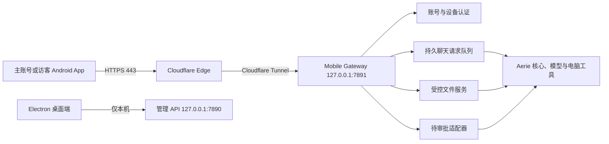

# Aerie v2 安卓远程伴侣主控方案

> [!IMPORTANT]
> 本文档是 Aerie v2 安卓远程伴侣的唯一主控文档。后续端口、接口、账号、权限、数据结构、部署方式或验收标准发生变化时，必须先更新本文档和相应测试合同，再修改实现。

## 0. 文档状态

| 项目 | 当前值 |
| --- | --- |
| 文档状态 | `implementing` |
| 当前阶段 | Phase 0-3 门禁已完成，进入 Phase 4 Android 真机业务验收；Phase 5 不得提前开始 |
| 当前实现状态 | 生产 owner `3489352115` 已绑定 `actor_primary` 且历史回填验收通过；四个运行 Flag 已通过本机 `.env` 覆盖启用，仓库默认仍关闭。`7890` 与独立 `7891` 已启动并通过安全路由验收。Phase 3 已由移动 API、持久 Worker、真实 Pipeline、桌面共享历史和 owner/guest 隔离组合合同收口。Android 已完成认证、Room/Retrofit、SSE、Compose、前台 `dataSync` 服务本体和约 15 分钟 WorkManager 状态同步；同时间戳长回复已通过 `messageOrder` 合同、Room v2 迁移和真机 instrumented test 修复。当前手机安全会话为空，仍需重新登录后完成真实历史排序、七段长回复连续显示、周期任务登记和长任务通知验收，Phase 4 不标记完成 |
| 当前公开域名 | `aerie.etta.top`，Cloudflare DNS 已确认激活；Tunnel 尚未创建 |
| 当前后端 | `127.0.0.1:7890` 本地 FastAPI 管理 API |
| 计划手机网关 | `127.0.0.1:7891` 独立最小权限 FastAPI 应用 |
| Android 目标设备 | VIVO Y500 Pro，OriginOS 6，Android 16 |
| 首版分发方式 | 固定签名 APK，私有安装，不上应用商店 |
| Android 客户端仓库 | `https://github.com/Laser1209/Aerie-Android`，本地工作树为 `E:\Agent_reply\android-client`；已初始化并推送 `main` |

### 0.1 状态词含义

- `planned`：已确定合同，尚未开始实现。
- `implementing`：正在实现，不能宣称可用。
- `verified`：自动化测试和指定人工验收均已通过。
- `released`：已生成固定签名 APK，并在目标手机完成发布验收。
- 每个阶段只有在 Evidence 中写入真实命令、结果和日期后，才能标记完成。

## 1. 目标与边界

### 1.1 目标

1. 使用 Android 原生 App 代替 QQ 作为主要移动入口。
2. 手机只负责登录、聊天、发送指令、传输文件、查看状态和审批；模型推理、工具执行、文件处理和产出继续在电脑完成。
3. 手机断网、切后台或 SSE 断开时，电脑上的持久请求继续执行；手机恢复后重新同步。
4. 通过 Cloudflare Tunnel 访问本地电脑，不开放家庭路由器入站端口。
5. 保留 QQ 作为可选兼容通道，但 Android 路径必须能在 `AERIE_DISABLE_QQ=true` 时独立工作。

### 1.2 首版包含

- 一个主账号和若干访客账号。
- 账密登录、新设备一次性配对码、设备会话与撤销。
- 主账号与桌面端共享聊天时间线。
- 访客聊天、长期记忆和文件空间相互隔离。
- 文本请求、历史、排队状态、取消、重试和实时状态事件。
- 图片及常用文档的双向传输，单文件最大 `50MB`。
- 主账号查看访客聊天与安全审计。
- 主账号在手机上批准或拒绝电脑端已经生成的待审批项。
- 有活动请求、传输或已知待审批时运行 Android 前台服务。

### 1.3 首版不包含

- 不公开 `7890` 管理 API。
- 不提供手机端任意 Shell、任意路径删除、系统重启、密钥管理或配置修改入口。
- 不提供公网注册、找回密码或角色修改接口。
- 不提供应用商店发布、FCM、VIVO 厂商推送或全天候云端中继。
- 不把 OPPO Reno 5K 作为首版服务器；首版唯一计算服务器是当前 Windows 电脑。
- 不自动执行离线期间积压的旧指令。

## 2. 已锁定的产品决策

| 主题 | 已确定决策 |
| --- | --- |
| 首版能力 | 文本、任务状态、图片和文件双向传输 |
| 聊天关系 | 主账号手机与桌面共享同一时间线 |
| 后台模式 | 有活动任务时启动前台服务，完成后自动停止 |
| 登录 | 用户名、密码、新设备配对码、可撤销设备令牌 |
| 账号创建 | 只能在电脑本地创建和管理 |
| 账号模型 | 一个主账号，加若干访客账号 |
| 访客能力 | 可聊天和使用安全工具；高风险操作只能申请审批 |
| 访客隔离 | 聊天、长期记忆和文件收发箱逐账号隔离 |
| 主账号审计 | 可查看访客聊天、文件活动、登录和审批记录 |
| 文件范围 | 常用格式，单文件最大 `50MB` |
| 文件目录 | 主账号使用电脑配置的授权目录；访客使用独立 Inbox/Outbox |
| 手机审批 | 可处理全部已有待审批项，但没有直接高权限命令入口 |
| 审批验证 | 每次高风险决定都需指纹、人脸或设备锁屏凭据 |
| 通知隐私 | 锁屏通知只显示状态，不显示正文或文件名 |
| App 锁 | 普通聊天无需二次验证，仅审批时强制验证 |
| 离线发送 | 保存为待发送，恢复网络后由用户手动确认 |
| 更新方式 | 使用同一签名密钥生成 APK 并覆盖升级 |

## 3. 总体架构



### 3.1 强制隔离原则

1. `7890` 和 `7891` 必须是两个不同的 FastAPI `app`，不能把现有管理路由整体挂载到手机网关。
2. Cloudflare Tunnel 只能指向 `http://127.0.0.1:7891`。
3. `7891` 不安装通配 CORS；Android 原生请求不需要浏览器 CORS。
4. 网关只通过明确的服务适配器调用 Aerie 核心，禁止代理任意 `/api/*` 路径。
5. 网关启动失败时固定报告失败，不自动选择其他端口；桌面端可以继续运行。

## 4. 端口与网络合同

| 端口/地址 | 方向 | 用途 | 公网可见 | 规则 |
| --- | --- | --- | --- | --- |
| `127.0.0.1:7890` | 本机 | Aerie 完整管理 API | 否 | 保持本地绑定，禁止 Tunnel |
| `127.0.0.1:7891` | 本机 | Android 安全网关 | 经 Tunnel 间接可达 | 只开放移动白名单接口 |
| `https://aerie.etta.top:443` | 手机到 Cloudflare | Android 公网入口 | 是 | 仅 HTTPS |
| `7844/UDP` | 电脑出站 | Cloudflare Tunnel QUIC | 不适用 | 失败时允许回退 `443/TCP` |
| `127.0.0.1:3001` | 本机 | NapCat WebSocket | 否 | QQ 可选，不是 Android 依赖 |

### 4.1 Cloudflare 规则

- 使用命名 Tunnel：`aerie.etta.top -> http://127.0.0.1:7891`。
- `cloudflared` 最终安装为 Windows 服务，凭据保存在用户目录，不进入 Git。
- 首版不启用 Cloudflare Access 浏览器登录，以免阻断 Android 原生 API；认证由应用账号和设备令牌负责。
- DNS 未在主要公共解析器全部返回 Cloudflare 名称服务器前，不进行正式公网验收。
- 不配置路由器端口转发，不把电脑局域网 IP 暴露到 DNS。

## 5. 账号、身份与数据隔离

### 5.1 角色

| 角色 | 能力 |
| --- | --- |
| `owner` | 主聊天、授权目录、设备管理、访客审计、所有待审批项的批准或拒绝 |
| `guest` | 独立聊天、独立记忆、独立 Inbox/Outbox、安全工具和高风险审批申请 |

系统只允许存在一个启用状态的 `owner`。访客数量由电脑本地管理工具控制。

### 5.2 身份映射

- 主账号绑定现有桌面 Actor 和 `AERIE_PRIMARY_USER_ID`，保证手机与 Electron 共享主聊天时间线。
- `AERIE_PRIMARY_USER_ID` 首次配置为当前稳定内部用户编号；兼容期可回退现有 `SELF_QQ`，但不得要求 QQ 进程在线。
- 每个访客创建独立 Actor、独立 Conversation 和独立内部用户编号。
- 同一账号的多台已授权设备共享该账号的聊天和文件权限，但拥有不同设备令牌。
- 设备来源单独写入移动审计；不能为了审计而拆开主账号的共享聊天上下文。

### 5.3 计划认证数据库

移动认证数据使用独立 SQLite 文件 `data/mobile_gateway.db`，避免把认证生命周期耦合到聊天表。计划表：

- `mobile_accounts`：账号、角色、密码哈希、Actor、内部用户编号、状态。
- `mobile_devices`：设备名称、公钥、创建时间、最后使用时间、撤销时间。
- `mobile_refresh_tokens`：刷新令牌哈希、轮换链、过期和撤销状态。
- `mobile_pairing_sessions`：配对码哈希、有效期、失败次数和使用状态。
- `mobile_directory_grants`：主账号授权目录及读、上传、下载权限。
- `mobile_files`：不透明文件 ID、所有者、真实路径、哈希、状态和扫描结果。
- `mobile_request_idempotency`：账号、设备、`clientRequestId` 和后端请求 ID。
- `mobile_audit`：登录、设备、文件、工具申请和审批结果，不记录密码或令牌。

## 6. 账密、配对与会话合同

### 6.1 本地账号管理

计划提供 `scripts/mobile_accounts.py`，仅在电脑本地执行：

```text
create-owner       创建唯一主账号
create-guest       创建访客账号
reset-password     重置密码并撤销既有会话
pairing-code       为指定账号生成一次性八位配对码
list-accounts      查看脱敏账号状态
list-devices       查看账号设备
revoke-device      撤销指定设备
disable-account    禁用访客并撤销全部设备
```

### 6.2 密码与登录

- 用户名规范化后唯一，长度 `3-32`，只允许字母、数字、点、下划线和连字符。
- 密码最少 `12` 个字符，使用 `Argon2id` 加盐哈希；日志和异常中禁止出现密码。
- 新设备首次登录必须同时提交用户名、密码、设备名称和八位配对码。
- 配对码有效期 `10` 分钟、单次使用；每 IP 和账号 `15` 分钟最多失败 `5` 次。
- 登录错误统一返回 `invalid_credentials`，不得泄露账号是否存在。

### 6.3 令牌

- Access Token：不透明随机值，有效期 `15` 分钟。
- Refresh Token：不透明随机值，有效期 `30` 天，每次刷新必须轮换。
- 服务端只保存带服务器 Pepper 的 HMAC-SHA256 哈希；Pepper 只放 `.env`。
- 检测到旧 Refresh Token 被重复使用时，撤销整条令牌家族。
- Android 使用 Keystore 加密 Refresh Token；Access Token 只保存在内存。
- 改密、禁用账号、注销或撤销设备必须立即失效对应会话。

## 7. 手机 API 合同

所有端点使用前缀 `/api/mobile/v1`。除健康检查和登录/刷新外，必须携带 `Authorization: Bearer <access-token>`。

### 7.1 通用格式

- JSON 字段使用 `camelCase`。
- 所有 ID 在 Android 中按字符串处理。
- 时间使用 UTC ISO 8601。
- 错误结构固定为：

```json
{
  "error": {
    "code": "stable_error_code",
    "message": "可显示的简短说明",
    "requestId": "req_xxx"
  }
}
```

### 7.2 认证与设备

| 方法 | 路径 | 用途 |
| --- | --- | --- |
| `GET` | `/health` | 只返回 `status` 和 `apiVersion` |
| `POST` | `/auth/login` | 账密和新设备配对 |
| `POST` | `/auth/refresh` | 轮换 Access/Refresh Token |
| `POST` | `/auth/logout` | 撤销当前设备会话 |
| `GET` | `/me` | 当前账号、角色和设备能力 |
| `GET` | `/devices` | 查看当前账号设备 |
| `DELETE` | `/devices/{deviceId}` | 主账号或设备本人撤销设备 |

### 7.3 聊天与请求

| 方法 | 路径 | 用途 |
| --- | --- | --- |
| `GET` | `/messages` | `beforeId`/`afterId` 游标分页，默认 `50`，最大 `100` |
| `POST` | `/requests` | 提交文本和已完成上传的文件 ID，返回 `202` |
| `GET` | `/requests/{requestId}` | 查询真实请求状态 |
| `POST` | `/requests/{requestId}/cancel` | 取消 queued/running 请求 |
| `POST` | `/requests/{requestId}/retry` | 为 failed/cancelled 请求创建新请求 |
| `GET` | `/events` | 经过过滤并支持重连游标的 SSE |

提交请求的核心字段：

```json
{
  "clientRequestId": "UUID",
  "text": "用户可见文本",
  "fileIds": ["file_xxx"]
}
```

- 文本去除首尾空白后最大 `20000` 字符。
- `clientRequestId` 在同一账号内唯一；重复提交必须返回原请求，不能重复执行。
- 允许纯文件请求，但文本和文件不能同时为空。
- `/messages` 每项和 `message.created` SSE 数据必须包含同一个 64 位整数 `messageOrder`；客户端只能按它升序排列消息，不得使用 `createdAt`、`messageId` 或到达顺序替代。`createdAt` 仅用于显示，`messageOrder` 不作为公开分页游标。
- SSE 只允许 `message.created`、`request.updated`、`approval.pending`、`file.updated`、`stream.open` 和心跳。
- SSE 只是及时通道；数据库查询才是最终真相，断线恢复必须重新同步消息和未完成请求。

### 7.4 文件

| 方法 | 路径 | 用途 |
| --- | --- | --- |
| `POST` | `/files/uploads` | 创建上传会话和返回分块参数 |
| `PUT` | `/files/uploads/{uploadId}/parts/{partNumber}` | 上传 `4MB` 分块 |
| `POST` | `/files/uploads/{uploadId}/complete` | 校验大小、SHA-256 和扫描结果 |
| `DELETE` | `/files/uploads/{uploadId}` | 取消未完成上传 |
| `GET` | `/files` | 按账号 ACL 列出可见文件 |
| `GET` | `/files/{fileId}` | 获取脱敏元数据 |
| `GET` | `/files/{fileId}/content` | 下载，支持 HTTP Range |

### 7.5 审批与主账号审计

| 方法 | 路径 | 权限 | 用途 |
| --- | --- | --- | --- |
| `GET` | `/approvals` | owner | 待审批列表 |
| `GET` | `/approvals/{approvalId}` | owner | 脱敏审批详情 |
| `POST` | `/approvals/{approvalId}/challenge` | owner | 创建一次性签名挑战 |
| `POST` | `/approvals/{approvalId}/decision` | owner | 提交签名后的批准或拒绝 |
| `GET` | `/owner/guests` | owner | 访客状态列表 |
| `GET` | `/owner/guests/{accountId}/messages` | owner | 查看访客聊天 |
| `GET` | `/owner/audit` | owner | 查询访客、文件和审批审计 |

## 8. 文件安全合同

### 8.1 格式与大小

首版允许：PNG、JPEG、GIF、WebP、TXT、MD、CSV、JSON、PDF、DOCX、XLSX、PPTX 和 ZIP。ZIP 只作为文件传输，不自动解压。

- 单文件最大 `50MB`。
- 文件名只作为显示信息；真实存储名由服务端生成。
- 拒绝 EXE、DLL、MSI、BAT、CMD、PS1、JS、VBS、SCR、LNK 等可执行或脚本文件。
- MIME、扩展名和文件签名必须交叉检查，不能只相信客户端声明。

### 8.2 目录隔离

- 主账号只能访问电脑端明确登记的授权目录，并分别配置读、上传、下载能力。
- 访客只能访问 `data/mobile_files/<account-id>/inbox` 和 `outbox`。
- API 只接受不透明 `fileId`，禁止接受客户端绝对路径或 `../` 路径片段。
- 上传完成前位于隔离区；SHA-256、大小、分块完整性和 Windows Defender 扫描通过后才能标记 `ready`。
- 电脑产物必须先登记进 `mobile_files`，不能用任意本地路径直接生成下载链接。

## 9. 手机审批安全合同

### 9.1 审批边界

- 手机只能处理电脑权限系统已经创建的待审批记录。
- 手机网关没有直接 Shell、删除文件、修改权限或系统控制端点。
- 访客不能批准任何高风险操作，只能创建申请。
- 主账号可以批准主账号和访客触发的待审批项。
- 审批详情只展示必要的动作摘要、风险等级、目标、发起账号、创建时间和过期时间；敏感参数必须脱敏。

### 9.2 生物识别签名

1. 主账号设备首次登录时，在 Android Keystore 创建不可导出的 ECDSA 密钥。
2. 私钥设置为每次签名都需要 `BiometricPrompt`，允许系统生物识别或设备锁屏凭据。
3. App 只把公钥登记到对应设备记录。
4. 决策前，服务器签发有效期 `60` 秒、单次使用的随机挑战。
5. App 经生物识别解锁私钥，对挑战和审批 ID 的规范化载荷签名。
6. 服务器验证设备、owner 角色、签名、挑战时效、审批状态和重放状态后，才调用本地审批处理器。
7. 批准、拒绝、失败和重放尝试全部写入脱敏审计。

## 10. Android 工程合同

### 10.1 工程基线

| 项目 | 决策 |
| --- | --- |
| 目录 | `E:\Agent_reply\android-client` |
| 应用名 | `Aerie 云栖` |
| Application ID | `top.etta.aerie` |
| 语言/UI | Kotlin + Jetpack Compose Material 3 |
| 架构 | 单 App 模块、MVVM、Repository、`AppContainer` 手动依赖注入 |
| JDK | 17 |
| Gradle | Wrapper `8.11.1` |
| Android Gradle Plugin | `8.9.2` |
| Kotlin | `2.1.20` |
| compile/target SDK | `35` |
| min SDK | `28` |
| 分发 | 固定签名 APK |

版本是首个可复现构建基线。若 Maven 或 AGP 兼容性验证失败，必须先在决策日志记录原因和替代版本，禁止直接漂移到“最新版”。

### 10.2 主要依赖

- Compose Material 3、Navigation Compose、Lifecycle ViewModel。
- Coroutines/Flow、kotlinx.serialization。
- Retrofit、OkHttp、OkHttp SSE。
- Room：消息缓存、未完成请求、离线待发送和文件传输状态。
- DataStore：非敏感设置；令牌密文由 Android Keystore 保护。
- WorkManager：应用未运行时进行不早于约 `15` 分钟周期的状态检查，不承诺实时推送。

### 10.3 页面与角色差异

主账号：

- 登录/新设备配对。
- 主聊天与共享历史。
- 文件与授权产物。
- 待审批列表和审批详情。
- 访客列表、访客聊天和安全审计。
- 设置、设备列表、注销。

访客账号：

- 登录/新设备配对。
- 独立聊天。
- 独立 Inbox/Outbox。
- 自己的请求状态和设置。
- 不显示审批、访客管理或主账号目录。

### 10.4 前后台和通知

- 存在 queued/running 请求、活动上传/下载或当前已知待审批时，启动 `dataSync` 类型前台服务。
- 所有活动完成后自动停止前台服务和 SSE。
- 通知只显示“正在执行”“等待审批”“传输中”“已完成”之类状态，不显示正文或文件名。
- Android 13+ 请求通知权限；权限被拒绝时明确降级，不伪装为后台实时在线。
- Android 15/16 对 `dataSync` 前台服务的时限必须纳入测试；服务被系统停止不影响电脑任务，App 下次打开后恢复。
- 没有 FCM 或厂商推送时，App 完全关闭状态下不能保证立即收到访客审批提醒。

### 10.5 离线与恢复

- 离线文本和附件写入 Room，状态为 `awaiting_confirmation`。
- 网络恢复后只提示用户，不自动发送。
- 用户确认后生成固定 `clientRequestId`；超时重试复用同一 ID。
- 前台 SSE 断开按 `1/2/4/8/30` 秒上限退避并加入抖动。
- 每次回到前台先刷新令牌，再同步消息游标、未完成请求、文件状态和待审批列表。

### 10.6 仓库边界

- `E:\Agent_reply` 的当前 Aerie 服务器仓库（当前分支为 `Aerie-Model-X`）只保存 Python 网关、桌面端、服务器端测试和本文档；`core/mobile_gateway.py` 不属于 Android 客户端仓库。
- `E:\Agent_reply\android-client` 是独立 Git 工作树，`origin` 固定为 `https://github.com/Laser1209/Aerie-Android.git`；只保存 Gradle、Kotlin、Compose、Android 资源、客户端测试、客户端 CI 和从主控文档派生的客户端合同。
- 父仓库必须忽略 `android-client/`，不得把 Android 的 `.git`、构建产物或客户端源文件作为 Aerie 服务器仓库的普通文件暂存。
- 本文档继续是跨仓库的唯一主控文档。Android 仓库可保存接口合同副本，但接口、权限、端口或安全边界变动必须先更新本文档并同步相应测试，禁止两份文档漂移。

## 11. 配置与秘密

计划新增的配置名称：

```text
AERIE_MOBILE_GATEWAY_ENABLED=false
AERIE_MOBILE_GATEWAY_HOST=127.0.0.1
AERIE_MOBILE_GATEWAY_PORT=7891
AERIE_MOBILE_PUBLIC_URL=https://aerie.etta.top
AERIE_PRIMARY_USER_ID=<local-internal-id>
AERIE_MOBILE_TOKEN_PEPPER=<random-secret>
AERIE_DISABLE_QQ=false
```

- 真实 Pepper、密码、令牌、Cloudflare Tunnel 凭据和 APK 签名密钥不得写入本文档或 Git。
- `.env.example` 未来只能写变量名和占位符。
- Android APK 只能包含公开域名和公钥，不得包含服务器 Pepper、账号密码、Cloudflare 凭据或模型 API Key。
- Release keystore 放在仓库外；记录安全备份位置，但不在文档中记录密码。

## 12. 错误、限流与日志

### 12.1 稳定错误码

首版至少固定：`invalid_credentials`、`pairing_required`、`pairing_expired`、`account_disabled`、`device_revoked`、`token_expired`、`rate_limited`、`invalid_message`、`request_not_found`、`request_conflict`、`file_too_large`、`file_type_denied`、`file_scan_failed`、`file_not_found`、`approval_not_found`、`approval_expired`、`approval_signature_invalid`、`backend_unavailable`。

### 12.2 限流基线

- 登录/配对：每 IP 和账号 `5/15分钟`。
- 发消息：每账号 `10/分钟`，突发上限 `3`。
- 普通认证 API：每设备 `120/分钟`。
- SSE：每设备最多 `2` 条并发连接。
- 上传：每账号最多 `2` 个活动上传。

### 12.3 日志规则

- 可以记录 request ID、账号 ID、设备 ID、动作类型、状态码、耗时和脱敏错误码。
- 禁止记录密码、Access/Refresh Token、配对码、审批挑战、完整聊天正文、完整文件内容、模型 Key 和真实完整路径。
- 普通聊天内容仍按 Aerie 现有聊天存储合同保存；“访问日志不记录正文”不等于“不保存聊天历史”。

## 13. 分阶段实施门禁

### Phase 0：文档基线

- [x] 创建主控 MD。
- [x] 写入已确认的产品决策、架构、端口和安全边界。
- [x] 完成 UTF-8、Markdown、端口和敏感信息检查。
- [x] 将检查结果写入 Evidence，关闭文档基线阶段。

### Phase 1：最小安全网关

- [x] 新建独立 `7891` FastAPI app、健康检查和生命周期管理。
- [x] 增加 `mobile_gateway_v1` 开关，默认关闭。
- [x] 建立路由清单测试，证明管理路由均不可达。
- [x] 网关保持 `127.0.0.1` 绑定，不接 Tunnel。

### Phase 2：账号、设备与身份

- [x] 生产数据库一致性备份、`quick_check` 和恢复演练。
- [x] 实现移动认证数据库和本地账号管理工具。
- [x] 实现 Argon2id、配对码、令牌轮换、撤销和限流。
- [x] 建立 owner/guest Actor 绑定及历史、记忆隔离测试。

### Phase 3：持久聊天

- [x] 启用并验证 Conversation Model 和持久 Request Queue。
- [x] 实现移动请求、历史、状态、取消、重试和幂等。
- [x] 实现过滤后的移动 SSE 和断线恢复。
- [x] 验证主账号桌面共享与访客互相隔离。

### Phase 4：Android 基础端

> 2026-07-22 用户授权提前创建和实现独立 Android 本体。此授权允许工程、客户端架构、界面、本地存储、安全容器和模拟合同并行开发，不代表 Phase 2/3 已完成，也不能提前宣称真实后端联调或 Phase 4 验收通过。

- [x] 创建 Gradle Wrapper 和 Compose 工程。
- [ ] 完成登录、配对、角色导航、聊天和请求状态。
- [ ] 完成 Room、Keystore、前台服务、通知和恢复。
- [ ] 在 VIVO Y500 Pro 通过 ADB 安装并完成本地接口测试。

### Phase 5：文件双向传输

- [ ] 实现分块上传、续传、SHA-256、Range 下载和文件登记。
- [ ] 实现主账号目录 ACL 和访客独立 Inbox/Outbox。
- [ ] 接入 Windows Defender 隔离扫描。
- [ ] Android 完成文件选择、进度、取消、恢复、预览和下载。

### Phase 6：手机审批

- [ ] 建立现有待审批系统的最小适配器。
- [ ] 实现 owner-only 审批列表、详情和审计。
- [ ] 实现 Keystore ECDSA、公钥登记、挑战和生物识别签名。
- [ ] 验证重放、过期、撤销设备和访客越权均被拒绝。

### Phase 7：Cloudflare Tunnel

- [ ] 确认公共 DNS 全部返回 Cloudflare 名称服务器。
- [ ] 创建命名 Tunnel 并只路由 `aerie.etta.top -> 127.0.0.1:7891`。
- [ ] 安装 Windows 服务并验证重启恢复。
- [ ] 外网验证 `7890` 所有高权限路径不可达。

### Phase 8：发布与 QQ 独立验收

- [ ] 创建仓库外签名密钥并安全备份。
- [x] 构建 Release APK，扫描 APK 内敏感字符串。
- [ ] 在目标手机覆盖安装并验证数据保留。
- [ ] 使用 `AERIE_DISABLE_QQ=true` 完成聊天、文件和审批闭环。
- [ ] 文档状态更新为 `released`。

## 14. 测试合同

### 14.1 后端自动化

- 网关路由白名单：`/api/system/restart`、`/api/brain/shell`、`/api/env/*`、`/api/config/*`、`/api/computer_control/*` 在 `7891` 必须为 `404`。
- 密码、配对码、令牌轮换、复用检测、锁定、注销和设备撤销。
- owner/guest 身份、历史、记忆、文件、审计和审批隔离。
- `clientRequestId` 重试不会生成重复请求或重复电脑副作用。
- 相同 `createdAt` 的一条用户消息和多段 assistant 回复在 `/messages` 与 `message.created` 中保持相同且严格递增的 `messageOrder`。
- SSE 丢失、重复、乱序和进程内 replay 后以数据库状态收敛。
- 文件大小、扩展名伪造、MIME 伪造、路径穿越、越权 file ID、分块缺失、哈希错误和扫描失败。
- 审批签名正确、错误、过期、重复、跨设备、访客越权和已撤销设备。
- `AERIE_DISABLE_QQ=true` 时队列在 QQ 未连接状态仍可工作。
- 定向测试通过后运行完整 Python 回归。

### 14.2 Android 自动化

- Repository、DTO、错误映射、令牌刷新互斥和幂等发送单元测试。
- MockWebServer 覆盖登录、刷新、聊天、SSE 重连、401 重试和文件分块。
- Room 覆盖游标、待发送、进程重启和账号切换隔离。
- Room 覆盖相同时间戳消息按 `messageOrder` 排列，以及 v1 到 v2 迁移保留消息并清除同步游标后全量收敛。
- WorkManager 覆盖远程会话登记、注销/本地预览取消、约 15 分钟唯一周期、联网约束、失败重试，以及不得自动发送待确认指令。
- Compose 覆盖 owner/guest 导航、离线状态、取消/重试、审批和错误提示。
- Keystore/签名使用 instrumented test，不在 JVM 测试中伪称已验证硬件行为。
- `assembleDebug`、单元测试、instrumented test 和 `assembleRelease` 均需记录结果。

### 14.3 真机验收

1. 主账号使用账密和一次性配对码登录。
2. 手机消息立即出现在桌面共享时间线，桌面回复可同步到手机。
3. 访客登录后看不到主账号或其他访客内容。
4. 手机退后台后电脑继续执行；前台服务通知不泄露正文。
5. 断网期间保存指令，恢复后不自动发送，手动确认只执行一次。
6. 上传和下载接近 `50MB` 文件，网络中断后可以恢复。
7. 访客高风险操作进入审批；主账号生物识别后可批准或拒绝。
8. 撤销设备后旧 Token、SSE、文件下载和审批立即失败。
9. Windows 和 `cloudflared` 重启后 App 能恢复连接。
10. QQ/NapCat 完全关闭时，聊天、文件和审批仍能工作。

## 15. 回滚原则

- 功能开关默认关闭；关闭 `mobile_gateway_v1` 后停止 `7891`，不删除账号或审计数据。
- Tunnel 路由只在本地网关全部安全测试通过后建立；异常时先停止 Tunnel，不改 `7890`。
- Conversation/Identity 开关变化前必须使用 SQLite Backup API 创建一致性副本并验证恢复。
- 数据迁移只允许向前新增表或列；回滚默认停用功能并保留数据，不执行破坏性删除。
- Android 更新失败时允许安装上一个同签名版本；数据库 schema 变化必须保证向后兼容或提供显式迁移。
- 签名密钥丢失意味着无法覆盖升级，必须在首次 Release 前完成离线备份。

## 16. Evidence

### 2026-07-21：文档基线前只读核对

- 现有后端默认监听 `127.0.0.1:7890`。
- `core/api_server.py` 同时包含聊天、配置、系统、电脑控制、权限、文件和密钥相关接口；现有 app 使用通配 CORS 且没有面向公网的网络鉴权，因此不能直接接入 Tunnel。
- `config/settings.yaml` 当前 `chat_request_queue_v1=false`、`chat_stream_v1=false`、`conversation_model_v1=false`、`identity_contract_v1=false`。
- 现有 Electron 聊天代码和测试已经支持请求队列的 `202`、状态、取消、重试和恢复合同。
- 本机已有 JDK 17、ADB、Android SDK Platform 35/36.1 和 Build Tools 34/35/36.1/37；没有全局 Gradle，后续使用项目 Gradle Wrapper。
- VS Code 可用；Android Studio 不是构建前提。
- Aerie 品牌 PNG 为 `938x938`，可作为启动资源和自适应图标制作来源。
- 公共 DNS 曾出现 Google DNS 已返回 Cloudflare、`1.1.1.1` 仍返回 DNSPod 的传播中状态，正式 Tunnel 验收前必须重新检查。
- 本次阶段只允许新增本文档；未修改 Python、Android、配置、数据库或运行服务。

### 2026-07-21：文档基线检查

- [x] UTF-8 严格解码通过：`29691` bytes、`587` lines（回写 Evidence 前统计）。
- [x] Markdown 结构通过：`63` 个标题、`10` 条代码围栏且数量平衡、`1` 个 Mermaid 块。
- [x] 端口检查通过：管理 API 固定 `7890`，手机网关固定 `7891`，公网入口固定 HTTPS `443`；`7844` 仅用于 Tunnel 出站，`3001` 仅为可选本地 NapCat。
- [x] 敏感字面量扫描通过：未发现真实密码、Bearer Token、Pepper、API Key、Tunnel 凭据或签名密码。
- [x] Git 范围检查通过：本任务只新增 `documents/Android/Aerie_Android_Companion_Master_Plan.md`；工作区原有 `.codex-deploy-aerie-spotlight` 和两项 `data/` 运行态改动未被触碰。
- [x] `git diff --check` 对本文档未报告空白错误。

### 2026-07-21：Phase 1 最小安全网关验证

- [x] 新增独立 `core/mobile_gateway.py`；其 FastAPI app 不挂载或代理 `core.api_server.app`，且关闭 `/docs`、`/redoc`、`/openapi.json` 和 CORS。
- [x] 唯一公开路由为 `GET /api/mobile/v1/health`，固定返回 `{"status":"ok","apiVersion":"v1"}` 与 `Cache-Control: no-store`。
- [x] 网关默认且仅允许绑定 `127.0.0.1:7891`；`0.0.0.0`、局域网地址、IPv6 通配地址和无效端口均被拒绝。网关启动失败会记录明确错误，不会让桌面后端退出或自动改用其他端口。
- [x] `config/settings.yaml` 新增 `mobile_gateway_v1: false`；环境变量 `AERIE_MOBILE_GATEWAY_ENABLED` 只可显式覆盖为布尔值。
- [x] `python -m pytest --basetemp=E:\Agent_reply\tmp\pytest-mobile-gateway-phase1-final tests/test_mobile_gateway.py -q`：`25 passed`。
- [x] `python -m py_compile core\mobile_gateway.py main.py`：通过。
- [x] `python -m pytest --basetemp=E:\Agent_reply\tmp\pytest-office-isolation-phase1 tests/test_v139_batch2.py::test_data_tools -q`：`1 passed`。原测试会向用户配置的 `F:\文件\Aerie` 写入 SVG；现仅在该测试中使用 pytest 临时目录，生产办公目录配置和行为未改动。
- [x] `python -m pytest --basetemp=E:\Agent_reply\tmp\pytest-mobile-gateway-full-phase1-final tests -q`：`586 passed`。仅有既有 FastAPI/asyncio 弃用警告和 `.pytest_cache` 路径冲突警告，无测试失败。
- [x] Phase 0/1 复核：`7890` 仍仅为本地管理 API，`7891` 的路由清单只有健康检查；端口、开关和主控文档一致。`git diff --check` 未报告空白错误。
- [x] 用户已确认 `etta.top` 已成功由 Cloudflare 解析。此证据只确认 DNS/Zone 已激活；Phase 7 仍需在公共解析器重新核验并创建只指向 `127.0.0.1:7891` 的命名 Tunnel。

### 2026-07-21：Android 仓库边界确认

- [x] 用户明确要求 Android 客户端与 `Aerie-Model-X` 分开，目标远程仓库为 `https://github.com/Laser1209/Aerie-Android`。
- [x] `git ls-remote https://github.com/Laser1209/Aerie-Android.git` 成功但无引用，确认远程仓库可访问且尚未初始化内容。
- [x] 主仓库当前 `HEAD` 为 `71b8815 feat(mobile): add isolated Android gateway foundation`；该提交中的 Python 网关、服务器配置和 Python 测试保留在服务器仓库，不复制到 Android 仓库。
- [x] 已将空远程克隆到 `E:\Agent_reply\android-client`，建立 Android 专用 `README.md` 与 `.gitignore`，并创建本地根提交 `a20f883 chore: initialize Android companion repository`。
- [x] HTTPS 推送受 `github.com:443` 网络故障影响后，已验证 SSH 认证并将 `origin` 切换为 `git@github.com:Laser1209/Aerie-Android.git`；`git push -u origin main` 成功，远程 `main` 已发布本地根提交 `a20f883`。

### 2026-07-22：Android 本体提前开发授权

- [x] 用户明确要求直接开始生成 Android 本体并在 `E:\Agent_reply\android-client` 本地向后推进。
- [x] 提前开发范围限定为独立 Android 仓库中的可构建工程、客户端架构、界面、本地存储、安全容器、前台服务和基于既定 API 合同的客户端测试。
- [x] 本批开始时 Phase 2/3 仍由服务器 Agent 负责；Android 真实联调、真机业务闭环和 Phase 4 完成标记继续等待这些门禁。
- [x] 提前 ADB 预检通过：Android SDK ADB 独立识别 VIVO `V2516A`，设备状态为 `device`，Android 16/API 36；该结果不等同于 APK 安装验收。

### 2026-07-22：Phase 4 Android 工程基线

- [x] 在独立分支 `codex/phase4-android-foundation` 创建单 `app` 模块、Application ID `top.etta.aerie`、compile/target SDK 35 和 min SDK 28。
- [x] 生成 Gradle Wrapper 8.11.1；固定腾讯 Gradle 镜像并配置官方 SHA-256 `f397b287023acdba1e9f6fc5ea72d22dd63669d59ed4a289a29b1a76eee151c6`，本地分发包校验一致。
- [x] 固定 Android Gradle Plugin 8.9.2、Kotlin 2.1.20、JDK 17，并建立 Compose Material 3、MVVM、Repository 和手动 `AppContainer` 基线。
- [x] 完成登录/配对界面、owner/guest Debug 本地预览、聊天/任务/文件/设置主壳；Release 构建常量禁止本地预览绕过登录。
- [x] `.\gradlew.bat :app:clean :app:testDebugUnitTest :app:assembleDebug :app:lintDebug --no-daemon`：通过；`5` 项会话输入、角色和退出测试全部通过，Lint 为 `No issues found`。
- [x] Debug APK 元数据通过：`top.etta.aerie`、`0.1.0-dev`、min SDK 28、target/compile SDK 35；APK 为 `65393180` bytes，SHA-256 `C10ECCDFFB0A6CF0E1B9A9666826DA22D8B41A937E22F56B2610C97AE795DF35`。
- [x] ADB 在唯一连接的 vivo `V2516A`（Android 16/API 36）执行 `adb install -r` 成功；`top.etta.aerie/.MainActivity` 冷启动成功，进程 PID `16107`。该证据证明安装和启动，不替代 Phase 2/3 完成后的本地接口与业务闭环测试。

### 2026-07-22：Phase 2/3 重新执行接管

- [x] 用户将 Phase 2/3、后续提交和上传操作正式交由当前开发任务统一负责。
- [x] 重新审计服务器仓库和既有实现：Phase 1 当时仅有 health；移动账号/设备/令牌不存在；主系统已有 Conversation/Request Queue，但未接入 `7891`。
- [x] 新增独立 `data/mobile_gateway.db` 存储、Argon2id、10 分钟一次性八位配对码、15 分钟失败限流、15 分钟 Access Token、30 天 Refresh Token 轮换/家族复用撤销、设备撤销和脱敏审计。
- [x] 新增本地 `scripts/mobile_accounts.py`，覆盖 owner/guest 创建、改密、配对码、账号/设备列表、设备撤销和账号禁用；owner 创建时将 `mobile`、`desktop/local` 和对应 QQ 兼容身份绑定到同一 Actor，并按显式 `user_id` 回填历史。
- [x] 新增移动 `/auth/*`、`/me`、`/devices`、`/messages`、`/requests*` 和 `/events`；桌面管理 API、OpenAPI、文档和 CORS 仍未暴露。
- [x] 新增 `007_mobile_event_log`，通过 Actor 过滤的持久事件序列支持 SSE `Last-Event-ID` 重连；数据库查询继续是最终真相。
- [x] `164` 项 Conversation、Request Queue、Worker、API、迁移和移动定向回归通过；仅有 4 条既有 FastAPI `on_event` 弃用警告。
- [x] `python -m pytest tests -q`：`643 passed`、`6 warnings`；警告均为既有 FastAPI `on_event` 和 Python 3.16 前的 asyncio 弃用提示，无测试失败。
- [x] 服务器实现已发布到 `codex/phase2-3-mobile-auth-chat`；因共享工作树并发提交，15 个移动文件首次落在提交 `3a5850c`，本证据提交负责明确其真实 Phase 2/3 内容和后续生产门禁。
- [x] 修复 pytest 收集期导入 `core.api_server` 会默认打开生产库的隔离缺口；修复后回归前后 `data/aerie.db` SHA-256 均为 `99FDB0EA45D27B39A1F3BB0DBD1D61A52BCE6542A962454D688238422A43996D`。
- [x] 当前生产库、`data/backups/aerie_pre_mobile_phase23_20260722_0830.db` 和隔离恢复副本均 `quick_check=ok`；25 张业务表行数及迁移账本完全一致。
- [!] 流程偏差：上述测试隔离修复前，旧测试的 import-time `Database()` 提前把纯新增的 `007` 应用到生产库，早于本轮备份；当时 `quick_check`/`integrity_check` 均为 `ok`。已有 2026-07-20 迁移前备份可用，但不含之后数据，因此未执行破坏性回滚。
- [x] 用户已确认主历史 `user_id` 为 `3489352115`；该编号可以写入本地 `AERIE_PRIMARY_USER_ID`，但账号密码不得通过聊天传递。
- [x] 生产 owner 已通过本地隐藏密码输入创建，`actor_primary` 历史回填和守恒验证通过。
- [ ] 下一门禁：先复核 Phase 0-2 安全边界和回归，再开启 `identity_contract_v1`、`conversation_model_v1`、`chat_request_queue_v1` 和 `mobile_gateway_v1` 并重启验证。

### 2026-07-22：Phase 2/3 生产启用准备

- [x] 只读审计确认 `data/mobile_gateway.db` 原先不存在；`3489352115` 在生产库中有 `1084` 条 `chat_log` 和 `97` 条 `emotion_state_snapshot`，这些记录当前均未绑定 Actor。旧 `SELF_QQ` 与已确认编号不一致，因此正式主身份只使用 `AERIE_PRIMARY_USER_ID=3489352115`，不依赖 QQ 配置猜测。
- [x] 在 Git 忽略的 `.env` 中生成并保存 48 字节高熵 Pepper，配置 `AERIE_PRIMARY_USER_ID=3489352115` 和 `AERIE_MOBILE_AUTH_DB=data/mobile_gateway.db`；只验证存在性和长度，未在命令输出、文档或 Git 中暴露真实 Pepper。
- [x] `.env` 已备份到同样被 Git 忽略的 `.env.pre-mobile.local`；`.env.example` 只新增空的 `AERIE_PRIMARY_USER_ID` 模板。
- [x] 使用 SQLite Backup API 创建 `data/backups/aerie_pre_mobile_owner_20260722_091708.db` 和独立恢复检查副本；源库 SHA-256 前后均为 `99FDB0EA45D27B39A1F3BB0DBD1D61A52BCE6542A962454D688238422A43996D`，三份库均 `quick_check=ok`、外键违规 `0`、`25` 张表逻辑计数一致。
- [x] 初始化空的 `data/mobile_gateway.db`：`quick_check=ok`、外键违规 `0`、`7` 张移动表、账号数 `0`。
- [x] 修复 `scripts/mobile_accounts.py` 直接运行时未加载项目 `.env` 的问题；使用 `override=False` 保留显式进程环境优先级。移动账号、身份、网关和聊天定向回归为 `38 passed`，直接执行 `python scripts/mobile_accounts.py list-accounts` 成功返回空列表。
- [x] 下一门禁已完成：owner `actor_primary` 通过本地隐藏输入创建，密码未通过聊天或命令行参数传递。

### 2026-07-22：Phase 2 生产 owner 创建与历史回填

- [x] Android 登录用户名使用此前确认的账号 `3489352115`；本地 PowerShell 交互窗口调用 `getpass` 隐藏输入并二次确认密码，进程退出码为 `0`。
- [x] `data/mobile_gateway.db` 只有一个启用 owner：username `3489352115`、role `owner`、actor `actor_primary`、user_id `3489352115`；密码字段以 `$argon2id$` 开头，`account.created` 成功审计为 `1`，未读取或输出密码正文。
- [x] 主库存在唯一 `actor_primary`，并建立 `desktop/local`、对应 mobile account 和 `qq/3489352115` 三条渠道绑定。
- [x] 历史守恒：`chat_log` 为 `1084/1084` 绑定、NULL `0`、跨用户 `0`；`emotion_state_snapshot` 为 `97/97` 绑定、NULL `0`、跨用户 `0`；`long_term_memory` 当前为 `0`。
- [x] 规范归属：与该用户 legacy 历史关联的 `1057/1057` 条 `messages` 已绑定；`actor_primary` 拥有 `1` 个 Conversation 和 `104` 个 Request，Request user_id 错配为 `0`。
- [x] 主库与移动库均 `quick_check=ok`、外键违规 `0`；启 Flag 前快照为 `data/backups/aerie_post_mobile_owner_20260722_095250.db` 和 `data/backups/mobile_gateway_post_owner_20260722_095250.db`。

### 2026-07-22：Phase 3 生产 Flag 激活与可靠重启

- [x] Phase 0-2 门禁复核覆盖移动账号、身份、网关、聊天、Conversation、Request Queue、迁移、Worker、Pipeline 和 API，共 `209 passed`、`4` 条既有 FastAPI 弃用警告；测试后两份生产库均 `quick_check=ok`、外键违规 `0`。
- [x] 拒绝把 `config/settings.yaml` 提交为默认开启：相关测试准确复现 `mobile_gateway_v1` 默认值变为 true 的风险。仓库四个 Flag 继续为 false，生产机仅在 Git 忽略的 `.env` 设置 `AERIE_FEATURE_IDENTITY_CONTRACT_V1=true`、`AERIE_FEATURE_CONVERSATION_MODEL_V1=true`、`AERIE_FEATURE_CHAT_REQUEST_QUEUE_V1=true` 和 `AERIE_FEATURE_MOBILE_GATEWAY_V1=true`。
- [x] `.env` 激活前快照保存为 Git 忽略的 `.env.pre-mobile-flags.local`；`.env.example` 只记录四项默认 false 模板，不包含生产值或 Pepper。
- [x] 首次调用管理 API 重启未生效，定位到 `tools/restart_helper.ps1` 默认项目根多向上取一层、错误落到 `E:\`。修复 helper 默认根，并由 `/api/system/restart` 显式传入 `PROJECT_ROOT`；新增重启合同测试。
- [x] 使用显式 `E:\Agent_reply` 完成一次受控重启；新进程 `45904` 同时且仅监听 `127.0.0.1:7890` 和 `127.0.0.1:7891`，运行 Git 提交 `b6c55aa`，移动健康检查返回 `status=ok`、`apiVersion=v1`。
- [x] 随后的 API 自重启实测仍只返回 `scheduled` 而 PID/启动提交未变化，进一步定位为 helper 依赖 WMI 枚举并静默吞掉停止失败。第二版改为端点显式传入 `os.getpid()` 和 `sys.executable`，helper 延迟 2 秒后定向停止 PID、使用 .NET TCP 探测端口释放并以同一解释器启动；相关 `32 passed`，PowerShell AST 解析错误 `0`。
- [x] 用户已明确授权提交修复并重启当前 Aerie 后端；第二版人工 PID 定向升级重启成功，PID `45904 -> 36736`，`7890/7891` 均恢复并运行提交 `5203907`。
- [!] 第二版 API 自重启仍只返回 `scheduled`，120 秒后 PID 保持 `36736`；人工 helper 成功而端点子进程无日志，不能宣称自重启验收通过。
- [x] 第三版端点移除 `DETACHED_PROCESS`，改用 `CREATE_NEW_PROCESS_GROUP | CREATE_NO_WINDOW`，将 helper stdout/stderr 追加到 `logs/restart_helper.log` 并记录子进程 PID；相关 `32 passed`，PowerShell AST 解析错误 `0`。
- [x] 第三版可观测修复提交 `f369adf` 完成人工升级重启，PID `36736 -> 41460`，运行提交和双端口均正确；随后仅调用 `/api/system/restart` 完成自重启，PID `41460 -> 39616`，`7890/7891` 约 `13s` 内恢复，helper 日志完整记录定向停止、端口释放和启动。
- [x] 自重启后两份数据库均 `quick_check=ok`、外键违规 `0`、唯一 owner 不变；`7891` 再次验证 health `200`、文档与管理路由 `404`、未认证 `/me` 为 `401`。
- [x] `7891` 安全路由实测：`/docs`、`/openapi.json`、`/api/system/restart`、`/api/brain/shell`、`/api/config/settings` 均为 `404`；未认证 `/api/mobile/v1/me` 和 `/messages` 为 `401`；响应无 CORS 且均为 `Cache-Control: no-store`。
- [x] 通过 ADB reverse 在真机使用一次性配对码完成真实登录，并验证 Refresh Token Keystore 往返和轮换。
- [ ] 下一门禁：实现并验证 Android 历史同步、持久请求和 SSE；在此之前不宣称 Phase 3 完成。

### 2026-07-22：Phase 4 Android 认证客户端合同

- [x] 将生产 `AppContainer` 从内存模拟 Repository 切换到 Retrofit/kotlinx.serialization 网络认证 Repository；登录 DTO 与 `/api/mobile/v1/auth/login` 当前服务器合同一致。
- [x] Access Token 仅保存在进程内 `StateFlow`；Refresh Token 使用 Android Keystore AES-256-GCM 加密，只有密文进入 DataStore，账号、设备、角色和服务器 URL 作为非敏感恢复元数据保存。
- [x] Refresh Token 轮换使用协程 `Mutex`；12 个并发过期请求只发起一次刷新。授权执行器只对单次 `401` 刷新并重试一次，不对其他错误盲目重试。
- [x] Release 只允许 HTTPS；Debug 仅允许 `localhost`、`127.0.0.1` 和模拟器 `10.0.2.2` 使用明文测试地址。OkHttp 未启用可能泄露密码或 Authorization 的日志拦截器。
- [x] MockWebServer 与原有会话测试合计 `11` 项，`0` failures/errors/skips；覆盖登录 JSON、稳定错误映射、并发刷新、401 重试、后端不可达注销和 URL 策略。
- [x] `.\gradlew.bat :app:clean :app:testDebugUnitTest :app:assembleDebug :app:lintDebug --no-daemon` 通过；Lint 为 `No issues found`。
- [x] 已安装的认证批次 Debug APK 为 `65610280` bytes，SHA-256 `677818D2F07B78C4937D707330D06D40E1EE6471903712FFDD10BC7F9E7E81C1`。
- [x] vivo `V2516A`（Android 16/API 36）覆盖安装成功；冷启动 `1.905s`，PID `25673`，启动日志未发现 Aerie 致命异常。空会话恢复路径已真机验证；真实 Refresh Token 的 Keystore 往返仍等待生产 owner 配置。
- [x] Release 首次 R8 尝试因 3 GB Java 堆和过高 worker 并发耗尽 Windows 原生内存；将仓库构建基线固化为 1.5 GB 堆、512 MB Metaspace、2 workers 且关闭并行项目执行后，`:app:assembleRelease :app:lintRelease` 在 `2m40s` 内通过。
- [x] 使用固化参数从 `clean` 开始执行 Debug 单测/编译/Lint及 Release 编译/Lint：`108` 个任务在 `52s` 内成功；Debug/Release Lint 均为 `No issues found`，`11` 项 JVM 测试全通过。
- [x] 合并后的 Release Manifest 明确包含 `android:usesCleartextTraffic="false"`；未签名 Release APK 为 `4486789` bytes，SHA-256 `D24B613C6B6576FDC1FF8785EA39B524A4FEFF1A0471A7DF601B20F2F1440542`。该文件只作为构建证据，不代表已签名发布。
- [x] 最新 clean Debug APK 为 `65491626` bytes，SHA-256 `2A9F60F8990648CE12A1CACC4226DDBCE92FAD4EAFB0974F18426CEE17E80FB3`；再次覆盖安装因手机端确认在 120 秒内未返回而终止，设备上 08:54 已成功安装的同源码认证批次仍在运行。

### 2026-07-22：真机 owner 认证与 Keystore 恢复验收

- [x] 批次开始前重新读取主控文档并复核双仓库、运行后端和目标设备；服务器与 Android 分支均和各自远端 `0 ahead / 0 behind`，既有 Spotlight、运行态和临时文件未进入本批范围。
- [x] ADB 唯一识别 vivo `V2516A`（Android 16/API 36），并建立 `tcp:7891 -> tcp:7891` reverse；手机侧 TCP 探测和 `GET /api/mobile/v1/health` 均成功。本地 Debug 登录地址固定为 `http://127.0.0.1:7891`，未接触 `7890`。
- [x] owner `3489352115` 使用本地隐藏密码和只在本机窗口显示的一次性配对码登录成功；密码、配对码和 Token 未写入聊天、文档或 Git。生产移动库从设备 `0`、Refresh Token `0` 变为有效设备 `1`、有效 Token `1`，配对会话从有效 `1` 变为已消费 `1`，审计为 `auth.login success`。
- [x] 强制停止 App 后冷启动耗时 `1.236s`，无需再次输入凭据即恢复 owner 主界面。Refresh Token 记录由 `1` 变为 `2`：旧记录已撤销并指向替代令牌，新记录是同一 family 中唯一有效令牌，证明真实签发 Token 完成 Android Keystore 加密、DataStore 保存、解密恢复和服务端轮换往返。
- [x] OriginOS 安全键盘在密码输入期间主动阻止截图，属于系统隐私保护；关闭安全键盘后通过截图与 UI 层级确认 owner 主界面、账号和导航均正确。冷启动后的 `65` 行 App 日志对 `password`、`pairingCode`、`accessToken`、`refreshToken`、`Authorization` 和 `Bearer` 的关键字扫描命中 `0`。
- [x] `tests/test_mobile_identity.py`、`tests/test_mobile_api.py` 和 `tests/test_mobile_gateway.py` 共 `36 passed`，包含配对码单次使用及统一错误验证；Android `:app:testDebugUnitTest --rerun-tasks` 实际执行 `11` 项测试，`0` failures/errors/skips。
- [x] 验收后 `data/aerie.db` 与 `data/mobile_gateway.db` 均 `quick_check=ok`、外键违规 `0`；当前唯一设备未撤销、唯一有效 Refresh Token 未暴露正文。
- [ ] 本节只完成真实认证与会话恢复，不证明聊天历史、持久请求或 SSE 已接入 Android；这些仍是 Phase 3/4 下一门禁。

### 2026-07-22：Android 持久聊天数据层

- [x] 中断恢复后重新读取主控方案，并复核服务器/Android 两个仓库、`7890/7891`、两份生产数据库、ADB reverse 和未提交范围；恢复时两个分支均与各自远端 `0 ahead / 0 behind`，服务器既有无关脏文件未被修改或暂存。
- [x] Android 新增独立 `aerie_mobile_chat.db` Room v1，按 `accountId` 隔离保存消息、请求、离线待确认消息和消息/SSE 游标；进程中断时遗留的 `sending` 只恢复为 `awaiting_confirmation`，不会自动发送。
- [x] 新增与真实 `7891` 合同一致的消息分页、请求提交、状态查询、取消和重试 DTO/API；聊天仓储复用既有内存 Access Token、单次 `401` 刷新执行器和当前会话服务器 URL，不创建第二套认证状态。
- [x] 历史同步支持首次从最新页向前补齐、已有游标后的增量同步和无效游标回退；queued/running/cancel_requested 请求以服务器查询收敛。网络结果不确定时保留原 `clientRequestId`，只有用户再次确认才以同一 ID 重试。
- [x] MockWebServer/JVM 新增 `4` 项聊天仓储测试；与原认证测试合计 `15` tests、`0` failures/errors/skips，覆盖完整分页、Authorization、请求状态收敛、断网待确认、固定 ID、取消/重试和跨账号拒绝。
- [x] vivo `V2516A` 上内存 Room instrumented test 为 `2` tests、`0` failures/errors/skips，覆盖消息/请求/游标账号隔离以及中断发送恢复。Gradle 外层命令在 `364s` 超时，但 UTP 日志和最终 JUnit XML 均在超时前明确记录两项 `PASSED`。
- [!] UTP 默认 `uninstall_after_test=true`，在测试完成后卸载了 App 和测试包，手机端本地 App 数据因此被清除；电脑账号、认证库和聊天库未受影响。用户随后断开手机，整合 APK 安装和新一次配对延后到 Compose/SSE 业务真机验收，并将使用保留 APK 的测试参数。
- [x] `:app:testDebugUnitTest :app:assembleDebug :app:lintDebug --rerun-tasks --no-daemon` 实际执行 `55` 个任务并在 `3m39s` 内成功，Lint 为 `No issues found`；Debug APK 为 `65639082` bytes，SHA-256 `065CFF55D19C331FCA9E2D7F206DC09FD5A9749FF6B1F71AAD2C07E52C51D679`。
- [x] 本节没有修改 Python、服务器配置或生产数据库；恢复审计时 `data/aerie.db` 与 `data/mobile_gateway.db` 均 `quick_check=ok`、外键违规 `0`。
- [ ] 尚未完成前台服务/通知、Compose instrumented test 和目标 vivo 真机业务闭环；不能据此勾选 Phase 4 的组合门禁。

### 2026-07-22：Android SSE 客户端

- [x] 批次开始前重新读取主控合同；服务器仓库、后端 `7890/7891` 和 Android 独立仓库边界未改变，手机当前断开，未执行真机安装或登录。
- [x] Android 新增 OkHttp SSE 客户端，使用 `/api/mobile/v1/events`、Bearer Access Token 和 Room 中持久化的 `Last-Event-ID`；不连接管理 API `7890`。
- [x] 客户端只处理主控允许的 `stream.open`、`message.created`、`request.updated`、`approval.pending` 和 `file.updated`；未知事件不推进游标，心跳注释不进入业务层。
- [x] 消息/请求事件按 `accountId` 写入现有 Room；事件序列只单调前进，重复或乱序事件不能回退游标；重连前重新同步消息和未完成请求。
- [x] SSE 401 只触发一次既有 Refresh Token 互斥刷新后重试；网络断开按 `1/2/4/8/30` 秒基线并加入有界抖动，连接状态已提供给后续 ViewModel。
- [x] MockWebServer 定向命令实际执行 `9` 项 JVM 测试，`0` failures/errors/skips；覆盖认证头、Last-Event-ID、心跳、401 响应隔离、退避边界和断线重连后的 `evt_1` 游标。
- [x] 本批只修改 Android 客户端源代码、测试和客户端证据文档，以及本主控文档；未修改 Python、服务器配置、生产数据库、Cloudflare 或运行态文件。
- [ ] 下一门禁：增加前台服务/通知并进行一次保留 APK 的真机业务验收。

### 2026-07-22：Android Compose 与 ViewModel 接线

- [x] 批次开始前重新读取主控 Android 工程、离线恢复和测试合同；服务器仓库与 Android 独立仓库边界未变，手机仍断开。
- [x] `AerieViewModel` 按当前远程 `accountId` 切换 Room 消息、请求、待确认和连接 Flow；owner/guest 不共享客户端缓存，Debug 本地预览不启动网络 SSE。
- [x] Compose 聊天页已接入真实历史、连接状态、待确认离线消息、发送动作和错误状态；任务页已接入 queued/running/cancel_requested/completed/failed/cancelled 以及取消/重试动作。
- [x] 设置页提供显式手动同步入口；不把正文、Token、密码或配对码写入界面日志。
- [x] `:app:testDebugUnitTest :app:assembleDebug :app:lintDebug --rerun-tasks --no-daemon` 实际执行成功；`22` 项 JVM 测试通过，`0` failures/errors/skips，APK `65786538` bytes，SHA-256 为 `C291939F9AAD7B59AD8CCB45B2D3A21D7049E4A9C0B6D0E78915FDD020A95B1A`，Lint 为 `No issues found`。
- [x] 本批只修改 Android UI、ViewModel 和客户端测试/证据文档，以及本主控文档；未修改 Python、端口、生产数据库、Cloudflare 或运行态文件。
- [ ] 尚未完成 Compose instrumented test、前台 `dataSync` 服务/通知和目标 vivo 真机业务闭环，因此 Phase 4 仍不能标记完成。

### 2026-07-22：同时间戳长回复顺序修复

- [x] 只读核验生产消息确认截图所示一轮并未丢失：同一 `created_at=2026-07-22 13:00:28` 下，用户消息 `sequence=0`，assistant 回复为 `sequence=1..7`，对应数据库顺序连续；旧 Android DAO 使用 `createdAt, messageId`，随机 UUID 导致回答分段散落到提问上方。
- [x] 服务器 Red 测试先稳定复现 `KeyError: messageOrder`；实现后 `/messages` 和 `message.created` 均返回相同的 `messageOrder`，同时间戳的 `user -> assistant 1..7` 顺序合同通过。
- [x] 服务器定向回归 `43 passed, 1 warning`；完整显式 `tests` 回归为 `630 passed, 7 warnings`，警告均为既有 FastAPI/asyncio 弃用提示。
- [x] Android `MobileMessageDto -> ChatMessage -> ChatMessageEntity -> DAO` 全链路接入 `messageOrder`；Room 升级到 v2，迁移保留旧消息、以原本地行序初始化顺序、删除旧消息索引和全部同步游标，下一次认证同步后以服务器顺序覆盖。
- [x] Android JVM Red 准确得到预期 `[msg-z-user, msg-a-answer-1, ...]`、实际 UUID 顺序 `[msg-a-answer-1, ..., msg-z-user]`；实现后 `27` 项 JVM 测试全部通过，`:app:lintDebug` 和 `:app:assembleDebug` 成功。
- [x] vivo `V2516A` 使用手工 `am instrument` 完成 `5 tests`、`0 failures/errors/skips`：包含相同时间戳排序、Room v1 到 v2 数据保留与游标清除、账号隔离、中断发送恢复和 Compose 冷启动；测试 APK 未卸载目标 App。
- [x] 当前后端通过既有受控接口自重启，PID `39616 -> 35720`；`7890/7891` 同时恢复，移动健康检查返回 `200`、`status=ok`，运行进程已载入新服务器合同。
- [x] 本批主控复核通过严格 UTF-8 解码（`61712` bytes）、Markdown 围栏配对（`10` 个围栏、`78` 个标题）、端口一致性和差异白名单检查；敏感信息扫描仅命中文档既有的 `<random-secret>` 占位符与 `$argon2id$` 算法前缀，未发现实际凭据、Token 或配对码。
- [x] 在 `cfad6f3` 上执行 `:app:assembleRelease :app:lintRelease --no-daemon`，退出码为 `0`、耗时 `240.9s`，Release Lint 为 `No issues found`。未签名 APK 为 `4620711` bytes，SHA-256 为 `7237C095E206DDE97FDB24103806F48EFA7D00E5D0D0A7B176CB26AB3CC02B09`；`apkanalyzer` 确认包名 `top.etta.aerie`、`usesCleartextTraffic=false`，`dataSync` 前台服务为非导出组件。
- [x] 对最终 APK 的全部压缩条目执行敏感字符串和文件名扫描：固定 owner 账号、测试密码、独立测试配对码、模拟 access/refresh Token、私钥、JWT、OpenAI Key、GitHub PAT 和含凭据 URL 均为零命中，也未打包测试目录、`.env`、keystore、PEM 或 `local.properties`。数字串 `12345678` 仅作为标准 Base64/十六进制字符表的子串出现，不是独立凭据。该 APK 仍未签名，不代表已发布，也不要求连接手机。
- [!] 覆盖安装后手机 `secure_mobile_session.preferences_pb` 当前为空，App 正常停留登录页且无崩溃；未读取、猜测或代填密码、配对码和 Token。真实生产历史全量回填、七段回答连续显示和前台长任务通知仍等待 owner 在手机安全键盘重新认证，不能据此关闭 Phase 4 门禁。

### 2026-07-22：Phase 3 组合门禁收口

- [x] 新批次开始前完整复读主控方案并重新核对两个仓库：服务器分支和 Android 分支均与各自远端 `0 behind / 0 ahead`；Android 工作树干净，服务器既有 Spotlight、配置、运行态和临时文件继续留在本批白名单之外。
- [x] 本机 `.env` 中 `identity_contract_v1`、`conversation_model_v1`、`chat_request_queue_v1` 和 `mobile_gateway_v1` 四项覆盖均存在且为 true，仓库 `config/settings.yaml` 默认仍为 false。运行日志明确记录 `chat request worker started`、`slots=4`、`recovered=0`，`7890` 与 `7891` 健康检查均为 `200`。
- [x] 在 `tests/test_phase4_integration.py` 新增跨入口组合合同：通过真实移动 FastAPI app 完成 owner/guest 登录和 `POST /api/mobile/v1/requests`，请求进入同一持久 Repository 和 Worker、经真实 Pipeline 完成后可从移动消息 API 与桌面 `/api/chat/history` 同步读取；owner 与 guest 双向不可见，`AERIE_DISABLE_QQ=true` 时 QQ SendQueue 写入为 `0`。
- [x] 新合同定向运行 `1 passed`；Conversation、Request Queue、Worker、Pipeline、移动身份、移动 API 和隔离相关回归为 `181 passed, 4 warnings`；显式 `python -m pytest --basetemp=E:\Agent_reply\.codex-temp\pytest-phase3-full tests -q` 全量回归为 `631 passed, 6 warnings`。警告均为既有 FastAPI lifespan 与 Python 3.16 前 asyncio 弃用提示。
- [x] 以 SQLite 只读 URI 核验生产库：主库和移动认证库均 `quick_check=ok`、外键违规 `0`。主库当前 `3/3` 个 mobile 请求全部 completed，共用 `1` 个 owner Conversation，缺失 Conversation、未完成 Turn 和 Actor 错配均为 `0`；该 Conversation 同时包含既有 `1057` 条回填消息和 `12` 条 mobile 规范消息，证明桌面与手机使用同一持久时间线。
- [x] Phase 3 两项遗留门禁据此关闭；本批没有修改 Android 源码、生产数据库、端口、Cloudflare 或运行 Flag。下一门禁回到 Phase 4 真机：owner 重新认证后验证 Room v2 全量收敛、长回复顺序和前台通知隐私。

### 2026-07-22：Android WorkManager 周期状态同步

- [x] 批次开始前完整复读主控方案并复核 Android/服务器双仓库边界；手机按用户要求保持断开，未执行 ADB、安装、凭据输入或安全会话读取，服务器仓库既有 Spotlight、配置、运行态和临时文件均未进入本批修改范围。
- [x] Android 新增唯一周期任务 `aerie_periodic_status_sync`：间隔约 `15` 分钟、仅在网络连接时运行、失败使用 `5` 分钟指数退避，并以 `ExistingPeriodicWorkPolicy.KEEP` 防止重复登记。远程会话激活时登记，注销或进入本地预览时取消。
- [x] Worker 只恢复既有 Keystore 会话并调用同一账号隔离的聊天仓储同步 Room 消息和活动请求；不打开 SSE、不启动前台服务、不显示正文，也不提交或自动确认离线待发送指令。同步失败返回 WorkManager `retry`。
- [x] 初次组合回归因 Windows 原生内存不足中止；确认非测试失败后保留用户 Live2D 进程，改用 `1` 个 worker、`-Xmx1024m`、Metaspace `384m` 和 Kotlin in-process 分拆执行。最终 `33` 项 JVM 测试、Debug/Release 构建及两套 Lint 全部通过，`0` failures/errors/skips，Lint 均为 `No issues found`。
- [x] 合并后的 Debug/Release Manifest 均含 WorkManager initializer、`SystemJobService`、`RescheduleReceiver`、`RECEIVE_BOOT_COMPLETED`、`INTERNET` 和 `ACCESS_NETWORK_STATE`；Release 仍为 `usesCleartextTraffic=false`，现有 `dataSync` 服务仍不导出。
- [x] Debug APK 为 `65953442` bytes，SHA-256 `461DB7F4128CE34C0479AA0F466806CD3F648A914D074BAAA759E10687F6E4F8`；未签名 Release APK 为 `4637095` bytes，SHA-256 `42D358EBD92DA9B61CD27C51EBF4BB5E0FA6D81AFAC62EB40F5BB441F1F8C8FB`。`apkanalyzer` 确认包名 `top.etta.aerie`、`debuggable=false`、min SDK 28、target SDK 35；全部 `542` 个 APK 条目的敏感文件名及固定账号/测试凭据、私钥、JWT、OpenAI Key、GitHub PAT 和含凭据 URL 扫描均为零命中。
- [!] 分页代码复核确认客户端单次全量回填上限为 `100 × 100 = 10000` 条，当前约 `1069` 条生产历史和七段长回复不受该上限截断；Compose 默认自动滚到最新消息，因此一屏可见两条不能证明 Room 只同步两条。真实 Room 条数、七段连续显示、周期任务登记和前台通知仍必须在 owner 重新认证后的真机验收中确认，Phase 4 三个组合门禁保持未勾选。

## 17. 决策日志

| 日期 | 决策 | 原因 |
| --- | --- | --- |
| 2026-07-21 | 使用 Android 原生 App，而不是把 PWA 作为首版客户端 | 需要更稳定的后台、文件、通知、生物识别和设备密钥能力 |
| 2026-07-21 | PC 作为服务器，旧 OPPO 不进入首版架构 | 模型、文件和工具均在 PC，减少桥接层和故障点 |
| 2026-07-21 | Cloudflare Tunnel 只指向独立 `7891` 网关 | 现有 `7890` 权限范围过大且无公网鉴权 |
| 2026-07-21 | 采用账密、配对码和设备令牌 | 兼顾新设备安全与日常自动登录 |
| 2026-07-21 | 一个主账号加若干访客 | 主账号保持私人连续性，同时允许受控访客使用 |
| 2026-07-21 | 访客历史、记忆和文件完全隔离 | 防止跨账号上下文和数据泄漏 |
| 2026-07-21 | 主账号可以查看访客聊天与审计 | 满足本机服务器所有者的管理与追责需求 |
| 2026-07-21 | 手机只批准已有待审批项 | 保留远程能力，同时不增加通用远程管理后门 |
| 2026-07-21 | 审批使用生物识别保护的设备签名 | 让服务器能够验证高风险操作确实经过设备持有人确认 |
| 2026-07-21 | 文件最大 `50MB`，采用 ACL 和访客收发箱 | 支持常用工作流，同时控制暴露范围和传输成本 |
| 2026-07-21 | 活动任务期间使用前台服务，不接云推送 | 保持执行可见性，不引入额外云服务和隐私依赖 |
| 2026-07-21 | 离线请求恢复后手动确认 | 避免过期指令在未知时间自动执行 |
| 2026-07-21 | 完整回归中的图表测试使用 pytest 临时目录 | 测试不应写入用户配置的生产办公目录；该修复不改变生产行为 |
| 2026-07-21 | Android 客户端使用独立 `Aerie-Android` 仓库 | 防止 Kotlin/Gradle 客户端与 Python 服务器代码混库，同时保留跨仓库主控合同 |
| 2026-07-22 | 允许 Android Phase 4 本体在 Phase 2/3 期间提前并行实现 | 服务器由独立 Agent 推进；客户端可先按冻结合同构建，但真实联调和阶段验收不得越过服务器门禁 |
| 2026-07-22 | Phase 2/3 与 Android Phase 4 改由当前开发任务统一接管 | 减少跨 Agent 合同漂移；仍保持服务器与 Android 独立仓库、独立提交和阶段门禁 |
| 2026-07-22 | 生产 Flag 必须晚于 owner `user_id` 明确绑定 | 历史包含多个内部用户编号；猜测绑定会把他人或旧测试上下文并入主账号，属于不可接受的数据隔离错误 |
| 2026-07-22 | Android Release 仅允许 HTTPS，Debug 明文仅限本机测试主机 | 保证正式凭据不经明文网络传输，同时保留 MockWebServer、模拟器和 ADB reverse 的本地调试能力 |
| 2026-07-22 | 生产 Feature Flags 通过本机 `.env` 覆盖启用，版本库默认继续关闭 | 防止新检出或未配置环境意外暴露 `7891`，同时允许当前生产机明确激活并保留一键回滚 |
| 2026-07-22 | Android SSE 使用 OkHttp 原生事件流并把 Last-Event-ID 放入 Room 游标 | Retrofit 负责请求/响应 API，原生 SSE 便于处理长连接、取消、401 重试和断线后的数据库收敛 |
| 2026-07-22 | 消息历史与 SSE 统一返回 64 位 `messageOrder`，Android 只按该字段排序 | 多个回复分段可以共享同一时间戳，UUID 也不表示因果顺序；服务器数据库顺序才是可恢复的唯一真相 |
| 2026-07-22 | 后台状态检查使用唯一 WorkManager 周期任务，采用 `KEEP`、联网约束且不自动发送待确认指令 | 满足进程退出后的约 15 分钟状态收敛，同时避免重复调度、过期指令自动执行和常驻 SSE 带来的耗电 |

## 18. 变更规则

1. 修改公开 API、端口、令牌期限、角色权限、目录边界或文件类型前，先新增决策日志。
2. 默认每次只实施一个 Phase；2026-07-22 的明确例外只允许独立 Android 仓库提前实现 Phase 4 客户端本体，真实后端联调、真机业务闭环和 Phase 4 验收仍必须等待 Phase 2/3 通过。
3. 修改前先增加或确认失败测试，修改后先跑定向测试，再跑相关回归和完整回归。
4. 任何生产数据库迁移都必须先备份、dry-run、`quick_check` 和恢复演练。
5. 不用“后面再补安全”作为临时方案；鉴权、所有权和路由隔离必须早于 Tunnel。
6. 不把调试 Token、测试账号、真实目录、Cloudflare 凭据或签名密钥写入源码、测试快照、日志或本文档。
7. 发现与本文档冲突的现有实现时，先停止并记录事实，不通过扩大改动范围强行绕过。
8. 每次阶段收口都更新 `updated_at`、阶段清单、Evidence 和当前状态。
