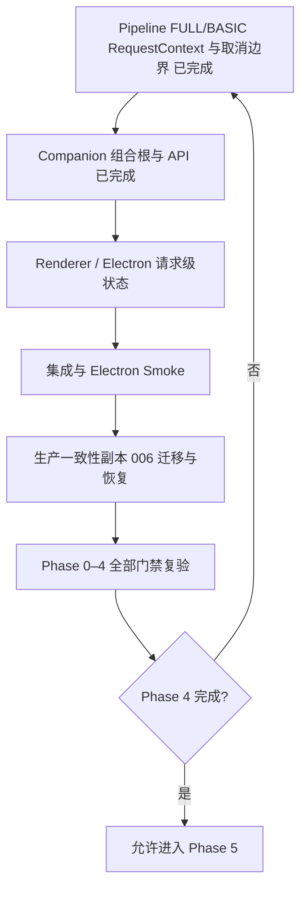

# Aerie 全面升级 Codex 移交说明

> [!danger] 接手时的唯一准确断点
> Phase 06 已完成，当前不是 Phase 4、Phase 5 或 Phase 6 起点，也不是 Phase 6 未完成状态。Phase 04 Task 1–12 已收口，`rollback_ready=true`；Phase 05 / [[Task 05-baseline]] 已收口，`rollback_ready=true`；Phase 06 / [[Task 06-baseline]] 已收口，`rollback_ready=true`；下一小节是 [[Phase 07|Phase 07：拟人化流式、Typing、多气泡与 Pacing]] / [[Task 07-baseline]] 的前置门禁复核与 Red 起步。
>
> `ChatRequestRepository`、`ConversationRepository`、`ChatRequestService`、`ChatRequestWorker`、Pipeline RequestContext/取消边界、Companion 组合根、API 双合同、Renderer 请求级状态、Task 11 端到端集成/Electron smoke、Task 12 生产一致性副本/恢复/Flag 回滚均已通过各自 Red → Green 或 current-state audit。Phase 00–04 关联门禁 **259 passed, 4 warnings**；Electron Node **14 passed**；完整显式 `tests` 收集 **472 passed, 6 warnings**。
>
> Task 12 已验证默认生产源库当前已有 006 completed；使用 SQLite Backup API 生成 A/B/C 副本，源 SHA 前后不变，A/C 关键表计数与脱敏摘要一致，数据损失 0。不要把 Phase 04/05 完成误解为 Phase 06 已开始；下一步仍必须先重读总计划、Phase 06、Task 06-baseline 和批次规约，再写 Phase 06 目标 Red。
>
> Phase 05 已验证 SSE `id:`、进程内 bounded recovery window、`Last-Event-ID` cursor reconnect、Renderer 既有 event_id/sequence 去重、`chat_stream_v1=false` legacy path 和 no-migration 回滚。Phase 00–05 关联门禁 **264 passed, 4 warnings**；Electron Node **16 passed**；完整显式 `tests` 收集 **477 passed, 6 warnings**。不要重做 Phase 05；下一步从 Phase 06 目标 Red 开始。
>
> Phase 06 已验证 `context_budget_v1=true` 时 actor-scoped 长期记忆检索、知识库检索、assistant 多气泡历史合并为完整 assistant 响应、Pipeline identity/audit 接线，以及 `context_budget_v1=false` legacy builder kwargs 回滚。Phase 00–06 关联门禁 **289 passed, 4 warnings**；Electron Node **16 passed**；完整显式 `tests` 收集 **481 passed, 6 warnings**。不要重做 Phase 06；下一步从 Phase 07 目标 Red 开始。

> [!warning] 工作区与 Git 状态
> - 分支：`Aerie-Model-X`
> - HEAD：`d9a327a Implement application updates and supporting changes`
> - 当前 Phase 04/05/06 相关源码差异叠加存在：`M communication/message.py`、`M communication/qq_client.py`、`M core/brain.py`、`M core/pipeline.py`、`M core/chat_request_worker.py`、`M core/chat_request_repository.py`、`M core/chat_request_service.py`、`M core/companion.py`、`M core/api_server.py`、`M core/conversation_repository.py`、`M core/event_stream.py`、`M core/context_builder.py`、`M electron/src/main.js`、`M tests/test_brain_provider_routing.py`、`M tests/test_phase4_chat_request_service.py`、`M tests/test_phase4_integration.py`、`M electron/tests/chat-request-queue.test.js`、`?? tests/test_phase4_pipeline.py`、`?? tests/test_phase4_api.py`、`?? tests/test_phase5_event_stream.py`、`?? tests/test_phase6_context_budget.py`、`?? electron/tests/sse-bridge.test.js`，叠加本批文档更新。
> - `data/desire_state.json` 是后台运行态刷新，不属于 Task 7；不得覆盖。
> - 本轮后段出现多项 `Spotlight/` 修改与新文件，属于并行工作且与 Phase 04 无关；本批未读取或编辑，后续不得清理、暂存或回退。
> - `.pytest-task7-*` 是本批测试临时目录。精确路径删除已通过安全检查，但自动审批服务返回 503 而拒绝执行；不得绕过，需用户明确授权后再清理。
> - 不要 reset、restore、clean 或改写历史。
> - HEAD 已经包含运行态/审计与 Task 5/6 变更。不要重写 `d9a327a`；若以后需要纠正，只能使用新的正向提交。

## 1. 接手后的最短恢复路径

按以下顺序执行，不要跳步：

1. 阅读本说明。
2. 阅读 [[实施计划]]，重新确认全局执行纪律。
3. 阅读 [[06_AI_Vibe_Coding批次规约]]。
4. 阅读 [[2026-07-20-Phase-04-持久Request队列实施计划]] 的 Task 12 Evidence，确认 Phase 04 已 done。
5. 阅读 [[Phase 05]]、[[Task 05-baseline]]、[[Phase 06]]、[[Task 06-baseline]]、[[91_数据迁移核对]]、[[92_回滚演练]]，确认 Phase 05/06 均已 done 且无迁移。
6. 审计当前 Git 状态：

```powershell
git status --short --branch
git log -1 --oneline
```

7. 阅读当前边界的真实代码：
   - `core/conversation_repository.py`
   - `core/chat_request_repository.py`
   - `core/chat_request_service.py`
   - `core/chat_request_worker.py`
   - `core/pipeline.py`
   - `communication/message.py`
   - `tests/test_phase4_chat_request_worker.py`
8. 不要重做 Phase 04 Task 1–12；先确认 Phase 04 文档、90/91/92 和 Task 12 Evidence 已收口。
9. 从 Phase 07 固定 Red 开始：delta 临时气泡、最终语义拆分、Typing 与 Persona Pacing，`chat_stream_v1` Flag 回滚。
10. Phase 07 仍不得整体重写 Pipeline、删除旧 poll/SSE 路径、让 Renderer 成为状态真源或引入 Sidecar 可靠总线语义。

> [!tip] 接手者不要重复做的工作
> 不要重做 Phase 04 Task 1–12，也不要重做 Phase 05 SSE id/replay/cursor/Flag 回滚或 Phase 06 Context Budget/Memory/Knowledge 接线。不要重新创建 006 Migration、Repository、Service、Worker、Pipeline 取消合同、API 双合同、Renderer ingest、Electron smoke 安全开关、Task 12 副本演练、Phase 05 event stream helper 或 Phase 06 context audit helper，也不要把测试临时目录或后台运行态文件当成业务改动。下一步按现有 TDD 计划进入 Phase 07。

## 2. 当前准确进度

### 2.1 Phase 总览

| Phase | 状态 | 说明 |
|---|---|---|
| Phase 00 | completed | 基线与执行纪律已完成 |
| Phase 01 | completed | 前序基础能力已完成 |
| Phase 02 | done | Actor / Channel / Persona 等基础真源已完成 |
| Phase 03 | done | Conversation / Turn / Message / Request 规范模型、迁移、回填与恢复演练已完成 |
| Phase 04 | done | Task 1–12 已收口；rollback_ready=true；生产一致性副本恢复数据损失 0 |
| Phase 05 | done | 事件统一、SSE 恢复窗口、Renderer 去重与 `chat_stream_v1` 回滚已完成 |
| Phase 06 | done | 完整 Turn Context、Token Budget、长期记忆与知识库注入已完成 |
| Phase 07 | planned | 下一步启动：拟人化流式、Typing、多气泡与 Pacing |
| Phase 08–15 | not started | 进入每个后续 Phase 前仍需复核前序门禁 |

进入 Phase 4 前已通过：

```text
Phase 0–3 + API + Pipeline:
141 passed, 4 warnings in 4.64s

完整 Python:
353 passed, 6 warnings in 10.56s
```

进入 Phase 6 前已通过：

```text
Phase 00–05 + API + Pipeline:
264 passed, 4 warnings in 27.60s

完整 Python:
477 passed, 6 warnings in 35.77s

Electron Node:
16 passed
```

进入 Phase 7 前已通过：

```text
Phase 00–06 + API + Pipeline:
289 passed, 4 warnings in 28.10s

完整 Python:
481 passed, 6 warnings in 36.25s

Electron Node:
16 passed
```

### 2.2 Phase 3 已完成能力

- 建立规范四表：
  - Conversation
  - Turn
  - Message
  - Request
- 完成 004 固定迁移。
- 完成 005 回填迁移。
- 支持 cursor 续跑。
- 完成真实生产一致性副本 rehearsal。
- 验证 Feature Flag 开启和关闭两态。
- 使用 SQLite Backup API 完成实际恢复。
- 数据损失为 0。
- `rollback_ready=true`。

### 2.3 Phase 4 已完成批次

#### 006 Request Queue Migration

迁移：

```text
006_chat_request_queue
```

固定 checksum：

```text
2e649f6834695ca7b9250c3e2f7c110ab9c5b2c4ed2a230d1cd4fb5e0654ea05
```

新增 Request 字段：

```text
actor_id
channel
channel_account_id
user_id
input_content
effective_content
attachments
reply_to_id
retry_of_request_id
cancel_requested_at
cancelled_at
started_at
lease_owner
lease_expires_at
last_heartbeat_at
error_code
```

新增索引：

```text
idx_requests_status_created
idx_requests_conversation_status
idx_requests_lease_expires
```

迁移合同：

- 006 只受 `migration_framework_v1` 控制。
- 006 不受 `chat_request_queue_v1` 控制。
- migration framework 关闭时不运行 006。
- queue Flag 关闭不能阻止迁移框架预建兼容 Schema。
- 004/005 checksum 绝对不可修改。
- legacy completed 行的新字段保持 NULL。

Evidence：

```text
Red:       8 failed, 1 passed in 0.39s
Green:     9 passed in 0.24s
迁移+0/3:  40 passed in 1.82s
关联:      112 passed, 4 warnings in 4.72s
完整:      362 passed, 6 warnings in 12.47s
```

#### Phase 4 测试 Fixtures

已建立：

- `phase4_db`
- `frozen_utc_clock`
- `ready_attachment`
- `phase4_pipeline_double`

固定 UTC：

```python
datetime(
    2026,
    7,
    20,
    0,
    0,
    tzinfo=timezone.utc,
)
```

约束：

- 不访问网络、QQ 或真实模型。
- 不使用概率性长时间 sleep。
- 附件 Fixture 不包含真实本地路径和正文。
- Database 前后执行 `reset_instance()`。

Evidence：

```text
Red:    2 errors in 0.07s
Green:  3 passed in 0.20s
关联:   43 passed in 2.03s
完整:   365 passed, 6 warnings in 14.83s
```

#### ChatRequestRepository

已实现持久请求状态机：

```text
queued → running → completed
queued → cancelled
running → cancelling → cancelled
running → failed
cancelling → failed
running/cancelling + restart → failed(process_interrupted)
failed/cancelled → 新 queued Request
```

已实现：

- 原子 submit。
- Conversation 复用。
- 创建 pending Turn。
- 创建 queued Request。
- 输入快照。
- 原子 claim。
- 同 Conversation 互斥。
- 按 `created_at + request_id` 排序。
- lease / heartbeat。
- queued cancel。
- running → cancelling。
- mark failed / cancelled。
- restart recovery。
- retry 创建新 Request 和新 Turn。
- claim 后退出数据库连接，再进入模型/Pipeline 阶段。

最近 Evidence：

```text
Repository 专项: 10 passed in 1.01s
Phase 3/4 关联: 36 passed in 2.99s
完整 Python:    374 passed, 6 warnings in 18.17s
```

### 2.4 当前 Task 7 完成状态

Task 5 与 Task 6 已完整收口。Task 7 接管时的目标 Red：

```text
13 failed, 1 passed
```

失败原因正确：

- `ChatRequestRepository.mark_completed()` 不存在。
- `mark_cancelled()` 错误允许 running 直接 cancelled，且未写 `cancelled_at`。
- `core.chat_request_worker` 不存在。

Task 7 最终 Evidence：

```text
Worker 专项: 23 passed in 5.09s
加固关联:   136 passed, 4 warnings in 18.95s
完整 Python: 433 passed, 1 deselected, 6 warnings in 33.59s
办公目录环境用例: 1 passed in 0.05s
```

已证明：

- `start()` recovery 先于首次 claim。
- 不同 Conversation 最大 active=4，第五条等待；同 Conversation 最大 active=1。
- `_running_tasks[request_id]` 保存真实 execution `asyncio.Task`。
- heartbeat 在 Pipeline 运行期间立即续租并独立运行。
- 过期 lease 不能复活或完成；lease 丢失会取消 execution，并使用 `lease_lost` 收口。
- queued 取消不调用 Pipeline；running 用户取消等待最多 250ms，确认时延 `<500ms`。
- Pipeline 自发取消、Worker stop 与丢失 Task 分别使用 `pipeline_cancelled`、`worker_stopped`、`cancel_task_missing`；stop 覆盖 deferred/pre-start 用户取消。
- emit 失败不反转数据库终态。

风险复核曾追加 `5 failed, 15 passed`，目标均已 Green。若 heartbeat 数据库异常与终态写入同时失败，execution 会停止但 Request 依赖下次启动 recovery；当前不宣称进程内自动恢复。

> [!success] Task 8 完成权裁决已落实
> `ConversationRepository.persist_turn()` 作为 canonical completion 唯一写入者；真实 Pipeline 返回 `canonical_completed=true` 时，Worker 不再二次 `mark_completed(running + matching lease)`。legacy 已写但 canonical 未完成时的过晚取消使用 `CancellationTooLate("terminal_side_effect_committed")`，Worker 记 `failed/terminal_side_effect_committed`；canonical 已完成后 completion-wins，并停止后续事件或 QQ 副作用。

## 3. 已批准且不可随意推翻的架构合同

### 3.1 规范对话模型

```text
Conversation
  └─ Turn
      ├─ Request
      └─ Message(s)
```

原则：

- 不继续向 legacy `chat_log` 无限增加职责。
- 不创建一套完整平行聊天 v2。
- 增量演进现有 Pipeline 和 Context Builder。
- 保留 legacy 路径、Feature Flag 和可验证回滚能力。

### 3.2 Actor / Channel 隔离边界

短期 Conversation 隔离键：

```text
actor_id + channel
```

同一 Channel 多账号时：

```text
actor_id + channel + channel_account_id
```

长期状态和记忆共享边界：

```text
actor_id
```

### 3.3 Phase 4 请求队列合同

- `/api/chat/send` 原路径异步化，不新增第二套主发送入口。
- `chat_request_queue_v1=true`：
  - HTTP 202
  - 返回 `request_id`
  - 返回 `conversation_id`
  - 返回 `status=queued`
- Flag 关闭：保持旧同步 HTTP 200。
- queued 和 running 都支持真实后端取消。
- retry 创建新 Request 和新 Turn，并关联原 Request。
- queued 重启后恢复为可领取。
- running/cancelling 在重启或 lease 过期后转为：
  - `failed`
  - `error_code=process_interrupted`
- 运行中请求不自动重新排队，避免重复副作用。
- 纯附件请求：
  - `input_content=""`
  - 内部生成中性的 `effective_content`
  - 内部指令不得进入用户可见历史。
- 使用数据库驱动 Worker。
- 同 Conversation 串行。
- 不同 Conversation 默认最多 4 路并行。
- Worker 模型调用期间不得持有 SQLite 事务或 `Database.connection()`。

### 3.4 Request / Turn 状态守恒

```text
Request queued      ↔ Turn pending
Request running     ↔ Turn running
Request cancelling  ↔ Turn running
Request completed   ↔ Turn completed
Request failed      ↔ Turn failed
Request cancelled   ↔ Turn cancelled
```

### 3.5 World 子系统合同

```text
WorldPort
→ InProcessWorldAdapter
→ 稳定后 Remote Sidecar
```

不要在当前 Phase 4 提前引入 Remote Sidecar。

### 3.6 EventEnvelope 与恢复合同

复用现有：

```python
@dataclass(frozen=True)
class EventEnvelope:
    event_id: str
    type: str
    ts: str
    request_id: str | None = None
    conversation_id: str | None = None
    turn_id: str | None = None
    message_id: str | None = None
    response_group_id: str | None = None
    sequence: int = 0
    channel: str = "unknown"
    payload: dict[str, Any] = field(default_factory=dict)
```

去重和排序：

```text
event_id
  跨 IPC/SSE 的主去重键

request_id + sequence
  单 Request 排序和异常检测

legacy chat_log numeric id
  poll/history 兼容去重
```

SSE 保持 best-effort：

- 无 ACK。
- 无 Outbox。
- 无断线重放。
- Renderer 断线后通过 Request 状态查询恢复。
- Phase 4 不把 SSE 扩展成可靠消息系统。

## 4. 当前生产实现知识

### 4.1 ConversationRepository

文件：`core/conversation_repository.py`

公共确定性解析：

```python
def resolve_conversation_id(
    *,
    actor_id: str | None,
    channel: str | None,
    channel_account_id: str | None,
    user_id: int,
) -> str:
    payload = "\x1f".join(
        (
            actor_id or "",
            channel or "",
            channel_account_id or "",
            str(user_id),
        )
    )
    digest = hashlib.sha256(payload.encode("utf-8")).hexdigest()
    return f"conv_{digest[:32]}"
```

冲突异常：

```python
class RequestConflict(RuntimeError):
    pass
```

Conversation 复用：

```python
def ensure_conversation(
    self,
    conn: sqlite3.Connection,
    *,
    conversation_id: str,
    actor_id: str | None,
    channel: str | None,
    channel_account_id: str | None,
) -> None:
    conn.execute(
        """INSERT OR IGNORE INTO conversations
           (conversation_id, actor_id, channel, channel_account_id, status)
           VALUES (?, ?, ?, ?, 'active')""",
        (
            conversation_id,
            actor_id,
            channel,
            channel_account_id,
        ),
    )
```

关键认知：`INSERT OR IGNORE` 不会绕过外键约束。只要 `actor_id` 非 NULL，Actor 就必须已经存在。

当前 `persist_turn()` 已支持：

```python
def persist_turn(
    self,
    *,
    request_id: str,
    user_id: int,
    actor_id: str | None,
    channel: str | None,
    channel_account_id: str | None,
    user_content: str,
    user_attachments: list[dict[str, Any]] | None,
    assistant_segments: list[str],
    conversation_id: str | None = None,
    turn_id: str | None = None,
) -> dict[str, str] | None:
```

行为：

- Request 不存在：保持 Phase 3 legacy 同步创建路径。
- Request 已存在：校验 `conversation_id/turn_id`，完成同一个 Request 和 Turn，不重复插入 Request 主键。
- 使用同一 SAVEPOINT 插入规范 Message 并更新状态。
- Message 写入失败时，Request/Turn 状态和 Message 一起回滚。
- 相同结果重复完成：幂等返回原 ID。
- 结果或归属不同：抛出 `RequestConflict`。
- `recent_turn_history()` 只读取 `turns.status='completed'`。

Task 5 已验证只有 running/running 可完成、可信快照一致、SAVEPOINT 回滚、终态 lease/error 清理和 completed-only history。Task 8 已裁决 canonical completion 由 ConversationRepository 拥有；后续 Task 9 不要为适配 API 接线而放宽 Repository 终态门禁。

### 4.2 ChatRequestRepository

文件：`core/chat_request_repository.py`

核心数据类型：

```text
RequestIdentity
RequestContext
SubmittedRequest
ClaimedRequest
```

已存在方法：

```text
submit
get_owned
claim_next
heartbeat
request_cancel
mark_completed
mark_cancelled
mark_failed
recover_interrupted
create_retry
```

关键并发行为：

- submit 使用短 `BEGIN IMMEDIATE`，原子创建 Conversation、Turn、Request。
- claim 使用条件查询和条件更新。
- 同一 Conversation 存在 running/cancelling 时，不领取下一条 queued。
- claim 完成后退出连接 context，模型调用不持有数据库锁。

潜在风险：

- `recover_interrupted()` 的 SQL 中第二个 lease 条件被第一个 running/cancelling 条件覆盖；结果是启动恢复会将所有遗留 running/cancelling 转失败。这与当前启动恢复合同一致，但 SQL 有冗余。
- `mark_completed()` 只允许 running + matching lease；`mark_cancelled()` 只允许 cancelling + matching lease。不得为适配真实 Pipeline 的二次完成而放宽这两个门禁。
- Service/Worker 已实现但尚未接入 Companion/API；旧运行路径没有调用这些模块。
- ChatRequestRepository 当前直接写 Conversation SQL，尚未复用 `ConversationRepository.ensure_conversation()`；不要在没有失败测试时提前重构。

### 4.3 SQLite 连接和事务边界

`Database._connect()` 使用：

```python
sqlite3.connect(
    str(self.db_path),
    detect_types=sqlite3.PARSE_DECLTYPES,
    isolation_level=None,
)
```

这意味着 SQLite 使用 autocommit。

`Database.connection()`：

- 持有 Database 实例锁。
- context 结束时关闭连接。

因此：

- claim 必须是短事务。
- 模型调用前必须退出连接 context。
- Pipeline 执行期间不能持有 `Database.connection()`。
- 并发主要发生在模型/Pipeline 阶段。
- 数据库短事务会被当前实例锁串行。

## 5. 当前小节完成标准

Task 8 已按以下保守默认收口：

- [x] canonical completion 的唯一写入者是 ConversationRepository。
- [x] canonical 已 completed 后收到取消采用 completion-wins，并停止后续事件/QQ 副作用。
- [x] FULL 的 PAD 分析和主回复调用按两类模型调用分别计数，不要求每 Request 总调用最多一次。
- [x] Phase 04 队列本阶段先覆盖 desktop/local；QQ 入站队列化留给后续接线门禁。
- [x] 所有 provider 失败后沿用现有可见 fallback 文本并记 completed；可重试 failed 另行按稳定错误处理。
- [x] Feature Flag 生命周期第一版要求重启，不支持运行时 Worker 热启动/停止。

Task 9 已完成：组合根与 API 固定 Red 已观察并收口；Companion 只创建一个 ConversationRepository 和 ChatRequestRepository，并注入 Service/Worker/Pipeline；`chat_request_queue_v1=true` 返回 202 queued，Flag off 保持旧同步 200 和空消息 400；依赖缺失 fail closed；所有权和 `reply_to_id` 外泄防护已纳入 Service/API 合同。当前完成标准转为 Task 10 Renderer 请求级状态与统一 ingest。

> [!note] Evidence 纪律
> Evidence 必须来自当前真实命令输出，不能复制旧数字冒充新结果。数据库 Evidence 只记录 ID、状态、计数和孤立记录数，不记录用户正文、附件正文、真实路径、密钥或隐私数据。

## 6. 后续严格开发顺序



### 6.1 ChatRequestService

Task 6 已完成，Task 9 已通过 Companion/API 接线：

- submit 编排。
- 状态查询。
- cancel 编排。
- retry 编排。
- 将 Repository 细节与 API 隔离。
- 可信 desktop/local 身份、纯附件输入分离、所有权、稳定错误码与脱敏 DTO 已 Green。

### 6.2 ChatRequestWorker

Task 7/8 已完成，Task 9 已通过 Companion 在 queue Flag 与依赖就绪时接线：

- 数据库驱动领取。
- 同 Conversation 串行。
- 跨 Conversation 默认最多 4 路。
- lease 与 heartbeat。
- 启动恢复。
- 真实取消 `asyncio.Task`。
- 模型/Pipeline 阶段不持有 SQLite 事务。
- stop、意外取消、用户取消和丢失 Task 使用不同稳定错误码；emit 为提交后的 best-effort。

不要复用 `core/async_task_manager.py` 作为聊天 Worker，因为它：

- 是内存队列。
- 无数据库恢复。
- 无 Conversation 串行。
- 无 claim/lease。
- cancel 只改状态，不取消真实 `asyncio.Task`。

### 6.3 Pipeline

文件：`core/pipeline.py`

后续要求：

- 接收并沿用 Worker 提供的 `request_id/turn_id/conversation_id`。
- 规范镜像时不再生成新 Request ID。
- FULL/BASIC 两条路径都加入取消边界。
- `CancelledError` 不得被普通失败路径吞掉。
- `effective_content` 只用于模型输入，不覆盖用户可见 Message。
- 取消检查边界：
  - 模型调用前后。
  - legacy user 持久化前。
  - assistant 每段持久化前。
  - canonical mirror 前。
  - Event 前。
  - QQ send queue 前。

### 6.4 Companion 与 API

文件：

- `core/companion.py`
- `core/api_server.py`

唯一组合根：

```text
chat_request_repository
chat_request_service
chat_request_worker
```

要求：

- API 通过 `get_companion()` 获取 Service。
- 不在 `api_server.py` 创建第二套 Repository/Service。
- Worker 在 QQ startup wait 前启动。
- stop 时有序停止 Worker。
- queue Flag 关闭时 Worker 不 claim。
- 当前 `/api/chat/send` 仍是同步入口；在 Service/Worker 完成前不要提前改。

目标 API：

```text
POST /api/chat/send
GET  /api/chat/requests/{request_id}
POST /api/chat/requests/{request_id}/cancel
POST /api/chat/requests/{request_id}/retry
```

### 6.5 Renderer / Electron

文件：`electron/src/renderer/js/chat.js`

Task 10 已完成的目标：

```javascript
Map<request_id, RequestViewState>
```

已支持：

- 连续三次 send 产生三次 POST。
- 每个 Request 独立显示 queued/running/cancelling/failed/cancelled/completed。
- 请求级 cancel/retry。
- IPC/SSE/poll 统一 ingest。
- 使用 `event_id` 去重。
- 页面恢复时查询未终态 Request。
- Renderer 本地状态不是权威真源。

Task 11 已证明：

- 端到端提交、claim、Pipeline 完成和事件投递的副作用计数。
- Electron smoke：真实窗口加载、连续三次 send → 202、GET status 恢复后端真源、cancel/retry 端点可达。
- 与 Worker/Repository 的真实并发、恢复和取消边界组合。
- Smoke 安全：临时 DB/data/log、`AERIE_DISABLE_QQ=true`、`AERIE_DISABLE_MODEL_CALLS=true`，未连接真实 QQ、未调用真实模型、未写生产库。

## 7. 文档状态与真实代码的差异

> [!success] Phase 04 复合验收已收口
> Phase 04、Task 04、实施计划 Task 12、90、91 和 92 已同步到 Task 12。Phase 04 当前为 done，`rollback_ready=true`。

当前仍未完成：

- Phase 07 拟人化流式、Typing、多气泡与 Pacing，`chat_stream_v1` 回滚。

独立 Worker stop、queue Flag 关闭旧路径、Task 11 端到端 smoke、Task 12 生产副本恢复与 Flag 回滚均已验证。全局验收中的 Phase 04 复合串行、取消、恢复项已勾选；Phase 05 以后能力仍按各自阶段推进。

> [!success] Phase 05 事件恢复与去重已收口
> Phase 05、Task 05、90、91 和 92 已同步。后端 `event_stream` 默认保持 legacy data-only；`chat_stream_v1=true` 时 API 启用 SSE `id:`、bounded replay 和 `Last-Event-ID` cursor；Electron 主进程保存 webContents cursor 并用于重连；Renderer 继续使用既有 `event_id`、legacy id 和 `request_id + sequence` 去重排序。Phase 05 当前为 done，`rollback_ready=true`。

> [!success] Phase 06 Context Budget 与长期记忆/知识库接线已收口
> Phase 06、Task 06、90、91 和 92 已同步。`context_budget_v1=true` 时 ContextBuilder 会检索 actor-scoped 长期记忆、知识库，并把连续 assistant 多气泡合并为完整 assistant 响应；Pipeline 仅在 Flag-on 时传入 actor/channel identity 并记录 allowlist audit。Flag off 不传新增 kwargs、不读取 audit。Phase 06 当前为 done，`rollback_ready=true`。

## 8. 最容易出错的地方

### 8.1 把测试前置数据错误误判为生产 Red

Task 5 曾出现该案例；现已修复并收口。后续 Red 仍必须证明目标能力缺失，Fixture、语法、导入、外键前置数据或沙箱输出目录错误不等于产品 Red。

### 8.2 在模型调用期间持有 SQLite 连接或事务

这会导致：

- 全局实例锁长时间占用。
- 其他 Request 无法短事务 claim/heartbeat/cancel。
- 多 Conversation 并发名存实亡。

必须先 claim、提交、退出连接，再调用 Pipeline。

### 8.3 混淆用户可见输入与内部模型输入

纯附件场景：

```text
input_content = ""
effective_content = 内部中性指令
```

只能把 `effective_content` 送给模型，不能写进用户可见 Message 或历史。

### 8.4 让 running 请求在重启后自动重试

禁止。运行中请求可能已经产生模型、文件、QQ 发送等副作用。重启或 lease 过期后必须转 `failed/process_interrupted`，由用户显式 retry 创建新 Request/Turn。

### 8.5 使用 AsyncTaskManager 代替数据库 Worker

禁止。它不满足持久化、恢复、真实取消、Conversation 串行和 lease 合同。

### 8.6 把 SSE 扩展成可靠总线

Phase 4 的 SSE 是 best-effort。不要引入 ACK、Outbox、重放游标等超出范围的架构。恢复依赖 Request 状态查询。

### 8.7 修改固定 Migration checksum

004、005、006 均有既定合同。不要为了让测试“方便”而修改历史 migration checksum。

### 8.8 普通复制在线 SQLite 数据库

生产 WAL/SHM 场景下普通文件复制可能不一致。迁移或恢复演练必须使用 SQLite Backup API，并显式关闭连接和文件句柄。

### 8.9 Windows 文件句柄与临时目录

曾遇到 SQLite 连接未关闭导致 `PermissionError`。必须：

- 显式关闭连接。
- Fixture 前后 `Database.reset_instance()`。
- 必要时临时目录使用 `ignore_cleanup_errors=True`。

### 8.10 冻结时钟导致排序并列

多个 Request 在同一冻结时间创建时，claim 会再按 `request_id` 排序，可能与测试直觉不一致。需要显式推进 `frozen_utc_clock`，保证测试顺序确定。

### 8.11 PowerShell 转义和脚本执行

复杂嵌套字符串容易触发 SyntaxError。优先使用 Here-String：

```powershell
@'
...
'@ | python -
```

### 8.12 Electron 测试命令

项目没有通用 npm test script 时，不要臆造命令。此前使用：

```powershell
node --test tests/persona-hub.test.js
node --check src/renderer/js/persona-hub.js
```

### 8.13 `git diff --check` 的 CRLF 提示

LF → CRLF 可能只是行尾提示，不一定是 whitespace error。要区分真实失败与 Windows 行尾提示。

### 8.14 并行编辑同一文档

曾发生状态覆盖。不要让多个 Agent 或并行工具同时修改同一 Markdown 文件。

### 8.15 Git 安全

- 不猜测 remote。
- 不自动 force push。
- 不 reset/clean 用户工作区。
- 不把 WAL、SHM、数据库副本、密钥或审计日志继续混入版本控制。
- 用户当前最新要求是每小节更新相关文档；不要自行 commit/push，除非用户再次明确要求。

## 9. 关键文件导航

### 9.1 接手必读

1. [[2026-07-20_Aerie升级Codex移交说明|本移交说明]]
2. [[实施计划]]
3. [[06_AI_Vibe_Coding批次规约]]
4. [[2026-07-20-Phase-04-持久Request队列实施计划]]
5. [[Phase 04]]
6. [[Task 04-baseline]]
7. [[91_数据迁移核对]]
8. [[92_回滚演练]]
9. [[90_全局验收清单]]

### 9.2 当前代码与测试

| 文件 | 价值 | 当前用途 |
|---|---|---|
| `core/conversation_repository.py` | Task 5 canonical 完成实现 | canonical completion 权威；后续不得放宽终态门禁 |
| `core/chat_request_repository.py` | 队列核心状态机与严格终态 | 后续接线仍不得放宽 running/cancelling + lease 门禁 |
| `core/chat_request_service.py` | Task 6 Service，Task 9 已接线 | 可信身份、纯附件、所有权、reply_to 所属校验、cancel/retry 与 DTO 合同 |
| `core/chat_request_worker.py` | Task 7/8 Worker，Task 9 已接线 | 四槽、真实 Task、heartbeat、取消、stop、恢复、Pipeline token 传递和 canonical completed 跳过二次完成 |
| `tests/test_phase4_chat_request_worker.py` | Task 7 主测试 | 23 个专项场景和 `<500ms` 取消确认 |
| `tests/conftest.py` | Phase 4 隔离 Fixture | 复用 UTC 时钟、DB、附件和 Pipeline double |
| `core/database.py` | SQLite 连接和迁移注册 | 审查 autocommit、锁和 migration 顺序 |
| `core/migrations/__init__.py` | 004/005/006 固定迁移 | 不得随意修改 checksum |

### 9.3 后续实现文件

| 文件 | 后续任务 |
|---|---|
| `core/api_server.py` | Task 9 已完成：202/200 双态、status/cancel/retry API |
| `communication/message.py`、`core/pipeline.py` | Task 8 已完成：RequestContext、取消边界、可见输入隔离 |
| `core/companion.py` | Task 9 已完成：Repository/Service/Worker 唯一组合根 |
| `electron/src/renderer/js/chat.js` | 从全局 `_loading` 改为请求级状态 Map |
| `core/event_stream.py` | Phase 05 已完成：legacy data-only 默认路径、Flag-on SSE `id:` 与进程内 bounded replay window；仍不扩展 ACK/Outbox 可靠协议 |
| `core/context_builder.py` | Phase 06 已完成：Flag-on 长期记忆/知识库注入、多气泡历史合并、估算 token/字符 budget 和脱敏 audit；Flag off 保持旧行为 |
| `core/async_task_manager.py` | 仅作为反例参考，不用于聊天队列 |

### 9.4 全局架构参考

- [[00_Aerie_全面升级主控计划]]
- [[01_六方案冲突裁决]]
- [[02_术语与核心合同]]
- [[03_数据所有权与迁移纪律]]
- [[04_API与事件协议]]
- [[05_Feature_Flag与回滚矩阵]]
- [[07_风险登记册]]

### 9.5 六份原始权威方案

- [[Aerie_v14_对话系统全面升级方案]]
- [[Aerie_Agent主动发消息方案]]
- [[Aerie_图片上传与管理完整解决方案]]
- [[Aerie_拟人化对话模式研究与优化方案]]
- [[Aerie_不受限制对话模式二次开发方案]]
- [[2026-07-20_Agent_24小时世界模拟与人格图片系统实施计划]]

## 10. 严格 TDD 与批次纪律

铁律：

```text
NO PRODUCTION CODE WITHOUT A FAILING TEST FIRST
```

每个小节必须执行：

1. 重读总计划、当前 Phase、Task 和批次规约。
2. 审计真实代码和工作区。
3. 写最小失败测试。
4. 亲自运行并确认失败是目标能力缺失。
5. Fixture、语法、外键前置数据错误不能当目标 Red。
6. 写最小生产实现。
7. 运行目标测试 Green。
8. 运行关联回归。
9. 运行完整回归。
10. 执行 `py_compile`、diagnostics、`git diff --check`。
11. 记录真实、当前、脱敏 Evidence。
12. 更新 Phase、Task、迁移、回滚和验收文档。
13. 当前小节未收口，不得进入下一小节。

> [!important] Phase 门禁
> 进入下一 Phase 前必须重新检查全部前序 Phase 门禁。发现缺口时回到对应 Phase 补齐，不允许以“之前完成过”为由跳过复验。

## 11. 禁止事项

- 不直接改写生产数据库。
- 不编辑构建产物。
- 不清理无关工作区文件。
- 不删除已有 Schema、新数据或 Evidence 来伪造回滚。
- Feature Flag 关闭只恢复旧执行路径，不破坏性删除新 Schema。
- 不修改 004/005/006 固定 checksum。
- 不重做或推翻 Task 8 已落实的六项保守默认裁决，除非用户明确改裁决并要求补测试。
- 不把 Task 9 后端 202 合同误当成 Renderer 请求级状态已完成。
- 不在 Pipeline 中生成第二套 Request ID。
- 不让 Renderer 成为状态权威真源。
- 不自动恢复 running 请求为 queued。
- 不让内部 `effective_content` 污染用户可见历史。
- 不把 AsyncTaskManager 当持久聊天 Worker。
- 不把 SSE 变成超出 Phase 4 范围的可靠消息系统。
- 不伪造、复用过时或包含敏感正文的 Evidence。

## 12. 移交检查清单

### 当前移交内容

- [x] 记录当前 Phase 与准确 Task。
- [x] 记录 Task 7 Red、Green、关联和完整回归。
- [x] 记录 Git 分支、HEAD 和工作区状态。
- [x] 记录 Phase 0–3 完成情况。
- [x] 记录 Phase 4 Task 1–12 已完成内容。
- [x] 记录 canonical completion 与 Worker 严格完成冲突的 Task 8 裁决和实现。
- [x] 记录架构合同、状态机和事务边界。
- [x] 记录易错点和历史经验。
- [x] 记录关键文件阅读顺序。
- [x] 记录后续严格开发顺序。
- [x] 记录禁止事项和 Evidence 纪律。

### Codex 接手后的首个小节

- [x] 阅读本说明和五份当前状态文档。
- [x] 审计 Git 状态，确认无关修改需避开。
- [x] 按保守默认落实 Task 8 六项产品边界。
- [x] 明确唯一 completion 写入者和过晚取消终态。
- [x] 明确模型调用计数、desktop/QQ 范围、provider fallback 和 Flag 生命周期。
- [x] 写 Task 8 失败测试并观察目标 Red。
- [x] 完成 Task 8 专项、关联、完整回归与文档收口。
- [x] 完成 Task 9 组合根/API 目标 Red、Green、关联/完整回归与文档收口。
- [x] 完成 Task 10 Renderer/Electron 目标 Red、Green、Node/Python 回归与文档收口。
- [x] 完成 Task 11 端到端集成/Electron smoke 目标 Red、Green、真实 smoke、Node/Python 回归与文档收口。
- [x] 完成 Task 12 生产数据一致性副本迁移、恢复、Flag 回滚、完整回归与文档收口。
- [x] 完成 Phase 05 事件统一、SSE 恢复与 Renderer 去重目标 Red、Green、Python/Node 完整回归与文档收口。
- [x] 完成 Phase 06 完整 Turn Context、Token Budget、摘要与长期记忆目标 Red、Green、Python/Node 完整回归与文档收口。
- [ ] 下一小节从 Phase 07 拟人化流式、Typing、多气泡与 Pacing 目标 Red 开始。

## 13. 最终接手结论

> [!success] 可以直接继续的位置
> Codex 不需要重做 Phase 4 Task 1–12，也不需要重做 Phase 05 或 Phase 06。完成必读文件和当前 diff 审计后，从 Phase 07 的拟人化流式、Typing、多气泡与 Pacing 目标 Red 继续；不要把 Phase 05 的进程内 SSE recovery window 误认为 Sidecar 可靠总线或持久 Outbox，也不要把 Phase 06 的估算 token audit 误认为持久摘要表。

> [!failure] 当前绝不能声称的状态
> - 不能声称 Phase 07 已开始或已完成。
> - 不能声称 Typing、首 delta、临时气泡、Persona Pacing 或 reduced-motion 已按 Phase 07 完成。
> - 不能声称 QQ 入站队列覆盖已实现。

本说明记录的是 2026-07-20 移交时的真实工作区状态。后续每完成一个小节，应同步更新相关 Phase、Task、迁移、回滚、验收文档，并在新的进度记录中覆盖已变化的断点。
