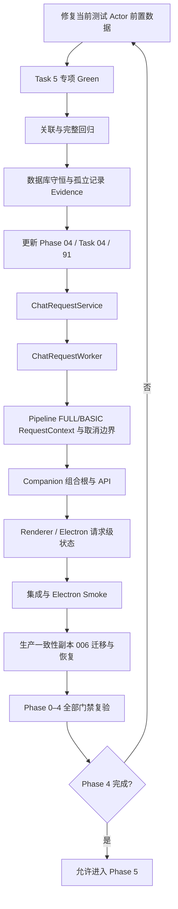

# Aerie 全面升级 Codex 移交说明

> [!danger] 接手时的唯一准确断点
> 当前不是 Phase 4 起点，也不是 Phase 4 已完成状态。正在执行 [[2026-07-20-Phase-04-持久Request队列实施计划#Task 5|Task 5：ConversationRepository 完成预分配 Turn/Request]]。
>
> `ChatRequestRepository`、006 Migration 和 Phase 4 Fixtures 已完成并通过回归；`ConversationRepository` 初步生产实现也已经存在。当前专项测试为 **15 passed, 1 failed**，唯一失败是测试缺少 Actor 外键前置数据，不是生产功能缺失。
>
> 在本移交批次中不要继续编码；Codex 接手后必须从修复该测试 Fixture 开始，完成 Task 5 的全部验证和文档收口后，才能进入 Service。

> [!warning] 工作区与 Git 状态
> - 分支：`Aerie-Model-X`
> - HEAD：`070e26d feat(phase4): 完成持久请求队列核心开发与测试覆盖`
> - 当前工作区唯一已知修改：`M tests/test_phase4_chat_request_repository.py`
> - 不要 reset、restore、clean 或改写历史。
> - HEAD 已经包含 `data/audit/computer_control.jsonl`，这与“不将无关审计日志混入版本控制”的执行原则有冲突。不要重写 `070e26d`；若以后需要纠正，只能使用新的正向提交。

## 1. 接手后的最短恢复路径

按以下顺序执行，不要跳步：

1. 阅读本说明。
2. 阅读 [[实施计划]]，重新确认全局执行纪律。
3. 阅读 [[06_AI_Vibe_Coding批次规约]]。
4. 阅读 [[2026-07-20-Phase-04-持久Request队列实施计划]]，定位到 Task 5。
5. 阅读 [[Phase 04]]、[[Task 04-baseline]]、[[91_数据迁移核对]]、[[92_回滚演练]]。
6. 审计当前 Git 状态：

```powershell
git status --short --branch
git log -1 --oneline
```

7. 阅读当前小节的真实代码：
   - `core/conversation_repository.py`
   - `core/chat_request_repository.py`
   - `tests/test_phase4_chat_request_repository.py`
   - `tests/conftest.py`
8. 在失败测试中创建 `actor_phase4` 前置数据。
9. 运行专项测试，确认全部 Green。
10. 完成关联回归、完整回归、静态检查、数据库守恒查询和文档更新。
11. Task 5 完整收口后，才能进入 `ChatRequestService`。

> [!tip] 接手者不要重复做的工作
> 不要重新设计 Phase 4，不要重新创建 006 Migration，不要重新实现 ChatRequestRepository，也不要把 ConversationRepository 当成尚未开始。先以真实代码和测试为准，解决当前唯一失败并完成本小节验收。

## 2. 当前准确进度

### 2.1 Phase 总览

| Phase | 状态 | 说明 |
|---|---|---|
| Phase 00 | completed | 基线与执行纪律已完成 |
| Phase 01 | completed | 前序基础能力已完成 |
| Phase 02 | done | Actor / Channel / Persona 等基础真源已完成 |
| Phase 03 | done | Conversation / Turn / Message / Request 规范模型、迁移、回填与恢复演练已完成 |
| Phase 04 | in_progress | 正在进行持久 Request 队列；当前停在 Task 5 |
| Phase 05–15 | not started | Phase 4 全部门禁完成前禁止进入 |

进入 Phase 4 前已通过：

```text
Phase 0–3 + API + Pipeline:
141 passed, 4 warnings in 4.64s

完整 Python:
353 passed, 6 warnings in 10.56s
```

### 2.2 Phase 3 已完成能力

- 建立规范四表：
  - Conversation
  - Turn
  - Message
  - Request
- 完成 004 固定迁移。
- 完成 005 回填迁移。
- 支持 cursor 续跑。
- 完成真实生产一致性副本 rehearsal。
- 验证 Feature Flag 开启和关闭两态。
- 使用 SQLite Backup API 完成实际恢复。
- 数据损失为 0。
- `rollback_ready=true`。

### 2.3 Phase 4 已完成批次

#### 006 Request Queue Migration

迁移：

```text
006_chat_request_queue
```

固定 checksum：

```text
2e649f6834695ca7b9250c3e2f7c110ab9c5b2c4ed2a230d1cd4fb5e0654ea05
```

新增 Request 字段：

```text
actor_id
channel
channel_account_id
user_id
input_content
effective_content
attachments
reply_to_id
retry_of_request_id
cancel_requested_at
cancelled_at
started_at
lease_owner
lease_expires_at
last_heartbeat_at
error_code
```

新增索引：

```text
idx_requests_status_created
idx_requests_conversation_status
idx_requests_lease_expires
```

迁移合同：

- 006 只受 `migration_framework_v1` 控制。
- 006 不受 `chat_request_queue_v1` 控制。
- migration framework 关闭时不运行 006。
- queue Flag 关闭不能阻止迁移框架预建兼容 Schema。
- 004/005 checksum 绝对不可修改。
- legacy completed 行的新字段保持 NULL。

Evidence：

```text
Red:       8 failed, 1 passed in 0.39s
Green:     9 passed in 0.24s
迁移+0/3:  40 passed in 1.82s
关联:      112 passed, 4 warnings in 4.72s
完整:      362 passed, 6 warnings in 12.47s
```

#### Phase 4 测试 Fixtures

已建立：

- `phase4_db`
- `frozen_utc_clock`
- `ready_attachment`
- `phase4_pipeline_double`

固定 UTC：

```python
datetime(
    2026,
    7,
    20,
    0,
    0,
    tzinfo=timezone.utc,
)
```

约束：

- 不访问网络、QQ 或真实模型。
- 不使用概率性长时间 sleep。
- 附件 Fixture 不包含真实本地路径和正文。
- Database 前后执行 `reset_instance()`。

Evidence：

```text
Red:    2 errors in 0.07s
Green:  3 passed in 0.20s
关联:   43 passed in 2.03s
完整:   365 passed, 6 warnings in 14.83s
```

#### ChatRequestRepository

已实现持久请求状态机：

```text
queued → running → completed
queued → cancelled
running → cancelling → cancelled
running → failed
cancelling → failed
running/cancelling + restart → failed(process_interrupted)
failed/cancelled → 新 queued Request
```

已实现：

- 原子 submit。
- Conversation 复用。
- 创建 pending Turn。
- 创建 queued Request。
- 输入快照。
- 原子 claim。
- 同 Conversation 互斥。
- 按 `created_at + request_id` 排序。
- lease / heartbeat。
- queued cancel。
- running → cancelling。
- mark failed / cancelled。
- restart recovery。
- retry 创建新 Request 和新 Turn。
- claim 后退出数据库连接，再进入模型/Pipeline 阶段。

最近 Evidence：

```text
Repository 专项: 10 passed in 1.01s
Phase 3/4 关联: 36 passed in 2.99s
完整 Python:    374 passed, 6 warnings in 18.17s
```

### 2.4 当前 Task 5 状态

ConversationRepository 的目标 Red 已真实观察：

```text
6 failed, 10 passed
```

目标失败原因正确：

- 公共 `resolve_conversation_id` 不存在。
- `ensure_conversation` 不存在。
- `persist_turn()` 不支持预分配 `conversation_id` / `turn_id`。

生产实现完成后曾达到：

```text
14 passed, 2 failed
```

其中 history 测试的 Conversation ID 不一致已修复。当前真实结果：

```text
15 passed, 1 failed in 1.83s
```

唯一失败：

```text
test_ensure_conversation_reuses_same_identity_key
sqlite3.IntegrityError: FOREIGN KEY constraint failed
```

原因：

```sql
conversations.actor_id REFERENCES actors(actor_id)
```

测试使用 `actor_phase4`，但没有先创建对应 Actor。

> [!bug] 当前唯一需要先修的地方
> 在 `test_ensure_conversation_reuses_same_identity_key` 中，调用 `ensure_conversation()` 前加入：

```python
phase4_db.insert(
    "actors",
    {
        "actor_id": "actor_phase4",
        "created_at": "2026-07-20T00:00:00+00:00",
    },
)
```

不要通过以下方式“修复”：

- 不要删除或放宽外键。
- 不要让 `ensure_conversation()` 自动创建或猜测 Actor。
- 不要将测试中的 Actor 改为 NULL 来绕过合同。
- 不要把这个 Fixture 错误当成新的生产 Red。

## 3. 已批准且不可随意推翻的架构合同

### 3.1 规范对话模型

```text
Conversation
  └─ Turn
      ├─ Request
      └─ Message(s)
```

原则：

- 不继续向 legacy `chat_log` 无限增加职责。
- 不创建一套完整平行聊天 v2。
- 增量演进现有 Pipeline 和 Context Builder。
- 保留 legacy 路径、Feature Flag 和可验证回滚能力。

### 3.2 Actor / Channel 隔离边界

短期 Conversation 隔离键：

```text
actor_id + channel
```

同一 Channel 多账号时：

```text
actor_id + channel + channel_account_id
```

长期状态和记忆共享边界：

```text
actor_id
```

### 3.3 Phase 4 请求队列合同

- `/api/chat/send` 原路径异步化，不新增第二套主发送入口。
- `chat_request_queue_v1=true`：
  - HTTP 202
  - 返回 `request_id`
  - 返回 `conversation_id`
  - 返回 `status=queued`
- Flag 关闭：保持旧同步 HTTP 200。
- queued 和 running 都支持真实后端取消。
- retry 创建新 Request 和新 Turn，并关联原 Request。
- queued 重启后恢复为可领取。
- running/cancelling 在重启或 lease 过期后转为：
  - `failed`
  - `error_code=process_interrupted`
- 运行中请求不自动重新排队，避免重复副作用。
- 纯附件请求：
  - `input_content=""`
  - 内部生成中性的 `effective_content`
  - 内部指令不得进入用户可见历史。
- 使用数据库驱动 Worker。
- 同 Conversation 串行。
- 不同 Conversation 默认最多 4 路并行。
- Worker 模型调用期间不得持有 SQLite 事务或 `Database.connection()`。

### 3.4 Request / Turn 状态守恒

```text
Request queued      ↔ Turn pending
Request running     ↔ Turn running
Request cancelling  ↔ Turn running
Request completed   ↔ Turn completed
Request failed      ↔ Turn failed
Request cancelled   ↔ Turn cancelled
```

### 3.5 World 子系统合同

```text
WorldPort
→ InProcessWorldAdapter
→ 稳定后 Remote Sidecar
```

不要在当前 Phase 4 提前引入 Remote Sidecar。

### 3.6 EventEnvelope 与恢复合同

复用现有：

```python
@dataclass(frozen=True)
class EventEnvelope:
    event_id: str
    type: str
    ts: str
    request_id: str | None = None
    conversation_id: str | None = None
    turn_id: str | None = None
    message_id: str | None = None
    response_group_id: str | None = None
    sequence: int = 0
    channel: str = "unknown"
    payload: dict[str, Any] = field(default_factory=dict)
```

去重和排序：

```text
event_id
  跨 IPC/SSE 的主去重键

request_id + sequence
  单 Request 排序和异常检测

legacy chat_log numeric id
  poll/history 兼容去重
```

SSE 保持 best-effort：

- 无 ACK。
- 无 Outbox。
- 无断线重放。
- Renderer 断线后通过 Request 状态查询恢复。
- Phase 4 不把 SSE 扩展成可靠消息系统。

## 4. 当前生产实现知识

### 4.1 ConversationRepository

文件：`core/conversation_repository.py`

公共确定性解析：

```python
def resolve_conversation_id(
    *,
    actor_id: str | None,
    channel: str | None,
    channel_account_id: str | None,
    user_id: int,
) -> str:
    payload = "\x1f".join(
        (
            actor_id or "",
            channel or "",
            channel_account_id or "",
            str(user_id),
        )
    )
    digest = hashlib.sha256(payload.encode("utf-8")).hexdigest()
    return f"conv_{digest[:32]}"
```

冲突异常：

```python
class RequestConflict(RuntimeError):
    pass
```

Conversation 复用：

```python
def ensure_conversation(
    self,
    conn: sqlite3.Connection,
    *,
    conversation_id: str,
    actor_id: str | None,
    channel: str | None,
    channel_account_id: str | None,
) -> None:
    conn.execute(
        """INSERT OR IGNORE INTO conversations
           (conversation_id, actor_id, channel, channel_account_id, status)
           VALUES (?, ?, ?, ?, 'active')""",
        (
            conversation_id,
            actor_id,
            channel,
            channel_account_id,
        ),
    )
```

关键认知：`INSERT OR IGNORE` 不会绕过外键约束。只要 `actor_id` 非 NULL，Actor 就必须已经存在。

当前 `persist_turn()` 已支持：

```python
def persist_turn(
    self,
    *,
    request_id: str,
    user_id: int,
    actor_id: str | None,
    channel: str | None,
    channel_account_id: str | None,
    user_content: str,
    user_attachments: list[dict[str, Any]] | None,
    assistant_segments: list[str],
    conversation_id: str | None = None,
    turn_id: str | None = None,
) -> dict[str, str] | None:
```

行为：

- Request 不存在：保持 Phase 3 legacy 同步创建路径。
- Request 已存在：校验 `conversation_id/turn_id`，完成同一个 Request 和 Turn，不重复插入 Request 主键。
- 使用同一 SAVEPOINT 插入规范 Message 并更新状态。
- Message 写入失败时，Request/Turn 状态和 Message 一起回滚。
- 相同结果重复完成：幂等返回原 ID。
- 结果或归属不同：抛出 `RequestConflict`。
- `recent_turn_history()` 只读取 `turns.status='completed'`。

仍需审计但不能无 Red 直接改的风险：

1. 新队列时间合同偏向 UTC，但当前完成路径仍有 `datetime('now', 'localtime')`。
2. `_completed_result()` 对附件 JSON 使用字符串精确比较，可能受序列化顺序影响。
3. 没有 assistant segment 时，completed 幂等结果返回空 `response_group_id`。
4. completed 更新没有附加旧状态条件。
5. 需要验证计划列出的 8 项行为是否都有等价测试覆盖，不能只按测试函数数量判断。

### 4.2 ChatRequestRepository

文件：`core/chat_request_repository.py`

核心数据类型：

```text
RequestIdentity
RequestContext
SubmittedRequest
ClaimedRequest
```

已存在方法：

```text
submit
claim_next
heartbeat
request_cancel
mark_cancelled
mark_failed
recover_interrupted
create_retry
```

关键并发行为：

- submit 使用短 `BEGIN IMMEDIATE`，原子创建 Conversation、Turn、Request。
- claim 使用条件查询和条件更新。
- 同一 Conversation 存在 running/cancelling 时，不领取下一条 queued。
- claim 完成后退出连接 context，模型调用不持有数据库锁。

潜在风险：

- `recover_interrupted()` 的 SQL 中第二个 lease 条件被第一个 running/cancelling 条件覆盖；结果是启动恢复会将所有遗留 running/cancelling 转失败。这与当前启动恢复合同一致，但 SQL 有冗余。
- 原计划提到的 `mark_completed()`、`get_owned()` 尚未作为最终接口稳定出现。
- Service/Worker 尚未实现，Repository 接口仍可能因严格测试而小幅演进。
- ChatRequestRepository 当前直接写 Conversation SQL，尚未复用 `ConversationRepository.ensure_conversation()`；不要在没有失败测试时提前重构。

### 4.3 SQLite 连接和事务边界

`Database._connect()` 使用：

```python
sqlite3.connect(
    str(self.db_path),
    detect_types=sqlite3.PARSE_DECLTYPES,
    isolation_level=None,
)
```

这意味着 SQLite 使用 autocommit。

`Database.connection()`：

- 持有 Database 实例锁。
- context 结束时关闭连接。

因此：

- claim 必须是短事务。
- 模型调用前必须退出连接 context。
- Pipeline 执行期间不能持有 `Database.connection()`。
- 并发主要发生在模型/Pipeline 阶段。
- 数据库短事务会被当前实例锁串行。

## 5. 当前小节完成标准

Task 5 还缺以下全部步骤：

- [ ] 在失败测试中创建 `actor_phase4`。
- [ ] ConversationRepository 专项全部 Green。
- [ ] Phase 3 + Phase 4 定向回归。
- [ ] Phase 0–4 关联回归。
- [ ] 完整 Python 回归。
- [ ] `py_compile`。
- [ ] diagnostics。
- [ ] `git diff --check`。
- [ ] Conversation / Turn / Request / Message 记录数守恒 Evidence。
- [ ] orphan Turn 查询为 0。
- [ ] orphan Request 查询为 0。
- [ ] orphan Message 查询为 0。
- [ ] 更新 [[Phase 04]]。
- [ ] 更新 [[Task 04-baseline]]。
- [ ] 更新 [[91_数据迁移核对]]。
- [ ] 确认未提前进入 Service。

推荐命令顺序：

```powershell
python -m pytest tests/test_phase4_chat_request_repository.py -q
python -m pytest tests/test_phase3_conversation_model.py tests/test_phase4_chat_request_repository.py -q
python -m pytest -q
python -m py_compile core/conversation_repository.py tests/test_phase4_chat_request_repository.py
git diff --check
```

> [!note] Evidence 纪律
> Evidence 必须来自当前真实命令输出，不能复制旧数字冒充新结果。数据库 Evidence 只记录 ID、状态、计数和孤立记录数，不记录用户正文、附件正文、真实路径、密钥或隐私数据。

## 6. 后续严格开发顺序



### 6.1 ChatRequestService

在 Task 5 收口后开始，必须先写失败测试。

目标职责：

- submit 编排。
- 状态查询。
- cancel 编排。
- retry 编排。
- Flag 开关行为。
- 将 Repository 细节与 API 隔离。

### 6.2 ChatRequestWorker

目标：

- 数据库驱动领取。
- 同 Conversation 串行。
- 跨 Conversation 默认最多 4 路。
- lease 与 heartbeat。
- 启动恢复。
- 真实取消 `asyncio.Task`。
- 模型/Pipeline 阶段不持有 SQLite 事务。

不要复用 `core/async_task_manager.py` 作为聊天 Worker，因为它：

- 是内存队列。
- 无数据库恢复。
- 无 Conversation 串行。
- 无 claim/lease。
- cancel 只改状态，不取消真实 `asyncio.Task`。

### 6.3 Pipeline

文件：`core/pipeline.py`

后续要求：

- 接收并沿用 Worker 提供的 `request_id/turn_id/conversation_id`。
- 规范镜像时不再生成新 Request ID。
- FULL/BASIC 两条路径都加入取消边界。
- `CancelledError` 不得被普通失败路径吞掉。
- `effective_content` 只用于模型输入，不覆盖用户可见 Message。
- 取消检查边界：
  - 模型调用前后。
  - legacy user 持久化前。
  - assistant 每段持久化前。
  - canonical mirror 前。
  - Event 前。
  - QQ send queue 前。

### 6.4 Companion 与 API

文件：

- `core/companion.py`
- `core/api_server.py`

唯一组合根：

```text
chat_request_repository
chat_request_service
chat_request_worker
```

要求：

- API 通过 `get_companion()` 获取 Service。
- 不在 `api_server.py` 创建第二套 Repository/Service。
- Worker 在 QQ startup wait 前启动。
- stop 时有序停止 Worker。
- queue Flag 关闭时 Worker 不 claim。
- 当前 `/api/chat/send` 仍是同步入口；在 Service/Worker 完成前不要提前改。

目标 API：

```text
POST /api/chat/send
GET  /api/chat/requests/{request_id}
POST /api/chat/requests/{request_id}/cancel
POST /api/chat/requests/{request_id}/retry
```

### 6.5 Renderer / Electron

文件：`electron/src/renderer/js/chat.js`

当前仍有单全局状态：

```javascript
this._loading = false;
```

当前已知命中 4 处：

```text
line 12
line 323
line 327
line 376
```

后续目标：

```javascript
Map<request_id, RequestViewState>
```

必须支持：

- 连续三次 send 产生三次 POST。
- 每个 Request 独立显示 queued/running/cancelling/failed/cancelled/completed。
- 请求级 cancel/retry。
- IPC/SSE/poll 统一 ingest。
- 使用 `event_id` 去重。
- 页面恢复时查询未终态 Request。
- Renderer 本地状态不是权威真源。

## 7. 文档状态与真实代码的差异

> [!warning] 不要盲信勾选状态
> 部分 Phase 4 文档比真实代码落后。接手时必须同时看代码、测试和 Git，不能仅凭 checklist 判断。

### [[Phase 04]]

仍写着：

```text
下一小节必须从 ConversationRepository 兼容性目标 Red 开始
```

真实情况：

- Red 已观察。
- 初步生产实现已存在。
- 当前为 15 passed / 1 failed。

在当前 Task 5 真正 Green 前，不要把文档更新成“已完成”。

### [[Task 04-baseline]]

部分状态仍写：

```markdown
- [ ] Repository Red
```

但 ChatRequestRepository 已完成并有 Evidence。应在后续小节文档收口时整理状态，不能在当前失败未解决时提前将整个 Task 04 标记完成。

### [[91_数据迁移核对]]

当前 Phase 4：

```markdown
- [x] queued 提交的 Conversation / pending Turn / Request 原子创建
- [ ] 完成路径更新同一 Request/Turn 并插入规范 Message
- [ ] failed/cancelled/pending 不进入近期历史
- [ ] 生产一致性副本迁移与恢复
```

Task 5 初步实现已覆盖中间两项，但尚未完成全部 Green 和 Evidence，因此暂不能勾选。

### [[92_回滚演练]]

已验证：

- migration framework 与 queue Flag 的 Schema 边界。
- Repository 不读取 queue Flag。
- Repository 不自行启动 Worker。

尚未验证：

- queue Flag 关闭时旧 `/api/chat/send` 同步 200。
- Worker 停止消费。
- 生产一致性副本上的 006 迁移与实际恢复。

`rollback_ready` 不得提前改为 true。

### [[90_全局验收清单]]

Phase 4 以下项目仍未完成：

- 连续三条输入全部持久 queued；同 Conversation 串行、跨 Conversation 默认最多四路。
- queued/running 真实取消；retry 新建 Request/Turn；重启与 lease 过期运行项转 failed。
- Request/Turn/Message 状态守恒；纯附件内部中性指令不污染用户可见历史。
- event_id 去重、request_id + sequence 有序、IPC/SSE/poll 恢复不重复。

## 8. 最容易出错的地方

### 8.1 把测试前置数据错误误判为生产 Red

当前唯一失败就是典型案例。Red 必须证明目标能力缺失；Fixture、语法、导入、外键前置数据错误不等于目标 Red。

### 8.2 在模型调用期间持有 SQLite 连接或事务

这会导致：

- 全局实例锁长时间占用。
- 其他 Request 无法短事务 claim/heartbeat/cancel。
- 多 Conversation 并发名存实亡。

必须先 claim、提交、退出连接，再调用 Pipeline。

### 8.3 混淆用户可见输入与内部模型输入

纯附件场景：

```text
input_content = ""
effective_content = 内部中性指令
```

只能把 `effective_content` 送给模型，不能写进用户可见 Message 或历史。

### 8.4 让 running 请求在重启后自动重试

禁止。运行中请求可能已经产生模型、文件、QQ 发送等副作用。重启或 lease 过期后必须转 `failed/process_interrupted`，由用户显式 retry 创建新 Request/Turn。

### 8.5 使用 AsyncTaskManager 代替数据库 Worker

禁止。它不满足持久化、恢复、真实取消、Conversation 串行和 lease 合同。

### 8.6 把 SSE 扩展成可靠总线

Phase 4 的 SSE 是 best-effort。不要引入 ACK、Outbox、重放游标等超出范围的架构。恢复依赖 Request 状态查询。

### 8.7 修改固定 Migration checksum

004、005、006 均有既定合同。不要为了让测试“方便”而修改历史 migration checksum。

### 8.8 普通复制在线 SQLite 数据库

生产 WAL/SHM 场景下普通文件复制可能不一致。迁移或恢复演练必须使用 SQLite Backup API，并显式关闭连接和文件句柄。

### 8.9 Windows 文件句柄与临时目录

曾遇到 SQLite 连接未关闭导致 `PermissionError`。必须：

- 显式关闭连接。
- Fixture 前后 `Database.reset_instance()`。
- 必要时临时目录使用 `ignore_cleanup_errors=True`。

### 8.10 冻结时钟导致排序并列

多个 Request 在同一冻结时间创建时，claim 会再按 `request_id` 排序，可能与测试直觉不一致。需要显式推进 `frozen_utc_clock`，保证测试顺序确定。

### 8.11 PowerShell 转义和脚本执行

复杂嵌套字符串容易触发 SyntaxError。优先使用 Here-String：

```powershell
@'
...
'@ | python -
```

### 8.12 Electron 测试命令

项目没有通用 npm test script 时，不要臆造命令。此前使用：

```powershell
node --test tests/persona-hub.test.js
node --check src/renderer/js/persona-hub.js
```

### 8.13 `git diff --check` 的 CRLF 提示

LF → CRLF 可能只是行尾提示，不一定是 whitespace error。要区分真实失败与 Windows 行尾提示。

### 8.14 并行编辑同一文档

曾发生状态覆盖。不要让多个 Agent 或并行工具同时修改同一 Markdown 文件。

### 8.15 Git 安全

- 不猜测 remote。
- 不自动 force push。
- 不 reset/clean 用户工作区。
- 不把 WAL、SHM、数据库副本、密钥或审计日志继续混入版本控制。
- 用户当前最新要求是每小节更新相关文档；不要自行 commit/push，除非用户再次明确要求。

## 9. 关键文件导航

### 9.1 接手必读

1. [[2026-07-20_Aerie升级Codex移交说明|本移交说明]]
2. [[实施计划]]
3. [[06_AI_Vibe_Coding批次规约]]
4. [[2026-07-20-Phase-04-持久Request队列实施计划]]
5. [[Phase 04]]
6. [[Task 04-baseline]]
7. [[91_数据迁移核对]]
8. [[92_回滚演练]]
9. [[90_全局验收清单]]

### 9.2 当前代码与测试

| 文件 | 价值 | 当前用途 |
|---|---|---|
| `core/conversation_repository.py` | 当前小节生产实现 | 检查预分配 Request/Turn 完成、幂等、冲突、SAVEPOINT、history |
| `core/chat_request_repository.py` | 已完成队列核心状态机 | Service/Worker 后续接口基础 |
| `tests/test_phase4_chat_request_repository.py` | 当前唯一已知工作区修改 | 修复 Actor 前置数据并完成 Task 5 验证 |
| `tests/conftest.py` | Phase 4 隔离 Fixture | 复用 UTC 时钟、DB、附件和 Pipeline double |
| `core/database.py` | SQLite 连接和迁移注册 | 审查 autocommit、锁和 migration 顺序 |
| `core/migrations/__init__.py` | 004/005/006 固定迁移 | 不得随意修改 checksum |

### 9.3 后续实现文件

| 文件 | 后续任务 |
|---|---|
| `core/api_server.py` | 202/200 双态、status/cancel/retry API |
| `core/pipeline.py` | 沿用 RequestContext、取消边界、可见输入隔离 |
| `core/companion.py` | Repository/Service/Worker 唯一组合根 |
| `electron/src/renderer/js/chat.js` | 从全局 `_loading` 改为请求级状态 Map |
| `core/event_stream.py` | 复用 best-effort SSE，不扩展可靠协议 |
| `core/async_task_manager.py` | 仅作为反例参考，不用于聊天队列 |

### 9.4 全局架构参考

- [[00_Aerie_全面升级主控计划]]
- [[01_六方案冲突裁决]]
- [[02_术语与核心合同]]
- [[03_数据所有权与迁移纪律]]
- [[04_API与事件协议]]
- [[05_Feature_Flag与回滚矩阵]]
- [[07_风险登记册]]

### 9.5 六份原始权威方案

- [[Aerie_v14_对话系统全面升级方案]]
- [[Aerie_Agent主动发消息方案]]
- [[Aerie_图片上传与管理完整解决方案]]
- [[Aerie_拟人化对话模式研究与优化方案]]
- [[Aerie_不受限制对话模式二次开发方案]]
- [[2026-07-20_Agent_24小时世界模拟与人格图片系统实施计划]]

## 10. 严格 TDD 与批次纪律

铁律：

```text
NO PRODUCTION CODE WITHOUT A FAILING TEST FIRST
```

每个小节必须执行：

1. 重读总计划、当前 Phase、Task 和批次规约。
2. 审计真实代码和工作区。
3. 写最小失败测试。
4. 亲自运行并确认失败是目标能力缺失。
5. Fixture、语法、外键前置数据错误不能当目标 Red。
6. 写最小生产实现。
7. 运行目标测试 Green。
8. 运行关联回归。
9. 运行完整回归。
10. 执行 `py_compile`、diagnostics、`git diff --check`。
11. 记录真实、当前、脱敏 Evidence。
12. 更新 Phase、Task、迁移、回滚和验收文档。
13. 当前小节未收口，不得进入下一小节。

> [!important] Phase 门禁
> 进入下一 Phase 前必须重新检查全部前序 Phase 门禁。发现缺口时回到对应 Phase 补齐，不允许以“之前完成过”为由跳过复验。

## 11. 禁止事项

- 不直接改写生产数据库。
- 不编辑构建产物。
- 不清理无关工作区文件。
- 不删除已有 Schema、新数据或 Evidence 来伪造回滚。
- Feature Flag 关闭只恢复旧执行路径，不破坏性删除新 Schema。
- 不修改 004/005/006 固定 checksum。
- 不在 Task 5 未收口时进入 Service。
- 不在 Service/Worker 未完成时提前修改 `/api/chat/send`。
- 不在 Pipeline 中生成第二套 Request ID。
- 不让 Renderer 成为状态权威真源。
- 不自动恢复 running 请求为 queued。
- 不让内部 `effective_content` 污染用户可见历史。
- 不把 AsyncTaskManager 当持久聊天 Worker。
- 不把 SSE 变成超出 Phase 4 范围的可靠消息系统。
- 不伪造、复用过时或包含敏感正文的 Evidence。

## 12. 移交检查清单

### 当前移交内容

- [x] 记录当前 Phase 与准确 Task。
- [x] 记录唯一失败测试及真实原因。
- [x] 记录 Git 分支、HEAD 和工作区状态。
- [x] 记录 Phase 0–3 完成情况。
- [x] 记录 Phase 4 Migration、Fixture、Repository 已完成内容。
- [x] 记录 ConversationRepository 当前实现和风险。
- [x] 记录架构合同、状态机和事务边界。
- [x] 记录易错点和历史经验。
- [x] 记录关键文件阅读顺序。
- [x] 记录后续严格开发顺序。
- [x] 记录禁止事项和 Evidence 纪律。

### Codex 接手后的首个小节

- [ ] 阅读本说明和五份当前状态文档。
- [ ] 审计 Git 状态，确认没有新增未知修改。
- [ ] 给失败测试补 `actor_phase4` 前置数据。
- [ ] 专项测试全部 Green。
- [ ] 关联测试通过。
- [ ] 完整 Python 回归通过。
- [ ] 静态检查通过。
- [ ] 数据库守恒与孤立记录查询通过。
- [ ] 更新 Phase 04、Task 04、91。
- [ ] 确认 Task 5 完整收口。
- [ ] 再开始 ChatRequestService 的新 Red。

## 13. 最终接手结论

> [!success] 可以直接继续的位置
> Codex 不需要重新理解全部项目后才开始，也不需要重做 Phase 4 前半段。完成必读文件审计后，直接在 `tests/test_phase4_chat_request_repository.py` 的 `test_ensure_conversation_reuses_same_identity_key` 中补齐 Actor 前置数据，跑到专项 Green，然后按本说明完成 Task 5 的全部回归、Evidence 和文档收口。

> [!failure] 当前绝不能声称的状态
> - 不能声称 ConversationRepository 小节已完成。
> - 不能声称 Phase 4 已完成。
> - 不能声称回滚已就绪。
> - 不能声称 `/api/chat/send` 已异步化。
> - 不能声称 Worker、真实取消、Renderer 请求级状态已实现。

本说明记录的是 2026-07-20 移交时的真实工作区状态。后续每完成一个小节，应同步更新相关 Phase、Task、迁移、回滚、验收文档，并在新的进度记录中覆盖已变化的断点。
