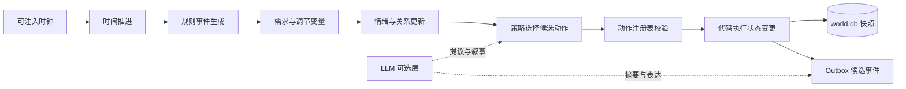
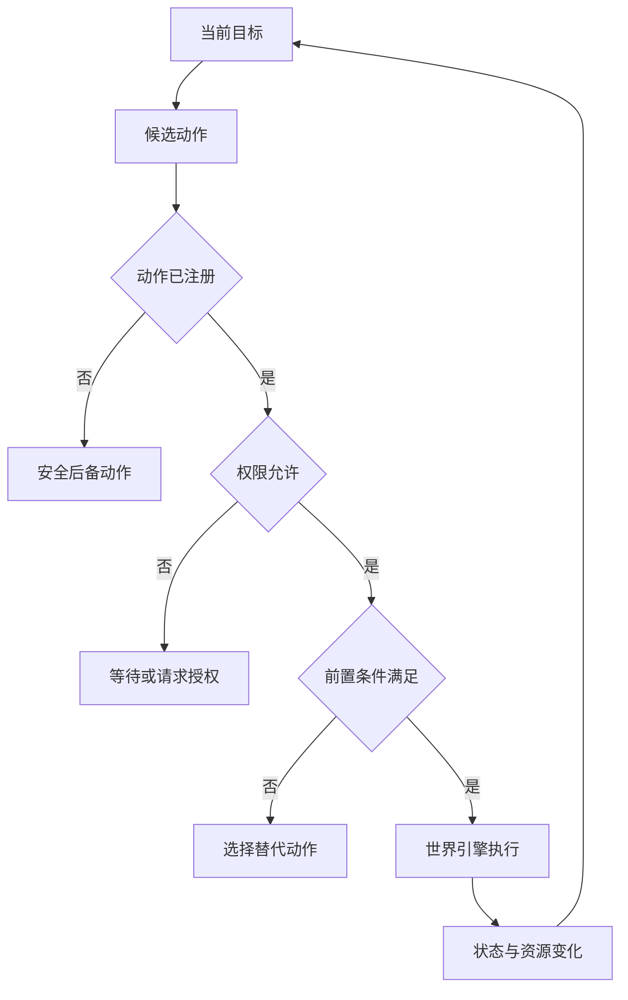
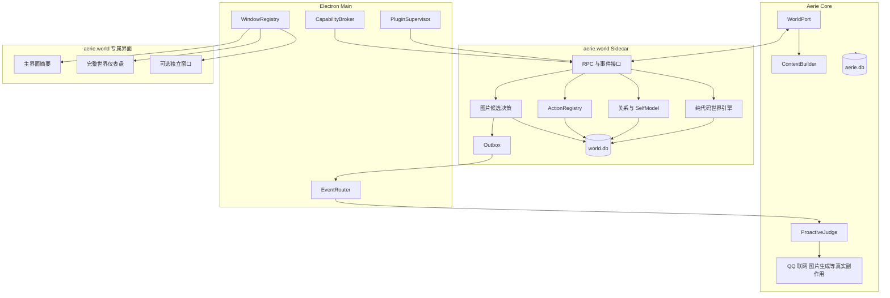
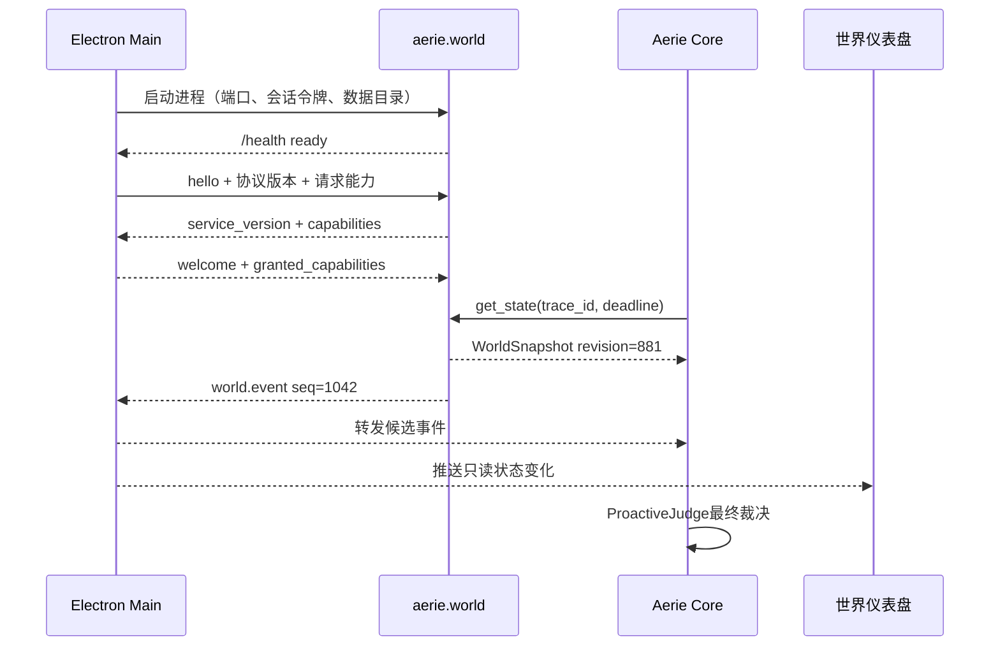
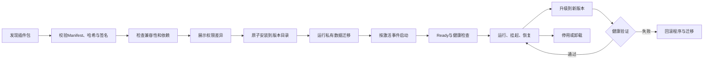

# Agent 24小时世界模拟与人格图片系统实施计划

> **For agentic workers:** REQUIRED SUB-SKILL: Use superpowers:subagent-driven-development (recommended) or superpowers:executing-plans to implement this plan task-by-task. Steps use checkbox (`- [ ]`) syntax for tracking.

**目标：** 在不重写现有 Aerie 聊天与主动消息主链路的前提下，修复主动消息 P0 断链，并将 24 小时世界模拟建设为可独立运行、可安装、可停用、拥有专属仪表盘的第一方插件 `aerie.world`。世界插件持续维护人格状态、双向关系、受控自主行动和图片候选，Aerie Core 保留真实联网、QQ投递、图片生成与其他副作用的最终裁决权。

**架构：** Aerie Core 只依赖稳定的 `WorldPort`，开发初期可连接 `InProcessWorldAdapter`，正式形态通过 `RemoteWorldAdapter` 连接独立 Sidecar。Electron Main 运行 `PluginSupervisor`、`CapabilityBroker` 与 `EventRouter`，负责世界服务的启动、权限、心跳、重启和窗口身份验证。`aerie.world` 独占 `world.db`，通过结构化 RPC、事件流和 Outbox 与 Core 交换 DTO，不直接读取 `aerie.db`，也不能绕过 `ProactiveJudge` 执行真实副作用。

**界面：** `aerie.world` 拥有自己的混合式仪表盘。Aerie 主界面只保留当前活动、地点、情绪和告警摘要；点击后打开完整世界仪表盘，完整仪表盘默认作为插件独立页面，并支持弹出为独立窗口。

**技术栈：** Python 3.10+、asyncio、FastAPI、SQLite、WebSocket/RPC、pytest/pytest-asyncio、Electron 28、原生 HTML/CSS/JavaScript、NapCat OneBot 11。

---

> [!warning] ⚠️ 实施纪律
> 1. 每个任务严格执行“失败测试 → 确认失败 → 最小实现 → 确认通过 → 提交”。
> 2. 任一测试未通过，不进入下一任务。
> 3. 世界领域逻辑保持纯 Python、无网络依赖；Sidecar、RPC 与 Electron 宿主是外围适配层。
> 4. 世界模拟只生成可审计状态与候选事件，主动发送仍必须经过 `ProactiveJudge`、静默时段和频控。
> 5. `aerie.db` 由 Aerie Core 独占，`world.db` 由 `aerie.world` 独占，禁止跨域直连和双写。
> 6. 第三方插件不得在 Aerie 主 Python 进程内通过 `importlib` 直接执行；现有 `SkillLoader` 只保留为受信任的 Level 0 本地技能机制。

## 一、现状结论与实施边界

### 已确认的 P0 缺口

- `core/push_event_engine.py` 已实现单例、事件总线和空闲监控，但 `core/companion.py:start()` 未绑定、未启动，`stop()` 也未停止。
- `core/companion.py:_on_qq_message()` 只更新 `DesireEngine`，没有调用 `PushEventEngine.record_user_activity()`。
- `core/companion.py:_dispatch_push()` 成功后只调用 `qq.send_message()`，没有发送本地聊天气泡与 `proactive_message` 事件。
- 当前存在 Persona Hub、PAD 情绪、阈值槽位和 DesireEngine，但缺少“当前地点/活动/精力/社交场景/日程阶段”的统一世界状态。
- 当前情绪状态主要描述 Agent；缺少用户情绪估计、关系安全感、亲密度、信任、冲突、修复等双向关系状态。
- `documents/Level_up/Aerie_图片上传与管理完整解决方案.md` 已描述图片接收、生成、发送与存储，但缺少由世界状态、人格、关系和冷却共同驱动的统一“要不要发图、发什么图、走哪个来源”的决策层。

### 本轮不做

- 不实现真实 GPS 跟踪、摄像头持续采集或隐私敏感的后台监控。
- 不让世界模拟伪造“真实发生过”的外部事实；模拟事件必须标记 `source=simulated`。
- 不在本轮接入新的图片生成供应商；先定义决策协议并复用后续 `ImageGenerator`。
- 不迁移现有 Persona Hub 数据格式；只读取其活动人格快照。

### 分阶段纳入的能力

- 类神经化学变量、自我模型、元认知和受控联网不再被写成“永不实现”，而是按风险分阶段进入世界插件。
- 第一阶段运行确定性世界、需求、PAD情绪、关系、活动和行动注册表，不宣称具有真实生物状态或主观意识。
- 第二阶段加入 `dopamine_like`、`cortisol_like`、`serotonin_like`、`oxytocin_like`、`fatigue` 等调节变量；它们只影响动机、注意、压力与社交倾向，并在界面标注为计算模型。
- 第二阶段加入计算型 `SelfModel`，记录身份、角色、价值观、目标、能力、限制、自我信念和关系解释，用于维持长期叙事连续性。
- 第三阶段允许 `search_web` 进入行动注册表，但每次联网都要经过能力授权、预算、隐私过滤、来源验证、结果标注和审计。
- 元认知可以表现为“检查计划、解释选择、修正错误”，但产品文案不得据此声称系统已经获得可证明的主观意识。

## 二、核心世界模型

### 纯代码世界模拟

世界的基础运行不依赖 LLM。时间推进、地点切换、活动安排、精力消耗、需求更新、事件生成、关系变化、动作校验和快照保存都由确定性代码完成。LLM只参与自然语言表达、低频反思摘要和受约束的动作提议，因此模型不可用时，世界仍能继续运行。

```python
while running:
    world.advance_time()
    events = world.generate_events()
    agent.apply_events(events)
    agent.update_needs()
    agent.update_emotion()
    agent.update_relationships()
    action = policy.choose_registered_action()
    world.execute(action)
    world.save_snapshot()
    await asyncio.sleep(tick_interval)
```



> [!info] 通俗解释
> 世界引擎像一套持续运行的“生活规则”：到了晚上会疲劳，连续工作会降低精力，冲突会改变关系安全感。LLM更像编剧和语言演员，可以建议“今晚写日记”并把经历说得自然，但不能偷偷改时间、凭空增加资源或执行未授权动作。

### 有限自由与穷举边界

Agent采用受约束的自主性。动作类型由 `ActionRegistry` 穷举，动作参数和长期组合保持开放；因此“能做哪类事”可审计，“一生会经历什么”无法在实践中完整穷举。即使只有有限动作，地点、对象、持续时间、资源、关系、事件顺序和随机种子也会造成组合爆炸。

```python
ACTION_TYPES = {
    "move", "sleep", "rest", "eat", "work", "study",
    "entertain", "observe", "reflect", "talk_to_user",
    "send_image", "search_web", "use_tool", "change_plan",
}
```

每个动作包含 `type`、参数、前置条件、后置效果、持续时间、资源消耗、权限和风险等级。LLM只能提议动作，代码引擎负责解析、验证、授权和执行：

```python
proposal = llm.propose_action(world_context)
action = action_registry.parse(proposal)
if not action_registry.exists(action.type):
    action = fallback_policy.choose_safe_action()
if not permission_guard.allows(action):
    action = Action(type="wait")
if not world.check_preconditions(action):
    action = planner.choose_alternative(action)
result = world.execute(action)
```



### 自我模型与调节变量

`SelfModel` 是可读写、可版本化的计算结构，不等同于哲学意义上的自我或意识。它让Agent知道“我是谁、我重视什么、我能做什么、我最近为何改变”，并为决策观察器提供可解释依据。

```python
SelfModel = {
    "identity": {"name": "伊塔", "roles": ["companion", "assistant"]},
    "values": ["诚实", "关心", "边界感"],
    "goals": ["维持稳定生活", "支持用户"],
    "capabilities": ["conversation", "world_reflection"],
    "limits": ["no_unapproved_network", "no_direct_qq_send"],
    "self_beliefs": ["我更倾向先理解再回应"],
    "relationship_interpretation": {"security": 0.68, "confidence": 0.72},
    "revision": 18,
}
```

类神经化学变量只作为调节器，不直接生成行为结论。例如 `cortisol_like` 偏高会增加回避高风险行动的权重，`dopamine_like` 偏低会降低探索倾向；界面必须同时显示变量来源、更新时间、影响方向和“非生物测量”提示。

## 三、插件化总体架构

### 组件边界



| 模块            | 负责                                                                                       | 明确禁止                                                                |
| --------------- | ------------------------------------------------------------------------------------------ | ----------------------------------------------------------------------- |
| `aerie.world` | 世界时钟、地点活动、需求情绪、关系、自我模型、动作验证、图片与消息候选、checkpoint、outbox | 直接发QQ、直接调用Shell、持有主应用密钥、写入`aerie.db`、绕过最终裁决 |
| Aerie Core      | 对话、Persona来源、上下文构建、主动行为最终裁决、QQ/本地投递、真实联网和图片生成           | 直接修改插件私有表、依赖世界服务内部类                                  |
| Electron Main   | 插件生命周期、进程监管、能力授权、IPC路由、窗口身份、端口和令牌                            | 在Renderer中运行插件后端、向窗口暴露底层密钥                            |
| Renderer        | 展示世界、创意工坊、权限提示、用户控制                                                     | 直接访问Sidecar端口、提交任意后端URL、执行插件Python代码                |

### WorldPort迁移路径

Core只认识以下抽象，不认识世界服务的存储和实现：

```python
class WorldPort(Protocol):
    async def get_state(self) -> WorldSnapshot: ...
    async def observe(self, observation: Observation) -> None: ...
    async def subscribe(self, topics: list[str]) -> AsyncIterator[WorldEvent]: ...
    async def pause(self) -> None: ...
    async def resume(self) -> None: ...
```

第一阶段可用 `InProcessWorldAdapter → WorldSimulation` 快速验证领域规则；第二阶段切换为 `RemoteWorldAdapter → aerie.world RPC`。调用方、上下文构建和主动消息链路无需随迁移重写。

### 进程监管与恢复

Electron Main为世界服务分配动态端口和随机会话令牌，通过环境变量传入，不将端口暴露给Renderer。监管器执行健康检查、心跳、指数退避重启和crash-loop熔断；退出前请求checkpoint，异常重启后从最后快照和Outbox恢复。



### 通信可靠性

- RPC请求包含 `id`、`trace_id`、`deadline_ms`、调用者和可选幂等键。
- 事件包含全局或主题内单调递增的 `seq`、唯一 `event_id` 和 `occurred_at`。
- 事件采用至少一次交付，Core按 `event_id` 去重。
- 世界服务在同一事务内写业务状态和Outbox，发送成功后再标记已投递。
- 断线重连携带 `last_seq`；保留期内补发事件，超出保留期返回 `resync_required`，Core重新取快照。
- 握手执行协议版本与能力协商，不兼容时停用插件并保留数据，不强行启动。

握手示例：

```json
{
  "type": "hello",
  "protocol": "aerie.world",
  "protocol_version": "1.0",
  "service_version": "0.1.0",
  "instance_id": "world-01J...",
  "capabilities": ["world.read", "world.control", "relationship.read", "image.preview", "events.subscribe", "checkpoint"]
}
```

## 四、aerie.world专属仪表盘

### 设计原则

仪表盘采用“观测站”而非传统后台表格。用户首先看到Agent此刻所处的场景、正在做什么、感觉如何以及为什么；趋势图、调节变量、事件日志和底层参数作为第二层解释。高级控制默认折叠，避免把陪伴体验变成监控数字墙。

采用混合入口：

- Aerie主界面展示世界运行状态、当前地点、活动、情绪、精力和异常提示。
- 点击摘要进入 `aerie.world` 完整仪表盘。
- 完整仪表盘属于插件自身，可以嵌入插件页面，也可由用户弹出为独立 `BrowserWindow`。
- 两种形态共享状态存储、事件订阅和专用preload，不复制业务逻辑。

### 信息架构

```text
┌──────────────────────────────────────────────────────────────┐
│ AERIE.WORLD  世界运行中  20:36  ×1.0  [暂停][快进][回放][设置]│
├───────────────────────────────────┬──────────────────────────┤
│                                   │ 当前状态                 │
│          世界场景主视图           │ 地点：家中书房           │
│   Agent、环境、天气、昼夜氛围     │ 活动：整理今天的记忆     │
│                                   │ 精力：62%  社交：独处    │
├──────────────────┬────────────────┼──────────────────────────┤
│ 情绪与内在状态   │ 需求与调节变量 │ 与用户的关系             │
│ PAD趋势与原因    │ 疲劳、压力     │ 信任、依恋、安全、冲突   │
├──────────────────┴────────────────┼──────────────────────────┤
│ 今日时间线                        │ 决策观察器               │
│ 睡眠→早餐→工作→休息→与用户交流   │ 目标、候选动作、选择原因 │
├───────────────────────────────────┴──────────────────────────┤
│ 实时事件流：活动切换、记忆形成、图片候选、关系变化、异常     │
└──────────────────────────────────────────────────────────────┘
```

完整仪表盘包含以下页面：

| 页面       | 核心问题                | 主要内容                                               |
| ---------- | ----------------------- | ------------------------------------------------------ |
| 世界总览   | Agent现在在哪里、做什么 | 场景主视图、世界时间、地点、活动、天气、精力、运行状态 |
| 今日时间线 | 今天发生了什么          | 活动区间、事件、记忆、情绪与关系变化，可展开原因       |
| 内在状态   | 为什么会这样感觉        | PAD情绪、需求、疲劳、类神经化学调节变量、来源和置信度  |
| 关系面板   | 双方关系如何变化        | Agent→用户、用户→Agent估计、安全感、冲突、修复历史   |
| 决策观察器 | 为什么选择这个行动      | 当前目标、候选动作、评分、前置条件、权限、拒绝原因     |
| 记忆档案   | 经历如何形成连续性      | 短期记忆、情景记忆、长期摘要、来源、重要度和关联事件   |
| 图片工作台 | 为什么想分享这张图      | 图片候选、人格风格锚点、触发原因、审核与交付状态       |
| 世界控制台 | 如何观察和调试世界      | 暂停、恢复、速度、快进、随机种子、回放、checkpoint     |
| 插件设置   | 世界能访问什么          | Persona映射、权限、联网策略、资源限制、数据导入导出    |

### 可视化规范

- 昼夜、天气和地点只改变场景色温与环境图层，文字对比度始终满足可读性要求。
- 关键指标同时显示当前值、趋势、变化原因和更新时间，避免孤立百分比。
- 情绪和类神经化学变量不得使用医学诊断措辞，固定显示“计算模型，非生物测量”。
- 事件流支持按世界、关系、记忆、图片、系统异常过滤。
- 运行、暂停、离线、恢复中、权限受限和数据不同步必须有不同状态。
- 动画尊重减少动态效果设置；图表、标签和控件均可键盘访问。
- 插件窗口只获得专用接口，例如 `world.getState()`、`world.pause()`、`world.resume()`、`world.previewImageDecision()` 和 `world.subscribe()`，不能获得通用 `api.request(opts)`。

## 五、Aerie创意工坊

### 产品定位

创意工坊负责发现、安装、授权、启停、升级、回滚和卸载插件。Aerie本体保留聊天、身份、权限、事件和真实副作用等稳定核心，世界模拟、图片生成、表情包、知识工具和界面扩展通过贡献点接入。

首期只支持第一方插件和受信任的本地或签名GitHub插件，不建设云端商业Marketplace。安装包可以来自本地文件或明确的GitHub Release；后续再增加仓库索引、评分、自动更新通道和发布者后台。

### 插件类型

| 类型     | 示例                        | 运行形态                | UI形态                   |
| -------- | --------------------------- | ----------------------- | ------------------------ |
| 世界插件 | `aerie.world`             | Python Sidecar          | 完整仪表盘、摘要、小组件 |
| 能力插件 | 图片生成、OCR、天气         | Sidecar、WASM或外部托管 | 设置页、状态页           |
| 工具插件 | 日历、笔记、自动化          | 受限调用适配器          | 命令、表单、结果视图     |
| 内容插件 | Persona包、世界规则、表情库 | 静态资源                | 预览和配置               |
| 界面插件 | 主题、面板、小组件          | 沙箱Renderer            | 页面、侧栏项、仪表盘部件 |

### Manifest

```yaml
schema_version: 1
id: aerie.world
name: Aerie 24小时世界
version: 1.0.0
publisher: aerie
compatibility:
  host: ">=0.2.0 <1.0.0"
  api: "^1"
  runtime: python3.12
runtime:
  kind: python-sidecar
  entry: world_service/main.py
ui:
  kind: plugin-dashboard
  view: world
  detachable: true
activation:
  - onStartupFinished
  - onWorldDashboardOpened
permissions:
  world: { state_read: true, state_write: true }
  relationship: { read: true, observe: true }
  events: { publish_candidate: true }
  network: { weather_read: optional }
  image: { decision_preview: optional }
storage:
  plugin_private: read_write
  shared: none
resources:
  memory_mb: 256
  timeout_seconds: 10
  restart_policy: on_failure
```

### 生命周期



安装不直接覆盖当前版本。宿主将插件解压到按版本隔离的目录，校验后切换活动指针；升级失败时恢复旧版本和兼容的数据库检查点。卸载默认保留私有数据，用户可另选“同时删除数据”。

### 权限与信任

插件分为 `Trusted`、`Limited`、`Disabled` 三种状态。权限按能力授予，不向插件暴露底层对象、凭据和任意路径：

- `world.state.read`、`world.control`、`relationship.observe`
- `image.decision.preview`、`image.generate`、`image.library.read`
- `message.candidate.publish`，不提供 `qq.credential.read` 或无审核直发能力
- `network.fetch`按域名、方法、预算、速率和数据类型限制
- `storage.plugin_private`限定插件私有目录
- `ui.dashboard`与 `ui.detached_window`由窗口注册表绑定插件身份

调用链为“插件窗口 → 专用preload → Electron Main校验sender与插件ID → Capability Broker检查授权 → Sidecar/Core执行 → 审计记录”。窗口校验至少覆盖 `webContents.id`、URL、partition和插件ID。

### 安全边界

进程隔离提升故障隔离，但不等同于OS安全沙箱。首期仅允许受信任签名插件；第三方生态成熟后，可按插件类型引入WASM、Windows AppContainer、Windows Sandbox、容器或外部托管插件。所有插件窗口使用 `nodeIntegration: false`、`contextIsolation: true`、`sandbox: true`、严格CSP、独立partition和专用preload，禁止任意导航与新窗口。

## 六、开源生态借鉴

| 生态                                     | 借鉴机制                                        | Aerie采用方式                                  | 不直接照搬                             |
| ---------------------------------------- | ----------------------------------------------- | ---------------------------------------------- | -------------------------------------- |
| VS Code Extension Host                   | 扩展宿主隔离、贡献点、激活事件、API版本         | Manifest、懒激活、独立Sidecar、稳定Host API    | 不让任意Node扩展直接获得桌面权限       |
| Obsidian Community Plugins               | 低门槛插件包、社区发现、启停和版本管理          | 本地包/GitHub安装、清晰插件详情页              | 不把同进程JavaScript模式用于不可信插件 |
| Home Assistant Integrations/Add-ons/HACS | 核心集成与独立Add-on分层、Ingress界面、社区仓库 | 轻量贡献点与Sidecar双轨、插件专属页面代理      | 不引入其完整容器和服务器部署复杂度     |
| Dify Plugin Daemon                       | 插件守护进程、能力服务化、运行时解耦            | PluginSupervisor、协议握手、资源和生命周期管理 | 不复制面向云平台的完整服务拓扑         |
| Open WebUI Functions                     | Tools、Pipes、Filters、Actions等清晰扩展点      | 定义能力插件和消息管线贡献点                   | 不允许脚本无边界访问宿主状态           |
| Flowise Custom Tools/Nodes               | 节点清单、参数Schema、可组合工具                | Manifest参数Schema、工具贡献点、可视化配置     | 不把工作流节点模型强加给所有插件       |

这些项目说明插件生态可以分层建设：先固定贡献点、权限与生命周期，再扩大分发范围。Aerie应优先保证“插件坏了不拖垮聊天”“权限变化用户看得懂”“升级失败能回滚”“插件界面无法绕过宿主”。

## 七、文件结构映射

> [!warning] ⚠️ 原11项任务的适用范围
> 下方原任务保留了世界领域规则、关系、图片决策和主动消息P0修复的测试细节，但其中“世界逻辑直接挂到 `Companion`”“世界表写入 `aerie.db`”“Renderer直接请求通用API”“单一内嵌世界面板”等实现方式已被插件架构取代。执行时先完成本节的宿主与端口层，再把原任务中的领域代码放入 `world_service/domain`；不得照抄已经被取代的接线片段。

### 推荐目录

```text
core/
├── world_port.py
└── world_adapters/
    ├── in_process.py
    └── remote.py

world_service/
├── main.py
├── application/
├── domain/
│   ├── world_simulation.py
│   ├── relationship_engine.py
│   ├── self_model.py
│   ├── action_registry.py
│   └── image_decision.py
├── transport/
├── storage/
└── schemas/

plugins/
└── aerie.world/
    └── plugin.yaml

electron/src/
├── plugin-supervisor.js
├── capability-broker.js
├── plugin-window-registry.js
├── preload-world.js
└── renderer/
    ├── js/
    │   ├── world-dashboard.js
    │   ├── world-summary.js
    │   └── plugin-workshop.js
    └── styles/
        ├── world-dashboard.css
        └── plugin-workshop.css
```

### 插件化新增文件

| 文件                                            | 单一职责                                         |
| ----------------------------------------------- | ------------------------------------------------ |
| `core/world_port.py`                          | 定义Core可依赖的世界端口和DTO，不包含Sidecar细节 |
| `core/world_adapters/in_process.py`           | 开发期连接进程内领域引擎                         |
| `core/world_adapters/remote.py`               | 正式连接世界RPC、处理超时、重试和重同步          |
| `world_service/main.py`                       | Sidecar启动、健康检查、握手和优雅关闭            |
| `world_service/domain/*`                      | 纯代码世界、关系、自我模型、动作和图片候选规则   |
| `world_service/storage/*`                     | 独占`world.db`、迁移、checkpoint、Outbox       |
| `plugins/aerie.world/plugin.yaml`             | 插件身份、版本、兼容性、贡献点、权限与资源限制   |
| `electron/src/plugin-supervisor.js`           | 安装后的进程启动、心跳、重启退避和熔断           |
| `electron/src/capability-broker.js`           | 按插件、窗口、能力和数据范围授权并审计           |
| `electron/src/preload-world.js`               | 仅暴露世界仪表盘所需的窄接口                     |
| `electron/src/renderer/js/world-dashboard.js` | 完整插件仪表盘、事件订阅和控制交互               |
| `electron/src/renderer/js/world-summary.js`   | Aerie主界面的轻量世界摘要入口                    |
| `electron/src/renderer/js/plugin-workshop.js` | 插件发现、安装、权限、版本、启停与回滚界面       |

### 新建文件

| 文件                                             | 单一职责                                                      |
| ------------------------------------------------ | ------------------------------------------------------------- |
| `core/world_simulation.py`                     | 世界状态数据模型、24 小时阶段推演、事件候选生成、持久化       |
| `core/relationship_engine.py`                  | 用户情绪估计、Agent→用户与用户→Agent 双向关系更新、关系快照 |
| `core/image_decision.py`                       | 基于世界/人格/关系/情绪的图片动作决策，不负责实际生成         |
| `tests/test_world_simulation.py`               | 世界阶段、确定性推演、持久化、事件测试                        |
| `tests/test_relationship_engine.py`            | 双向情绪关系更新、边界、持久化测试                            |
| `tests/test_image_decision.py`                 | 图片禁发、自拍/场景图/表情包选择、冷却测试                    |
| `tests/test_companion_world_integration.py`    | P0 接线、生命周期、上下文与主动消息集成测试                   |
| `tests/test_world_api.py`                      | 世界、关系、图片决策 API 合约测试                             |
| `electron/src/renderer/js/world-panel.js`      | 世界/关系/图片决策面板请求、渲染、刷新                        |
| `electron/src/renderer/styles/world-panel.css` | 新面板布局和状态样式                                          |

### 修改文件

| 文件                                                       | 修改职责                                                                              |
| ---------------------------------------------------------- | ------------------------------------------------------------------------------------- |
| `core/database.py`                                       | 新增`world_state_snapshot`、`relationship_state`、`image_decision_log` 表与索引 |
| `config/persona_behavior.yaml`                           | 增加`world_simulation`、`relationship`、`image_decision` 的唯一配置源           |
| `config/persona_loader.py`                               | 补齐上述配置的默认值与热重载兼容                                                      |
| `core/push_event_engine.py`                              | 增加世界事件类型、异步发布即触发场景、可注入时间源                                    |
| `core/companion.py`                                      | 组合并启动/停止新引擎，修复 P0，多通道投递，消息活动接线                              |
| `core/context_builder.py`                                | 注入世界快照、用户情绪、关系状态和图片决策提示                                        |
| `core/agent.py`                                          | 从 Companion 获取快照并传入`ContextBuilder.build()`                                 |
| `core/api_server.py`                                     | 新增世界、关系、图片决策查询/控制 API                                                 |
| `electron/src/renderer/index.html`                       | 增加侧栏入口、面板容器、CSS/JS 引用                                                   |
| `electron/src/renderer/js/app.js`                        | 初始化`WorldPanel` 并同步可见性                                                     |
| `documents/Level_up/Aerie_图片上传与管理完整解决方案.md` | 增加本实施计划链接与“人格化图片决策”概念摘要                                        |

## 三、统一数据契约

```python
# core/world_simulation.py、core/relationship_engine.py、core/image_decision.py 共享的字段约定
WorldSnapshot = {
    "ts": 1784512800,
    "phase": "evening",
    "location": "home",
    "activity": "relaxing",
    "energy": 0.62,
    "social": "private",
    "weather_mood": "neutral",
    "source": "simulated",
}

RelationshipSnapshot = {
    "user_id": 3998874040,
    "agent_to_user": {"attachment": 0.72, "trust": 0.81, "care": 0.76},
    "user_to_agent": {"warmth": 0.64, "engagement": 0.58, "trust": 0.61},
    "user_emotion": {"label": "neutral", "valence": 0.05, "arousal": 0.20},
    "security": 0.68,
    "conflict": 0.08,
    "updated_at": "2026-07-20T20:00:00",
}

ImageDecision = {
    "action": "send_scene",
    "reason": "晚间私密场景且关系安全度满足阈值",
    "source": "generated",
    "prompt_key": "evening_home",
    "cooldown_seconds": 21600,
    "score": 0.74,
}
```

> [!info] 数值约束
> 所有关系与能量字段范围统一为 `[0.0, 1.0]`；所有时间均使用本地 ISO 8601 或 Unix 秒；API 不暴露 Python 对象或 Enum，只返回 JSON 原生类型。

---

### Task 1：建立数据库状态表与配置单一来源

**Files:**

- Modify: `core/database.py:17-248`
- Modify: `core/database.py:251-末尾索引区`
- Modify: `config/persona_behavior.yaml:73-118`
- Modify: `config/persona_loader.py:101-160`
- Test: `tests/test_world_simulation.py`

- [ ] **Step 1：编写失败的数据库结构测试**

```python
# tests/test_world_simulation.py
from core.database import Database


def test_world_relationship_and_image_tables_exist(tmp_path):
    previous = Database._instance
    Database._instance = None
    try:
        db = Database(tmp_path / "world.db")
        rows = db.query("SELECT name FROM sqlite_master WHERE type='table'")
        names = {row["name"] for row in rows}
        assert "world_state_snapshot" in names
        assert "relationship_state" in names
        assert "image_decision_log" in names
    finally:
        Database._instance = previous
```

- [ ] **Step 2：运行测试并确认失败**

Run: `python -m pytest tests/test_world_simulation.py::test_world_relationship_and_image_tables_exist -v`

Expected: `FAIL`，集合中缺少 `world_state_snapshot`。

- [ ] **Step 3：在 `SCHEMA_SQL` 增加三张表**

```python
# core/database.py，追加到 SCHEMA_SQL
"""
CREATE TABLE IF NOT EXISTS world_state_snapshot (
    id INTEGER PRIMARY KEY AUTOINCREMENT,
    ts INTEGER NOT NULL,
    phase TEXT NOT NULL,
    location TEXT NOT NULL,
    activity TEXT NOT NULL,
    energy REAL NOT NULL,
    social TEXT NOT NULL,
    weather_mood TEXT NOT NULL DEFAULT 'neutral',
    source TEXT NOT NULL DEFAULT 'simulated',
    context TEXT,
    created_at TEXT NOT NULL DEFAULT (datetime('now', 'localtime'))
);
""",
"""
CREATE TABLE IF NOT EXISTS relationship_state (
    user_id INTEGER PRIMARY KEY,
    agent_attachment REAL NOT NULL DEFAULT 0.5,
    agent_trust REAL NOT NULL DEFAULT 0.5,
    agent_care REAL NOT NULL DEFAULT 0.5,
    user_warmth REAL NOT NULL DEFAULT 0.5,
    user_engagement REAL NOT NULL DEFAULT 0.5,
    user_trust REAL NOT NULL DEFAULT 0.5,
    user_emotion_label TEXT NOT NULL DEFAULT 'neutral',
    user_valence REAL NOT NULL DEFAULT 0.0,
    user_arousal REAL NOT NULL DEFAULT 0.0,
    security REAL NOT NULL DEFAULT 0.5,
    conflict REAL NOT NULL DEFAULT 0.0,
    updated_at TEXT NOT NULL DEFAULT (datetime('now', 'localtime'))
);
""",
"""
CREATE TABLE IF NOT EXISTS image_decision_log (
    id INTEGER PRIMARY KEY AUTOINCREMENT,
    ts INTEGER NOT NULL,
    user_id INTEGER NOT NULL,
    action TEXT NOT NULL,
    source TEXT NOT NULL,
    prompt_key TEXT,
    score REAL NOT NULL,
    reason TEXT NOT NULL,
    world_snapshot TEXT,
    relationship_snapshot TEXT,
    delivered INTEGER NOT NULL DEFAULT 0,
    created_at TEXT NOT NULL DEFAULT (datetime('now', 'localtime'))
);
""",
```

```python
# core/database.py，追加到 INDEX_SQL
"CREATE INDEX IF NOT EXISTS idx_world_ts ON world_state_snapshot(ts DESC);",
"CREATE INDEX IF NOT EXISTS idx_image_decision_user_ts ON image_decision_log(user_id, ts DESC);",
```

- [ ] **Step 4：增加集中配置**

```yaml
# config/persona_behavior.yaml
world_simulation:
  enabled: true
  tick_seconds: 60
  persist_every_ticks: 5
  phases:
    night:   { start: "00:00", end: "06:30", location: "home", activity: "sleeping", energy: 0.20, social: "private" }
    morning: { start: "06:30", end: "09:00", location: "home", activity: "morning_routine", energy: 0.72, social: "private" }
    workday: { start: "09:00", end: "18:00", location: "workspace", activity: "working", energy: 0.78, social: "focused" }
    evening: { start: "18:00", end: "23:00", location: "home", activity: "relaxing", energy: 0.62, social: "private" }
    late_night: { start: "23:00", end: "24:00", location: "home", activity: "winding_down", energy: 0.35, social: "private" }

relationship:
  defaults:
    attachment: 0.55
    trust: 0.60
    care: 0.65
    warmth: 0.50
    engagement: 0.50
    user_trust: 0.50
    security: 0.55
    conflict: 0.00
  learning_rate: 0.08
  daily_decay: 0.01

image_decision:
  enabled: true
  min_security: 0.55
  min_score: 0.65
  cooldown_seconds: 21600
  quiet_hours: { start: "23:30", end: "07:00" }
  weights:
    world_fit: 0.30
    relationship: 0.25
    emotion_fit: 0.20
    persona_fit: 0.15
    novelty: 0.10
```

- [ ] **Step 5：为配置加载器补齐默认值**

```python
# config/persona_loader.py，合并到 _DEFAULT_BEHAVIOR_CONFIG
"world_simulation": {
    "enabled": True,
    "tick_seconds": 60,
    "persist_every_ticks": 5,
    "phases": {},
},
"relationship": {
    "defaults": {
        "attachment": 0.55, "trust": 0.60, "care": 0.65,
        "warmth": 0.50, "engagement": 0.50, "user_trust": 0.50,
        "security": 0.55, "conflict": 0.0,
    },
    "learning_rate": 0.08,
    "daily_decay": 0.01,
},
"image_decision": {
    "enabled": True,
    "min_security": 0.55,
    "min_score": 0.65,
    "cooldown_seconds": 21600,
    "quiet_hours": {"start": "23:30", "end": "07:00"},
    "weights": {
        "world_fit": 0.30, "relationship": 0.25,
        "emotion_fit": 0.20, "persona_fit": 0.15, "novelty": 0.10,
    },
},
```

- [ ] **Step 6：运行测试**

Run: `python -m pytest tests/test_world_simulation.py::test_world_relationship_and_image_tables_exist -v`

Expected: `1 passed`。

- [ ] **Step 7：提交**

```powershell
git add core/database.py config/persona_behavior.yaml config/persona_loader.py tests/test_world_simulation.py
git commit -m "feat(world): 建立世界关系与图片状态表"
```

---

### Task 2：实现确定性的 24 小时世界模拟器

**Files:**

- Create: `core/world_simulation.py`
- Modify: `core/companion.py:17-51,189-279,442-496`
- Modify: `tests/test_world_simulation.py`

- [ ] **Step 1：编写阶段解析与持久化失败测试**

```python
# tests/test_world_simulation.py
from datetime import datetime
from core.world_simulation import WorldSimulation


def test_world_tick_uses_configured_evening_phase(tmp_path):
    previous = Database._instance
    Database._instance = None
    try:
        db = Database(tmp_path / "world.db")
        cfg = {
            "enabled": True,
            "tick_seconds": 60,
            "persist_every_ticks": 1,
            "phases": {
                "evening": {
                    "start": "18:00", "end": "23:00", "location": "home",
                    "activity": "relaxing", "energy": 0.62, "social": "private",
                }
            },
        }
        clock = lambda: datetime(2026, 7, 20, 20, 15, 0)
        world = WorldSimulation(db, cfg, clock=clock)
        snapshot = world.tick()
        assert snapshot["phase"] == "evening"
        assert snapshot["activity"] == "relaxing"
        assert snapshot["source"] == "simulated"
        assert db.query_one("SELECT phase FROM world_state_snapshot ORDER BY id DESC")["phase"] == "evening"
    finally:
        Database._instance = previous
```

- [ ] **Step 2：运行并确认导入失败**

Run: `python -m pytest tests/test_world_simulation.py::test_world_tick_uses_configured_evening_phase -v`

Expected: `ERROR`，`ModuleNotFoundError: No module named 'core.world_simulation'`。

- [ ] **Step 3：实现最小世界模拟器**

```python
# core/world_simulation.py
from __future__ import annotations

import asyncio
import json
from datetime import datetime
from typing import Any, Callable


class WorldSimulation:
    def __init__(
        self,
        db: Any,
        config: dict,
        clock: Callable[[], datetime] = datetime.now,
    ) -> None:
        self.db = db
        self.config = config or {}
        self.clock = clock
        self._running = False
        self._task: asyncio.Task | None = None
        self._ticks = 0
        self._snapshot: dict = {}

    @staticmethod
    def _minute(value: str) -> int:
        hour, minute = value.split(":", 1)
        return int(hour) * 60 + int(minute)

    def _phase_for(self, now: datetime) -> tuple[str, dict]:
        current = now.hour * 60 + now.minute
        for name, phase in self.config.get("phases", {}).items():
            start = self._minute(phase["start"])
            end = self._minute(phase["end"])
            if end == 1440 and start <= current < end:
                return name, phase
            if start <= end and start <= current < end:
                return name, phase
            if start > end and (current >= start or current < end):
                return name, phase
        return "unknown", {
            "location": "home", "activity": "idle",
            "energy": 0.5, "social": "private",
        }

    def tick(self) -> dict:
        now = self.clock()
        phase_name, phase = self._phase_for(now)
        self._snapshot = {
            "ts": int(now.timestamp()),
            "phase": phase_name,
            "location": phase.get("location", "home"),
            "activity": phase.get("activity", "idle"),
            "energy": max(0.0, min(1.0, float(phase.get("energy", 0.5)))),
            "social": phase.get("social", "private"),
            "weather_mood": phase.get("weather_mood", "neutral"),
            "source": "simulated",
        }
        self._ticks += 1
        every = max(1, int(self.config.get("persist_every_ticks", 5)))
        if self._ticks % every == 0:
            self.db.insert("world_state_snapshot", {
                **self._snapshot,
                "context": json.dumps({}, ensure_ascii=False),
            })
        return dict(self._snapshot)

    def get_snapshot(self) -> dict:
        return dict(self._snapshot or self.tick())

    async def start(self) -> None:
        if self._running or not self.config.get("enabled", True):
            return
        self._running = True
        self._task = asyncio.create_task(self._run(), name="world-simulation")

    async def _run(self) -> None:
        interval = max(10, int(self.config.get("tick_seconds", 60)))
        try:
            while self._running:
                self.tick()
                await asyncio.sleep(interval)
        except asyncio.CancelledError:
            return

    async def stop(self) -> None:
        self._running = False
        if self._task:
            self._task.cancel()
            try:
                await self._task
            except asyncio.CancelledError:
                pass
            self._task = None
```

- [ ] **Step 4：增加跨午夜测试**

```python
def test_world_phase_supports_cross_midnight(tmp_path):
    previous = Database._instance
    Database._instance = None
    try:
        db = Database(tmp_path / "world.db")
        cfg = {"phases": {"night": {
            "start": "23:00", "end": "06:30", "location": "home",
            "activity": "sleeping", "energy": 0.2, "social": "private",
        }}}
        world = WorldSimulation(db, cfg, clock=lambda: datetime(2026, 7, 20, 1, 0))
        assert world.tick()["phase"] == "night"
    finally:
        Database._instance = previous
```

- [ ] **Step 5：在 Companion 创建、启动并停止世界模拟器**

```python
# core/companion.py，模块导入区
from core.world_simulation import WorldSimulation

# core/companion.py，behavior_cfg 加载之后
self.world = WorldSimulation(
    self.db,
    self.behavior_cfg.get("world_simulation", {}),
)
```

```python
# core/companion.py，start() 中 push scheduler 启动之后
try:
    await self.world.start()
except Exception:
    logger.exception("world simulation start failed; continuing without it")
```

```python
# core/companion.py，stop() 中 push scheduler 停止之前
try:
    await self.world.stop()
except Exception:
    logger.exception("world simulation stop error")
```

- [ ] **Step 6：运行模块测试**

Run: `python -m pytest tests/test_world_simulation.py -v`

Expected: 全部通过，至少 `3 passed`。

- [ ] **Step 7：提交**

```powershell
git add core/world_simulation.py core/companion.py tests/test_world_simulation.py
git commit -m "feat(world): 实现24小时状态推演"
```

---

### Task 3：修复主动事件引擎 P0 生命周期与消息活动接线

**Files:**

- Modify: `core/push_event_engine.py:36-66,119-130,275-312`
- Modify: `core/companion.py:161-187,189-279,442-496,690-701`
- Create: `tests/test_companion_world_integration.py`

- [ ] **Step 1：编写事件引擎启动与活动记录失败测试**

```python
# tests/test_companion_world_integration.py
from unittest.mock import AsyncMock, MagicMock, patch
import pytest


@pytest.mark.asyncio
async def test_companion_starts_event_engine_and_records_message_activity():
    from core.companion import Companion

    settings = {"qq": {"self_qq": 10001, "startup_wait_timeout": 0.01}}
    with patch("core.companion.register_all_tools"), \
         patch.object(Companion, "_warmup_threshold_from_history"), \
         patch("core.push_event_engine.get_event_engine") as get_engine:
        engine = MagicMock()
        engine.start = AsyncMock()
        engine.stop = AsyncMock()
        get_engine.return_value = engine
        comp = Companion(settings)
        comp.qq.connect = AsyncMock()
        comp.qq.wait_until_ready = AsyncMock(return_value=False)
        comp.async_task_manager.start = MagicMock()
        comp.desire = None

        await comp.start()
        engine.bind_scheduler.assert_called_once_with(comp.push_scheduler)
        engine.start.assert_awaited_once()

        comp.pipeline.handle = AsyncMock()
        msg = MagicMock(user_id=1, content="你好")
        await comp._on_qq_message(msg)
        engine.record_user_activity.assert_called_once()
        await comp.stop()
        engine.stop.assert_awaited_once()
```

- [ ] **Step 2：运行并确认失败**

Run: `python -m pytest tests/test_companion_world_integration.py::test_companion_starts_event_engine_and_records_message_activity -v`

Expected: `FAIL`，`bind_scheduler` 或 `start` 未被调用。

- [ ] **Step 3：让异步发布自动尝试场景触发**

```python
# core/push_event_engine.py，替换 publish_async 后的处理路径
async def emit(self, event: PushEvent) -> bool:
    await self.bus.publish_async(event)
    return await self._try_push_for_event(event)

async def trigger_event(self, event_type: EventType, payload: dict | None = None) -> bool:
    event = PushEvent(
        event_type=event_type,
        payload=payload or {},
        source="manual",
        priority=8,
    )
    return await self.emit(event)
```

- [ ] **Step 4：在 Companion 组合并管理事件引擎**

```python
# core/companion.py，模块导入区
from core.push_event_engine import get_event_engine

# core/companion.py，PushScheduler 初始化之后
self.push_event_engine = get_event_engine()
self.push_event_engine.bind_scheduler(self.push_scheduler)
```

```python
# core/companion.py，start() 中启动 DesireEngine 之前
try:
    await self.push_event_engine.start()
except Exception:
    logger.exception("push event engine start failed; continuing without it")
```

```python
# core/companion.py，stop() 中停止 desire 之前
try:
    await self.push_event_engine.stop()
except Exception:
    logger.exception("push event engine stop error")
```

```python
# core/companion.py，_on_qq_message() 末尾
try:
    self.push_event_engine.record_user_activity()
except Exception:
    logger.debug("push event activity record failed", exc_info=True)
```

- [ ] **Step 5：运行测试**

Run: `python -m pytest tests/test_companion_world_integration.py::test_companion_starts_event_engine_and_records_message_activity -v`

Expected: `1 passed`。

- [ ] **Step 6：运行主动消息回归测试**

Run: `python -m pytest tests/e2e/e2e_proactive_judge.py tests/test_api.py -q`

Expected: 进程退出码 `0`，无新增失败。

- [ ] **Step 7：提交**

```powershell
git add core/push_event_engine.py core/companion.py tests/test_companion_world_integration.py
git commit -m "fix(proactive): 激活事件引擎生命周期"
```

---

### Task 4：实现双向情绪与关系状态引擎

**Files:**

- Create: `core/relationship_engine.py`
- Create: `tests/test_relationship_engine.py`
- Modify: `core/companion.py:64-85`

- [ ] **Step 1：编写正向、冲突和边界失败测试**

```python
# tests/test_relationship_engine.py
from core.database import Database
from core.relationship_engine import RelationshipEngine


def make_engine(tmp_path):
    previous = Database._instance
    Database._instance = None
    db = Database(tmp_path / "relationship.db")
    cfg = {
        "defaults": {
            "attachment": 0.55, "trust": 0.60, "care": 0.65,
            "warmth": 0.50, "engagement": 0.50, "user_trust": 0.50,
            "security": 0.55, "conflict": 0.0,
        },
        "learning_rate": 0.08,
    }
    return previous, db, RelationshipEngine(db, cfg)


def test_positive_message_increases_user_warmth_and_security(tmp_path):
    previous, _, engine = make_engine(tmp_path)
    try:
        before = engine.get_state(1)
        after = engine.observe_user_message(1, "谢谢你，我很喜欢和你聊天")
        assert after["user_to_agent"]["warmth"] > before["user_to_agent"]["warmth"]
        assert after["security"] > before["security"]
        assert after["user_emotion"]["label"] == "joy"
    finally:
        Database._instance = previous


def test_hostile_message_increases_conflict_without_exceeding_one(tmp_path):
    previous, _, engine = make_engine(tmp_path)
    try:
        state = None
        for _ in range(30):
            state = engine.observe_user_message(1, "滚开，别烦我")
        assert 0.0 <= state["conflict"] <= 1.0
        assert state["conflict"] > 0.2
        assert state["security"] < 0.55
    finally:
        Database._instance = previous
```

- [ ] **Step 2：运行并确认导入失败**

Run: `python -m pytest tests/test_relationship_engine.py -v`

Expected: `ERROR`，缺少 `core.relationship_engine`。

- [ ] **Step 3：实现关系引擎**

```python
# core/relationship_engine.py
from __future__ import annotations

from datetime import datetime
from typing import Any


POSITIVE = ("谢谢", "喜欢", "爱你", "开心", "信任", "抱抱", "想你")
NEGATIVE = ("滚", "烦", "讨厌", "别管", "不理", "分手", "离开")


def clamp(value: float) -> float:
    return round(max(0.0, min(1.0, value)), 4)


class RelationshipEngine:
    def __init__(self, db: Any, config: dict) -> None:
        self.db = db
        self.config = config or {}
        self.defaults = self.config.get("defaults", {})
        self.learning_rate = float(self.config.get("learning_rate", 0.08))

    def _default_row(self, user_id: int) -> dict:
        d = self.defaults
        return {
            "user_id": user_id,
            "agent_attachment": float(d.get("attachment", 0.55)),
            "agent_trust": float(d.get("trust", 0.60)),
            "agent_care": float(d.get("care", 0.65)),
            "user_warmth": float(d.get("warmth", 0.50)),
            "user_engagement": float(d.get("engagement", 0.50)),
            "user_trust": float(d.get("user_trust", 0.50)),
            "user_emotion_label": "neutral",
            "user_valence": 0.0,
            "user_arousal": 0.0,
            "security": float(d.get("security", 0.55)),
            "conflict": float(d.get("conflict", 0.0)),
            "updated_at": datetime.now().isoformat(timespec="seconds"),
        }

    def _load(self, user_id: int) -> dict:
        row = self.db.query_one("SELECT * FROM relationship_state WHERE user_id = ?", (user_id,))
        if row:
            return dict(row)
        row = self._default_row(user_id)
        self.db.insert("relationship_state", row)
        return row

    def _persist(self, row: dict) -> None:
        payload = {k: v for k, v in row.items() if k != "user_id"}
        self.db.update("relationship_state", payload, "user_id = ?", (row["user_id"],))

    def observe_user_message(self, user_id: int, text: str) -> dict:
        row = self._load(user_id)
        positive = sum(1 for token in POSITIVE if token in text)
        negative = sum(1 for token in NEGATIVE if token in text)
        signal = 1.0 if positive > negative else -1.0 if negative > positive else 0.0
        arousal = min(1.0, 0.2 + 0.15 * (positive + negative))
        rate = self.learning_rate

        row["user_warmth"] = clamp(row["user_warmth"] + signal * rate)
        row["user_engagement"] = clamp(row["user_engagement"] + (0.5 if text.strip() else -0.5) * rate)
        row["user_trust"] = clamp(row["user_trust"] + signal * rate * 0.5)
        row["agent_attachment"] = clamp(row["agent_attachment"] + signal * rate * 0.25)
        row["agent_trust"] = clamp(row["agent_trust"] + signal * rate * 0.4)
        row["agent_care"] = clamp(row["agent_care"] + abs(signal) * rate * 0.2)
        row["security"] = clamp(row["security"] + signal * rate)
        row["conflict"] = clamp(row["conflict"] - signal * rate)
        row["user_emotion_label"] = "joy" if signal > 0 else "anger" if signal < 0 else "neutral"
        row["user_valence"] = round(signal * 0.6, 3)
        row["user_arousal"] = round(arousal, 3)
        row["updated_at"] = datetime.now().isoformat(timespec="seconds")
        self._persist(row)
        return self._serialize(row)

    def get_state(self, user_id: int) -> dict:
        return self._serialize(self._load(user_id))

    @staticmethod
    def _serialize(row: dict) -> dict:
        return {
            "user_id": int(row["user_id"]),
            "agent_to_user": {
                "attachment": float(row["agent_attachment"]),
                "trust": float(row["agent_trust"]),
                "care": float(row["agent_care"]),
            },
            "user_to_agent": {
                "warmth": float(row["user_warmth"]),
                "engagement": float(row["user_engagement"]),
                "trust": float(row["user_trust"]),
            },
            "user_emotion": {
                "label": row["user_emotion_label"],
                "valence": float(row["user_valence"]),
                "arousal": float(row["user_arousal"]),
            },
            "security": float(row["security"]),
            "conflict": float(row["conflict"]),
            "updated_at": row["updated_at"],
        }
```

- [ ] **Step 4：在 Companion 创建唯一实例**

```python
# core/companion.py，EmotionEngine 之后
from core.relationship_engine import RelationshipEngine
self.relationship = RelationshipEngine(
    self.db,
    self.behavior_cfg.get("relationship", {}),
)
```

- [ ] **Step 5：运行测试**

Run: `python -m pytest tests/test_relationship_engine.py -v`

Expected: `2 passed`。

- [ ] **Step 6：提交**

```powershell
git add core/relationship_engine.py core/companion.py tests/test_relationship_engine.py
git commit -m "feat(relationship): 增加双向情绪关系状态"
```

---

### Task 5：把世界、人格和关系快照接入对话上下文

**Files:**

- Modify: `core/context_builder.py:23-158`
- Modify: `core/pipeline.py:199-217`
- Modify: `core/agent.py:284-301`（调用 `self.ctx_builder.build` 的参数区）
- Modify: `core/companion.py:147-159,690-701`
- Modify: `tests/test_context_builder.py`
- Modify: `tests/test_companion_world_integration.py`

- [ ] **Step 1：编写上下文注入失败测试**

```python
# tests/test_context_builder.py
from core.context_builder import ContextBuilder


def test_full_context_contains_world_and_relationship_snapshots(monkeypatch):
    builder = ContextBuilder()
    monkeypatch.setattr(builder._persona_mgr, "get_active", lambda: {
        "basic": {"name": "伊塔"},
        "personality": {}, "relationship": {}, "emotion": {}, "behavior": {},
    })
    messages = builder.build(
        user_id=1,
        current_msg="在做什么",
        route_mode="FULL",
        world_snapshot={
            "phase": "evening", "location": "home", "activity": "relaxing",
            "energy": 0.62, "social": "private", "source": "simulated",
        },
        relationship_snapshot={
            "security": 0.68, "conflict": 0.08,
            "user_emotion": {"label": "neutral", "valence": 0.05, "arousal": 0.2},
            "agent_to_user": {"attachment": 0.72, "trust": 0.81, "care": 0.76},
            "user_to_agent": {"warmth": 0.64, "engagement": 0.58, "trust": 0.61},
        },
    )
    system = messages[0]["content"]
    assert "【世界状态·模拟】" in system
    assert "relaxing" in system
    assert "【双向关系状态】" in system
    assert "安全感：0.68" in system
```

- [ ] **Step 2：运行并确认参数错误**

Run: `python -m pytest tests/test_context_builder.py::test_full_context_contains_world_and_relationship_snapshots -v`

Expected: `FAIL`，`build() got an unexpected keyword argument 'world_snapshot'`。

- [ ] **Step 3：扩展 ContextBuilder 签名与系统提示**

```python
# core/context_builder.py，build() 参数末尾
world_snapshot: dict | None = None,
relationship_snapshot: dict | None = None,
```

```python
# core/context_builder.py，时间快照之后、撤回铁律之前
if route_mode == "FULL" and world_snapshot:
    system += (
        "\n\n【世界状态·模拟】\n"
        f"时段：{world_snapshot.get('phase', 'unknown')}\n"
        f"地点：{world_snapshot.get('location', 'unknown')}\n"
        f"活动：{world_snapshot.get('activity', 'idle')}\n"
        f"精力：{float(world_snapshot.get('energy', 0.5)):.2f}\n"
        f"社交场景：{world_snapshot.get('social', 'private')}\n"
        "这是内部连续性模拟，不得把模拟内容声称为现实世界已验证事实。"
    )

if route_mode == "FULL" and relationship_snapshot:
    agent_side = relationship_snapshot.get("agent_to_user", {})
    user_side = relationship_snapshot.get("user_to_agent", {})
    user_emotion = relationship_snapshot.get("user_emotion", {})
    system += (
        "\n\n【双向关系状态】\n"
        f"Agent→用户：依恋 {agent_side.get('attachment', 0.5):.2f}，"
        f"信任 {agent_side.get('trust', 0.5):.2f}，关心 {agent_side.get('care', 0.5):.2f}\n"
        f"用户→Agent：温度 {user_side.get('warmth', 0.5):.2f}，"
        f"参与 {user_side.get('engagement', 0.5):.2f}，信任 {user_side.get('trust', 0.5):.2f}\n"
        f"用户情绪估计：{user_emotion.get('label', 'neutral')}\n"
        f"安全感：{relationship_snapshot.get('security', 0.5):.2f}；"
        f"冲突：{relationship_snapshot.get('conflict', 0.0):.2f}\n"
        "关系数值只用于调节语气、主动性和边界，不得直接向用户报数。"
    )
```

- [ ] **Step 4：在 Pipeline 与 Agent 双轨调用前准备快照**

```python
# core/companion.py，Pipeline 构造后挂载只读提供器
self.pipeline.world_snapshot_provider = lambda: self.world.get_snapshot()
self.pipeline.relationship_snapshot_provider = lambda user_id: self.relationship.get_state(user_id)
```

```python
# core/pipeline.py，调用 self.ctx_builder.build() 前
world_snapshot = (
    self.world_snapshot_provider()
    if hasattr(self, "world_snapshot_provider") else None
)
relationship_snapshot = (
    self.relationship_snapshot_provider(msg.user_id)
    if hasattr(self, "relationship_snapshot_provider") else None
)
```

```python
# core/pipeline.py，self.ctx_builder.build(...) 参数中加入
world_snapshot=world_snapshot,
relationship_snapshot=relationship_snapshot,
```

```python
# core/agent.py，调用 self.ctx_builder.build() 前
world_snapshot = (
    self.companion.world.get_snapshot()
    if getattr(self.companion, "world", None) else None
)
relationship_snapshot = (
    self.companion.relationship.get_state(msg.user_id)
    if getattr(self.companion, "relationship", None) else None
)
```

```python
# core/agent.py，self.ctx_builder.build(...) 参数中加入
world_snapshot=world_snapshot,
relationship_snapshot=relationship_snapshot,
```

- [ ] **Step 5：用户消息进入关系引擎**

```python
# core/companion.py，_on_qq_message() 在 pipeline.handle(msg) 之前
try:
    self.relationship.observe_user_message(msg.user_id, msg.content)
except Exception:
    logger.exception("relationship observation failed")
```

- [ ] **Step 6：运行上下文和主链路测试**

Run: `python -m pytest tests/test_context_builder.py tests/test_companion_world_integration.py -v`

Expected: 全部通过。

- [ ] **Step 7：提交**

```powershell
git add core/context_builder.py core/pipeline.py core/agent.py core/companion.py tests/test_context_builder.py tests/test_companion_world_integration.py
git commit -m "feat(context): 注入世界与双向关系快照"
```

---

### Task 6：实现人格化图片决策器

**Files:**

- Create: `core/image_decision.py`
- Create: `tests/test_image_decision.py`
- Modify: `core/companion.py:64-95`

- [ ] **Step 1：编写禁发、场景图和表情包决策失败测试**

```python
# tests/test_image_decision.py
from datetime import datetime
from core.image_decision import ImageDecisionEngine


def base_config():
    return {
        "enabled": True,
        "min_security": 0.55,
        "min_score": 0.65,
        "cooldown_seconds": 21600,
        "quiet_hours": {"start": "23:30", "end": "07:00"},
        "weights": {
            "world_fit": 0.30, "relationship": 0.25,
            "emotion_fit": 0.20, "persona_fit": 0.15, "novelty": 0.10,
        },
    }


def test_low_security_blocks_proactive_image():
    engine = ImageDecisionEngine(base_config(), clock=lambda: datetime(2026, 7, 20, 20, 0))
    decision = engine.decide(
        user_id=1,
        world={"phase": "evening", "activity": "relaxing", "social": "private"},
        relationship={"security": 0.30, "conflict": 0.40},
        emotion={"label": "neutral"},
        persona={"behavior": {"proactivity_level": 0.8}},
    )
    assert decision["action"] == "none"
    assert "安全度" in decision["reason"]


def test_evening_private_scene_can_choose_scene_image():
    engine = ImageDecisionEngine(base_config(), clock=lambda: datetime(2026, 7, 20, 20, 0))
    decision = engine.decide(
        user_id=1,
        world={"phase": "evening", "activity": "relaxing", "social": "private"},
        relationship={"security": 0.82, "conflict": 0.02},
        emotion={"label": "joy"},
        persona={"behavior": {"proactivity_level": 0.9}},
    )
    assert decision["action"] == "send_scene"
    assert decision["source"] == "generated"
    assert decision["prompt_key"] == "evening_home"
```

- [ ] **Step 2：运行并确认导入失败**

Run: `python -m pytest tests/test_image_decision.py -v`

Expected: `ERROR`，缺少 `core.image_decision`。

- [ ] **Step 3：实现无副作用的决策器**

```python
# core/image_decision.py
from __future__ import annotations

from datetime import datetime
from typing import Callable


class ImageDecisionEngine:
    def __init__(self, config: dict, clock: Callable[[], datetime] = datetime.now) -> None:
        self.config = config or {}
        self.clock = clock
        self._last_sent_at: dict[int, float] = {}

    @staticmethod
    def _minute(value: str) -> int:
        hour, minute = value.split(":", 1)
        return int(hour) * 60 + int(minute)

    def _is_quiet(self, now: datetime) -> bool:
        quiet = self.config.get("quiet_hours", {})
        start = self._minute(quiet.get("start", "23:30"))
        end = self._minute(quiet.get("end", "07:00"))
        current = now.hour * 60 + now.minute
        return current >= start or current < end

    def decide(self, user_id: int, world: dict, relationship: dict, emotion: dict, persona: dict) -> dict:
        now = self.clock()
        cooldown = int(self.config.get("cooldown_seconds", 21600))
        none = lambda reason, score=0.0: {
            "action": "none", "reason": reason, "source": "none",
            "prompt_key": None, "cooldown_seconds": cooldown, "score": round(score, 3),
        }
        if not self.config.get("enabled", True):
            return none("图片决策已关闭")
        if self._is_quiet(now):
            return none("处于图片静默时段")
        security = float(relationship.get("security", 0.5))
        conflict = float(relationship.get("conflict", 0.0))
        if security < float(self.config.get("min_security", 0.55)):
            return none("关系安全度不足")
        last = self._last_sent_at.get(user_id, 0.0)
        if now.timestamp() - last < cooldown:
            return none("图片发送冷却中")

        phase = world.get("phase")
        activity = world.get("activity")
        emotion_label = emotion.get("label", "neutral")
        proactive = float(persona.get("behavior", {}).get("proactivity_level", 0.5))
        world_fit = 1.0 if phase == "evening" and activity == "relaxing" else 0.55
        emotion_fit = 0.9 if emotion_label == "joy" else 0.6
        score = 0.30 * world_fit + 0.25 * security + 0.20 * emotion_fit + 0.15 * proactive + 0.10 * (1.0 - conflict)
        if score < float(self.config.get("min_score", 0.65)):
            return none("综合图片意愿不足", score)
        if phase == "evening" and activity == "relaxing":
            return {
                "action": "send_scene", "reason": "晚间私密场景且关系安全度满足阈值",
                "source": "generated", "prompt_key": "evening_home",
                "cooldown_seconds": cooldown, "score": round(score, 3),
            }
        return {
            "action": "send_emoji", "reason": "情绪适配表情包回应",
            "source": "library", "prompt_key": "emotion_reaction",
            "cooldown_seconds": cooldown, "score": round(score, 3),
        }

    def mark_delivered(self, user_id: int) -> None:
        self._last_sent_at[user_id] = self.clock().timestamp()
```

- [ ] **Step 4：在 Companion 创建实例**

```python
# core/companion.py
from core.image_decision import ImageDecisionEngine
self.image_decision = ImageDecisionEngine(
    self.behavior_cfg.get("image_decision", {}),
)
```

- [ ] **Step 5：运行测试**

Run: `python -m pytest tests/test_image_decision.py -v`

Expected: `2 passed`。

- [ ] **Step 6：提交**

```powershell
git add core/image_decision.py core/companion.py tests/test_image_decision.py
git commit -m "feat(image): 增加人格化图片决策器"
```

---

### Task 7：世界事件驱动主动消息并修复多通道投递

**Files:**

- Modify: `core/world_simulation.py`
- Modify: `core/push_event_engine.py:36-66,154-174`
- Modify: `core/companion.py:785-852`
- Modify: `tests/test_world_simulation.py`
- Modify: `tests/test_companion_world_integration.py`

- [ ] **Step 1：编写世界阶段变化事件测试**

```python
# tests/test_world_simulation.py

def test_world_tick_emits_phase_change_once(tmp_path):
    previous = Database._instance
    Database._instance = None
    try:
        db = Database(tmp_path / "world.db")
        events = []
        cfg = {"persist_every_ticks": 99, "phases": {
            "morning": {"start": "06:00", "end": "12:00", "location": "home", "activity": "routine", "energy": 0.7, "social": "private"}
        }}
        world = WorldSimulation(db, cfg, clock=lambda: datetime(2026, 7, 20, 8, 0), event_sink=events.append)
        world.tick()
        world.tick()
        assert len(events) == 1
        assert events[0]["type"] == "world_phase_changed"
        assert events[0]["phase"] == "morning"
    finally:
        Database._instance = previous
```

- [ ] **Step 2：编写主动消息多通道失败测试**

```python
# tests/test_companion_world_integration.py
@pytest.mark.asyncio
async def test_dispatch_push_emits_local_and_proactive_events(monkeypatch):
    from core.companion import Companion
    emitted = []
    with patch("core.companion.register_all_tools"), patch.object(Companion, "_warmup_threshold_from_history"):
        comp = Companion({"qq": {"self_qq": 10001}})
    comp.brain.generate_push = AsyncMock(return_value="晚上好")
    comp.qq.send_message = AsyncMock(return_value=True)
    monkeypatch.setattr("core.chat_events.emit", lambda event, **payload: emitted.append((event, payload)))

    ok = await comp._dispatch_push("evening_checkin", {"template": "晚上好"})

    assert ok is True
    assert ("assistant", {"content": "晚上好", "user_id": 10001, "scene": "evening_checkin", "proactive": True}) in emitted
    assert ("proactive_message", {"content": "晚上好", "user_id": 10001, "scene": "evening_checkin"}) in emitted
```

- [ ] **Step 3：运行并确认失败**

Run: `python -m pytest tests/test_world_simulation.py::test_world_tick_emits_phase_change_once tests/test_companion_world_integration.py::test_dispatch_push_emits_local_and_proactive_events -v`

Expected: 一个参数错误和一个事件断言失败。

- [ ] **Step 4：为世界模拟器增加事件出口**

```python
# core/world_simulation.py，__init__ 新增参数与字段
event_sink: Callable[[dict], Any] | None = None,
# ...
self.event_sink = event_sink
self._last_phase: str | None = None
```

```python
# core/world_simulation.py，tick() 中构建快照后
if phase_name != self._last_phase:
    self._last_phase = phase_name
    if self.event_sink:
        self.event_sink({
            "type": "world_phase_changed",
            "phase": phase_name,
            "snapshot": dict(self._snapshot),
        })
```

- [ ] **Step 5：新增世界事件类型和映射**

```python
# core/push_event_engine.py，EventType
WORLD_PHASE_CHANGED = "world_phase_changed"
WORLD_SHARE_MOMENT = "world_share_moment"
IMAGE_SHARE_READY = "image_share_ready"
```

```python
# core/push_event_engine.py，EVENT_TO_SCENE
EventType.WORLD_PHASE_CHANGED: [("idle_care", 0.15)],
EventType.WORLD_SHARE_MOMENT: [("idle_care", 0.35)],
EventType.IMAGE_SHARE_READY: [("idle_care", 0.20)],
```

- [ ] **Step 6：在 Companion 将世界事件桥接到事件引擎**

```python
# core/companion.py，创建 WorldSimulation 时
from core.push_event_engine import EventType
from core.world_simulation import WorldSimulation


def _world_event_sink(event: dict) -> None:
    if event.get("type") == "world_phase_changed":
        asyncio.create_task(self.push_event_engine.trigger_event(
            EventType.WORLD_PHASE_CHANGED,
            event,
        ))

self.world = WorldSimulation(
    self.db,
    self.behavior_cfg.get("world_simulation", {}),
    event_sink=_world_event_sink,
)
```

- [ ] **Step 7：修复主动消息多通道投递**

```python
# core/companion.py，_dispatch_push() 中 QQ 成功分支
success = await self.qq.send_message(master_id, content)
if success:
    from core.chat_events import emit
    emit(
        "assistant",
        content=content,
        user_id=master_id,
        scene=scene_name,
        proactive=True,
    )
    emit(
        "proactive_message",
        content=content,
        user_id=master_id,
        scene=scene_name,
    )
    logger.info("[Push] Sent scene=%s: %s", scene_name, content[:50])
return success
```

- [ ] **Step 8：运行测试**

Run: `python -m pytest tests/test_world_simulation.py tests/test_companion_world_integration.py -v`

Expected: 全部通过。

- [ ] **Step 9：提交**

```powershell
git add core/world_simulation.py core/push_event_engine.py core/companion.py tests/test_world_simulation.py tests/test_companion_world_integration.py
git commit -m "fix(proactive): 打通世界事件与本地投递"
```

---

### Task 8：增加世界、关系与图片决策 API

**Files:**

- Modify: `core/api_server.py:2100-2212` 后新增区域
- Create: `tests/test_world_api.py`

- [ ] **Step 1：编写 API 合约失败测试**

```python
# tests/test_world_api.py
from unittest.mock import MagicMock, patch
from fastapi.testclient import TestClient


def test_world_relationship_and_image_decision_endpoints(monkeypatch):
    from core import api_server
    comp = MagicMock()
    comp.world.get_snapshot.return_value = {"phase": "evening", "source": "simulated"}
    comp.relationship.get_state.return_value = {"user_id": 1, "security": 0.7, "conflict": 0.1}
    comp.emotion.get_state.return_value = {"label": "joy"}
    comp.image_decision.decide.return_value = {"action": "send_scene", "score": 0.74}
    monkeypatch.setattr("core.companion.get_companion", lambda: comp)
    client = TestClient(api_server.app)

    assert client.get("/api/world/state").json()["phase"] == "evening"
    assert client.get("/api/relationship/state?user_id=1").json()["security"] == 0.7
    response = client.post("/api/image/decision/preview", json={"user_id": 1})
    assert response.status_code == 200
    assert response.json()["action"] == "send_scene"
```

- [ ] **Step 2：运行并确认 404**

Run: `python -m pytest tests/test_world_api.py -v`

Expected: `FAIL`，端点返回 `404`。

- [ ] **Step 3：实现只读状态 API 与预览 API**

```python
# core/api_server.py
@app.get("/api/world/state")
async def world_state() -> dict:
    from core.companion import get_companion
    comp = get_companion()
    if not comp or not getattr(comp, "world", None):
        return JSONResponse({"error": "world simulation unavailable"}, status_code=503)
    return comp.world.get_snapshot()


@app.post("/api/world/tick")
async def world_tick() -> dict:
    from core.companion import get_companion
    comp = get_companion()
    if not comp or not getattr(comp, "world", None):
        return JSONResponse({"error": "world simulation unavailable"}, status_code=503)
    return comp.world.tick()


@app.get("/api/relationship/state")
async def relationship_state(user_id: int = Query(default=0)) -> dict:
    from core.companion import get_companion
    comp = get_companion()
    if not comp or not getattr(comp, "relationship", None):
        return JSONResponse({"error": "relationship engine unavailable"}, status_code=503)
    return comp.relationship.get_state(user_id)


@app.post("/api/image/decision/preview")
async def image_decision_preview(request: Request) -> dict:
    body = await request.json()
    user_id = int(body.get("user_id", 0))
    from core.companion import get_companion
    comp = get_companion()
    if not comp or not getattr(comp, "image_decision", None):
        return JSONResponse({"error": "image decision unavailable"}, status_code=503)
    persona = comp.pipeline.context_builder._persona_mgr.get_active()
    return comp.image_decision.decide(
        user_id=user_id,
        world=comp.world.get_snapshot(),
        relationship=comp.relationship.get_state(user_id),
        emotion=comp.emotion.get_state(user_id),
        persona=persona,
    )
```

- [ ] **Step 4：运行 API 测试**

Run: `python -m pytest tests/test_world_api.py tests/test_api.py -v`

Expected: 新端点测试通过，原 API 测试无回归。

- [ ] **Step 5：提交**

```powershell
git add core/api_server.py tests/test_world_api.py
git commit -m "feat(api): 暴露世界关系与图片决策接口"
```

---

### Task 9：实现 Electron 世界与关系面板

**Files:**

- Create: `electron/src/renderer/js/world-panel.js`
- Create: `electron/src/renderer/styles/world-panel.css`
- Modify: `electron/src/renderer/index.html:7-14,319-365,859-864,1800-1817`
- Modify: `electron/src/renderer/js/app.js:49-85`
- Test: `tests/e2e/e2e_s6_cognition_panel_v2_verify.py`（增加静态资源断言）

- [ ] **Step 1：先写静态挂载失败测试**

```python
# tests/e2e/e2e_s6_cognition_panel_v2_verify.py，追加测试
from pathlib import Path

ROOT = Path(__file__).resolve().parents[2]


def test_world_panel_assets_are_mounted():
    html = (ROOT / "electron/src/renderer/index.html").read_text(encoding="utf-8")
    app_js = (ROOT / "electron/src/renderer/js/app.js").read_text(encoding="utf-8")
    assert 'data-tab="world"' in html
    assert 'id="panel-world"' in html
    assert 'styles/world-panel.css' in html
    assert 'js/world-panel.js' in html
    assert "new WorldPanel()" in app_js
```

- [ ] **Step 2：运行并确认失败**

Run: `python -m pytest tests/e2e/e2e_s6_cognition_panel_v2_verify.py::test_world_panel_assets_are_mounted -v`

Expected: `FAIL`，缺少 `data-tab="world"`。

- [ ] **Step 3：在 HTML 挂载侧栏、面板、CSS 与 JS**

```html
<!-- electron/src/renderer/index.html，主题 CSS 前 -->
<link rel="stylesheet" href="styles/world-panel.css">
```

```html
<!-- 侧栏 persona-hub 前 -->
<button class="sidebar-tab" data-tab="world">
  <svg class="icon icon--20"><use href="#icon-ui-globe"/></svg>
  <span>世界</span>
</button>
```

```html
<!-- panel-persona-hub 前 -->
<section id="panel-world" class="tab-panel">
  <div id="world-panel-root" class="world-panel-root"></div>
</section>
```

```html
<!-- app.js 前 -->
<script src="js/world-panel.js"></script>
```

- [ ] **Step 4：实现面板控制器**

```javascript
// electron/src/renderer/js/world-panel.js
"use strict";

class WorldPanel {
  constructor() {
    this.visible = false;
    this.timer = null;
    this.root = null;
  }

  init() {
    this.root = document.getElementById("world-panel-root");
    if (!this.root) return;
    this.root.innerHTML = `
      <div class="world-panel__header">
        <div><h2>24 小时世界</h2><p>模拟状态只用于连续性，不代表外部事实</p></div>
        <button id="world-refresh" class="world-panel__refresh">刷新</button>
      </div>
      <div class="world-panel__grid">
        <article class="world-card"><h3>当前世界</h3><div id="world-state">加载中</div></article>
        <article class="world-card"><h3>双向关系</h3><div id="relationship-state">加载中</div></article>
        <article class="world-card world-card--wide"><h3>图片决策预览</h3><div id="image-decision-state">加载中</div></article>
      </div>`;
    document.getElementById("world-refresh")?.addEventListener("click", () => this.refresh());
  }

  setVisible(visible) {
    this.visible = visible;
    if (visible) {
      this.refresh();
      this.timer = this.timer || setInterval(() => this.refresh(), 30000);
    } else if (this.timer) {
      clearInterval(this.timer);
      this.timer = null;
    }
  }

  async request(path, options) {
    const response = await fetch(path, options);
    if (!response.ok) throw new Error(`${response.status} ${path}`);
    return response.json();
  }

  async refresh() {
    if (!this.visible) return;
    try {
      const [world, relationship, image] = await Promise.all([
        this.request("/api/world/state"),
        this.request("/api/relationship/state?user_id=0"),
        this.request("/api/image/decision/preview", {
          method: "POST",
          headers: { "Content-Type": "application/json" },
          body: JSON.stringify({ user_id: 0 })
        })
      ]);
      this.renderWorld(world);
      this.renderRelationship(relationship);
      this.renderImage(image);
    } catch (error) {
      this.root?.classList.add("world-panel--error");
      console.warn("world panel refresh failed", error);
    }
  }

  renderWorld(state) {
    const el = document.getElementById("world-state");
    if (!el) return;
    el.innerHTML = `<dl>
      <dt>时段</dt><dd>${state.phase || "--"}</dd>
      <dt>地点</dt><dd>${state.location || "--"}</dd>
      <dt>活动</dt><dd>${state.activity || "--"}</dd>
      <dt>精力</dt><dd>${Math.round((state.energy || 0) * 100)}%</dd>
    </dl>`;
  }

  renderRelationship(state) {
    const el = document.getElementById("relationship-state");
    if (!el) return;
    el.innerHTML = `<dl>
      <dt>安全感</dt><dd>${Math.round((state.security || 0) * 100)}%</dd>
      <dt>冲突</dt><dd>${Math.round((state.conflict || 0) * 100)}%</dd>
      <dt>用户情绪</dt><dd>${state.user_emotion?.label || "neutral"}</dd>
      <dt>关系温度</dt><dd>${Math.round((state.user_to_agent?.warmth || 0) * 100)}%</dd>
    </dl>`;
  }

  renderImage(state) {
    const el = document.getElementById("image-decision-state");
    if (!el) return;
    el.innerHTML = `<strong>${state.action || "none"}</strong>
      <span>评分 ${Number(state.score || 0).toFixed(2)}</span>
      <p>${state.reason || "暂无图片动作"}</p>`;
  }
}

window.WorldPanel = WorldPanel;
```

- [ ] **Step 5：添加样式**

```css
/* electron/src/renderer/styles/world-panel.css */
.world-panel-root { padding: 24px; overflow: auto; height: 100%; }
.world-panel__header { display: flex; align-items: center; justify-content: space-between; margin-bottom: 18px; }
.world-panel__header h2 { margin: 0 0 4px; font-size: 22px; }
.world-panel__header p { margin: 0; color: var(--text-secondary); font-size: 13px; }
.world-panel__refresh { border: 1px solid var(--border-color); border-radius: 10px; padding: 8px 14px; background: var(--bg-secondary); color: var(--text-primary); }
.world-panel__grid { display: grid; grid-template-columns: repeat(2, minmax(0, 1fr)); gap: 14px; }
.world-card { border: 1px solid var(--border-color); border-radius: 16px; padding: 18px; background: var(--bg-secondary); }
.world-card--wide { grid-column: 1 / -1; }
.world-card h3 { margin: 0 0 14px; font-size: 15px; }
.world-card dl { display: grid; grid-template-columns: 90px 1fr; gap: 10px; margin: 0; }
.world-card dt { color: var(--text-secondary); }
.world-card dd { margin: 0; font-weight: 600; }
.world-panel--error::before { content: "世界状态暂不可用"; display: block; color: var(--danger-color, #d33); margin-bottom: 10px; }
@media (max-width: 860px) { .world-panel__grid { grid-template-columns: 1fr; } .world-card--wide { grid-column: auto; } }
```

- [ ] **Step 6：在 app.js 初始化并同步可见性**

```javascript
// electron/src/renderer/js/app.js，Persona Hub 初始化之后
if (window.WorldPanel) {
  const worldPanel = new WorldPanel();
  worldPanel.init();
  window.worldPanel = worldPanel;
}
```

```javascript
// electron/src/renderer/js/app.js，tab click 可见性通知区
if (window.worldPanel) {
  window.worldPanel.setVisible(tab === "world");
}
```

- [ ] **Step 7：运行静态检查**

Run: `python -m pytest tests/e2e/e2e_s6_cognition_panel_v2_verify.py::test_world_panel_assets_are_mounted -v`

Expected: `1 passed`。

Run: `npm run check:all`

Working directory: `electron`

Expected: 三项检查全部退出码 `0`。

- [ ] **Step 8：提交**

```powershell
git add electron/src/renderer/index.html electron/src/renderer/js/app.js electron/src/renderer/js/world-panel.js electron/src/renderer/styles/world-panel.css tests/e2e/e2e_s6_cognition_panel_v2_verify.py
git commit -m "feat(electron): 增加世界关系状态面板"
```

---

### Task 10：连接图片决策日志与未来图片执行协议

**Files:**

- Modify: `core/image_decision.py`
- Modify: `core/companion.py`
- Modify: `core/api_server.py`
- Modify: `tests/test_image_decision.py`
- Modify: `tests/test_world_api.py`

- [ ] **Step 1：编写决策日志失败测试**

```python
# tests/test_image_decision.py
from core.database import Database


def test_image_decision_can_be_persisted(tmp_path):
    previous = Database._instance
    Database._instance = None
    try:
        db = Database(tmp_path / "image.db")
        engine = ImageDecisionEngine(base_config(), clock=lambda: datetime(2026, 7, 20, 20, 0), db=db)
        decision = engine.decide(
            user_id=7,
            world={"phase": "evening", "activity": "relaxing", "social": "private"},
            relationship={"security": 0.82, "conflict": 0.02},
            emotion={"label": "joy"},
            persona={"behavior": {"proactivity_level": 0.9}},
        )
        decision_id = engine.log_decision(7, decision, {"phase": "evening"}, {"security": 0.82})
        row = db.query_one("SELECT * FROM image_decision_log WHERE id = ?", (decision_id,))
        assert row["action"] == "send_scene"
        assert row["delivered"] == 0
    finally:
        Database._instance = previous
```

- [ ] **Step 2：运行并确认构造参数失败**

Run: `python -m pytest tests/test_image_decision.py::test_image_decision_can_be_persisted -v`

Expected: `FAIL`，`__init__()` 不接受 `db`。

- [ ] **Step 3：实现日志方法与交付标记**

```python
# core/image_decision.py
import json

# __init__ 新增 db=None
self.db = db


def log_decision(self, user_id: int, decision: dict, world: dict, relationship: dict) -> int:
    if not self.db:
        return 0
    return self.db.insert("image_decision_log", {
        "ts": int(self.clock().timestamp()),
        "user_id": user_id,
        "action": decision["action"],
        "source": decision["source"],
        "prompt_key": decision.get("prompt_key"),
        "score": float(decision.get("score", 0.0)),
        "reason": decision["reason"],
        "world_snapshot": json.dumps(world, ensure_ascii=False),
        "relationship_snapshot": json.dumps(relationship, ensure_ascii=False),
        "delivered": 0,
    })


def mark_delivered(self, user_id: int, decision_id: int = 0) -> None:
    self._last_sent_at[user_id] = self.clock().timestamp()
    if self.db and decision_id:
        self.db.update("image_decision_log", {"delivered": 1}, "id = ?", (decision_id,))
```

- [ ] **Step 4：Companion 注入数据库实例**

```python
# core/companion.py
self.image_decision = ImageDecisionEngine(
    self.behavior_cfg.get("image_decision", {}),
    db=self.db,
)
```

- [ ] **Step 5：预览 API 记录但不执行图片**

```python
# core/api_server.py，image_decision_preview 尾部
world = comp.world.get_snapshot()
relationship = comp.relationship.get_state(user_id)
decision = comp.image_decision.decide(
    user_id=user_id,
    world=world,
    relationship=relationship,
    emotion=comp.emotion.get_state(user_id),
    persona=persona,
)
decision["decision_id"] = comp.image_decision.log_decision(
    user_id, decision, world, relationship,
)
return decision
```

- [ ] **Step 6：定义后续图片执行器消费协议**

```python
# core/companion.py，新增方法；本轮不直接调用真实生成服务
async def execute_image_decision(self, user_id: int, decision: dict) -> dict:
    if decision.get("action") == "none":
        return {"success": False, "reason": decision.get("reason", "no action")}
    image_manager = getattr(self, "image_manager", None)
    if image_manager is None:
        return {
            "success": False,
            "reason": "image manager unavailable",
            "decision": decision,
        }
    result = await image_manager.execute_decision(user_id, decision)
    if result.get("success"):
        self.image_decision.mark_delivered(user_id, int(decision.get("decision_id", 0)))
    return result
```

- [ ] **Step 7：运行测试**

Run: `python -m pytest tests/test_image_decision.py tests/test_world_api.py -v`

Expected: 全部通过。

- [ ] **Step 8：提交**

```powershell
git add core/image_decision.py core/companion.py core/api_server.py tests/test_image_decision.py tests/test_world_api.py
git commit -m "feat(image): 持久化图片决策与执行协议"
```

---

### Task 11：全链路测试、故障降级与文档同步

**Files:**

- Modify: `tests/test_companion_world_integration.py`
- Modify: `tests/e2e/e2e_proactive_judge.py`
- Modify: `documents/Level_up/Aerie_图片上传与管理完整解决方案.md`

- [ ] **Step 1：增加世界模拟故障不阻断聊天的测试**

```python
# tests/test_companion_world_integration.py
@pytest.mark.asyncio
async def test_world_failure_does_not_block_message_pipeline():
    comp = MagicMock()
    comp.relationship.observe_user_message.side_effect = RuntimeError("relationship failed")
    comp.pipeline.handle = AsyncMock(return_value={"reply": "收到"})
    comp.desire = None
    comp.push_event_engine.record_user_activity = MagicMock()

    from core.companion import Companion
    msg = MagicMock(user_id=1, content="你好")
    await Companion._on_qq_message(comp, msg)

    comp.pipeline.handle.assert_awaited_once_with(msg)
    comp.push_event_engine.record_user_activity.assert_called_once()
```

- [ ] **Step 2：增加真实生命周期集成断言**

```python
# tests/e2e/e2e_proactive_judge.py，加入现有 verify 流程
assert hasattr(companion, "world")
assert hasattr(companion, "relationship")
assert hasattr(companion, "image_decision")
assert companion.push_event_engine.get_status()["running"] is True
```

- [ ] **Step 3：运行专项测试矩阵**

Run: `python -m pytest tests/test_world_simulation.py tests/test_relationship_engine.py tests/test_image_decision.py tests/test_companion_world_integration.py tests/test_world_api.py tests/test_context_builder.py -v`

Expected: 全部通过。

- [ ] **Step 4：运行后端回归**

Run: `python -m pytest tests/test_api.py tests/test_emotion_engine.py tests/test_persona_hub.py tests/test_pipeline.py -q`

Expected: 退出码 `0`，无新增失败。

- [ ] **Step 5：运行 Electron 静态检查**

Run: `npm run check:all`

Working directory: `electron`

Expected: `check:emojis`、`check:forbidden`、`check:tokens` 全部成功。

- [ ] **Step 6：手工烟测 API**

Run: `python main.py`

Expected: 日志出现 `Companion started`、`[PushEventEngine] Started`，且没有 world/relationship 初始化异常。

Run: `Invoke-RestMethod 'http://127.0.0.1:8000/api/world/state' | ConvertTo-Json -Depth 5`

Expected: 返回包含 `phase`、`location`、`activity`、`energy`、`source="simulated"`。

Run: `Invoke-RestMethod 'http://127.0.0.1:8000/api/relationship/state?user_id=0' | ConvertTo-Json -Depth 5`

Expected: 返回 `agent_to_user`、`user_to_agent`、`user_emotion`、`security`、`conflict`。

Run: `Invoke-RestMethod -Method Post -ContentType 'application/json' -Body '{"user_id":0}' 'http://127.0.0.1:8000/api/image/decision/preview' | ConvertTo-Json -Depth 5`

Expected: 返回 `action`、`reason`、`source`、`score`、`decision_id`，且预览不会真实发送图片。

- [ ] **Step 7：手工烟测 Electron**

Run: `npm start`

Working directory: `electron`

Expected:

1. 左侧出现“世界”入口。
2. 打开后 30 秒自动刷新一次。
3. 当前世界、双向关系、图片决策均可渲染。
4. 关闭或切走面板后停止轮询。
5. 主动消息成功时，本地聊天气泡与灵动岛均收到事件。

- [ ] **Step 8：提交最终测试与文档同步**

```powershell
git add tests/test_companion_world_integration.py tests/e2e/e2e_proactive_judge.py documents/Level_up/Aerie_图片上传与管理完整解决方案.md
git commit -m "test(world): 完成世界人格图片全链路验证"
```

---

## 四、开源项目调研与借鉴

> [!info] 调研口径
> 本节以各仓库截至 2026-07-20 可见的 README、目录结构和公开实现声明为依据。“已落地能力”仅表示仓库中已有可运行代码、示例或明确实现结构，不等同于已经通过 Aerie 的兼容性、性能、安全性和长期稳定性验证。借鉴时优先复用设计思想与数据契约，不直接复制完整运行时。

### 4.1 项目对照总表

| 项目                                   | 已落地能力                                                                                                                                                                    | 可借鉴点                                                                                                               | 不可照搬点                                                                                                                                                                       | 与 Aerie 结合映射                                                                                                                                                                                                                  | GitHub                                                       |
| -------------------------------------- | ----------------------------------------------------------------------------------------------------------------------------------------------------------------------------- | ---------------------------------------------------------------------------------------------------------------------- | -------------------------------------------------------------------------------------------------------------------------------------------------------------------------------- | ---------------------------------------------------------------------------------------------------------------------------------------------------------------------------------------------------------------------------------- | ------------------------------------------------------------ |
| `joonspk-research/generative_agents` | Smallville 多 Agent 环境；记忆流、检索、反思、计划与行动闭环；按时间步运行；模拟保存、续跑、回放和演示；3/25 Agent 初始化历史                                                 | “观察→记忆→反思→计划→行动”的分层认知管线；时间步可重放；事件与状态留痕；计划被新观察打断后的重规划               | Django + 地图 + 多 Agent 双服务体量不适合单进程桌面陪伴应用；高频 LLM 调用成本高；原始 Python 3.9/OpenAI 接线与文件存储不能直接进入现有 asyncio/SQLite 主链路                    | 将时间步与阶段推演收敛到`core/world_simulation.py`；把可审计事件送入 `PushEventEngine`；反思结果只作为 `ContextBuilder` 的受控摘要；用 SQLite 快照替代整套 Smallville 文件存储                                               | [仓库](https://github.com/joonspk-research/generative_agents) |
| `mkturkcan/generative-agents`        | 可在 Notebook/Colab 运行的生成式 Agent 模型；Phandalin 开放场景模拟；OpenAI/Hugging Face 文本生成入口；面向 16GB VRAM 且声明支持低于 8GB 的个人设备；WIP Python 库            | 云模型/本地小模型可替换的提供方边界；先用 Notebook 验证认知链路；上下文压缩与低资源运行思路                            | Notebook/WIP 库不是生产服务边界；低参数模型的行为质量不可视为已满足陪伴场景；D&D 多角色设定、GPU 假设和提示词不能直接成为 Aerie 默认配置                                         | 抽象`LLMProvider` 或适配现有模型服务，不让 `WorldSimulation` 绑定供应商；为世界快照与关系摘要设置 token 预算；将低资源模型作为离线回归/降级实验而非默认路径                                                                    | [仓库](https://github.com/mkturkcan/generative-agents)        |
| `www-Ye/generative_agents_chinese`   | 原版 Generative Agents 中文化；使用较低成本 ChatGPT 接口；修复部分部署问题；提供 3 人与 25 人中文基础模拟、中文回放和演示                                                     | 中文人物历史、地点、活动和提示模板的本地化方法；中文输出回归样例；国内网络代理与部署问题清单                           | 基于原版的 Django/Smallville 架构仍然过重；直接翻译提示词不能保证 Aerie 人格一致性；代理/API Key 示例、旧版 ChatGPT 接口和 Python 3.9 依赖不能照搬                               | 从中文样例提炼`phase/location/activity` 词表与提示测试；在 `tests/test_world_simulation.py`、上下文测试中加入中文断言；中文措辞仍由 Persona Hub 与现有 Prompt 体系统一管理                                                     | [仓库](https://github.com/www-Ye/generative_agents_chinese)   |
| `xdrxdrxd/DeskWifu`                  | Python 桌面伴侣；持久化情感/认知状态；Valence-Arousal、依恋、自我效能与认知重评；短期/长期记忆巩固和内省；用户画像；System 1/2；内外部 RAG、主动行为、OCEAN、任务管理、SQLite | 连续情感变量驱动语气与主动性的产品化路径；关系状态与记忆巩固；快慢路径节省成本；桌面 UI 展示状态；服务层与核心逻辑分离 | 模拟神经化学物质不是可靠心理测量，不应向用户宣称“真实情绪/意识”；明文保存 API Key 不符合安全要求；Gemini/Google Search、Tkinter、单体数据库结构和 1.6.0 未完成版本不能直接引入 | 用`relationship_engine.py` 承载可解释的 attachment/trust/security/conflict，不引入神经化学命名；复用现有 PAD/Persona Hub；将主动阈值接入 `ProactiveJudge`；状态面板映射到 Electron，密钥继续走 Aerie 现有安全配置              | [仓库](https://github.com/xdrxdrxd/DeskWifu)                  |
| `Kishore06-off/Emobot`               | asyncio 背景情绪循环；连续情绪变量与时间衰减；情绪阈值触发主动消息；短期/长期记忆和条件化；Groq/Llama 3 响应；核心功能与时间动态测试；前后端目录                              | 心跳/衰减/阈值触发的最小闭环；“体验→情绪→记忆→适应→行为”事件链；时间源可控的衰减测试；主动触发与 LLM 生成解耦    | 项目提交历史很短且无发布版，成熟度不足；`bondin/tensin/rushite` 等自定义变量缺少可验证标定；控制台入口、Groq 绑定和心理健康用途声明不能直接用于生产                            | 将 heartbeat/decay 设计映射到`WorldSimulation.start()/stop()` 与 `RelationshipEngine` 日衰减；阈值只生成候选事件，经 `PushEventEngine`→`ProactiveJudge`→静默/频控后投递；借鉴 `test_temporal_dynamics.py` 思路注入时钟 | [仓库](https://github.com/Kishore06-off/Emobot)               |

### 4.2 组合后的落地原则

1. **采用分层思想，不迁移完整框架。** Aerie 保持 `Companion` 单一组合根、asyncio 单进程、SQLite 持久化和 Electron 展示；不引入 Smallville 地图、Django 双服务或 Notebook 运行时。
2. **状态推演确定性优先。** 日常阶段、衰减、冷却与阈值使用规则和可注入时间/随机源；LLM 仅用于摘要、措辞与受控反思，不负责基础时钟推进。
3. **主动行为必须二次裁决。** 任一开源项目中的“孤独/恐慌/依恋阈值”只能生成候选事件，不得绕过 `ProactiveJudge`、静默时段、频控、通道可用性和用户关闭开关。
4. **情感字段保持可解释。** 复用 PAD 与 `attachment/trust/care/warmth/security/conflict`，不引入“神经递质=真实心理”的产品叙事，不用于诊断或心理健康结论。
5. **记忆与反思设置预算。** 仅从近期高重要度事件生成短摘要，记录来源与时间；避免每个 tick 调用 LLM，并允许关闭、重试、降级和审计。
6. **中文本地化由测试兜底。** 中文活动词表、人格措辞和关系表达进入测试样例，禁止直接覆盖 Persona Hub 的人格定义。
7. **代码复用先过许可证与安全审查。** Apache-2.0/MIT 项目如复制代码须保留授权与 NOTICE 要求；许可证不明确的项目仅借鉴思想。任何 API Key 不写入 SQLite 明文或仓库。

### 4.3 Aerie 实施任务映射

| 借鉴主题                      | 来源项目                             | Aerie 落点                                                 | 对应任务/验收                                          |
| ----------------------------- | ------------------------------------ | ---------------------------------------------------------- | ------------------------------------------------------ |
| 时间步、计划、保存与回放      | 原版 Generative Agents、中文实现     | `core/world_simulation.py`、`world_state_snapshot`     | Task 1、Task 2；24 小时覆盖、阶段事件不重复            |
| 本地/云端模型解耦、上下文压缩 | `mkturkcan/generative-agents`      | 现有模型服务、`core/context_builder.py`                  | Task 5；快照短摘要、模型不可用可降级                   |
| 中文历史与提示模板            | `www-Ye/generative_agents_chinese` | Persona Hub、世界词表、中文测试夹具                        | Task 2、Task 5；中文人格一致性回归                     |
| 连续情感、关系与记忆巩固      | `DeskWifu`                         | `core/relationship_engine.py`、现有 PAD/记忆系统         | Task 4、Task 5；关系范围、用户隔离、可解释字段         |
| 心跳、衰减、阈值主动触发      | `Emobot`                           | `WorldSimulation` 生命周期、`PushEventEngine` 候选事件 | Task 2、Task 3、Task 7；可注入时间源、主动消息二次裁决 |
| 桌面状态可视化                | `DeskWifu`、原版回放界面           | Electron`WorldPanel` 与稳定 API                          | Task 8、Task 9；可见时轮询、不可用返回 503             |

### 4.4 分阶段能力边界

- 多 Agent 社会网络、地图碰撞、寻路和 25 人实时模拟不进入首期，但不妨碍未来作为独立世界规则插件扩展。
- 类神经化学、自我模型和元认知按本文“核心世界模型”的阶段定义纳入；它们必须保持计算模型标注，不能用于医学诊断或意识真实性承诺。
- 自主联网搜索只通过注册动作和 `network.fetch` 能力进入，必须包含用户授权、域名与预算限制、来源记录和审计，禁止未经过滤的外部事实写入。
- 每个时间步调用LLM、无上限反思和无摘要预算的记忆增长仍不允许。
- 明文API Key、供应商硬编码和插件自建密钥页面仍不允许；插件只能请求宿主代为调用已授权能力。

---

## 五、验收标准

### P0 修复

- [ ] `PushEventEngine` 随 Companion 启停，重复启动不创建重复任务。
- [ ] 每条用户 QQ 消息都会刷新事件引擎活动时间。
- [ ] 主动消息成功后同时进入 QQ、本地聊天事件和 `proactive_message` 事件。
- [ ] QQ 不可用时保持现有降级策略，不因世界模拟导致启动失败。

### 世界模拟

- [ ] 五个日常阶段覆盖完整 24 小时，跨午夜阶段测试通过。
- [ ] 世界状态每分钟更新、每五次 tick 持久化一次，参数可配置。
- [ ] 模拟状态始终带 `source=simulated`，提示词禁止伪装为外部事实。
- [ ] 阶段变化只发一次事件，不在同阶段重复刷事件。

### 人格与双向关系

- [ ] Persona Hub 仍是人格定义来源，世界系统不复制人设文件。
- [ ] 正向互动提高温度/安全感，冲突互动提高 conflict，所有值保持 `[0,1]`。
- [ ] 关系状态按 `user_id` 隔离并持久化。
- [ ] 上下文可读取世界与关系，但不直接向用户暴露内部数值。

### 图片决策

- [ ] 低安全感、冲突高、静默时段、冷却期均返回 `action=none`。
- [ ] 决策器只做选择，不直接调用图片供应商。
- [ ] 每次预览/执行形成可审计日志；真实交付后更新 `delivered=1`。
- [ ] 图片执行器缺失时返回结构化降级结果，不抛出未捕获异常。

### API、插件宿主与仪表盘

- [ ] Core只通过 `WorldPort`访问世界能力，切换进程内与远程适配器时调用方不变。
- [ ] `aerie.world`异常、升级或停用不会阻断聊天、Persona Hub和现有主动消息链路。
- [ ] Sidecar握手、健康检查、心跳、重启退避、熔断、checkpoint和Outbox恢复均有测试。
- [ ] 世界服务独占 `world.db`，Core独占 `aerie.db`，不存在跨库写入和共享SQLite连接。
- [ ] 仪表盘使用专用preload，Renderer不能直连Sidecar，也不能调用通用任意URL代理。
- [ ] Aerie主界面摘要、完整插件仪表盘和可选独立窗口共享同一状态与订阅源。
- [ ] 世界总览、时间线、内在状态、关系、决策、记忆、图片工作台和控制台均有加载、空数据、离线、权限不足和恢复状态。

### 创意工坊

- [ ] 插件包在安装前校验Manifest、哈希、签名、兼容范围和权限差异。
- [ ] 安装、启用、停用、升级、回滚和卸载均为可恢复操作，失败不会破坏旧版本。
- [ ] 首期只允许运行第一方或受信任签名插件；不可信Python插件不能进入主进程。
- [ ] 权限按插件ID、发布者、窗口身份、能力、数据范围和有效期授权并审计。
- [ ] 插件只能发布消息、图片或联网候选，真实副作用仍由Core最终裁决。

## 九、推荐实施序列

插件化建设拆成四个里程碑，原11项领域任务放入对应里程碑执行：

1. **宿主基座**：修复主动消息P0；定义Manifest、贡献点、`WorldPort`、DTO、Capability Broker和插件生命周期。
2. **世界Sidecar**：把纯代码世界、关系、自我模型、动作注册表、图片候选和 `world.db` 迁入独立服务，完成握手、RPC、事件、Outbox和恢复。
3. **专属仪表盘**：先完成主界面摘要和完整插件仪表盘，再支持弹出独立窗口；补齐加载、离线、回放和权限状态。
4. **创意工坊首期**：支持本地包和签名GitHub Release的安装、权限确认、启停、升级、回滚、卸载和数据保留。

建议提交顺序：

1. `fix(proactive): 修复主动事件引擎接线`
2. `feat(plugin): 定义插件清单与能力权限`
3. `feat(world): 增加世界端口与进程内适配器`
4. `feat(world): 实现纯代码世界与动作注册表`
5. `feat(world): 增加关系自我模型与调节变量`
6. `feat(world): 建立独立数据库与Outbox`
7. `feat(world): 启动世界Sidecar并完成协议握手`
8. `feat(world): 增加远程适配器与事件恢复`
9. `feat(image): 接入世界图片候选协议`
10. `feat(electron): 增加插件进程监管与能力代理`
11. `feat(electron): 增加世界摘要与专属仪表盘`
12. `feat(workshop): 实现插件安装与生命周期管理`
13. `test(plugin): 完成世界插件故障与回滚验证`

> [!info] 与原任务的关系
> 原Task 1至11仍可作为领域规则和测试样例，但数据库、组合根、API和Electron接线必须按新的Sidecar边界改写。新的提交序列优先级高于旧序列。

## 十二、文档自检

- [X] 覆盖主动消息P0、纯代码世界、有限自由、自我模型、调节变量、受控联网、图片候选、插件宿主、创意工坊和专属仪表盘。
- [X] 明确 `aerie.world` 为第一方Sidecar插件，并拥有完整仪表盘和可选独立窗口。
- [X] 明确Core与世界插件通过 `WorldPort`、DTO、RPC和事件通信。
- [X] 明确 `aerie.db` 与 `world.db` 的单一所有者，禁止跨域双写。
- [X] 插件真实副作用必须经过Capability Broker与Core最终裁决。
- [X] 类神经化学变量和SelfModel使用计算模型表述，不宣称真实意识或生物测量。
- [X] 原11项TDD任务保留为领域实现参考，并明确标注被插件架构取代的接线方式。
- [X] 图片决策与图片生成、审核和发送解耦。
- [X] 创意工坊首期范围收敛为第一方及受信任签名插件，本地/GitHub分发优先。
- [X] Mermaid图覆盖世界循环、动作裁决、总体架构、进程握手和插件生命周期。

> [!success] 执行建议
> 先完成主动消息P0和插件宿主基座，再用进程内适配器验证世界领域规则；规则稳定后迁移到Sidecar，最后建设专属仪表盘与创意工坊。不要先做商店页面再补权限与协议，也不要让临时进程内实现成为长期公共接口。
