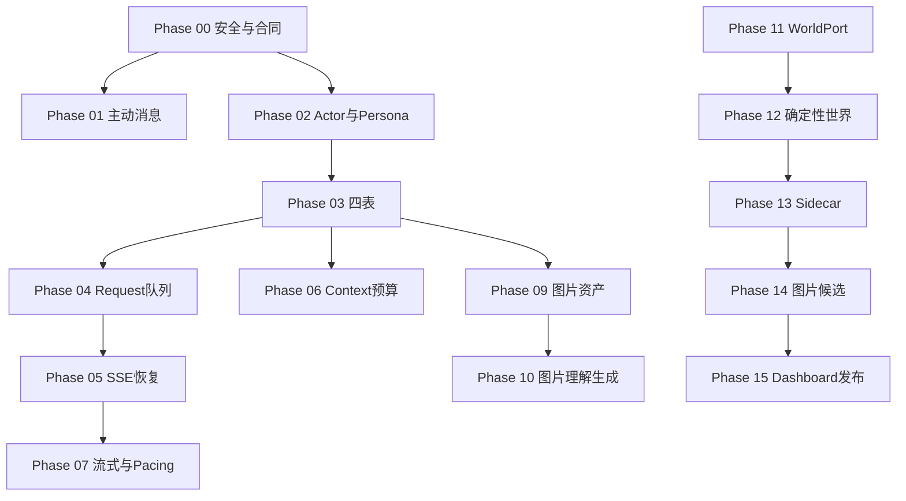

# Aerie 全面升级主控计划
> [!info] 唯一依据
> 本文档包严格执行计划，本批次只创建文档，不修改业务源码。

## 路线

## 固定默认合同
- 主动气泡与 QQ 同时尝试；通知默认开启且可关闭；QQ 离线不跨重启补发。
- 图片支持 PNG/JPEG/WEBP/GIF，20MB；只保存规范清洗图；生成图保留至主动删除；本地 Provider 优先。
- 桌面与 QQ 短期 Conversation 隔离，同 Actor 共享长期记忆；关系仅摘要、可重置、按 Persona 隔离。

## 主控导航
- [[01_六方案冲突裁决]] · [[02_术语与核心合同]] · [[03_数据所有权与迁移纪律]]
- [[04_API与事件协议]] · [[05_Feature_Flag与回滚矩阵]] · [[06_AI_Vibe_Coding批次规约]] · [[07_风险登记册]]
- [[90_全局验收清单]] · [[91_数据迁移核对]] · [[92_回滚演练]] · [[93_性能与可靠性基线]] · [[94_发布与安全检查]] · [[95_历史凭据处置方案]]

## 阶段与任务
- [[Phase 00]] · [[Task 00-baseline]]
- [[Phase 01]] · [[Task 01-baseline]]
- [[Phase 02]] · [[Task 02-baseline]]
- [[Phase 03]] · [[Task 03-baseline]]
- [[Phase 04]] · [[Task 04-baseline]]
- [[Phase 05]] · [[Task 05-baseline]]
- [[Phase 06]] · [[Task 06-baseline]]
- [[Phase 07]] · [[Task 07-baseline]]
- [[Phase 08]] · [[Task 08-baseline]]
- [[Phase 09]] · [[Task 09-baseline]]
- [[Phase 10]] · [[Task 10-baseline]]
- [[Phase 11]] · [[Task 11-baseline]]
- [[Phase 12]] · [[Task 12-baseline]]
- [[Phase 13]] · [[Task 13-baseline]]
- [[Phase 14]] · [[Task 14-baseline]]
- [[Phase 15]] · [[Task 15-baseline]]

## 任务看板
![[Aerie升级任务.base]]
