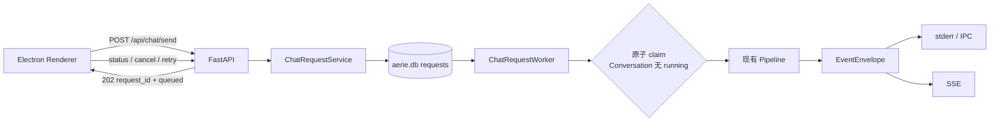
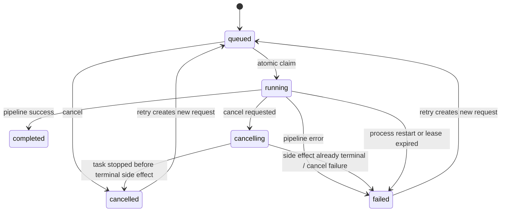

# Phase 04：持久 Request 队列、取消、重试与纯附件

> [!success] 设计、实施计划与 Task 1–6 门禁
> 用户已批准本阶段书面规范；详细 TDD 实施计划已完成自审。Phase 00–03 门禁、006 Migration、测试 Fixture、ChatRequestRepository、ConversationRepository 完成路径与 ChatRequestService 均已按 Red → Green 收口；当前仍在 Phase 04，下一小节必须从 ChatRequestWorker 目标 Red 开始。
>
> [Phase 04 持久 Request 队列实施计划](file:///E:/Agent_reply/documents/Level_up/AI_Vibe_Coding/plans/2026-07-20-Phase-04-%E6%8C%81%E4%B9%85Request%E9%98%9F%E5%88%97%E5%AE%9E%E6%96%BD%E8%AE%A1%E5%88%92.md)

> [!info] 执行边界
> 只按获批设计与 TDD 实施计划执行；当前阶段未通过验收时停止后续阶段。

## 已批准决策

- `/api/chat/send` 保持原路径：`chat_request_queue_v1=true` 时返回 `202 Accepted`、`request_id` 和 `queued`；Flag 关闭时恢复现有同步 `200` 合同。
- 采用数据库驱动的 `ChatRequestWorker`，不采用 Renderer-only 队列或通用 `AsyncTaskManager`。
- 同一 Conversation 串行；不同 Conversation 默认最多并行 `4` 路。
- queued 与 running 均支持真实后端取消，不允许仅隐藏 UI。
- 重试创建新的 `request_id`，通过 `retry_of_request_id` 关联原请求；原请求终态不覆盖。
- 重启时恢复 queued；遗留 running 或租约过期请求转 `failed/process_interrupted`，不自动重排。
- 纯附件允许空可见文本；仅在内部生成中性 `effective_content`，不得写入用户可见历史。

## 目标

建立可持久、可取消、可重试、可恢复的聊天 Request 队列：同 Conversation 严格串行、跨 Conversation 最多四路并行；统一请求状态、事件标识和 Renderer 去重；保持旧同步路径、现有 Pipeline 与 legacy poll 兼容。

## 非目标

- 不整体重写 Pipeline。
- 不实现 Token 首段流式输出、Pacing 或快速输入合并；这些属于 Phase 06。
- 不把现有 SSE 升级为可靠 Outbox、ACK 或重放协议。
- 不创建完整平行聊天 v2。
- 不修改构建产物，不删除旧表、旧消息或旧附件。
- 不让租约过期请求自动重跑，避免未知副作用重复。

## 依赖与阶段门禁

- Phase 00–03 已于 2026-07-20 重新审计通过。
- Phase 03 提供 Conversation / Turn / Message / Request 四表和稳定 ID 合同。
- 依赖 [[05_Feature_Flag与回滚矩阵]]、[[06_AI_Vibe_Coding批次规约]]、[[90_全局验收清单]]、[[91_数据迁移核对]]、[[92_回滚演练]]。
- 执行任务：[[Task 04-baseline]]。

## Phase 04 执行基线（2026-07-20）

> [!success] Phase 00–03 门禁复验通过
> - 关联门禁：`141 passed, 4 warnings in 4.64s`。
> - 完整 Python：`353 passed, 6 warnings in 10.56s`。
> - `core/migrations/__init__.py` 尚无 `006_chat_request_queue`。
> - Renderer `chat.js` 仍有 4 处 `_loading`，Phase 04 行为尚未被提前实现。
> - 本次只读取源码、运行测试并更新文档；未触碰生产数据库、构建产物或无关文件。

快速自检：已重读总计划与批次规约；当前仍在 Phase 04；尚未写生产实现；Flag 关闭旧同步路径未改；Phase 00–03 门禁 Green；下一步必须先观察 Migration Red。

## 006 Migration 批次 Evidence（2026-07-20）

> [!success] Red → Green 完成
> - 首次目标 Red：`8 failed, 1 passed in 0.39s`；失败原因是 `phase4_request_queue_migrations` 不存在且 Database 未注册 006，不是 Fixture/语法错误。
> - 最小 Green：新增固定 `006_chat_request_queue`，仅扩展 16 个可空字段和 3 个 claim/互斥/lease 索引；Database 只在 `migration_framework_v1=true` 时于 002/003→004→005 后运行 006，且不依赖 `chat_request_queue_v1`。
> - Phase 4 迁移专项：`9 passed in 0.24s`。
> - 迁移 + Phase 0/3：`40 passed in 1.82s`。
> - Phase 0/2/3 + API/Pipeline：`112 passed, 4 warnings in 4.72s`。
> - 完整 Python：`362 passed, 6 warnings in 12.47s`。
> - `py_compile`、VS Code diagnostics、`git diff --check` 均通过。
> - 固定 checksum：`2e649f6834695ca7b9250c3e2f7c110ab9c5b2c4ed2a230d1cd4fb5e0654ea05`；004/005 checksum 保持原值。
> - 自动化已证明 dry-run 零 schema 写入、二次运行幂等、部分字段/索引应用后可恢复、legacy completed 快照列保持 `NULL`、`PRAGMA quick_check=ok`。
> - 本批只使用内存/pytest 临时数据库，未读写生产库。生产数据一致性副本迁移和实际恢复仍待最终演练，不能提前关闭完整回滚门禁。

快速自检：已重读总计划；仍在 Phase 04；先观察了正确 Red；未改变 queue Flag 关闭旧同步路径；未写生产库或无关源码；已更新 Phase/Task/迁移/回滚文档；Phase 00–03 门禁仍 Green；下一小节必须先写并观察测试 Fixture 与 UTC 时钟批次 Red。

## 测试 Fixture 与 UTC 时钟批次 Evidence（2026-07-20）

> [!success] Red → Green 完成
> - 目标 Red：`2 errors in 0.07s`；两个 setup 错误分别明确指向 `fixture 'phase4_db' not found` 与 `fixture 'ready_attachment' not found`，不是导入、语法或建库错误。
> - 最小 Green：在共享测试配置中增加临时 `phase4.db` Fixture、可推进的 timezone-aware UTC 时钟、只含服务端脱敏元数据的 ready 附件，以及显式暴露 `started/release/cancel_seen` 的异步 Pipeline double。
> - 三个 Fixture 探针：`3 passed in 0.20s`。
> - Phase 0/3/4 关联回归：`43 passed in 2.03s`。
> - 完整 Python：`365 passed, 6 warnings in 14.83s`；警告均为既有 FastAPI/asyncio 弃用警告。
> - `py_compile`、四个相关文件 VS Code diagnostics、`git diff --check` 均通过；后者只有既有 LF→CRLF 工作区提示，无 whitespace error。
> - Evidence 仅记录固定 UTC `2026-07-20T00:00:00+00:00`、临时数据库文件名 `phase4.db` 与附件状态 `ready`；未记录临时绝对路径、真实文件路径或正文。
> - 本批未访问网络、QQ、真实模型或生产数据库，也未使用真实长等待。

快速自检：当前仍在 Phase 04；Fixture 只为后续 TDD 提供隔离设施，尚未实现 Repository/Service/Worker 行为；`rollback_ready` 继续为 false；下一小节必须先写并观察 Repository 状态机 Red。

## ChatRequestRepository 批次 Evidence（2026-07-20）

> [!success] Red → Green 完成
> - 目标 Red：测试收集阶段明确失败为 `ModuleNotFoundError: No module named 'core.chat_request_repository'`，不是测试语法或 Fixture 错误。
> - 最小 Green：新增 `ChatRequestRepository`，仅负责短事务持久化、claim、lease、取消、恢复和 retry，不导入 Brain、Pipeline、chat events 或 QQ。
> - Repository 专项：`10 passed in 1.01s`。
> - Phase 3/4 关联回归：`36 passed in 2.99s`。
> - 完整 Python：`374 passed, 6 warnings in 18.17s`；警告为既有 FastAPI/asyncio 弃用警告。
> - 已验证：Conversation 复用、pending Turn + queued Request 原子提交、请求插入失败全回滚、同 Conversation claim 互斥、created_at/request_id 排序、UTC lease/heartbeat、running/cancelling 恢复为 `failed/process_interrupted`、queued 保持 queued、Request/Turn 状态守恒、新 Request/Turn retry 且原请求不变、claim 后数据库连接已释放。
> - `py_compile`、相关 VS Code diagnostics、依赖边界扫描与 `git diff --check` 均通过；未写生产数据库。

快速自检：当前仍在 Phase 04；ChatRequestRepository 批次已 Green；ConversationRepository、Service、Worker、Pipeline、API、Renderer 与生产副本演练仍按后续 Task 顺序推进；`rollback_ready` 继续为 false。

## ConversationRepository 完成路径 Evidence（2026-07-20）

> [!success] Task 5 Red → Green 完成
> - 接管基线：既有专项 `16 passed`，但固定 Task 5 测试缺 3 个，且完成测试绕过状态机直接执行 queued → completed。
> - 目标 Red：补齐固定测试名并增加状态/快照/lease 守恒后为 `6 failed, 18 passed`；失败明确指向 queued/cancelling 可误完成、可信输入快照未校验以及 completed 后 lease/error_code 未清理。
> - 最小 Green：只允许预分配 Request/Turn 从 running/running 原子完成；在同一 SAVEPOINT 内校验 conversation/turn、Actor/Channel/user_id、可见输入与附件快照，以带旧状态条件的 UPDATE 完成并清理 lease/error；legacy 同步创建完整 Turn 的路径保持兼容。
> - Task 5 专项：`24 passed in 4.18s`；Phase 3 + Phase 4 migration/repository：`50 passed in 6.07s`；Phase 00–04 + API + Pipeline：`174 passed, 5 warnings in 11.84s`。
> - 完整 Python：排除唯一不可写办公目录环境用例后 `387 passed, 1 deselected, 7 warnings in 28.35s`；该用例改用工作区临时办公目录后单独 `1 passed`。
> - Electron Persona 合同 `3 passed`；`main.js`、`preload.js`、`chat.js` 语法检查通过；Python `py_compile` 与 `git diff --check` 无错误，后者仅有 LF→CRLF 提示。
> - 生产库仅以 SQLite read-only URI 审计：`quick_check=ok`、FK 违规 0、活跃 Conversation 违规 0、Request/Turn 状态错配 0、orphan Turn/Request/Message 均为 0；Conversation/Turn/Request/Message=`4/299/299/1754`，299 个 Request 全部为 completed。未写生产库。

快速自检：Task 5 已完整收口；Service、Worker、Pipeline、API、Renderer 与生产副本演练仍未完成；`rollback_ready=false`；下一小节必须先写并观察 ChatRequestService Red，不提前修改 API。

## ChatRequestService Evidence（2026-07-20）

> [!success] Task 6 Red → Green 完成
> - 目标 Red：计划固定 Service 测试首次为 `15 failed, 1 passed`，失败统一指向 `core.chat_request_service` 不存在；未先修改 API。
> - 最小 Green：新增未接线的 `ChatRequestService` 与脱敏 `RequestStatusView`；Repository 只新增所有权读取。Service 只信任后端 `desktop/local` IdentityRepository，Renderer 不能提交 Actor/Conversation/Turn ID。
> - 风险复核追加 Red：`5 failed, 18 passed`，明确复现 cancel TOCTOU、编码文件名和客户端伪造附件字段；修复后最终 Service 专项 `25 passed in 4.40s`。
> - 输入边界：空文本且无附件为 `empty_message`；纯 ready 附件保持 `input_content=""`，内部中性 `effective_content` 只写 Request 快照；附件限定现有 `name/url/state/size/type` 五字段和单层安全上传名，拒绝 converting、穿越、编码分隔符及客户端 `path/content/markdown`。
> - 所有权与错误：不存在和非所有者对 get/cancel/retry 统一 `request_not_found`；非法 retry 为 `request_state_conflict`；completed/failed/cancelled 重复 cancel 保持真实终态；Worker 缺失时非终态 cancel fail closed，不提前改写状态。
> - 竞态：Service 以 Repository 事务返回状态决定是否调用 Worker；queued 在取消间隙被 claim 时会取消真实 Task，running 在间隙完成时返回 completed 且不再误调用 Worker。
> - 关联回归：身份/Conversation/migration/Repository/Service/upload `114 passed, 5 warnings in 17.89s`；Phase 00–04 + API + Pipeline `199 passed, 5 warnings in 21.16s`。
> - 完整 Python：`411 passed, 1 deselected, 7 warnings in 32.53s`；唯一被排除的办公目录环境用例继续在工作区临时目录单独通过。
> - `ruff`、`py_compile` 与 `git diff --check` 通过。Service 尚未注入 Companion/API，旧同步 `/api/chat/send`、Pipeline、QQ 和 Renderer 行为均未改变。

快速自检：Task 6 已完整收口；Worker、Pipeline、API、Renderer 与生产副本演练仍未完成；`rollback_ready=false`；下一小节先补 Repository 成功/取消严格终态接口并观察 ChatRequestWorker Red。

## 当前代码证据

- [chat.js](file:///E:/Agent_reply/electron/src/renderer/js/chat.js#L322-L377)：全局 `_loading` 阻止连续输入，发送端同步等待 `/api/chat/send`。
- [api_server.py](file:///E:/Agent_reply/core/api_server.py#L391-L451)：聊天接口同步 `await comp.pipeline.handle(...)`，空文本直接 400。
- [conversation_repository.py](file:///E:/Agent_reply/core/conversation_repository.py)：已支持完成预分配 running Request/Turn、可信快照校验、幂等冲突保护、SAVEPOINT 回滚和 completed-only history；legacy 同步路径保持兼容。
- [chat_request_service.py](file:///E:/Agent_reply/core/chat_request_service.py)：新增且尚未接线的可信身份、纯附件、所有权、cancel/retry 与脱敏 DTO 编排层。
- [migrations/__init__.py](file:///E:/Agent_reply/core/migrations/__init__.py#L154-L163)：现有 requests 表只有基础状态、时间与 error。
- [event_contracts.py](file:///E:/Agent_reply/core/event_contracts.py#L10-L50)：已有 `event_id/request_id/conversation_id/turn_id/message_id/sequence` 信封。
- [event_stream.py](file:///E:/Agent_reply/core/event_stream.py#L30-L113)：SSE 为有界 best-effort 广播，不是可靠任务队列。
- [async_task_manager.py](file:///E:/Agent_reply/core/async_task_manager.py#L132-L420)：通用任务管理器缺少 Conversation 顺序、持久 claim/lease 和真实运行 Task 取消，不作为聊天队列实现。

## 架构



### `ChatRequestRepository`

只负责持久化和并发控制：

- 创建 queued Request 与不可变输入快照。
- 原子 claim：只能领取 queued 且其 Conversation 当前没有 running/cancelling Request 的最早请求。
- 更新 lease、heartbeat、状态、错误码和终态时间。
- 恢复 queued；将启动时遗留 running/cancelling 或租约过期请求标记为 `failed/process_interrupted`。
- 提供按 `request_id` 查询和所有权校验。
- 不调用模型、不发送事件、不操作 Renderer。

### `ChatRequestWorker`

- 默认四个执行槽，可通过配置调整。
- 每个槽循环 claim 一个可运行 Request；没有任务时退避等待。
- claim 与状态变更使用短事务；模型执行期间不持有数据库事务。
- 运行期间定时 heartbeat 续租。
- 为 running Request 保存可取消的 `asyncio.Task` 和取消令牌。
- 调用现有 `Pipeline.handle()`，不复制或简化 Pipeline。
- 只由 Companion 组合根启动和停止。

### `ChatRequestService`

供 API 使用：

- `submit()`：验证文本/附件，按 Phase 03 的确定性规则解析或创建 Conversation，同时预分配 pending Turn，创建输入快照并返回 queued Request。
- `cancel()`：执行 queued 或 running 取消，并同步终结尚未完成的预分配 Turn。
- `retry()`：仅从 failed/cancelled 创建新 Request；重试复用 Conversation，但分配新的 `request_id` 与 `turn_id`，并关联原请求。
- `get()`：返回脱敏状态，不返回内部错误堆栈或敏感输入。
- Flag 关闭时 API 完全绕过 Service/Worker，继续旧同步路径。

## 数据模型与迁移

Phase 04 从 `migration: false` 改为 `migration: true`。新增版本化迁移，不修改已发布 004/005 checksum。

### Request 与 Turn 生命周期裁决

为保持现有 `requests.turn_id NOT NULL` 外键合同，Phase 04 不把 `turn_id` 改为可空，也不新建平行 queue payload 表：

1. `submit()` 在同一短事务中确定 `conversation_id`，创建状态为 `pending` 的 Turn，再创建指向该 Turn 的 queued Request。
2. queued Request 的不可变输入快照只保存在 Request；此时不创建规范 user Message，也不写 legacy `chat_log`，避免取消前产生可见半轮次。
3. Worker claim 后沿用同一 `request_id/turn_id/conversation_id` 调用 Pipeline。
4. `ConversationRepository.persist_turn()` 演进为“完成预分配 Turn”：当 Request 已存在时更新该 Request 和 Turn，并插入 Message；仅 legacy 同步路径仍允许按原合同创建完整 Turn/Request。
5. Request、Turn 与规范 Message 的完成写入继续处于同一 SAVEPOINT；任一步失败全部回滚，不允许重复主键、孤立 Turn 或半完成 Request。
6. queued 取消、启动恢复失败或运行失败必须同步把预分配 Turn 置为对应终态；失败/取消 Turn 不进入 `recent_turn_history()` 的完成历史。
7. retry 复用原 Conversation，但必须创建新的 Request 和新的 pending Turn；原 Request/Turn 保持原终态。

现有 `requests` 表最小扩展：

| 字段 | 用途 |
|---|---|
| `actor_id` | Request 所有者 |
| `channel` | 短期会话 Channel |
| `channel_account_id` | 同 Channel 账号边界 |
| `user_id` | legacy 兼容寻址 |
| `input_content` | 用户原始可见文本，可为空 |
| `effective_content` | Pipeline 内部输入；纯附件使用中性指令 |
| `attachments` | 提交时附件 JSON 快照 |
| `reply_to_id` | 引用消息兼容字段 |
| `retry_of_request_id` | 新重试请求关联原请求 |
| `cancel_requested_at` | 取消请求时间 |
| `cancelled_at` | 确认取消终态时间 |
| `started_at` | Worker 开始处理时间 |
| `lease_owner` | claim 的 Worker 实例 ID |
| `lease_expires_at` | 当前租约到期时间 |
| `last_heartbeat_at` | 最近续租时间 |
| `error_code` | 稳定机器可读错误码 |

迁移要求：backup、dry-run、固定 checksum、重复运行幂等、旧行兼容、`PRAGMA quick_check`、失败状态可审计。现有历史 completed Request 不反推或猜测输入快照。为 claim 与互斥增加必要索引，至少覆盖 `status + created_at`、`conversation_id + status` 与 `lease_expires_at`；不修改 004/005 定义。

Conversation 解析唯一采用 Phase 03 的确定性键：`actor_id + channel + channel_account_id + legacy user_id`。不得由 Renderer 自行指定任意 Conversation，也不得在缺少规范身份来源时猜测 Actor/Channel。

## 状态机



不变量：

- `cancelled` 不能再转 `completed`。
- 原 Request 不原地重试。
- 同一 Conversation 不得同时有两个 running/cancelling Request。
- lease 过期只转失败，不自动重排。
- completed/failed/cancelled 为 Request 终态。
- Request 状态与其预分配 Turn 状态必须守恒：queued 对应 pending，running/cancelling 对应 running，completed/failed/cancelled 对应同名 Turn 终态。
- 只有 completed Turn 可进入规范近期历史；pending/running/failed/cancelled Turn 不得污染模型上下文。

## API 合同

### `POST /api/chat/send`

Flag 开启：

```json
{
  "request_id": "req_...",
  "conversation_id": "conv_...",
  "status": "queued"
}
```

- HTTP `202 Accepted`。
- 文本为空时必须至少有一个合法附件。
- 不同步返回 assistant reply。

Flag 关闭：

- 保持当前同步 HTTP `200`、`reply/user_msg_id/ai_msg_id/persisted` 合同。

### `GET /api/chat/requests/{request_id}`

返回状态、稳定错误码、时间戳、可重试/可取消能力和终态消息 ID；不返回内部堆栈。

### `POST /api/chat/requests/{request_id}/cancel`

- queued：直接终止为 cancelled。
- running：转 cancelling 并请求 Task 取消。
- 已终态：幂等返回当前状态，不伪造取消成功。

### `POST /api/chat/requests/{request_id}/retry`

- 只允许 failed/cancelled。
- 返回 HTTP `202` 和新的 `request_id`。
- 新 Request 的 `retry_of_request_id` 指向原 Request。

## 取消与副作用边界

Pipeline 增量接收取消令牌，在以下边界检查：

1. 模型调用前后。
2. legacy 用户/assistant 持久化前。
3. 规范 Turn 镜像前。
4. chat event 发射前。
5. QQ 或其他外部投递前。

若某个不可逆终态副作用已完成，不把 Request 伪装为 cancelled；记录稳定错误码并返回真实终态。取消不得产生第二次模型调用、重复 Message、重复事件或重复 QQ 投递。

## 纯附件合同

- `input_content=""` 保持用户真实输入。
- `effective_content` 使用内部中性指令，仅供 Pipeline/Context 使用。
- 用户气泡、legacy `chat_log` 与规范 Message 不写入内部中性指令。
- 附件 Markdown/元数据继续复用现有安全提取链路。
- 无文本且无附件继续返回 400。

## 事件与 Renderer 去重

复用 `EventEnvelope`，不创建第二套协议。Request 生命周期事件至少包括：

- `chat_request_queued`
- `chat_request_running`
- `chat_request_cancelling`
- `chat_request_cancelled`
- `chat_request_failed`
- `chat_request_completed`

合同：

- `event_id` 为跨 IPC/SSE 的主去重键。
- `request_id + sequence` 用于单 Request 排序和异常检测。
- 消息事件携带 `message_id/turn_id/conversation_id/response_group_id`。
- Renderer 以服务端 Request 状态为准，不再使用全局 `_loading` 宣告请求完成。
- legacy poll 继续使用 chat_log id 去重；Phase 04 只逐步降低依赖，不移除 poll。
- SSE 断线后通过 Request 状态查询恢复，不承诺事件重放。

## Renderer 行为

- 移除全局 `_loading` 发送阻塞，改为 `Map<request_id, RequestViewState>`。
- 每次发送立即乐观渲染独立用户气泡，并绑定临时 client id；收到 queued 响应后绑定真实 request_id。
- 同时允许继续输入和提交。
- 每个请求单独显示 queued/running/cancelling/failed/cancelled 状态与取消/重试操作。
- IPC、SSE、poll 进入同一去重入口；先按 `event_id`，消息兼容路径再按 message id。
- 页面恢复时查询未终态 Request，不把本地状态当权威真源。

## 错误处理与恢复

- Worker 启动时先完成恢复审计，再开始 claim。
- queued 保持可领取；遗留 running/cancelling 与过期 lease 转 `failed/process_interrupted`。
- 数据库暂时不可用时不调用 Pipeline，Worker 退避并记录结构化错误。
- Pipeline 失败写 `failed` 与稳定 `error_code`；用户可显式重试。
- 事件发送失败不反转已提交数据库终态；Renderer 可查询状态恢复。
- Flag 关闭时 Worker 停止消费，但不删除 queued Request 或新字段。

## TDD 实施顺序

1. Migration Red：缺少 Phase 04 字段、checksum/幂等/旧库兼容失败。
2. Repository Red：原子 claim、Conversation 串行、四路并行、lease/heartbeat/过期失败。
3. Service Red：202 提交、纯附件、所有权、取消、重试新 ID。
4. Worker Red：真实 Task 取消、状态不误转 completed、启动恢复。
5. Pipeline Red：取消边界阻止持久化、事件和 QQ 重复副作用。
6. API Red：Flag 开启异步 202，Flag 关闭同步 200 原合同。
7. Renderer Red：连续三条输入、请求级状态、取消/重试、统一去重。
8. 集成与 Electron smoke：IPC/SSE/poll 不重复，重启恢复符合合同。
9. 生产数据副本迁移、回滚演练、完整回归和 Evidence 收口。

## 验收

- [ ] 连续三条输入全部持久 queued，不丢失、不被全局 loading 阻止。
- [ ] 同 Conversation 严格串行；不同 Conversation 默认最多四路并行。
- [ ] queued/running 取消均保持真实终态，cancelled 不误记 completed。
- [ ] retry 创建新 ID 并关联原请求，不产生重复模型、Message、事件或 QQ 副作用。
- [ ] lease 过期与进程重启把遗留 running 标为 failed，不自动重排。
- [ ] 纯附件可处理，用户历史不出现内部占位文本。
- [ ] `event_id` 去重、`request_id + sequence` 有序，IPC/SSE/poll 不重复渲染。
- [ ] Feature Flag 关闭恢复旧同步路径且不删除新数据。
- [ ] 迁移 backup/dry-run/checksum/幂等/恢复/quick_check 通过。
- [ ] 不产生历史串线、敏感值泄漏或无所有权访问。

## 回滚

1. 停止 `ChatRequestWorker` claim 新请求。
2. 关闭 `chat_request_queue_v1`。
3. `/api/chat/send` 恢复旧同步 `200` 路径。
4. 保留 requests 新列、queued/failed 记录、规范表、legacy 数据和附件。
5. 已 queued Request 不在 Flag 关闭态消费；重新开启后按恢复规则处理。
6. 若迁移异常，使用一致性备份恢复并记录恢复耗时与数据损失。

## 指标与脱敏

记录：提交成功率、排队时长、运行时长、取消时延、重试次数、lease 过期数、重复事件数、Conversation 并发冲突数、恢复耗时和数据损失。

禁止记录：消息正文、附件 Markdown、个人账号、凭据、完整路径、模型密钥和内部堆栈。

## 计划文件范围

- 新增：`core/chat_request_repository.py`、`core/chat_request_worker.py`、`core/chat_request_service.py`、独立 Phase 04 测试文件。
- 演进：`core/migrations/__init__.py`、`core/companion.py`、`core/api_server.py`、`core/pipeline.py`、`electron/src/renderer/js/chat.js`、相关配置和阶段文档。
- 不编辑：`electron/dist-*`、生产数据库内容、无关审计日志或历史备份。

## Evidence

- [实施计划](file:///E:/Agent_reply/documents/Level_up/实施计划.md)
- [api_server.py](file:///E:/Agent_reply/core/api_server.py#L391-L451)
- [chat.js](file:///E:/Agent_reply/electron/src/renderer/js/chat.js#L322-L377)
- [conversation_repository.py](file:///E:/Agent_reply/core/conversation_repository.py)
- [event_contracts.py](file:///E:/Agent_reply/core/event_contracts.py)
- [[Task 04-baseline]] · [[90_全局验收清单]] · [[91_数据迁移核对]] · [[92_回滚演练]]
