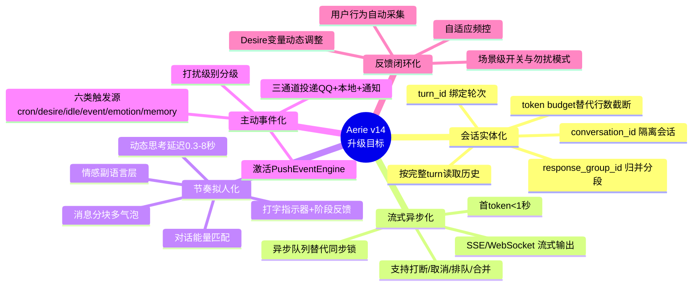
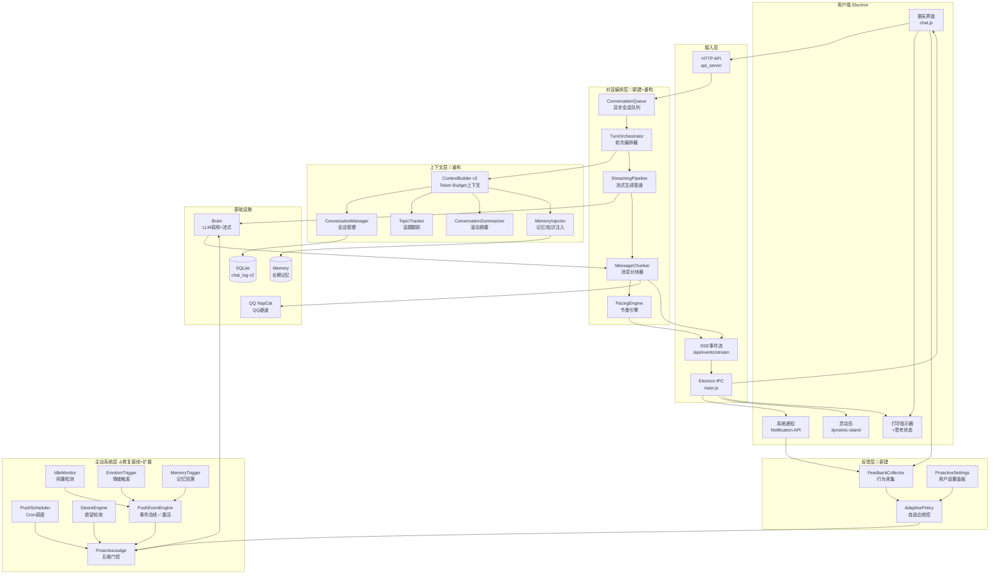
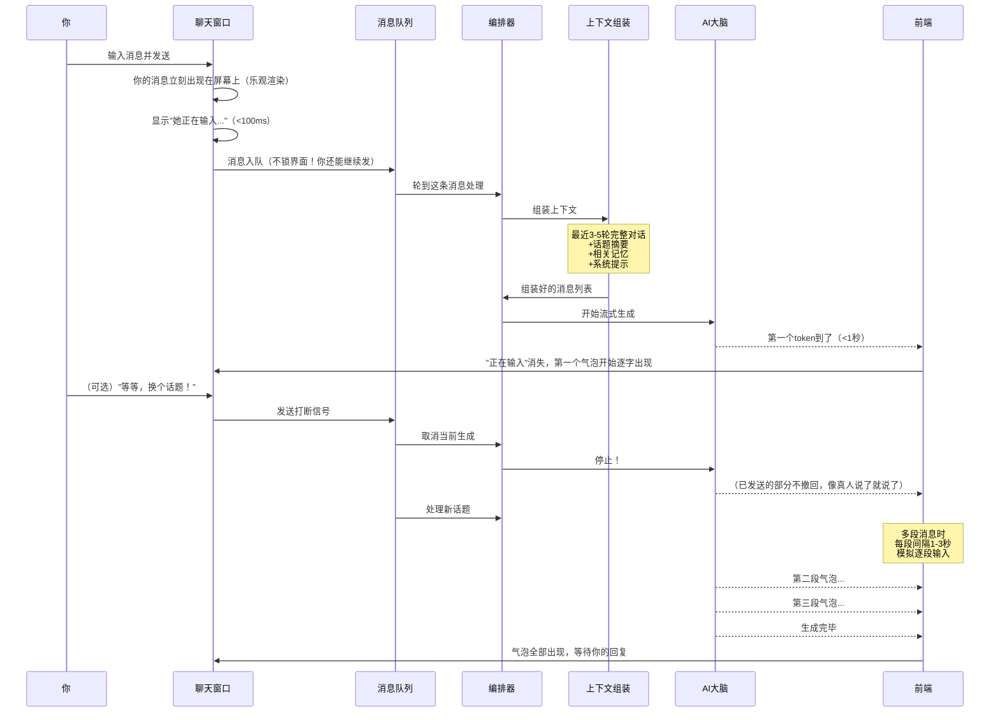
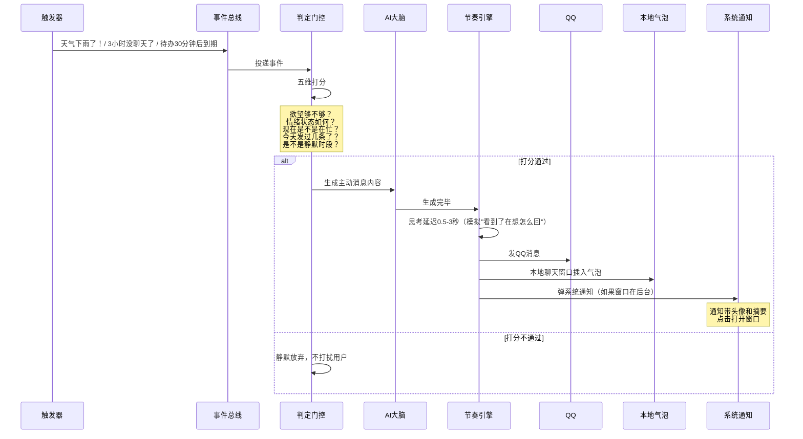
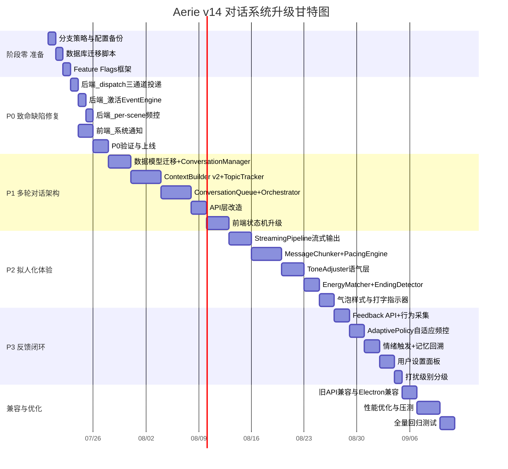
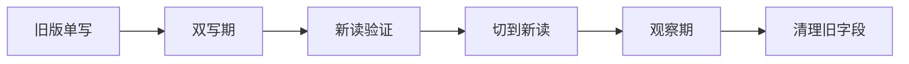
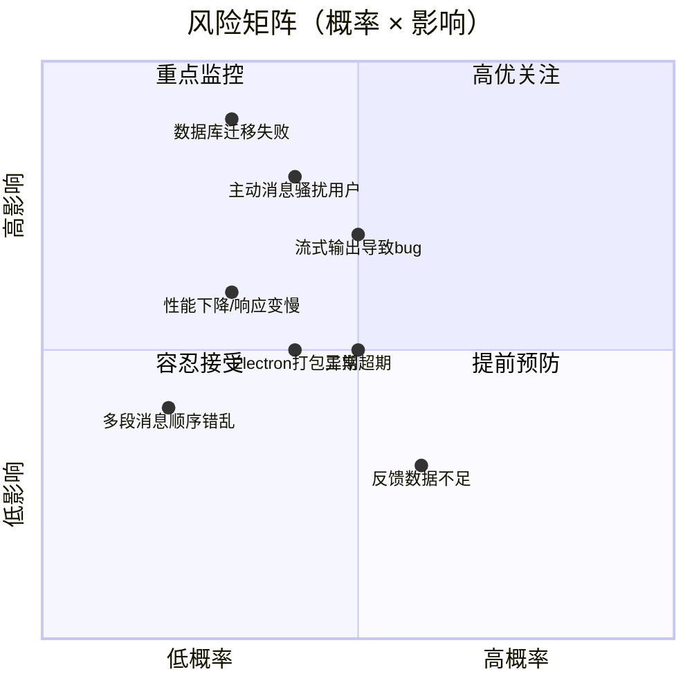
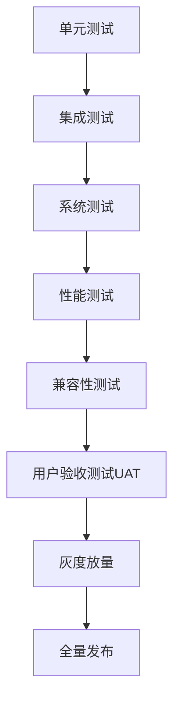

# Aerie 对话系统全面升级方案 v14.0

> [!abstract] 通俗版一句话
> 这次升级要把 Aerie 从一个"你问一句她答一句、答完就忘、从不主动找你"的机械问答机器人，升级成一个**能记住你们聊过什么、会像真人一样连续发好几条消息、有思考停顿、会在合适的时候主动关心你**的真正陪伴者。

> [!abstract] 专业版一句话
> 本方案以**会话实体化、流式异步化、节奏拟人化、主动事件化、反馈闭环化**为五大核心设计原则，对对话上下文引擎、消息投递管道、主动推送系统、前端交互层进行系统性重构，在最大化复用现有基础设施（PushScheduler、DesireEngine、EventBus、双通道事件桥）的前提下，用 6-8 周时间交付具备生产可用性的自然对话系统。

---

## 一、升级目标与预期收益

### 1.1 为什么要升级（用大白话说）

想象你在微信上跟一个朋友聊天：

- 你说一句话，她不会让你等半分钟才开始"输入中"
- 她可能连续发两条三条消息，想到什么说什么
- 她会记得你上周说过你妈妈生病了，今天主动问"阿姨身体好点没"
- 你还没打完字她不会抢话，但你突然说"等等换个话题"她能立刻停下来
- 她不会每次都写一篇小作文，有时候就回个"好呀~"或者一个表情
- 她不会每次聊完都追问"还有什么可以帮您的吗"——聊完就聊完了，自然结束
- 下午三点你在忙的时候她不会打扰你，晚上闲了她可能发个"今天好累呀"

现在的 Aerie 是这样的：

- 你发一条消息，界面锁住，她必须把整条回复想完写完你才能发下一条
- 她每次都回一大段，塞在一个气泡里
- 她经常"忘记"你们刚聊过什么，因为回复被拆成好几段后把你的问题挤出了上下文窗口
- 她从不主动找你（或者发了QQ但你本地窗口看不到）
- 你没法在她说话的时候打断她
- 她没有"在输入"的感觉，要么沉默要么一下子全出来

**这次升级就是要解决上面所有问题。**

### 1.2 五大核心目标（专业版）



### 1.3 预期收益（量化指标）

| 维度 | 当前状态 | 升级目标 | 提升幅度 |
|---|---|---|---|
| **多轮理解** | 经常忘记上一轮，AI近似只看当前一句 | 连续10轮以上指代不丢失 | 质的飞跃 |
| **首字响应时间** | 同步等待，可能数秒无反馈 | 打字指示器<100ms，首token<1s | 感知速度提升5-10倍 |
| **对话轮次深度** | 平均2-3轮即结束 | 平均8-15轮自然对话 | 提升3-5倍 |
| **打断响应** | 完全不支持，必须等说完 | 打断响应<500ms | 从0到1 |
| **主动消息有效性** | 只发QQ不通知本地，触发源单一 | 三通道投递+六类触发源+自适应频控 | 覆盖度从20%到100% |
| **拟人自然度（盲测）** | 用户100%能识别是AI | 用户无法稳定分辨超过50% | 达到陪伴产品及格线 |
| **次日回访率** | 基准值 | 提升30%+ | 核心留存指标 |
| **系统通知到达率** | 0%（从未弹过） | >95%（开启通知的用户） | 从0到1 |
| **数据库上下文一致性** | 分段写库导致历史污染 | 按turn原子写入，模型上下文与展示分离 | 根治历史失忆bug |

### 1.4 通俗版预期效果

升级完你会感受到：

1. **"她终于记得我们刚才在聊什么了"** —— 不会再出现刚聊完A她就像没听过一样
2. **"她说话像真人了"** —— 有停顿、有短消息、有连发、有表情，不是每次都写作文
3. **"她会找我聊天了"** —— 早上说早安、下雨提醒带伞、好久没聊会问你在干嘛
4. **"她能听懂我打断她"** —— 你说"等等换个话题"她立刻停下
5. **"她不烦我"** —— 你忙的时候她不打扰，你关了通知她就安静
6. **"她知道什么时候该停"** —— 聊完了就自然结束，不会没完没了追问

---

## 二、系统现状全景诊断

### 2.1 当前架构图（有哪些模块是好的，哪些是断的）

```mermaid
flowchart TD
    subgraph 已有且工作正常 ✅
        PS[PushScheduler<br/>Cron+频控+静默]
        DE[DesireEngine<br/>5变量轮询]
        PJ[ProactiveJudge<br/>五维打分]
        CE[chat_events<br/>stderr+SSE双通道]
        ES[event_stream<br/>SSE订阅队列]
        QQ[QQ NapCat通道]
        YAML[proactive.yaml<br/>12场景配置]
        DI[灵动岛UI<br/>已写好proactive_message处理]
        BR[Brain<br/>LLM调用封装]
        DB[database<br/>chat_log持久化]
    end

    subgraph 已有但未激活/接线断了 ⚠️
        PEE[PushEventEngine<br/>EventBus+21种事件<br/>❌从未start]
        DP[_dispatch_push<br/>只发QQ不emit UI<br/>❌本地看不到]
        NT[系统通知<br/>❌main.js从未弹]
        CB[ContextBuilder<br/>memory/knowledge未注入]
        EM[emotion_engine<br/>阈值突破未连触发]
    end

    subgraph 需要新建 🔴
        CHUNK[消息分块器<br/>MessageChunker]
        PACE[节奏引擎<br/>PacingEngine]
        TOPIC[话题跟踪器<br/>TopicTracker]
        ASYNC[异步对话队列<br/>ConversationQueue]
        STREAM[流式输出管道<br/>SSE token流]
        FEED[反馈闭环<br/>FeedbackAPI+AdaptivePolicy]
        CONV[会话数据模型<br/>conversation_id+turn_id]
        ENDING[对话收尾检测器]
        TONE[语气调节层<br/>副语言后处理]
    end

    PS --> PJ
    DE --> PJ
    PEE -.->|未绑定| PS
    PJ --> DP
    DP --> QQ
    DP -.->|❌| CE
    CE --> DI
    DI -.->|❌从未触发| NT
    CB -.->|memory未注入| BR
```

### 2.2 七个核心问题清单

| # | 问题 | 通俗解释 | 影响等级 | 涉及模块 |
|---|---|---|---|---|
| 1 | **全局发送锁** | 你发一条消息后整个界面锁住，她答不完你不能说下一句 | 🔴 极高 | chat.js, api_server, pipeline |
| 2 | **按消息行截断历史** | 她的回复被拆成好几条存起来，把你的问题挤出了上下文窗口，导致她"失忆" | 🔴 极高 | pipeline, context_builder, database |
| 3 | **PushEventEngine 死代码** | 事件引擎写好了但从未启动，所有"天气变了""待办到期"这类触发都不工作 | 🔴 极高 | companion, push_event_engine |
| 4 | **QQ推送不通知本地** | 她主动发了QQ消息，但你本地聊天窗口看不到气泡，也不弹通知 | 🔴 极高 | companion, chat_events, main.js |
| 5 | **没有打字感和节奏** | 要么沉默半天没反应，要么一下子全出来，没有真人"在输入"的感觉 | 🟠 高 | chat.js, 前端渲染 |
| 6 | **长文单气泡无分段** | 每次回复一大段塞一个气泡，不像真人会连续发好几条短消息 | 🟠 高 | splitter, 前端渲染 |
| 7 | **用户反馈不闭环** | 你关了通知、不回复某类消息，系统不会学习调整频率 | 🟡 中 | 前端API, push_scheduler |

### 2.3 哪些代码可以直接复用（不重写，只接线）

> [!success] 好消息：60%的基础设施已经写好了
> 不需要引入 APScheduler、Celery、Redis 这些重武器，也不需要大换血。以下模块**直接可用**，只需修复接线问题：

| 模块 | 文件 | 复用方式 |
|---|---|---|
| Cron定时调度 | `core/push_scheduler.py` | ✅ 直接保留，加 per-scene 频控即可 |
| 欲望引擎 | `core/desire_engine.py` | ✅ 直接保留，确认变量配置配齐 |
| 五维打分门控 | `core/proactive_judge.py` | ✅ 直接保留，可微调权重 |
| 事件桥接双通道 | `core/chat_events.py` + `core/event_stream.py` | ✅ 直接保留，扩展事件类型 |
| QQ通道 | `communication/qq_client.py` | ✅ 直接保留，_dispatch_push里加emit |
| 灵动岛通知UI | `electron/src/renderer/js/dynamic-island.js` | ✅ 已写好proactive_message处理，后端从未发过 |
| LLM调用封装 | `core/brain.py` | ✅ 直接保留，扩展流式接口 |
| 数据库层 | `core/database.py` | ✅ 迁移保留，加字段做双写兼容 |
| 语义拆分器 | `communication/splitter.py` | ⚠️ 拆分逻辑复用，但增加"模型上下文合并"反向逻辑 |
| 人设配置 | `config/persona.yaml`, `data/personas/` | ✅ 直接保留，统一system_prompt契约 |

---

## 三、目标架构设计

### 3.1 升级后系统全景图



### 3.2 数据流：用户发消息后发生什么（通俗版）



### 3.3 数据流：Agent主动找你时发生什么



---

## 四、分阶段实施步骤

> [!tip] 核心原则：小步快跑，每阶段可独立交付、可独立回滚
> 不要大爆炸式上线。每个阶段结束时系统都处于可用状态，P0完成就能解决最痛的问题。

### 4.1 阶段零：前期准备（3天）

| 任务 | 具体内容 | 产出 | 负责人 |
|---|---|---|---|
| **代码分支策略** | 从main切出 `feature/v14-dialogue` 分支，每个子模块独立feature分支 | 分支规范文档 | 后端 |
| **数据库迁移方案** | 设计chat_log v2字段，写迁移脚本，采用双写策略 | migration脚本 | 后端 |
| **配置文件备份** | 备份 `config/proactive.yaml`、`config/settings.yaml`、`data/personas/` | 备份包 | 运维 |
| **现有测试基线** | 跑通所有现有tests，记录基线结果，确保新改动不破坏已有功能 | 测试基线报告 | QA |
| **功能开关框架** | 实现简单的feature flags系统，所有新功能默认关闭，可通过配置或API开启 | feature_flags.py | 后端 |
| **回归测试集** | 准备20条核心对话场景作为回归测试集 | e2e测试脚本 | QA |

**feature flags设计：**

```python
FEATURE_FLAGS = {
    "v14_conversation_model": False,    # 新会话模型
    "v14_streaming": False,            # 流式输出
    "v14_message_chunker": False,      # 消息分块
    "v14_pacing_engine": False,        # 节奏引擎
    "v14_proactive_fix": False,        # 主动消息修复
    "v14_event_engine": False,         # 事件引擎激活
    "v14_feedback_loop": False,        # 反馈闭环
}
```

这样每个阶段上线时，可以先合入代码但默认关闭，验证后再通过配置打开。

### 4.2 阶段一：P0 致命缺陷修复（5-7天）

**目标：解决"她不主动找你""你说了她像没听见"这两个最痛的问题。**

> [!warning] 为什么P0先修主动消息而不是对话架构？
> 因为主动消息的修复**改动最小、见效最快、风险最低**——主要是"接线"而不是"重写"。而多轮对话架构改动较大，放在P1做更稳妥。P0完成后，你每天早上能收到早安、下雨能收到提醒、QQ和本地都能看到消息。

#### 4.2.1 后端修复（3天）

- [ ] **修复1：_dispatch_push 三通道投递**（Companion）
  - 修改 `core/companion.py` 的 `_dispatch_push()` 方法
  - QQ发送成功后，emit `assistant` 事件到chat_events（本地气泡）
  - emit `proactive_message` 事件到chat_events（灵动岛+通知）
  - 添加 `source: "proactive"` 标记区分主动消息和回复消息
  - 代码量：约30行

- [ ] **修复2：激活 PushEventEngine**（Companion）
  - `companion.start()` 中获取 event_engine 单例
  - 调用 `bind_scheduler()` 和 `start()`
  - 实现 `_bind_event_sources()`：在用户发消息、QQ上线、天气变化、待办到期等节点publish事件
  - 代码量：约50行

- [ ] **修复3：per-scene 频控**（PushPolicy）
  - 在 `PushPolicy` 中增加 `scene_last_sent: dict[str, float]`
  - `record_push()` 记录每个场景的最后发送时间
  - `can_send()` 检查同一场景同一天不重复发送
  - 代码量：约20行

- [ ] **修复4：修复 proactive.yaml 重复 idle_care**
  - 删除第二处重复定义，保留带 `custom_dispatcher` 的版本
  - 验证所有12个场景配置正确

#### 4.2.2 前端修复（2天）

- [ ] **修复5：Electron 系统通知**（main.js）
  - 在 `handleSseEvent` 或 `handleStderr` 中收到 `proactive_message` 时调用 `new Notification()`
  - 通知点击事件：聚焦窗口+发送 `proactive_clicked` IPC
  - 处理窗口已经在前台时不弹通知的逻辑
  - 代码量：约40行

- [ ] **修复6：chat.js 主动消息渲染**
  - 收到 `source: "proactive"` 的assistant消息时，气泡左侧加小标记（如"主动"标签或小星标）
  - 确保主动消息正确插入消息流而不是等待请求响应

#### 4.2.3 验证与上线（2天）

- [ ] 手动验证所有12个cron场景（可临时改cron时间触发）
- [ ] 验证QQ+本地气泡+系统通知三通道同时到达
- [ ] 验证同一天早安不重复发
- [ ] 验证静默时段不发消息
- [ ] 打开feature flag `v14_proactive_fix`，小范围测试1天
- [ ] 全量打开

**P0完成标志：** 你能收到早安晚安天气提醒，QQ和本地都能看到，窗口最小化时弹通知。

### 4.3 阶段二：P1 多轮对话架构重构（10-14天）

**目标：解决"她失忆""她不让你插话"的问题。这是工作量最大的核心阶段。**

#### 4.3.1 数据模型迁移（3天）

- [ ] **任务1：chat_log 表迁移**
  - 新增字段：`conversation_id`、`turn_id`、`response_group_id`、`parent_message_id`、`status`、`sequence`、`token_count`、`metadata`
  - 写迁移脚本：为旧数据填充默认值（旧消息归入同一个default conversation）
  - **双写策略**：迁移期间同时写新旧字段，验证一致后再切读
  - 回滚方案：保留旧字段写入逻辑，开关控制

- [ ] **任务2：ConversationManager**
  - 新建 `core/conversation_manager.py`
  - 负责创建/查询/归档会话
  - 生成 conversation_id、turn_id
  - 按turn查询历史（替代原来的按行查询）
  - 维护会话状态（active/archived）

#### 4.3.2 上下文引擎重构（4天）

- [ ] **任务3：ContextBuilder v2**
  - 新建 `core/context_builder_v2.py`（不直接改旧文件，通过开关切换）
  - 输入：最近N个完整turn + 会话摘要 + 记忆检索 + 知识检索 + 当前消息
  - 实现token budget计算：可用上下文 = 模型窗口 - 预留输出 - 工具预留 - 安全余量
  - 从最新完整turn向前装填，禁止从assistant分段中间截断
  - 修复窗口开头孤立assistant/tool消息的边界问题
  - 真正注入memory和knowledge检索结果
  - 模型调用前合并同response_group_id的assistant分段为单条消息

- [ ] **任务4：TopicTracker**
  - 新建 `core/topic_tracker.py`
  - 话题栈管理，最多3个活跃话题
  - 检测话题切换（关键词、语义相似度、过渡词）
  - 旧话题自动摘要归档
  - 回指旧话题时自动从栈中提升

#### 4.3.3 异步对话队列（4天）

- [ ] **任务5：ConversationQueue + TurnOrchestrator**
  - 新建 `core/conversation_queue.py`
  - 每个conversation_id有独立asyncio.Queue
  - 支持三种操作：排队（默认）、合并（尚未开始推理时）、打断重算（取消当前任务）
  - TurnOrchestrator协调单轮对话的完整生命周期

- [ ] **任务6：API层改造**
  - `/api/chat/send` 改为立即返回 `request_id`（不再同步等待）
  - 新增 `POST /api/requests/{request_id}/cancel`
  - 新增 `GET /api/conversations/{id}/events`（SSE流式端点）
  - 旧API保留做兼容，通过开关切换

#### 4.3.4 前端状态机升级（3天）

- [ ] **任务7：前端从 _loading 升级到 RequestStateManager**
  - 替换全局 `_loading: boolean` 为按request_id管理的状态机
  - 状态：idle → queued → waiting → typing → streaming → completed / interrupted / failed
  - 乐观渲染用户消息
  - 支持"停止生成"按钮
  - 生成中继续输入自动排队
  - 多消息队列视觉指示

**P1完成标志：** 连续聊10轮以上她还记得第一轮的内容；她说话的时候你可以打断说"换个话题"；你可以连续发好几条消息不用等她回完。

### 4.4 阶段三：P2 拟人化体验升级（10-14天）

**目标：让她说话像真人。**

#### 4.4.1 流式输出管道（3天）

- [ ] **任务1：StreamingPipeline**
  - 新建 `core/streaming_pipeline.py`
  - 支持SSE token流式推送
  - 首token延迟目标<1秒
  - 每个token/小块推送到event_stream
  - 处理工具调用状态（"正在搜索资料...""正在调用工具..."）

#### 4.4.2 消息分块与节奏引擎（4天）

- [ ] **任务2：MessageChunker**
  - 新建 `core/message_chunker.py`
  - 按语义单元（段落、列表、逻辑连接词）切分LLM输出
  - 每段1-3句、80-150字
  - 代码块/表格/引用保持完整不拆分
  - 情感类回复将共情句作为独立首段

- [ ] **任务3：PacingEngine**
  - 新建 `core/pacing_engine.py`
  - 动态打字延迟：ack 0.3s / normal 1.2s / complex 2.5s / emotional 4s
  - 情感强度修正、长度修正
  - 气泡间隔1-4秒动态计算
  - 主动消息的"犹豫"模拟（打字指示器出现→消失→再出现）

- [ ] **任务4：打字指示器与暂态反馈**
  - 前端实现三点跳动动画
  - 阶段状态文字："思考中...""正在组织语言...""查找资料中..."
  - 15秒超时提示"好像有点慢，再等等..."
  - 30秒超时显示重试按钮
  - 多段消息之间短暂显示"正在输入..."

#### 4.4.3 语气调节层（3天）

- [ ] **任务5：ToneAdjuster**
  - 新建 `core/tone_adjuster.py`
  - 短回复加语气词/表情，避免"好""知道了"的冷淡感
  - 情感场景首段共情、工作场景减少emoji
  - 可通过人设配置开关和强度调节
  - 避免过度使用（防油腻）

#### 4.4.4 对话能量匹配与收尾检测（2天）

- [ ] **任务6：EnergyMatcher + EndingDetector**
  - 根据用户消息长度/情感/正式度匹配回复风格
  - 识别对话自然结束点（结束语、连续极短确认、长时间沉默）
  - 自然收尾而非机械追问

#### 4.4.5 前端气泡体验优化（2天）

- [ ] **任务7：气泡样式升级**
  - 同一角色2分钟内连续消息合并头像和时间戳
  - 气泡最大宽度70%
  - 多段消息堆叠视觉效果
  - 主动消息特殊标记（不干扰主视觉）

**P2完成标志：** 盲测中用户无法稳定分辨哪些消息是AI发的节奏；打字感自然；不再每次都是一大段。

### 4.5 阶段四：P3 反馈闭环与高级功能（7-10天）

**目标：让系统越用越懂你。**

- [ ] **任务1：反馈API与行为采集**
  - `POST /api/proactive/feedback` 接口
  - 自动采集：已读、回复、关闭通知、稍后提醒、关闭场景
  - 前端自动上报行为事件

- [ ] **任务2：AdaptivePolicy**
  - 基于反馈数据计算各场景回复率
  - 回复率<20%的场景自动24h冷却
  - 回复率<40%的场景6h冷却
  - DesireEngine变量根据反馈动态调整

- [ ] **任务3：情绪触发连通**
  - emotion_engine阈值突破时publish EMOTION_SPIKE事件
  - anxiety→安慰，tenderness→关心

- [ ] **任务4：记忆回溯触发器**
  - MemoryTrigger模块，每天合适时段检索记忆
  - LLM自然度判定
  - 极度克制：每天最多1次

- [ ] **任务5：用户设置面板**
  - 主动消息总开关
  - 各场景独立开关
  - 每日上限滑块（1-10）
  - 静默时段自定义
  - 勿扰模式（1h/3h/到明天）
  - AI回复速度调节（慢/正常/快）
  - "想她了"测试按钮

- [ ] **任务6：打扰级别分级**
  - 静默（只插气泡）/ 通知（弹通知）/ 紧急（强提醒）
  - 按场景分配默认级别，用户可覆盖

**P3完成标志：** 系统能根据你的反应自动调整；设置面板完整可用；越用越贴合你的习惯。

### 4.6 阶段五：兼容性处理与性能优化（5-7天）

- [ ] **任务1：旧API兼容层**
  - 保留旧 `/api/chat/send` 同步接口作为fallback
  - 旧版chat.js可继续工作（功能降级但不崩溃）
  - 数据库旧数据完整可读

- [ ] **任务2：Electron版本兼容**
  - 验证Electron主进程SSE重连逻辑
  - 验证Windows通知在Win10/Win11都正常工作
  - 验证打包后资源路径正确

- [ ] **任务3：QQ通道兼容**
  - 确保NapCat断连重连时主动消息队列不丢失
  - QQ离线时主动消息正确暂停

- [ ] **任务4：性能优化**（详见第七章）

### 4.7 实施路线总览（甘特图）



**总工期估算：6-8周（约30-40个工作日）**

---

## 五、关键技术难点及解决方案

### 难点1：数据库迁移不丢数据、不中断服务

**问题：** chat_log表要加新字段（conversation_id、turn_id等），但不能把现有聊天记录搞丢，也不能停机迁移。

**解决方案：**



1. **第一阶段**：代码先写入新字段（填充默认值），同时保持旧字段写入，读还是读旧逻辑
2. **第二阶段**：运行迁移脚本backfill旧数据的新字段
3. **第三阶段**：通过feature flag切到新读逻辑，但保留双写
4. **第四阶段**：观察3-5天无异常后，切为只读新字段
5. **回滚方案**：任何阶段出问题，开关切回旧读逻辑即可，双写保证数据完整

### 难点2：流式输出与语义分段的冲突

**问题：** token是一个个来的，但我们要按语义单元（完整句子/段落）切分成气泡。如果等一个段落完整了再显示，首段延迟太高；如果不等，可能出现半句话就发出去然后修改的闪烁。

**解决方案：**

- 采用**"软分段+硬分段"双策略**
- **软分段**（流式中）：遇到句号/问号/感叹号/换行时，先作为一个"候选段边界"，等后续2-3个token确认不是句子中间的标点（如"3.14""e.g."）再确认分段
- **硬分段**（确定后）：候选段确认后立即发送，不再修改
- Markdown特殊处理：代码块等配对标记必须等闭合后才作为完整段
- 利用流式"已确定区间"概念：已发送的内容永不修改，避免闪烁

### 难点3：打断后上下文一致性

**问题：** 用户打断AI生成时，AI已经说了一部分话，这部分是"已说出口"的。打断后重新响应时，如何处理这部分已说的内容？是假装没说过，还是承认说过？

**解决方案：**

```mermaid
flowchart TD
    INT[用户打断] --> CHECK{已输出多少?}
    CHECK -->|<10字/刚开始| ABORT[废弃已输出<br/>不写入历史]
    CHECK -->|有实质内容| KEEP[已发送部分写入assistant记录<br/>标记为interrupted]
    KEEP --> CONTEXT[上下文包含: 用户新消息+AI已说片段]
    CONTEXT --> RESPOND[新回复可以自然承接: "好的，你说的对..."]
```

- 真人说话被打断时，说出口的话就是说了，不会"收回"
- 已推送到前端的内容不撤回（技术上也很难撤回）
- 将已输出内容作为一条interrupted状态的assistant消息写入历史
- 新回复时，模型可以看到自己之前说了一半，自然过渡（如"好，换个话题——"）

### 难点4：主动消息的"不打扰"边界

**问题：** 怎么把握"关心"和"骚扰"的边界？发少了觉得冷漠，发多了觉得烦人。

**解决方案：**

多层防护机制：

1. **全局硬限制**：每天最多5条（用户可调1-10），同场景最少间隔1小时，静默时段绝对不发
2. **五维打分门控**：欲望+情绪+上下文+环境+冷却，分数不够绝对不发
3. **用户状态检测**：用户5分钟内发过消息说明在聊天，不主动打扰；用户正在打字绝对不发
4. **自适应降频**：连续2次不回复→该场景冷却24h；连续关闭通知→同类消息降频
5. **渐进式开启**：默认只开早安/晚安/天气/待办，其他场景（记忆回溯、情感触发）默认关闭，用户主动开启后才工作
6. **一键关闭**：勿扰模式、场景开关、总开关，都在明显位置

### 难点5：Electron打包后子进程稳定性

**问题：** Python后端作为Electron子进程启动，SSE连接、stderr解析、进程崩溃恢复在打包后可能出现路径问题、时序问题。

**解决方案：**

- 启动时记录Python子进程PID，监控心跳
- SSE连接断开自动重连（指数退避：1s→2s→4s→8s，最多5次）
- stderr解析增加容错：单行解析失败不影响后续，只打log不崩溃
- 打包后资源路径使用 `process.resourcesPath` 做基准
- Python崩溃时Electron显示友好提示+自动重启按钮
- 所有主动消息在发送前检查Python后端健康状态

### 难点6：多段消息的顺序保证

**问题：** 异步队列+多段推送时，可能出现后发的气泡先到，导致顺序错乱。

**解决方案：**

- 每条消息带 `sequence` 序号
- 前端维护一个待渲染缓冲区，按sequence排序
- 只有sequence连续时才渲染，缺失的等待500ms
- 超时未到的（如丢了）跳过并记录
- 同一段内的token按序追加，不接受乱序token

---

## 六、资源需求评估

### 6.1 人力资源

| 角色 | 人数 | 投入时间 | 主要职责 |
|---|---|---|---|
| **后端工程师** | 1人 | 全程6-8周 | 数据迁移、ContextBuilder v2、ConversationQueue、StreamingPipeline、MessageChunker、PacingEngine、EventEngine激活、API改造、Feedback系统 |
| **前端工程师** | 1人 | 4-5周（P1开始介入） | 状态机升级、打字指示器、气泡样式、SSE流式渲染、通知系统、设置面板 |
| **QA测试** | 0.5人 | 全程（从P0开始持续测试） | 单元测试、集成测试、E2E测试、兼容性测试、用户验收测试支持 |
| **产品/设计** | 0.5人 | P0和P2阶段重点介入 | 交互设计、参数调优、用户测试组织 |

**折算：约2.5人 × 6-8周 = 15-20人周**

如果只有1个全栈开发者独立完成，预计需要10-12周。

### 6.2 时间资源

| 阶段 | 日历时间 | 并行可能性 |
|---|---|---|
| 阶段零 准备 | 3天 | 不可压缩 |
| P0 致命缺陷修复 | 5-7天 | 后端和前端可部分并行 |
| P1 多轮对话架构 | 10-14天 | 数据层和API层可部分并行，但强依赖关系 |
| P2 拟人化体验 | 10-14天 | 流式管道和前端状态机可并行 |
| P3 反馈闭环 | 7-10天 | 可与P2后半段并行开发 |
| 兼容与优化 | 5-7天 | 不可压缩 |
| **缓冲时间** | +5天 | 应对突发问题 |
| **总计** | **6-8周** | |

### 6.3 硬件/基础设施需求

| 项目 | 需求 | 说明 |
|---|---|---|
| **开发机** | 当前配置足够 | 不需要额外硬件，Python+Electron开发 |
| **测试机** | 1台Windows 10 + 1台Windows 11 | 验证通知、兼容性 |
| **数据库存储** | 新增约10-20% | conversation_id等字段增加的存储可忽略，摘要表增加少量存储 |
| **内存** | 增加约50-100MB | 异步队列、话题栈、SSE缓冲区增加的内存占用 |
| **API调用** | Token消耗增加10-20% | 摘要生成、记忆判定、自然度判定增加LLM调用，但每次很短 |
| **网络** | 无显著增加 | SSE是长连接但流量极小，主动消息内容短 |

### 6.4 依赖评估

> [!success] 不需要引入重型新依赖
> 现有依赖（asyncio、aiohttp、SQLite）已经足够支撑。仅需考虑：

| 新增依赖 | 用途 | 是否必须 | 大小 |
|---|---|---|---|
| 无 | — | — | — |

是的，**一个新pip包都不需要加**。所有功能用现有asyncio生态和自己写的模块就能实现。这也是为什么这个方案"最小化对现有业务的影响"。

---

## 七、风险评估与应对措施

### 7.1 风险矩阵



### 7.2 详细风险与应对

| # | 风险 | 概率 | 影响 | 应对措施 |
|---|---|---|---|---|
| 1 | **数据库迁移导致数据丢失** | 低 | 极高 | 双写策略；迁移前全量备份；开关控制可一键回滚；先在测试库验证3遍再上生产 |
| 2 | **主动消息太多骚扰用户** | 中 | 极高 | 多层频控+自适应降频+默认保守配置+一键关闭+勿扰模式；P0先保守（每天3条上限），根据反馈再调整 |
| 3 | **流式输出引入新bug导致回复异常** | 中 | 高 | 新管道通过feature flag切换，旧管道保留做fallback；先在内部测试充分再放量；异常时自动降级到同步模式 |
| 4 | **打断后对话逻辑混乱** | 中 | 中 | 已输出内容不撤回、作为interrupted记录；新回复明确承接；写专项测试用例覆盖各种打断场景 |
| 5 | **Electron打包后通知/进程异常** | 中 | 中 | P0阶段就在打包环境测试；增加进程健康监控和自动重启；准备打包前回归checklist |
| 6 | **性能下降（首字反而更慢）** | 低 | 中 | PacingEngine的延迟是可配置的；提供"AI回复速度"设置（快/正常/慢）；性能基准测试对比 |
| 7 | **工期超期** | 中 | 中 | P0/P1是核心必做，P2/P3部分功能可延期到后续版本；每周站会跟踪进度；缓冲时间预留5天 |
| 8 | **多段消息导致上下文膨胀** | 低 | 中 | 模型调用前合并同组assistant分段；token budget严格控制；摘要机制兜底 |
| 9 | **恐怖谷效应（过度拟人让人不适）** | 低 | 中 | 不模拟打错字/犹豫删除/长时间"输入中"后不发消息；设置面板可关闭拟人化节奏回到"高效模式" |
| 10 | **反馈数据稀疏导致自适应失效** | 高 | 低 | 冷启动阶段使用保守默认值；数据不足时不做激进调整；结合显式设置（用户手动选择偏好）而非纯隐式反馈 |

### 7.3 最严重风险的详细应对：主动消息骚扰

这是最可能导致用户卸载的风险，单独详细说明：

**防护五层：**

1. **出厂保守**：默认每天3条上限，只开早安/晚安/天气/待办4个场景
2. **硬上限不可绕过**：代码层面强制全局日上限，即使LLM说"我要发"也被门控挡住
3. **用户绝对控制权**：每个场景独立开关、总开关、勿扰模式、一键静音
4. **快速负反馈**：通知上直接有"关闭此类消息"按钮，不需要进设置
5. **自动惩罚**：不回复→降频；关闭通知→冷却；明确负面回复→该场景暂停3天

---

## 八、回滚机制设计

> [!important] 每个阶段都能独立回滚，且回滚操作在5分钟内完成

### 8.1 回滚原则

1. **功能开关优先回滚**：能通过feature flag关闭的，不动代码
2. **数据向前兼容**：新字段和新数据不影响旧代码读取
3. **代码不删除旧路径**：旧API、旧逻辑保留至少2个版本周期
4. **每次合入都可回退**：使用git，每个功能独立commit，可单独revert

### 8.2 分级回滚方案

| 级别 | 场景 | 操作 | 恢复时间 |
|---|---|---|---|
| **L0 功能开关回滚** | 某新功能有bug但不影响核心 | 关闭对应feature flag（改配置或调用API） | <1分钟 |
| **L1 服务重启回滚** | 新管道导致整体回复异常 | 重启Python后端，自动降级到旧逻辑（因为旧路径代码保留） | <2分钟 |
| **L2 数据库回滚** | 数据迁移导致异常 | 切换读路径到旧字段（开关控制），双写保证旧字段数据完整 | <5分钟 |
| **L3 版本回退** | 新版本出现严重问题无法热修 | git revert到上一个稳定tag + 重新打包发布 | <30分钟 |
| **L4 数据恢复** | 极端情况数据损坏 | 从备份恢复数据库文件（每次升级前自动备份） | <10分钟 |

### 8.3 各阶段具体回滚点

| 阶段 | 合入前必须确认 | 回滚方式 |
|---|---|---|
| P0 主动消息修复 | 三通道投递验证通过 | 关闭 `v14_proactive_fix` flag → `_dispatch_push`回到只发QQ状态 |
| P1 多轮架构 | 新管道在测试环境连续跑通100+轮对话无失忆 | 关闭 `v14_conversation_model` + `v14_streaming` flags → 回到旧同步管道 |
| P2 拟人化 | 分块/节奏在内部盲测评分≥3.5/5 | 关闭 `v14_message_chunker` + `v14_pacing_engine` → 回到单气泡直接显示 |
| P3 反馈闭环 | 反馈采集不影响正常对话性能 | 关闭 `v14_feedback_loop` → 回到固定频控策略 |

### 8.4 升级前自动备份

升级脚本执行前自动备份：

```python
# 伪代码
def pre_upgrade_backup():
    backup_dir = f"data/backups/upgrade_{datetime.now().strftime('%Y%m%d_%H%M%S')}"
    copy("data/aerie.db", f"{backup_dir}/aerie.db")
    copy("config/", f"{backup_dir}/config/")
    copy("data/personas/", f"{backup_dir}/personas/")
    write(f"{backup_dir}/version.txt", current_version)
    log.info(f"Backup created at {backup_dir}")
```

---

## 九、升级后的性能优化建议

### 9.1 后端性能优化

| 优化项 | 当前状态 | 优化方案 | 预期收益 |
|---|---|---|---|
| **LLM流式首token延迟** | 等待完整响应才返回 | 流式输出，收到第一个token立即推送 | TTFT从数秒降到<1s |
| **上下文组装** | 每次查20条再截断 | ContextBuilder v2按需加载+缓存最近turn | 减少DB查询和序列化开销 |
| **摘要生成频率** | 无摘要，全量塞上下文 | 超过token budget时才增量摘要 | 减少LLM调用，控制token消耗 |
| **事件总线** | PushEventEngine是同步dispatch | 关键路径异步publish，不阻塞主流程 | 事件触发不影响回复速度 |
| **SSE缓冲区** | event_stream是无界Queue | 设上限200条，丢旧保新 | 防止慢消费者导致内存泄漏 |
| **DB连接** | 每次查询可能新建连接 | 连接池或单连接复用（SQLite在asyncio中用单个连接+队列） | 减少连接开销 |

### 9.2 前端性能优化

| 优化项 | 优化方案 | 预期收益 |
|---|---|---|
| **消息列表虚拟滚动** | 消息超过100条时用虚拟滚动，只渲染可视区域 | 长对话不卡顿 |
| **Markdown增量渲染** | 流式中已确定的Markdown结构只解析一次，增量追加 | 减少重绘闪烁 |
| **打字动画节流** | token到达太快时（>20token/s），用requestAnimationFrame批量更新DOM | 避免逐字DOM操作卡顿 |
| **通知去重** | 同一条proactive_message不重复弹通知 | 避免重复打扰 |
| **SSE断网重连** | 指数退避重连+心跳检测+离线消息补偿 | 网络切换不丢消息 |

### 9.3 内存与资源优化

- 旧会话归档后从内存卸载，需要时从DB加载
- DesireEngine和PushEventEngine的tick间隔保持在60-120秒，不需要更频繁
- 话题摘要缓存LRU淘汰，最多保留5个话题的完整上下文
- SSE连接数限制：单客户端最多2个SSE连接
- Python子进程空闲时不做无意义轮询，事件驱动优先

### 9.4 性能基准目标

| 指标 | 目标值 | 测量方式 |
|---|---|---|
| 首字响应时间（TTFT） | <1秒（P50），<2秒（P95） | 从用户点击发送到第一个AI气泡出现 |
| 打字指示器响应 | <100ms | 从发送到三点动画出现 |
| 打断响应时间 | <500ms | 从用户点击停止到AI停止输出 |
| 内存占用增量 | <100MB | 对比升级前稳定运行时内存 |
| 每轮对话LLM token增量 | <20% | 摘要和分块的额外token可接受 |
| 主动消息端到端延迟 | <5秒（触发到通知弹出） | 从cron/event触发到通知显示 |
| 崩溃率 | 0次/天（Python子进程） | Electron主进程+Python子进程稳定性 |

---

## 十、完整测试计划

### 10.1 测试策略总览



### 10.2 单元测试（开发者持续执行）

**覆盖目标：核心模块逻辑正确率 >95%**

| 模块 | 测试内容 | 测试用例数 |
|---|---|---|
| **PushPolicy** | 频控逻辑、静默时段、per-scene去重、daily_limit | 15+ |
| **ProactiveJudge** | 五维打分边界、cooldown逻辑、tone选择 | 10+ |
| **ContextBuilder v2** | token budget计算、turn边界修复、分段合并、记忆注入 | 20+ |
| **MessageChunker** | 各种文本的分块正确性、短文本不拆分、代码块完整性 | 15+ |
| **PacingEngine** | 延迟计算边界值、情感修正、长度修正 | 10+ |
| **TopicTracker** | 话题切换检测、话题栈压入弹出、回指识别 | 10+ |
| **ConversationQueue** | 排队/合并/打断三种策略、取消逻辑、顺序保证 | 15+ |
| **AdaptivePolicy** | 反馈更新、冷却逻辑、阈值边界 | 10+ |
| **DB Migration** | 迁移脚本幂等性、双写一致性、回滚正确性 | 10+ |

**单元测试新增/修改总数：约120个**

### 10.3 集成测试（每阶段完成后执行）

| 测试场景 | 验证点 |
|---|---|
| **主动消息三通道投递** | cron触发后QQ收到、本地出现气泡、系统通知弹出；点击通知打开窗口 |
| **多轮对话连贯性** | 连续10轮对话，每轮都能引用之前N轮的信息；assistant拆成10段也不挤掉user历史 |
| **打断处理** | 生成中发送新消息→立即停止→正确响应新话题；已输出部分不撤回 |
| **流式输出完整性** | SSE连接稳定、消息不丢失不重复、顺序正确、Markdown渲染正确 |
| **消息分块节奏** | 多段消息间隔自然、不闪烁、代码块完整、短消息不强行拆分 |
| **反馈闭环** | 关闭通知→该场景降频；积极回复→该场景维持频率；勿扰模式生效 |
| **QQ离线联动** | QQ下线→主动推送暂停；QQ上线→恢复调度但不补推过期内容 |
| **会话隔离** | 两个conversation_id之间不串话；本地UI和QQ默认不共享短期会话 |
| **DB迁移回滚** | 迁移后切回旧读逻辑正常工作；回滚后再切新逻辑仍正常 |

### 10.4 系统测试（全量功能验证，模拟真实使用）

**环境：** 打包后的正式安装包，Windows 10/11 两台测试机

**测试场景矩阵：**

| 场景类别 | 具体测试 |
|---|---|
| **日常对话流** | 从打招呼开始自然聊天30分钟，涵盖短回复、长回复、连发、话题切换、收尾 |
| **极端对话流** | 一次性发10条消息、连续打断5次、发空消息、发超长文本、发特殊字符 |
| **主动消息场景** | 模拟早7点、午12点、晚22点、下雨天气、待办到期、3小时闲置、8小时闲置 |
| **边界时间场景** | 23:29还能发、23:31静默不发、06:59不发、07:01能发 |
| **网络异常场景** | 中途断网、SSE断连、NapCat断线重连、Python进程崩溃恢复 |
| **设置操作场景** | 开关各场景、调整每日上限、设置勿扰、关闭所有主动消息、调整回复速度 |
| **长时间运行** | 连续运行24小时，检查内存泄漏、崩溃、定时漂移、消息丢失 |
| **多窗口场景** | 打开多个聊天窗口、最小化到托盘、最大化、关闭再打开 |

### 10.5 性能测试

| 测试项 | 方法 | 通过标准 |
|---|---|---|
| **响应时间压测** | 脚本模拟连续发100条消息，测量TTFT和总响应时间 | P95 TTFT<2s |
| **并发会话测试** | 模拟5个并发conversation（桌面场景极限），每个连续20轮 | 无错乱、无丢失 |
| **内存稳定性** | 连续运行48小时，每小时记录内存 | 增长<50MB，无泄漏 |
| **SSE连接稳定性** | SSE连接保持24小时，模拟网络波动3次 | 自动重连成功，消息不丢 |
| **主动消息风暴防护** | 手动触发10个cron场景同时触发 | 频控正常工作，不超过日上限 |

### 10.6 兼容性测试

| 环境 | 测试内容 |
|---|---|
| **Windows 10** | 通知显示、窗口聚焦、SSE连接、打包安装 |
| **Windows 11** | 通知显示、窗口聚焦、SSE连接、打包安装 |
| **不同DPI缩放**（100%/125%/150%） | 气泡布局、打字指示器位置、通知布局 |
| **浅色/深色主题** | 气泡颜色、文字对比度、可读性 |
| **NapCat不同版本** | QQ通道兼容性（至少测当前使用版本+最新版） |
| **不同模型提供商** | SiliconFlow/OpenAI/其他兼容API的流式输出都正常 |

### 10.7 用户验收测试（UAT）

**测试人员：** 3-5名真实用户（开发者+非开发者都有）
**测试周期：** 3-5天日常使用
**测试方式：** 给测试人员装升级后的版本，正常使用，不提示具体测试点

**UAT通过标准：**

| 指标 | 通过标准 |
|---|---|
| **核心功能可用** | 所有P0/P1功能正常工作，无blocking bug |
| **多轮对话自然度** | 测试者主观评分≥3.5/5（"是否觉得她比以前更聪明了"） |
| **主动消息接受度** | 测试者不觉得被骚扰，且至少有一次觉得"主动消息很贴心" |
| **无明显卡顿** | 测试过程中无明显UI卡顿、无崩溃、无消息丢失 |
| **回退意愿** | 测试者不愿意回到旧版对话模式 |

**UAT问卷问题：**

1. 今天的对话中，她有没有"忘记"你之前说过的话？（1-5分，5=完全没忘）
2. 她说话的节奏像真人吗？（1-5分，5=非常自然）
3. 她主动给你发消息时，你觉得是骚扰还是关心？（-2=非常骚扰到+2=非常贴心）
4. 你有没有成功打断她或连续发消息？体验如何？
5. 整体体验比旧版好还是差？（-2=差很多到+2=好很多）
6. 有没有发现什么bug或不舒服的地方？（开放题）

### 10.8 灰度放量策略

UAT通过后不全量发布，分阶段放量：

1. **Day 1**：开发者自己用（dogfood），24小时无问题进入下一步
2. **Day 2-3**：给3-5个核心用户安装，收集反馈
3. **Day 4-7**：发布beta版，愿意尝鲜的用户可以手动升级
4. **Day 8+**：正式更新推送给所有用户
5. **发布后监控**：发布后3天密切关注日志和反馈，有问题L0/L1回滚

---

## 十一、最终验收标准与成功指标

### 11.1 功能验收标准（必须全部通过）

> [!success] P0 验收（必须100%通过）
> - [ ] Cron主动消息（早安/晚安/天气/吃饭/待办）同时到达QQ和本地气泡
> - [ ] 窗口最小化时收到主动消息弹出Windows系统通知
> - [ ] 点击通知打开窗口并定位到消息
> - [ ] 同一天同一主动场景不重复发
> - [ ] QQ离线时主动消息暂停，上线后不补推过期消息
> - [ ] 静默时段（23:30-07:00）不触发主动消息
> - [ ] PushEventEngine启动，闲置检测工作
> - [ ] DesireEngine的idle_care能正常触发

> [!success] P1 验收（必须100%通过）
> - [ ] 数据库迁移成功，旧数据完整可读
> - [ ] 连续10轮对话，第10轮能正确引用第1轮的信息
> - [ ] AI回复被拆成10段后，下一轮模型仍能看到上一轮完整user消息
> - [ ] 两个conversation之间不串话
> - [ ] 用户在AI生成时可以点击"停止生成"，<500ms内停止
> - [ ] 用户在AI生成时发新消息，自动取消当前并响应新消息
> - [ ] `/api/chat/send`立即返回request_id，不阻塞
> - [ ] 前端没有全局锁，用户可以连续发送多条消息排队等待

> [!success] P2 验收（必须100%通过）
> - [ ] 首token到达<1秒（P50）
> - [ ] 打字指示器在发送后<100ms出现
> - [ ] 超过15秒无响应显示等待提示，30秒超时显示重试
> - [ ] 长回复被自然拆分成多段气泡，间隔1-4秒逐段出现
> - [ ] 代码块和表格保持完整不拆分
> - [ ] 简单确认（"好的"）回复为短气泡，不长篇大论
> - [ ] 情感倾诉场景首段是共情，不是直接给方案
> - [ ] 对话自然收尾，不机械追问"还有什么可以帮您"
> - [ ] 同一角色连续消息合并头像和时间戳

> [!success] P3 验收（必须100%通过）
> - [ ] 反馈API正确采集用户行为（已读/回复/关闭/稍后提醒）
> - [ ] 连续2次关闭通知后同类消息自动降频
> - [ ] 勿扰模式开启后所有主动消息静默
> - [ ] 设置面板中每个场景可独立开关
> - [ ] 每日上限可调（1-10）
> - [ ] 情绪阈值突破能触发安慰消息
> - [ ] AI回复速度可调节（慢/正常/快）

### 11.2 量化成功指标

| 指标 | 升级前基准 | 升级目标 | 测量方式 |
|---|---|---|---|
| **平均对话轮次深度** | 2-3轮 | ≥8轮 | 日志统计，上线1周后平均 |
| **次日主动回访率** | 基准值 | 提升≥30% | 用户次日主动发消息的比例 |
| **首字响应时间（P50）** | 数秒（同步等待） | <1秒 | 性能埋点 |
| **打断功能使用率** | 0% | ≥10%（用户会用） | 日志统计停止按钮点击 |
| **主动消息点击率** | 0%（从未弹过） | ≥30%点击通知 | 通知点击数据 |
| **主动消息负面反馈率** | — | <10%（关闭/不回复比例） | 反馈API统计 |
| **主观自然度评分** | 估计2/5 | ≥3.8/5 | UAT问卷 |
| **崩溃率** | 待测量 | 0次/天 | 错误日志 |
| **"失忆"投诉率** | 较高（根因是分段挤历史） | <5%用户反馈 | 用户反馈渠道 |
| **系统通知到达率** | 0% | >95%（开启通知的用户） | 通知展示日志 |

### 11.3 通俗版"升级成了"标志

你可以用以下几个日常场景快速判断升级是否成功：

| 场景 | 成功标志 |
|---|---|
| 早上起床 | 她在7点左右发了早安，QQ和本地都有，你点通知能直接打开聊天 |
| 聊一个复杂话题 | 你跟她聊了15分钟，提到了好几个事情，她没有突然问"你说的XX是什么" |
| 她正在说话你想打断 | 你点"停止"或者直接发"等等换个话题"，她立刻停下来回应你 |
| 她回答比较长 | 她的回复分成了2-3个气泡，一段一段出来，像真人想到一段发一段 |
| 你发"好的" | 她回"好哒~😊"或者一个表情，不是写一大段解释"好的我已经了解..." |
| 你下午在忙几小时没理她 | 她到了傍晚可能发一条"在忙吗？别忘了休息~"，不会连着发好几条 |
| 你说"晚安" | 她回"晚安呀~好梦🌙"，对话自然结束，不追问"还有什么可以帮您的吗" |
| 你想把她调快/调慢 | 设置里有速度选项，想要快就快想要慢就慢 |

### 11.4 上线后的持续优化指标

发布后持续监控以下指标，每周review：

1. **对话轮次分布**：多少对话超过5轮、超过10轮、超过20轮
2. **主动消息场景效果**：每个场景的回复率、关闭率
3. **打断使用频率**：用户多常打断AI，打断后说什么（换话题/修正/补充）
4. **消息长度分布**：AI回复长度是否接近真人IM分布（右偏，短句主导）
5. **用户设置偏好**：多少人改了速度、关了哪些场景、设置了多长静默时间
6. **错误率**：生成失败、SSE断连、通知失败的比率
7. **Token消耗**：升级后API成本变化是否在预期范围内（+10-20%）

---

## 十二、附录

### 12.1 关键参数速查表

| 参数 | 默认值 | 可调范围 | 说明 |
|---|---|---|---|
| 首token目标延迟 | <1秒 | 不可调（性能目标） | 快于这个值是硬目标 |
| 简单确认思考延迟 | 0.3-0.8秒 | 速度模式0.2s / 慢模式1s | PacingEngine |
| 普通回复思考延迟 | 1-2秒 | 速度模式0.5s / 慢模式3s | PacingEngine |
| 复杂/情感回复延迟 | 2-6秒 | 速度模式1s / 慢模式8s | PacingEngine |
| 多段气泡间隔 | 1-4秒 | 根据长度动态 | PacingEngine |
| 单气泡最大长度 | 150字/3行 | — | MessageChunker |
| 单轮最大气泡数 | 4-5个 | — | MessageChunker |
| 连续消息合并阈值 | 2分钟 | — | 前端气泡样式 |
| 主动消息日上限 | 3条 | 用户可调1-10 | PushPolicy |
| 同场景最小间隔 | 60分钟 | — | PushPolicy |
| 不同场景最小间隔 | 30分钟 | — | PushPolicy |
| 静默时段 | 23:30-07:00 | 用户自定义 | PushPolicy |
| 闲置关心阈值 | 3小时 | — | IdleMonitor |
| 闲置关心日上限 | 1次 | — | PushPolicy |
| 记忆回溯日上限 | 1次 | — | MemoryTrigger |
| 打字指示器超时 | 15秒提示/30秒重试 | — | 前端 |
| 对话能量匹配 | 开启 | 效率模式可关闭 | EnergyMatcher |
| 语气调节层 | 开启 | 效率模式可关闭 | ToneAdjuster |

### 12.2 文件改动清单

| 文件 | 改动类型 | P0/P1/P2/P3 |
|---|---|---|
| `core/companion.py` | 修改（_dispatch_push加emit、start加engine启动） | P0 |
| `core/push_event_engine.py` | 修改（实际绑定事件源，修复为可运行状态） | P0 |
| `core/push_scheduler.py` | 修改（加scene_last_sent） | P0 |
| `core/chat_events.py` | 扩展事件类型（加proactive_message等） | P0 |
| `electron/src/main.js` | 修改（加Notification逻辑） | P0 |
| `electron/src/renderer/js/chat.js` | 修改（渲染proactive消息） | P0 |
| `config/proactive.yaml` | 修改（修复重复idle_care） | P0 |
| `core/database.py` | 修改（加迁移、新字段） | P1 |
| `core/conversation_manager.py` | **新建** | P1 |
| `core/context_builder_v2.py` | **新建** | P1 |
| `core/topic_tracker.py` | **新建** | P1 |
| `core/conversation_queue.py` | **新建** | P1 |
| `core/streaming_pipeline.py` | **新建** | P2 |
| `core/message_chunker.py` | **新建** | P2 |
| `core/pacing_engine.py` | **新建** | P2 |
| `core/tone_adjuster.py` | **新建** | P2 |
| `core/energy_matcher.py` | **新建** | P2 |
| `core/ending_detector.py` | **新建** | P2 |
| `core/feedback_collector.py` | **新建** | P3 |
| `core/adaptive_policy.py` | **新建** | P3 |
| `core/memory_trigger.py` | **新建** | P3 |
| `core/feature_flags.py` | **新建** | P0（阶段零） |
| `core/api_server.py` | 修改（加新API端点） | P1 |
| `electron/src/renderer/js/dynamic-island.js` | 修改（接通通知渲染） | P0 |
| `electron/src/preload.js` | 修改（加新IPC API） | P1/P3 |
| `electron/src/renderer/js/`（新组件） | **新建**（RequestStateManager、TypingIndicator、SettingsPanel） | P1/P2/P3 |
| `tests/` | 新增约120个单元测试+集成测试 | 全程 |

### 12.3 关联文档

- [[Aerie 不受限制对话模式二次开发方案]] —— 多轮对话架构详细设计
- [[Aerie 拟人化对话模式研究与优化方案]] —— 拟人化节奏和体验详细设计
- [[Aerie Agent主动发消息方案]] —— 主动消息系统详细设计
- [[Aerie v13.0-system-upgrade-full]] —— 历史升级参考
- [[统一消息层方案]] —— 消息抽象层设计
- [[长期记忆架构]] —— 记忆系统设计

%%
本方案综合了三份子方案的核心内容，以"最小改动、最大收益、安全可回滚"为原则，制定了从P0致命修复到P3高级功能的完整升级路径。核心思路是：先修接线（P0，5-7天），再重构核心（P1，10-14天），然后打磨体验（P2，10-14天），最后做闭环（P3，7-10天），全程通过feature flags控制风险，每阶段可独立交付和回滚。
%%
