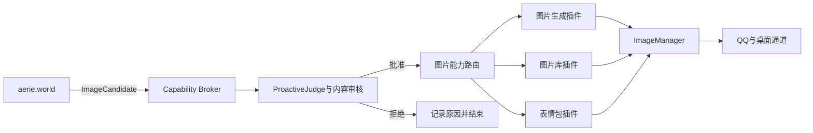
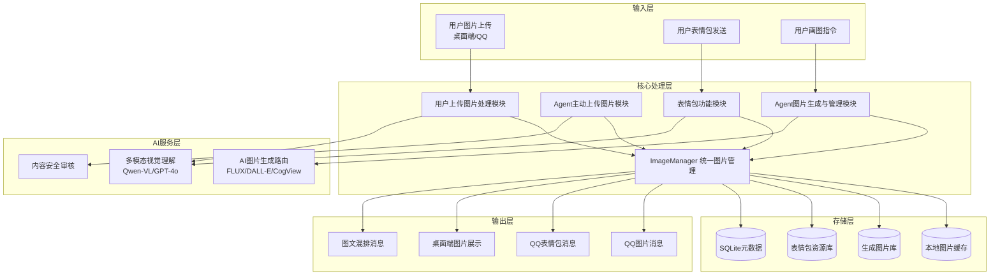
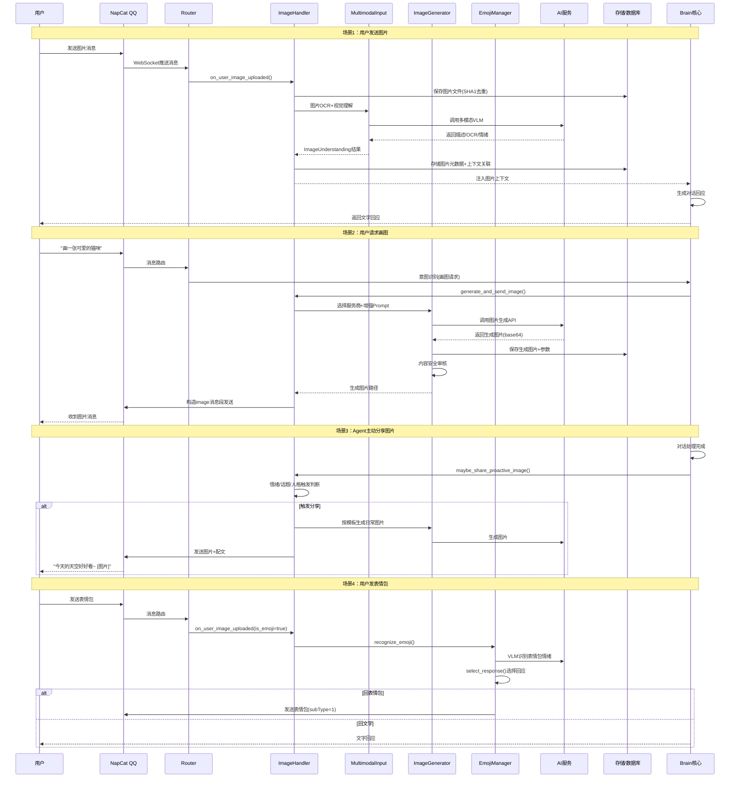

# Aerie 图片上传与管理完整解决方案

> [!info] 关联实施计划
> 本方案的主动图片能力已纳入 [[2026-07-20_Agent_24小时世界模拟与人格图片系统实施计划|Agent 24小时世界模拟与人格图片系统实施计划]]。`aerie.world` 作为独立Sidecar插件，根据世界、人格、情绪和关系状态生成图片候选；Aerie Core负责内容审核、用户边界、频控、真实生成和QQ/桌面投递。

## 插件化图片能力边界

图片系统拆成可独立安装的能力插件，世界插件不直接持有生成服务密钥，也不直接发送图片：



| 能力 | 建议权限 | 责任边界 |
|---|---|---|
| 图片候选预览 | `image.decision.preview` | 世界插件可生成结构化候选，不产生文件、不发送 |
| 图片生成 | `image.generate` | 由专用插件调用供应商，密钥由宿主代管 |
| 图片库读取 | `image.library.read` | 只能读取授权范围内的资源和元数据 |
| 表情包选择 | `emoji.library.read` | 只返回候选资源ID和语义标签 |
| 消息候选发布 | `message.candidate.publish` | 提交给Core裁决，不能等同于QQ直发 |
| 图片交付 | `message.image.deliver` | 仅Aerie Core和受信任通道适配器拥有 |

第三方插件不得读取QQ凭据、遍历未授权图片目录、绕过内容审核，或把预览请求当作真实发送。每个候选记录 `plugin_id`、触发世界快照、人格风格锚点、审核结果、最终执行插件和交付状态，支持审计与回放。

## 人格化图片决策概念摘要

图片系统不应仅在用户明确说“发图”时工作，也不能由随机概率直接触发。新增的 `ImageDecisionEngine` 以 **世界状态 × 活动人格 × Agent 情绪 × 用户情绪估计 × 双向关系安全度 × 冲突值 × 冷却/静默约束** 为输入，输出结构化 `ImageDecision`：

- `none`：安全度不足、冲突偏高、静默时段、冷却中或综合意愿不足时不发图。
- `send_scene`：世界模拟处于适合分享的地点/活动，关系安全且人格主动性允许时，生成场景图或生活片段。
- `send_selfie`：仅在 Persona 明确允许、关系边界满足且用户未表达拒绝时选择；不默认启用。
- `send_emoji`：更适合轻量情绪回应时，从本地表情库选择，不调用图片生成服务。
- `send_existing`：用户引用历史图片或要求重发时，从图片记录中选择已有资源。

决策层只负责“选不选择、选择什么”。在插件架构中，`aerie.world` 输出 `ImageCandidate`，图片能力插件负责生成或检索，Aerie Core负责审核和通道投递；任一插件都不能同时掌握“决定、生成、审核、发送”四个环节。每次决策写入世界插件的Outbox和审计事件，Core记录最终审核与交付结果，从而支持跨进程去重、回放、重试和降级。

> [!info] 文档说明
> 本文档设计了用户上传图片与Agent上传/生成图片的完整技术方案，覆盖桌面系统与手机QQ多平台支持，包含4大核心模块、接口定义、数据流、技术规范、性能优化及实现路径。

---

## 一、系统架构总览

### 1.1 模块架构图



### 1.2 文件结构设计

```
core/
├── image_handler.py          # 新增：统一图片管理核心
│   ├── ImageManager          # 存储/缓存/路径/元数据管理
│   ├── ImageReceiver         # 用户图片接收与验证
│   ├── ImageGenerator        # AI画图多服务路由
│   ├── ImageSender           # QQ/桌面端图片发送封装
│   └── EmojiManager          # 表情包库与响应逻辑
├── multimodal_input.py       # 已有：扩展图片理解输出能力
└── attachment_handler.py     # 已有：文档处理，无需改动

data/
├── images/
│   ├── cache/                # 用户上传图片缓存（SHA1去重）
│   ├── generated/            # AI生成图片（按日期分目录）
│   ├── uploads/              # 用户原始上传备份
│   └── temp/                 # 临时处理文件
└── emojis/
    ├── system/               # QQ系统表情ID映射
    ├── custom/               # 自定义表情包库
    └── favorites/            # 用户收藏表情包
```

---

## 二、用户上传图片处理模块

### 2.1 功能要求

> [!checklist] 核心功能清单
> - [x] 多平台图片上传接收（桌面端 + 手机QQ）
> - [x] 主流格式支持：JPG、PNG、WEBP、GIF、BMP
> - [x] 高精度图片识别与语义理解
> - [x] 图片与对话上下文深度关联
> - [x] 分级存储与访问权限控制
> - [x] 数据备份与高效检索
> - [x] 跨平台上传一致性保障

### 2.2 技术实现方案

#### 2.2.1 图片接收与格式验证

```python
# core/image_handler.py - ImageReceiver 类
class ImageReceiver:
    """用户图片接收处理器"""
    
    SUPPORTED_FORMATS = {'.jpg', '.jpeg', '.png', '.webp', '.gif', '.bmp'}
    MAX_FILE_SIZE = 30 * 1024 * 1024  # 30MB（QQ限制）
    DIMENSION_LIMIT = 8192  # 最大像素边长
    
    async def receive_from_qq(self, message_segment: dict) -> ImageAttachment:
        """从QQ消息段接收图片"""
        file_data = message_segment['data']['file']
        
        # 三种来源处理
        if file_data.startswith('file:///'):
            return await self._load_local_file(file_data[8:])
        elif file_data.startswith('http'):
            return await self._download_url(file_data)
        elif file_data.startswith('base64://'):
            return await self._load_base64(file_data[9:])
    
    async def receive_from_desktop(self, file_path: str) -> ImageAttachment:
        """从桌面端拖拽/粘贴接收图片"""
        return await self._load_local_file(file_path)
    
    def _validate_image(self, img: Image.Image) -> tuple[bool, str]:
        """图片安全与格式验证"""
        if img.width > self.DIMENSION_LIMIT or img.height > self.DIMENSION_LIMIT:
            return False, "图片尺寸过大"
        # 恶意文件检测、尺寸检查、格式校验
        return True, ""
```

#### 2.2.2 图片识别与语义理解

**多模态模型分层策略：**

| 场景 | 推荐模型 | 调用方式 | 成本 |
|---|---|---|---|
| 快速聊天图片描述 | Qwen3-VL-Flash / GPT-4o-mini | SiliconFlow / 百炼API | 极低（¥0.002/张） |
| OCR文字提取 | Qwen2.5-VL-72B | 阿里云百炼 | 低 |
| 复杂视觉推理 | GPT-4o / Claude 3.5 Sonnet | OpenAI/Anthropic官方 | 中 |
| 表情包情感识别 | Qwen3-VL | 本地或API | 极低 |

**图片理解Prompt工程：**

```python
IMAGE_UNDERSTANDING_PROMPTS = {
    'caption': "请用一句话简洁描述这张图片的内容，适合在聊天中提及。",
    'describe': """请详细描述这张图片，包括：
1. 主体内容（人物/物体/场景）
2. 背景环境
3. 色彩与构图
4. 情感氛围
5. 图片中的文字内容（如有）
请用自然流畅的中文描述，适合融入对话。""",
    'emoji_recognize': """这是一张表情包图片，请分析：
1. 表情包表达的情绪（开心/难过/生气/无语/可爱/搞笑等）
2. 表情包的使用场景
3. 适合回应的内容方向
用简洁JSON输出：{"emotion": "...", "scenario": "...", "response_hint": "..."}"""
}
```

#### 2.2.3 上下文关联机制

```python
class ImageContextManager:
    """图片与对话上下文关联管理"""
    
    async def attach_to_conversation(
        self,
        image: ImageAttachment,
        session_id: str,
        message_id: str,
        understanding: ImageUnderstanding
    ):
        """将图片信息关联到对话上下文"""
        
        # 1. 存储图片元数据到SQLite
        await self.db.execute("""
            INSERT INTO images (sha1, path, width, height, size, format,
                              caption, description, ocr_text, emotion,
                              session_id, message_id, uploaded_at)
            VALUES (?, ?, ?, ?, ?, ?, ?, ?, ?, ?, ?, ?, ?)
        """, (...))
        
        # 2. 注入到对话上下文Builder
        context_injection = f"""[用户发送了一张图片]
图片描述：{understanding.caption}
图片详情：{understanding.description}
{understanding.ocr_text and f'图片中的文字：{understanding.ocr_text}'}
请基于图片内容进行回应。"""
        
        # 3. 最近图片引用支持（"刚才那张图"）
        await self.memory.set(f"last_image_{session_id}", image.sha1, ttl=3600)
```

#### 2.2.4 图片存储与安全管理

**分级存储策略：**

```
data/images/
├── cache/          # 临时缓存（7天自动清理）
│   └── {sha1[:2]}/{sha1[2:4]}/{sha1}.{ext}
├── uploads/        # 用户上传原始文件（永久，加密存储）
│   └── {user_id}/{date}/{sha1}.{ext}
└── generated/      # AI生成图片（永久，带生成参数）
    └── {date}/{timestamp}_{prompt_hash}.{ext}
```

**安全机制：**

> [!warning] 安全控制要点
> - 文件类型白名单校验（仅允许图片格式）
> - 文件头魔数验证（防止伪造扩展名）
> - 图片重压缩（去除EXIF等潜在恶意数据）
> - SHA1内容哈希去重（防止重复存储）
> - 访问权限隔离（用户仅能访问自己上传的图片）
> - 病毒扫描集成（ClamAV可选）
> - EXIF地理位置信息自动清除

---

## 三、Agent主动上传图片模块

### 3.1 功能要求

> [!checklist] 核心功能清单
> - [x] 响应用户明确图片请求（"发张你的照片"、"看看风景"）
> - [x] 基于人格设定主动分享日常图片
> - [x] 情绪驱动的图片分享逻辑
> - [x] 人格一致性与内容审核
> - [x] 多平台图片发送支持（桌面+QQ）

### 3.2 触发机制设计

```python
class ProactiveImageSharer:
    """Agent主动图片分享决策引擎"""
    
    async def should_share_image(self, context: ConversationContext) -> ShareDecision:
        """判断是否应该主动发送图片"""
        
        triggers = []
        
        # 1. 用户明确请求
        if self._match_explicit_request(context.last_message):
            triggers.append('explicit_request')
        
        # 2. 情绪状态驱动（开心/兴奋/难过时配图）
        emotion = context.emotion_state
        if emotion.intensity > 0.7 and emotion.type in {'happy', 'excited', 'sad', 'nostalgic'}:
            triggers.append(f'emotion_{emotion.type}')
        
        # 3. 话题相关触发（聊到旅行/美食/宠物等话题时主动配图）
        if self._match_topic(context):
            triggers.append('topic_relevant')
        
        # 4. 人格设定随机主动分享（低频率）
        if random.random() < 0.05 and context.turn_count > 10:
            triggers.append('persona_proactive')
        
        return ShareDecision(
            should_share=len(triggers) > 0,
            triggers=triggers,
            recommended_category=self._select_category(context, triggers)
        )
```

### 3.3 人格一致性控制

> [!important] 人格图片库配置
> 在 `config/persona.yaml` 中新增图片相关配置：

```yaml
personality:
  image_sharing:
    enabled: true
    frequency: 0.15  # 主动分享概率（0-1）
    categories:
      selfies:
        weight: 0.3
        description: "自拍/生活照"
        style: "真实、自然、生活感"
      scenery:
        weight: 0.25
        description: "风景照/天空/日落"
        style: "治愈、唯美、日系"
      food:
        weight: 0.15
        description: "美食/咖啡/甜点"
        style: "温馨、有食欲"
      daily_life:
        weight: 0.2
        description: "日常碎片/书桌/窗外"
        style: "氛围感、胶片感"
      mood:
        weight: 0.1
        description: "情绪表达类图片"
        style: "根据情绪匹配"
    
    # 禁止内容类别
    forbidden:
      - nsfw
      - violence
      - political
      - controversial
```

### 3.4 内容审核机制

```python
class ContentSafetyChecker:
    """图片内容安全审核"""
    
    async def check_image(self, image_path: str) -> SafetyResult:
        """多层级内容审核"""
        
        # 1. 本地NSFW检测（轻量级模型）
        nsfw_score = await self._local_nsfw_check(image_path)
        if nsfw_score > 0.7:
            return SafetyResult(safe=False, reason="NSFW内容")
        
        # 2. 多模态模型审核
        audit_result = await self.vlm.check(image_path, """
请审核这张图片是否适合在聊天中发送，检查是否包含：
1. 色情/低俗内容
2. 暴力/血腥内容
3. 政治敏感内容
4. 恐怖/惊悚内容
5. 广告/垃圾信息
输出JSON：{"safe": true/false, "reason": "...", "confidence": 0-1}""")
        
        # 3. 人格一致性检查（图片是否符合角色设定）
        persona_match = await self._check_persona_match(image_path)
        
        return SafetyResult(
            safe=audit_result.safe and persona_match,
            reason=audit_result.reason if not audit_result.safe else ""
        )
```

---

## 四、Agent图片生成与管理模块

### 4.1 功能要求

> [!checklist] 核心功能清单
> - [x] 两类图片生成：情绪价值类（日常分享）+ 用户需求类（定制画图）
> - [x] 多AI服务API Key统一管理
> - [x] 至少3个AI图片生成服务支持
> - [x] 智能服务选择逻辑
> - [x] 图片生成模板库与风格管理
> - [x] 人格设定一致性保障

### 4.2 AI图片生成服务选型对比

> [!note] 2026年主流服务综合评估

| 服务 | 生成质量 | 中文支持 | 响应速度 | 价格/张 | API兼容性 | 推荐场景 |
|---|---|---|---|---|---|---|
| **SiliconFlow FLUX.1-schnell** | ★★★★☆ | ★★★☆☆ | 2-5秒 | ¥0.04 | OpenAI兼容 | **日常聊天/表情包（首选）** |
| **SiliconFlow FLUX.1-dev** | ★★★★★ | ★★★☆☆ | 5-10秒 | ¥0.15 | OpenAI兼容 | **高质量需求** |
| **通义万相 Wan2.5** | ★★★★☆ | ★★★★★ | 3-8秒 | ¥0.08-0.30 | DashScope | **中文场景/汉字生成** |
| **智谱 CogView4** | ★★★★☆ | ★★★★★ | 3-8秒 | ¥0.10-0.25 | BigModel | **中文文字/表情包** |
| **智谱 CogView3-Flash** | ★★★☆☆ | ★★★★☆ | 2-5秒 | **免费** | BigModel | **高并发/预算敏感** |
| **OpenAI DALL-E 3** | ★★★★★ | ★★☆☆☆ | 5-15秒 | $0.04-0.08 | OpenAI官方 | **创意/通用画图** |
| **OpenAI gpt-image-1** | ★★★★★ | ★★★☆☆ | 8-20秒 | ~¥1.40 | OpenAI官方 | **最高质量需求** |
| **Midjourney (第三方)** | ★★★★★ | ★★☆☆☆ | 30-120秒 | ¥0.5-3.0 | GoAPI等 | **艺术头像/高质量创意** |

### 4.3 多服务路由与API Key管理

```python
# config/settings.yaml 新增配置
image_generation:
  default_provider: "siliconflow"
  providers:
    siliconflow:
      api_key: "${SILICONFLOW_API_KEY}"
      base_url: "https://api.siliconflow.cn/v1"
      models:
        fast: "black-forest-labs/FLUX.1-schnell"
        quality: "black-forest-labs/FLUX.1-dev"
    
    tongyi:
      api_key: "${DASHSCOPE_API_KEY}"
      base_url: "https://dashscope.aliyuncs.com/compatible-mode/v1"
      models:
        default: "wanx2.5-t2i"
    
    cogview:
      api_key: "${ZHIPU_API_KEY}"
      base_url: "https://open.bigmodel.cn/api/paas/v4"
      models:
        free: "cogview-3-flash"
        quality: "cogview-4"
    
    openai:
      api_key: "${OPENAI_API_KEY}"
      base_url: "https://api.openai.com/v1"
      models:
        dall_e_3: "dall-e-3"
        gpt_image: "gpt-image-1"
  
  # 智能路由规则
  routing:
    rules:
      - condition: {type: "emoji", has_chinese_text: true}
        provider: "cogview"
        model: "cogview-4"
      - condition: {type: "daily_share", quality: "fast"}
        provider: "siliconflow"
        model: "black-forest-labs/FLUX.1-schnell"
      - condition: {type: "user_request", quality: "high"}
        provider: "siliconflow"
        model: "black-forest-labs/FLUX.1-dev"
      - condition: {free_tier: true}
        provider: "cogview"
        model: "cogview-3-flash"
```

### 4.4 图片生成器核心实现

```python
class ImageGenerator:
    """AI图片生成器 - 多服务路由"""
    
    async def generate(
        self,
        prompt: str,
        category: str = "user_request",
        style: Optional[str] = None,
        size: str = "1024x1024",
        quality: str = "auto",
        persona_aligned: bool = True
    ) -> GeneratedImage:
        """生成图片"""
        
        # 1. 选择合适的服务
        provider, model = await self._select_provider(category, quality, style)
        
        # 2. 增强Prompt（人格/风格/质量修饰）
        enhanced_prompt = await self._enhance_prompt(prompt, category, style, persona_aligned)
        
        # 3. 调用生成API（统一OpenAI格式）
        async with httpx.AsyncClient(timeout=60) as client:
            response = await client.post(
                f"{provider.base_url}/images/generations",
                headers={"Authorization": f"Bearer {provider.api_key}"},
                json={
                    "model": model,
                    "prompt": enhanced_prompt,
                    "n": 1,
                    "size": size,
                    "response_format": "b64_json"
                }
            )
        
        # 4. 保存图片并记录元数据
        image_data = base64.b64decode(response.json()['data'][0]['b64_json'])
        saved_path = await self._save_generated_image(image_data, prompt, enhanced_prompt, provider, model)
        
        # 5. 内容审核
        safety = await self.safety_checker.check_image(saved_path)
        if not safety.safe:
            raise SafetyError(f"图片审核不通过: {safety.reason}")
        
        return GeneratedImage(
            path=saved_path,
            prompt=prompt,
            enhanced_prompt=enhanced_prompt,
            provider=provider.name,
            model=model,
            category=category
        )
    
    async def _enhance_prompt(
        self,
        prompt: str,
        category: str,
        style: Optional[str],
        persona_aligned: bool
    ) -> str:
        """Prompt增强 - 添加风格和质量修饰词"""
        
        enhancements = []
        
        # 质量增强
        if category == "daily_share":
            enhancements.append("high quality, natural lighting, film grain, cozy atmosphere")
        elif category == "emoji":
            enhancements.append("cute, meme style, white background, high contrast, expressive")
        
        # 人格风格增强
        if persona_aligned:
            persona_style = self.persona.config.image_sharing.style
            enhancements.append(persona_style)
        
        # 自定义风格
        if style:
            enhancements.append(style)
        
        # 负面Prompt（通过支持的参数传递）
        negative = "low quality, blurry, distorted, ugly, nsfw, watermark, text errors"
        
        enhanced = f"{prompt}, {', '.join(enhancements)}"
        return enhanced
```

### 4.5 图片生成模板库

```python
# data/image_templates.yaml
templates:
  daily_selfie:
    name: "日常自拍"
    prompt: "a natural selfie of a young woman, soft smile, {location}, {time_of_day}, casual outfit, natural makeup"
    variables: ["location", "time_of_day"]
    style: "authentic, candid, phone camera, natural lighting"
    weight: 0.3
  
  scenery:
    name: "风景照"
    prompt: "beautiful {weather} {scene}, golden hour, soft colors, peaceful atmosphere, {mood}"
    variables: ["weather", "scene", "mood"]
    style: "cinematic, dreamy, pastel colors"
    weight: 0.25
  
  food_coffee:
    name: "美食咖啡"
    prompt: "delicious {food} on a wooden table, warm lighting, cozy cafe aesthetic, {angle} shot"
    variables: ["food", "angle"]
    style: "food photography, warm tones, appetizing"
    weight: 0.15
  
  mood_expression:
    name: "情绪表达"
    prompt: "aesthetic image expressing {emotion}, {colors}, minimalist, soft focus, artistic"
    variables: ["emotion", "colors"]
    style: "aesthetic, tumblr style, emotional"
    weight: 0.1
  
  chat_emoji:
    name: "聊天表情包"
    prompt: "cute cartoon {character} with {expression}, white background, chibi style, meme format"
    variables: ["character", "expression"]
    style: "kawaii, sticker style, high contrast, bold outline"
    weight: 0.2
```

---

## 五、表情包功能模块

### 5.1 功能要求

> [!checklist] 核心功能清单
> - [x] NapCat QQ表情包发送功能
> - [x] 表情包资源管理
> - [x] 用户表情包识别
> - [x] 表情包智能响应机制
> - [x] NapCat环境稳定运行

### 5.2 QQ表情包发送实现

```python
class EmojiManager:
    """表情包管理器"""
    
    # QQ系统表情常用ID映射
    SYSTEM_FACES = {
        # 开心类
        '哈哈': 14, '嘻嘻': 1, '笑眼': 287, '可爱': 277,
        '开心': 14, '耶': 42, '鼓掌': 50, '666': 305,
        # 卖萌类
        '可怜': 25, '亲亲': 30, '害羞': 23, '吐舌': 21,
        '乖巧': 324, '期待': 325, '星星眼': 307,
        # 情绪类
        '大哭': 4, '委屈': 24, '生气': 11, '无语': 25,
        '汗': 27, '黑线': 10, '惊恐': 36, '思考': 173,
        '再见': 3, '拜拜': 3, '加油': 76, '好的': 305,
        # 动作类
        '点赞': 76, '爱心': 66, '玫瑰': 63, '蛋糕': 53,
        '红包': 178, '福': 179, '鞭炮': 180,
    }
    
    async def send_system_face(self, user_id: str, face_name_or_id: Union[str, int]):
        """发送QQ系统小黄脸表情"""
        face_id = face_name_or_id if isinstance(face_name_or_id, int) \
                  else self.SYSTEM_FACES.get(face_name_or_id, 14)
        
        segments = [{"type": "face", "data": {"id": str(face_id)}}]
        await self.qq_client.send_message_with_segments(user_id, segments)
    
    async def send_custom_emoji(self, user_id: str, image_source: Union[str, bytes], is_url: bool = False):
        """发送自定义表情包图片"""
        if is_url:
            file_data = image_source
        elif isinstance(image_source, bytes):
            file_data = f"base64://{base64.b64encode(image_source).decode()}"
        else:
            file_data = f"file:///{image_source}"
        
        segments = [{
            "type": "image",
            "data": {
                "file": file_data,
                "subType": "1"  # 标记为表情包，客户端缩放显示
            }
        }]
        await self.qq_client.send_message_with_segments(user_id, segments)
    
    async def send_mixed_message(self, user_id: str, text: str, emoji_path: Optional[str] = None, face_id: Optional[int] = None):
        """发送图文混排消息（文字+表情包）"""
        segments = [{"type": "text", "data": {"text": text}}]
        
        if emoji_path:
            segments.append({
                "type": "image",
                "data": {"file": f"file:///{emoji_path}", "subType": "1"}
            })
        
        if face_id:
            segments.append({"type": "face", "data": {"id": str(face_id)}})
        
        await self.qq_client.send_message_with_segments(user_id, segments)
```

### 5.3 表情包识别与智能响应

```python
class EmojiResponder:
    """表情包智能响应引擎"""
    
    async def recognize_emoji(self, image: ImageAttachment) -> EmojiInfo:
        """识别用户发送的表情包"""
        result = await self.vlm.analyze(image.path, """
分析这张表情包：
1. 主要情绪：开心/搞笑/无语/生气/难过/可爱/阴阳怪气/其他
2. 表情包类型：熊猫头/蘑菇头/可爱卡通/真人/萌宠/文字表情包/其他
3. 表情包想表达的含义
4. 适合的回应方式（回类似表情包/文字回应/其他）
输出JSON格式。""")
        return EmojiInfo(**json.loads(result))
    
    async def select_response(self, emoji_info: EmojiInfo, context: ConversationContext) -> EmojiResponse:
        """选择合适的表情包回应"""
        
        # 1. 表情包库中匹配相似情绪
        matching_emojis = await self.emoji_db.search(
            emotion=emoji_info.emotion,
            style=emoji_info.type,
            limit=10
        )
        
        # 2. 人格匹配度排序
        scored = []
        for emoji in matching_emojis:
            score = self._calculate_fit_score(emoji, context, emoji_info)
            scored.append((score, emoji))
        
        scored.sort(reverse=True, key=lambda x: x[0])
        
        # 3. 决定回表情包还是文字
        if scored and scored[0][0] > 0.7 and random.random() < 0.6:
            return EmojiResponse(
                type="emoji",
                emoji=scored[0][1],
                text=None
            )
        else:
            return EmojiResponse(
                type="text",
                emoji=None,
                text=self._generate_text_response(emoji_info, context)
            )
```

### 5.4 表情包库管理

**表情包目录结构：**

```
data/emojis/
├── system/
│   └── face_mapping.json      # QQ系统表情ID映射表
├── custom/
│   ├── happy/                 # 分类存放
│   ├── sad/
│   ├── funny/
│   ├── cute/
│   ├── speechless/
│   ├── angry/
│   └── greeting/
├── favorites/                 # 用户发送过的表情包自动收藏
│   └── {sha1}.{ext}
└── emoji_index.json           # 表情包索引（标签、情绪、使用次数）
```

---

## 六、接口定义与数据流

### 6.1 核心接口定义

```python
# core/image_handler.py - 对外统一接口

class ImageHandler:
    """图片处理统一入口 - 对外API"""
    
    async def on_user_image_uploaded(
        self,
        message_segment: dict,
        session_id: str,
        user_id: str,
        platform: str = "qq"
    ) -> ImageContext:
        """
        用户上传图片处理入口
        返回：图片理解结果，用于注入对话上下文
        """
    
    async def generate_and_send_image(
        self,
        user_id: str,
        prompt: str,
        category: str = "user_request",
        style: Optional[str] = None,
        reply_text: Optional[str] = None
    ) -> SendResult:
        """
        生成图片并发送给用户
        用于响应用户"画一张XXX"请求
        """
    
    async def maybe_share_proactive_image(
        self,
        user_id: str,
        context: ConversationContext
    ) -> Optional[SendResult]:
        """
        判断是否主动分享图片并执行
        在对话处理完成后调用
        """
    
    async def send_emoji_response(
        self,
        user_id: str,
        user_image: Optional[ImageAttachment],
        context: ConversationContext
    ) -> SendResult:
        """
        表情包智能回应
        用户发送表情包时调用
        """
    
    async def send_image_with_text(
        self,
        user_id: str,
        image_path: str,
        text: str,
        is_emoji: bool = False,
        platform: str = "qq"
    ) -> SendResult:
        """
        发送图文混排消息
        """
```

### 6.2 完整数据流图



---

## 七、技术规范

### 7.1 图片技术标准

| 项目 | 规范 |
|---|---|
| **支持格式** | JPG/JPEG、PNG、WEBP、GIF（动图）、BMP |
| **文件大小** | 最大30MB（QQ限制），AI生成默认≤5MB |
| **分辨率** | AI生成默认1024x1024，支持768x1024/1024x768/1280x720 |
| **色彩空间** | sRGB |
| **压缩质量** | 发送前JPG质量85，PNG优化压缩 |
| **EXIF处理** | 自动清除所有元数据（含GPS定位） |
| **文件命名** | 缓存：SHA1哈希；生成：时间戳_prompt哈希 |

### 7.2 API接口规范

**图片生成API统一采用OpenAI Images API格式：**

```
POST /v1/images/generations
Content-Type: application/json
Authorization: Bearer {api_key}

{
  "model": "string",
  "prompt": "string",
  "n": 1,
  "size": "1024x1024",
  "response_format": "b64_json|url",
  "quality": "standard|hd",
  "style": "vivid|natural"
}
```

**多模态视觉理解API统一采用OpenAI Chat Completions格式（图片用base64 data URL）。**

### 7.3 数据库表结构

```sql
-- 图片元数据表
CREATE TABLE images (
    id INTEGER PRIMARY KEY AUTOINCREMENT,
    sha1 TEXT UNIQUE NOT NULL,           -- 文件内容哈希
    path TEXT NOT NULL,                  -- 存储路径
    source TEXT NOT NULL,                -- upload/generated/emoji/system
    width INTEGER,
    height INTEGER,
    size INTEGER,                        -- 文件大小(字节)
    format TEXT,                         -- jpg/png/gif/webp
    caption TEXT,                        -- 一句话描述
    description TEXT,                    -- 详细描述
    ocr_text TEXT,                       -- OCR提取文字
    emotion TEXT,                        -- 情绪标签
    user_id TEXT,                        -- 上传用户ID
    session_id TEXT,                     -- 会话ID
    message_id TEXT,                     -- 消息ID
    -- AI生成特有字段
    prompt TEXT,                         -- 原始Prompt
    enhanced_prompt TEXT,                -- 增强后Prompt
    provider TEXT,                       -- 生成服务商
    model TEXT,                          -- 使用模型
    generated_at TIMESTAMP,
    -- 通用字段
    created_at TIMESTAMP DEFAULT CURRENT_TIMESTAMP,
    access_count INTEGER DEFAULT 0,
    last_accessed_at TIMESTAMP
);

-- 表情包索引表
CREATE TABLE emojis (
    id INTEGER PRIMARY KEY AUTOINCREMENT,
    sha1 TEXT UNIQUE NOT NULL,
    path TEXT NOT NULL,
    emotion TEXT,                        -- 情绪标签
    category TEXT,                       -- 分类
    tags TEXT,                           -- JSON数组标签
    description TEXT,
    use_count INTEGER DEFAULT 0,
    is_favorite BOOLEAN DEFAULT 0,
    created_at TIMESTAMP DEFAULT CURRENT_TIMESTAMP
);

-- 图片生成模板表
CREATE TABLE image_templates (
    id INTEGER PRIMARY KEY AUTOINCREMENT,
    name TEXT UNIQUE NOT NULL,
    prompt_template TEXT NOT NULL,
    style TEXT,
    category TEXT,
    weight REAL DEFAULT 1.0,
    variables TEXT,                      -- JSON数组变量名
    is_active BOOLEAN DEFAULT 1
);
```

---

## 八、性能优化方案

### 8.1 性能优化策略

> [!tip] 关键优化点
> 1. **图片压缩与优化**：发送前自动压缩至合适尺寸，JPG质量85%
> 2. **多层缓存**：内存缓存最近使用图片 → 本地磁盘缓存 → CDN（可选）
> 3. **异步处理**：图片上传、理解、生成全程异步，不阻塞对话主流程
> 4. **并发控制**：AI生成API并发数限制（默认≤3），防止触发限流
> 5. **预生成**：主动分享场景可在空闲时预生成候选图片
> 6. **缩略图**：列表/预览使用缩略图，点击查看原图
> 7. **去重存储**：SHA1哈希去重，相同图片仅存一份
> 8. **超时与降级**：AI服务超时自动降级到备用服务

```python
# 性能配置示例
performance:
  image_compression:
    enabled: true
    max_dimension: 1600        # 发送前最大边长
    jpeg_quality: 85
    webp_quality: 80
  
  cache:
    memory_cache_size: 100     # 内存缓存图片数
    disk_cache_ttl_days: 7     # 磁盘缓存过期时间
    enable_sha1_dedup: true
  
  async_processing:
    image_understanding: true  # 图片理解异步不阻塞首字
    generation_timeout: 45     # 生成超时(秒)
  
  concurrency:
    max_concurrent_generations: 3
    max_concurrent_uploads: 5
  
  fallback:
    enabled: true
    fallback_provider: "cogview"
    fallback_model: "cogview-3-flash"
```

### 8.2 资源消耗预估

| 操作 | 预估时间 | 备注 |
|---|---|---|
| 用户图片接收+保存 | <100ms | 本地IO |
| 图片快速描述（Qwen-VL-Flash） | 1-2秒 | SiliconFlow API |
| 图片详细理解（Qwen-VL） | 3-5秒 | 异步处理 |
| 表情包识别 | 1-2秒 | |
| AI图片生成（FLUX-schnell） | 3-8秒 | |
| AI图片生成（FLUX-dev） | 8-15秒 | |
| QQ图片发送 | 1-3秒 | 取决于文件大小 |
| 表情包发送 | <500ms | |

---

## 九、实现路径与开发优先级

### 9.1 开发阶段划分

#### Phase 1：基础图片收发（优先级：最高，预计2-3天）

> [!success] Phase 1 目标
> 打通用户上传图片接收 → 理解 → 上下文注入 → QQ图片发送的基础链路

- [ ] 新增 `core/image_handler.py` - ImageManager基础框架
- [ ] 实现用户图片从QQ接收（支持file/URL/base64三种格式）
- [ ] 实现图片保存、验证、基础处理（压缩/EXIF清除）
- [ ] 扩展 `multimodal_input.py`，优化图片理解Prompt
- [ ] 实现QQ图片发送封装（image消息段构造）
- [ ] 实现基础图文混排发送
- [ ] 图片元数据SQLite存储
- [ ] E2E测试：用户发图 → Agent理解 → 文字回应

#### Phase 2：AI图片生成（优先级：高，预计2-3天）

> [!success] Phase 2 目标
> 支持用户"画图"指令，Agent可以生成图片回复

- [ ] 实现ImageGenerator多服务路由框架
- [ ] 接入SiliconFlow FLUX.1（首选）
- [ ] 接入智谱CogView3-Flash（免费备用）
- [ ] API Key配置管理与环境变量
- [ ] Prompt增强与风格修饰
- [ ] 生成图片保存与元数据记录
- [ ] 内容安全审核集成
- [ ] 智能服务商选择逻辑
- [ ] E2E测试：用户"画一只猫" → 生成 → 发送图片

#### Phase 3：表情包功能（优先级：中，预计1-2天）

> [!success] Phase 3 目标
> 支持发送QQ系统表情、自定义表情包，识别用户表情包

- [ ] QQ系统face表情ID映射表与发送封装
- [ ] 自定义表情包发送（subType=1）
- [ ] 表情包库基础结构与分类
- [ ] 用户表情包识别（VLM情绪分析）
- [ ] 表情包智能响应逻辑
- [ ] 高频表情包预置（20-50个常用）
- [ ] E2E测试：发表情包 → 识别 → 回应

#### Phase 4：Agent主动分享（优先级：中，预计2天）

> [!success] Phase 4 目标
> Agent可以基于情绪/话题/人格主动分享图片

- [ ] 主动分享触发机制（情绪/话题/随机）
- [ ] 人格配置项（图片分享频率/风格/类别权重）
- [ ] 图片生成模板库（自拍/风景/美食/情绪等）
- [ ] 人格一致性检查
- [ ] 主动分享频率控制（防止刷屏）
- [ ] 配文生成（图片+文字自然结合）
- [ ] E2E测试：对话中Agent主动发图

#### Phase 5：优化与高级功能（优先级：低，按需迭代）

> [!success] Phase 5 目标
> 性能优化、体验打磨、高级功能

- [ ] 本地图片缓存与LRU淘汰
- [ ] 图片并发控制与队列管理
- [ ] 多服务商降级与故障转移
- [ ] 用户表情包自动收藏与学习
- [ ] 桌面端图片上传（拖拽/粘贴）
- [ ] 生成图片风格模板扩展
- [ ] Midjourney/DALL-E 3等更多服务接入
- [ ] 图片搜索与历史记录
- [ ] 性能监控与统计

### 9.2 依赖库新增

```
# requirements.txt 新增：
Pillow>=10.0.0          # 图片处理（已有，确认版本）
httpx>=0.25.0           # 异步HTTP（aiohttp可替代，统一即可）
# 可选本地部署（Phase 5按需）：
# diffusers>=0.27.0
# transformers>=4.40.0
# torch>=2.0.0
# accelerate>=0.25.0
```

---

## 十、技术难点与解决方案

### 10.1 潜在技术难点分析

| 难点 | 影响 | 解决方案 |
|---|---|---|
| **跨平台图片格式兼容性** | 手机QQ/桌面端图片格式/EXIF差异可能导致识别失败 | 1. 统一使用base64发送，避免路径问题；2. 接收后统一转RGB格式处理；3. 多格式降级兼容测试 |
| **图片识别准确性** | 图片理解错误导致回应文不对题 | 1. 分层模型策略（快速+详细两级理解）；2. 优化Prompt工程；3. 置信度低时保守回应（"我看到一张XXX的图片"）；4. OCR结果优先展示 |
| **情绪与图片匹配度** | 主动发图不符合当前情绪/话题 | 1. 情绪强度阈值控制（高强度才触发）；2. 模板与情绪标签映射；3. 人格一致性Prompt注入；4. 生成后二次VLM审核是否符合预期情绪 |
| **AI生成服务稳定性** | API超时/限流/失败影响体验 | 1. 多服务商自动降级；2. 合理并发控制；3. 超时重试（最多2次）；4. 熔断机制（连续失败暂时切换备用）；5. 失败时优雅降级文字回应 |
| **NapCat图片发送失败** | 路径格式/base64/大小问题导致图片发不出 | 1. 优先使用base64发送，避免路径/权限问题；2. 发送前自动压缩到安全大小；3. 发送失败重试+降级URL方式；4. 详细错误日志 |
| **内容安全风险** | AI生成不合适图片 | 1. 多层审核（本地NSFW + VLM审核）；2. Prompt负面词注入；3. 严格禁止类别配置；4. 人工审核反馈机制 |
| **成本控制** | 大量图片生成/理解导致API费用过高 | 1. 分层模型（小模型处理日常，大模型处理复杂）；2. 免费额度优先（CogView3-Flash）；3. 主动分享频率限制；4. 用量统计与预算告警；5. 本地部署备选 |
| **表情包文化理解** | 表情包梗/网络流行语理解不到位 | 1. 持续扩充表情包库+标签；2. 识别Prompt包含网络文化场景；3. 不确定时文字回应代替乱发表情包；4. 用户反馈学习 |

### 10.2 降级与容错方案

> [!warning] 关键容错策略
> 所有图片相关功能必须有优雅降级，不能因为图片功能故障影响核心文字对话：
>
> 1. **图片理解失败** → 返回"[图片]"标记正常对话，不阻塞回应
> 2. **图片生成失败** → 文字描述代替："好想给你画一张可爱的猫咪，可惜画笔暂时没电了😿"
> 3. **图片发送失败** → 重试一次，失败则文字告知并正常继续对话
> 4. **AI服务全部不可用** → 切换到本地预置图库发送
> 5. **表情包识别失败** → 按普通图片处理或文字回应"哈哈这个表情包好有意思"

---

## 十一、跨平台兼容性方案

### 11.1 平台支持矩阵

| 功能 | 桌面端（Electron） | 手机QQ（NapCat） | 备注 |
|---|---|---|---|
| 用户上传图片接收 | ✅ 拖拽/粘贴 | ✅ 图片消息 | 统一入口处理 |
| 图片格式支持 | JPG/PNG/WEBP/GIF/BMP | JPG/PNG/GIF/WEBP | 一致 |
| 图片理解与OCR | ✅ | ✅ | 同一服务 |
| Agent发送图片 | ✅ 聊天窗口展示 | ✅ 图片消息 | 统一构造消息段 |
| 图文混排 | ✅ | ✅ | 消息段数组 |
| QQ系统小黄脸 | ⚪ 桌面端Emoji展示 | ✅ face消息段 | 桌面端转Unicode Emoji |
| 自定义表情包 | ✅ 图片展示 | ✅ subType=1缩放显示 | |
| AI图片生成 | ✅ | ✅ | 同一生成逻辑 |
| Agent主动发图 | ✅ | ✅ | 同一触发逻辑 |
| 表情包智能回应 | ✅ | ✅ | |

### 11.2 平台差异处理

```python
class PlatformAdapter:
    """平台适配器"""
    
    @staticmethod
    def adapt_image_segment(segment: dict, platform: str) -> dict:
        """根据平台调整消息段格式"""
        if platform == "qq":
            # QQ需要file字段，base64方式最稳定
            if 'path' in segment['data']:
                segment['data']['file'] = f"base64://{PathUtils.file_to_base64(segment['data'].pop('path'))}"
            # 表情包标记
            if segment['data'].get('is_emoji'):
                segment['data']['subType'] = '1'
        elif platform == "desktop":
            # 桌面端直接传本地路径
            pass
        return segment
    
    @staticmethod
    def adapt_face_to_emoji(face_id: int, platform: str) -> Union[str, dict]:
        """QQ系统表情转各平台兼容格式"""
        if platform == "qq":
            return {"type": "face", "data": {"id": str(face_id)}}
        else:
            # 桌面端转Unicode Emoji
            face_to_emoji = {14: "😄", 1: "😆", 4: "😭", 66: "❤️", 76: "👍"}
            return {"type": "text", "data": {"text": face_to_emoji.get(face_id, "😊")}}
```

---

## 十二、配置与部署

### 12.1 必要配置项

在 `.env` 或 `config/settings.yaml` 中配置：

```yaml
# .env 新增
# 至少配置一个图片生成服务的API Key
SILICONFLOW_API_KEY=sk-xxx           # 推荐：SiliconFlow（FLUX模型）
ZHIPU_API_KEY=xxx                     # 推荐：智谱AI（CogView免费额度）
DASHSCOPE_API_KEY=sk-xxx             # 可选：阿里云百炼（通义万相）
OPENAI_API_KEY=sk-xxx                # 可选：OpenAI（DALL-E）

# config/settings.yaml
image:
  enabled: true
  upload:
    max_size_mb: 30
    auto_compress: true
  understanding:
    enabled: true
    model: "qwen-vl-max"  # 或 gpt-4o-mini
    fast_model: "Qwen/Qwen3-VL-8B"
  generation:
    enabled: true
    default_provider: "siliconflow"
    default_size: "1024x1024"
  emoji:
    enabled: true
    auto_recognize: true
  proactive_sharing:
    enabled: true
    probability: 0.15
    min_turns: 5
  safety_check:
    enabled: true
    nsfw_threshold: 0.7
```

### 12.2 目录权限

确保以下目录可写：

```
data/images/           # 图片存储
data/emojis/           # 表情包库
data/images/cache/     # 临时缓存
data/images/generated/ # 生成图片
```

---

## 十三、测试验证要点

### 13.1 测试用例清单

> [!example] E2E测试场景
> 1. **用户上传图片测试**
>    - 发送JPG/PNG/GIF/WEBP各格式图片
>    - 发送大图（>10MB）
>    - 发送带文字的截图（验证OCR）
>    - 手机QQ发送图片
>    - 桌面端拖拽发送图片
>
> 2. **AI画图测试**
>    - "画一只可爱的猫咪"
>    - "画一张日落风景图"
>    - "帮我画一个搞笑表情包"
>    - 中文Prompt画图
>    - 长Prompt详细描述画图
>    - 并发多个画图请求
>
> 3. **表情包测试**
>    - 发送QQ小黄脸表情
>    - 发送自定义表情包图片
>    - 验证表情包识别准确性
>    - 验证表情包回应合理性
>    - 系统表情+文字混发
>
> 4. **主动分享测试**
>    - 聊到开心话题时是否主动发图
>    - 主动发图频率是否合理（不刷屏）
>    - 图片与人格设定是否一致
>    - 配文是否自然
>
> 5. **异常测试**
>    - 无API Key时降级处理
>    - API超时/失败处理
>    - 发送非法文件验证
>    - 网络中断恢复
>    - 图片发送失败重试

---

## 附录：相关文档索引

- [[Aerie_v14_对话系统全面升级方案]] - 对话系统基础架构
- [[Aerie_拟人化对话模式研究与优化方案]] - 人格与情绪系统
- [[Aerie_Agent主动发消息方案]] - 主动消息机制
- [OneBot v11 消息段文档](https://docs.go-cqhttp.org/cqcode/)
- [SiliconFlow API文档](https://docs.siliconflow.cn/)
- [智谱AI开放平台](https://open.bigmodel.cn/)

---

> [!note] 文档版本
> - v1.0 (2026-07-19) - 初始完整方案设计
>
> 下阶段工作：按Phase 1优先级开始编码实现

^doc-footer
