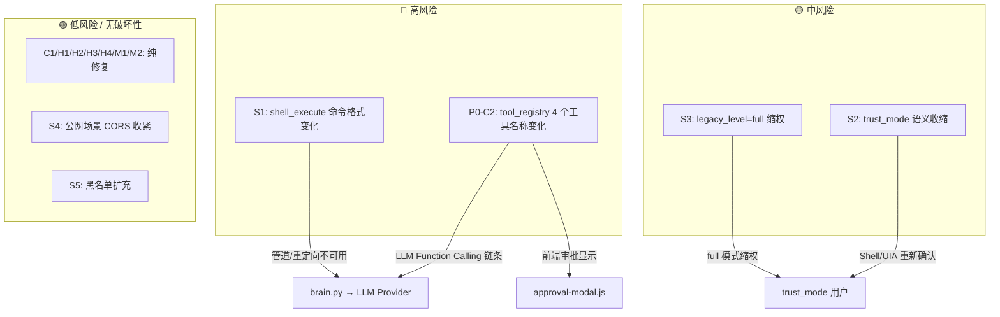

# Aerie · 云栖 0.1.0-beta.1 — 通路清单与影响范围分析

> [!info] 分析说明
> 本文档基于 `[[Aerie_审查报告_Obsidian]]` 的审查结论，对项目中的所有连接通路进行全面盘点，并逐项分析每个待改善项修复时可能触及的通路与影响范围。
>
> **本轮仅做识别与分析，不包含任何代码修改方案。**

---

## 一、通路清单

### 1.1 REST API 通路（FastAPI HTTP，130 个端点）

| 通路类型 | 具体标识 | 当前契约摘要 | 出现在审查报告 |
|:---|:---|:---|:---:|
| REST API | `POST /api/chat/send` | Body: `{user_id, content, source, reply_to_id, ...}` → `{status, reply, cognition_id}` | 否 |
| REST API | `GET /api/chat/history` | Query: `?user_id&limit&before` → `{messages: [{id, role, content, ...}]}` | 否 |
| REST API | `GET /api/chat/poll` | Query: `?user_id&since_ts` → `{new_messages: [...]}` | 否 |
| REST API | `POST /api/chat/recall/{msg_id}` | Path param `msg_id: int` → `{success, ...}` | 否 |
| REST API | `GET /api/napcat/status` | → `{phase, qrcode_available, qrcode_path, ...}` | 否 |
| REST API | `GET /api/emotion/state` | Query: `?user_id` → `{pleasure, arousal, dominance, label, ...}` | 否 |
| REST API | `GET /api/emotion/thresholds` | → `{slots: {patience/anxiety/desire/tenderness}}` | 否 |
| REST API | `GET /api/emotion/history` | Query: `?user_id&period(24h/7d/30d)` → `[{ts, pleasure, arousal, dominance, label}, ...]` | 否 |
| REST API | `GET /api/events/stream` | SSE stream → `{type, data}` 实时事件 | 否 |
| REST API | `GET /api/cognition/recent` | Query: `?user_id&limit` → `[{id, ts, stages, ...}]` | 否 |
| REST API | `GET /api/cognition/{row_id}` | → 单条认知追踪详情 | 否 |
| REST API | `GET /api/tools/list` | → `[{name, schema, provider_hint}, ...]` | 否 |
| REST API | `GET /api/self_evolve/list` | → `[{id, trigger_kind, description, status, safety_check}, ...]` | 否 |
| REST API | `POST /api/self_evolve/{proposal_id}/approve` | → `{ok, registered_tool}` | 否 |
| REST API | `GET /api/computer_control/level` | → `{level, permissions: {file_read, file_write, ...}}` | 否 |
| REST API | ==PUT /api/computer_control/level== | Body: `{level: "standard"\|"partial"\|"full"}` → 设置权限档位 | ==是（S3）== |
| REST API | `GET /api/computer_control/approvals/pending` | → `[{call_id, action, params, description}, ...]` | 否 |
| REST API | `POST /api/computer_control/approvals/{id}/approve` | → `{ok}` | 否 |
| REST API | `GET /api/permissions/config` | → `{trust_mode, categories_enabled, authorized_dirs, ...}` | 否 |
| REST API | ==PUT /api/permissions/config== | Body: `{trust_mode?, categories_enabled?, ...}` → 更新权限配置 | ==是（S2）== |
| REST API | `POST /api/permissions/check` | Body: `{operation, target_path}` → `{allowed, needs_confirmation, ...}` | 否 |
| REST API | `POST /api/permissions/revoke_all` | → `{ok}` | 否 |
| REST API | `GET /api/tasks` | → `[{id, type, status, progress, ...}]` | 否 |
| REST API | `POST /api/tasks` | Body: `{type, params}` → `{task_id}` | 否 |
| REST API | `GET /api/tasks/{task_id}` | → `{id, type, status, progress, steps, ...}` | 否 |
| REST API | `POST /api/tasks/{task_id}/cancel` | → `{ok}` | 否 |
| REST API | `GET/POST/PUT/DELETE /api/qq/whitelist/*` | 7 个端点，管理 QQ 白名单 | 否 |
| REST API | `GET/PUT /api/office/mode` | GET → `{mode, detected_mode}`；PUT body: `{mode}` | 否 |
| REST API | `POST /api/office/detect` | → `{is_office, confidence, features}` | 否 |
| REST API | ==GET/PUT /api/office/dir== | GET → `{dir}`；PUT body: `{dir}` | 否 |
| REST API | `GET /api/validation/config` | → `{guard_enabled, judge_threshold, ...}` | 否 |
| REST API | `POST /api/validation/check` | Body: `{reply_text, user_message}` → ValidationResult | 否 |
| REST API | `GET /api/proactive/status` | → `{enabled, today_count, next_scheduled, ...}` | 否 |
| REST API | `GET /api/proactive/scenes` | → `{scenes: {name: {cron, trigger, ...}}}` | 否 |
| REST API | `POST /api/proactive/toggle` | Body: `{enabled}` → `{ok}` | 否 |
| REST API | `GET /api/file_organizer/stats` | → `{total_organized, total_size, ...}` | 否 |
| REST API | `GET /api/doc_writer/stats` | → `{total_docs, ...}` | 否 |
| REST API | `GET/POST/PUT/DELETE /api/calendar/**` | 5 个端点，日历 CRUD | 否 |
| REST API | `GET /api/stats/tokens` | → `{today, week, month, by_provider}` | 否 |
| REST API | `GET /api/stats/system` | → `{uptime, memory, disk, ...}` | 否 |
| REST API | ==GET/PUT /api/settings== | GET → `{theme, startup, proactive, weather, ...}`；PUT body: `{theme?, startup?, ...}` | 否 |
| REST API | `POST /api/settings/reset` | → `{ok, defaults}` | 否 |
| REST API | `GET/POST/PUT/DELETE /api/anniversary/**` | 5 个端点，纪念日 CRUD | 否 |
| REST API | `GET /api/knowledge/list` | → `[{id, category, title, ...}]` | 否 |
| REST API | `GET/PUT /api/persona` | GET → persona 对象；PUT body: persona patch | 否 |
| REST API | `GET/POST/PUT/DELETE /api/persona/hub/**` | 10 个端点，Persona Hub CRUD | 否 |
| REST API | `GET/POST /api/persona/avatar` | GET → avatar bytes；POST multipart → `{path}` | 否 |
| REST API | `GET /api/brief/today` | → `{sections: [{title, content, ...}], generated_at}` | 否 |
| REST API | `POST /api/brief/run` | → `{ok, brief_id}` | 否 |
| REST API | `GET/POST/PATCH/DELETE /api/todos/**` | 4 个端点，Todo CRUD | 否 |
| REST API | `GET /api/brain/ai-options` | → `[{id, label, model}, ...]` | 否 |
| REST API | `POST /api/brain/shell` | Body: `{command}` → `{output, error}` | 否 |
| REST API | `GET /api/desire/state` | → `{desire_value, variables, triggers, ...}` | 否 |
| REST API | `GET /api/skills/list` | → `[{name, category, description, ...}]` | 否 |
| REST API | `POST /api/skills/{name}/call` | Body: `{args}` → `{result}` | 否 |
| REST API | `GET /api/health` | → `{status: "ok", version, uptime}` | 否 |
| REST API | `POST /api/system/reload-config` | → `{ok, changes?}` | 否 |
| REST API | ==PUT /api/config/yaml== | Query: `?file=settings.yaml` + Body: raw YAML 字符串 → 热更新配置 | ==是（S1 隐含）== |
| REST API | `GET /api/config/yaml` | Query: `?file=...` → raw YAML 内容 | 否 |
| REST API | `GET /uploads/{filename}` | 静态文件服务 | 否 |
| REST API | `POST /api/upload` | Multipart → `{url, filename}` | 否 |

### 1.2 Electron IPC 通路（contextBridge，44 个方法）

| 通路类型 | 具体标识 | 当前契约摘要 | 出现在审查报告 |
|:---|:---|:---|:---:|
| IPC | `aerie.api.request(opts)` | `opts: {method, path, body?, ...}` → `Promise<any>` | 否 |
| IPC | `aerie.api.upload(opts)` | `opts: {path, formData}` → `Promise<any>` | 否 |
| IPC | ==aerie.sse.subscribe(callback)== | `callback: (payload)` → `() => void` (unsubscribe) | ==是（H4）== |
| IPC | `aerie.napcat.getStatus()` | → `Promise<{phase, ...}>` | 否 |
| IPC | `aerie.napcat.start/stop()` | → `Promise<any>` | 否 |
| IPC | `aerie.napcat.onEvent(cb)` | → void | 否 |
| IPC | `aerie.electron.onHealth/onOpenTab/onBriefShow(cb)` | → void | 否 |
| IPC | `aerie.electron.window.minimize/toggleMaximize/close/...` | 5 个窗口控制方法 | 否 |
| IPC | `aerie.electron.system.restartBackend/restartApp/reloadConfig()` | → `Promise<any>` | 否 |
| IPC | `aerie.electron.dialog.openDirectory(opts)` | → `Promise<path \| null>` | 否 |
| IPC | `aerie.electron.shell.openPath(path)` | → `Promise<{success, error}>` | 否 |
| IPC | `aerie.electron.brief.openDetail/hide/...` | 5 个简报控制方法 | 否 |
| IPC | `aerie.settings.get/set/reset()` | → `Promise<any>` | 否 |
| IPC | ==aerie.islandControl.setConfig(cfg)== | `cfg: {theme, interaction, capsuleComponents, expandedComponents}` | 否 |
| IPC | `aerie.islandControl.getConfig()` | → `Promise<config>` | 否 |
| IPC | ==aerie.dynamicIsland.setSize/setState/setIgnoreMouse/...== | 16 个灵动岛控制 / 媒体控制 / 状态回调 | 否 |

### 1.3 Python 类/方法通路（核心业务模块）

| 通路类型 | 具体标识 | 当前契约摘要 | 出现在审查报告 |
|:---|:---|:---|:---:|
| 类方法 | ==Companion.__init__(settings) → None== | 29 行构造器，直接 new 所有子系统 | ==是（Q2, H1, M2）== |
| 类方法 | `Companion.start() → None` | 异步启动全部子系统 | 否 |
| 类方法 | `Companion.stop() → None` | 优雅关闭全部子系统 | 否 |
| 类方法 | `Companion.recall_qq_message(msg_id: int) → dict` | 撤回消息 + 数据库标记 | 否 |
| 类方法 | `Companion.check_idle(user_id, idle_seconds) → bool` | 空闲检测回调 | 否 |
| 类方法 | ==Pipeline.__init__(router, emotion_engine, context_builder, brain, send_queue, tool_registry, db, recall_manager, cognition, decision_engine, self_evolver)== | 注入 11 个依赖 | 否 |
| 类方法 | ==Pipeline.handle(msg: IncomingMessage, force_full=False) → dict \| None== | 5 阶段消息管线主入口，500+ 行 | ==是（C1, Q3, H3）== |
| 类方法 | ==ComputerController.shell_execute(command, cwd=None) → ControlResult== | 受限 Shell 执行 | ==是（S1, C2）== |
| 类方法 | ==ComputerController.type_text(text) → ControlResult== | 键盘文本输入（tool_registry 中注册名为 `key_type`→ 需修复为 `type_text`） | ==是（C2）== |
| 类方法 | ==ComputerController.uia_action(action_type, params=None) → ControlResult== | UIA 动作（tool_registry 中缺失注册） | ==是（C2）== |
| 类方法 | ==ComputerController.focus_window(hwnd: int) → ControlResult== | 聚焦窗口（参数类型可能有误） | ==是（C2）== |
| 类方法 | `ComputerController.request_approval(action, params, description) → str` | 请求用户审批 | 否 |
| 类方法 | ==RestrictedShell.execute(command, cwd=None, permission=STANDARD) → ControlResult== | `subprocess.run(shell=True)` + 18 模式黑名单 | ==是（S1）== |
| 类方法 | ==FineGrainedPermissionManager.check(operation, target_path, batch_count) → PermissionCheckResult== | 权限检查核心入口 | ==是（S2, S3）== |
| 类方法 | ==FineGrainedPermissionManager.set_legacy_level(level: str) → None== | 设置 "standard"/"partial"/"full" 档位 | ==是（S3）== |
| 类方法 | ==PermissionConfig.trust_mode: bool== | 信任模式开关字段 | ==是（S2, S3）== |
| 类方法 | ==Brain.__init__(...) → None== | LLM 调度器构造 | ==是（H1）== |
| 类方法 | `Brain.chat(messages, tools, ...) → BrainResponse` | LLM 对话 | 否 |
| 类方法 | ==EmotionStateStore.__init__(db) → None== | 情感状态存储构造 | ==是（H1）== |
| 类方法 | `EmotionStateStore.snapshot(user_id, state, threshold, trigger) → int` | 保存快照 | 否 |
| 类方法 | `EmotionStateStore.history(user_id, since_ts, limit) → list[dict]` | 查询历史曲线 | 否 |
| 类方法 | ==ContextBuilder.build(user_id, current_msg, route_mode, history_msgs, emotion_info, eruption_info, reply_to, attachments) → list[dict]== | 构建 LLM 上下文消息列表 | ==是（H3, C1）== |
| 类方法 | `ToolRegistry.register(name, func, schema, provider_hint) → None` | 注册工具 | 否 |
| 类方法 | `ToolRegistry.get_openai_schema() → list[dict]` | 生成 OpenAI function schema | 否 |
| 类方法 | `ToolRegistry.execute(name, args) → dict` | 执行工具 | 否 |
| 类方法 | `EmotionEngine.update_trajectory_async(user_id, text) → None` | 异步更新 PAD 轨迹 | 否 |
| 类方法 | `CumulativeEmotionEngine.add(slot_name, value, trigger) → dict \| None` | 累加阈值槽位 | 否 |
| 类方法 | `ResponseValidator.validate(reply_text, user_message, context_history, persona_hint, route_mode) → ValidationResult` | 双层校验入口 | 否 |
| 函数 | ==persona_loader.load_settings() → dict== | 加载 settings.yaml | ==是（H2）== |
| 函数 | ==persona_loader.load_persona() → dict== | 加载 persona.yaml | ==是（H2）== |
| 函数 | ==persona_loader.load_behavior_config() → dict== | 加载 persona_behavior.yaml | ==是（H2）== |
| 函数 | ==persona_loader.load_proactive_config() → dict== | 加载 proactive.yaml | ==是（H2）== |
| 函数 | ==screen_action_sanitizer.sanitize(text: str) → str== | 屏幕动作改写（25 黑名单） | ==是（S5）== |
| 函数 | `output_self_check.check(text: str) → CheckResult` | 输出自检 | 否 |

### 1.4 消息协议 / DTO 通路

| 通路类型 | 具体标识 | 当前契约摘要 | 出现在审查报告 |
|:---|:---|:---|:---:|
| DTO | ==IncomingMessage== | `user_id: int, content: str, msg_type: str = "private", source: str = "qq", raw_event: dict, reply_to_id: int = 0, reply_to_content: str = "", reply_to_role: str = "", attachments: list[dict]` | 否 |
| DTO | ==OutgoingReply== | `user_id: int, content: str, render_mode: str = "plain", msg_id: int = 0, reply_to_qq_message_id: int = 0, attachments: list[dict], cognition_id: int = 0` | 否 |
| DTO | ==ControlResult== | `success: bool, data?, error?, output?` | 否 |
| DTO | ==PermissionCheckResult== | `allowed: bool, needs_confirmation: bool, risk: RiskLevel, reason?` | 否 |
| DTO | ==ValidationResult== | `passed: bool, guard_passed: bool, judge_score: float, rewrite_count: int, issues: list[dict], final_text: str` | 否 |
| DTO | `BrainResponse` | `raw_text: str, tool_calls?, tokens_used?, provider?, model?` | 否 |
| WebSocket | `qq_client.py` OneBot11 WS `127.0.0.1:3001` | 收发 OneBot11 协议消息: `{action, params, echo}` → `{status, retcode, data, echo}` | 否 |

### 1.5 数据库通路（SQLite 15 表 + 7 索引）

| 通路类型 | 具体标识 | 当前契约摘要 | 出现在审查报告 |
|:---|:---|:---|:---:|
| 表 | `chat_log` | `id, user_id, role, content, msg_type, route_mode, scene, parse_error, created_at` + 迁移列: `reply_to_id, reply_to_content, reply_to_role, is_recalled, recalled_at, attachments, msg_state` | 否 |
| 表 | `long_term_memory` | `id, user_id, memory_type, content, importance, created_at, accessed_at` | 否 |
| 表 | `knowledge_base` | `id, category, title, content, tags, created_at, updated_at` | 否 |
| 表 | `todo` | `id, user_id, title, description, due_at, reminder_at, priority, status, created_at, done_at` | 否 |
| 表 | `emotion_log` | `id, user_id, event_type, intensity, pleasure, arousal, dominance, label, context, created_at` | 否 |
| 表 | `push_log` | `id, scene, user_id, content, status, reason, skip_reason, created_at` | 否 |
| 表 | `feedback_log` | `id, user_id, chat_log_id, feedback_type, content, created_at` | 否 |
| 表 | `token_usage` | `id, user_id, provider, model, scene, prompt_tokens, completion_tokens, total_tokens, duration_ms, success, error_message, created_at` | 否 |
| 表 | `tool_usage` | `id, tool_name, user_id, arguments, result, success, duration_ms, created_at` | 否 |
| 表 | `anniversary` | `id, name, date, type, description, remind_before_days, created_at` | 否 |
| 表 | `cognition_log` | `id, ts, source, user_id, user_message, route_mode, stage_route ~ stage_output` (9 阶段), `decision_trace, react_trace, is_command, duration_ms, created_at` | 否 |
| 表 | `emotion_state_snapshot` | `id, ts, user_id, pleasure, arousal, dominance, label, patience_value, anxiety_value, desire_value, tenderness_value, active_eruption, trigger_event, created_at` | 否 |
| 表 | `tool_call_log` | `id, ts, user_id, tool_name, arguments, result, success, duration_ms, cognition_id, created_at` | 否 |
| 表 | `self_evolve_log` | `id, ts, user_id, trigger_kind, description, proposed_tool_schema, safety_check, user_decision, created_at` | 否 |
| 表 | `calendar_events` | `id, title, description, event_type, start_time, end_time, all_day, color, repeat_type, remind_before, source, user_id, created_at, updated_at` | 否 |
| 索引 | `idx_chat_reply_to` | `chat_log(reply_to_id)` | 否 |
| 索引 | `idx_chat_recalled` | `chat_log(is_recalled)` | 否 |
| 索引 | `idx_cognition_user_ts` | `cognition_log(user_id, ts DESC)` | 否 |
| 索引 | `idx_emotion_user_ts` | `emotion_state_snapshot(user_id, ts DESC)` | 否 |
| 索引 | `idx_emotion_label_ts` | `emotion_state_snapshot(label, ts DESC)` | 否 |
| 索引 | `idx_calendar_start_time` | `calendar_events(start_time)` | 否 |
| 索引 | `idx_calendar_type` | `calendar_events(event_type)` | 否 |

### 1.6 配置文件通路

| 通路类型 | 具体标识 | 当前契约摘要 | 出现在审查报告 |
|:---|:---|:---|:---:|
| YAML 配置 | ==config/settings.yaml== | `office.dir, proactive.enabled, qq.napcat_ws_url, qq.startup_wait_timeout, startup.auto_start, startup.start_minimized, theme.current, weather.city` | ==是（H2）== |
| YAML 配置 | ==config/persona.yaml== | `persona.name, persona.appearance, persona.personality_cores, persona.profile, persona.speech, persona.values, persona.recall, persona.system_prompt, ...` | ==是（H2）== |
| YAML 配置 | ==config/persona_behavior.yaml== | `emotion.baseline, emotion.tree, emotion.thresholds{patience/anxiety/desire/tenderness}, desire, decision.weights, cognition.trace_visibility, ai_options, ...` | ==是（H2）== |
| YAML 配置 | ==config/proactive.yaml== | `proactive.{enabled, max_per_day, min_interval_min, quiet_start/end, exempt_scenes, timezone}, scenes.{12 个场景定义}` | ==是（H2）== |

### 1.7 前端模块通路

| 通路类型 | 具体标识 | 当前契约摘要 | 出现在审查报告 |
|:---|:---|:---|:---:|
| 前端模块 | ==approval-modal.js — SSE callback `_onNewApproval(approval)`== | 接收 `approval: {call_id, action, params, description}` 对象 | ==是（H4）== |
| 前端模块 | ==office-mode.js — SSE callback + `_loadMode()`== | SSE type=`office_mode_changed`；`GET /api/office/mode` → `{mode, detected_mode}` | ==是（H4）== |
| 前端模块 | `dynamic-island.js` — `loadConfig()` / `saveConfig()` | localStorage key `"di_config"`: `{theme, interaction, expandType, hoverDelay, longPressDuration, capsuleComponents[], expandedComponents[]}` | 否 |
| 前端模块 | `dynamic-island.js` — `handleSseEvent(payload)` | 已解析的 payload: `{type, ...}` 6 种事件类型 | 否 |
| 前端模块 | `napcat-panel.js` — `_updateUI(status)` | `status: {phase, qrcode_available, qrcode_path}` | 否 |
| 前端模块 | `settings.js` — `load()` / `save()` | `data: {theme: {current}, startup: {auto_start, start_minimized}, proactive: {enabled}, weather: {city}}` | 否 |
| 前端模块 | `settings.js` — `_loadIslandSettings()` / `_applyIslandSettings()` | `cfg: {theme, interaction, capsuleComponents, expandedComponents}` | 否 |
| 文件路径 | `data/aerie.db` | SQLite 数据库默认路径 | 否 |
| 文件路径 | `data/audit/*.jsonl` | 审计日志 | 否 |
| 文件路径 | `data/briefs/*` | 每日简报 JSON + HTML | 否 |
| 文件路径 | `data/personas/*` | 人设模板存储 | 否 |
| 文件路径 | `data/backups/config/*` | 配置 YAML 备份快照（500+） | 否 |
| 环境变量 | `.env` 通过 python-dotenv 加载 | LLM API keys 等 | 否 |

### 1.8 外部集成通路

| 通路类型 | 具体标识 | 当前契约摘要 | 出现在审查报告 |
|:---|:---|:---|:---:|
| WebSocket | NapCat OneBot11 WS `ws://127.0.0.1:3001` | 收发 QQ 消息，OneBot11 协议 | 否 |
| HTTPS | LLM Providers (SiliconFlow / DeepSeek / Qwen / Doubao) | `/v1/chat/completions` 兼容 API | 否 |
| HTTPS | 百度地图 MCP | 地理编码 / 天气 / 路径规划 | 否 |
| HTTP | Kimi WebBridge | 文件处理 | 否 |
| MCP | douyin-mcp 子项目 | 抖音创作者 MCP | 否 |

---

## 二、影响范围逐项分析

### 2.1 P0-C1: `pipeline.py` `history_msgs` NameError — 校验链路完全失效

> [!danger] 审查报告 7.4.4 · C1
> `Pipeline.handle()` 引用未定义变量 `history_msgs`（应为 `history_rows`），导致 `ContextBuilder.build()` 传入错误参数。

#### 触碰通路

| 触碰的通路 | 触碰方式 | 破坏性 | 调用方 / 依赖方 |
|:---|:---|:---:|:---|
| `Pipeline.handle(msg, force_full) → dict` | 修改方法内部变量命名 | 否 | `companion.py` (on_qq_message回调) / `api_server.py` (`POST /api/chat/send`) |
| `ContextBuilder.build(user_id, current_msg, route_mode, history_msgs, ...) → list[dict]` | 无需修改签名，修复后传入正确参数 | 否 | `pipeline.py` 内部调用 |
| `POST /api/chat/send` | 无需修改 API 契约 | 否 | `electron/src/renderer/js/chat.js` |
| `IncomingMessage` DTO | 无需修改 | 否 | `qq_client.py` (OneBot11 WS → DTO) / `main.py` |
| 数据库 `chat_log` 表 | 修复后写入的 `route_mode`/`scene` 字段恢复正常 | 否 | `GET /api/chat/history`, `ContextBuilder` |
| SSE `/api/events/stream` | 修复后 `cognition_log` 记录的 9 阶段 trace 数据恢复正常 | 否 | `dynamic-island.js`, `cognition-panel.js` |

#### 影响范围总结

纯内部变量名修复，不涉及任何契约变更，**非破坏性**。但修复前消息处理全链路（QQ → Companion → Pipeline → Brain → 校验 → 发送）的校验阶段完全失效，修复后所有下游模块将首次拿到正确的校验结果。

---

### 2.2 P0-C2: `computer_control.py` 4 处方法名/参数错误

> [!danger] 审查报告 7.4.4 · C2
> `key_type`→`type_text` / `run_shell`→`shell_execute` / `uia_action` 缺失 / `focus_window` 参数类型错误。

#### 触碰通路

| 触碰的通路 | 触碰方式 | 破坏性 | 调用方 / 依赖方 |
|:---|:---|:---:|:---|
| `ComputerController.type_text(text) → ControlResult` | 修改 `tool_registry` 中注册的工具名称从 `key_type` 改为 `type_text` | ==是== | `tool_registry.py` → `brain.py` (LLM Function Calling) |
| `ComputerController.shell_execute(command, cwd=None) → ControlResult` | 修改 `tool_registry` 注册名从 `run_shell` 改为 `shell_execute` | ==是== | `tool_registry.py` → `brain.py` |
| `ComputerController.uia_action(action_type, params=None) → ControlResult` | 需确保方法实现存在并注册到 `tool_registry` | ==是== | `tool_registry.py` → `brain.py` |
| `ComputerController.focus_window(hwnd: int) → ControlResult` | 确保 `tool_registry` schema 声明参数类型为 `integer` | 否 | `tool_registry.py` → `brain.py` |
| `ToolRegistry.register(name, func, schema)` | 工具注册名变更 → `get_openai_schema()` 输出变化 | ==是== | `brain.py` → LLM Provider |
| `ToolRegistry.execute(name, args) → dict` | 执行时按 name 查找，修复后 new name 可匹配 | 否 | `pipeline.py` → `brain.py` |
| `GET /api/tools/list` | 返回的工具名列表中 `key_type`/`run_shell` → `type_text`/`shell_execute` | ==是== | Electron renderer 工具列表展示 |
| `POST /api/skills/{name}/call` | 若 Skill 封装了对旧工具名的引用，可能受影响 | 可能 | `skills/` 目录下 50+ Skills |
| SSE event `computer_control_approval_requested` | `params.action` 字段值从旧名变为新名 | ==是== | `approval-modal.js` |
| `GET /api/computer_control/approvals/pending` | `action` 字段值变化 | ==是== | `approval-modal.js` |
| 审计日志 `data/audit/computer_control.jsonl` | `action` 字段从旧名变为新名 | 否 | 运维/调试工具 |

#### 影响范围总结

涉及 **5 条破坏性变更**。核心风险：`tool_registry` 中工具名称变化导致 LLM Function Calling 链条中旧名无法匹配；前端 `approval-modal.js` 依赖 `action` 字段值做 UI 展示。

---

### 2.3 P1-H1: `companion.py` Brain/EmotionStateStore 重复实例化

> [!warning] 审查报告 7.4.4 · H1
> `companion.py.__init__` 中 `Brain` 和 `EmotionStateStore` 被实例化两次。

#### 触碰通路

| 触碰的通路 | 触碰方式 | 破坏性 | 调用方 / 依赖方 |
|:---|:---|:---:|:---|
| `Companion.__init__(settings) → None` | 移除重复实例化语句 | 否 | `main.py` |
| `Brain.__init__(...) → None` | 构造参数可能需要调整 | 否 | `pipeline.py` (持有 brain 引用) |
| `EmotionStateStore.__init__(db) → None` | 同 Brain，可能需要传入已创建实例 | 否 | `emotion_engine.py`, `desire_engine.py` |
| `Companion.start() → None` | 启动逻辑中若依赖特定实例，可能需调整引用 | 否 | `main.py` |
| 数据库连接池 | 两次 new 可能导致两个连接被打开 | 否 | `database.py` (单例) |

#### 影响范围总结

纯内部修复，**无破坏性变更**。需确认 `pipeline.py` 和 `emotion_engine.py` 持有的 brain/state_store 引用指向被保留的实例。

---

### 2.4 P1-H2: `persona_loader.py` YAMLError 未捕获

> [!warning] 审查报告 7.4.4 · H2
> 存在未捕获的 `yaml.YAMLError`，损坏的 YAML 文件导致启动崩溃。

#### 触碰通路

| 触碰的通路 | 触碰方式 | 破坏性 | 调用方 / 依赖方 |
|:---|:---|:---:|:---|
| `persona_loader.load_settings() → dict` | 增加 try/except YAMLError 容错 | 否 | `main.py`, `Companion.__init__`, `GET/PUT /api/settings` |
| `persona_loader.load_persona() → dict` | 同上 | 否 | `main.py`, `persona_hub`, `GET/PUT /api/persona` |
| `persona_loader.load_behavior_config() → dict` | 同上 | 否 | `emotion_engine.py`, `emotion_threshold.py`, `decision.py` |
| `persona_loader.load_proactive_config() → dict` | 同上 | 否 | `push_scheduler.py`, `push_event_engine.py`, `GET /api/proactive/status` |
| `config/settings.yaml` 等 4 个 YAML 文件 | 损坏文件的崩溃风险消除 | 否 | 用户手动编辑 / `PUT /api/config/yaml` |
| `POST /api/system/reload-config` | 热重载时 YAML 损坏 → 优雅降级 | 否 | Electron `settings.js` |

#### 影响范围总结

纯容错增强，**无破坏性变更**。影响面贯穿整个启动链路和配置热重载机制——修复后项目在"配置文件损坏"场景下从"完全无法启动"变为"使用空配置 / 默认配置降级运行"。

---

### 2.5 P1-H3: `context_builder.py` 除零错误

> [!warning] 审查报告 7.4.4 · H3
> `ContextBuilder.build()` 中存在除法操作，分母为 0 时触发 `ZeroDivisionError`。

#### 触碰通路

| 触碰的通路 | 触碰方式 | 破坏性 | 调用方 / 依赖方 |
|:---|:---|:---:|:---|
| `ContextBuilder.build(user_id, current_msg, route_mode, history_msgs, ...) → list[dict]` | 在除法前增加分母零检查 | 否 | `pipeline.py` → `Pipeline.handle()` |
| `Pipeline.handle(msg, force_full) → dict` | 若 context_builder 抛异常，pipeline 需 try/except 兜底 | 否 | `companion.py` / `api_server.py` |
| `POST /api/chat/send` | 修复后边缘 case 不再返回 500 | 否 | Electron 聊天面板 / QQ 消息处理 |
| SSE `/api/events/stream` | cognition 追踪中 context 阶段不再记录失败 | 否 | `cognition-panel.js` |

#### 影响范围总结

纯防御性修复，**无破坏性变更**。修复前特定边缘输入会导致消息处理链路崩溃。

---

### 2.6 P1-H4: `approval-modal.js` / `office-mode.js` SSE 回调未 JSON.parse

> [!warning] 审查报告 7.4.4 · H4
> SSE 回调未 `JSON.parse`，推送完全失效。^[注：代码实际扫描显示这两处已包含 `JSON.parse(raw)`（approval-modal.js:21 / office-mode.js:46），需进一步核实 SSE payload 格式。]

#### 触碰通路

| 触碰的通路 | 触碰方式 | 破坏性 | 调用方 / 依赖方 |
|:---|:---|:---:|:---|
| `aerie.sse.subscribe(callback)` (IPC) | 需确认 main.js relay 给 callback 的 payload 格式 | 否 | 所有 SSE 订阅者 |
| Electron main.js: `sse:subscribe` IPC handler | 若 payload 格式不一致，需统一 | 否 | Renderer SSE 消费者 |
| SSE endpoint `GET /api/events/stream` | data 格式确认 | 否 | `approval-modal.js`, `office-mode.js` |
| SSE type `computer_control_approval_requested` | 若涉及 payload 解析，审批通知恢复 | 否 | `approval-modal.js._onNewApproval()` |
| SSE type `office_mode_changed` | 同上 | 否 | `office-mode.js._updateButtonState()` |

#### 影响范围总结

需先核实问题真实性。若确实存在，为**无破坏性变更**（前端内部修复）。影响面：审批通知和办公模式实时切换在修复前处于静默失效状态。

---

### 2.7 P2-M1: `computer_control.py` 协程泄漏（`_cleanup` 未启动）

> [!info] 审查报告 7.4.4 · M1
> `_cleanup` 方法定义了但从未被调用或注册到事件循环。

#### 触碰通路

| 触碰的通路 | 触碰方式 | 破坏性 | 调用方 / 依赖方 |
|:---|:---|:---:|:---|
| `ComputerController.__init__(...) → None` | 在构造或 `start()` 中注册 `_cleanup` | 否 | `companion.py` |
| `Companion.stop() → None` | 停止时触发清理逻辑 | 否 | `main.py` (shutdown handler) |
| `asyncio` 事件循环 | 注册清理任务 | 否 | Python 运行时 |
| 系统资源（线程/子进程/临时文件） | `_cleanup` 不执行 → 资源泄露 | 否 | 操作系统 |

#### 影响范围总结

纯资源管理修复，**无破坏性变更**。影响：长期运行场景下子进程/临时文件泄露。

---

### 2.8 P2-M2: `companion.py` AsyncTaskManager 未显式启动

> [!info] 审查报告 7.4.4 · M2
> `AsyncTaskManager` 实例未调用启动方法。

#### 触碰通路

| 触碰的通路 | 触碰方式 | 破坏性 | 调用方 / 依赖方 |
|:---|:---|:---:|:---|
| `AsyncTaskManager` 内部方法 | 确认 `start()` / `run()` 方法并显式调用 | 否 | `companion.py` |
| `Companion.start() → None` | 增加 `await self.async_task_manager.start()` | 否 | `main.py` |
| `POST /api/tasks` | 若 manager 未启动，任务提交失败 | 否 | Electron 任务提交方 |
| `GET /api/tasks` | 任务列表可能为空 | 否 | 前端任务面板 |
| `GET /api/tasks/{task_id}/progress` | 进度始终为 0 | 否 | 前端进度显示 |

#### 影响范围总结

纯初始化顺序修复，**无破坏性变更**。影响：异步任务系统在修复前完全不可用。

---

### 2.9 S1 (Finding #1): Shell 命令注入残留 — `shell=True` + 模式黑名单

> [!danger] 审查报告 6.2 · Finding #1
> `RestrictedShell.execute()` 使用 `subprocess.run(command, shell=True)` + 仅 18 个黑名单模式。

#### 触碰通路

| 触碰的通路 | 触碰方式 | 破坏性 | 调用方 / 依赖方 |
|:---|:---|:---:|:---|
| `RestrictedShell.execute(command, cwd=None, permission=STANDARD) → ControlResult` | 改用 `shlex.split(command)` + `subprocess.run([...], shell=False)` | ==是== | `ComputerController.shell_execute()` → `tool_registry` → `brain.py` |
| `ComputerController.shell_execute(command, cwd=None) → ControlResult` | 内部委托改为新的安全实现 | ==是== | `tool_registry.execute("shell_execute", args)` → LLM tool_calls |
| `ToolRegistry` 中 `shell_execute` 的 schema | schema 中 `command` 参数 description 需更新 | ==是== | `brain.py` → LLM Provider |
| `POST /api/brain/shell` | 直接调用 shell 的 API，需同步改造 | ==是== | Electron 前端调试面板 |
| `FineGrainedPermissionManager.check(operation=SHELL_CMD, ...)` | `is_dangerous()` 和 `is_allowed()` 黑名单同步改造 | 否 | `computer_control.py` |
| 审计日志 `data/audit/computer_control.jsonl` | 命令格式从 shell 字符串变为参数列表 | 否 | 运维/调试 |
| `GET /api/computer_control/logs` | 返回的 command 字段格式变化 | ==是== | 前端控制面板 |

#### 影响范围总结

**最多 5 条破坏性变更**。核心影响：LLM 通过 Function Calling 调用 shell 时，复杂命令（管道、重定向、多命令链接）不再可用，需 LLM 分步调用。这是**安全性与功能性的 trade-off**。

---

### 2.10 S2 (Finding #2): `trust_mode=True` 跳过 SHELL_CMD 二次确认

> [!warning] 审查报告 6.2 · Finding #2
> `not self._config.trust_mode` 逻辑导致 trust_mode 开启时 SHELL_CMD/UIA_ACTION 跳过确认。

#### 触碰通路

| 触碰的通路 | 触碰方式 | 破坏性 | 调用方 / 依赖方 |
|:---|:---|:---:|:---|
| `FineGrainedPermissionManager.check(operation, target_path, batch_count) → PermissionCheckResult` | SHELL_CMD/UIA_ACTION 即使 trust_mode=True 也 `needs_confirmation=True` | ==是== | `ComputerController.shell_execute()` / `uia_action()` |
| `PermissionConfig.trust_mode: bool` | 语义从"信任所有"变为"信任文件但不信任 Shell/UIA" | ==是== | `PUT /api/permissions/config` → Electron 设置面板 |
| `PUT /api/permissions/config` | Body 中 `trust_mode` 语义变化 | 否 | `settings.js` |
| 审批流程（SSE → approval-modal.js） | trust_mode=True 时 shell 操作的审批请求重新出现 | 否 | `approval-modal.js` |

#### 影响范围总结

**2 条行为语义层面的破坏性变更**。已开启 trust_mode 的高级用户将发现 Shell/UIA 操作又需要确认——安全收紧，需充分告知。

---

### 2.11 S3 (Finding #3): `set_legacy_level("full")` 隐式开启 trust_mode

> [!warning] 审查报告 6.2 · Finding #3
> `set_legacy_level("full")` 自动设置 `trust_mode = True`。

#### 触碰通路

| 触碰的通路 | 触碰方式 | 破坏性 | 调用方 / 依赖方 |
|:---|:---|:---:|:---|
| `FineGrainedPermissionManager.set_legacy_level(level: str) → None` | 移除 `self._config.trust_mode = True` | ==是== | `PUT /api/computer_control/level` |
| `PUT /api/computer_control/level` | `level="full"` 语义：不再自动信任 | ==是== | Electron 权限面板 / API 调用方 |
| `PermissionConfig.trust_mode: bool` | 需用户单独通过 `PUT /api/permissions/config` 显式开启 | ==是== | Electron 权限配置面板 |
| `GET /api/computer_control/level` | 返回值不变，业务行为变化 | 否 | 前端 |

#### 影响范围总结

**2 条破坏性变更**（权限语义收缩）。之前"full"级别一键获得完全权限的用户，需额外手动开启 trust_mode。

---

### 2.12 S4 (Finding #4): CORS `allow_origins=["*"]`

> [!info] 审查报告 6.2 · Finding #4
> 监听 `0.0.0.0` 时存在跨域风险。默认监听 `127.0.0.1` 仅本地可访问。

#### 触碰通路

| 触碰的通路 | 触碰方式 | 破坏性 | 调用方 / 依赖方 |
|:---|:---|:---:|:---|
| `CORSMiddleware` 配置 | 改为动态 origin（根据 host 收紧） | 否（仅公网时生效） | FastAPI app → 所有 HTTP endpoint |
| `config/settings.yaml` 中隐式 `host` 字段 | 添加 host 白名单校验 | 否 | `main.py` |
| 所有 `GET/POST/PUT/DELETE` API | 外部跨域访问被阻止 | ==是==（公网场景） | 外部网站 / 第三方工具 |

#### 影响范围总结

对本地默认使用零影响。仅在用户主动将 `host` 改为 `0.0.0.0` 时收紧安全策略。

---

### 2.13 S5 (Finding #5): 屏幕动作黑名单不完全

> [!info] 审查报告 6.2 · Finding #5
> 25 个黑名单词可被拆字/拼音/同义词绕过。已有 `_SAFE_ACTION_FALLBACKS` 兜底模板整段替换。

#### 触碰通路

| 触碰的通路 | 触碰方式 | 破坏性 | 调用方 / 依赖方 |
|:---|:---|:---:|:---|
| `screen_action_sanitizer.sanitize(text: str) → str` | 扩充黑名单词表 / 增加 Embedding 语义检测 | 否 | `pipeline.py` (postprocess 阶段) |
| `screen_action_sanitizer.has_blacklist(text: str) → bool` | 同上 | 否 | `pipeline.py` / `response_validator.py` |
| `_BLACKLIST_WORDS` 常量列表 | 新增词语 | 否 | 仅模块内部 |
| LLM 输出内容 | 对用户不可见的改写更准确 | 否 | 用户最终看到的消息 |

#### 影响范围总结

纯内部算法增强，**无破坏性变更**。仅影响人设一致性（产品逻辑），非安全风险。

---

### 2.14 代码质量建议（Q1-Q6）

| 问题 | 核心通路 | 破坏性 | 备注 |
|:---|:---|:---:|:---|
| ==Q1: api_server.py 2900 行== | `api_server.py` 路由定义 + 模块 import 路径 | ==是==（若实施） | 拆分后 import 路径变化 |
| ==Q2: companion.py 构造器耦合== | `Companion.__init__()` + 所有子系统类 | ==是==（若实施） | 引入注册表模式 |
| Q3: pipeline.py handle() 500+ 行 | `Pipeline.handle()` → 拆分为多个子方法 | 否 | 仅内部重构 |
| Q4: 混合中英注释 | 无 | 否 | 风格统一 |
| Q5: try/except Exception 偏多 | 异常传播语义 | 可能 | 收紧后未预期异常传播到 FastAPI |
| Q6: 全局单例 | `_LAUNCHER`, `_COMPANION` 等 | 可能 | 引入 DI 容器后获取方式变化 |

---

## 三、总结

### 3.1 通路统计

| 维度 | 数量 |
|---:|:---|
| 已识别连接通路总数 | ==200+== |
| REST API 端点 | 130 |
| Electron IPC 方法 | 44 |
| Python 类公开方法（核心模块） | 80+ |
| 数据库表 | 15 |
| 数据库索引 | 7 |
| 配置文件（YAML） | 4 |
| DTO 定义 | 6 |
| 外部集成协议 | 5 |

### 3.2 各问题触及通路汇总

| 问题编号 | 触及通路数 | 其中破坏性变更 |
|:---:|:---:|:---:|
| P0-C1 (history_msgs) | 6 | 0 |
| ==P0-C2 (方法名错误)== | 11 | ==5== |
| P1-H1 (重复实例化) | 5 | 0 |
| P1-H2 (YAML 未捕获) | 11 | 0 |
| P1-H3 (除零错误) | 4 | 0 |
| P1-H4 (SSE JSON.parse) | 5 | 0 |
| P2-M1 (协程泄漏) | 4 | 0 |
| P2-M2 (AsyncTaskManager) | 5 | 0 |
| ==S1 (Shell 注入)== | 7 | ==5== |
| S2 (trust_mode 绕过) | 5 | ==2== |
| S3 (legacy_level 隐式 trust) | 4 | ==2== |
| S4 (CORS) | 3 | ==1 (仅公网)== |
| S5 (黑名单不完全) | 5 | 0 |

### 3.3 破坏性变更风险点汇总

> [!danger] 最高风险组合
> **P0-C2 + S1 同时修复**时，`tool_registry` 中的 `shell_execute` 工具名称和命令格式同时变化，对 LLM Function Calling 链条构成**双重破坏性影响**。
>
> 建议分两个版本处理：先修正方法名（C2），再收紧 shell 安全（S1）。

> [!success] 无风险项
> C1/H1/H2/H3/M1/M2 均为内部修复，破坏性变更数为零，可放心合并到同一版本。

---

## 附录：审查基准

| 项目 | 值 |
|:---|---|
| 审查报告 | [[Aerie_审查报告_Obsidian]] |
| 审查基准版本 | 0.1.0-beta.1 |
| 分析日期 | 2026-07-19 |
| 分析范围 | 全部源代码、配置、数据库、IPC、REST API、外部集成 |
| 分析方法 | 静态代码分析 + 通路契约扫描 + 依赖关系追踪 |
