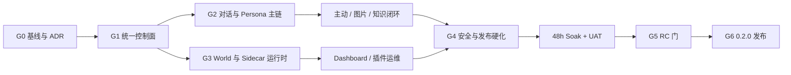

# Aerie 项目二期任务编排

## 0. 文档控制

| 项目 | 内容 |
|---|---|
| 上位计划 | `Aerie_项目二期升级更新计划.md` |
| 编排输入基线 | `8f6e8bd`（Spotlight 主线信息同步完成后的 HEAD） |
| 实施基线 | 必须由 `P2-00-B01` 在实际开工时重新冻结，不直接沿用本文输入基线 |
| 计划周期 | 2026-07-27 至 2026-11-29，共 18 周 |
| 阶段门 | G0、G1、G2、G3、G4、G5、G6 |
| 公开官网 | <https://laser1209.github.io/Aerie_Spotlight/> |
| 当前状态 | `P2-00-B01`、`P2-00-B02`、`P2-00-B04`、`P2-00-B06`、`P2-00-B07` Done；`P2-00-B03` Review；`P2-00-B05` Blocked/未授权；B07 将离线 E2E 推进到 `18/21`，但 `B02-BLK-005` 与 G0 仍 Open，未通过前不得开始功能实现 |

本文把上位计划中的 P2-00 至 P2-12 转换为可领取、可验收、可回滚的最小批次。上位计划负责范围、架构和质量标准，本文负责顺序、责任、依赖、状态和证据。发生冲突时以上位计划、已批准 ADR、当前代码事实的顺序裁决。

## 1. 执行原则

1. 不重写现有主链；配置、对话、Persona、World 和 Dashboard 必须接入现有所有权边界。
2. 每批只交付一个可独立验收的目标，禁止以“整个工作包”作为一次提交单位。
3. 默认 Flag off；没有兼容路径、测试和回滚证据的功能不得进入灰度。
4. 共享合同先写 Red 测试和 ADR，再修改实现；合同变更按串行顺序合并。
5. 用户未提交改动、运行数据、缓存、日志、密钥和本地路径不得进入批次提交。
6. 每个阶段门单独审查，未通过不得用“后续补测”进入下一阶段。
7. `P2-02` 是贯穿式灰度包：W4 只完成 Identity/Persona/Conversation 子批；W6 完成 Queue/Context/Stream 子批；W8 完成 Proactive/Image 子批后才可整体 Done。
8. W16 起冻结功能。之后只允许独立 `DEF-xxx` 缺陷批次；任何代码、配置或 schema 变化都重新计算受影响门禁，稳定性变化重新开始 48 小时 soak。

## 2. 状态模型与 WIP

批次状态统一为：

```text
Blocked -> Ready -> Red -> Implementing -> Verification -> Review -> Done
```

| 状态 | 进入条件 | 退出条件 |
|---|---|---|
| Blocked | 依赖、ADR、数据备份或阶段门未满足 | 所有依赖有可追踪证据 |
| Ready | 目标、Owner、文件范围、非目标和回滚已确认 | Red 测试已提交或可复现失败已记录 |
| Red | 新测试以预期原因失败 | 最小实现开始 |
| Implementing | 仅修改批次拥有的模块 | 关联测试通过，进入综合验证 |
| Verification | 契约、回归、性能、安全、数据或 UI 证据齐全 | Reviewer 接受证据 |
| Review | diff、风险、回滚、文档和 Evidence 已复核 | 阶段门允许且 PO/Reviewer 批准 |
| Done | DoD 全部满足 | 后续回归失败时重新打开 |

WIP 规则：

- 每名 Owner 同时最多 1 个 Implementing 批次、1 个 Verification 批次。
- `Pipeline`、`ContextBuilder`、`EventEnvelope`、配置 schema、World RPC 和迁移账本一次只允许一个写入批次。
- G0、共享协议冻结、阶段门审查、RC 冻结和 G6 批准必须串行。
- 单人实施时仍保留 Owner/Reviewer 分离：实现者完成自检后，另开独立审查轮次，不在同一轮自批。
- Blocked 批次不得通过临时 stub、复制状态或平行 API 绕过依赖。

## 3. 角色与责任边界

| 代码 | 角色 | 主要责任 | 不可替代决策 |
|---|---|---|---|
| PO | 作者/产品负责人 | 范围、体验、UAT、例外批准 | G5 Major 例外、G6 最终批准 |
| ARCH | 主开发/架构负责人 | ADR、共享合同、集成与 G0-G4 协调 | 主链、所有权和兼容策略 |
| CORE | Python Core 负责人 | 配置、对话、Persona、图片、知识与主动行为 | Core 数据和业务语义 |
| WORLD | World/Sidecar 负责人 | Scheduler、WorldPort、world.db、恢复与协议 | World 数据和副作用边界 |
| DESK | Electron 负责人 | Main、Preload、Supervisor、Dashboard 与桌面生命周期 | 窗口、IPC 和桌面运行时 |
| QA | 独立验证负责人 | 测试、基线、证据、缺陷分级、soak | 阶段门测试结论 |
| SEC | 安全审计负责人 | IPC、CSP、权限、秘密、插件与供应链 | 安全阻断和风险接受建议 |
| REL | 发布负责人 | CI、版本、打包、签名、升级、回滚和 Release | 发布产物一致性 |

单人基线下 ARCH、CORE、WORLD、DESK、REL 可由同一人承担，但 QA 复核与 PO 批准仍需作为独立步骤记录。

## 4. 工作流与关键路径



关键路径：

```text
G0 -> G1 -> G3 -> Dashboard/插件运维 -> G4 -> Soak/UAT -> G5 -> G6
```

允许的并行：

- G1 后并行“对话/认知”和“世界/桌面”两条线。
- P2-03 与 P2-04 可并行，但共享合同变更串行合并。
- P2-06-B01 可与 P2-05 并行；真实投递必须等待 Judge 和幂等派发闭环。
- G3 后 P2-09 Dashboard 与 P2-10 知识/协作可并行。
- P2-11 从 G0 起横向执行；P2-12 可提前建设 CI，但验收必须等待全部功能包。

## 5. 批次合同

每个批次必须在任务描述或 PR 中填写：

```yaml
batch_id: P2-XX-BNN
work_package: P2-XX
week: WN
gate: G0-G6
objective: 一句话目标
owner: ROLE
reviewer: ROLE
owned_modules: [明确文件或目录]
dependencies: [批次、合同或阶段门]
feature_flag: flag_name_or_none
default_state: false
data_impact: none_or_migration_id
compatibility_path: 旧路径或 Flag-off 行为
rollback: L0-L4 与具体步骤
tests: [Red 测试, 关联测试, 全量回归, 故障测试]
evidence_types: [TST, DATA]
evidence: 脱敏证据索引
risk_ids: [R-XX]
non_goals: [本批明确不做的内容]
status: Ready
```

证据代码：

| 代码 | 证据 |
|---|---|
| BAS | HEAD、依赖、环境、测试和性能基线 |
| TST | 单元、契约、集成、E2E 和回归 |
| CON | API、事件、schema、ADR 和兼容合同 |
| DATA | dry-run、守恒、quick_check、备份和恢复 |
| PERF | CPU、内存、延迟、吞吐、句柄和 soak |
| SEC | secret、IPC、CSP、权限、依赖和包内容扫描 |
| UX | 视觉、响应式、DPI、键盘和无障碍 |
| OPS | 进程、端口、崩溃、退避、熔断和恢复 |
| REL | CI、版本、安装包、签名、hash、SBOM 和 Release |

回滚代码：

| 级别 | 说明 |
|---|---|
| L0 | 关闭 Flag，切回旧读路径或 Adapter |
| L1 | Remote -> InProcess -> Null，外部能力降级但保留本地聊天 |
| L2 | 回退上一签名应用版本，保留兼容 schema |
| L3 | 恢复上一配置 revision/备份 |
| L4 | 停止写入，恢复已验证数据备份并安全重放 |
| FWD | 缺陷或安全修复没有可接受的旧状态，只允许前滚；撤回即重新打开阻断 |

## 6. 可执行批次总表

依赖列只使用完整批次 ID、G0-G6 阶段门或“无”；“产出门禁”只记录该批次通过后可关闭的阶段门；回滚列使用 L0-L4、FWD 或“无状态变更”，历史重写等破坏性批次可在获授权后引用独立恢复方案。

### 6.1 G0-G2：基线、控制面与对话主链

| 周 | 批次 | 目标 | 依赖 | Owner / Reviewer | 证据 | 产出门禁 | 回滚 | 当前状态 |
|---|---|---|---|---|---|---|---|---|
| W1 | P2-00-B01 | 冻结实际 HEAD、工作区归属、工具链和隔离数据目录 | 无 | ARCH / QA | BAS | - | 无状态变更 | Done |
| W1 | P2-00-B02 | 重采测试、性能、安全和包内容基线 | P2-00-B01 | QA / ARCH | TST, DATA, PERF, SEC | - | 无状态变更 | Done |
| W1 | P2-00-B03 | 完成追踪矩阵、ADR、所有权和风险责任人 | P2-00-B01、P2-00-B02 | ARCH / PO | CON | G0 | 无状态变更 | Review |
| W1 | P2-00-B04 | 清理当前树候选并修复 scanner/preflight false-pass | P2-00-B02 | SEC / QA | TST, SEC | - | FWD | Done |
| W1 | P2-00-B05 | 经授权治理历史 refs 并完成隔离全 refs 复扫 | P2-00-B04、明确授权、可验证备份/恢复合同 | SEC / PO、QA | SEC, BAS | - | 专用历史恢复方案 | Blocked / 未授权 |
| W1 | P2-00-B06 | 修复 QQ disabled 未处理后台异常并验证无连接副作用和干净退出 | P2-00-B02 | CORE / QA | TST, OPS | - | FWD | Done |
| W1 | P2-00-B07 | 修复 Force E2E 仓库根路径并复跑 21 项离线 allowlist | P2-00-B02 | QA / ARCH | TST, BAS | - | FWD | Done |
| W2 | P2-01-B01 | 配置 schema 与 effective snapshot | G0 | CORE / QA | CON, TST | - | L0 | Blocked |
| W2 | P2-01-B02 | revision、依赖校验、原子写和备份 | P2-01-B01 | CORE / QA | TST, DATA | - | L3 | Blocked |
| W3 | P2-01-B03 | FeatureFlags 委托、API 和秘密脱敏 | P2-01-B02 | CORE / SEC | CON, SEC | - | L0, L3 | Blocked |
| W3 | P2-01-B04 | Electron 接入、动态/重启语义和来源展示 | P2-01-B03 | DESK / QA | CON, UX | G1 | L0, L3 | Blocked |
| W3 | P2-11-B01 | correlation ID、健康和指标骨架 | G0 | ARCH / SEC | PERF, SEC | - | L0 | Blocked |
| W4 | P2-02-B01 | Ring、Flag 依赖和组合回退测试框架 | G1 | ARCH / QA | TST, CON | - | L0 | Blocked |
| W4 | P2-02-B02 | Identity/Persona/Conversation shadow 核对 | P2-02-B01 | CORE / QA | DATA, TST | - | L0, L4 | Blocked |
| W4 | P2-03-B01 | Persona 投影与八模块 Prompt 合同 | P2-02-B02 | CORE / QA | CON, DATA | - | L0 | Blocked |
| W5 | P2-03-B02 | 摘要、Topic、关系历史和恢复 | P2-03-B01 | CORE / QA | TST, DATA | - | L0 | Blocked |
| W5 | P2-04-B01 | Canonical 历史、搜索、归档和分支 | P2-02-B02 | CORE / QA | DATA, CON | - | L0 | Blocked |
| W5-6 | P2-04-B02 | Desktop/QQ 统一 Request 入口 | P2-04-B01 | CORE / QA | TST, OPS | - | L0 | Blocked |
| W6 | P2-04-B03 | Provider delta、工具轮和取消 | P2-04-B02 | CORE / QA | TST, PERF | - | L0, L1 | Blocked |
| W6 | P2-04-B04 | 持久事件、重连和最终消息唯一性 | P2-04-B03 | CORE / QA | CON, OPS | - | L0 | Blocked |
| W6 | P2-02-B03 | Queue/Context/Stream 灰度验收 | P2-03-B02、P2-04-B04 | ARCH / QA | TST, DATA, PERF | G2 | L0 | Blocked |

`P2-00-B01` 的 `Done` 表示内容验收完成且提交边界偏差 `DEV-P2-00-001` 已登记并获作者接受，不表示 mixed commit `71b8815` 是纯文档提交；详情见 `00_二期基线与环境冻结.md` 第 8.3 节。

### 6.2 G2 后：主动、图片与知识闭环

| 周 | 批次 | 目标 | 依赖 | Owner / Reviewer | 证据 | 产出门禁 | 回滚 | 当前状态 |
|---|---|---|---|---|---|---|---|---|
| W7 | P2-05-B01 | 全部触发源统一进入候选和 Judge | G2 | CORE / PO | TST, CON | - | L0 | Blocked |
| W7 | P2-05-B02 | 勿扰、mute、上限、反馈和 postpone | P2-05-B01 | CORE / QA | TST, UX | - | L0 | Blocked |
| W7-8 | P2-05-B03 | 幂等多通道投递与 QQ 故障隔离 | P2-05-B02 | CORE / QA | TST, OPS | - | L0, L1 | Blocked |
| W7 | P2-06-B01 | 图片 SQLite 仓储、owner 和 shadow 迁移 | G2 | CORE / QA | DATA, SEC | - | L0, L4 | Blocked |
| W8 | P2-06-B02 | Provider、预算、OCR、Emoji 和 Creative | P2-06-B01、P2-05-B02 | CORE / SEC | TST, SEC | - | L0, L1 | Blocked |
| W8 | P2-06-B03 | 本地/QQ 投递、终态 ACK 和 GC | P2-06-B02、P2-05-B03 | CORE / QA | TST, DATA, OPS | - | L0, L1 | Blocked |
| W8 | P2-02-B04 | Proactive/Image 灰度并关闭整个 P2-02 | P2-05-B03、P2-06-B03 | ARCH / QA | TST, PERF | - | L0 | Blocked |
| W14 | P2-10-B01 | 知识来源、时效、版本、导出和删除 | G2 | CORE / QA | DATA, SEC | - | L0, L4 | Blocked |
| W14 | P2-10-B02 | 可恢复 Task Entity、审批和产物质检 | G2 | CORE / PO | TST, OPS | - | L0, L4 | Blocked |

### 6.3 G1-G3：World、Sidecar 与 Dashboard

| 周 | 批次 | 目标 | 依赖 | Owner / Reviewer | 证据 | 产出门禁 | 回滚 | 当前状态 |
|---|---|---|---|---|---|---|---|---|
| W9 | P2-07-B01 | InProcess Scheduler 与幂等 Tick | G1 | WORLD / QA | TST | - | L0, L1 | Blocked |
| W9-10 | P2-07-B02 | pause/resume、跨午夜、休眠和背压 | P2-07-B01 | WORLD / QA | TST, PERF | - | L0, L1 | Blocked |
| W10 | P2-07-B03 | checkpoint、关系/SelfModel 持久化、崩溃恢复、观察和候选生产闭环 | P2-07-B02 | WORLD / QA | TST, DATA, OPS | - | L0, L1 | Blocked |
| W11 | P2-08-B01 | 独立入口、认证 RPC、握手和 Remote Adapter | P2-07-B03 | WORLD / SEC | CON, SEC | - | L1 | Blocked |
| W12 | P2-08-B02 | Supervisor 启停、退避、熔断和清理 | P2-08-B01 | DESK / QA | TST, OPS, PERF | - | L1 | Blocked |
| W12 | P2-08-B03 | Capability、插件生命周期和回退 | P2-08-B01、P2-08-B02 | DESK / SEC | SEC, OPS | - | L1, L2 | Blocked |
| W12 | P2-11-B02 | World 指标、脱敏和 RPC 负向测试 | P2-11-B01、P2-08-B03 | SEC / QA | PERF, SEC | G3 | L0, L1 | Blocked |
| W13 | P2-09-B01 | desired/actual/effective 控制与订阅 | G3 | DESK / WORLD | CON, OPS | - | L0, L1 | Blocked |
| W13 | P2-09-B02 | 九视图、完整列表和故障状态 | P2-09-B01 | DESK / PO | UX, TST | - | L0 | Blocked |
| W13 | P2-09-B03 | 键盘、DPI、高对比度和隐藏零轮询 | P2-09-B02 | DESK / QA | UX, PERF | - | L0 | Blocked |

### 6.4 G4-G6：安全、发布、Soak 与 UAT

| 周 | 批次 | 目标 | 依赖 | Owner / Reviewer | 证据 | 产出门禁 | 回滚 | 当前状态 |
|---|---|---|---|---|---|---|---|---|
| W14-15 | P2-11-B03 | 窗口专用 preload、窄 IPC、CSP 和导航 | G3 | DESK / SEC | CON, SEC | - | L2 | Blocked |
| W15 | P2-11-B04 | 隐私、安全、供应链和指标总审计 | P2-02-B04、P2-09-B03、P2-10-B01、P2-10-B02、P2-11-B03 | SEC / QA | SEC, PERF | - | 无状态变更 | Blocked |
| W15 | P2-12-B01 | 版本真源、运行时锁、allowlist、CI 和 SBOM | G1 | REL / SEC | REL, SEC | - | L2 | Blocked |
| W15 | P2-12-B02 | 安装、升级、卸载、回退和签名预演 | P2-11-B04、P2-12-B01 | REL / QA | REL, OPS, DATA | G4 | L2-L4 | Blocked |
| W16 | P2-12-B03 | 冻结 Beta、全量回归、迁移和故障注入 | G4 | REL / QA | TST, DATA, OPS, REL | - | L2-L4 | Blocked |
| W16 | P2-12-B04 | 连续 48 小时 soak | P2-12-B03 | QA / ARCH | PERF, OPS | - | L1, L2 | Blocked |
| W17 | P2-12-B05 | 3-5 天 UAT、Win10/11 矩阵和 RC | P2-12-B04 | PO / QA / REL | UX, TST, REL | G5 | L2 | Blocked |
| W18 | P2-12-B06 | 最终回归、签名、hash、SBOM、说明和回滚包 | G5 | REL / SEC / PO | REL, SEC | G6 | L2-L4 | Blocked |

## 7. 阶段门检查表

### G0：基线与 ADR

- [x] 实际 HEAD、分支、依赖锁、工具版本和隔离数据目录已冻结。
- [x] 工作区所有未提交文件完成归属确认；运行数据和秘密明确排除。
- [ ] Python、Electron、E2E、性能、安全、包内容基线可复现。
- [x] 56 个顶层控制行（含 13 个工作包）追踪映射率 100%；实现与当前可复核 Evidence 覆盖率未达 100%。
- [ ] `ADR-P2-009` 至 `ADR-P2-012` 获 PO 批准，且不存在未裁决的所有权或主链冲突。
- [x] R-01 至 R-17 已登记 Owner、独立 Reviewer、触发阈值、控制措施、Evidence、应急与回滚；当前无风险标记 Closed。
- [ ] PO 批准进入 P2-01。

### G1：统一运行控制面

- [ ] Python/Electron 的有效值、来源、revision 和重启要求 100% 一致。
- [ ] 并发冲突、原子写、备份恢复、依赖校验和秘密脱敏通过。
- [ ] Flag 默认 off、依赖顺序、关闭行为和旧路径回退通过。
- [ ] G0 性能和 Flag-off 行为无显著回归。

### G2：对话与 Persona 主链

- [ ] Canonical/Legacy 的计数、顺序、owner、附件和终态守恒。
- [ ] Desktop/QQ 无跨用户、跨 Persona 或跨频道串线。
- [ ] 流式、工具轮、取消、重试、重连和最终消息唯一性通过。
- [ ] 旧接口和 Flag-off 路径可回退，P95 满足基线约束。
- [ ] `P2-02-B03` 仅关闭 Queue/Context/Stream 子批，不提前关闭整个 P2-02。

### G3：World 与 Sidecar 运行时

- [ ] Tick 确定、幂等，pause/checkpoint/恢复不重复副作用。
- [ ] 协议不兼容、认证失败、端口占用和 malformed RPC 被拒绝。
- [ ] Sidecar 崩溃进入退避/熔断，无残留 PID、端口、锁或无限重启。
- [ ] Remote 失败可降级 InProcess/Null，文字聊天不中断。
- [ ] World 指标和 Dashboard 数据完成脱敏。

### G4：安全与发布硬化

- [ ] P2-05、P2-06、P2-09、P2-10 均完成 DoD。
- [ ] 窄 IPC、窗口专用 preload、CSP、sender/schema/path 校验通过。
- [ ] Critical/High 安全问题为 0，秘密和包内容扫描通过。
- [ ] 干净包、全新安装、覆盖升级、卸载保留数据、应用回退和签名预演通过。

### G5：RC

- [ ] 48 小时 soak 内存增长 `< 50 MB`，无事件风暴、死锁、残留句柄或失控重启。
- [ ] 3-5 人、3-5 天 UAT 和 Win10/11 兼容矩阵完成。
- [ ] Blocker/Critical 为 0；Major 清零或有 PO 批准、规避和限定修复版本。
- [ ] `0.2.0-rc.1` 的产物、迁移、已知问题和回滚点冻结。

### G6：正式发布

- [ ] 签名产物可复现，版本源一致，SHA-256、SBOM 和许可证齐全。
- [ ] Release Notes、升级说明、回滚包和完整 Evidence 索引齐全。
- [ ] 公网官网指向 <https://laser1209.github.io/Aerie_Spotlight/>，下载资产与 Release 一致。
- [ ] PO 完成最终批准。

## 8. 18 周日历

| 周 | 日期 | 主任务 | 阶段输出 |
|---|---|---|---|
| W1 | 07-27 至 08-02 | P2-00 基线、追踪、ADR、风险和环境 | G0 |
| W2 | 08-03 至 08-09 | P2-01 schema、effective、revision、备份 | 控制面最小闭环 |
| W3 | 08-10 至 08-16 | P2-01 Electron 接入；P2-11 指标骨架 | G1 |
| W4 | 08-17 至 08-23 | P2-02 Identity/Persona/Conversation；P2-03 Prompt | Shadow 核对，不关闭整个 P2-02 |
| W5 | 08-24 至 08-30 | P2-03 摘要/Topic/关系；P2-04 Canonical | Persona/Context Beta |
| W6 | 08-31 至 09-06 | 统一 Request、Provider delta、持久事件 | G2 |
| W7 | 09-07 至 09-13 | P2-05 触发/反馈；P2-06 图片仓储 | 主动与图片基础闭环 |
| W8 | 09-14 至 09-20 | 图片理解/生成/投递；P2-02 最终灰度 | P2-02 整体关闭 |
| W9 | 09-21 至 09-27 | P2-07 Scheduler、Tick、pause/resume | InProcess World |
| W10 | 09-28 至 10-04 | checkpoint、关系/SelfModel、候选 | World 持久恢复 |
| W11 | 10-05 至 10-11 | P2-08 Sidecar 入口、RPC、握手 | Sidecar Alpha |
| W12 | 10-12 至 10-18 | Supervisor、Capability、故障注入 | G3 |
| W13 | 10-19 至 10-25 | P2-09 控制、九视图、无障碍 | Dashboard Beta |
| W14 | 10-26 至 11-01 | P2-10 知识/任务；P2-11 IPC/CSP | 八层覆盖候选 |
| W15 | 11-02 至 11-08 | 安全/供应链；版本、CI、干净打包 | G4 |
| W16 | 11-09 至 11-15 | 冻结、全量回归、故障注入、48h soak | Beta 冻结 |
| W17 | 11-16 至 11-22 | UAT、安装/升级矩阵、RC 修复 | G5 |
| W18 | 11-23 至 11-29 | 最终回归、签名、说明和发布 | G6 |

## 9. 风险责任矩阵

| 风险 | Owner / Reviewer | 最低自动化控制 | 必需证据 | 首选回滚 |
|---|---|---|---|---|
| R-01 平行主链 | ARCH / QA | 架构守护和入口唯一性测试 | CON, TST | 停止合并，接回现有端口 |
| R-02 双写不一致 | CORE / QA | 计数/顺序/owner 守恒和 dry-run | DATA | L0, L4 |
| R-03 重放副作用 | ARCH；CORE/WORLD 执行 / QA | idempotency、终态、ACK 后置和重放测试 | TST, OPS | 停 consumer 后安全重放 |
| R-04 资源泄漏/风暴 | WORLD、DESK / QA | 有限队列、背压、隐藏停更和 soak | PERF, OPS | L0, L1 |
| R-05 配置漂移 | CORE、DESK / QA | effective snapshot/revision 契约 | CON, TST | L3 |
| R-06 Persona 串线 | CORE / QA；数据事件由 PO 复核 | Actor/Channel/Persona 隔离测试 | DATA, TST | L0, L4 |
| R-07 主动消息打扰 | CORE / PO；QA 验证 | 勿扰、上限、mute 和反馈回归 | TST, UX | L0 |
| R-08 外部依赖 | CORE；其他 Adapter 归所属领域 / QA、PO | 超时、熔断、预算、Mock 和文本降级 | OPS, PERF | L1 |
| R-09 插件/RPC 滥用 | WORLD、DESK / SEC | 本机认证、签名、版本握手和 capability allowlist | SEC, CON | L1, L2 |
| R-10 Renderer 权限 | DESK / SEC | sender/schema/path 校验和 CSP | SEC, TST | L0, L2 |
| R-11 包夹带数据 | REL / SEC | allowlist 与禁入清单扫描 | SEC, REL | 阻断发布、核对撤销/轮换 |
| R-12 版本不一致 | REL / QA | 单一版本源和安装矩阵 | REL | L2 |
| R-13 工作区误覆盖 | ARCH / PO | G0 清点、显式暂存、逐文件 diff | BAS | 停止并保留现场 |
| R-14 范围挤压 | PO / ARCH；QA 守门 | WIP、阶段门、Must/Should/Could | BAS | 延后非核心范围 |
| R-15 Windows 兼容 | DESK、WORLD / QA | DPI、休眠、Unicode、端口和杀软矩阵 | UX, OPS | L1 |
| R-16 低质知识 | CORE / PO；QA 验证 | source/confidence/version 和人工确认 | DATA, TST | L0, L4 |
| R-17 模拟边界 | PO；DESK 实施 / QA | `source=simulated` 合同和 UI 文案检查 | CON, UX | 暂停展示 |

## 10. 证据与提交纪律

1. 大型原始日志、截图、trace 和性能样本保留在 CI 或受控本机目录；Git 只保存脱敏摘要、命令、版本、耗时、hash、结论和审核人。
2. 每个批次至少有一个 Red 证据、一个关联通过证据和一个回滚证据；涉及数据必须额外有 dry-run 和恢复证据。
3. 提交前运行 `git diff --check`，显式暂存批次文件；禁止使用会混入运行态文件的宽范围暂存。
4. `data/`、`logs/`、`.env`、`.venv`、上传、缓存、备份、手动测试 profile 和用户目录不得进入提交或安装包。
5. 阶段门证据必须能从 commit、批次 ID、测试命令和 Evidence 索引双向追踪。
6. 官网公开入口统一为 <https://laser1209.github.io/Aerie_Spotlight/>；本地开发地址不得作为交付链接。

## 11. 启动顺序

`P2-00-B01` 与 `P2-00-B02` 已完成独立 Review；B02 的 Done 表示证据采集完成，不表示失败项已通过。`P2-00-B04` 已关闭 scanner false-pass，但只把 `B02-BLK-001` 推进到“当前树已处置、历史仍 Open”；`P2-00-B06` 已关闭 QQ disabled 后台异常；`P2-00-B07` 已收口 Force E2E 的仓库根路径子项，但 `B02-BLK-005` 仍为 Open。P2-00-B03 已进入 PO Review；当前只允许完成 B03 审核和独立治理 G0 阻断，G0 通过前仍禁止进入功能实现。后续依次执行：

1. `P2-00-B01`：记录实际 HEAD、工作区归属、运行数据排除清单、工具版本和隔离数据目录。
2. `P2-00-B02`：已在同一基线完成 Python、Electron、E2E、性能、数据、安全、依赖和包内容采样；失败与 Not Run 详见 `04_二期测试与证据索引.md`。
3. `P2-00-B03`：`01_二期需求追踪矩阵.md`、`02_二期架构决策记录.md`、`03_二期风险登记册.md` 已形成 Review 稿；待 PO 审核候选 ADR、边界和风险接受情况。B03 只提供 G0 的治理证据，不能单独关闭 G0。
4. `P2-00-B04`：当前树清理、scanner/preflight Red/Green 和脱敏 Evidence 已完成；`B02-BLK-002` Closed。
5. `P2-00-B05`：保持 Blocked/未授权；只有针对本次候选取得明确历史改写与 `--force-with-lease` 授权，并先完成备份/恢复合同后才可启动。
6. `P2-00-B06`：QQ disabled Red/Green、全回归、隔离生命周期和独立 Review 已完成；`B02-BLK-006` Closed，其他 OPS/G0 缺口不受影响。
7. `P2-00-B07`：Force E2E 的 repo-root Red/Green、21 项离线 allowlist 和全回归已完成；当前 `18/21`，`B02-BLK-005` 保持 Open，其余三个根因进入后续独立批次或合同裁决。
8. G0 通过后将 `P2-01-B01` 与 `P2-11-B01` 置为 Ready；其余批次继续 Blocked。

任何批次启动前都重新核对当前代码、依赖和已批准 ADR；不得把本文中的文件名或日期当作无需验证的运行时事实。

## 12. 二期完成清单

- [ ] P2-00 至 P2-12 每个工作包的所有批次均为 Done。
- [ ] 需求、架构、风险、测试、部署、回滚和发布证据覆盖率 100%。
- [ ] Flag off 与一期基线一致，新能力可以按依赖灰度和独立回退。
- [ ] 数据迁移可重复、中断可恢复，所有权、计数、顺序、外键和附件引用守恒。
- [ ] Blocker/Critical 为 0，Major 清零或有批准例外。
- [ ] 48 小时 soak、UAT、兼容矩阵、安装/升级/回退和签名验证通过。
- [ ] 签名产物、SHA-256、SBOM、Release Notes、回滚包和官网链接一致。
- [ ] G6 获得 PO 最终批准。
