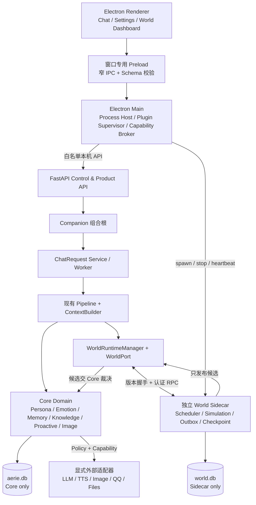
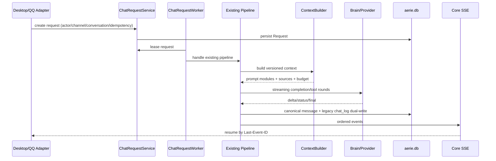
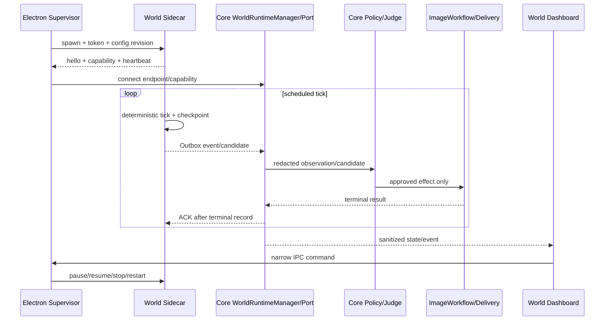
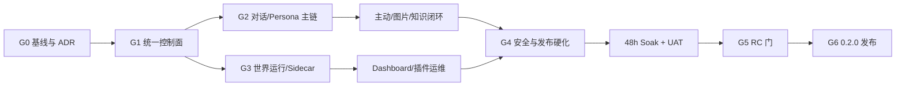

# Aerie 项目二期升级更新计划

> 本文档是 Aerie 二期升级的实施主计划，目标是在完整保留现有架构、功能、数据和兼容路径的前提下，将一期已经建立的“可兼容、可回滚合同基线”升级为可配置、可持续运行、可观测、可恢复、可发布的产品能力。

## 0. 文档控制

| 项目 | 内容 |
|---|---|
| 文档名称 | Aerie 项目二期升级更新计划 |
| 计划版本 | v1.0 |
| 编制日期 | 2026-07-21 |
| 计划周期 | 18 个自然周，其中 16 周实施与验证、2 周发布及风险缓冲 |
| 当前代码分支快照 | `Aerie-Model-X` |
| 编制基线 HEAD | `e90b84c383fdd98d8772a27b23f437d8b98ec0ba`；P2-00 必须以二期任务启动时的实际 HEAD 重新冻结实施基线 |
| 目标版本建议 | `0.2.0`，先发布 `0.2.0-beta.1` 与 `0.2.0-rc.1` |
| 文档状态 | 执行候选稿，需在 G0 基线门确认后冻结 v1.0 |
| 当前执行状态 | `P2-00-B01` Done；`P2-00-B02` Ready；`DEV-P2-00-001` 已登记；G0 Open，尚未进入 `P2-01` 及 G0 后功能批次 |
| 核心原则 | 保留现有架构、增量演进、旧路径可回退、数据不破坏、能力默认受控 |

### 0.1 文档权威顺序

发生描述冲突时，按以下优先级裁决：

1. `documents/Level_up/AI_Vibe_Coding/` 中的主控计划、已接受 ADR、核心合同和全局验收文件。
2. Phase 00–15 的阶段文件、任务文件及已脱敏 Evidence。
3. 当前代码、测试和可复现实验结果；代码现状优先于历史计划中的旧判断。
4. `documents/Ita/Ita_Aerie_Companion_Spec.md`，作为产品愿景、人格原则和八层能力来源。
5. `documents/Level_up/` 下的六份原始升级方案，作为需求池，不再作为平行实施路线。
6. `documents/Level_up/实施计划.md`，仅作为 2026-07-20 实施前审计快照；其中“尚未实现”的判断不得覆盖 Phase 00–15 的后续交付事实。

### 0.2 计划用语

| 用语 | 定义 |
|---|---|
| 一期基线 | Phase 00–15 已完成的代码、合同、测试和回滚能力 |
| 二期升级 | 对一期能力进行激活、整合、持久化、常驻化、产品化和发布硬化 |
| 旧路径 | Feature Flag 关闭时当前仍可工作的 API、Pipeline、`chat_log`、QQ、桌面端及适配器路径 |
| Canonical 模型 | `Conversation / Turn / Message / Request` 四表及其 Repository/Service 语义 |
| Core | Python 主进程及 `core/` 所有领域与副作用裁决模块 |
| Sidecar | 独立拥有 `world.db` 的世界运行服务 |
| 期望状态 | 用户配置希望系统达到的运行状态，例如 enabled/running/paused |
| 实际状态 | 运行时真实状态，例如 starting/healthy/degraded/fused |
| 零副作用回退 | Flag 关闭或组件失败时，不新增外呼、投递、ACK、数据库写入或后台任务 |

### 0.3 执行摘要

一期已经完成迁移框架、身份合同、Persona Hub、Canonical 会话四表、持久请求队列、SSE 恢复、Context Budget、主动消息反馈、图片资产与工作流、WorldPort、世界协议、Sidecar 存储基线、图片候选合同和 Dashboard 页面壳。二期不得重新实现这些模块，也不得创建长期并行的 `Pipeline v2`、`ContextBuilder v2` 或第二套世界数据库。

当前核心差距不是“没有代码”，而是多项能力仍处于默认关闭、同进程、内存态、手动触发或单次调用状态。例如，24 小时世界只有按调用 Tick，没有常驻调度；Sidecar 仍是进程内对象；Plugin Supervisor 只记录状态；Dashboard 的显示/隐藏不等于启停；Python 与 Electron 对 Feature Flag 的读取来源不一致；聊天 SSE 是完整响应后的事件流，不是 Provider Token 流式。

二期采用 13 个工作包推进，优先顺序为：先建立基线与统一控制面，再灰度启用和收敛核心数据路径，然后完成世界/插件/图片/知识闭环，最后进行安全、打包、稳定性和发布硬化。任何新能力失败时，原有聊天、主动消息、图片和 QQ 路径必须继续工作。

---

## 1. 当前基线与二期定位

### 1.1 当前系统基线

| 能力域 | 一期已交付 | 二期定位 |
|---|---|---|
| 启动与组合根 | Electron 启动 Python；`Companion` 组合数据库、身份、Persona、Brain、情绪、记忆、知识、工具、Pipeline、主动消息和 WorldPort | 收敛隐式组合点，增加明确生命周期与健康状态，不替换 `Companion` |
| 对话主链 | 现有 `Pipeline` 已包含身份、情绪、历史、上下文、工具、校验、拆泡、持久化、事件和 QQ 投递 | 继续演进同一 Pipeline，增加统一请求入口、真实流式、Canonical 读路径和可取消边界 |
| 会话与请求 | Canonical 四表、迁移、持久 Request、lease、heartbeat、取消、重试和并发控制已存在 | 逐步把 Desktop/QQ/历史读取统一到 Canonical 模型，保留 `chat_log` 双写和旧 API |
| Persona 与上下文 | Persona Hub、Legacy Projector、ContextBuilder、Memory/Knowledge/World/Relationship/SelfModel 注入已存在 | 收敛单一真源、增加 Prompt 模块版本、滚动摘要、TopicTracker 和检索审计 |
| 主动行为 | Scheduler、DesireEngine、EventEngine、ProactiveJudge、勿扰、上限、mute、postpone、feedback 已存在 | 补齐触发源、设置界面、统计闭环和跨通道一致性，仍由 Core 最终裁决 |
| 图片 | 安全解码、像素限制、规范化、EXIF 清理、哈希去重、缩略图、GC、生成/理解/审核与幂等工作流已存在 | 增加所有权、SQLite 任务状态、真实投递、Provider 路由、OCR/Emoji 和预算治理 |
| 世界 | Null/InProcess/Remote Adapter、确定性 Tick、ActionRegistry、关系、SelfModel、`world.db`、Outbox/ACK/checkpoint/heartbeat 已存在 | 完成独立进程、常驻 Tick、暂停恢复、观察闭环、候选生产与故障恢复 |
| Dashboard | 窄 preload 命名空间、脱敏快照、候选审批、创意元数据预览和基础测试已存在 | 增加真正的启停控制、实时状态、完整列表、可访问性和插件运维能力 |
| 安全 | Prompt 注入检测、权限管理、工具隔离、Sandbox、响应校验、Renderer 隔离和部分白名单已存在 | 收窄全局 IPC、窗口级能力隔离、CSP、插件签名、构建供应链和发布签名 |
| 发布 | Electron Builder、NSIS/Portable 配置和历史发布检查已存在 | 统一版本真源、建立 CI、可复现运行时、签名、SBOM、安装升级回滚烟测 |

### 1.2 Phase 00–15 交付边界

| Phase | 已完成的合同基线 | 二期不得误判为未实现的内容 |
|---|---|---|
| 00–03 | 迁移框架、身份合同、Persona 真源、Canonical 四表和历史回填 | 不重建数据库框架、身份系统或第二套会话模型 |
| 04 | 持久 Request 队列、取消、重试、纯附件和状态守恒 | 不另建任务队列；扩展现有 Service/Worker |
| 05–07 | SSE 恢复、Renderer 去重、Context Budget、Memory/Knowledge 注入、Typing、多气泡和 Pacing | 不重做事件流、ContextBuilder 或 Message Splitter |
| 08 | cooldown、feedback、mute、postpone 和策略持久化 | 不绕过 ProactiveJudge 新建主动推送器 |
| 09–10 | 图片资产、安全清洗、去重、缩略图、图片理解/生成/审核/投递工作流基线 | 不让 World 或 Renderer直接执行图片副作用 |
| 11–12 | WorldPort、能力白名单、Null/InProcess、确定性世界、动作、关系和 SelfModel | 不绕过 WorldPort 让业务代码直连 Sidecar |
| 13 | `world.db`、Outbox、ACK cursor、heartbeat、Remote Adapter 和 Supervisor 基线 | 不把世界表迁回 `aerie.db` |
| 14 | ImageCandidate、Judge、幂等工作流和终态 ACK | 不新建第二套候选状态机 |
| 15 | Dashboard 页面壳、脱敏快照、候选审批和 Creative Workshop 元数据预览 | 不把当前“显示/隐藏”误认为世界生命周期控制 |

一期发布记录曾达到 Python `559 passed`、Node `25 passed`，并通过历史凭据扫描。该数字只作为历史证据；G0 必须在当前 HEAD 和隔离数据目录下重新采集测试、性能、打包和安全基线。

### 1.3 当前关键缺口

| 编号 | 现状 | 影响 | 二期处理方向 |
|---|---|---|---|
| G-01 | 多数一期 Feature Flag 默认关闭 | “代码已完成”不等于用户实际使用 | 建立依赖矩阵、灰度顺序和有效配置视图 |
| G-02 | Python 读取 YAML+环境变量，Electron 世界模块只读环境变量 | 前后端看到的启用状态不一致 | 单一持久控制面，输出有效值、来源、版本和重启要求 |
| G-03 | 热加载不会重建 FeatureFlags、WorldPort 或后台任务 | UI 修改配置后状态不真实 | 增加事务式运行时重配置和明确 restart-required 状态 |
| G-04 | Desktop 可进 Request Queue，QQ 仍直接调用 Pipeline | 取消、重试、审计和顺序语义不一致 | 统一经过现有 ChatRequestService，保留旧直连回退 |
| G-05 | 历史 API 仍主要读取 `chat_log` | Canonical 四表未成为完整读模型 | 新增 Canonical History API，稳定周期内继续双写核对 |
| G-06 | SSE 在完整模型回复后分段，进程重启丢内存回放 | 不是真正 Token 流式，断点能力有限 | 增加 Provider delta、持久 event cursor/outbox 与降级策略 |
| G-07 | Context Budget 按字符裁剪，无滚动摘要 | 长对话连续性与可解释检索不足 | Token 预算、版本化摘要、TopicTracker 和来源审计 |
| G-08 | Persona 仍有 Hub/YAML 读路径差异 | 人格可能漂移或界面与运行态不一致 | Hub 唯一写真源，YAML 仅生成式只读投影 |
| G-09 | 世界无后台 Tick；首次查询后快照不自动推进 | 24 小时世界不具备持续运行语义 | 常驻调度、暂停恢复、休眠唤醒和 checkpoint 恢复 |
| G-10 | Sidecar 是 Core 内的同进程对象 | 无隔离、独立故障恢复和真实协议验证 | 独立本机进程、认证 RPC、版本握手和自动回退 |
| G-11 | Supervisor 不负责 spawn/stop/restart | 插件无法真实启停和恢复 | 完整生命周期状态机、退避、熔断与资源预算 |
| G-12 | World observation、候选 producer 和后台 consumer 未形成生产闭环 | 关系、事件和图片候选不会持续演进 | 脱敏观察、规则生产、可靠消费和幂等 ACK |
| G-13 | Dashboard 只手动刷新且只展示第一项 | 无法运维和理解世界状态 | 订阅+轮询兜底、完整列表、指标、原因和控制操作 |
| G-14 | 图片 delivery 仍主要是 planned，JSON 索引分散 | 无稳定的真实投递和恢复语义 | 任务状态机、SQLite 仓储、QQ/本地 executor 和所有权校验 |
| G-15 | preload 能力过宽、无 CSP、打包版本与内容不一致 | 桌面安全和发布可靠性不足 | 窄 IPC、窗口最小权限、构建清单、签名和 CI |

### 1.4 原始八层产品架构与当前工程映射

| 原始层级 | 产品职责 | 当前主要模块 | 二期完善重点 |
|---|---|---|---|
| Foundation 基础层 | 身份、角色档案、价值观和稳定人格 | `core/identity/`、`core/persona_hub/`、`config/persona*.yaml` | Persona 单一真源、Actor/Channel/Persona 所有权、版本化投影 |
| Personality 人格层 | 情绪、关系属性、累积阈值和表达权重 | `core/emotion_engine.py`、`emotion_state_store.py`、`relationship_engine.py`、`desire_engine.py`、`self_model.py` | 关系里程碑、情感记忆、变化原因、冲突修复和用户控制 |
| Cognition 认知层 | 理解、分析、规划、决策和分层记忆 | `core/pipeline.py`、`context_builder.py`、`brain.py`、`cognition.py`、`decision.py`、`memory/` | 摘要、TopicTracker、检索审计、决策轨迹和 Prompt 模块化 |
| Dialogue 对话层 | 自然语言、连续对话、主动行为和对话策略 | `core/chat_request_*`、`conversation_*`、`event_stream.py`、`communication/`、`voice/` | 真流式、统一请求入口、会话管理、Energy/Ending 和跨通道一致性 |
| Behavior 行为层 | 人格到行为、主动/被动行为和长期互动规则 | `proactive_judge.py`、`push_scheduler.py`、`push_event_engine.py`、`task_*`、`qq_deepening.py` | 触发源闭环、反馈自适应、幂等派发和打扰治理 |
| Knowledge 知识层 | 可信知识更新、长期成长和工作协作 | `knowledge/`、`evolution_manager.py`、`brief_fetcher.py`、`office_*`、`skill_*` | 来源/时效/置信度、概念关系、删除审计、任务产物闭环 |
| Safety 安全层 | 隐私、能力、工作、知识和关系边界 | `permission_manager.py`、`prompt_injection.py`、`tool_isolation.py`、`sandbox_runner.py`、`response_validator.py`、`capability-broker.js` | 窗口最小权限、IPC schema、插件签名、审计与供应链安全 |
| Runtime 运行层 | Prompt、上下文、工具、模型、状态和插件运行 | `main.py`、`companion.py`、`api_server.py`、`database.py`、`feature_flags.py`、`world_*`、Electron | 统一控制面、生命周期、可观测性、故障恢复和发布治理 |

二期的“层级架构完善”是把以上产品层映射到现有工程模块并补齐合同，不是按八层重新创建八套平行目录或独立引擎。

---

## 2. 原始设计理念与强制原则

### 2.1 产品理念

1. Aerie 是长期智能伴侣和协作伙伴，不是只响应单轮问答的工具。
2. 多场景身份必须自然融合；桌面、QQ 和办公场景不能表现为互相割裂的不同人格。
3. 人格是思考、判断和行动的因果基础，不是简单的语气模板。
4. 情绪只能调整表达和行动权重，不能推翻价值观、安全边界或事实判断。
5. 决策优先级保持为：安全、事实、用户真实需求、长期关系、任务目标、风格与修辞。
6. 新记忆必须经过验证、观察、确认和更新，不能无依据覆盖既有认知。
7. 工作协作强调共同完成、过程透明、结果可验证，不替代用户做未经授权的决定。
8. 拟人化、主动性和长期运行不能绕过隐私、权限、知识、工具和关系边界。

### 2.2 工程不可变合同

1. 演进现有 `Pipeline` 与 `ContextBuilder`，禁止建立长期平行 v2 主链。
2. Persona Hub 是目标唯一写入真源；旧 YAML 保留为只读兼容投影。
3. `Conversation / Turn / Message / Request` 是目标聊天真源；`chat_log` 至少保留一个稳定发布周期。
4. Desktop 与 QQ 的短期会话隔离，同一 Actor 的长期记忆按既有 ADR 共享。
5. `aerie.db` 只由 Core 写，`world.db` 只由 Sidecar 写；禁止跨库 JOIN、共享连接或同一实体双写两库。
6. Core UI 事件继续使用可恢复 SSE；World 可靠事件继续使用 Outbox、ACK、cursor、checkpoint、heartbeat，二者不合并为一个协议。
7. World 只发布结构化候选；图片生成、审核、持久化、投递和最终 ACK 由 Core 执行。
8. 任何新增能力必须有 Feature Flag、依赖说明、关闭行为、灰度方案和回滚证据。
9. Flag 关闭时保持旧行为，且新模块不得产生数据库、网络、文件、通知、QQ 或模型外呼副作用。
10. 迁移只做增量扩展，保留旧表、旧列、旧文件和新数据；回滚优先切换读写路径，不执行破坏性降级。
11. 所有循环和后台任务必须支持幂等 start/stop、取消、超时、背压、崩溃恢复和进程退出收尾。
12. 每个工作包遵循 Red → 最小实现 → 关联测试 → 全量回归 → 脱敏 Evidence，不混入无关重构。

---

## 3. 升级目标与范围

### 3.1 升级目标

| 目标 ID | 具体目标 | 预期成果 |
|---|---|---|
| O-01 | 激活并产品化一期能力 | 成熟 Phase 能力可通过统一控制面灰度启用，用户可理解有效状态和回退状态 |
| O-02 | 完善八层架构闭环 | Foundation 至 Runtime 的产品职责均有明确工程所有者、接口、数据和验收证据 |
| O-03 | 提升对话连续性 | Desktop/QQ 使用一致的请求语义，支持真流式、取消恢复、Canonical 历史、摘要和话题管理 |
| O-04 | 强化人格与长期关系 | Persona 单一真源，情绪、关系、记忆、SelfModel 的变化可追踪、可解释、可导出和可重置 |
| O-05 | 实现 24 小时世界运行 | 世界可独立启动、停止、暂停、恢复和崩溃恢复，跨午夜与休眠唤醒行为确定且可验证 |
| O-06 | 完成图片与主动行为闭环 | 世界候选、Core 审批、图片工作流、投递和 ACK 形成幂等闭环，主动消息严格服从 Judge 与打扰策略 |
| O-07 | 建立插件和运行安全 | Sidecar 独立进程、最小权限、认证协议、生命周期、签名和故障隔离可运维 |
| O-08 | 提升可观测性与发布质量 | 具备指标、诊断、备份、恢复、CI、可复现打包、签名、SBOM、灰度和回滚能力 |

### 3.2 预期成果

二期结束时应交付：

- 一份冻结的需求追踪矩阵，能够追踪“原始需求 → 一期 Phase → 当前代码/测试 → 二期工作包 → 验收证据”。
- 一个 Python/Electron 一致的运行配置与 Feature Flag 控制面。
- 一条保留现有 Pipeline 的统一对话链，支持 Canonical 读模型、Provider Token 流式与持久恢复。
- 一套版本化的 Persona、Prompt、摘要、话题、关系和知识治理能力。
- 一个真正独立、常驻、可暂停、可恢复的本机 World Sidecar。
- 一个可以启停世界、查看真实运行状态、处理候选和诊断故障的 World Dashboard。
- 一套图片/Emoji/主动行为的所有权、预算、幂等投递和失败降级机制。
- 一个经过安全加固、Windows 兼容验证和 48 小时稳定性测试的 `0.2.0` 发布包。
- 完整的迁移、部署、回滚、测试、UAT、发布和运维证据。

### 3.3 实施范围

#### 范围内

- 现有 Core、Electron、World Sidecar、QQ、图片、知识、Office 和主动行为模块的增量演进。
- 已有 Feature Flag 的依赖整理、灰度启用和运行态一致性。
- Canonical 会话读路径、真流式、持久事件恢复、滚动摘要和话题管理。
- Persona Hub、关系、记忆、SelfModel 与模块化 Prompt 的一致性治理。
- 独立 Sidecar、Plugin Supervisor、Capability Broker 和 Dashboard 的产品化。
- 图片真实投递、OCR/Emoji、多 Provider 显式路由、预算和资产生命周期。
- 知识来源、版本、置信度、时效、删除和工作协作产物闭环。
- 安全加固、可观测性、Windows CI、打包、升级和回滚。
- 必要的新增表、索引、事件字段、API 和 IPC，但必须遵守兼容与所有权约束。

#### 范围外

- 不重写整个 Core，不替换现有技术栈，不引入第二套长期主链。
- 不在二期删除 `chat_log`、旧 API、旧 Persona YAML、Legacy Adapter 或兼容文件。
- 不把 Aerie 改造成云端多租户 SaaS，不引入账户计费和公网控制面。
- 不在未经单独评审的情况下开放第三方任意代码插件市场；二期首发只允许第一方或可信签名包。
- 不训练基础大模型，不自建通用图像/语音模型集群。
- 不承诺所有外部 Provider、QQ/NapCat 版本和全部 Windows 硬件无限兼容；只按验收矩阵支持明确版本。
- 不把模拟世界描述为现实事实、意识或不可控自主生命。
- 不借二期清理与目标无关的用户文件、历史数据、现有配置或未提交改动。

### 3.4 实施边界

| 边界 | 约束 |
|---|---|
| 架构边界 | 新能力通过现有组合根、Port、Repository、Service 或 Adapter 接入，不从 Renderer 直连领域实现 |
| 数据边界 | Core/Sidecar 各写自己的数据库，通过 DTO/协议交换，不跨库耦合 |
| 副作用边界 | 模型、QQ、通知、图片、文件和系统操作由 Core Policy/Capability 最终裁决 |
| 配置边界 | `.env` 仅保存本机秘密；可提交配置不得含真实密钥、账号、私有路径或运行数据 |
| 用户体验边界 | 新能力默认保守启用，失败不得阻断文字聊天；状态必须可见、可解释、可恢复 |
| 发布边界 | 没有全量回归、安全扫描、迁移演练、48 小时 soak 和回滚演练，不得发布稳定版 |

---

## 4. 架构优化方案

### 4.1 目标逻辑架构



### 4.2 模块划分与职责优化

| 模块 | 处理方式 | 目标职责 | 禁止事项 |
|---|---|---|---|
| `Companion` | 演进 | 继续作为 Core 组合根，显式注册生命周期、共享 Repository 和后台任务 | 不在 API 模块再次隐式构造第二套领域对象 |
| `Pipeline` | 演进 | 保留现有身份、情绪、Context、工具、校验、拆泡和投递链，增加流式 hook 与统一 Request Context | 不新建长期平行 Pipeline |
| `ContextBuilder` | 演进 | 组装版本化 Prompt 模块、Token Budget、摘要、话题、来源和检索结果 | 不创建平行 Builder，不让任意模块直接拼接未经审计的 Prompt |
| `RuntimeConfigService` | 建议新增 | 统一默认值、YAML、环境变量和运行态覆盖；返回 effective value/source/revision/restartRequired | 不向前端返回秘密值，不允许任意键写入 |
| `FeatureFlags` | 兼容封装 | 保持现有 `is_enabled()` 接口，内部委托统一配置快照 | 不再让 Electron/Python 各自解释不同来源 |
| `ChatRequestService/Worker` | 扩展 | 统一 Desktop/QQ 请求、取消、重试、lease、顺序和并发语义 | 不删除旧同步入口，Flag off 时必须可回退 |
| `CanonicalReadModel` | 建议新增 | 为历史、会话列表、搜索和分支提供 Canonical 读 API | 不立即停止 `chat_log` 双写或兼容读取 |
| `PromptAssembly` | 建议作为 ContextBuilder 子组件 | 按 Core/Memory/Style/Behavior/Safety/Planning/Tool/Relationship 八模块组装并记录版本/hash | 不保存密钥或完整敏感正文到指标日志 |
| `WorldRuntimeManager` | 建议新增 | 在 Core 内管理期望/实际状态、Port 原子切换、降级、观察和状态查询 | 不负责 Electron 子进程所有权，不直接写 `world.db` |
| `World Sidecar` | 从基线演进 | 独立运行 Scheduler、Simulation、世界仓储、Outbox、checkpoint 和候选生产 | 不写 `aerie.db`，不直接调用 QQ、图片 Provider 或系统工具 |
| `PluginSupervisor` | 扩展 | 管理 spawn、握手、心跳、停止、退避、熔断、进程清理和审计 | 不把原始命令、令牌或配置值暴露给 Renderer |
| `CapabilityBroker` | 接入生产链 | 按插件、窗口、能力和有效期授权，拒绝默认高风险能力 | 不向世界插件授予 QQ 凭据、任意 Shell、主库连接或任意网络 |
| `WorldDashboardHost` | 扩展 | 提供世界专用窄 IPC、状态聚合、命令校验和脱敏 | 不把 `api:request` 当作世界控制接口 |
| Repository/Store | 扩展 | 统一迁移账本、幂等键、所有权、保留、备份和恢复 | 不用无版本 JSON 继续承担关键任务状态真源 |

### 4.3 统一运行控制面

运行控制面必须区分配置、期望状态和实际状态：

```text
持久配置 desired.enabled = true
        ↓
Electron Supervisor actual = starting → handshaking → healthy
        ↓
Core WorldRuntimeManager adapter = remote
        ↓
Dashboard effective = running

任何一步失败：actual = degraded/backing_off/fused
Core 自动切换 InProcess 或 Null，聊天继续，Dashboard 显示原因和恢复动作。
```

配置优先级建议固定为：

1. 进程启动环境变量：只读、最高优先级，适合运维强制覆盖。
2. 经校验写入的本机持久配置：用户界面可修改。
3. 仓库默认配置：最低优先级，不含秘密和机器私有路径。

每项有效配置至少返回：`key`、`effectiveValue`、`source`、`revision`、`mutable`、`requiresRestart`、`dependencies`、`validationErrors`。秘密只返回 `configured: true/false` 和来源，不回显值。

### 4.4 接口设计

以下为 G0/G1 需要冻结的候选合同；最终路径可经 ADR 微调，但语义不可缺失。

| 接口 | 方法 | 用途 | 兼容策略 |
|---|---|---|---|
| `/api/runtime/config/effective` | GET | 读取脱敏后的有效配置、来源、版本和重启要求 | 新增只读接口，不影响旧 YAML API |
| `/api/runtime/config/feature-flags` | PATCH | 只修改白名单 Flag，带 `expected_revision` | 继续保留旧 YAML 编辑；冲突返回稳定错误，不覆盖 |
| `/api/runtime/health` | GET | 返回 Core、队列、Provider、WorldPort、Sidecar、数据库和后台任务分层健康 | 保留 `/api/health` 响应字段，只做向后兼容扩展 |
| `/api/conversations` | GET/POST | Canonical 会话列表与新建 | 旧 `/api/chat/history` 继续可用 |
| `/api/conversations/{id}/messages` | GET | Canonical 历史、cursor 和来源 | `chat_log` 在兼容期继续双写并核对 |
| `/api/world/runtime` | GET | 返回 desired/actual/adapter/lastTick/checkpoint/lag/error | 复用现有 Dashboard snapshot 的公共字段 |
| `/api/world/runtime/commands` | POST | `enable/disable/start/stop/pause/resume/restart`，要求幂等键与预期 revision | Electron 只通过窄 IPC 调用；不开放任意命令 |
| `/api/world/events` | GET/SSE 或本机 RPC stream | Dashboard 状态增量与低频刷新 | Core SSE 与 World Outbox 协议仍分离 |
| `/api/images/tasks/{id}` | GET | 查询图片生成、审核、投递和失败状态 | 现有图片 API 响应继续保留原字段 |

世界控制请求建议使用稳定结构：

```json
{
  "command": "pause",
  "idempotency_key": "ui-generated-opaque-id",
  "expected_revision": 12,
  "reason_code": "user_request"
}
```

响应不得只返回 `ok: true`，至少包含：

```json
{
  "status": "accepted",
  "desired_state": "paused",
  "actual_state": "pausing",
  "revision": 13,
  "fallback_adapter": "inprocess",
  "error_code": ""
}
```

### 4.5 事件与协议设计

#### Core SSE

- 继续使用现有 EventEnvelope、`Last-Event-ID`、有限窗口回放和 Renderer 去重。
- 新增事件只能向后兼容扩展字段，禁止修改现有事件含义。
- Token delta、Request 状态、最终消息、工具状态必须拥有稳定 `request_id/conversation_id/turn_id/event_id/sequence`。
- 进程重启恢复使用持久 event cursor/outbox；内存 replay 继续作为快速路径。
- 日志和指标只记录耗时、计数、状态、脱敏 ID 与 hash，不记录消息正文、Prompt、凭据或附件原文。

#### World 可靠协议

- 保留 `hello/capabilities/replay/ack/checkpoint/heartbeat` 合同。
- 增加 `protocol_version` 兼容区间、服务版本、实例 ID、启动 epoch 和能力版本。
- 采用 loopback + 随机动态端口/命名管道 + 每次启动短期令牌；拒绝非本机、过期令牌和未知 capability。
- 事件至少一次投递，副作用通过 `event_id/idempotency_key/terminal_record` 达成效果上的 exactly-once。
- `pause` 只停止世界推进和候选生产，状态查询、历史读取、ACK 和 checkpoint 保持可用。
- `stop` 必须完成最后 checkpoint、停止接收新任务、排空有限队列并在超时后强制结束。

### 4.6 核心数据流

#### 对话数据流



#### 24 小时世界与图片候选流



### 4.7 数据所有权与迁移路径

| 数据 | 唯一写入者 | 目标存储 | 兼容/迁移要求 |
|---|---|---|---|
| Identity、Conversation、Request、Message | Core | `aerie.db` | 旧 `chat_log` 双写核对至少一个稳定版 |
| Persona | Core Persona Hub | `aerie.db` 或现有 Hub 存储 | YAML 只由 Legacy Projector 生成，不接受双向编辑 |
| 情绪、关系投影、长期记忆、知识 | Core | `aerie.db`/现有 Core 存储 | 增加 owner/version/source，不跨 Actor/Persona |
| 世界 snapshot、action、world relationship、SelfModel、Outbox | Sidecar | `world.db` | 只通过 WorldPort/RPC 读取；Core 不写世界表 |
| 图片资产与任务 | Core | `aerie.db` + `uploads/` | JSON 索引双读迁移，引用守恒后再停止旧写入 |
| Feature Flag 持久配置 | Core Config Service | 版本化本机配置 | 环境变量只读覆盖，Electron 读取有效快照 |
| 插件包与清单 | Electron Host | 专用 plugins 目录 | 原子安装、hash/signature、版本目录和 current 指针 |
| 日志/指标 | 各进程写自己的脱敏日志 | 用户数据目录 | 不进入 Git，不记录正文、密钥、token 或原始 payload |

迁移统一采用 Expand → Backfill/Shadow → Verify → Switch Read → Observe → Contract Later。二期只执行前五步；删除旧列、旧表、旧文件或旧接口必须另立后续版本 ADR。

---

## 5. 功能增强清单

### 5.1 工作包总览

| 工作包 | 优先级 | 主要结果 | 主要依赖 |
|---|---:|---|---|
| P2-00 基线与架构守护 | P0 | 可复现基线、追踪矩阵、ADR、门禁 | 无 |
| P2-01 统一配置与运行控制面 | P0 | Python/Electron 单一有效状态 | P2-00 |
| P2-02 一期能力灰度激活 | P0 | 已完成 Phase 02–10 安全启用 | P2-01 |
| P2-03 Persona、身份、记忆与认知闭环 | P1 | 八模块 Prompt、摘要、话题和关系连续性 | P2-01、P2-02 |
| P2-04 对话流式与会话产品化 | P1 | 统一请求、Canonical 读、真流式和恢复 | P2-01、P2-02 |
| P2-05 主动行为与多通道治理 | P1 | 触发、Judge、反馈和派发闭环 | P2-03、P2-04 |
| P2-06 图片、Emoji 与 Creative 能力 | P1 | 资产、生成、理解、投递和预算闭环 | P2-02、P2-05 |
| P2-07 24 小时世界常驻运行时 | P0 | 可持续、可暂停、可恢复的世界 | P2-01 |
| P2-08 独立 Sidecar、插件与权限生命周期 | P0 | 真进程、认证、监督、签名和回退 | P2-01、P2-07 |
| P2-09 World Dashboard 运维控制 | P1 | 启停、状态、完整数据与故障处理 | P2-07、P2-08 |
| P2-10 知识成长与工作协作闭环 | P2 | 可信知识和可恢复任务交付 | P2-03、P2-04 |
| P2-11 可观测性、隐私与安全加固 | P0 | 指标、窄 IPC、CSP、供应链门禁 | 横向贯穿 |
| P2-12 打包、升级、回滚与发布硬化 | P0 | 可复现、可签名、可升级的 0.2.0 | 全部工作包 |

### 5.2 P2-00：基线与架构守护

| 项目 | 内容 |
|---|---|
| 详细描述 | 重新采集当前 HEAD 的功能、测试、性能、安全、数据和打包基线；建立原始需求到代码与测试的追踪矩阵，冻结二期 ADR 和边界。 |
| 实现思路 | 在隔离 userData、禁 QQ、禁真实模型外呼条件下运行全套 Python/Node/安全检查；记录版本、命令、耗时和脱敏证据。增加架构守护测试，检查 Core/Sidecar 数据所有权、旧 API、Flag-off 零副作用、Persona 真源和 Pipeline 单一主链。 |
| 与现有功能衔接 | 复用一期 `90–95` 验收、迁移、回滚和安全清单；历史 `559/25` 只作对比，不直接继承。当前未提交改动标为“待整合”，不计入稳定发布基线。 |
| 交付物 | 基线报告、需求追踪矩阵、依赖/许可证清单、ADR 索引、风险登记册、测试证据目录规范。 |
| 验收 | 可在干净环境复现；旧路径测试全绿；所有二期需求有唯一工作包与验收条目；无未裁决的架构冲突。 |

### 5.3 P2-01：统一配置与 Feature Flag 运行控制面

| 项目 | 内容 |
|---|---|
| 详细描述 | 消除 Python YAML+env 与 Electron env-only 的双真源，提供用户可理解、可持久化、可审计的 Feature Flag 和运行状态控制。 |
| 实现思路 | 增加 `RuntimeConfigService` 与版本化 schema；现有 `FeatureFlags.is_enabled()` 委托有效快照。提供只读 effective API 和白名单更新 API，使用 revision 乐观锁、原子写入、备份、依赖校验和 restart-required 标记。Electron 通过 Core 获取脱敏有效状态，不自行解释 YAML。 |
| 与现有功能衔接 | 保留环境变量最高优先级、现有 `config/settings.yaml` 和旧 YAML 编辑 API；旧调用无需一次性改签名。热加载只应用声明为 dynamic 的键，其余明确提示重启。 |
| Feature Flag | `runtime_control_v1`；关闭时维持现有读取方式。 |
| 验收 | Python/Electron 对每个 Flag 的有效值与来源 100% 一致；并发写冲突不覆盖；秘密不回显；失败自动恢复备份；Flag off 零新副作用。 |

### 5.4 P2-02：一期能力灰度激活与旧路径观测

| 项目 | 内容 |
|---|---|
| 详细描述 | 按依赖顺序启用一期已完成但默认关闭的身份、Persona、会话、队列、Context、流式、主动和图片能力，并量化新旧路径差异。 |
| 实现思路 | 建立 Flag 组合矩阵与分阶段 Ring：测试 → 本机 shadow → 本机主路径 → Beta。先启用身份/Persona/Canonical 双写，再启用 Request Queue/Context/SSE，最后启用 Proactive/Image。每步记录错误率、延迟、数据守恒和回退结果。 |
| 与现有功能衔接 | 原 API、Pipeline、`chat_log`、旧 Persona 投影和旧同步路径保留；任何指标越界立即切 Flag 回退，不删除新数据。 |
| 主要现有 Flag | `identity_contract_v1`、`persona_hub_source_v1`、`conversation_model_v1`、`chat_request_queue_v1`、`context_budget_v1`、`chat_stream_v1`、`proactive_delivery_v2`、`image_assets_v1`。 |
| 验收 | 每一 Flag 单开、组合开、关闭回退均有自动化证据；新旧消息计数和顺序守恒；无 Actor/Channel/Persona 串线；外部调用只在显式配置时发生。 |

### 5.5 P2-03：Persona、身份、记忆与认知闭环

| 项目 | 内容 |
|---|---|
| 详细描述 | 将 Foundation、Personality、Cognition 三层在现有工程中闭环，确保人格、情绪、关系、记忆、话题和决策长期连续且可解释。 |
| 实现思路 | Persona Hub 唯一写入，Legacy Projector 生成 YAML；为 Persona 增加 schema/version/hash。ContextBuilder 内增加八模块 Prompt Assembly、Tokenizer 预算、滚动摘要、TopicTracker、检索来源/分数/时效和注入隔离。关系增加里程碑、变化原因、冲突修复历史及导出/重置。 |
| 与现有功能衔接 | 继续使用现有 IdentityResolver、EmotionEngine、Memory、Knowledge、RelationshipEngine、SelfModel、ContextBuilder 和 Pipeline；只通过子组件与 Repository 增量扩展。情绪不得覆盖 Persona 价值观或 Safety Prompt。 |
| 建议 Flag | `prompt_contract_v1`、`conversation_summary_v1`、`topic_tracker_v1`、`relationship_history_v1`。 |
| 验收 | 同一 Actor 跨通道长期记忆符合 ADR，短期会话不串线；Prompt 模块可追踪版本/hash/来源；摘要可重复生成且不丢关键事实；关系变化有原因且可回退。 |

### 5.6 P2-04：对话流式、上下文和会话产品化

| 项目 | 内容 |
|---|---|
| 详细描述 | 让 Desktop 与 QQ 获得一致的持久请求、真流式、取消、重试、历史、搜索、归档和恢复体验。 |
| 实现思路 | QQ 与 Desktop 都经现有 ChatRequestService/Worker；新增 Canonical History/Conversation Read Model。Brain Adapter 支持 Provider token delta，Pipeline 仍负责工具轮、后处理、输出校验和语义拆泡。事件写入持久 outbox/cursor，SSE 保留内存快速回放。增加连续输入合并、EnergyMatcher、EndingDetector、会话新建/归档/搜索/分支。 |
| 与现有功能衔接 | 保留 `Pipeline.handle()`、旧 `/api/chat/send/history/poll`、stderr IPC、现有 splitter 和 pacing；Flag off 回到当前完整响应路径。Canonical 与 `chat_log` 双写并后台核对。 |
| 建议 Flag | `canonical_history_read_v1`、`provider_stream_v1`、`persistent_chat_events_v1`、`conversation_management_v1`。 |
| 验收 | 首 delta、Typing、取消和断连恢复达到性能门槛；工具调用不会泄漏半成品；同 Conversation 串行、跨 Conversation 并发语义不变；重启后不重复最终消息。 |

### 5.7 P2-05：主动行为、反馈学习和多通道治理

| 项目 | 内容 |
|---|---|
| 详细描述 | 补齐主动消息触发源、策略面板、反馈统计和多通道派发，形成“触发 → Judge → 排程 → 投递 → 反馈 → 策略更新”闭环。 |
| 实现思路 | 将天气、日历、Todo、纪念日、情绪阈值、记忆回溯、Idle/Desire 统一转换为候选事件；全部经过 ProactiveJudge、静默时段、每日上限、场景 mute、postpone 和成本预算。投递使用幂等键和终态记录，负反馈降低频率，用户可查看和重置策略。 |
| 与现有功能衔接 | 复用 PushScheduler、PushEventEngine、DesireEngine、ProactiveJudge 和现有反馈 API；禁止新增旁路 Scheduler。QQ 离线时遵守现有暂停/本地降级语义。 |
| 建议 Flag | 继续使用 `proactive_delivery_v2`，新增触发源使用独立子 Flag。 |
| 验收 | 任一触发源均不能绕过 Judge；静默、mute、上限和负反馈 100% 生效；重复重试不重复发送；QQ 故障不影响本地聊天。 |

### 5.8 P2-06：图片资产、视觉、Emoji 与 Creative 能力产品化

| 项目 | 内容 |
|---|---|
| 详细描述 | 把现有安全图片基线提升为具有所有权、任务状态、真实投递、检索、预算、OCR/Emoji 和创意内容生命周期的完整能力。 |
| 实现思路 | 将关键 JSON 索引/工作流状态迁移到版本化 SQLite Repository，保留双读；增加 owner 校验、引用计数、配额、保留、搜索和 GC。Provider 采用显式配置、路由、超时、熔断和成本预算。实现本地/QQ delivery executor、OCR、表情包识别/收藏/去重和 Creative Workshop 真实预览/生成任务。 |
| 与现有功能衔接 | 复用 AttachmentHandler、ImageWorkflow、ImageSafetyPolicy、现有上传/生成/理解 API 和 WorldImageCandidateConsumer。World 仍只发布候选，Core 完成审核、生成、持久化、投递和终态 ACK。 |
| 建议 Flag | `image_asset_store_v1`、`image_delivery_v1`、`emoji_library_v1`、`creative_tasks_v1`。 |
| 验收 | 失败不阻断文字聊天；重复/重试不产生重复文件或消息；owner 隔离成立；GC 不删除被引用资产；未显式配置 Provider 时零外呼。 |

### 5.9 P2-07：24 小时世界常驻运行时

| 项目 | 内容 |
|---|---|
| 详细描述 | 将当前按调用 Tick 的确定性世界升级为可持续运行、暂停、恢复、回放和从 checkpoint 恢复的 24 小时模拟。 |
| 实现思路 | 在 Sidecar 内增加可注入时钟的 Scheduler，使用单调时钟调度、墙上时间决定 phase；Tick 幂等并受速率/背压预算约束。持久化 snapshot、action、relationship、SelfModel、last tick 和 checkpoint。处理跨午夜、时区、系统休眠、时钟回拨、漏 Tick 合并和冷启动恢复。 |
| 与现有功能衔接 | 复用 WorldSimulation、ActionRegistry、RelationshipEngine、SelfModel、WorldPort DTO 和现有 Outbox/ACK/checkpoint。先在 InProcess 模式验证，再切 Remote Sidecar；保留 Null/InProcess 回退。 |
| 建议 Flag | `world_runtime_loop_v1`，依赖现有 `world_inprocess_v1` 或 `world_sidecar_v1`。 |
| 验收 | 启动后无需 API 查询即可持续推进；跨午夜固定 seed/clock 结果一致；pause 不推进但可查询；崩溃恢复不重复事件；所有模拟事实标记 `source=simulated`。 |

### 5.10 P2-08：真实 Sidecar、插件进程与权限生命周期

| 项目 | 内容 |
|---|---|
| 详细描述 | 把进程内 LocalWorldSidecarService 与记录型 Supervisor 升级为真实隔离进程、认证协议和完整插件生命周期。 |
| 实现思路 | 增加 `python -m world_service` 入口；Electron Supervisor 状态机为 `disabled → starting → handshaking → healthy/degraded → backing_off/fused → stopping`。使用动态端点、短期令牌、版本握手、心跳超时、指数退避、崩溃预算、优雅退出和残留进程清理。CapabilityBroker 接入插件/窗口/能力/有效期。 |
| 与现有功能衔接 | RemoteWorldAdapter 从 duck-typed 调用切换到真实 transport，但保持 WorldPort 方法语义。握手失败或版本不兼容时自动回到 InProcess/Null，聊天主链不依赖 Sidecar 可用性。 |
| 建议 Flag | `world_process_supervision_v1`，依赖 `runtime_control_v1`；现有 `world_sidecar_v1` 作为用户可见总开关。 |
| 验收 | 可真实 spawn/stop/restart；停止后无残留进程；版本不兼容稳定拒绝；令牌不落日志；连续崩溃进入熔断；回退时聊天和旧主动路径继续工作。 |

### 5.11 P2-09：World Dashboard 与前端运维控制

| 项目 | 内容 |
|---|---|
| 详细描述 | 将 Dashboard 从状态页面壳升级为用户可安全操作、理解和恢复世界运行的运维界面。 |
| 实现思路 | UI 明确分离“启用/停用世界”“启动/停止进程”“暂停/恢复模拟”“显示/隐藏面板”。采用事件订阅+低频轮询兜底，隐藏时停止刷新。完整展示 Overview、World Timeline、Relationship、SelfModel、Actions/Events、Image Candidates、Plugin Health、Creative Workshop、Release/Diagnostics 九个视图。 |
| 与现有功能衔接 | 继续使用 `window.aerie.worldDashboard` 窄命名空间、现有脱敏快照和候选审批；扩展字段保持白名单。现有 show/hide 只保留为面板可见性操作。 |
| UI/可访问性 | 增加 loading/empty/offline/degraded/fused 状态、结构化错误、恢复动作、tab/tabpanel ARIA、`aria-live`、键盘/焦点、高对比度和减少动画支持。 |
| 建议 Flag | `world_dashboard_control_v1`，依赖 `world_sidecar_v1` 和 Supervisor 能力。 |
| 验收 | 用户可从前端完成启用、暂停、恢复、停用并在重启后保持期望状态；状态传播达标；完整列表可用；不可见时无持续轮询；无原始 prompt/secret/payload 泄漏。 |

### 5.12 P2-10：知识成长、工具与工作协作闭环

| 项目 | 内容 |
|---|---|
| 详细描述 | 补齐 Knowledge 层和 Partner 型工作协作，使知识增长、任务执行和产物交付可验证、可恢复、可删除。 |
| 实现思路 | 知识条目增加 source、retrieved_at、valid_at、confidence、version、supersedes、owner 和删除审计；实现多源验证、时效淘汰与轻量 Concept Graph。建立统一 Task Entity，覆盖理解、计划、拆分、执行、审批、质检、优化、交付和恢复。 |
| 与现有功能衔接 | 复用 KnowledgeBase、EvolutionManager、BriefFetcher、TaskPlanner/Executor、OfficeMode、OfficeTools、SkillLoader/Router 和 SelfEvolve 审批；不允许自学习直接修改核心代码或高风险配置。 |
| 建议 Flag | `knowledge_governance_v1`、`collaboration_task_v1`。 |
| 验收 | 知识有来源和时效，冲突不会静默覆盖；用户可导出/删除；任务中断可恢复；产物有检查结果；高风险工具和自演进必须经过现有审批。 |

### 5.13 P2-11：可观测性、隐私、安全与供应链

| 项目 | 内容 |
|---|---|
| 详细描述 | 建立跨 Core、Electron、Sidecar、Provider 和 QQ 的脱敏可观测性，并收窄桌面端与插件攻击面。 |
| 实现思路 | 统一 correlation/request/event ID、健康分层、队列深度、Outbox lag、ACK gap、last tick、Provider 延迟/错误和进程资源指标。为 IPC 增加 sender/origin、schema、路径、大小和速率校验；主窗口、灵动岛、插件窗口使用不同 preload；增加 CSP、导航拦截、本地字体、路径白名单和麦克风来源检查。构建阶段执行 secret scan、依赖审计、SBOM 和许可证清单。 |
| 与现有功能衔接 | 复用 PermissionManager、PromptInjectionDetector、ToolIsolation、SandboxRunner、ResponseValidator、CapabilityBroker 和 Dashboard 白名单。旧 `api:request` 分模块迁移，在兼容期记录脱敏弃用告警，不一次删除。 |
| 建议 Flag | `narrow_ipc_v1`、`window_capabilities_v1`；安全拒绝规则不得被普通产品 Flag 关闭。 |
| 验收 | 无 Critical/High 安全问题；插件窗口无法调用 Shell、QQ 凭据、主库或任意 URL；日志/指标/包中无密钥和正文；CSP 与导航拦截测试通过。 |

### 5.14 P2-12：打包、升级、回滚与发布硬化

| 项目 | 内容 |
|---|---|
| 详细描述 | 解决版本真源、构建内容、安装权限、签名和更新机制不一致，交付可复现、可验证、可回滚的 Windows 版本。 |
| 实现思路 | 以 `electron/package.json` 或生成的版本文件为唯一版本源，消除 NSIS 硬编码。固定 Python runtime/依赖锁，禁止打包开发 `.venv`、运行 `data`、`.env`、logs、tests 和临时文件。建立 Windows CI，执行测试、扫描、打包、安装/卸载/覆盖升级烟测，生成 SHA-256、SBOM、签名和 Release Notes。 |
| 与现有功能衔接 | 保留现有 electron-builder/NSIS/Portable 能力，先修正配置一致性再引入签名更新。用户数据目录与程序目录继续分离；卸载和降级默认保留用户数据。 |
| 版本策略 | `0.2.0-beta.1` → `0.2.0-rc.1` → `0.2.0`；数据库 schema 单调前进，应用回退通过兼容读路径，不依赖降级迁移。 |
| 验收 | CI 可重复生成一致清单；安装包禁入项为 0；全新安装、覆盖升级、回退和卸载通过；签名/哈希可验证；稳定版有完整发布和回滚证据。 |

---

## 6. 兼容性保障措施

### 6.1 兼容原则

1. **先扩展，后切换，暂不删除。** 二期只新增字段、表、索引、API 和适配器，不在同一版本删除旧合同。
2. **默认行为可保持。** 新 Flag 在开发和迁移初期默认关闭，只有通过灰度门后才改变发行默认值。
3. **旧接口稳定。** 旧 `/api/chat/send/history/poll`、`Pipeline.handle()`、`chat_log` 和旧 Persona 投影继续可用。
4. **数据向前兼容。** 新版本写入的数据在旧路径不可理解时必须被忽略或投影，不能造成旧版崩溃。
5. **故障隔离。** Sidecar、Dashboard、图片、Provider、QQ 或插件失败不能阻断本地文字聊天。
6. **回滚不删数据。** 回滚只切换 Flag、Adapter、读路径或程序版本；保留新表、新列、Outbox 和未处理候选。

### 6.2 Feature Flag 依赖与灰度顺序

| 顺序 | Flag/能力 | 前置条件 | 关闭行为 |
|---:|---|---|---|
| 1 | `migration_framework_v1` | 迁移账本校验通过 | 不允许绕过迁移纪律直接写 schema |
| 2 | `identity_contract_v1` | Identity 回填和隔离测试 | 使用旧身份解析 |
| 3 | `persona_hub_source_v1` | Legacy 投影一致性 | 旧 Persona YAML 读路径 |
| 4 | `conversation_model_v1` | 四表回填与守恒 | `chat_log` 主读写 |
| 5 | `chat_request_queue_v1` | Request Worker 健康 | 旧同步 Pipeline |
| 6 | `context_budget_v1` | 检索和预算回归 | 当前上下文构建策略 |
| 7 | `chat_stream_v1` / `provider_stream_v1` | 事件顺序与断连测试 | 完整响应后拆泡/旧事件流 |
| 8 | `proactive_delivery_v2` | Judge、勿扰、上限测试 | 旧主动派发或禁用 |
| 9 | `image_assets_v1` / `image_delivery_v1` | 安全、所有权、幂等测试 | 旧上传/文本降级，无新外呼 |
| 10 | `world_inprocess_v1` | 确定性 Tick/恢复测试 | `NullWorldAdapter` |
| 11 | `world_runtime_loop_v1` | InProcess soak | 查询驱动的旧快照语义 |
| 12 | `world_sidecar_v1` / `world_process_supervision_v1` | 协议、Supervisor、回退测试 | InProcess 或 Null |
| 13 | `world_image_candidates_v1` | producer/consumer/ACK 全链 | 候选保留，不消费不 ACK |
| 14 | `world_dashboard_control_v1` | 窄 IPC 和状态机测试 | 只读或隐藏 Dashboard，聊天不受影响 |

### 6.3 API 与事件兼容

- 新字段只追加，不复用旧字段表达新含义。
- 新枚举必须提供 `unknown`/`unsupported` 稳定处理，旧客户端遇到未知值不得崩溃。
- 所有写 API 支持 idempotency key；状态变更支持 expected revision，避免并发覆盖。
- API 错误返回稳定 `error_code`，不返回 Python/Node 堆栈、原始异常、Prompt 或秘密。
- EventEnvelope 保留现有字段，新增 delta/final/tool/runtime 事件必须有单调 sequence。
- Sidecar 握手声明协议兼容范围；不兼容时拒绝连接并回退，不尝试猜测字段。
- Renderer 只消费公共 DTO；Core/Sidecar 内部模型不得直接序列化到 UI。

### 6.4 数据兼容

- 每个 schema 变更使用编号迁移、checksum、dry-run、备份、cursor 和重复执行测试。
- 迁移前后运行 `quick_check`、表计数、外键、附件引用和业务守恒核对。
- Canonical 四表与 `chat_log` 在稳定期双写，定时核对缺失、重复、顺序和 owner。
- Persona Hub 切换前生成 Legacy 投影并对关键字段做 hash/语义校验；禁止双向编辑。
- JSON 图片索引迁移采用“旧读+新写 shadow → 双读核对 → 新读 → 停旧写”，原文件保留备份。
- `world.db` 升级由 Sidecar 自己执行；Core 只校验 protocol/schema capability，不访问其表。
- 所有时间落库使用 UTC 和明确单位，显示时按用户时区转换；不得混用秒与毫秒。

### 6.5 UI 与用户行为兼容

- 现有导航、聊天输入、上传、设置、QQ、灵动岛和快捷方式保持可用。
- 新世界控制与原 show/hide 分离，避免用户误以为隐藏面板会停止模拟。
- 新状态提供明确中文、稳定错误码和可执行恢复动作；不静默失败。
- 新设置首次出现时采用当前行为或保守值，不替用户自动开启外呼、主动消息或长期世界。
- UI 在后端旧版本缺少新接口时显示 unsupported，并回退旧操作，不无限重试。
- 任何长任务必须有 loading、取消、重试和最终状态，不允许按钮永久禁用。

### 6.6 兼容退出条件

旧路径只有同时满足以下条件后，才可在二期之后另立 ADR 讨论移除：

- 新路径至少经历一个 Beta 和一个稳定发布周期。
- 新旧数据核对连续 30 天无未解释差异。
- 遥测证明旧路径使用率达到预定下线阈值。
- 已有迁移、导出、恢复和回退说明。
- 用户明确同意破坏性变化，且主版本号策略允许。

---

## 7. 实施风险评估

评分：概率 P 与影响 I 均为 1–5，风险分数为 `P × I`。15–25 为高，8–14 为中，1–7 为低。

| ID | 类型 | 风险 | P | I | 分数 | 预防措施 | 触发后应对 |
|---|---|---|---:|---:|---:|---|---|
| R-01 | 架构 | 新建平行 Pipeline/Context/World 引擎导致分裂 | 3 | 5 | 15 高 | 架构守护测试、ADR、Code Review 检查入口唯一性 | 停止合并，改为现有端口/子组件接入 |
| R-02 | 数据 | Canonical/Legacy 双写不一致或迁移丢数据 | 3 | 5 | 15 高 | 计数/顺序/owner 守恒、dry-run、备份、幂等迁移 | 切回旧读路径，保留新表，执行差异修复 |
| R-03 | 可靠性 | At-least-once 重放造成重复消息、图片或通知 | 4 | 5 | 20 高 | event/idempotency key、终态记录、ACK 后置、重放测试 | 停止 consumer，修复幂等记录，再从 cursor 重放 |
| R-04 | 性能 | 常驻 Tick、事件或 Dashboard 引发 CPU/内存泄漏和事件风暴 | 3 | 5 | 15 高 | 有限队列、背压、速率预算、隐藏页停更、48h soak | 自动暂停世界、Supervisor 熔断、回退 InProcess/Null |
| R-05 | 配置 | Python/Electron 状态再次漂移 | 3 | 4 | 12 中 | 单一 effective snapshot、revision、来源展示、契约测试 | 禁止写入并提示重启，回到上一个配置版本 |
| R-06 | 人格/业务 | Persona、关系、记忆跨用户或跨场景串线 | 2 | 5 | 10 中 | Actor/Channel/Persona 三重 owner、隔离测试、导出审计 | 关闭新读路径，隔离受影响数据，按 owner 修复 |
| R-07 | 业务 | 主动消息过度打扰或错误时间发送 | 3 | 5 | 15 高 | 默认保守、勿扰、每日上限、场景 mute、负反馈惩罚 | 全局暂停主动投递，保留候选并修正策略 |
| R-08 | 外部依赖 | Provider、QQ/NapCat 不可用、变更或成本失控 | 4 | 4 | 16 高 | 显式配置、超时、熔断、预算、Mock 和文本降级 | 禁用相关 Adapter，保留本地聊天和任务状态 |
| R-09 | 安全 | 插件包、RPC 或 Capability 被滥用 | 3 | 5 | 15 高 | 本机认证、签名、hash、最小权限、版本握手、审计 | 拒绝/隔离插件、吊销短期令牌、熔断并回退 |
| R-10 | 安全 | 宽 IPC、路径、导航或麦克风权限被 Renderer 滥用 | 3 | 5 | 15 高 | 窗口专用 preload、sender/schema/path 校验、CSP | 关闭高风险 IPC，回退只读功能，发布安全修复 |
| R-11 | 发布 | 安装包夹带 `.env`、用户数据、日志或开发 `.venv` | 2 | 5 | 10 中 | 构建 allowlist、包内容扫描、CI 禁入清单 | 阻止发布、撤回资产、重新构建并轮换暴露凭据 |
| R-12 | 发布 | package/NSIS/Release 版本不一致，升级路径错误 | 3 | 4 | 12 中 | 单一版本源、CI 校验、覆盖升级/降级烟测 | 停止发布，修正 manifest 与安装器再出 RC |
| R-13 | 项目 | 当前工作区未提交改动被误覆盖或误当稳定基线 | 3 | 5 | 15 高 | G0 清点、只处理工作包文件、提交前逐文件 diff | 立即停止，保留现场，由作者确认归属后继续 |
| R-14 | 进度 | 13 个工作包范围过大导致测试和文档被压缩 | 4 | 4 | 16 高 | 依赖排序、阶段门、Must/Should/Could、2 周缓冲 | 延后非核心 P2 功能，不压缩回归/soak/回滚 |
| R-15 | 兼容 | Windows 休眠、DPI、路径编码、端口占用或杀毒软件导致异常 | 4 | 3 | 12 中 | Win10/11 矩阵、Unicode/长路径、动态端口、休眠测试 | 显示诊断与替代路径，回退无 Sidecar 模式 |
| R-16 | 知识 | 自动学习把低质量或过时内容写成事实 | 3 | 5 | 15 高 | source/confidence/version/多源验证/人工确认/可删除 | 隔离来源、回滚版本、重建受影响索引 |
| R-17 | 产品 | 模拟世界被用户误认为现实事实或真实意识 | 2 | 5 | 10 中 | 所有结果标记 `source=simulated`，UI 与文案保持边界 | 暂停对外展示，修正文案和数据来源标识 |

高风险项必须有明确责任人、自动化控制和演练证据；没有关闭或获批例外的高风险项，不得进入稳定发布门。

---

## 8. 测试计划

### 8.1 测试策略

采用“单元测试为主、契约与集成覆盖边界、系统/E2E 验证用户链路、回归和稳定性守住旧功能”的分层策略。每个工作包先写失败测试，再实现最小变更，关联测试通过后运行全量回归。真实 Provider/QQ 仅在专用 UAT 环境显式启用，CI 默认完全禁外呼。

### 8.2 测试环境矩阵

| 环境 | 用途 | 外部调用 | 数据 |
|---|---|---|---|
| Python/Node CI | 单元、契约、迁移、静态、安全 | 全部 Mock/禁用 | 每测试临时目录和临时 DB |
| Electron headless/smoke | 启动、IPC、窗口、路由和进程清理 | 禁 QQ/模型 | 隔离 userData，端口动态分配 |
| Windows 10 x64 | 安装、升级、DPI、休眠、权限 | 可选 Sandbox Provider | 脱敏测试账户 |
| Windows 11 x64 | 主支持环境和稳定性 | 可选 Sandbox Provider/测试 QQ | 脱敏测试账户 |
| 本机 Beta | 灰度、真实工作流和恢复 | 仅显式配置 | 先备份真实数据，证据脱敏 |
| UAT | 3–5 人、3–5 天真实体验 | 受预算与权限控制 | 独立用户数据目录 |

### 8.3 单元测试

- Feature Flag：默认/YAML/env 优先级、布尔解析、revision 冲突、依赖、dynamic/restart-required、秘密脱敏。
- Supervisor：每个状态转换、心跳超时、指数退避、崩溃预算、熔断、优雅停止和重复命令幂等。
- World：phase 边界、跨午夜、时区、时钟回拨、休眠补偿、固定 seed、重复 Tick、pause/resume 和 checkpoint。
- Chat：Request 状态机、lease、取消、重试、并发、delta 顺序、工具轮边界、最终消息唯一性。
- Context：Token Budget、摘要守恒、TopicTracker、检索排序、来源、时效、注入过滤和 Prompt 模块版本。
- Persona/关系：owner 隔离、投影一致性、情绪边界、关系里程碑、冲突修复、导出/重置。
- 图片：MIME/魔数/像素/EXIF/路径、owner、去重、GC、任务状态、Provider 超时、投递幂等和 ACK。
- 安全：IPC schema/sender/path、Capability、CSP、导航、日志脱敏、插件 manifest/hash/signature。

### 8.4 契约测试

- 旧/新 API 请求和响应字段、HTTP 状态、稳定错误码和未知枚举。
- EventEnvelope、`Last-Event-ID`、sequence、delta/final/tool 状态和重放窗口。
- WorldPort DTO 五方法及扩展、hello、protocol range、capabilities、heartbeat、replay/ACK/checkpoint。
- Electron preload 暴露面快照，确保每种窗口只能访问允许的命名空间。
- Feature Flag 关闭时 handler 不调用、数据库不写、网络不发、ACK 不推进。
- Core 与 Sidecar 数据库所有权静态/运行守护测试。

### 8.5 集成测试

- 真实临时目录启动 Core、Sidecar 和 Electron Host，完成握手、观察、Tick、事件、候选、审批、图片终态与 ACK。
- QQ/Desktop 同时提交不同 Conversation，验证顺序、隔离、取消、重试和历史读取。
- Persona Hub 更新 → Legacy 投影 → ContextBuilder → Pipeline 的一致性。
- Canonical 四表与 `chat_log` 双写核对、旧 API 与新 API 结果等价。
- Provider streaming 中断、超时、工具轮、重连、取消和文本降级。
- Sidecar 崩溃、心跳丢失、端口占用、版本不兼容、token 过期、DB busy/损坏和磁盘满。
- Outbox lag、重复事件、乱序、ACK 丢失、Core 重启和 Sidecar 重启恢复。
- 图片上传 → 安全处理 → 生成/理解 → 审批 → 本地/QQ 投递 → 终态 ACK。

### 8.6 系统与 E2E 测试

| 场景 | 预期 |
|---|---|
| 首次启动，全部二期 Flag 关闭 | 现有聊天、设置、QQ、上传和主动能力行为不回归 |
| 设置页开启世界 | 2 秒内反馈，Supervisor 真实启动，Dashboard 显示期望/实际状态 |
| 暂停后等待多个 Tick 周期 | 世界不推进，但快照、历史、ACK 和 Dashboard 可查询 |
| 恢复、重启应用和系统休眠唤醒 | 从 checkpoint 继续，无重复事件和跳变风暴 |
| Sidecar 连续崩溃 | 指数退避后熔断，Core 回退，聊天持续可用 |
| Provider/QQ 离线 | 明确降级，任务可重试，文字聊天不阻塞 |
| SSE 断开并携带 Last-Event-ID 重连 | 不丢最终消息，不重复渲染，超出窗口时明确要求快照同步 |
| 旧版本配置和数据库升级 | 自动备份和迁移，新旧接口均可用，数据守恒 |
| 从 `0.2.0-rc.1` 回退上一个程序版本 | 用户数据保留，旧路径可读，不执行破坏性迁移 |
| 键盘和屏幕阅读器操作 Dashboard | 焦点、tab、状态播报、错误和控制完整可用 |

### 8.7 回归测试

- 每个工作包：关联测试 + 受影响域测试。
- 每个里程碑：全部 Python 测试、全部 Electron Node 测试、`npm run check:all`、关键 `node --check` 和 Python compile。
- 每个 RC：全量回归、Electron 启动 smoke、安装/卸载/升级、迁移/回滚、Provider-key 与 secret scan、包内容扫描。
- Flag-off 回归是硬门禁；任意旧路径失败均视为阻断缺陷。

推荐基线命令在 G0 按实际环境确认后冻结，例如：

```powershell
python -m pytest tests -q
node --test electron/tests/*.test.js
Set-Location electron
npm run check:all
```

### 8.8 性能、可靠性与稳定性测试

- 对话：Typing 可见、首 delta、取消确认、完整回复、工具轮和高并发队列 P50/P95。
- 数据库：常用查询、长历史、WAL 大小、busy_timeout、checkpoint、迁移和 GC。
- World：不同 Tick 间隔、事件峰值、候选背压、Outbox lag、ACK gap 和崩溃恢复时间。
- Electron：主窗口、隐藏 Dashboard、灵动岛、托盘、Sidecar 空闲/运行时 CPU 与内存。
- 24 小时预 soak 覆盖快速故障发现；RC 必须完成连续 48 小时 soak。
- 故障注入：断网、端口占用、Provider 429/500、QQ 离线、DB busy、磁盘满、进程 kill、休眠唤醒和时钟回拨。

### 8.9 安全与隐私测试

- Secret、Provider key、token、账号、绝对私有路径、消息正文和原始 Prompt 扫描。
- Renderer 尝试调用未授权 IPC、任意 API path、任意文件、Shell、导航和麦克风权限。
- 插件 manifest 篡改、hash/signature 失败、版本降级、权限扩张和重放 token。
- 上传路径穿越、压缩炸弹、图片像素炸弹、MIME 欺骗、EXIF 和恶意文件名。
- Prompt injection、工具参数污染、能力提升和高风险操作审批绕过。
- 安装包、更新包、SBOM、依赖漏洞和许可证检查。

### 8.10 测试数据与证据纪律

- 测试只使用临时目录、虚构账号、占位 key、合成消息和生成图片。
- `.env`、真实 DB、日志、uploads、NapCat 私有配置和本机 userData 不进入 Git 或 Evidence。
- Evidence 只记录命令、版本、耗时、计数、状态、脱敏 ID/hash 和结论。
- 截图必须检查通知、聊天、文件路径、二维码和系统托盘是否含私人信息。
- 失败日志先脱敏，再进入缺陷单；原始日志只留本机受控目录并按策略清理。

### 8.11 缺陷分级与发布门

| 等级 | 定义 | 发布处理 |
|---|---|---|
| Blocker | 数据丢失、密钥泄漏、权限绕过、聊天不可用、无法回滚 | 立即停止发布 |
| Critical | 重复副作用、跨用户串线、Sidecar 失控、安装升级破坏 | 必须修复并全量回归 |
| Major | 核心功能错误、明显性能退化、恢复失败、主要可访问性问题 | RC 前清零或经书面例外 |
| Minor | 有替代路径的 UI/文案/低频问题 | 可进入已知问题，但必须有责任人与版本 |

---

## 9. 部署方案

### 9.1 版本控制策略

- `main` 保持可发布；当前 `Aerie-Model-X` 在 G0 明确是否继续作为二期集成分支。
- 每个工作包使用短生命周期分支，例如 `codex/p2-07-world-runtime`，一次分支只处理一个所有权域。
- 每次合并前必须有需求 ID、迁移影响、Flag、测试、回滚和 Evidence。
- 禁止在二期公开基线建立后重写共享历史；如发现凭据，先撤销/轮换，再按单独安全流程处置。
- 使用带说明的基线、Beta、RC 和稳定标签；标签必须对应 CI 产物与 SHA-256。
- 应用版本和 schema 版本独立；应用可回退，schema 单调向前且保持旧读兼容。

### 9.2 环境与发布环

| Ring | 范围 | 默认状态 | 晋级条件 |
|---|---|---|---|
| R0 开发 | 单元/临时 DB/Mock | 新 Flag 默认 off，按测试开启 | 关联测试全绿 |
| R1 集成 | 隔离 Electron userData | 一次开启一个依赖组 | 全量回归、迁移与回滚通过 |
| R2 本机 Shadow | 作者真实使用的备份副本 | 双写/对比，不切主读 | 3–5 天无数据差异和高风险告警 |
| R3 Beta | 小范围真实用户 | 保守默认，可手动开启 | UAT、24/48h soak、安装升级通过 |
| R4 Stable | 正式发布 | 只启用已达到门禁的成熟能力 | 发布委员会/作者确认、回滚包就绪 |

### 9.3 升级部署步骤

1. **冻结候选。** 记录 commit、依赖锁、版本、schema、Flag 默认值和变更清单。
2. **执行预检。** 确认磁盘空间、进程、端口、数据目录、配置编码、Provider 显式配置和安装权限。
3. **备份。** 备份 `aerie.db`、`world.db`、Persona Hub、配置和资产索引；记录 hash 与恢复命令。
4. **全量门禁。** 运行 Python/Node/安全/包内容检查、迁移 dry-run 和安装 smoke。
5. **停止写入。** 优雅停止 Request Worker、主动 Scheduler、World Tick、Sidecar 和 Core，完成 checkpoint/WAL 收尾。
6. **安装程序文件。** 原子替换应用目录；用户数据目录不覆盖、不随安装包分发。
7. **执行向前迁移。** 先 Core 后 Sidecar 各自迁移自己的 DB，重复执行必须安全；失败立即停止启动。
8. **以兼容模式启动。** 新 Flag 保持 off，启动 Core/Electron，检查 `/api/health`、`/api/runtime/health` 和旧聊天。
9. **按依赖灰度开启。** 依照 6.2 顺序逐组启用，每组观察数据守恒、错误率、延迟和资源。
10. **启用世界。** 先 InProcess 验证，再启动 Remote Sidecar；确认 handshake、last tick、checkpoint、Outbox/ACK 和回退。
11. **执行业务烟测。** Desktop/QQ 聊天、取消、历史、主动、上传、图片、Dashboard 控制和设置各完成一次。
12. **观察并晋级。** Beta 至少 3–5 天，稳定版前完成 48 小时 soak；归档脱敏 Evidence、已知问题和回滚点。

### 9.4 回滚机制

| 级别 | 适用问题 | 操作 | 数据策略 |
|---|---|---|---|
| L0 功能回退 | 单功能错误或指标越界 | 关闭对应 Flag，切回旧读/Adapter | 保留新表、新列、候选、Outbox 和终态记录 |
| L1 组件降级 | Sidecar/Provider/QQ/图片不可用 | Remote → InProcess → Null；图片/语音 → 文本；QQ → 本地 | 不清空队列，标记可重试或暂停 |
| L2 应用回退 | RC/安装包整体错误 | 安装上一签名版本，使用兼容 schema | 不执行 down migration，旧版忽略新增字段 |
| L3 配置回退 | 配置更新导致启动失败 | 恢复上一 revision/备份并重启必要组件 | 审计记录保留，不回显秘密 |
| L4 数据恢复 | 迁移损坏或不可逆业务错误 | 停止写入，恢复已验证备份，再重放安全事件 | 必须由作者确认，先保留故障副本供分析 |

回滚后必须验证：旧聊天、历史、设置、QQ、本地数据路径、迁移账本、数据库 `quick_check`、附件引用和无残留 Sidecar 进程。不得使用删除新表或清空 Outbox 作为快速回滚手段。

### 9.5 发布与构建策略

- 统一 `electron/package.json`、NSIS、Portable、About、Release 文件和更新 manifest 的版本来源。
- 构建采用 allowlist，明确禁止 `.env`、`.venv`、`data/`、`logs/`、`uploads/`、测试、缓存、备份和 NapCat 私有目录。
- 固定 Python/Node/Electron 版本和依赖锁，CI 记录构建环境与 SBOM。
- 稳定版产物必须有代码签名、更新签名、SHA-256 和来源仓库 Release。
- 安装权限统一为用户级或明确的 per-machine 策略，消除 `requireAdministrator` 与 `perMachine:false` 冲突。
- 全新安装、覆盖升级、降级回退、卸载保留数据、快捷方式和自动启动均需烟测。

---

## 10. 注意事项清单

### 10.1 开发阶段

- [ ] 开始工作前运行 `git status`，清点并保护现有未提交改动，不覆盖、清理或顺带格式化无关文件。
- [ ] 每个工作包只修改明确的所有权模块；跨模块合同先写 ADR 和契约测试。
- [ ] 不新建 `Pipeline v2`、`ContextBuilder v2`、第二套 Persona 真源或第二套世界数据库。
- [ ] 任何新 Flag 都写明默认值、依赖、动态/重启语义、关闭行为和回滚测试。
- [ ] 所有后台循环支持重复 start/stop、取消、超时、异常收尾和进程退出。
- [ ] 所有写操作设计 idempotency key，状态机禁止从终态回到非终态。
- [ ] 所有跨进程 DTO 使用 schema 校验、版本、大小限制和未知字段策略。
- [ ] Core 不写 `world.db`，Sidecar 不写 `aerie.db`，Renderer 不直连 Sidecar。
- [ ] Persona/Memory/Relationship/Knowledge 数据始终携带 Actor、Channel、Persona 或适用 owner。
- [ ] 所有时间落库 UTC，明确秒/毫秒；调度使用单调时钟，展示再转换本地时区。
- [ ] Windows 路径使用项目路径工具和用户数据目录，不硬编码开发机盘符。
- [ ] 文件统一 UTF-8，修复乱码时单独提交并验证语义，不与业务改动混合。
- [ ] Provider 必须显式配置专用 endpoint/model/key；不得因通用 key 存在而隐式外呼。
- [ ] 图片、QQ、通知、文件和系统操作仍由 Core Policy/Permission 最终裁决。
- [ ] 日志只记录脱敏 ID、hash、计数、耗时和错误码，不记录正文、Prompt、token 或原始异常详情。
- [ ] 新依赖先评估维护性、许可证、体积、Windows 支持和供应链风险。

### 10.2 测试阶段

- [ ] 测试使用临时 DB/userData/端口，默认 `AERIE_DISABLE_QQ=true`、`AERIE_DISABLE_MODEL_CALLS=true` 或等价隔离。
- [ ] 先验证 Flag off 旧路径，再验证单 Flag、组合 Flag、动态切换和重启恢复。
- [ ] 使用可注入 clock/seed 测试跨午夜、时区、休眠、回拨和重复 Tick。
- [ ] 覆盖空库、历史库副本、重复迁移、中断迁移、磁盘满、DB busy 和损坏恢复。
- [ ] 覆盖 Provider 慢响应、429/500、半流断开、工具调用中断、取消竞争和重试。
- [ ] 覆盖 Outbox 重放、乱序、重复、ACK 丢失、cursor 超窗和 Sidecar/Core 分别重启。
- [ ] 覆盖 Desktop/QQ 多会话、多 Actor、多 Persona 和附件，确认短期隔离与长期记忆规则。
- [ ] 覆盖上传魔数、MIME、像素炸弹、EXIF、路径穿越、重复文件、引用保护和 GC。
- [ ] Renderer 测试检查 XSS、任意 IPC、任意 API、导航、Shell、文件路径和麦克风权限。
- [ ] UI 覆盖最小支持窗口、100/125/150/200% DPI、键盘、屏幕阅读器、高对比度和减少动画。
- [ ] Evidence 入库前再次执行 Provider-key、secret、个人数据和绝对路径扫描。
- [ ] 任何真实测试都先备份数据并限制预算；失败后不得遗留进程、监听端口或临时凭据。

### 10.3 部署阶段

- [ ] 发布前确认版本、commit、schema、Flag 默认值、签名和 hash 完全一致。
- [ ] 备份可实际恢复，而不只是文件复制成功；至少抽样执行一次恢复演练。
- [ ] 安装包内容逐项检查，确保没有 `.env`、开发 `.venv`、运行数据、日志、上传、备份和测试文件。
- [ ] 迁移前停止写入并完成 WAL/checkpoint；Core 和 Sidecar 分别迁移自己的数据库。
- [ ] 新版首次启动先保持兼容模式，旧聊天 smoke 通过后再灰度新能力。
- [ ] 世界进程启动前校验动态端点、令牌、协议和能力；停止后确认无残留 PID/端口。
- [ ] 监控磁盘、WAL、队列、Outbox lag、ACK gap、CPU、内存和 Provider 错误预算。
- [ ] 回滚包、上一版本安装器、配置备份和数据恢复步骤必须在发布前就绪。
- [ ] 发布说明明确新能力默认状态、已知问题、数据迁移、回滚限制和隐私影响。
- [ ] Beta/RC 未达到观察期和 soak 门禁时只顺延，不压缩测试直接晋级 Stable。

### 10.4 业务与产品规则

- [ ] Aerie 的稳定人格和价值观优先于短期情绪、场景风格和修辞变化。
- [ ] 新记忆和知识不能未经验证覆盖旧认知；冲突必须保留来源与版本。
- [ ] 主动行为必须尊重勿扰、上限、场景 mute、postpone 和负反馈。
- [ ] 世界事实始终标记 `source=simulated`，不得混入现实事实或作误导性宣传。
- [ ] 用户可以查看、暂停、导出、重置或删除与自己有关的 Persona/关系/记忆/知识数据。
- [ ] 图片和 Emoji 必须遵守所有权、隐私、版权、安全和预算规则。
- [ ] “不受限制”仅指多轮连续性和交互自由度，绝不代表绕过 Safety、Permission 或审批。
- [ ] 自学习、自演进和插件安装不能自动扩大权限或修改核心代码。

---

## 11. 质量验收标准

### 11.1 总体验收门

| 维度 | 强制标准 |
|---|---|
| 需求完整性 | 用户要求的十项计划内容和 13 个工作包均有设计、实现、衔接、测试、回滚和验收；追踪覆盖率 100% |
| 架构 | 无平行主链；Core/Sidecar 数据所有权、Persona 真源、World 副作用边界和协议分离均有守护测试 |
| 回归 | 当前重新采集的一期全量测试 100% 继续通过；Flag off 行为与基线一致 |
| 新增测试 | 新增/修改核心代码行覆盖率建议不低于 85%，分支覆盖率不低于 75%；关键状态机分支 100% 覆盖 |
| 缺陷 | Blocker/Critical 为 0；Major 为 0 或有作者批准、明确规避和限定修复版本 |
| 数据 | 迁移可重复、中断可恢复、`quick_check` 通过；计数、顺序、owner、外键和附件引用守恒 |
| 安全 | 无 Critical/High 漏洞；secret/provider-key/包内容扫描通过；插件和窗口最小权限成立 |
| 发布 | 全新安装、覆盖升级、程序回退、卸载保留数据和签名/hash 验证全部通过 |

### 11.2 功能验收

- Python 与 Electron 显示的 Feature Flag 有效值、来源、revision 和重启要求完全一致。
- Desktop/QQ 请求均可进入统一持久 Request 语义，旧同步入口仍可回退。
- Canonical 历史与 `chat_log` 双写核对无丢失、重复、顺序或 owner 差异。
- Persona Hub 更新能稳定投影旧 YAML；人格、情绪、安全和关系边界不漂移。
- 摘要、TopicTracker 和检索结果可追踪来源、版本、分数、时效和 Prompt 注入位置。
- Provider 真流式可用，工具轮、取消、重试和最终消息状态一致。
- 世界启用后自动 Tick，支持 start/stop/pause/resume/restart，应用重启后恢复期望状态。
- Sidecar 崩溃、协议不兼容或端口失败时自动回退，文字聊天不中断。
- 世界观察、事件、图片候选、Core 审批、投递、终态记录和 ACK 构成可重放闭环。
- Dashboard 九个视图的加载、空、离线、降级、熔断和恢复状态完整，且不泄漏敏感字段。
- 图片/Emoji 任务具备 owner、预算、幂等、真实投递、搜索、保留和 GC。
- 主动消息所有触发源均经过 Judge，勿扰、上限、mute、postpone 和反馈降频有效。
- 知识具有来源、置信度、版本、时效和删除能力，协作任务可恢复并有产物质检。

### 11.3 性能与可靠性指标

| 指标 | 目标 |
|---|---|
| Typing 状态可见 | 本地事件触发后 `< 100 ms` |
| 取消确认 | `< 500 ms`，并有明确“已取消/过晚”终态 |
| 模拟 Provider 首 delta | `< 1 s`；真实 Provider 单独记录 P50/P95，不与网络时间混淆 |
| 世界控制反馈 | UI 接受命令 `< 2 s` |
| 世界健康状态传播 | 进程状态变化到 Dashboard `< 3 s` |
| Flag-off 对话延迟 | 相比 G0 基线 P95 退化不超过 10% |
| SSE 重连 | 有限窗口内不丢最终消息、不重复渲染；超窗有快照恢复 |
| Sidecar 崩溃 | 聊天不中断；进入回退/退避状态且无无限重启 |
| 重复事件/候选 | 不产生重复 QQ、图片、通知或文件副作用 |
| 停止进程 | 超时内完成，无残留 PID、端口、文件锁或后台句柄 |
| 隐藏 Dashboard | 停止订阅或降为零轮询，空闲资源与 G0 基线无显著回归 |
| 48 小时 soak | 进程内存增长 `< 50 MB`，无失控 Tick、事件风暴、死锁或未关闭句柄 |
| 数据恢复 | 已 ACK 事件不丢失；未 ACK 事件可重放；checkpoint 恢复不重复副作用 |

### 11.4 UI 与可访问性验收

- 支持约定的最小窗口尺寸，100/125/150/200% DPI 下无重叠、截断或不可达操作。
- Tab/tabpanel、按钮、对话框、状态和错误具备正确语义、焦点顺序和键盘操作。
- 动态状态使用 `aria-live` 或等价方式，颜色不是唯一状态表达。
- 支持高对比度与减少动画；加载、空、离线、禁用、降级、熔断状态均有明确动作。
- 不因刷新、长文本、错误码、动态列表或本地化导致布局跳动和按钮尺寸变化。
- Dashboard 隐藏时停止不必要工作，返回后能从 cursor 恢复而非全量重复渲染。

### 11.5 工作包 Definition of Done

每个 P2 工作包只有同时满足以下条件才能标记完成：

- 需求与非目标已确认，ADR/接口/数据所有权无未决冲突。
- Red 测试、最小实现、关联测试和全量回归全部完成。
- Feature Flag、默认值、依赖、关闭行为、灰度和回滚已验证。
- 数据迁移具备 dry-run、备份、重复执行、守恒和恢复证据。
- 性能、安全、隐私、可访问性影响已评估并达到本工作包门槛。
- 文档、变更记录、已知问题和脱敏 Evidence 已更新。
- Git diff 不包含无关文件、运行数据、秘密、日志、缓存或生成物。
- 作者完成验收，未把未提交实验改动误标为发布基线。

---

## 12. 时间规划

### 12.1 计划假设

- 基准资源：1 名主要开发/产品负责人，配合 AI 辅助编码与独立审计。
- 计划从 2026-07-27 开始，共 18 周；如启动日期变化，周序与阶段门保持不变。
- 16 周完成核心实施、集成和稳定性，W17 用于 UAT/RC，W18 用作缺陷修复和发布缓冲。
- 如增加第 2 名工程人员，可将“世界/桌面运行时”和“对话/认知/知识”分线并行，预计 11–13 周；G0、协议冻结、集成和发布门不能压缩。
- 进度冲突时优先交付 P0/P1，知识图谱高级能力、Emoji 扩展和第三方插件生态可延后，不压缩安全、迁移、回归、soak 和回滚。

### 12.2 18 周实施时间表

| 周次 | 日期 | 主要工作 | 关键交付 | 阶段门 |
|---|---|---|---|---|
| W1 | 07-27～08-02 | P2-00 基线、追踪矩阵、ADR、风险与测试环境 | 当前 HEAD 基线包、需求覆盖矩阵 | G0 基线门 |
| W2 | 08-03～08-09 | P2-01 配置 schema、effective API、revision/备份 | RuntimeConfigService 最小闭环 |  |
| W3 | 08-10～08-16 | P2-01 Electron 接入、动态/重启语义；P2-11 指标骨架 | Python/Electron 单一有效状态 | G1 控制面门 |
| W4 | 08-17～08-23 | P2-02 身份/Persona/Conversation 灰度；P2-03 Prompt 合同 | 旧/新路径 shadow 核对 |  |
| W5 | 08-24～08-30 | P2-03 摘要、Topic、关系历史；P2-04 Canonical Read | Persona/Context/Cognition 闭环 Beta |  |
| W6 | 08-31～09-06 | P2-04 QQ 统一 Request、Provider delta、持久事件 | Desktop/QQ 统一对话链 | G2 对话门 |
| W7 | 09-07～09-13 | P2-05 主动触发/反馈；P2-06 图片仓储与所有权 | 主动与图片基础闭环 |  |
| W8 | 09-14～09-20 | P2-06 delivery/OCR/Emoji/预算；图片回归 | 图片真实投递 Beta |  |
| W9 | 09-21～09-27 | P2-07 世界 Scheduler、幂等 Tick、pause/resume | InProcess 常驻世界 |  |
| W10 | 09-28～10-04 | P2-07 checkpoint、关系/SelfModel、观察/候选闭环 | 世界持久恢复与候选生产 |  |
| W11 | 10-05～10-11 | P2-08 Sidecar 入口、RPC、握手、Remote Adapter | 独立 Sidecar Alpha |  |
| W12 | 10-12～10-18 | P2-08 Supervisor/Capability/回退；故障注入 | 真进程生命周期与熔断 | G3 世界运行门 |
| W13 | 10-19～10-25 | P2-09 Dashboard 控制、九视图、订阅与可访问性 | World Dashboard Beta |  |
| W14 | 10-26～11-01 | P2-10 知识治理/协作任务最小闭环；P2-11 IPC/CSP | 八层功能覆盖候选 |  |
| W15 | 11-02～11-08 | P2-11 安全/隐私/供应链；P2-12 版本与干净打包 | Windows CI、安装包候选 | G4 发布硬化门 |
| W16 | 11-09～11-15 | 全系统回归、迁移/回滚、故障注入、48h soak | `0.2.0-beta.1` 证据包 |  |
| W17 | 11-16～11-22 | 3–5 天 UAT、安装/升级矩阵、问题修复 | `0.2.0-rc.1` | G5 RC 门 |
| W18 | 11-23～11-29 | 风险缓冲、最终回归、签名、Release Notes、发布 | `0.2.0` 与回滚包 | G6 正式发布门 |

### 12.3 依赖与关键路径



关键路径为 `G0 → G1 → G3 → Dashboard/插件运维 → G4 → Soak/UAT → G5 → G6`。统一控制面或 Sidecar 协议未通过时，不应提前实现 Dashboard 的最终控制 UI；否则前端只能再次依赖临时状态。

### 12.4 里程碑交付节点

| 门 | 必须交付 | 通过条件 |
|---|---|---|
| G0 基线门 | 基线、追踪矩阵、ADR、风险、依赖、测试环境 | 现状可复现，所有冲突已裁决 |
| G1 控制面门 | effective config、revision、依赖、Electron 接入 | 前后端状态一致，Flag off 可回退 |
| G2 对话门 | Persona/摘要/Canonical/统一 Request/真流式 | 旧新数据守恒，对话性能与隔离达标 |
| G3 世界运行门 | 常驻 Tick、独立 Sidecar、Supervisor、恢复 | 崩溃/休眠/重启不重复副作用，聊天不中断 |
| G4 发布硬化门 | 窄 IPC、CSP、CI、干净包、签名预演 | 无高危问题，安装升级回滚通过 |
| G5 RC 门 | 48h soak、UAT、兼容矩阵、已知问题 | Blocker/Critical/Major 达到发布标准 |
| G6 正式发布门 | 签名产物、hash、SBOM、说明、回滚包 | 作者最终批准，所有证据可追踪 |

### 12.5 交付优先级调整规则

如进度落后，按以下顺序裁减或后移：

1. 第三方插件生态和公开插件市场。
2. 高级 Concept Graph 可视化与复杂知识推理。
3. Emoji 扩展库、跨 Provider 高级路由和创意模板数量。
4. Dashboard 非核心装饰和高级趋势图。

以下内容不得裁减：统一控制面、旧路径回退、数据所有权、常驻世界的可停止性、Supervisor 熔断、幂等副作用、安全边界、迁移恢复、全量回归、48 小时 soak 和发布回滚。

---

## 13. 文档治理与后续执行方式

### 13.1 建议在本目录后续维护的文档

本计划冻结后，实施阶段建议按需新增以下文件；本文档不要求现在提前创建空文件：

- `01_二期需求追踪矩阵.md`
- `02_二期架构决策记录.md`
- `03_二期风险登记册.md`
- `04_二期测试与证据索引.md`
- `05_二期部署与回滚记录.md`
- `06_二期发布验收清单.md`

### 13.2 每批任务模板

每个开发批次至少写明：

```yaml
work_package: P2-XX
objective: 一句话目标
owned_modules: [明确文件或目录]
dependencies: [前置合同或工作包]
feature_flag: flag_name_or_none
default_state: false
data_impact: none_or_migration_id
compatibility_path: 旧路径说明
rollback: Flag/Adapter/版本回退步骤
tests: [关联测试, 全量回归, 故障测试]
evidence: 脱敏证据位置
non_goals: [本批明确不做的内容]
```

### 13.3 执行纪律

1. 每次只选择一个可在一轮内验收的最小任务，不把整个工作包一次性混入同一变更。
2. 先读当前代码和相关 ADR，再写测试和实现；历史计划中的旧文件名或旧状态不能直接当事实。
3. 任何发现的用户未提交改动默认归用户所有，必须原样保护。
4. 修改共享合同前先更新契约测试和 ADR；修改实现后同步更新追踪矩阵和 Evidence。
5. 每个阶段门单独复核范围、测试、风险、回滚和发布影响，未通过则不进入下一门。

## 14. 最终结论

Aerie 二期升级应被定义为一次“沿现有架构完成产品化闭环”的升级，而不是新一轮重写。成功的核心标志不是新增模块数量，而是：一期能力能够安全启用；八层产品架构在当前工程中职责清晰；对话、人格、记忆、主动、图片、知识和世界形成可靠闭环；Sidecar 与插件可独立运行和恢复；用户可以在前端理解并控制运行状态；任何新能力失败时旧聊天和数据仍然安全；最终产物可以被测试、安装、升级、回滚和长期维护。

只有当兼容性、数据守恒、安全、48 小时稳定性和发布回滚全部达到本文门槛，二期才可视为完成。
