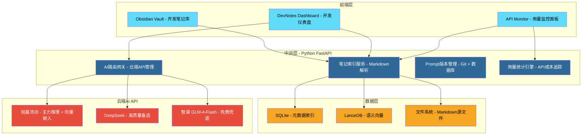
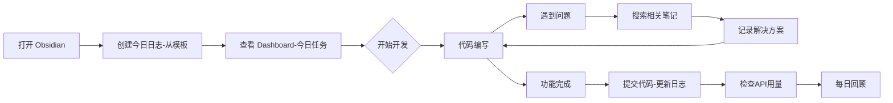

# 开发笔记系统 — 基于本机环境的构建与部署指南

> [!abstract] 文档目的
> 本文档基于 [[计算机完整配置报告_Laser电脑]] 中记录的本地计算机实际硬件信息，结合 [[WeChat_Smart_Auto_Reply_Implementation_Plan]] 的架构设计（纯云端API版），为"微信智能自动回复系统"项目规划一套适配当前开发环境的开发笔记系统。

---

## 一、本机环境能力评估

### 1.1 硬件概览

> [!info] 数据来源
> 以下数据基于 `e:/WeChat_Agent_Smart_Auto_reply/documents/计算机完整配置报告_Laser电脑.md` 的实测结果。

| 维度 | 实际参数 | 对本系统的意义 |
|------|---------|---------------|
| **CPU** | i7-12700H (14核20线程，P核4.7GHz) | 开发编译、多进程无压力 |
| **GPU** | RTX 3050 Ti 4GB GDDR6 | 不跑本地模型，GPU无压力 |
| **RAM** | 16GB DDR5 4800MHz | Electron + Python + IDE 绰绰有余 |
| **磁盘(C:)** | 仅剩34GB | 项目放E盘，不占C盘空间 |
| **磁盘(E:)** | 仅剩24GB | 存放项目代码 + 数据库（够用） |
| **网络** | 千兆有线 (192.168.10.7) | 云端API调用无瓶颈 |
| **OS** | Win11 Pro 25H2 | 兼容所有选型 |

### 1.2 关键发现

> [!success] 好消息
> **纯云端API架构**意味着：
> - 不需要大硬盘存放模型文件（节省 5-8GB）
> - 不需要大显存跑AI推理（4GB完全够桌面显示用）
> - 不需要装Ollama（少一个依赖，少一个服务要管）
> - 唯一的硬性要求：**有网**（微信本身也需要网）

### 1.3 已有环境资产

| 资产 | 版本 | 用途 |
|------|------|------|
| Python | 3.14.3 | 后端逻辑 |
| Node.js | v24.14.1 | 前端/Electron |
| Git | 2.54.0 | 版本控制 |
| VS Code / Trae CN | 已安装 | IDE |
| cryptography | 48.0.0 (已安装) | 加密库(可直接复用) |

---

## 二、开发笔记系统架构设计

### 2.1 系统定位

开发笔记系统 (DevNotes) 是[[WeChat_Smart_Auto_Reply_Implementation_Plan]]项目的配套开发工具，用于：

1. **记录开发过程**：模块开发日志、API调试记录、性能测试数据
2. **管理AI Prompt**：人格模板Prompt的版本管理与A/B测试
3. **存储设计决策**：技术选型理由、架构变更记录、难点解决方案
4. **API用量追踪**：各API的调用次数、费用、延迟统计
5. **环境配置快照**：依赖版本锁定、环境变量模板

### 2.2 总体架构



### 2.3 笔记组织结构

```text
dev-notes/                          ← Obsidian Vault 根目录
├── 00-Inbox/                       ← 快速捕获收件箱
│   └── 2026-07-15-idea.md
├── 10-Architecture/                ← 架构设计笔记
│   ├── 系统架构决策记录.md
│   ├── 消息引擎选型分析.md
│   └── 数据流设计.md
├── 20-Modules/                     ← 模块开发笔记
│   ├── 消息监测模块/
│   │   ├── wxauto集成日志.md
│   │   ├── 消息分类实现.md
│   │   └── 性能测试记录.md
│   ├── AI推理模块/
│   │   ├── Prompt工程迭代.md
│   │   ├── RAG检索效果评估.md
│   │   └── API切换测试.md
│   └── 安全模块/
│       ├── SQLCipher踩坑记录.md
│       └── 加密性能基准.md
├── 30-API/                         ← API集成笔记
│   ├── 可用API方案对比.md
│   ├── DeepSeek集成配置.md
│   ├── 硅基流动配置.md
│   └── API用量日报模板.md
├── 40-Environment/                 ← 环境配置笔记
│   ├── 依赖版本清单.md
│   ├── 环境变量模板.md
│   └── 磁盘清理日志.md
├── 50-Testing/                     ← 测试验证笔记
│   ├── 单元测试覆盖报告.md
│   ├── 集成测试用例.md
│   └── 性能基准测试.md
├── 90-Templates/                   ← 笔记模板
│   ├── 每日开发日志模板.md
│   ├── API集成记录模板.md
│   └── Bug记录模板.md
└── Dashboard.md                    ← 开发总览仪表盘
```

---

## 三、技术选型（纯API版）

| 组件 | 选定方案 | 选型理由 |
|------|---------|---------|
| **AI推理** | 云端API（硅基流动/DeepSeek/智谱） | 免费额度够用，质量高，零本地资源占用 |
| **嵌入向量** | 硅基流动 BGE-M3 API | ¥0.35/百万tokens，无需本地下载模型 |
| **数据库** | SQLite（元数据索引）| 轻量，笔记量级足够 |
| **向量库** | LanceDB | 嵌入式，无需独立服务 |
| **后端框架** | Python FastAPI | Python生态与AI工具链无缝集成 |
| **前端/笔记** | Obsidian（原生客户端）| 现成优秀工具，专注系统逻辑 |

> [!tip] 与旧方案的区别
> 砍掉了 Ollama、本地模型下载、GPU显存焦虑、模型存放路径配置。直接用 `openai` Python SDK 调 OpenAI 兼容接口，一份代码适配所有API。

---

## 四、完整AI API方案

### 4.1 推荐API与费用

| API 服务 | 免费额度 | 模型 | 价格 | 角色 |
|----------|---------|------|------|------|
| **智谱AI** | GLM-4-Flash **完全免费** | glm-4-flash | ¥0 | 首选白嫖 |
| **硅基流动** | 注册送额度 | Qwen2.5-7B-Instruct | ¥0.35/百万tokens | 主力推理 |
| **DeepSeek** | 注册送500万tokens | deepseek-chat (V3) | ¥1/百万tokens | 高质量备选 |
| **硅基流动** | 同上 | BAAI/bge-m3 (嵌入) | ¥0.35/百万tokens | RAG向量化 |

**月成本**（按每天100条微信消息，200 tokens/条）：**¥0 ~ ¥0.5**

### 4.2 API配置命令

```powershell
# 硅基流动（推荐主力，推理+嵌入都用它）
setx SILICONFLOW_API_KEY "sk-your-key"

# DeepSeek（高质量备选）
setx DEEPSEEK_API_KEY "sk-your-key"

# 智谱AI（免费兜底）
setx ZHIPUAI_API_KEY "your-key"
```

### 4.3 API智能路由器（核心代码）

```python
# backend/api_router.py
import os
from enum import Enum
from openai import OpenAI
from typing import AsyncGenerator

class AIProvider(Enum):
    SILICONFLOW = "siliconflow"
    DEEPSEEK = "deepseek"
    ZHIPU = "zhipu"

class AIRouter:
    PROVIDER_CONFIG = {
        AIProvider.SILICONFLOW: {
            "base_url": "https://api.siliconflow.cn/v1",
            "chat_model": "Qwen/Qwen2.5-7B-Instruct",
            "embed_model": "BAAI/bge-m3",
            "api_key_env": "SILICONFLOW_API_KEY",
        },
        AIProvider.DEEPSEEK: {
            "base_url": "https://api.deepseek.com",
            "chat_model": "deepseek-chat",
            "api_key_env": "DEEPSEEK_API_KEY",
        },
        AIProvider.ZHIPU: {
            "base_url": "https://open.bigmodel.cn/api/paas/v4",
            "chat_model": "glm-4-flash",
            "api_key_env": "ZHIPUAI_API_KEY",
        },
    }

    def __init__(self):
        self._clients = {}
        self.primary = AIProvider.SILICONFLOW
        self.fallback = AIProvider.ZHIPU

    def _get_client(self, provider: AIProvider) -> OpenAI:
        if provider not in self._clients:
            cfg = self.PROVIDER_CONFIG[provider]
            key = os.getenv(cfg["api_key_env"])
            if not key:
                raise ValueError(f"未设置 {cfg['api_key_env']}")
            self._clients[provider] = OpenAI(api_key=key, base_url=cfg["base_url"])
        return self._clients[provider]

    async def chat(self, messages: list, stream: bool = True) -> AsyncGenerator[str, None]:
        for provider in [self.primary, self.fallback]:
            try:
                client = self._get_client(provider)
                model = self.PROVIDER_CONFIG[provider]["chat_model"]
                resp = client.chat.completions.create(
                    model=model, messages=messages,
                    temperature=0.7, max_tokens=512,
                    stream=stream, timeout=10,
                )
                if stream:
                    for chunk in resp:
                        if chunk.choices[0].delta.content:
                            yield chunk.choices[0].delta.content
                else:
                    yield resp.choices[0].message.content
                return
            except Exception as e:
                print(f"[Router] {provider.value} 失败: {e}")
                continue
        raise Exception("所有API不可用")

    def embed(self, text: str) -> list:
        client = self._get_client(AIProvider.SILICONFLOW)
        return client.embeddings.create(
            model=self.PROVIDER_CONFIG[AIProvider.SILICONFLOW]["embed_model"],
            input=text
        ).data[0].embedding
```

---

## 五、环境配置步骤

### 5.1 磁盘空间规划

```text
E:\WeChat_Agent_Smart_Auto_reply\  ← 项目根目录（24GB可用）
├── backend\                        ← Python后端代码
├── electron\                       ← Electron前端代码
├── documents\                      ← 方案文档
├── data\                           ← 运行时数据
│   ├── sqlite\                     ← SQLite数据库（<50MB）
│   └── lancedb\                    ← 向量索引（<200MB）
└── backups\                        ← 加密备份
```

不再需要 Ollama模型目录、Python虚拟环境也可以放E盘。

### 5.2 一键环境配置脚本

```powershell
# setup_env.ps1 — 纯API版环境配置
Write-Host "=== 微信智能助手 — 开发环境配置（纯API版） ===" -ForegroundColor Cyan

$PROJECT_ROOT = "E:\WeChat_Agent_Smart_Auto_reply"

# === API 密钥（请替换为实际值） ===
[Environment]::SetEnvironmentVariable('SILICONFLOW_API_KEY', 'sk-your-key', 'User')
[Environment]::SetEnvironmentVariable('DEEPSEEK_API_KEY', 'sk-your-key', 'User')
[Environment]::SetEnvironmentVariable('ZHIPUAI_API_KEY', 'your-key', 'User')

# === 项目路径 ===
[Environment]::SetEnvironmentVariable('WXA_PROJECT_ROOT', $PROJECT_ROOT, 'User')
[Environment]::SetEnvironmentVariable('WXA_DATA_DIR', "$PROJECT_ROOT\data\sqlite", 'User')
[Environment]::SetEnvironmentVariable('WXA_VECTOR_DIR', "$PROJECT_ROOT\data\lancedb", 'User')
[Environment]::SetEnvironmentVariable('WXA_BACKUP_DIR', "$PROJECT_ROOT\backups", 'User')

Write-Host "`n=== 配置完成！请重启终端 ===" -ForegroundColor Yellow
Write-Host "需要手动申请的API密钥:" -ForegroundColor Yellow
Write-Host "  1. 硅基流动 (主力): https://siliconflow.cn" -ForegroundColor White
Write-Host "  2. DeepSeek (备选): https://platform.deepseek.com" -ForegroundColor White
Write-Host "  3. 智谱AI (免费兜底): https://open.bigmodel.cn" -ForegroundColor White
```

### 5.3 Python环境

```powershell
cd E:\WeChat_Agent_Smart_Auto_reply
python -m venv .venv
.venv\Scripts\Activate.ps1
pip install -r backend\requirements.txt
```

### 5.4 Obsidian Vault 初始化

```powershell
mkdir E:\WeChat_Agent_Smart_Auto_reply\dev-notes
cd E:\WeChat_Agent_Smart_Auto_reply\dev-notes
mkdir 00-Inbox, 10-Architecture, 20-Modules, 30-API, 40-Environment, 50-Testing, 90-Templates
# 用 Obsidian 打开此文件夹作为 Vault
```

---

## 六、核心功能模块实现

### 6.1 笔记索引服务

```python
# backend/notes_indexer.py — Markdown笔记解析与索引
import re, yaml, json, sqlite3
from pathlib import Path
from dataclasses import dataclass
from typing import List, Dict, Optional

@dataclass
class NoteMeta:
    file_path: str; title: str; tags: List[str]
    status: str; word_count: int; summary: str

class NotesIndexer:
    def __init__(self, vault_path: str, db_path: str):
        self.vault_path = Path(vault_path)
        self.conn = sqlite3.connect(db_path)
        self.conn.execute("""
            CREATE TABLE IF NOT EXISTS notes_index (
                file_path TEXT PRIMARY KEY, title TEXT, tags TEXT,
                status TEXT, word_count INTEGER, summary TEXT,
                last_indexed TIMESTAMP DEFAULT CURRENT_TIMESTAMP
            )
        """)
        self.conn.commit()
    
    def index_all(self):
        for md_file in self.vault_path.rglob("*.md"):
            self.index_file(md_file)
    
    def index_file(self, file_path: Path):
        content = file_path.read_text(encoding='utf-8')
        fm_match = re.match(r'^---\n(.*?)\n---', content, re.DOTALL)
        fm = yaml.safe_load(fm_match.group(1)) if fm_match else {}
        title_match = re.search(r'^#\s+(.+)$', content, re.MULTILINE)
        title = title_match.group(1) if title_match else file_path.stem
        clean = re.sub(r'```[\s\S]*?```', '', content)
        clean = re.sub(r'^---[\s\S]*?---', '', clean)
        word_count = len(clean.replace('\n','').replace(' ',''))
        
        self.conn.execute("""
            INSERT OR REPLACE INTO notes_index VALUES (?, ?, ?, ?, ?, ?, CURRENT_TIMESTAMP)
        """, (str(file_path.relative_to(self.vault_path)), title,
              json.dumps(fm.get('tags',[])), fm.get('status','draft'),
              word_count, clean.strip()[:200]))
        self.conn.commit()
```

### 6.2 API用量追踪

```python
# backend/api_usage_tracker.py
import time, sqlite3
from datetime import datetime

class APIUsageTracker:
    PRICING = {
        ("siliconflow", "Qwen/Qwen2.5-7B-Instruct"): 0.35,
        ("deepseek", "deepseek-chat"): 1.0,
        ("zhipu", "glm-4-flash"): 0.0,  # 免费
    }

    def __init__(self, db_conn):
        self.db = db_conn
        self.db.execute("""
            CREATE TABLE IF NOT EXISTS api_usage (
                id INTEGER PRIMARY KEY AUTOINCREMENT,
                provider TEXT, model TEXT,
                prompt_tokens INTEGER, completion_tokens INTEGER,
                latency_ms INTEGER, cost REAL, success INTEGER,
                error_msg TEXT, timestamp REAL
            )
        """)
        self.db.commit()
    
    def record(self, provider, model, prompt_tokens, completion_tokens, latency_ms, success, error_msg=""):
        cost = (prompt_tokens + completion_tokens) / 1_000_000 * self.PRICING.get((provider, model), 0)
        self.db.execute("""
            INSERT INTO api_usage VALUES (NULL, ?, ?, ?, ?, ?, ?, ?, ?, ?)
        """, (provider, model, prompt_tokens, completion_tokens, latency_ms, cost, int(success), error_msg, time.time()))
        self.db.commit()
    
    def today_stats(self) -> dict:
        today = datetime.now().replace(hour=0, minute=0, second=0).timestamp()
        rows = self.db.execute("""
            SELECT provider, COUNT(*), SUM(prompt_tokens+completion_tokens),
                   AVG(latency_ms), SUM(cost), SUM(CASE WHEN success=0 THEN 1 ELSE 0 END)
            FROM api_usage WHERE timestamp >= ? GROUP BY provider
        """, (today,)).fetchall()
        stats = {}
        for r in rows:
            stats[r[0]] = {"calls": r[1], "tokens": r[2] or 0, "avg_ms": round(r[3] or 0), "cost": round(r[4] or 0, 4), "errors": r[5]}
        stats["_total_cost"] = round(sum(s["cost"] for s in stats.values()), 4)
        return stats
```

---

## 七、测试验证流程

### 7.1 环境验证

```powershell
# verify_env.ps1
Write-Host "=== 环境验证 ===" -ForegroundColor Cyan
python --version; node --version

$keys = @('SILICONFLOW_API_KEY', 'DEEPSEEK_API_KEY', 'ZHIPUAI_API_KEY')
foreach ($k in $keys) {
    $v = [Environment]::GetEnvironmentVariable($k, 'User')
    Write-Host ("[OK] $k" -f $(if($v){'Green'}else{'Yellow'})) $(if($v){''}else{'(未配置)'})
}

Get-PSDrive C, E | ForEach-Object {
    $free = [math]::Round($_.Free/1GB, 1)
    Write-Host "$($_.Name): 剩余 $free GB"
}
```

### 7.2 API连通性测试

```python
# test_apis.py
import os, time
from openai import OpenAI

CONFIGS = {
    "硅基流动": {"url": "https://api.siliconflow.cn/v1", "key_env": "SILICONFLOW_API_KEY", "model": "Qwen/Qwen2.5-7B-Instruct"},
    "DeepSeek":  {"url": "https://api.deepseek.com", "key_env": "DEEPSEEK_API_KEY", "model": "deepseek-chat"},
    "智谱AI":    {"url": "https://open.bigmodel.cn/api/paas/v4", "key_env": "ZHIPUAI_API_KEY", "model": "glm-4-flash"},
}

for name, cfg in CONFIGS.items():
    key = os.getenv(cfg["key_env"])
    if not key: print(f"  {name}: 跳过（未配置）"); continue
    try:
        client = OpenAI(api_key=key, base_url=cfg["url"])
        start = time.time()
        r = client.chat.completions.create(model=cfg["model"], messages=[{"role":"user","content":"你好"}], max_tokens=20)
        ms = (time.time()-start)*1000
        print(f"  {name}: OK - {ms:.0f}ms -> {r.choices[0].message.content[:30]}")
    except Exception as e:
        print(f"  {name}: 失败 - {e}")
```

---

## 八、每日开发工作流



```powershell
# 每日启动
cd E:\WeChat_Agent_Smart_Auto_reply
.venv\Scripts\Activate.ps1
python test_apis.py       # 验证API

# 每日结束
python backend/stats.py   # 查看今日API用量
git add . && git commit -m "dev: $(Get-Date -Format 'yyyy-MM-dd')"
```

---

## 九、总结

| 决策点 | 选择 | 原因 |
|--------|------|------|
| AI推理 | 纯云端API | 微信需联网，本地LLM无意义 |
| 主力API | 硅基流动 Qwen2.5-7B | ¥0.35/百万tokens，中文优秀 |
| 免费兜底 | 智谱 GLM-4-Flash | 完全免费 |
| 向量嵌入 | 硅基流动 BGE-M3 | 统一调用，无需本地模型 |
| 笔记工具 | Obsidian | 原生Markdown + Wikilink |
| 月成本 | **¥0 ~ ¥0.5** | 几乎不花钱 |

> [!success] 一句话总结
> 系统极简：消息监测(local) → API路由(local) → 云端AI → 回复。不占硬盘、不占GPU、不用Ollama。代码量减少约30%，安装步骤减少一半。微信有网就能用。
